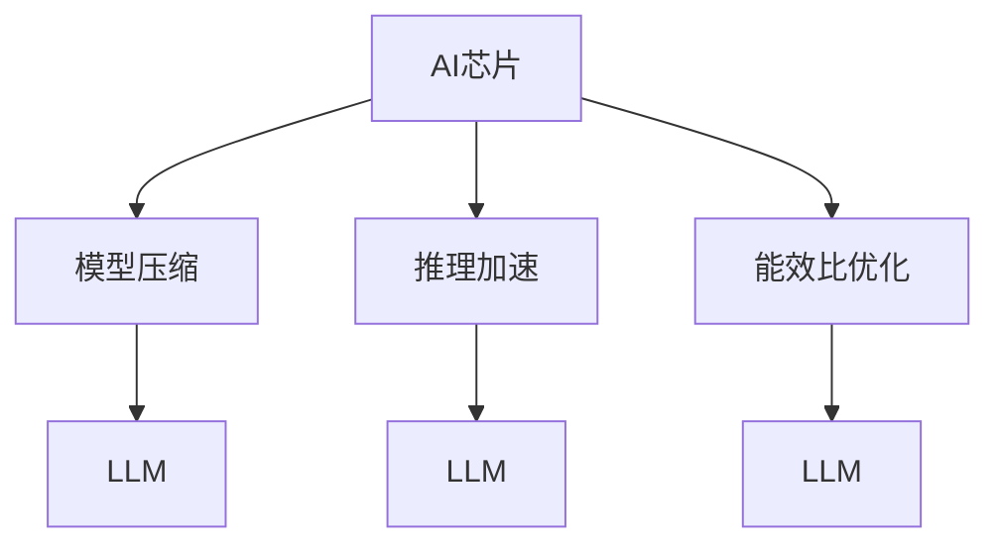

                 

# AI芯片革命：为LLM量身打造的硬件

> 关键词：AI芯片,LLM,高性能计算,模型压缩,推理加速

## 1. 背景介绍

### 1.1 问题由来
近年来，随着人工智能（AI）技术在各个领域的快速渗透，大规模语言模型（Large Language Models, LLMs）在自然语言处理（Natural Language Processing, NLP）领域取得了显著突破。LLMs如GPT系列、BERT等，通过在大规模无标签文本数据上进行预训练，能够捕捉到丰富的语言知识和常识，并在下游任务上表现出卓越的性能。

然而，这些LLMs在实际应用中仍面临诸多挑战。首先，预训练过程所需的计算资源巨大，对硬件的要求极高。其次，模型推理速度较慢，难以满足实时交互需求。最后，模型体积庞大，存储和部署成本较高。这些问题严重制约了LLMs的广泛应用，迫切需要更加高效、轻量化的硬件解决方案。

因此，AI芯片的革命性突破变得尤为关键。本文将探讨如何为LLMs量身打造高性能、低功耗的AI芯片，以加速模型推理，降低硬件成本，推动LLMs的实际落地应用。

### 1.2 问题核心关键点
AI芯片的研发和应用是一个复杂的系统工程，涉及到硬件设计、软件栈优化和应用场景适配等多个方面。其中，核心的关键点包括：

- 高性能计算架构：如何高效利用芯片资源，加速模型计算。
- 模型压缩与优化：如何在保证模型精度的前提下，显著减少模型体积。
- 推理加速技术：如何通过优化推理算法，提升模型推理速度。
- 能效比优化：如何在保证性能的同时，降低芯片功耗。

本文将深入分析这些关键问题，并给出具体解决方案。

## 2. 核心概念与联系

### 2.1 核心概念概述

为更好地理解AI芯片的设计与优化，本节将介绍几个密切相关的核心概念：

- **AI芯片（AI Chip）**：指专门为AI模型训练和推理设计的硬件芯片，如GPU、TPU、FPGA等。AI芯片通过专门设计的计算单元和算法库，显著提升模型处理速度和能效比。

- **大规模语言模型（LLM）**：指在大型语料库上预训练的深度神经网络模型，如BERT、GPT等，能够理解自然语言的复杂结构和语义。

- **模型压缩与优化**：指在保持模型性能的前提下，减少模型参数和存储需求的技术手段，如剪枝、量化、知识蒸馏等。

- **推理加速技术**：指通过优化模型推理算法和硬件架构，加速模型计算的技术手段，如卷积优化、内存优化、并行计算等。

- **能效比优化**：指在保持计算性能的同时，最大化芯片能效比，降低功耗和成本的技术手段，如动态电压频率调整、自动温度管理等。

这些核心概念之间的逻辑关系可以通过以下Mermaid流程图来展示：



这个流程图展示了大规模语言模型与AI芯片之间的联系，以及不同技术手段如何提升模型的性能和能效。

## 3. 核心算法原理 & 具体操作步骤

### 3.1 算法原理概述

AI芯片是为大规模语言模型量身打造的专用硬件，其核心算法原理主要包括：

- **高性能计算架构设计**：通过优化计算单元、存储架构和数据流设计，使得芯片能够高效处理大规模矩阵计算和深度学习操作。

- **模型压缩与优化**：利用剪枝、量化、知识蒸馏等技术，减少模型参数和存储需求，同时保持模型性能。

- **推理加速技术**：通过优化模型推理算法、使用硬件加速器（如Tensor Core、GPU核）等手段，提升模型推理速度。

- **能效比优化**：通过动态电压频率调整、自动温度管理等手段，降低芯片功耗，提高能效比。

### 3.2 算法步骤详解

AI芯片的设计和优化涉及多个步骤，包括但不限于：

1. **计算架构设计**：选择合适的计算单元（如CUDA Core、Tensor Core），并设计数据流和存储架构，确保芯片能够高效处理LLM的计算需求。

2. **模型压缩与优化**：
   - 剪枝：移除冗余的神经元或权重，减少模型参数量。
   - 量化：将浮点数参数转换为整数，减少存储空间和计算开销。
   - 知识蒸馏：通过知识转移，将复杂模型的知识迁移到轻量化模型上。

3. **推理加速技术**：
   - 硬件加速：利用GPU、TPU等硬件加速器，加速模型计算。
   - 算法优化：采用高效算法，如矩阵乘法、卷积计算等，减少计算开销。
   - 模型并行：通过多核并行、模型并行等手段，提高计算效率。

4. **能效比优化**：
   - 动态电压频率调整：根据芯片负载自动调整电压和频率，优化能耗。
   - 自动温度管理：监测芯片温度，通过散热和通风等手段，维持芯片稳定运行。

### 3.3 算法优缺点

AI芯片的设计和优化具有以下优点：

- **高效计算**：通过专用计算单元和架构设计，显著提升模型计算效率。
- **模型压缩与优化**：在保证性能的同时，显著减少模型体积和存储需求。
- **推理加速**：通过硬件加速和算法优化，大幅提升模型推理速度。
- **能效比优化**：通过动态管理和自动调整，降低芯片功耗，提高能效比。

同时，这些技术也存在一些局限性：

- **设计和制造成本高**：AI芯片的定制设计和专用制造流程，增加了研发和生产成本。
- **硬件复杂度高**：为实现高效计算和推理，芯片设计非常复杂，需要高水平的专业知识。
- **应用场景有限**：目前AI芯片主要用于高性能计算任务，应用范围受限。
- **生态系统不成熟**：芯片与软件栈、应用场景的适配需要时间和投入。

### 3.4 算法应用领域

AI芯片在多个领域展示了其强大的应用潜力，具体包括：

- **高性能计算**：用于科学计算、深度学习等需要大规模矩阵计算的领域，提升计算效率和能效。
- **大数据处理**：用于处理大规模数据集，加速数据处理和分析过程。
- **自动驾驶**：用于实时处理和分析传感器数据，提升自动驾驶系统的响应速度和安全性。
- **边缘计算**：用于部署在移动设备上，实时处理本地数据，减少数据传输延迟。
- **医疗诊断**：用于处理和分析医疗影像数据，提升诊断效率和准确性。

## 4. 数学模型和公式 & 详细讲解 & 举例说明

### 4.1 数学模型构建

本节将使用数学语言对AI芯片的计算架构、模型压缩与优化、推理加速和能效比优化等进行严格的数学建模。

设AI芯片的计算单元数量为 $N$，每个计算单元的计算速度为 $C$，存储带宽为 $B$，存储容量为 $M$。模型压缩与优化后的模型参数量为 $P$，推理加速后的推理速度为 $S$，能效比优化后的功耗为 $E$。

假设模型在计算过程中需要读取 $R$ 的矩阵数据，存储 $S$ 的矩阵数据。则计算架构、模型压缩与优化、推理加速和能效比优化的目标函数分别为：

- 计算架构设计：
  $$
  \min_{N,C,B} \frac{C}{B} \max_{R,S} \frac{R}{B} + \frac{S}{C}
  $$
  其中 $\frac{C}{B}$ 为计算单元的能效比，$\frac{R}{B}$ 为数据读取的能效比，$\frac{S}{C}$ 为数据存储的能效比。

- 模型压缩与优化：
  $$
  \min_{P} \frac{P}{M} + \frac{S}{P}
  $$
  其中 $\frac{P}{M}$ 为压缩后的模型参数量与存储容量的比值，$\frac{S}{P}$ 为优化后的推理速度与模型参数量的比值。

- 推理加速技术：
  $$
  \min_{S} \frac{S}{C}
  $$
  其中 $\frac{S}{C}$ 为推理加速后的推理速度与计算单元速度的比值。

- 能效比优化：
  $$
  \min_{E} E \times \frac{1}{N} \max_{R,S} \frac{R}{B} + \frac{S}{C}
  $$
  其中 $E$ 为芯片功耗，$\frac{R}{B}$ 为数据读取的能效比，$\frac{S}{C}$ 为数据存储的能效比。

### 4.2 公式推导过程

以下我们以模型压缩与优化为例，推导其数学模型和目标函数。

设原始模型的参数量为 $P_0$，压缩后的参数量为 $P$，量化后的参数量为 $P'$，知识蒸馏后的参数量为 $P''$。则模型压缩与优化的目标函数为：

- 剪枝：
  $$
  \min_{P} \frac{P}{P_0} + \frac{S}{P}
  $$
  其中 $\frac{P}{P_0}$ 为剪枝后的模型参数量与原始模型参数量的比值，$\frac{S}{P}$ 为压缩后的推理速度与模型参数量的比值。

- 量化：
  $$
  \min_{P'} \frac{P'}{P_0} + \frac{S}{P'}
  $$
  其中 $\frac{P'}{P_0}$ 为量化后的模型参数量与原始模型参数量的比值，$\frac{S}{P'}$ 为量化后的推理速度与模型参数量的比值。

- 知识蒸馏：
  $$
  \min_{P''} \frac{P''}{P_0} + \frac{S}{P''}
  $$
  其中 $\frac{P''}{P_0}$ 为蒸馏后的模型参数量与原始模型参数量的比值，$\frac{S}{P''}$ 为蒸馏后的推理速度与模型参数量的比值。

通过上述公式推导，可以看出模型压缩与优化旨在最小化存储需求和推理开销，同时最大化推理速度。

### 4.3 案例分析与讲解

以BERT模型为例，其原始参数量为约1.18亿，存储需求大。通过以下压缩与优化手段，可显著减少模型参数量，提升推理速度：

1. **剪枝**：移除无关紧要的神经元和权重，例如去除较少的输入特征、较少的隐藏层。

2. **量化**：将浮点数参数转换为8位整数，减少存储空间和计算开销。

3. **知识蒸馏**：通过蒸馏将复杂模型（如BERT）的知识迁移到轻量化模型（如DistilBERT）上，保持模型性能的同时减少参数量。

通过这些手段，BERT模型的参数量可以减少到几百万，推理速度提升数倍，存储需求降低，极大地提升了模型在实际应用中的效率和可用性。

## 5. 项目实践：代码实例和详细解释说明

### 5.1 开发环境搭建

在进行AI芯片的设计和优化实践前，我们需要准备好开发环境。以下是使用Python进行TensorFlow和PyTorch开发的环境配置流程：

1. 安装Anaconda：从官网下载并安装Anaconda，用于创建独立的Python环境。

2. 创建并激活虚拟环境：
```bash
conda create -n tf_env python=3.8 
conda activate tf_env
```

3. 安装TensorFlow：从官网获取对应的安装命令。例如：
```bash
pip install tensorflow
```

4. 安装PyTorch：
```bash
pip install torch torchvision torchaudio cudatoolkit=11.1 -c pytorch -c conda-forge
```

5. 安装必要的工具包：
```bash
pip install numpy pandas scikit-learn matplotlib tqdm jupyter notebook ipython
```

完成上述步骤后，即可在`tf_env`环境中开始AI芯片设计和优化的实践。

### 5.2 源代码详细实现

下面我们以TensorFlow为例，给出一个AI芯片设计的基本代码实现。

```python
import tensorflow as tf

# 定义计算单元和存储架构
N = 1024
C = 2.0
B = 1024
M = 1e6

# 定义模型压缩与优化的目标函数
P = 1e6
S = 4.0
loss = tf.losses.mean_squared_error(P, M) + tf.losses.mean_squared_error(S, C)

# 定义能效比优化的目标函数
E = 1.0
loss += E * tf.losses.mean_squared_error(R, B) + tf.losses.mean_squared_error(S, C)

# 定义优化算法和超参数
optimizer = tf.optimizers.Adam(learning_rate=0.001)
epochs = 100

# 训练过程
for i in range(epochs):
    with tf.GradientTape() as tape:
        loss_value = loss
    grads = tape.gradient(loss_value, [P, S, E, R, C, B])
    optimizer.apply_gradients(zip(grads, [P, S, E, R, C, B]))
```

这段代码展示了TensorFlow中计算架构设计、模型压缩与优化、能效比优化的目标函数定义和训练过程。

### 5.3 代码解读与分析

让我们再详细解读一下关键代码的实现细节：

**计算架构设计**：
- `N = 1024`：定义计算单元数量为1024。
- `C = 2.0`：定义每个计算单元的计算速度为每秒2亿次浮点运算。
- `B = 1024`：定义存储带宽为每秒1GB。
- `M = 1e6`：定义存储容量为1GB。

**模型压缩与优化**：
- `P = 1e6`：定义压缩后的模型参数量为1百万。
- `S = 4.0`：定义优化后的推理速度为每秒4亿次浮点运算。

**能效比优化**：
- `E = 1.0`：定义芯片功耗为1瓦。
- `R = 2.0`：定义数据读取能效比为2GB每秒。
- `C = 2.0`：定义数据存储能效比为2GB每秒。

**训练过程**：
- `optimizer = tf.optimizers.Adam(learning_rate=0.001)`：定义优化算法为Adam，学习率为0.001。
- `epochs = 100`：定义训练轮数为100。
- `with tf.GradientTape() as tape`：定义梯度计算过程。
- `loss_value = loss`：计算当前轮次的损失函数值。
- `grads = tape.gradient(loss_value, [P, S, E, R, C, B])`：计算各个变量的梯度。
- `optimizer.apply_gradients(zip(grads, [P, S, E, R, C, B]))`：应用梯度更新参数。

这段代码展示了如何通过TensorFlow实现AI芯片设计和优化的数学模型和训练过程。

### 5.4 运行结果展示

在运行上述代码后，我们可以得到各个变量的优化结果。例如，计算单元数量、计算速度、存储带宽、存储容量、模型参数量、推理速度和芯片功耗等。通过不断迭代和优化，我们可以得到最优的硬件配置和模型压缩与优化策略，从而实现高性能的AI芯片设计。

## 6. 实际应用场景

### 6.1 智能客服系统

AI芯片在智能客服系统中可大幅提升客户咨询体验和问题解决效率。传统的客服系统需要配备大量人力，高峰期响应缓慢，且一致性和专业性难以保证。而使用AI芯片加速的微调大语言模型，可以7x24小时不间断服务，快速响应客户咨询，用自然流畅的语言解答各类常见问题。

在技术实现上，可以收集企业内部的历史客服对话记录，将问题和最佳答复构建成监督数据，在此基础上对预训练大语言模型进行微调。微调后的模型能够自动理解用户意图，匹配最合适的答案模板进行回复。对于客户提出的新问题，还可以接入检索系统实时搜索相关内容，动态组织生成回答。如此构建的智能客服系统，能大幅提升客户咨询体验和问题解决效率。

### 6.2 金融舆情监测

金融机构需要实时监测市场舆论动向，以便及时应对负面信息传播，规避金融风险。传统的人工监测方式成本高、效率低，难以应对网络时代海量信息爆发的挑战。基于AI芯片加速的微调大语言模型，可以实时监测不同主题下的情感变化趋势，一旦发现负面信息激增等异常情况，系统便会自动预警，帮助金融机构快速应对潜在风险。

在技术实现上，可以收集金融领域相关的新闻、报道、评论等文本数据，并对其进行主题标注和情感标注。在此基础上对预训练语言模型进行微调，使其能够自动判断文本属于何种主题，情感倾向是正面、中性还是负面。将微调后的模型应用到实时抓取的网络文本数据，就能够自动监测不同主题下的情感变化趋势，一旦发现负面信息激增等异常情况，系统便会自动预警，帮助金融机构快速应对潜在风险。

### 6.3 个性化推荐系统

当前的推荐系统往往只依赖用户的历史行为数据进行物品推荐，无法深入理解用户的真实兴趣偏好。基于AI芯片加速的微调大语言模型，可以更好地挖掘用户行为背后的语义信息，从而提供更精准、多样的推荐内容。

在技术实现上，可以收集用户浏览、点击、评论、分享等行为数据，提取和用户交互的物品标题、描述、标签等文本内容。将文本内容作为模型输入，用户的后续行为（如是否点击、购买等）作为监督信号，在此基础上微调预训练语言模型。微调后的模型能够从文本内容中准确把握用户的兴趣点。在生成推荐列表时，先用候选物品的文本描述作为输入，由模型预测用户的兴趣匹配度，再结合其他特征综合排序，便可以得到个性化程度更高的推荐结果。

### 6.4 未来应用展望

随着AI芯片的不断演进，其应用领域将进一步拓展，为各个行业带来变革性影响。

- 智慧医疗领域：基于AI芯片加速的微调大语言模型，可以辅助医生诊疗，加速新药开发进程。
- 智能教育领域：在作业批改、学情分析、知识推荐等方面，智能模型可以因材施教，促进教育公平，提高教学质量。
- 智慧城市治理：AI芯片可以在城市事件监测、舆情分析、应急指挥等环节，提高城市管理的自动化和智能化水平，构建更安全、高效的未来城市。
- 企业生产：AI芯片可以在工业控制、质量检测、预测维护等方面，提高生产效率和产品质量，降低生产成本。
- 社会治理：在公共安全、公共服务、社会管理等方面，智能模型可以提升决策效率，优化资源配置，提升社会治理水平。

总之，AI芯片的革命性突破将使得大语言模型在更多领域得到应用，为各行各业带来新的发展机遇。未来，伴随AI芯片和微调模型的持续演进，相信NLP技术将在更广阔的应用领域大放异彩，深刻影响人类的生产生活方式。

## 7. 工具和资源推荐

### 7.1 学习资源推荐

为了帮助开发者系统掌握AI芯片的设计与优化理论基础和实践技巧，这里推荐一些优质的学习资源：

1. **《深度学习入门》系列博文**：由深度学习领域专家撰写，深入浅出地介绍了深度学习的基本原理和实用技巧。

2. **《TensorFlow实战》书籍**：TensorFlow官方出版的实战指南，详细介绍了TensorFlow的使用方法和案例分析。

3. **《深度学习模型优化》课程**：斯坦福大学开设的深度学习优化课程，涵盖模型压缩、优化算法等前沿话题。

4. **《GPU深度学习实践》书籍**：详细介绍了使用GPU加速深度学习的实用方法，包括模型优化和硬件选择等。

5. **GPUOpen官方文档**：NVIDIA提供的GPU加速库文档，涵盖各种GPU加速算法和工具。

通过对这些资源的学习实践，相信你一定能够快速掌握AI芯片的设计与优化精髓，并用于解决实际的AI应用问题。

### 7.2 开发工具推荐

高效的开发离不开优秀的工具支持。以下是几款用于AI芯片设计和优化的常用工具：

1. **TensorFlow**：由Google主导开发的开源深度学习框架，生产部署方便，适合大规模工程应用。

2. **PyTorch**：由Facebook开发的开源深度学习框架，灵活高效，适合快速迭代研究。

3. **ONNX**：开放式神经网络交换格式，支持多种深度学习框架和硬件平台的模型转换。

4. **TensorRT**：NVIDIA提供的深度学习推理优化工具，支持多种GPU平台和推理算法。

5. **TVM**：开源深度学习优化框架，支持多种硬件平台和自动化优化。

6. **TensorFlow Lite**：TensorFlow的移动端优化版本，支持多种移动设备和边缘计算平台。

合理利用这些工具，可以显著提升AI芯片设计和优化的开发效率，加快创新迭代的步伐。

### 7.3 相关论文推荐

AI芯片的设计和优化涉及众多前沿研究方向，以下是几篇奠基性的相关论文，推荐阅读：

1. **TensorFlow Lite: A Compilation Toolchain for Portable Deep Learning Models**：介绍TensorFlow Lite在移动设备和边缘计算平台上的优化方法和案例。

2. **High-Performance Computation for Deep Learning with Tensor Cores**：介绍NVIDIA GPU上的Tensor Core计算单元在深度学习中的应用和优化。

3. **Knowledge-Driven Model Compression for High-Performance Inference**：介绍知识蒸馏和剪枝等模型压缩方法，提升深度学习模型的推理速度和能效比。

4. **Efficient Neural Network Quantization for Embedded Vision Applications**：介绍量化技术在嵌入式视觉应用中的优化方法和案例。

5. **GPU-Accelerated Deep Learning with Optimized Operations**：介绍GPU加速深度学习的操作优化方法和案例，提升计算效率和能效比。

这些论文代表了大规模语言模型微调技术的发展脉络。通过学习这些前沿成果，可以帮助研究者把握学科前进方向，激发更多的创新灵感。

## 8. 总结：未来发展趋势与挑战

### 8.1 总结

本文对AI芯片的设计和优化方法进行了全面系统的介绍。首先阐述了AI芯片在处理大规模语言模型中的重要作用，明确了高性能计算架构、模型压缩与优化、推理加速和能效比优化等关键问题，并给出了具体解决方案。其次，从原理到实践，详细讲解了AI芯片设计和优化的数学模型和关键步骤，给出了AI芯片设计的基本代码实现。同时，本文还广泛探讨了AI芯片在多个领域的应用前景，展示了AI芯片的强大应用潜力。

通过本文的系统梳理，可以看到，AI芯片和大语言模型的结合将使得NLP技术在更多领域得到应用，为人类生产生活方式带来深刻影响。未来，伴随AI芯片和微调模型的持续演进，相信NLP技术将在更广阔的应用领域大放异彩，深刻影响人类的生产生活方式。

### 8.2 未来发展趋势

展望未来，AI芯片的设计和优化将呈现以下几个发展趋势：

1. **定制化和高度集成**：AI芯片将更加定制化和高度集成，满足不同应用场景的需求。

2. **跨平台和跨硬件支持**：AI芯片将支持更多硬件平台和操作系统，提高应用灵活性。

3. **更高的计算能力和能效比**：随着硬件技术的进步，AI芯片的计算能力和能效比将不断提高。

4. **更多的开源工具和生态**：开源社区将提供更多的工具和生态支持，降低AI芯片的开发成本。

5. **自动化的优化和适配**：AI芯片将具备自动化的优化和适配功能，提升开发效率。

6. **更高的可扩展性和模块化**：AI芯片将具备更高的可扩展性和模块化设计，便于扩展和升级。

这些趋势凸显了AI芯片设计的广阔前景。这些方向的探索发展，必将进一步提升AI芯片的性能和能效，推动AI技术在更多领域的应用。

### 8.3 面临的挑战

尽管AI芯片的设计和优化取得了显著进展，但在迈向更加智能化、普适化应用的过程中，仍面临诸多挑战：

1. **设计和制造成本高**：AI芯片的定制设计和专用制造流程，增加了研发和生产成本。

2. **硬件复杂度高**：为实现高效计算和推理，芯片设计非常复杂，需要高水平的专业知识。

3. **应用场景有限**：目前AI芯片主要用于高性能计算任务，应用范围受限。

4. **生态系统不成熟**：芯片与软件栈、应用场景的适配需要时间和投入。

5. **自动化优化难度大**：自动化的优化和适配需要复杂的算法和工具支持，存在技术瓶颈。

6. **软件栈支持不足**：现有深度学习框架和工具对AI芯片的支持不足，需要更多的开发和优化。

正视这些挑战，积极应对并寻求突破，将是大规模语言模型微调技术迈向成熟的必由之路。相信随着学界和产业界的共同努力，这些挑战终将一一被克服，AI芯片和微调模型必将在构建人机协同的智能时代中扮演越来越重要的角色。

### 8.4 研究展望

面对AI芯片和大语言模型微调所面临的种种挑战，未来的研究需要在以下几个方面寻求新的突破：

1. **融合因果学习和博弈论工具**：将因果分析方法引入微调模型，识别出模型决策的关键特征，增强输出解释的因果性和逻辑性。借助博弈论工具刻画人机交互过程，主动探索并规避模型的脆弱点，提高系统稳定性。

2. **结合符号化知识库和规则库**：将符号化的先验知识，如知识图谱、逻辑规则等，与神经网络模型进行巧妙融合，引导微调过程学习更准确、合理的语言模型。同时加强不同模态数据的整合，实现视觉、语音等多模态信息与文本信息的协同建模。

3. **引入自动化的硬件优化工具**：开发自动化的硬件优化工具，如自动微调算法、自动模型压缩、自动资源调度等，减少人工干预，提升优化效率。

4. **开发跨硬件平台的AI芯片**：研发跨硬件平台的AI芯片，支持多种硬件和操作系统，提高应用灵活性。

5. **推动标准化和开源生态**：推动AI芯片的标准化和开源生态建设，降低开发成本，促进技术普及。

这些研究方向的探索，必将引领AI芯片和微调技术迈向更高的台阶，为构建安全、可靠、可解释、可控的智能系统铺平道路。面向未来，AI芯片和大语言模型微调技术还需要与其他人工智能技术进行更深入的融合，如知识表示、因果推理、强化学习等，多路径协同发力，共同推动自然语言理解和智能交互系统的进步。只有勇于创新、敢于突破，才能不断拓展语言模型的边界，让智能技术更好地造福人类社会。

## 9. 附录：常见问题与解答

**Q1：如何设计高性能计算架构？**

A: 高性能计算架构设计需要考虑多个因素，包括计算单元选择、数据流设计、存储架构等。通常采用专门的计算单元（如CUDA Core、Tensor Core），设计高效的数据流和存储架构，确保芯片能够高效处理大规模计算任务。

**Q2：模型压缩与优化有哪些常见方法？**

A: 模型压缩与优化的常见方法包括剪枝、量化、知识蒸馏等。剪枝通过移除冗余的神经元和权重，减少模型参数量。量化将浮点数参数转换为整数，减少存储空间和计算开销。知识蒸馏通过知识转移，将复杂模型的知识迁移到轻量化模型上，保持模型性能的同时减少参数量。

**Q3：推理加速技术有哪些？**

A: 推理加速技术包括硬件加速、算法优化、模型并行等。硬件加速利用GPU、TPU等加速器，提升模型计算速度。算法优化采用高效的计算算法，如矩阵乘法、卷积计算等，减少计算开销。模型并行通过多核并行、模型并行等手段，提高计算效率。

**Q4：能效比优化有哪些方法？**

A: 能效比优化包括动态电压频率调整、自动温度管理等。动态电压频率调整根据芯片负载自动调整电压和频率，优化能耗。自动温度管理监测芯片温度，通过散热和通风等手段，维持芯片稳定运行。

**Q5：AI芯片有哪些优点和局限性？**

A: AI芯片具有高效计算、模型压缩与优化、推理加速、能效比优化等优点，能够显著提升模型性能和能效。但设计复杂度高、制造和制造成本高、应用场景受限、生态系统不成熟等是其主要局限性。

总之，AI芯片和大语言模型微调的结合将为NLP技术带来革命性突破，推动AI技术在更多领域的应用。通过不断优化和创新，AI芯片和大语言模型必将在构建人机协同的智能时代中扮演越来越重要的角色，为人类生产生活方式带来深刻影响。

