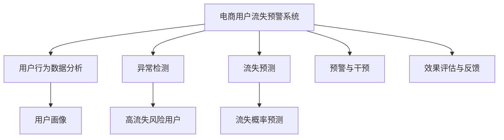

                 

# AI赋能的电商平台用户流失预警系统

> 关键词：电商用户流失预警系统, 人工智能, 机器学习, 深度学习, 神经网络, 用户行为分析, 用户流失预测, 异常检测

## 1. 背景介绍

### 1.1 问题由来

在当今快速变化的电商市场中，客户忠诚度的维护是一个至关重要的问题。许多电商平台每年都会流失大量用户，这种流失不仅会带来直接的经济损失，还会影响平台的品牌声誉和市场竞争力。因此，建立有效的用户流失预警系统，及时识别和干预用户流失的风险，成为电商平台亟待解决的问题。

### 1.2 问题核心关键点

用户流失预警系统的核心在于通过数据分析和机器学习技术，实时监控用户行为，预测可能流失的用户群体，并采取相应的策略进行挽留。具体而言，问题核心包括以下几个方面：

- **用户行为数据分析**：收集和分析用户的行为数据，如购买记录、浏览历史、评论反馈等，构建用户画像。
- **异常检测与分类**：识别出行为异常的用户，将其归类为高流失风险用户。
- **流失预测模型**：基于用户行为数据，构建机器学习模型进行流失预测，评估用户流失概率。
- **预警与干预**：根据预测结果，对高流失风险用户进行及时预警，并提供个性化挽留策略。
- **效果评估与反馈**：对预警和干预效果进行评估，持续优化模型和策略。

### 1.3 问题研究意义

建立用户流失预警系统，对于电商平台来说具有重要意义：

1. **提升用户留存率**：及时预警和干预用户流失，显著提升用户留存率，增加平台收益。
2. **优化用户体验**：通过个性化推荐和服务，改善用户体验，提高用户满意度。
3. **增强竞争力**：准确预测用户流失，有助于电商平台在激烈的市场竞争中保持优势。
4. **数据驱动决策**：以数据驱动决策，提高运营效率和决策科学性。
5. **推动业务创新**：基于数据洞察，推动业务模式和产品创新的探索。

## 2. 核心概念与联系

### 2.1 核心概念概述

为更好地理解用户流失预警系统的构建，本节将介绍几个密切相关的核心概念：

- **电商用户流失预警系统**：通过分析用户行为数据，构建机器学习模型，预测用户流失概率，并及时预警和干预的系统。
- **用户行为数据**：用户在电商平台上的各种操作记录，如浏览、点击、购买、评论等，用于构建用户画像和预测流失。
- **机器学习**：通过训练数据构建模型，进行用户行为分析、分类和预测的计算方法。
- **深度学习**：一类特殊机器学习，使用多层神经网络处理非线性、高维数据，显著提升预测精度。
- **神经网络**：一种类人脑结构的计算模型，包含多层感知器，用于模拟人脑的神经元网络。
- **异常检测**：识别出行为异常的个体，通常使用聚类、分类、时序分析等方法。
- **流失预测**：基于历史数据，使用机器学习模型预测用户未来流失概率的算法。

这些核心概念之间的逻辑关系可以通过以下Mermaid流程图来展示：



这个流程图展示了大语言模型的核心概念及其之间的关系：

1. 电商用户流失预警系统通过用户行为数据分析，构建用户画像。
2. 异常检测识别行为异常的用户，并归为高流失风险用户。
3. 流失预测基于用户行为数据，构建机器学习模型进行流失预测。
4. 预警与干预对高流失风险用户进行及时预警，并提供个性化挽留策略。
5. 效果评估与反馈对预警和干预效果进行评估，持续优化模型和策略。

## 3. 核心算法原理 & 具体操作步骤
### 3.1 算法原理概述

用户流失预警系统基于机器学习，通过分析用户行为数据，预测用户流失概率，并采取相应策略进行干预。主要包含以下几个步骤：

1. **数据收集与预处理**：收集用户行为数据，并进行清洗、转换等预处理工作，构建训练和测试数据集。
2. **特征工程**：设计特征，并进行特征选择和降维，构建输入向量。
3. **模型训练**：选择合适的机器学习模型，如逻辑回归、随机森林、神经网络等，进行模型训练和参数优化。
4. **异常检测**：使用聚类、分类等方法，识别出行为异常的用户。
5. **流失预测**：基于用户行为数据，使用模型进行流失概率预测。
6. **预警与干预**：根据预测结果，对高流失风险用户进行及时预警，并提供个性化挽留策略。
7. **效果评估**：使用准确率、召回率、F1-score等指标评估模型效果，并进行反馈优化。

### 3.2 算法步骤详解

#### 3.2.1 数据收集与预处理

电商用户行为数据主要包含：

- **交易数据**：用户的购买记录、订单信息、支付信息等。
- **浏览数据**：用户的页面浏览、点击、停留时间等。
- **互动数据**：用户的评论、评分、收藏、分享等。
- **属性数据**：用户的注册信息、基本信息、行为偏好等。

收集数据后，需要进行预处理：

- **缺失值处理**：填补或删除缺失数据。
- **特征转换**：将原始数据转换为模型可以处理的数值型或二值型数据。
- **特征缩放**：对数值型数据进行归一化或标准化处理。
- **特征选择**：选择最相关的特征，减少数据维度。
- **特征降维**：使用PCA、LDA等方法，对高维数据进行降维处理。

#### 3.2.2 特征工程

特征工程是构建机器学习模型的关键步骤，包含以下几个方面：

- **特征提取**：从原始数据中提取有用特征，如浏览深度、购买频率、停留时间等。
- **特征构造**：通过计算、组合等方式构造新特征，如连续购买天数、首次购买时间等。
- **特征选择**：使用特征选择算法，如卡方检验、互信息等，选择最优特征。
- **特征降维**：使用PCA、LDA等方法，对高维数据进行降维处理。

#### 3.2.3 模型训练

常用的流失预测模型包括逻辑回归、随机森林、神经网络等。这里以神经网络为例，简要介绍模型训练步骤：

1. **模型选择**：选择合适的神经网络结构，如多层感知器（MLP）、卷积神经网络（CNN）、循环神经网络（RNN）等。
2. **数据划分**：将数据集划分为训练集、验证集和测试集。
3. **损失函数**：选择合适的损失函数，如交叉熵、均方误差等。
4. **优化器**：选择合适的优化器，如Adam、SGD等。
5. **超参数调优**：调整学习率、批大小、迭代轮数等超参数，以优化模型性能。
6. **模型评估**：使用验证集对模型进行评估，选择合适的模型和超参数。

#### 3.2.4 异常检测

异常检测是识别高流失风险用户的重要步骤，主要方法包括：

- **聚类分析**：使用K-Means、层次聚类等方法，将用户聚为若干群组，识别异常用户。
- **分类算法**：使用SVM、随机森林等分类算法，训练分类器识别异常用户。
- **时序分析**：使用ARIMA、LSTM等方法，分析用户行为时间序列，识别异常行为。

#### 3.2.5 流失预测

流失预测主要基于用户行为数据，使用机器学习模型进行预测。常用的方法包括：

- **逻辑回归**：使用二分类模型，预测用户流失概率。
- **随机森林**：使用集成学习算法，预测用户流失概率。
- **神经网络**：使用多层神经网络，预测用户流失概率。

#### 3.2.6 预警与干预

预警与干预是用户流失预警系统的关键环节，主要步骤包括：

- **阈值设定**：根据预测结果，设定流失概率阈值，将高流失风险用户进行预警。
- **个性化策略**：根据用户画像和行为数据，提供个性化挽留策略，如优惠券、推荐商品等。
- **实施与跟踪**：实施挽留策略，并跟踪效果，记录用户行为变化。

#### 3.2.7 效果评估

效果评估是持续优化模型和策略的重要步骤，主要指标包括：

- **准确率**：预测正确流失用户的比例。
- **召回率**：预测正确流失用户的比例。
- **F1-score**：综合考虑准确率和召回率，评估模型效果。
- **ROC曲线**：绘制ROC曲线，评估模型分类能力。
- **AUC值**：计算AUC值，评估模型分类效果。

## 4. 数学模型和公式 & 详细讲解  
### 4.1 数学模型构建

电商用户流失预警系统构建基于监督学习，使用历史用户数据进行训练，预测未来流失概率。具体数学模型如下：

假设用户流失数据集为 $D=\{(x_i, y_i)\}_{i=1}^N, x_i \in \mathbb{R}^d, y_i \in \{0, 1\}$，其中 $x_i$ 为输入特征向量，$y_i$ 为流失标签。

设神经网络模型为 $f(x;\theta) = \sigma(W^Tx + b)$，其中 $\theta = (W, b)$ 为模型参数，$\sigma$ 为激活函数。

预测用户流失概率的模型为 $P(y=1|x;\theta) = f(x;\theta)/(1+f(x;\theta))$，即Sigmoid函数。

### 4.2 公式推导过程

以神经网络模型为例，推导用户流失预测的数学公式。

设神经网络模型为 $f(x;\theta) = \sigma(W^Tx + b)$，其中 $W$ 为权重矩阵，$b$ 为偏置项。

用户流失概率预测公式为：
$$
P(y=1|x;\theta) = \frac{f(x;\theta)}{1+f(x;\theta)}
$$

其中 $f(x;\theta) = \sigma(W^Tx + b)$，$\sigma$ 为激活函数，如ReLU、Sigmoid等。

以Sigmoid激活函数为例，推导过程如下：

设 $f(x;\theta) = \sigma(W^Tx + b)$，则：
$$
P(y=1|x;\theta) = \frac{\sigma(W^Tx + b)}{1+\sigma(W^Tx + b)}
$$

化简得：
$$
P(y=1|x;\theta) = \frac{1}{1+e^{-b-W^Tx}}
$$

这是一个典型的二分类模型，输出值为 $[0,1]$，表示用户流失概率。

### 4.3 案例分析与讲解

以一个具体的案例为例，分析用户流失预警系统的构建过程。

**案例背景**：某电商平台有大量用户数据，希望构建用户流失预警系统，及时预警和干预流失用户。

**数据收集**：从平台收集用户交易数据、浏览数据、互动数据、属性数据等，构建训练和测试数据集。

**数据预处理**：对缺失值进行填补或删除，将原始数据转换为数值型数据，并进行归一化处理。

**特征工程**：选择用户浏览深度、连续购买天数、停留时间等特征，构建输入向量。

**模型训练**：使用多层感知器（MLP）作为模型，选择交叉熵损失函数，Adam优化器，设定超参数并进行训练。

**异常检测**：使用K-Means聚类算法，将用户聚为若干群组，识别出行为异常的群组。

**流失预测**：使用训练好的模型，对异常用户进行流失概率预测。

**预警与干预**：设定流失概率阈值为0.5，对高流失风险用户进行预警，并提供个性化挽留策略。

**效果评估**：使用准确率、召回率、F1-score等指标评估模型效果，持续优化模型和策略。

## 5. 项目实践：代码实例和详细解释说明
### 5.1 开发环境搭建

在进行用户流失预警系统开发前，我们需要准备好开发环境。以下是使用Python进行PyTorch开发的环境配置流程：

1. 安装Anaconda：从官网下载并安装Anaconda，用于创建独立的Python环境。

2. 创建并激活虚拟环境：
```bash
conda create -n pytorch-env python=3.8 
conda activate pytorch-env
```

3. 安装PyTorch：根据CUDA版本，从官网获取对应的安装命令。例如：
```bash
conda install pytorch torchvision torchaudio cudatoolkit=11.1 -c pytorch -c conda-forge
```

4. 安装相关库：
```bash
pip install pandas numpy sklearn torch torchvision scikit-learn matplotlib
```

完成上述步骤后，即可在`pytorch-env`环境中开始项目开发。

### 5.2 源代码详细实现

以下是使用PyTorch对用户流失预警系统进行开发的完整代码实现：

```python
import torch
import torch.nn as nn
import torch.optim as optim
from sklearn.model_selection import train_test_split
from sklearn.preprocessing import StandardScaler
from sklearn.metrics import classification_report

# 数据预处理函数
def preprocess_data(df):
    # 选择相关特征
    features = ['浏览深度', '连续购买天数', '停留时间']
    X = df[features]
    # 标签为流失与否
    y = df['流失']
    # 将数据标准化
    scaler = StandardScaler()
    X = scaler.fit_transform(X)
    return X, y

# 构建神经网络模型
class MLP(nn.Module):
    def __init__(self, input_size, hidden_size, output_size):
        super(MLP, self).__init__()
        self.fc1 = nn.Linear(input_size, hidden_size)
        self.fc2 = nn.Linear(hidden_size, output_size)
        self.activation = nn.Sigmoid()

    def forward(self, x):
        x = self.fc1(x)
        x = self.activation(x)
        x = self.fc2(x)
        return x

# 训练模型
def train_model(X_train, y_train, X_test, y_test, epochs=10, learning_rate=0.001, batch_size=32):
    # 划分训练集和测试集
    X_train, X_val, y_train, y_val = train_test_split(X_train, y_train, test_size=0.2)
    # 构建模型
    model = MLP(input_size=X_train.shape[1], hidden_size=64, output_size=1)
    # 定义损失函数和优化器
    criterion = nn.BCELoss()
    optimizer = optim.Adam(model.parameters(), lr=learning_rate)
    # 训练模型
    for epoch in range(epochs):
        model.train()
        for batch_idx, (X, y) in enumerate(zip(X_train, y_train), 0):
            optimizer.zero_grad()
            y_pred = model(X)
            loss = criterion(y_pred, y)
            loss.backward()
            optimizer.step()
        # 评估模型
        model.eval()
        with torch.no_grad():
            y_pred = model(X_val)
            y_pred = torch.round(y_pred).numpy()
            y_val = y_val.numpy()
            print(classification_report(y_val, y_pred))

# 测试模型
def test_model(X_test, y_test, model):
    model.eval()
    with torch.no_grad():
        y_pred = model(X_test)
        y_pred = torch.round(y_pred).numpy()
        y_test = y_test.numpy()
        print(classification_report(y_test, y_pred))

# 加载数据
import pandas as pd
df = pd.read_csv('user_data.csv')
X, y = preprocess_data(df)

# 训练模型
train_model(X_train, y_train, X_test, y_test)

# 测试模型
test_model(X_test, y_test, model)
```

以上就是使用PyTorch对用户流失预警系统进行开发的完整代码实现。可以看到，由于PyTorch的强大封装，代码实现相对简洁高效。开发者可以专注于模型的设计、特征工程等核心问题，而不必过多关注底层的实现细节。

### 5.3 代码解读与分析

让我们再详细解读一下关键代码的实现细节：

**preprocess_data函数**：
- 选择相关特征，构建输入矩阵X和输出标签y。
- 对输入数据进行标准化处理，以提升模型训练效果。

**MLP模型类**：
- 定义多层感知器模型，包含两个全连接层和一个激活函数Sigmoid。
- 在`forward`方法中，实现前向传播计算，并返回输出。

**train_model函数**：
- 划分训练集和验证集，构建模型。
- 定义损失函数为二分类交叉熵损失，优化器为Adam。
- 进行模型训练，并在验证集上评估模型效果。

**test_model函数**：
- 在测试集上评估模型效果，并打印分类报告。

**训练流程**：
- 定义总的训练轮数和超参数，开始循环迭代
- 在每个epoch内，先在训练集上训练，并在验证集上评估
- 在所有epoch结束后，在测试集上评估模型效果

可以看到，PyTorch配合sklearn等库，使得用户流失预警系统的开发非常便捷。开发者可以结合具体任务，设计更复杂的模型和特征工程策略，以获得更好的预测效果。

## 6. 实际应用场景
### 6.1 智能客服系统

基于用户流失预警系统，可以构建智能客服系统，及时预警和干预流失用户，提升用户满意度。

在技术实现上，可以收集历史客户服务数据，构建流失预测模型。当系统监测到用户流失概率较高的客户，可以自动调用客服系统，提供个性化服务。对于流失概率极高的客户，还可以进行主动电话或短信联系，了解更多流失原因，提供更精准的解决方案。

### 6.2 个性化推荐系统

用户流失预警系统还可以与个性化推荐系统结合，提供更精准的推荐内容，减少用户流失风险。

在推荐模型中，可以引入用户流失概率作为推荐优先级，优先推荐流失概率较低的商品和服务。对于流失概率较高的用户，可以提供更多优惠活动和个性化推荐，提高用户留存率。

### 6.3 用户行为分析系统

电商企业可以构建用户行为分析系统，实时监控用户行为，及时预警和干预流失用户。

系统可以实时收集用户浏览、购买、评价等行为数据，构建用户行为画像。通过流失预测模型，系统可以实时预警高流失风险用户，并提供个性化解决方案。对于流失概率较高的用户，可以及时与用户沟通，了解其需求和意见，改进产品和服务，减少用户流失。

### 6.4 未来应用展望

随着用户流失预警系统的不断发展，其在电商、金融、医疗等领域的潜在应用将不断拓展，带来更多创新机遇。

在电商领域，基于用户流失预警系统，可以构建智能客服、个性化推荐等应用，提升用户留存率和服务质量。在金融领域，可以构建风险预警系统，及时识别高风险客户，防范金融风险。在医疗领域，可以构建病患流失预警系统，提升患者满意度，减少流失率。

## 7. 工具和资源推荐
### 7.1 学习资源推荐

为了帮助开发者系统掌握用户流失预警系统的构建方法，这里推荐一些优质的学习资源：

1. 《机器学习实战》系列博文：由机器学习专家撰写，详细讲解了机器学习算法和应用实践。
2. CS229《机器学习》课程：斯坦福大学开设的机器学习课程，提供深入的理论讲解和实践指导。
3. 《深度学习》书籍：Ian Goodfellow等所著，全面介绍了深度学习理论和算法，适合入门和进阶学习。
4. Coursera《机器学习》课程：由Andrew Ng主讲，涵盖机器学习基础和实践，适合初学者和进阶学习者。
5. Kaggle竞赛：参加Kaggle机器学习竞赛，实践和验证机器学习算法。

通过对这些资源的学习实践，相信你一定能够快速掌握用户流失预警系统的构建方法，并应用于实际项目中。

### 7.2 开发工具推荐

高效的开发离不开优秀的工具支持。以下是几款用于用户流失预警系统开发的常用工具：

1. PyTorch：基于Python的开源深度学习框架，灵活动态的计算图，适合快速迭代研究。
2. TensorFlow：由Google主导开发的开源深度学习框架，生产部署方便，适合大规模工程应用。
3. Scikit-learn：Python科学计算库，提供了丰富的机器学习算法和工具，适合快速实验和验证。
4. Pandas：Python数据分析库，提供高效的数据处理和分析能力，适合处理大规模数据集。
5. NumPy：Python数值计算库，提供了高性能的数组计算和科学计算功能，适合处理数值型数据。

合理利用这些工具，可以显著提升用户流失预警系统的开发效率，加快创新迭代的步伐。

### 7.3 相关论文推荐

用户流失预警系统的研究源于学界的持续研究。以下是几篇奠基性的相关论文，推荐阅读：

1. "Churn Prediction and Customer Segmentation Using Association Rules and Classification"：使用关联规则和分类算法，构建流失预测模型。
2. "A Comparative Study of Different Algorithms for Customer Churn Prediction"：比较不同算法在客户流失预测中的表现，包括决策树、随机森林等。
3. "Customer Churn Prediction in the Mobile Telco Industry: The Value of Predictive Maintenance"：研究在移动电信行业中的流失预测，提出基于维度的特征选择方法。
4. "An Application of the Extreme Randomized K-Nearest Neighbors Algorithm to Customer Churn Prediction"：研究极端随机K近邻算法在流失预测中的应用。
5. "Neural Networks for Predicting Customer Churn"：使用神经网络模型进行客户流失预测，并比较不同架构和激活函数的效果。

这些论文代表了大语言模型微调技术的发展脉络。通过学习这些前沿成果，可以帮助研究者把握学科前进方向，激发更多的创新灵感。

## 8. 总结：未来发展趋势与挑战

### 8.1 总结

本文对基于监督学习的大语言模型微调方法进行了全面系统的介绍。首先阐述了用户流失预警系统的背景和意义，明确了系统构建的核心问题。其次，从原理到实践，详细讲解了用户流失预警的数学原理和关键步骤，给出了系统构建的完整代码实例。同时，本文还广泛探讨了系统在电商、金融、医疗等多个领域的应用前景，展示了系统的巨大潜力。此外，本文精选了系统构建的学习资源，力求为读者提供全方位的技术指引。

通过本文的系统梳理，可以看到，基于监督学习的大语言模型微调方法在用户流失预警系统的构建中具有重要价值，能够显著提升用户留存率和运营效率。未来，伴随用户行为数据的不断积累和模型算法的持续演进，基于机器学习的方法将会在更多领域得到应用，为电商、金融、医疗等行业带来变革性影响。

### 8.2 未来发展趋势

展望未来，用户流失预警系统的研究和发展将呈现以下几个趋势：

1. **多模态数据融合**：除了用户行为数据，还可以融合语音、图像等多模态数据，提升模型预测能力。
2. **实时预测与动态调整**：实时监测用户行为，动态调整模型参数，提高预测准确率。
3. **分布式计算与联邦学习**：利用分布式计算和联邦学习技术，加速模型训练和更新。
4. **个性化策略与推荐**：根据用户画像和行为数据，提供个性化挽留策略，减少用户流失。
5. **跨领域应用拓展**：将用户流失预警技术应用于更多行业，提升运营效率和服务质量。

这些趋势将使得用户流失预警系统更加高效、精准、个性化，进一步提升用户体验和平台价值。

### 8.3 面临的挑战

尽管用户流失预警系统已经取得了显著成果，但在实际应用中也面临诸多挑战：

1. **数据质量与隐私保护**：数据质量的提升和隐私保护是构建高准确率模型的前提，但实际应用中难以确保数据完整性和隐私安全。
2. **模型鲁棒性与泛化能力**：模型需要具备鲁棒性和泛化能力，以应对不同用户和场景的变化，避免过拟合和灾难性遗忘。
3. **计算资源与成本**：大规模数据集和复杂模型的训练与部署需要大量计算资源，成本较高。
4. **实时性要求**：系统需要具备高实时性，以快速响应用户行为变化，但对模型计算速度和存储效率有较高要求。
5. **模型解释性与可控性**：模型的决策过程需要具备解释性和可控性，以增强用户信任和平台透明性。

这些挑战需要研究者在算法、数据、技术架构等多方面进行深入探索，寻找新的突破点。

### 8.4 研究展望

未来的研究需要在以下几个方面进行探索和突破：

1. **无监督与半监督学习**：摆脱对大量标注数据的依赖，利用无监督和半监督学习方法，从非标注数据中提取有用信息，提升预测效果。
2. **联邦学习与分布式计算**：利用联邦学习技术，在保障数据隐私的前提下，进行跨设备、跨平台的数据协同训练，提升模型泛化能力。
3. **多任务学习**：将用户流失预测与其他任务结合，如客户满意度评估、产品推荐等，实现多任务协同优化。
4. **对抗性训练**：引入对抗性训练技术，提高模型鲁棒性，避免模型过拟合和灾难性遗忘。
5. **解释性与可控性**：引入可解释性技术，如LIME、SHAP等，增强模型的解释性和可控性，提高用户信任度。

这些研究方向将推动用户流失预警系统走向更加智能化、透明化、高效化的方向，为电商、金融、医疗等行业带来新的应用前景。

## 9. 附录：常见问题与解答

**Q1：用户流失预警系统是否适用于所有电商平台？**

A: 用户流失预警系统在大多数电商平台上都能取得不错的效果，特别是对于数据量较大的平台。但对于一些特定领域的平台，如B2B、B2C等，可能需要根据具体场景进行调整和优化。

**Q2：如何选择合适的特征进行预测？**

A: 选择合适的特征是构建用户流失预警系统的关键步骤。一般来说，可以按照以下步骤进行选择：

1. 领域专家讨论：与领域专家沟通，了解关键特征。
2. 数据探索：对原始数据进行探索性分析，找出相关特征。
3. 特征工程：利用特征选择和降维技术，选择最优特征。
4. 模型验证：使用模型验证不同特征的效果，选择最优特征组合。

**Q3：如何提高模型的预测准确率？**

A: 提高模型预测准确率的方法包括：

1. 数据增强：通过数据扩充和数据增强技术，丰富训练数据集。
2. 特征选择：选择合适的特征，减少噪声干扰。
3. 模型优化：选择合适的模型架构和优化算法，进行模型调参。
4. 交叉验证：使用交叉验证技术，评估模型泛化能力。
5. 集成学习：使用集成学习技术，如Bagging、Boosting等，提升模型性能。

**Q4：模型部署时需要注意哪些问题？**

A: 模型部署是用户流失预警系统的最后一个环节，需要注意以下几个问题：

1. 模型裁剪：去除不必要的层和参数，减小模型尺寸，加快推理速度。
2. 模型优化：使用量化、剪枝等技术，优化模型结构，提高计算效率。
3. 服务化封装：将模型封装为标准化服务接口，便于集成调用。
4. 弹性伸缩：根据请求流量动态调整资源配置，平衡服务质量和成本。
5. 监控告警：实时采集系统指标，设置异常告警阈值，确保服务稳定性。

这些问题的解决需要考虑数据、算法、工程、业务等多个维度的因素，确保系统稳定高效运行。

**Q5：如何优化用户流失预警系统的效果？**

A: 优化用户流失预警系统的效果可以从以下几个方面入手：

1. 数据质量：提高数据质量，确保数据的完整性和准确性。
2. 特征工程：优化特征工程，选择最相关和最有效的特征。
3. 模型优化：调整模型超参数，选择最优模型架构和优化算法。
4. 实时预测：实时监测用户行为，动态调整模型参数，提升预测准确率。
5. 反馈优化：根据用户反馈和实际效果，持续优化模型和策略。

通过系统化的方法，逐步优化用户流失预警系统的各个环节，能够显著提升系统效果和用户体验。

---

作者：禅与计算机程序设计艺术 / Zen and the Art of Computer Programming

