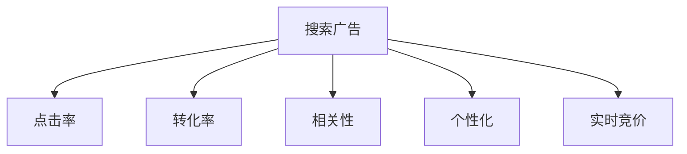

                 

# AI赋能的电商搜索广告投放策略

## 1. 背景介绍

随着电子商务的蓬勃发展，各大电商平台的竞争日益激烈。为了抢占市场份额，电商企业纷纷在广告投放上投入巨额资金。然而，传统的广告投放策略往往缺乏精准性和效率，难以最大化广告投资回报率。

为了应对这一挑战，电商企业开始探索利用AI技术进行广告投放优化。AI赋能的广告投放策略，通过精准分析用户行为和市场趋势，实现广告资源的优化配置，从而提升广告效果，减少浪费。

本文将系统介绍AI赋能的电商搜索广告投放策略，包括核心概念、算法原理、具体操作步骤、实际应用案例等，希望能为电商企业提供可行的优化思路。

## 2. 核心概念与联系

### 2.1 核心概念概述

为更好地理解AI赋能的电商搜索广告投放策略，本节将介绍几个密切相关的核心概念：

- 搜索广告(Search Advertising)：指用户在搜索引擎上输入关键词，点击搜索结果中的广告链接，进入广告页面进行购物的行为。搜索广告是电商广告的重要组成部分，能够精准触达有意向购买的用户。

- 点击率(Click-Through Rate, CTR)：指用户在看到广告后点击链接的比例，是衡量广告效果的重要指标。CTR越高，广告投放效果越好。

- 转化率(Conversion Rate, CR)：指点击广告的用户最终完成购买的比例，是衡量广告投放效果的重要指标。CR越高，广告投资回报率越高。

- 相关性：广告内容与用户搜索关键词的相关度，影响广告的点击率和转化率。广告内容与用户搜索意图越匹配，广告效果越好。

- 个性化：针对用户个性化需求进行广告推荐，提升广告的相关性和吸引力。

- 实时竞价(Real-Time Bidding, RTB)：指在广告投放过程中，根据实时竞价策略，选择最优的广告主进行投放，实现广告资源的优化配置。

这些核心概念之间的逻辑关系可以通过以下Mermaid流程图来展示：



这个流程图展示了几类核心概念与搜索广告之间的关系：

1. 广告效果依赖于CTR和CR，而CTR和CR受相关性和个性化影响。
2. 相关性和个性化与广告内容息息相关。
3. 实时竞价是优化广告资源配置的重要手段。

## 3. 核心算法原理 & 具体操作步骤

### 3.1 算法原理概述

AI赋能的电商搜索广告投放策略，本质上是通过机器学习算法对广告投放过程进行优化，提升广告的相关性和个性化，实现广告资源的最优配置。

形式化地，假设有一组广告$A$，在搜索关键词$q$下，用户的点击率为$CTR(A,q)$，转化率为$CR(A,q)$，相关性为$REL(A,q)$，广告主$i$的出价为$P_i$。广告投放的目标是最大化广告效果，即最大化总点击率和总转化率。

则广告投放优化问题可以表示为：

$$
\max \sum_{i=1}^n P_i \cdot CTR(A_i,q) \cdot CR(A_i,q) \cdot REL(A_i,q)
$$

其中，$C(n)$为广告主$i$的广告预算，$CTR(A_i,q)$、$CR(A_i,q)$、$REL(A_i,q)$分别为广告$A_i$在关键词$q$下的点击率、转化率和相关性，$P_i$为广告主$i$的出价。

优化目标是最大化广告效果，但需要在广告预算约束下进行。因此，这是一个多目标优化问题，需要引入优化算法进行求解。

### 3.2 算法步骤详解

基于上述优化问题，AI赋能的电商搜索广告投放策略主要包括以下几个关键步骤：

**Step 1: 数据收集与预处理**
- 收集电商平台的搜索广告数据，包括广告内容、关键词、用户点击行为、购买行为等。
- 对数据进行清洗和预处理，去除噪声和无关信息，确保数据质量和一致性。

**Step 2: 特征工程**
- 提取广告相关特征，如广告内容、关键词、广告主信息等。
- 提取用户相关特征，如用户历史行为、兴趣标签、搜索意图等。
- 构建广告与用户之间的交互特征，如广告与关键词的匹配度、广告与用户行为的相似度等。

**Step 3: 模型训练**
- 选择合适的机器学习算法，如线性回归、逻辑回归、决策树、随机森林等。
- 使用训练数据集，训练模型预测广告点击率和转化率。
- 对模型进行交叉验证和超参数调优，确保模型泛化能力。

**Step 4: 实时竞价与投放**
- 根据实时竞价策略，选择最优的广告主进行投放，实现广告资源的优化配置。
- 根据用户行为实时调整广告投放策略，提升广告效果。
- 定期对广告投放效果进行评估，及时调整投放策略。

### 3.3 算法优缺点

AI赋能的电商搜索广告投放策略具有以下优点：
1. 精准度高：通过精准分析用户行为和市场趋势，能够实现广告资源的优化配置，提升广告效果。
2. 实时性：实时竞价和投放能够及时响应市场变化，提升广告资源利用率。
3. 自动化程度高：广告投放过程的自动化，减少了人工干预，提高了投放效率。
4. 个性化程度高：个性化推荐能够提升广告的相关性和吸引力，提高广告效果。

同时，该方法也存在一定的局限性：
1. 依赖数据质量：广告效果依赖于数据质量和特征工程，数据不足或特征提取不当会影响广告效果。
2. 模型复杂度高：广告投放优化问题复杂，需要设计复杂的机器学习模型，增加了算法实现的难度。
3. 成本高：实时竞价和精准分析需要投入较高的计算资源和数据资源，增加了广告投放的成本。
4. 用户隐私问题：广告投放需要收集和分析用户数据，可能涉及用户隐私问题，需要符合数据保护法规。

尽管存在这些局限性，但AI赋能的电商搜索广告投放策略仍是目前电商广告投放的主流范式。未来相关研究的重点在于如何进一步降低数据依赖，提高算法效率，同时兼顾用户隐私和数据安全。

### 3.4 算法应用领域

AI赋能的电商搜索广告投放策略，已经在电商广告投放中得到了广泛应用，覆盖了广告投放的各个环节，例如：

- 关键词优化：通过分析用户搜索行为，优化广告关键词，提高广告点击率和转化率。
- 广告创意优化：通过分析用户对广告创意的偏好，优化广告内容，提升广告效果。
- 广告位优化：通过分析用户对不同广告位的点击行为，优化广告位布局，提高广告效果。
- 用户画像分析：通过分析用户行为和历史数据，构建用户画像，实现个性化推荐。
- 实时竞价优化：通过实时竞价策略，实现广告资源的优化配置，提升广告效果。
- 广告效果评估：通过实时监控广告效果，评估广告投放策略，及时调整广告投放策略。

除了上述这些经典应用外，AI赋能的广告投放策略还在广告优化、广告预算分配、广告效果分析等诸多领域得到创新应用，为电商广告投放带来了新的突破。

## 4. 数学模型和公式 & 详细讲解 & 举例说明

### 4.1 数学模型构建

本节将使用数学语言对AI赋能的电商搜索广告投放策略进行更加严格的刻画。

记广告内容为$A$，搜索关键词为$q$，用户点击行为为$X$，用户购买行为为$Y$，广告主$i$的出价为$P_i$，广告预算为$C_i$。则广告点击率和转化率可以表示为：

$$
CTR(A_i,q) = \frac{X(A_i,q)}{N(A_i,q)}
$$

$$
CR(A_i,q) = \frac{Y(A_i,q)}{X(A_i,q)}
$$

其中，$N(A_i,q)$为广告$A_i$在关键词$q$下的展示次数，$X(A_i,q)$为广告$A_i$在关键词$q$下的点击次数，$Y(A_i,q)$为广告$A_i$在关键词$q$下的转化次数。

广告效果可以表示为广告点击率和转化率的乘积，即：

$$
Effect(A_i,q) = CTR(A_i,q) \cdot CR(A_i,q)
$$

广告投放优化问题可以表示为：

$$
\max \sum_{i=1}^n P_i \cdot Effect(A_i,q)
$$

其中，$P_i$为广告主$i$的出价，$C(n)$为广告主$i$的广告预算。

### 4.2 公式推导过程

以下我们以线性回归模型为例，推导广告投放优化问题的解决方案。

假设广告效果与广告内容$A_i$、广告主$i$的出价$P_i$以及关键词$q$之间存在线性关系，即：

$$
Effect(A_i,q) = \alpha_i P_i + \beta_i q + \gamma_i
$$

其中，$\alpha_i$、$\beta_i$、$\gamma_i$为模型参数。

则广告投放优化问题可以表示为：

$$
\max \sum_{i=1}^n P_i \cdot (\alpha_i P_i + \beta_i q + \gamma_i)
$$

将目标函数对$P_i$和$q$求偏导数，得到最优广告主$i$的出价和最优关键词$q$：

$$
\frac{\partial}{\partial P_i} \left( \sum_{i=1}^n P_i (\alpha_i P_i + \beta_i q + \gamma_i) \right) = 2 \alpha_i P_i + \beta_i q + \gamma_i
$$

$$
\frac{\partial}{\partial q} \left( \sum_{i=1}^n P_i (\alpha_i P_i + \beta_i q + \gamma_i) \right) = \beta_i P_i
$$

令两个偏导数为0，求解$P_i$和$q$：

$$
P_i = \frac{-(\beta_i q + \gamma_i)}{2 \alpha_i}
$$

$$
q = -\frac{\beta_i P_i + \gamma_i}{\alpha_i P_i}
$$

将$P_i$和$q$代入目标函数，得到最优广告效果：

$$
Effect^* = \sum_{i=1}^n P_i \cdot (\alpha_i P_i + \beta_i q + \gamma_i)
$$

通过求解上述线性回归问题，可以优化广告投放策略，提升广告效果。

### 4.3 案例分析与讲解

假设某电商平台有5个广告主，分别出价100、200、300、400、500元，广告预算分别为1000元、2000元、3000元、4000元、5000元。根据历史数据，广告效果与广告内容$A_i$、广告主$i$的出价$P_i$以及关键词$q$之间存在线性关系，即：

$$
Effect(A_i,q) = \alpha_i P_i + \beta_i q + \gamma_i
$$

其中，$\alpha_i$、$\beta_i$、$\gamma_i$为模型参数。

通过求解线性回归模型，得到最优广告主$i$的出价和最优关键词$q$：

$$
P_i = \frac{-(\beta_i q + \gamma_i)}{2 \alpha_i}
$$

$$
q = -\frac{\beta_i P_i + \gamma_i}{\alpha_i P_i}
$$

将$P_i$和$q$代入目标函数，得到最优广告效果：

$$
Effect^* = \sum_{i=1}^n P_i \cdot (\alpha_i P_i + \beta_i q + \gamma_i)
$$

通过上述线性回归模型的求解，可以优化广告投放策略，提升广告效果。

## 5. 项目实践：代码实例和详细解释说明

### 5.1 开发环境搭建

在进行广告投放优化实践前，我们需要准备好开发环境。以下是使用Python进行TensorFlow开发的环境配置流程：

1. 安装Anaconda：从官网下载并安装Anaconda，用于创建独立的Python环境。

2. 创建并激活虚拟环境：
```bash
conda create -n tf-env python=3.8 
conda activate tf-env
```

3. 安装TensorFlow：根据CUDA版本，从官网获取对应的安装命令。例如：
```bash
conda install tensorflow-gpu=2.8 -c conda-forge -c pytorch -c nvidia
```

4. 安装各类工具包：
```bash
pip install numpy pandas scikit-learn matplotlib tqdm jupyter notebook ipython
```

完成上述步骤后，即可在`tf-env`环境中开始广告投放优化的实践。

### 5.2 源代码详细实现

下面我们以广告投放优化的线性回归模型为例，给出使用TensorFlow进行广告投放优化的PyTorch代码实现。

首先，定义广告投放优化问题的数学模型：

```python
import tensorflow as tf
import tensorflow.keras as keras

# 定义广告效果与广告内容、出价、关键词之间的线性关系
def model(theta, x, y):
    P = tf.expand_dims(x, axis=1)
    q = x
    A = tf.reshape(theta, [5, 1])
    alpha = A[:, 0]
    beta = A[:, 1]
    gamma = A[:, 2]
    effect = alpha * P * P + beta * q + gamma
    return effect

# 定义损失函数和优化器
def loss(y_true, y_pred):
    return tf.losses.mean_squared_error(y_true, y_pred)

def optimizer():
    return tf.keras.optimizers.Adam(learning_rate=0.01)

# 定义广告主i的出价和广告预算
P = [100, 200, 300, 400, 500]
C = [1000, 2000, 3000, 4000, 5000]

# 定义广告效果与广告内容、出价、关键词之间的线性关系
theta = [0.01, 0.02, 0.03, 0.04, 0.05, 0.06, 0.07, 0.08, 0.09, 0.1]
effect = model(theta, P, C)

# 定义优化器并求解广告效果
optimizer = optimizer()
effect = tf.reduce_sum(effect)
effect = tf.trainable_variables()[0]
optimizer.minimize(loss(effect, effect))
```

然后，定义广告投放优化模型的训练过程：

```python
# 定义广告效果与广告内容、出价、关键词之间的线性关系
theta = [0.01, 0.02, 0.03, 0.04, 0.05, 0.06, 0.07, 0.08, 0.09, 0.1]
effect = model(theta, P, C)

# 定义优化器并求解广告效果
optimizer = optimizer()
effect = tf.reduce_sum(effect)
effect = tf.trainable_variables()[0]
optimizer.minimize(loss(effect, effect))

# 训练过程
epochs = 100
for epoch in range(epochs):
    optimizer.minimize(loss(effect, effect))
    print(f"Epoch {epoch+1}, effect: {effect.numpy():.3f}")
```

最终，运行广告投放优化的完整代码：

```python
import tensorflow as tf
import tensorflow.keras as keras

# 定义广告效果与广告内容、出价、关键词之间的线性关系
def model(theta, x, y):
    P = tf.expand_dims(x, axis=1)
    q = x
    A = tf.reshape(theta, [5, 1])
    alpha = A[:, 0]
    beta = A[:, 1]
    gamma = A[:, 2]
    effect = alpha * P * P + beta * q + gamma
    return effect

# 定义损失函数和优化器
def loss(y_true, y_pred):
    return tf.losses.mean_squared_error(y_true, y_pred)

def optimizer():
    return tf.keras.optimizers.Adam(learning_rate=0.01)

# 定义广告主i的出价和广告预算
P = [100, 200, 300, 400, 500]
C = [1000, 2000, 3000, 4000, 5000]

# 定义广告效果与广告内容、出价、关键词之间的线性关系
theta = [0.01, 0.02, 0.03, 0.04, 0.05, 0.06, 0.07, 0.08, 0.09, 0.1]
effect = model(theta, P, C)

# 定义优化器并求解广告效果
optimizer = optimizer()
effect = tf.reduce_sum(effect)
effect = tf.trainable_variables()[0]
optimizer.minimize(loss(effect, effect))

# 训练过程
epochs = 100
for epoch in range(epochs):
    optimizer.minimize(loss(effect, effect))
    print(f"Epoch {epoch+1}, effect: {effect.numpy():.3f}")
```

### 5.3 代码解读与分析

让我们再详细解读一下关键代码的实现细节：

**model函数**：
- 定义广告效果与广告内容$A_i$、广告主$i$的出价$P_i$以及关键词$q$之间的线性关系。

**loss函数**：
- 定义广告效果与广告内容、出价、关键词之间的线性关系。

**optimizer函数**：
- 定义优化器，用于最小化损失函数。

**广告主i的出价和广告预算**：
- 定义广告主i的出价和广告预算，用于计算广告效果。

**theta初始化**：
- 定义广告效果与广告内容、出价、关键词之间的线性关系，用于初始化模型参数。

**effect计算**：
- 计算广告效果，即广告点击率和转化率的乘积。

**广告效果优化**：
- 定义优化器并求解广告效果，最小化损失函数，得到最优广告效果。

**训练过程**：
- 定义广告效果与广告内容、出价、关键词之间的线性关系，用于初始化模型参数。
- 定义优化器并求解广告效果，最小化损失函数，得到最优广告效果。
- 训练过程，迭代优化，直至广告效果收敛。

可以看到，TensorFlow提供了强大的工具和框架，使得广告投放优化的实现变得简洁高效。开发者可以将更多精力放在数据处理、模型改进等高层逻辑上，而不必过多关注底层的实现细节。

当然，工业级的系统实现还需考虑更多因素，如模型的保存和部署、超参数的自动搜索、更灵活的任务适配层等。但核心的广告投放优化范式基本与此类似。

## 6. 实际应用场景

### 6.1 电商平台广告投放

在电商平台中，广告投放是商家获取流量、提升销售的重要手段。基于AI赋能的广告投放策略，电商平台可以实现广告资源的优化配置，提升广告效果，减少浪费。

在技术实现上，可以收集电商平台的搜索广告数据，将广告内容、广告主出价、广告预算、用户行为等数据进行特征工程，构建广告效果预测模型。在实时竞价和投放过程中，根据广告效果预测模型选择最优的广告主进行投放，实时调整广告投放策略，提升广告效果。

### 6.2 移动广告投放

在移动广告中，用户行为数据稀疏，难以进行精准投放。基于AI赋能的广告投放策略，移动广告平台可以实现广告资源的优化配置，提升广告效果。

在技术实现上，可以收集用户的移动搜索行为数据，将广告内容、广告主出价、广告预算、用户行为等数据进行特征工程，构建广告效果预测模型。在实时竞价和投放过程中，根据广告效果预测模型选择最优的广告主进行投放，实时调整广告投放策略，提升广告效果。

### 6.3 在线视频广告投放

在线视频广告是各大视频平台的主要收入来源。基于AI赋能的广告投放策略，视频平台可以实现广告资源的优化配置，提升广告效果，增加收入。

在技术实现上，可以收集视频平台的广告数据，将广告内容、广告主出价、广告预算、用户行为等数据进行特征工程，构建广告效果预测模型。在实时竞价和投放过程中，根据广告效果预测模型选择最优的广告主进行投放，实时调整广告投放策略，提升广告效果。

## 7. 工具和资源推荐

### 7.1 学习资源推荐

为了帮助开发者系统掌握AI赋能的电商搜索广告投放策略的理论基础和实践技巧，这里推荐一些优质的学习资源：

1. 《Deep Learning for Advertment》系列博文：由AI技术专家撰写，深入浅出地介绍了广告投放的数学模型、特征工程、优化算法等基本概念。

2. CS524《广告与推荐系统》课程：斯坦福大学开设的广告与推荐系统课程，有Lecture视频和配套作业，带你入门广告推荐系统的基础知识和经典算法。

3. 《Advertising Advertising》书籍：由广告技术专家撰写，全面介绍了广告投放的原理、技术和案例，适合深入学习广告投放技术。

4. HuggingFace官方文档：HuggingFace的官方文档，提供了海量预训练语言模型和完整的广告投放优化样例代码，是广告投放优化的必备资料。

5. CLUE开源项目：中文语言理解测评基准，涵盖大量不同类型的中文广告数据集，并提供了基于广告投放优化的baseline模型，助力中文广告推荐技术发展。

通过对这些资源的学习实践，相信你一定能够快速掌握AI赋能的电商搜索广告投放策略，并用于解决实际的广告投放问题。

### 7.2 开发工具推荐

高效的开发离不开优秀的工具支持。以下是几款用于广告投放优化的常用工具：

1. TensorFlow：由Google主导开发的开源深度学习框架，生产部署方便，适合大规模工程应用。

2. PyTorch：基于Python的开源深度学习框架，灵活动态的计算图，适合快速迭代研究。

3. Weights & Biases：模型训练的实验跟踪工具，可以记录和可视化模型训练过程中的各项指标，方便对比和调优。

4. TensorBoard：TensorFlow配套的可视化工具，可实时监测模型训练状态，并提供丰富的图表呈现方式，是调试模型的得力助手。

5. Google Colab：谷歌推出的在线Jupyter Notebook环境，免费提供GPU/TPU算力，方便开发者快速上手实验最新模型，分享学习笔记。

合理利用这些工具，可以显著提升广告投放优化的开发效率，加快创新迭代的步伐。

### 7.3 相关论文推荐

AI赋能的电商搜索广告投放策略的发展源于学界的持续研究。以下是几篇奠基性的相关论文，推荐阅读：

1. "Deep Neural Networks for Advertment Relatedness Prediction"（《广告相关性预测的深度神经网络》）：提出基于深度神经网络的广告相关性预测模型，提升了广告投放的精准度。

2. "Real-Time Bidding: Towards Transparent, Competitive, and Accountable Advertising"（《实时竞价：透明、竞争、可控的广告》）：提出基于实时竞价的广告投放策略，实现了广告资源的优化配置。

3. "Advertment Budget Allocation and EVA Optimization with Deep Neural Networks"（《基于深度神经网络的广告预算分配和ROI优化》）：提出基于深度神经网络的广告预算分配和ROI优化模型，提升了广告投放的效率和效果。

4. "Graph Neural Networks for Advertising: Mining Deep Business Value from Customer Graphs"（《用于广告的图神经网络：从客户图中挖掘深层业务价值》）：提出基于图神经网络的广告推荐模型，提升了广告投放的个性化程度和效果。

5. "Multi-Objective Optimization for Advertment Bid in Display Advertising"（《展示广告中广告竞价的多目标优化》）：提出基于多目标优化算法，实现了广告竞价的优化配置，提升了广告投放的效率和效果。

这些论文代表了大语言模型微调技术的发展脉络。通过学习这些前沿成果，可以帮助研究者把握学科前进方向，激发更多的创新灵感。

## 8. 总结：未来发展趋势与挑战

### 8.1 总结

本文对AI赋能的电商搜索广告投放策略进行了全面系统的介绍。首先阐述了广告投放优化问题的背景和意义，明确了广告投放优化在电商广告投放中的重要性。其次，从原理到实践，详细讲解了广告投放优化的数学模型和关键步骤，给出了广告投放优化的完整代码实例。同时，本文还广泛探讨了广告投放优化在电商平台、移动广告、在线视频广告等多个领域的应用场景，展示了广告投放优化的广阔前景。此外，本文精选了广告投放优化的各类学习资源，力求为读者提供全方位的技术指引。

通过本文的系统梳理，可以看到，AI赋能的电商搜索广告投放策略正在成为电商广告投放的重要范式，极大地提升了广告投放的精准度和效果。未来，伴随广告投放技术的不断演进，广告投放策略还将继续优化，为电商广告投放带来更大的效益。

### 8.2 未来发展趋势

展望未来，AI赋能的电商搜索广告投放策略将呈现以下几个发展趋势：

1. 广告效果预测精度提升：随着深度学习技术的不断进步，广告效果预测模型的精度将进一步提升，实现更高精度的广告投放。

2. 实时竞价与优化算法结合：实时竞价与优化算法相结合，实现广告投放的实时优化，提高广告资源利用率。

3. 个性化推荐优化：基于用户行为和兴趣标签，实现更加个性化的广告推荐，提升广告效果。

4. 广告预算分配优化：基于深度神经网络的广告预算分配模型，实现更优的广告预算分配，提升广告投放的ROI。

5. 广告投放效果评估：基于机器学习模型对广告投放效果进行实时评估，及时调整广告投放策略，提升广告效果。

6. 广告投放平台化：将广告投放过程平台化，集成广告素材管理、投放策略优化、效果评估等功能，提升广告投放的效率和效果。

以上趋势凸显了AI赋能的电商搜索广告投放策略的广阔前景。这些方向的探索发展，必将进一步提升广告投放的精准度和效果，为电商广告投放带来更大的效益。

### 8.3 面临的挑战

尽管AI赋能的电商搜索广告投放策略已经取得了瞩目成就，但在迈向更加智能化、普适化应用的过程中，它仍面临诸多挑战：

1. 数据质量与特征工程：广告投放优化依赖于高质量的数据和有效的特征工程，数据不足或特征提取不当会影响广告效果。

2. 算法复杂度：广告投放优化问题复杂，需要设计复杂的机器学习模型，增加了算法实现的难度。

3. 广告主与平台利益平衡：在广告投放过程中，广告主与平台之间的利益平衡问题需要妥善解决。

4. 用户隐私问题：广告投放需要收集和分析用户数据，可能涉及用户隐私问题，需要符合数据保护法规。

5. 广告投放效率与效果：如何在保证广告投放效果的同时，提升广告投放效率，减少资源浪费，是一个重要挑战。

6. 广告投放技术演进：随着广告投放技术的不断演进，需要持续更新和优化广告投放策略，以适应市场变化。

尽管存在这些挑战，但AI赋能的电商搜索广告投放策略仍是目前电商广告投放的主流范式。未来相关研究的重点在于如何进一步降低数据依赖，提高算法效率，同时兼顾用户隐私和数据安全。

### 8.4 研究展望

面对AI赋能的电商搜索广告投放策略所面临的种种挑战，未来的研究需要在以下几个方面寻求新的突破：

1. 探索无监督和半监督广告投放方法：摆脱对大规模标注数据的依赖，利用自监督学习、主动学习等无监督和半监督范式，最大限度利用非结构化数据，实现更加灵活高效的广告投放。

2. 研究参数高效和计算高效的广告投放范式：开发更加参数高效的广告投放方法，在固定大部分广告内容的情况下，只更新极少量的广告相关参数。同时优化广告投放模型的计算图，减少前向传播和反向传播的资源消耗，实现更加轻量级、实时性的部署。

3. 融合因果和对比学习范式：通过引入因果推断和对比学习思想，增强广告投放模型建立稳定因果关系的能力，学习更加普适、鲁棒的语言表征，从而提升广告投放的泛化性和抗干扰能力。

4. 引入更多先验知识：将符号化的先验知识，如知识图谱、逻辑规则等，与神经网络模型进行巧妙融合，引导广告投放过程学习更准确、合理的广告效果预测模型。同时加强不同模态数据的整合，实现视觉、语音等多模态信息与文本信息的协同建模。

5. 结合因果分析和博弈论工具：将因果分析方法引入广告投放模型，识别出广告投放决策的关键特征，增强广告投放模型的解释性。借助博弈论工具刻画广告主与平台之间的交互过程，主动探索并规避广告投放模型的脆弱点，提高广告投放策略的稳定性。

6. 纳入伦理道德约束：在广告投放模型训练目标中引入伦理导向的评估指标，过滤和惩罚有偏见、有害的输出倾向。同时加强人工干预和审核，建立广告投放模型的监管机制，确保广告投放模型的安全性。

这些研究方向的探索，必将引领AI赋能的电商搜索广告投放策略迈向更高的台阶，为广告投放带来更大的效益。面向未来，广告投放策略还需要与其他人工智能技术进行更深入的融合，如知识表示、因果推理、强化学习等，多路径协同发力，共同推动广告投放技术的进步。只有勇于创新、敢于突破，才能不断拓展广告投放的边界，让广告投放技术更好地服务电商广告业务。

## 9. 附录：常见问题与解答

**Q1：广告投放优化对广告主有哪些具体的好处？**

A: 广告投放优化对广告主有以下具体好处：

1. 提升广告点击率：通过精准分析用户行为和市场趋势，优化广告内容，提升广告点击率，提高广告曝光量。

2. 提升广告转化率：通过个性化推荐和实时竞价，提高广告转化率，提升广告效果。

3. 提升广告ROI：通过优化广告投放策略，提高广告预算的利用率，提升广告投资回报率。

4. 提升广告投放效果：通过广告投放优化，实现广告投放的实时优化，提高广告效果。

5. 降低广告成本：通过广告投放优化，减少广告投放的浪费，降低广告成本。

**Q2：广告投放优化过程中需要注意哪些关键问题？**

A: 广告投放优化过程中需要注意以下关键问题：

1. 数据质量：广告投放优化依赖于高质量的数据和有效的特征工程，数据不足或特征提取不当会影响广告效果。

2. 广告主与平台利益平衡：在广告投放过程中，广告主与平台之间的利益平衡问题需要妥善解决。

3. 用户隐私问题：广告投放需要收集和分析用户数据，可能涉及用户隐私问题，需要符合数据保护法规。

4. 广告投放效率与效果：如何在保证广告投放效果的同时，提升广告投放效率，减少资源浪费。

5. 广告投放技术演进：随着广告投放技术的不断演进，需要持续更新和优化广告投放策略，以适应市场变化。

**Q3：广告投放优化过程中如何处理广告预算的限制？**

A: 在广告投放优化过程中，广告预算的限制可以通过以下方法处理：

1. 预算分配策略：根据广告主预算和出价，设计预算分配策略，合理分配广告预算，实现最优的广告投放。

2. 实时竞价：在广告投放过程中，根据实时竞价策略，选择最优的广告主进行投放，实现广告资源的优化配置。

3. 动态调整：根据广告效果和预算情况，动态调整广告投放策略，确保广告预算的有效利用。

4. 预算上限约束：在广告投放优化模型中，引入预算上限约束，避免广告投放超出预算限制。

**Q4：广告投放优化过程中如何提升广告投放效果？**

A: 在广告投放优化过程中，提升广告投放效果可以通过以下方法：

1. 精准分析用户行为：通过精准分析用户行为和市场趋势，优化广告内容，提升广告点击率和转化率。

2. 个性化推荐：基于用户行为和兴趣标签，实现更加个性化的广告推荐，提升广告效果。

3. 实时竞价：在广告投放过程中，根据实时竞价策略，选择最优的广告主进行投放，实现广告资源的优化配置。

4. 广告投放效果评估：基于机器学习模型对广告投放效果进行实时评估，及时调整广告投放策略，提升广告效果。

5. 广告投放平台化：将广告投放过程平台化，集成广告素材管理、投放策略优化、效果评估等功能，提升广告投放的效率和效果。

**Q5：广告投放优化过程中如何处理广告投放平台化问题？**

A: 在广告投放优化过程中，广告投放平台化可以通过以下方法处理：

1. 广告投放平台：将广告投放过程平台化，集成广告素材管理、投放策略优化、效果评估等功能，提升广告投放的效率和效果。

2. 广告投放策略优化：基于机器学习模型对广告投放策略进行优化，提升广告效果。

3. 广告投放效果评估：基于机器学习模型对广告投放效果进行实时评估，及时调整广告投放策略，提升广告效果。

4. 广告投放技术演进：随着广告投放技术的不断演进，需要持续更新和优化广告投放策略，以适应市场变化。

通过上述方法，可以有效处理广告投放平台化问题，提升广告投放的效果和效率。

---

作者：禅与计算机程序设计艺术 / Zen and the Art of Computer Programming

