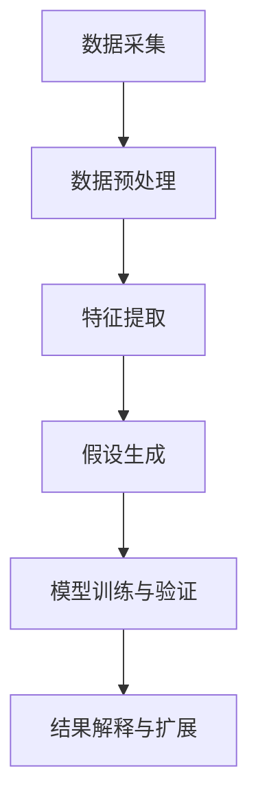

                 

# AI辅助科学发现：从假设到验证

在科技与信息爆炸的时代，AI技术正在深刻改变着各个领域。无论是在商业、医疗、教育，还是科学研究中，AI都能提供强大的计算与数据分析能力，助力从零散的信息碎片中发掘知识，提出假说，验证预测，推动科学发现的进程。本文将深入探讨AI如何辅助科学发现，从数据采集、假设提出、模型训练、结果验证的各个环节，为读者详细介绍这一过程。

## 1. 背景介绍

### 1.1 问题由来
科学发现是一个从观察、假设、实验到验证的循环过程。过去，这一过程依赖于实验人员的经验、直觉和传统统计方法。然而，随着数据量的爆炸性增长，传统方法往往难以有效处理复杂且大规模的数据集，导致发现过程缓慢，效率低下。

近年来，随着AI特别是深度学习技术的突破，科研人员开始借助AI技术来辅助科学发现。AI可以自动化地处理海量数据，挖掘潜在模式，提出假说，并进行验证，大大加速了科学发现的过程。这种新型的AI辅助科学发现模式，也被称为“数据驱动科学”。

### 1.2 问题核心关键点
AI辅助科学发现的核心在于其可以自动化地从大量数据中提取信息，提出假设，并通过机器学习模型进行验证。主要关键点包括：

- **数据采集与预处理**：科学发现始于数据的收集和处理，AI可以自动抓取、清洗并整理数据。
- **假设生成**：利用机器学习算法从数据中生成可能的假说，或通过强化学习算法优化假设。
- **模型训练与验证**：通过深度学习模型进行假设验证，利用训练数据集训练模型，并使用测试集进行验证。
- **结果解释与扩展**：利用AI模型进行结果解释，并进一步探索其潜在应用领域。

## 2. 核心概念与联系

### 2.1 核心概念概述

为了更好地理解AI辅助科学发现的过程，本节将介绍几个关键概念及其联系：

- **数据采集**：从各种数据源中收集数据，包括文本、图像、传感器数据等。
- **数据预处理**：对数据进行清洗、归一化、缺失值处理等，为后续分析做准备。
- **特征提取**：从原始数据中提取有用的特征，为模型训练提供输入。
- **假设生成**：利用统计、机器学习或强化学习技术从数据中提出假设。
- **模型训练与验证**：使用训练数据集训练模型，并通过验证集评估模型性能。
- **结果解释与扩展**：利用模型解释输出结果，并进一步探索新的研究方向。

这些概念共同构成了AI辅助科学发现的基础框架，有助于科研人员高效、准确地提出假设并验证其正确性。

### 2.2 核心概念原理和架构的 Mermaid 流程图



这个流程图展示了数据从采集、预处理到特征提取、假设生成、模型训练与验证，再到结果解释与扩展的全过程。

## 3. 核心算法原理 & 具体操作步骤
### 3.1 算法原理概述

AI辅助科学发现的核心在于其可以自动化地从大量数据中提取信息，提出假设，并通过机器学习模型进行验证。主要算法原理包括：

- **数据挖掘与特征提取**：从大量数据中提取有用的特征，为模型训练提供输入。
- **假设生成**：利用统计、机器学习或强化学习技术从数据中提出假设。
- **模型训练与验证**：使用训练数据集训练模型，并通过验证集评估模型性能。
- **结果解释与扩展**：利用模型解释输出结果，并进一步探索新的研究方向。

### 3.2 算法步骤详解

AI辅助科学发现的过程主要包括以下步骤：

1. **数据采集**：从各种数据源中收集数据，包括文本、图像、传感器数据等。
2. **数据预处理**：对数据进行清洗、归一化、缺失值处理等，为后续分析做准备。
3. **特征提取**：从原始数据中提取有用的特征，为模型训练提供输入。
4. **假设生成**：利用统计、机器学习或强化学习技术从数据中提出假设。
5. **模型训练与验证**：使用训练数据集训练模型，并通过验证集评估模型性能。
6. **结果解释与扩展**：利用模型解释输出结果，并进一步探索新的研究方向。

### 3.3 算法优缺点

AI辅助科学发现的主要优点包括：

- **效率高**：AI可以自动化地处理大量数据，大大提升数据处理和分析的速度。
- **准确性高**：AI模型能够从数据中挖掘出复杂的模式，提出更加精确的假设。
- **可扩展性强**：AI技术可以应用于各种数据类型，从文本、图像到传感器数据等。

然而，这一过程也存在一些局限：

- **数据质量依赖**：模型的输出质量高度依赖于数据的质量和代表性。
- **模型复杂性**：深度学习模型复杂，训练和调试需要大量时间和资源。
- **结果解释性不足**：AI模型的决策过程往往难以解释，缺乏可解释性。

### 3.4 算法应用领域

AI辅助科学发现已经广泛应用于多个领域，包括：

- **生物医学研究**：利用AI从基因组数据中发现潜在的生物标志物，加速疾病诊断和治疗。
- **材料科学**：通过AI分析材料性能数据，提出新材料的设计方案。
- **天文学**：利用AI对天文图像进行分析，发现新的天体或星系。
- **地球科学**：通过AI分析气候数据，预测未来气候变化趋势。

未来，AI辅助科学发现还将拓展到更多的领域，如化学、物理、社会科学等，为科学研究带来新的突破。

## 4. 数学模型和公式 & 详细讲解 & 举例说明

### 4.1 数学模型构建

AI辅助科学发现涉及多种数学模型，包括线性回归、逻辑回归、支持向量机、深度神经网络等。以线性回归为例，假设有一个二元线性回归模型：

$$y = \beta_0 + \beta_1x_1 + \beta_2x_2 + \epsilon$$

其中 $y$ 为预测值，$x_1, x_2$ 为输入特征，$\beta_0, \beta_1, \beta_2$ 为模型参数，$\epsilon$ 为误差项。

### 4.2 公式推导过程

线性回归模型的参数估计通过最小二乘法实现：

$$\hat{\beta} = \mathop{\arg\min}_{\beta} \sum_{i=1}^n (y_i - \beta_0 - \beta_1x_{1i} - \beta_2x_{2i})^2$$

求解上述最小化问题，得到参数估计值：

$$\hat{\beta} = (X^TX)^{-1}X^Ty$$

其中 $X^TX$ 为矩阵 $X$ 的伪逆，$X^Ty$ 为 $X$ 和 $y$ 的矩阵乘积。

### 4.3 案例分析与讲解

以气温预测为例，假设收集到了近10年的气温数据，每个年份的日均气温、湿度、日照时间等特征，利用线性回归模型预测未来一年的日均气温。模型训练步骤如下：

1. 数据预处理：对原始数据进行缺失值处理、归一化等预处理。
2. 特征提取：提取日均气温、湿度、日照时间等特征。
3. 模型训练：使用历史数据训练线性回归模型，得到模型参数。
4. 模型验证：使用验证集评估模型性能，调整参数。
5. 结果解释：利用模型解释预测结果，并进一步探索预测结果对农业、旅游等的影响。

## 5. 项目实践：代码实例和详细解释说明

### 5.1 开发环境搭建

在进行AI辅助科学发现的项目实践前，需要准备好开发环境。以下是使用Python进行Scikit-Learn开发的环境配置流程：

1. 安装Anaconda：从官网下载并安装Anaconda，用于创建独立的Python环境。
2. 创建并激活虚拟环境：
```bash
conda create -n myenv python=3.8 
conda activate myenv
```

3. 安装Scikit-Learn：
```bash
pip install scikit-learn
```

4. 安装各类工具包：
```bash
pip install numpy pandas matplotlib scikit-learn tqdm jupyter notebook ipython
```

完成上述步骤后，即可在`myenv`环境中开始项目实践。

### 5.2 源代码详细实现

我们使用Scikit-Learn库进行线性回归模型的训练和验证，代码如下：

```python
from sklearn.linear_model import LinearRegression
from sklearn.metrics import mean_squared_error
import numpy as np
import pandas as pd

# 数据预处理
data = pd.read_csv('temperature_data.csv')
data = data.dropna()  # 去除缺失值

# 特征提取
X = data[['temp', 'humidity', 'solar_radiation']]
y = data['temperature']

# 模型训练
model = LinearRegression()
model.fit(X, y)

# 模型验证
train_pred = model.predict(X)
train_score = mean_squared_error(y, train_pred)

# 结果输出
print(f'Train RMSE: {np.sqrt(train_score)}')
```

### 5.3 代码解读与分析

代码中的关键步骤如下：

- `data = pd.read_csv('temperature_data.csv')`：使用pandas库读取数据文件。
- `data = data.dropna()`：去除缺失值，确保数据完整性。
- `X = data[['temp', 'humidity', 'solar_radiation']]`：提取特征列。
- `y = data['temperature']`：提取目标变量。
- `model = LinearRegression()`：创建线性回归模型。
- `model.fit(X, y)`：训练模型。
- `train_pred = model.predict(X)`：预测训练集结果。
- `train_score = mean_squared_error(y, train_pred)`：计算训练集误差。
- `print(f'Train RMSE: {np.sqrt(train_score)}')`：输出训练集RMSE（均方根误差）。

通过上述代码，我们实现了线性回归模型的训练和验证，得到了训练集上的RMSE。这一过程展示了AI辅助科学发现的基本流程：数据预处理、特征提取、模型训练和验证。

## 6. 实际应用场景

### 6.1 医学诊断

在医学领域，AI辅助科学发现的应用已经广泛展开。例如，利用AI分析患者基因数据，发现潜在的疾病风险因素，或者通过图像分析，诊断出早期癌症。这些应用不仅提高了诊断的准确性，还大幅减少了医生的工作负担，缩短了诊断时间。

### 6.2 药物研发

药物研发是一个成本高昂、周期漫长的过程。AI技术可以帮助科学家从海量的化合物数据中挖掘出潜在的有效成分，预测其药效和副作用，从而加速药物的研发进程。通过AI模型，科研人员可以预测新药分子与靶点蛋白的结合模式，优化药物分子设计，缩短从实验室到临床的转化周期。

### 6.3 环境保护

环境保护领域也需要大量的数据分析和模型训练。AI可以帮助科学家分析气候数据，预测环境变化趋势，探索气候变化对生态系统的影响。例如，通过分析全球气候数据，预测未来气候变化趋势，制定相应的环境保护策略。

### 6.4 未来应用展望

未来，AI辅助科学发现将在更多领域得到应用，为科学研究带来新的突破。例如：

- **自动化科学发现**：AI可以自动处理和分析大量的科学数据，发现新的现象和规律，推动自动化科学发现的发展。
- **跨领域知识融合**：AI可以整合来自不同领域的知识，推动交叉学科的发展，解决复杂的问题。
- **实时科学发现**：利用AI进行实时数据分析和处理，推动实时科学发现的实现，为突发事件提供及时响应。

## 7. 工具和资源推荐

### 7.1 学习资源推荐

为了帮助开发者系统掌握AI辅助科学发现的技术，这里推荐一些优质的学习资源：

1. **《机器学习实战》系列博文**：由大模型技术专家撰写，深入浅出地介绍了机器学习的基本概念和应用，包括数据采集、特征提取、模型训练和结果解释等。
2. **Coursera《机器学习》课程**：斯坦福大学开设的机器学习课程，有Lecture视频和配套作业，带你入门机器学习的基础知识。
3. **《深度学习》书籍**：深度学习领域的经典书籍，详细介绍了深度学习的基本原理和应用，包括神经网络、卷积神经网络、循环神经网络等。
4. **Kaggle数据集**：Kaggle提供了大量的公开数据集，可以帮助科研人员练习和验证各种机器学习模型。
5. **GitHub开源项目**：GitHub上有许多优秀的机器学习项目，可以学习并借鉴其代码实现。

通过学习这些资源，相信你一定能够快速掌握AI辅助科学发现的技术，并用于解决实际的科学问题。

### 7.2 开发工具推荐

高效的开发离不开优秀的工具支持。以下是几款用于AI辅助科学发现开发的常用工具：

1. **Python**：作为数据分析和机器学习的核心语言，Python以其丰富的库和工具，帮助科研人员高效完成数据处理和模型训练。
2. **Scikit-Learn**：提供了多种机器学习算法，包括线性回归、决策树、随机森林等，适合快速原型设计和模型训练。
3. **TensorFlow**：由Google主导开发的开源深度学习框架，支持大规模模型训练和分布式计算，适合高强度数据处理任务。
4. **PyTorch**：由Facebook开发的深度学习框架，以其动态计算图和灵活性，适合科研人员快速迭代和实验新模型。
5. **Jupyter Notebook**：交互式编程环境，适合快速开发和验证模型。
6. **R**：R语言在统计分析和数据可视化方面表现出色，适合进行统计分析。

合理利用这些工具，可以显著提升AI辅助科学发现的开发效率，加快创新迭代的步伐。

### 7.3 相关论文推荐

AI辅助科学发现源于学界的持续研究。以下是几篇奠基性的相关论文，推荐阅读：

1. **《机器学习》**：Tom Mitchell，机器学习领域的经典教材，详细介绍了机器学习的基本概念和算法。
2. **《深度学习》**：Ian Goodfellow等，深度学习领域的经典书籍，涵盖了深度学习的基本原理和应用。
3. **《AI辅助科学发现》**：John W. Robinson等，介绍了AI技术在科学发现中的应用，包括数据采集、特征提取、模型训练和结果解释等。
4. **《数据驱动的科学发现》**：Lorena A. Barba，介绍了数据驱动科学发现的方法和技术，涵盖了各种科学领域的应用。

这些论文代表了大数据和AI在科学发现中的应用趋势，阅读这些文献可以帮助研究者掌握最新的科研动态和技术进展。

## 8. 总结：未来发展趋势与挑战

### 8.1 研究成果总结

本文对AI辅助科学发现的过程进行了全面系统的介绍。从数据采集、预处理、特征提取、假设生成、模型训练与验证，再到结果解释与扩展，详细讲解了AI在科学发现中的应用。AI技术通过自动化处理大量数据，提出假设，并进行验证，大大加速了科学发现的进程。

### 8.2 未来发展趋势

未来，AI辅助科学发现将呈现以下几个发展趋势：

1. **自动化水平提高**：随着AI技术的不断进步，数据处理和模型训练将更加自动化，科研人员可以专注于探索和发现。
2. **跨领域融合加强**：AI技术将与其他学科如计算机科学、数学、物理学等进行更深入的融合，推动交叉学科的发展。
3. **实时数据处理能力提升**：利用AI进行实时数据分析和处理，推动实时科学发现的实现，为突发事件提供及时响应。
4. **深度学习模型优化**：深度学习模型将不断优化，以更高效、更准确地处理海量数据，提出更精确的假设。

### 8.3 面临的挑战

尽管AI辅助科学发现已经取得了显著进展，但在实现广泛应用的过程中，仍面临一些挑战：

1. **数据质量和代表性**：AI模型的输出高度依赖于数据的质量和代表性，数据采集和预处理环节需要投入大量时间和精力。
2. **模型复杂性**：深度学习模型复杂，训练和调试需要大量时间和资源。
3. **结果解释性不足**：AI模型的决策过程往往难以解释，缺乏可解释性。
4. **跨领域知识融合难度**：跨领域知识的整合和应用，需要科研人员具备多学科的知识背景和技能。

### 8.4 研究展望

未来，研究者需要在以下几个方面寻求新的突破：

1. **自动化和智能化水平提升**：开发更加自动化和智能化的数据处理和模型训练工具，提升科研效率。
2. **跨学科知识融合**：推动跨学科知识的整合和应用，推动交叉学科的发展，解决复杂的问题。
3. **结果解释性增强**：开发可解释的AI模型，增强模型的透明度和可信度。
4. **跨领域知识应用**：推动AI技术在更多领域的应用，解决实际问题。

这些研究方向的探索，必将引领AI辅助科学发现技术迈向更高的台阶，为科学研究带来新的突破。

## 9. 附录：常见问题与解答

**Q1：AI辅助科学发现是否适用于所有科学领域？**

A: AI辅助科学发现适用于大部分科学领域，特别是数据量较大、问题结构化的领域。但对于一些需要高精度的实验验证和人类直觉的领域，如艺术和文学研究，AI辅助可能存在局限。

**Q2：如何选择合适的数据源？**

A: 选择合适的数据源需要考虑数据的完整性、多样性和代表性。一般来说，选择覆盖范围广、数据量大的数据源，可以获取更多有价值的信息。同时，数据的质量也非常重要，需要确保数据源的真实性和可靠性。

**Q3：数据预处理中常用的技术有哪些？**

A: 数据预处理常用的技术包括缺失值处理、归一化、去重、异常值检测等。具体方法根据数据类型和问题特点选择，例如文本数据可以使用分词、去除停用词等预处理步骤。

**Q4：如何选择合适的特征提取方法？**

A: 选择合适的特征提取方法需要考虑数据类型和问题特点。一般来说，对于文本数据，可以使用词袋模型、TF-IDF等方法提取特征。对于图像数据，可以使用卷积神经网络提取特征。对于时间序列数据，可以使用傅里叶变换、小波变换等方法提取特征。

**Q5：如何优化模型训练过程？**

A: 优化模型训练过程的方法包括：
1. 选择合适的优化算法，如Adam、SGD等。
2. 设置合适的学习率和批量大小。
3. 使用正则化技术，如L2正则、Dropout等，避免过拟合。
4. 进行超参数调优，找到最优的模型参数组合。
5. 利用GPU、TPU等高性能设备加速训练。

这些方法可以在一定程度上提高模型的训练效果和泛化能力。

---

作者：禅与计算机程序设计艺术 / Zen and the Art of Computer Programming

