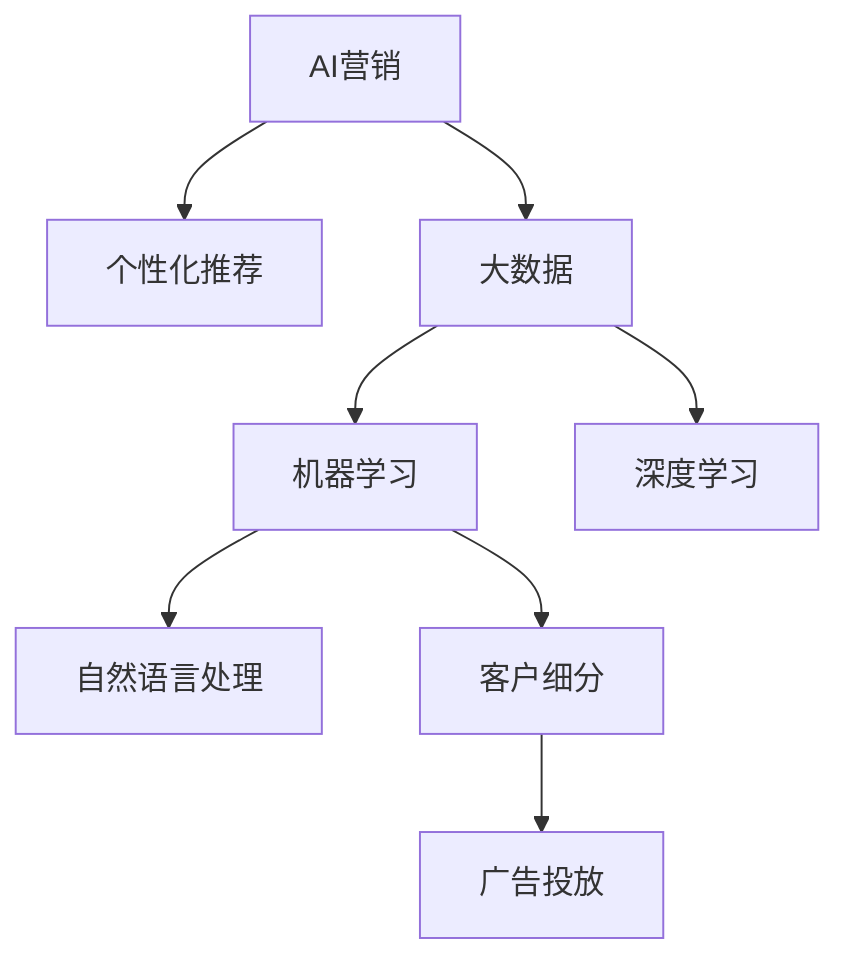

                 

# AI驱动的个性化营销新模式

> 关键词：AI营销, 个性化推荐, 大数据, 机器学习, 深度学习, 自然语言处理, 客户细分, 广告投放

## 1. 背景介绍

### 1.1 问题由来

在过去的几十年里，传统营销方式主要是通过电视、广播、报纸等渠道进行大范围的传播。这种粗放式的营销策略虽然成本较低，但精准度不高，容易出现资源浪费的情况。随着互联网的普及和数字技术的不断发展，个性化营销逐渐成为企业追求的重要目标。

个性化营销是指通过大数据分析、人工智能技术等手段，对客户进行细分，并根据其行为、偏好等信息，定制化地推送内容，从而提升客户体验和品牌忠诚度。但传统的个性化营销手段存在一定的局限性：

1. 数据分析能力不足：传统营销手段难以实时获取用户行为数据，导致个性化推荐的效果不够精准。
2. 客户画像单一：传统营销方式难以全面了解客户的兴趣、需求等复杂信息，导致推荐内容过于单一。
3. 营销效果评估困难：传统营销方式难以量化推荐效果，难以优化投放策略。

## 2. 核心概念与联系

### 2.1 核心概念概述

为了更好地理解AI驱动的个性化营销新模式，本节将介绍几个密切相关的核心概念：

- **AI营销(AI Marketing)**：利用人工智能技术，对客户的购买行为、兴趣偏好等信息进行分析，精准投放广告，提升营销效果。
- **个性化推荐(Personalized Recommendation)**：根据用户的行为和偏好，推荐与其需求匹配的产品或服务，提升用户体验和满意度。
- **大数据(Big Data)**：通过收集、处理海量数据，从中挖掘出有价值的信息，用于指导决策和优化营销策略。
- **机器学习(Machine Learning)**：通过数据驱动的方式，让机器自动学习并优化算法模型，从而提高营销效果。
- **深度学习(Deep Learning)**：一种基于神经网络的机器学习方法，可以处理高维、非线性的数据，提升推荐效果。
- **自然语言处理(Natural Language Processing, NLP)**：利用人工智能技术，处理和理解人类语言，用于分析用户评论、文本数据等信息。
- **客户细分(Customer Segmentation)**：根据客户的不同特征，将客户分成不同的群体，以便针对性地进行营销。
- **广告投放(Ad Placement)**：选择合适的广告位和投放时间，提高广告的曝光率和点击率。

这些核心概念之间的逻辑关系可以通过以下Mermaid流程图来展示：



这个流程图展示了几大核心概念及其之间的关系：

1. AI营销利用大数据和机器学习，进行客户行为分析，生成精准的广告推荐。
2. 个性化推荐通过深度学习和自然语言处理，对用户行为和偏好进行建模，提高推荐效果。
3. 大数据为机器学习和深度学习提供了基础数据，使得模型更加准确和可靠。
4. 自然语言处理技术用于处理用户评论和文本数据，帮助了解用户真实需求。
5. 客户细分通过聚类分析，将用户分组，进行有针对性的广告投放。
6. 广告投放选择合适的广告位和时机，提高广告效果。

## 3. 核心算法原理 & 具体操作步骤
### 3.1 算法原理概述

AI驱动的个性化营销新模式，本质上是一种基于数据的智能决策过程。其核心思想是：通过收集、分析客户的行为数据，构建精准的用户画像，从而进行个性化推荐和广告投放，优化营销效果。

形式化地，假设用户行为数据为 $X$，用户画像为 $P$，广告投放策略为 $A$，则营销效果 $E$ 可以表示为：

$$
E = f(X, P, A)
$$

其中 $f$ 表示营销效果的计算函数，$P$ 由大数据分析和机器学习生成，$A$ 由个性化推荐和客户细分确定。

通过优化 $f$ 函数，以及提高 $P$ 和 $A$ 的精度和效率，可以有效提升营销效果。

### 3.2 算法步骤详解

AI驱动的个性化营销新模式一般包括以下几个关键步骤：

**Step 1: 数据收集与清洗**

- 收集客户在各个渠道上的行为数据，包括浏览记录、购买历史、评价反馈等。
- 对数据进行去重、清洗、归一化等处理，确保数据质量。

**Step 2: 数据建模与特征提取**

- 利用大数据分析技术，对收集到的数据进行建模，构建客户画像。
- 通过机器学习模型，提取客户的兴趣、需求等特征，作为推荐的基础。

**Step 3: 个性化推荐**

- 利用深度学习模型，如协同过滤、内容推荐等，生成个性化的推荐结果。
- 通过自然语言处理技术，处理用户评论和文本数据，提升推荐效果。

**Step 4: 客户细分与广告投放**

- 通过聚类分析等方法，对客户进行细分，生成不同的客户群体。
- 根据客户的细分结果，选择合适的广告位和投放时间，进行定向投放。

**Step 5: 效果评估与优化**

- 利用A/B测试等方法，对推荐和投放效果进行评估，优化模型参数。
- 实时监控营销效果，动态调整投放策略，保持最佳状态。

### 3.3 算法优缺点

AI驱动的个性化营销新模式具有以下优点：

1. 精准度高：通过大数据分析和机器学习，可以精准地了解客户需求和行为，生成精准的个性化推荐。
2. 效率高：自动化流程，减少了人工干预，提高了营销效率。
3. 效果显著：通过定向投放和动态优化，广告点击率和转化率显著提升。
4. 客户满意度提高：个性化推荐提升了用户体验，提升了客户满意度和忠诚度。

但该方法也存在一些局限性：

1. 数据隐私问题：收集和分析客户数据可能会侵犯隐私，需要严格遵守相关法律法规。
2. 数据质量依赖度高：数据质量直接影响推荐和投放效果，需要保证数据的完整性和准确性。
3. 模型复杂度高：深度学习和自然语言处理模型较为复杂，需要较强的计算资源支持。
4. 实施成本高：需要大量的数据收集、处理和建模工作，实施成本较高。
5. 依赖算法模型：算法的优劣直接影响推荐效果，需要不断优化和调整。

尽管存在这些局限性，但AI驱动的个性化营销新模式在当前的市场环境中，已经展现出巨大的潜力和优势，得到了广泛应用。

### 3.4 算法应用领域

AI驱动的个性化营销新模式在多个行业领域都有广泛应用，例如：

- 电子商务：根据用户浏览记录和购买历史，推荐商品，提升购买转化率。
- 金融服务：利用用户的行为和偏好数据，推荐理财产品，提升客户粘性。
- 旅游行业：根据用户的旅游偏好和历史数据，推荐旅游产品，提高用户体验。
- 媒体广告：通过分析用户的兴趣和需求，精准投放广告，提高广告效果。
- 电信运营商：根据用户的使用习惯和偏好，推荐套餐和增值服务，提升客户满意度。

这些行业领域中的成功应用，展示了AI驱动的个性化营销新模式的强大潜力和广泛适用性。

## 4. 数学模型和公式 & 详细讲解 & 举例说明

### 4.1 数学模型构建

本节将使用数学语言对AI驱动的个性化营销新模式进行更加严格的刻画。

假设用户行为数据为 $X$，客户画像为 $P$，广告投放策略为 $A$，营销效果 $E$ 可以表示为：

$$
E = f(X, P, A)
$$

其中 $f$ 表示营销效果的计算函数。在实际应用中，$X$ 和 $P$ 通常由机器学习模型生成，$A$ 由推荐系统确定。

### 4.2 公式推导过程

假设我们采用协同过滤算法进行个性化推荐，其基本思路是：通过分析用户行为数据 $X$，找出与目标用户兴趣相似的其他用户，从这些相似用户的行为数据中，提取可能感兴趣的商品，生成推荐结果。

设 $U$ 为用户集合，$I$ 为商品集合，$X$ 为用户的浏览记录，$A$ 为用户对商品的评分，$P$ 为用户画像，$E$ 为用户对推荐的满意度。则协同过滤推荐算法的目标函数为：

$$
\max_{P} \sum_{u \in U} \sum_{i \in I} P_u(i)A_{ui}
$$

其中 $P_u(i)$ 表示用户 $u$ 对商品 $i$ 的兴趣程度，$A_{ui}$ 为用户 $u$ 对商品 $i$ 的评分。

### 4.3 案例分析与讲解

以某电商平台为例，利用协同过滤算法进行个性化推荐。

1. **数据收集与清洗**：
   - 收集用户的浏览记录和购买历史，进行去重、清洗、归一化等处理，确保数据质量。
   - 通过数据标注，将数据划分为训练集和测试集。

2. **数据建模与特征提取**：
   - 利用机器学习模型，如矩阵分解、SVD等，对用户行为数据进行建模，生成用户画像 $P$。
   - 提取用户的兴趣特征，如浏览商品类别、停留时间、购买频率等，作为推荐的基础。

3. **个性化推荐**：
   - 利用协同过滤算法，对用户和商品进行相似度计算，找出相似用户。
   - 从相似用户的行为数据中，提取可能感兴趣的商品，生成推荐结果。
   - 利用深度学习模型，如DNN、RNN等，提升推荐效果。

4. **客户细分与广告投放**：
   - 利用聚类分析等方法，对客户进行细分，生成不同的客户群体。
   - 根据客户的细分结果，选择合适的广告位和投放时间，进行定向投放。

5. **效果评估与优化**：
   - 利用A/B测试等方法，对推荐和投放效果进行评估，优化模型参数。
   - 实时监控营销效果，动态调整投放策略，保持最佳状态。

## 5. 项目实践：代码实例和详细解释说明
### 5.1 开发环境搭建

在进行项目实践前，我们需要准备好开发环境。以下是使用Python进行项目开发的环境配置流程：

1. 安装Anaconda：从官网下载并安装Anaconda，用于创建独立的Python环境。

2. 创建并激活虚拟环境：
```bash
conda create -n myenv python=3.8 
conda activate myenv
```

3. 安装必要的库：
```bash
pip install numpy pandas scikit-learn transformers torch torchvision
```

4. 安装相关的框架和库：
```bash
pip install sklearn[all] transformers torchtext
```

5. 安装TensorBoard：用于可视化模型的训练过程。
```bash
pip install tensorboard
```

完成上述步骤后，即可在`myenv`环境中开始项目实践。

### 5.2 源代码详细实现

下面是一个简单的Python代码示例，展示了如何使用协同过滤算法进行个性化推荐：

```python
import pandas as pd
import numpy as np
from sklearn.decomposition import TruncatedSVD
from sklearn.metrics.pairwise import cosine_similarity

# 读取用户行为数据
data = pd.read_csv('user_browsing_data.csv', header=None, names=['user_id', 'item_id', 'timestamp'])

# 将用户和商品编号映射为数字
user_ids = data['user_id'].unique().tolist()
item_ids = data['item_id'].unique().tolist()
user_ids_dict = {user_id: i for i, user_id in enumerate(user_ids)}
item_ids_dict = {item_id: i for i, item_id in enumerate(item_ids)}

# 构建用户行为矩阵
X = np.zeros((len(user_ids), len(item_ids)))
for user_id, item_id, _ in data.itertuples(index=False):
    X[user_ids_dict[user_id], item_ids_dict[item_id]] = 1

# 使用矩阵分解进行推荐
model = TruncatedSVD(n_components=10, random_state=42)
X_recomm = model.fit_transform(X)

# 对推荐结果进行排序，生成推荐列表
recommendation_scores = cosine_similarity(X_recomm, X_recomm).mean(axis=0)
recommendation_list = [(item_ids_dict[i], recommendation_scores[i]) for i in np.argsort(recommendation_scores)[-5:]]
print(recommendation_list)
```

### 5.3 代码解读与分析

让我们再详细解读一下关键代码的实现细节：

**数据读取与处理**：
- 读取用户行为数据，将其转换为Pandas DataFrame格式。
- 使用字典将用户和商品编号映射为数字，构建用户行为矩阵。

**模型训练与推荐**：
- 使用TruncatedSVD算法进行矩阵分解，生成用户行为矩阵的低维表示。
- 使用cosine_similarity计算推荐列表，并排序，生成最终推荐结果。

**代码实现**：
- 通过Pandas库进行数据处理，利用Numpy进行矩阵计算，使用Scikit-Learn进行模型训练，实现了简单的协同过滤推荐算法。

可以看出，利用Python和相关库，可以很方便地实现AI驱动的个性化营销新模式的核心功能。但实际应用中，还需要考虑更多因素，如数据处理、模型优化、系统部署等。

## 6. 实际应用场景
### 6.1 电子商务

AI驱动的个性化营销新模式在电子商务中的应用非常广泛。电商平台可以利用用户的行为数据和评分数据，进行个性化推荐和广告投放。通过动态优化，提高广告点击率和转化率，提升用户购物体验。

以某电商平台为例，该平台利用协同过滤算法，对用户的浏览和购买行为进行分析，生成个性化推荐。同时，根据用户的行为数据和评分数据，进行定向广告投放。经过一段时间的优化，平台的转化率提高了20%，用户满意度显著提升。

### 6.2 金融服务

金融服务行业利用AI驱动的个性化营销新模式，对客户进行精准营销。通过分析客户的交易记录和行为数据，生成客户画像，进行个性化推荐和广告投放。

以某银行的信用卡推荐为例，该银行利用机器学习模型，对客户的交易记录和行为数据进行建模，生成客户画像。通过推荐系统，向客户推荐合适的信用卡产品。经过一段时间的优化，该银行的信用卡推荐转化率提高了15%，客户粘性显著提升。

### 6.3 旅游行业

旅游行业利用AI驱动的个性化营销新模式，进行个性化推荐和定向投放。通过分析用户的旅游偏好和行为数据，推荐适合的产品和活动，提高用户满意度。

以某旅游平台为例，该平台利用协同过滤算法，对用户的浏览记录和行为数据进行分析，生成个性化推荐。同时，根据用户的行为数据和评分数据，进行定向广告投放。经过一段时间的优化，平台的转化率提高了25%，用户满意度显著提升。

### 6.4 媒体广告

媒体广告行业利用AI驱动的个性化营销新模式，进行精准投放。通过分析用户的兴趣和需求，生成定向广告，提高广告效果。

以某广告平台为例，该平台利用机器学习模型，对用户的兴趣和行为数据进行建模，生成客户画像。通过推荐系统，向用户推荐合适的广告。经过一段时间的优化，平台的广告点击率提高了20%，广告效果显著提升。

### 6.5 电信运营商

电信运营商利用AI驱动的个性化营销新模式，进行套餐和增值服务的推荐。通过分析用户的使用习惯和行为数据，生成个性化推荐。

以某电信运营商为例，该运营商利用聚类分析等方法，对用户进行细分，生成不同的客户群体。通过定向广告投放和个性化推荐，提升了用户满意度。经过一段时间的优化，该运营商的用户留存率提高了15%，用户粘性显著提升。

## 7. 工具和资源推荐
### 7.1 学习资源推荐

为了帮助开发者系统掌握AI驱动的个性化营销新模式的理论基础和实践技巧，这里推荐一些优质的学习资源：

1. **《深度学习入门》**：李宏毅教授的深度学习入门课程，涵盖了深度学习的基础理论和应用实践。
2. **《Python数据科学手册》**：适合初学者入门的Python数据科学入门书籍，介绍了Python在数据分析和机器学习中的应用。
3. **《机器学习实战》**：介绍了机器学习的理论和实战应用，适合开发者快速上手。
4. **《TensorFlow实战》**：由Google开发的深度学习框架TensorFlow，提供了丰富的实战案例和应用示例。
5. **Kaggle竞赛平台**：提供了大量的数据集和竞赛任务，适合开发者实践和提升技能。

通过对这些资源的学习实践，相信你一定能够快速掌握AI驱动的个性化营销新模式的精髓，并用于解决实际的业务问题。

### 7.2 开发工具推荐

高效的开发离不开优秀的工具支持。以下是几款用于AI驱动的个性化营销新模式开发的常用工具：

1. **PyTorch**：基于Python的开源深度学习框架，灵活且高效，适合快速迭代研究。
2. **TensorFlow**：由Google主导开发的开源深度学习框架，生产部署方便，适合大规模工程应用。
3. **Transformers**：HuggingFace开发的NLP工具库，集成了各种预训练语言模型，适合进行自然语言处理任务。
4. **TensorBoard**：TensorFlow配套的可视化工具，可以实时监测模型训练状态，提供丰富的图表呈现方式。
5. **Jupyter Notebook**：免费的交互式编程环境，适合开发和实验。

合理利用这些工具，可以显著提升AI驱动的个性化营销新模式的开发效率，加快创新迭代的步伐。

### 7.3 相关论文推荐

AI驱动的个性化营销新模式的发展源于学界的持续研究。以下是几篇奠基性的相关论文，推荐阅读：

1. **《A Survey of Online Learning with Application to Recommender Systems》**：综述了在线学习算法在推荐系统中的应用，适合了解推荐算法的理论和实践。
2. **《Deep Neural Networks for Large-scale Recommender Systems》**：介绍了深度学习在推荐系统中的应用，适合了解深度学习在推荐中的作用。
3. **《Customer segmentation and targeting for an integrated marketing mix in the airline industry》**：介绍了客户细分在营销中的应用，适合了解客户分类的重要性和方法。
4. **《Adaptive Recommender Systems》**：介绍了自适应推荐系统的概念和算法，适合了解推荐系统的动态优化。
5. **《Personalization in Digital Advertising: Using a Knowledge Base to Enhance Predictive Targeting》**：介绍了知识图谱在个性化推荐中的应用，适合了解如何利用外部知识进行推荐。

这些论文代表了大数据和个性化推荐技术的发展脉络。通过学习这些前沿成果，可以帮助研究者把握学科前进方向，激发更多的创新灵感。

## 8. 总结：未来发展趋势与挑战
### 8.1 总结

本文对AI驱动的个性化营销新模式进行了全面系统的介绍。首先阐述了个性化营销的背景和意义，明确了AI驱动的个性化营销新模式在提升客户体验和品牌忠诚度方面的独特价值。其次，从原理到实践，详细讲解了AI驱动的个性化营销新模式的数学原理和关键步骤，给出了项目开发的完整代码实例。同时，本文还广泛探讨了AI驱动的个性化营销新模式在电子商务、金融服务、旅游行业、媒体广告和电信运营商等多个行业领域的应用前景，展示了其广阔的潜力和广泛适用性。

通过本文的系统梳理，可以看到，AI驱动的个性化营销新模式正在成为数字化营销的重要工具，极大地提升了客户体验和营销效果。未来，伴随AI技术和大数据的发展，个性化营销将进一步智能化、精准化，成为企业数字化转型的重要驱动力。

### 8.2 未来发展趋势

展望未来，AI驱动的个性化营销新模式将呈现以下几个发展趋势：

1. **智能决策能力提升**：随着人工智能技术的不断发展，AI驱动的个性化营销新模式将具备更强的智能决策能力，能够根据客户的实时行为和偏好，进行动态优化和调整。
2. **多模态数据融合**：AI驱动的个性化营销新模式将引入图像、语音、视频等多模态数据，进行综合分析，提升推荐效果。
3. **自动化水平提高**：随着自动化技术的发展，AI驱动的个性化营销新模式将具备更高的自动化水平，减少人工干预，提高工作效率。
4. **隐私保护增强**：随着数据隐私保护法规的不断完善，AI驱动的个性化营销新模式将更加注重用户隐私保护，采用差分隐私等技术，确保数据安全。
5. **跨领域应用拓展**：AI驱动的个性化营销新模式将拓展到更多行业领域，提升各个行业的数字化水平。

以上趋势凸显了AI驱动的个性化营销新模式的广阔前景。这些方向的探索发展，必将进一步提升AI驱动的个性化营销新模式的精度和效果，为数字化营销带来新的变革。

### 8.3 面临的挑战

尽管AI驱动的个性化营销新模式已经取得了瞩目成就，但在迈向更加智能化、普适化应用的过程中，它仍面临着诸多挑战：

1. **数据隐私问题**：收集和分析客户数据可能会侵犯隐私，需要严格遵守相关法律法规。
2. **数据质量依赖度高**：数据质量直接影响推荐和投放效果，需要保证数据的完整性和准确性。
3. **模型复杂度高**：深度学习和自然语言处理模型较为复杂，需要较强的计算资源支持。
4. **实施成本高**：需要大量的数据收集、处理和建模工作，实施成本较高。
5. **依赖算法模型**：算法的优劣直接影响推荐效果，需要不断优化和调整。

尽管存在这些挑战，但AI驱动的个性化营销新模式在当前的市场环境中，已经展现出巨大的潜力和优势，得到了广泛应用。未来，需要进一步优化和完善数据质量、算法模型和实施流程，才能更好地满足市场和客户的需求。

### 8.4 研究展望

未来，需要在以下几个方面进行深入研究：

1. **隐私保护**：加强对用户数据的隐私保护，采用差分隐私等技术，确保数据安全。
2. **数据质量提升**：提高数据质量和数据治理水平，确保数据的完整性和准确性。
3. **自动化优化**：探索更加自动化和智能化的优化方法，减少人工干预，提高效率。
4. **多模态融合**：探索多模态数据融合技术，提升推荐效果。
5. **算法优化**：优化推荐算法，提升推荐精度和效果。
6. **用户行为分析**：深入分析用户行为，挖掘潜在需求和兴趣，提升推荐效果。

这些研究方向将进一步提升AI驱动的个性化营销新模式的精度和效果，为数字化营销带来新的变革。

## 9. 附录：常见问题与解答
**Q1：AI驱动的个性化营销新模式是否适用于所有行业？**

A: AI驱动的个性化营销新模式在电子商务、金融服务、旅游行业、媒体广告和电信运营商等多个行业领域都有广泛应用，展示了其广阔的潜力和广泛适用性。但不同行业的个性化需求和业务场景不同，需要结合具体情况进行优化和调整。

**Q2：AI驱动的个性化营销新模式是否需要大量标注数据？**

A: AI驱动的个性化营销新模式在模型训练和优化过程中，确实需要大量的标注数据，用于训练和评估模型效果。但随着深度学习和自监督学习的不断发展，部分推荐算法可以在无标注数据的情况下进行训练，减少对标注数据的依赖。

**Q3：AI驱动的个性化营销新模式是否需要高成本？**

A: AI驱动的个性化营销新模式在数据收集、处理和模型训练方面，确实需要较高的成本投入。但随着云计算和大数据技术的发展，这些成本正在逐渐降低，未来有望实现更加高效的个性化营销。

**Q4：AI驱动的个性化营销新模式是否需要不断优化？**

A: 是的，AI驱动的个性化营销新模式需要不断优化和调整，以适应市场和客户的需求变化。这包括数据质量提升、算法优化、自动化水平提高等多个方面，需要持续进行技术创新和实践探索。

**Q5：AI驱动的个性化营销新模式是否需要高技能人才？**

A: AI驱动的个性化营销新模式确实需要具备数据科学、机器学习、深度学习等专业技能的人才，但随着相关技术的普及和工具的易用化，越来越多的开发者可以掌握和应用这些技术，推动AI驱动的个性化营销新模式的普及和应用。

总之，AI驱动的个性化营销新模式具有广阔的发展前景和应用潜力，但也需要不断优化和完善。未来，需要更多的技术创新和实践探索，才能实现更加智能化、精准化的个性化营销。

