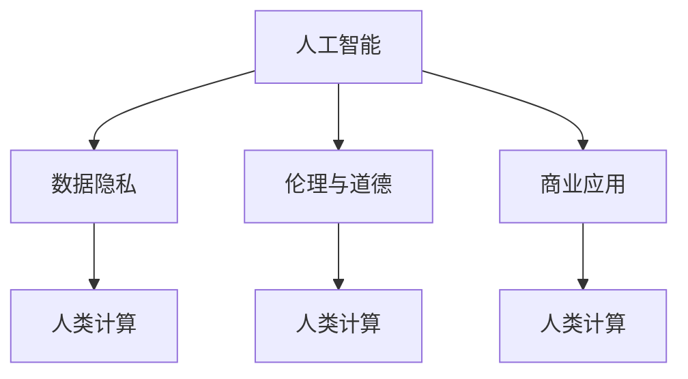
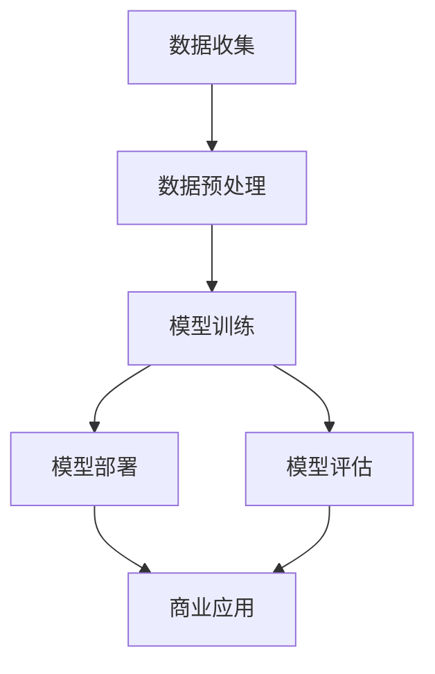

                 

# AI驱动的创新：人类计算在商业中的道德考虑因素展望

> 关键词：AI伦理、数据隐私、人类计算、道德规范、商业应用

## 1. 背景介绍

在现代社会，人工智能(AI)正在迅速渗透到各个行业，以强大的计算能力和学习能力推动着产业的创新和变革。与此同时，AI技术的发展也引发了一系列伦理和道德问题。在商业领域，如何平衡技术创新与道德规范之间的关系，成为亟待解决的重要课题。

本文旨在探讨AI在商业中驱动创新所面临的伦理和道德挑战，并提供相应的对策建议。我们认为，人类计算（Human-Computer Interaction, HCI）的理念和方法，可以为我们提供重要的启示和指导，帮助我们在追求商业价值的同时，保持对人类尊严和权利的尊重。

## 2. 核心概念与联系

### 2.1 核心概念概述

- **人工智能**：指利用计算机算法和数据对任务进行模拟、决策和预测的技术，包括机器学习、深度学习、自然语言处理等。
- **人类计算**：强调人在计算和信息处理过程中的作用，认为人类应与机器协同工作，而不是被机器所取代。
- **伦理与道德**：指个人和社会应遵循的规范和标准，确保行为符合公平、正义、尊重等原则。
- **数据隐私**：指个人数据被收集、存储、处理和传输时，如何保护其不被未经授权的第三方获取和利用。
- **商业应用**：指AI技术在商业领域的具体应用，如客户服务、市场分析、产品推荐等。

这些概念之间的逻辑关系可以通过以下Mermaid流程图来展示：



这个流程图展示了一体化在AI技术、数据隐私、伦理道德、商业应用和人类计算之间的关系。

### 2.2 核心概念原理和架构的 Mermaid 流程图

以下是AI技术在商业中的基本架构，展示了数据流向和技术流程：



## 3. 核心算法原理 & 具体操作步骤

### 3.1 算法原理概述

AI在商业中驱动创新的核心算法原理基于数据驱动的决策支持。具体而言，包括以下几个关键步骤：

1. **数据收集与预处理**：收集相关数据，并对数据进行清洗、标准化等预处理。
2. **模型训练**：使用机器学习或深度学习算法对数据进行训练，构建预测模型。
3. **模型评估与优化**：对模型进行评估，不断优化模型以提高预测准确性。
4. **模型部署与应用**：将训练好的模型部署到实际应用场景中，用于商业决策支持。

### 3.2 算法步骤详解

以一个简单的推荐系统为例，算法步骤包括：

1. **数据收集**：收集用户的历史行为数据，如浏览、购买、评价等。
2. **数据预处理**：清洗数据，去除噪声，标准化数据格式。
3. **模型训练**：使用协同过滤或深度学习算法训练推荐模型。
4. **模型评估**：使用A/B测试等方法评估推荐效果，优化模型。
5. **模型部署与应用**：将模型集成到推荐引擎中，为用户实时推荐商品。

### 3.3 算法优缺点

**优点**：
- **提升效率**：AI可以处理大规模数据，提供快速、准确的决策支持。
- **个性化服务**：通过分析用户数据，提供定制化的推荐和建议。
- **降低成本**：自动化流程减少了人工干预，降低了运营成本。

**缺点**：
- **隐私风险**：数据收集和使用可能侵犯用户隐私。
- **模型偏见**：数据和算法可能存在偏见，影响公平性。
- **解释性不足**：黑盒模型难以解释其决策过程，难以获得用户的信任。
- **依赖数据质量**：模型依赖高质量的数据，数据偏差会影响模型效果。

### 3.4 算法应用领域

AI在商业中广泛应用于以下几个领域：

- **客户服务**：智能客服、语音助手等。
- **市场分析**：消费者行为分析、市场趋势预测等。
- **产品推荐**：电商推荐、内容推荐等。
- **风险管理**：信用评估、欺诈检测等。
- **供应链优化**：库存管理、物流优化等。

## 4. 数学模型和公式 & 详细讲解 & 举例说明

### 4.1 数学模型构建

以推荐系统为例，推荐模型可以基于协同过滤或基于内容的推荐算法构建。协同过滤模型基于用户和物品之间的相似性进行推荐，数学模型如下：

$$
\hat{y} = \sum_{i=1}^{n} a_{ui} x_{i} \quad \text{where} \quad y = [y_1, y_2, ..., y_m] \in \mathbb{R}^m
$$

其中，$y$表示用户对物品的评分，$a_{ui}$表示用户$i$对物品$u$的评分，$x_i$表示物品$u$的特征向量。

### 4.2 公式推导过程

对于协同过滤模型，我们假设用户与物品之间的关系可以通过矩阵$A$和$X$表示，则用户对物品$u$的评分预测公式为：

$$
\hat{y} = A \cdot X
$$

通过SVD分解，我们可以进一步表示为：

$$
\hat{y} = U \cdot \Sigma \cdot V^T
$$

其中$U$和$V$是低维投影矩阵，$\Sigma$是对角矩阵。

### 4.3 案例分析与讲解

假设我们有一个电商网站，希望为用户推荐商品。我们收集了用户的历史浏览和购买数据，使用协同过滤算法训练推荐模型。

1. **数据收集**：从网站后台获取用户ID、商品ID、评分、购买时间等数据。
2. **数据预处理**：对数据进行清洗，去除无效数据，标准化评分值。
3. **模型训练**：使用矩阵分解方法对数据进行训练，得到用户和物品的推荐权重。
4. **模型评估**：使用A/B测试等方法评估推荐效果，优化模型。
5. **模型部署与应用**：将模型集成到推荐引擎中，实时推荐商品给用户。

## 5. 项目实践：代码实例和详细解释说明

### 5.1 开发环境搭建

以Python和TensorFlow为例，进行推荐系统的开发环境搭建：

1. 安装Python：从官网下载并安装Python 3.8。
2. 安装TensorFlow：使用pip安装TensorFlow，选择最新版本。
3. 安装相关库：安装numpy、pandas、scikit-learn等库。

### 5.2 源代码详细实现

以下是一个简单的推荐系统代码实现：

```python
import tensorflow as tf
import numpy as np
import pandas as pd

# 数据预处理
data = pd.read_csv('ratings.csv')
train_data = data.sample(frac=0.8, random_state=42)
test_data = data.drop(train_data.index)

# 构建用户物品评分矩阵
train_matrix = train_data.pivot_table(index='user_id', columns='item_id', values='rating').values
test_matrix = test_data.pivot_table(index='user_id', columns='item_id', values='rating').values

# 使用SVD分解
U, S, Vt = svd(train_matrix, full_matrices=False)

# 预测评分
test_pred = np.dot(U, np.dot(np.diag(S), Vt))
test_pred = test_pred * Vt.T

# 评估推荐效果
mse = mean_squared_error(test_matrix, test_pred)
print('Mean Squared Error:', mse)
```

### 5.3 代码解读与分析

代码实现了协同过滤算法的基本流程，包括数据预处理、矩阵分解、评分预测和效果评估。通过实际数据集，展示了推荐系统的基本框架和计算过程。

## 6. 实际应用场景

### 6.1 智能客服系统

智能客服系统通过自然语言处理(NLP)技术，利用AI驱动的推荐算法，为用户提供个性化服务。系统可以理解用户的问题，并推荐最相关的回答。

**优点**：
- **提升效率**：自动处理大量客户咨询，提高响应速度。
- **个性化服务**：根据用户历史交互记录，推荐最合适的答案。

**缺点**：
- **隐私风险**：需要收集用户对话数据，可能侵犯隐私。
- **模型偏见**：系统可能存在性别、种族等方面的偏见。

### 6.2 市场分析与决策支持

市场分析系统通过AI技术，对消费者行为数据进行分析，预测市场趋势，辅助企业做出战略决策。

**优点**：
- **快速准确**：自动处理大规模数据，提供实时决策支持。
- **多维度分析**：结合历史数据和实时数据，提供全面的分析结果。

**缺点**：
- **数据质量**：依赖高质量数据，数据偏差影响结果。
- **模型解释**：黑盒模型难以解释其决策过程。

### 6.3 个性化推荐系统

个性化推荐系统利用AI技术，根据用户的历史行为和兴趣，推荐相关的商品或内容。

**优点**：
- **提高转化率**：通过个性化推荐，提高用户购买或点击率。
- **降低运营成本**：自动化推荐流程，减少人工干预。

**缺点**：
- **隐私风险**：需要收集用户行为数据，可能侵犯隐私。
- **模型偏见**：推荐算法可能存在性别、年龄等方面的偏见。

## 7. 工具和资源推荐

### 7.1 学习资源推荐

1. **《人工智能伦理》**：介绍AI技术的伦理和道德问题，提供深入的理论分析。
2. **《数据科学与商业应用》**：结合案例，讲解数据科学在商业中的应用。
3. **《人类计算基础》**：介绍HCI理念和方法，强调人在计算中的重要性。
4. **Coursera《数据科学导论》课程**：提供系统化学习数据科学的机会，涵盖数据预处理、模型训练等内容。

### 7.2 开发工具推荐

1. **Python**：易用性强，适合快速开发原型和模型。
2. **TensorFlow**：强大的深度学习框架，提供丰富的工具和库。
3. **PyTorch**：灵活的深度学习框架，支持动态图计算。
4. **Jupyter Notebook**：交互式开发环境，方便代码调试和分享。

### 7.3 相关论文推荐

1. **《人工智能伦理原则》**：提出AI技术的伦理框架，讨论隐私保护和公平性等问题。
2. **《数据隐私保护技术》**：介绍数据隐私保护的技术和方法。
3. **《人类计算与人工智能协同》**：讨论HCI和AI的结合，提升用户交互体验。

## 8. 总结：未来发展趋势与挑战

### 8.1 研究成果总结

本文系统探讨了AI在商业中的伦理和道德问题，提出基于人类计算的解决方案，为未来AI技术的发展提供了重要参考。

### 8.2 未来发展趋势

未来AI技术将继续渗透到各个行业，驱动创新和变革。但同时也需注意以下几点：

- **隐私保护**：在数据收集和使用过程中，必须严格遵守数据隐私保护法律法规。
- **公平性**：AI模型必须避免偏见，确保公平对待不同群体。
- **可解释性**：提高AI模型的透明性和可解释性，增强用户信任。
- **用户参与**：在AI系统设计和应用中，充分考虑用户的意见和需求。

### 8.3 面临的挑战

尽管AI技术在商业中带来诸多好处，但也面临诸多挑战：

- **隐私泄露**：数据收集和使用过程中，存在隐私泄露的风险。
- **模型偏见**：数据和算法可能存在偏见，影响公平性。
- **技术壁垒**：AI技术的复杂性增加了部署和使用难度。
- **法律监管**：AI技术的应用需要遵守相关的法律法规。

### 8.4 研究展望

未来研究需从以下几个方面进行：

- **隐私保护技术**：开发更加有效的隐私保护技术，确保数据安全。
- **公平性算法**：研究消除偏见的方法，确保AI模型的公平性。
- **可解释AI**：开发可解释性更好的AI模型，增强用户信任。
- **人机协同**：结合人类计算理念，提升AI系统的表现和用户满意度。

## 9. 附录：常见问题与解答

**Q1: 如何保护用户隐私？**

A: 在数据收集和处理过程中，采用加密技术、匿名化处理等手段保护用户隐私。同时，制定严格的数据访问权限控制，确保数据不被未经授权的第三方获取和利用。

**Q2: 如何避免AI模型偏见？**

A: 在数据收集和处理阶段，确保数据多样性，避免数据偏差。在模型训练过程中，使用公平性算法，减少模型偏见。在模型评估和应用阶段，定期监测和修正模型行为，确保公平性。

**Q3: 如何提高AI模型的可解释性？**

A: 采用可解释性更好的模型结构，如线性模型、决策树等。在模型训练过程中，记录和分析模型行为，提供详细的解释和可视化。结合领域专家知识，解释模型的决策过程。

**Q4: 如何平衡AI与人类计算？**

A: 在AI系统设计和应用中，充分考虑用户的意见和需求。结合人类计算理念，提升AI系统的表现和用户满意度。在AI系统开发和部署过程中，充分考虑用户参与和反馈。

---

作者：禅与计算机程序设计艺术 / Zen and the Art of Computer Programming

