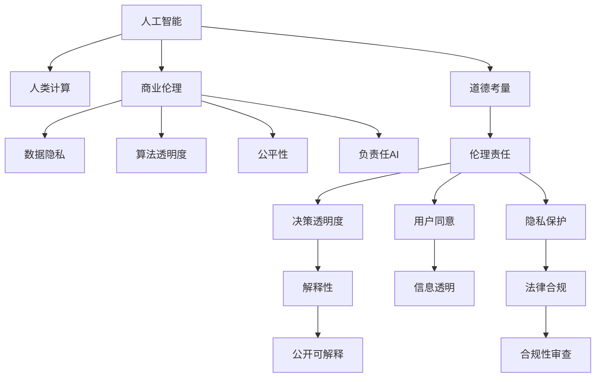

                 

# AI驱动的创新：人类计算在商业中的道德考虑因素总结

> 关键词：人工智能,人类计算,商业伦理,数据隐私,算法透明度,AI治理,负责任AI

## 1. 背景介绍

随着人工智能(AI)技术的快速发展，其在商业应用中的作用日益凸显。从自动化生产线到个性化推荐系统，从智能客服到实时分析，AI正在改变企业的运营模式，提升效率，创造价值。然而，技术的进步也带来了新的道德挑战，如何在创新与道德之间取得平衡，成为AI应用的关键考量。

### 1.1 问题的由来

AI在商业中的应用，不仅仅是技术问题，更涉及到伦理、隐私、公平性等多方面的考量。随着深度学习、自然语言处理等技术的普及，越来越多的企业开始探索AI带来的商业创新。但与此同时，AI应用也引发了一系列社会问题，如数据隐私泄露、算法偏见、AI决策的透明度等，需要引起重视。

### 1.2 问题核心关键点

AI在商业中的道德考虑主要集中在以下几个方面：
- **数据隐私**：如何在收集和使用数据时保障用户隐私。
- **算法透明度**：用户如何理解AI系统的决策过程。
- **公平性**：AI系统是否对所有用户公平，是否存在算法偏见。
- **责任归属**：AI决策出错时，由谁承担责任。
- **伦理问题**：AI系统是否符合社会道德规范。

这些问题不仅关系到企业的信誉和合规性，更直接关系到用户的切身利益和社会的公正性。因此，企业在应用AI技术时，必须全面考虑这些道德因素，以确保技术的可持续性和社会的和谐发展。

## 2. 核心概念与联系

### 2.1 核心概念概述

为更好地理解AI在商业应用中的道德考虑，本节将介绍几个关键概念：

- **人工智能(AI)**：通过计算机算法和数据处理，使机器具备类似人类智能能力的系统，如深度学习、强化学习、自然语言处理等。
- **人类计算(Computational Humanity)**：利用AI技术处理人类特有的思维、情感、行为等，增强人类的计算能力。
- **商业伦理(Business Ethics)**：企业在商业活动中遵循的道德规范和价值判断。
- **数据隐私(Data Privacy)**：保护个人信息不受未经授权的收集、使用和公开。
- **算法透明度(Algorithm Transparency)**：用户对AI系统决策过程的可理解和可解释性。
- **公平性(Fairness)**：AI系统对所有用户平等对待，不因性别、种族、年龄等因素产生偏见。
- **负责任AI(Responsible AI)**：确保AI系统符合社会道德规范，造福人类社会。

这些核心概念共同构成了AI在商业应用中的道德框架，是确保技术创新与社会公正相协调的基础。

### 2.2 核心概念原理和架构的 Mermaid 流程图



这个流程图展示了大语言模型在商业应用中的核心概念及其之间的逻辑关系：

1. 人工智能技术在处理人类计算任务时，需要考虑其伦理和社会影响。
2. 商业伦理是指导AI技术应用的道德规范。
3. 数据隐私是确保用户信息安全的核心要素。
4. 算法透明度要求用户理解和信任AI决策过程。
5. 公平性是评估AI系统是否公平对待所有用户的标准。
6. 负责任AI强调AI系统在社会中的正面作用。
7. AI技术在商业应用时，需要综合考虑这些道德因素，以确保技术的可持续性和社会的和谐发展。

## 3. 核心算法原理 & 具体操作步骤

### 3.1 算法原理概述

基于AI的商业创新，其核心算法原理包括但不限于：

- **深度学习(Deep Learning)**：通过多层神经网络模型，学习数据中的复杂关系，用于图像识别、语音识别、自然语言处理等任务。
- **强化学习(Reinforcement Learning)**：通过与环境的交互，使机器学习到最优决策策略，用于游戏、推荐系统等场景。
- **自然语言处理(Natural Language Processing, NLP)**：使机器理解、生成和处理人类语言，用于聊天机器人、情感分析等任务。

这些算法在商业中的应用，旨在通过数据分析和机器学习，提升商业运营的效率和效果。但这些算法也需要考虑到伦理、隐私等因素，确保其应用符合社会规范。

### 3.2 算法步骤详解

基于AI的商业创新通常包括以下几个关键步骤：

**Step 1: 数据收集与预处理**
- 收集与业务相关的数据，如用户行为数据、市场调研数据、产品性能数据等。
- 对数据进行清洗、去重、归一化等预处理，确保数据质量。

**Step 2: 模型训练与优化**
- 根据商业需求，选择适合的算法模型，如深度神经网络、决策树、支持向量机等。
- 使用收集到的数据训练模型，并根据评估指标（如准确率、召回率、F1分数等）对模型进行优化。

**Step 3: 模型部署与监控**
- 将训练好的模型部署到商业系统中，用于实时分析和预测。
- 持续监控模型的运行状态和性能，及时发现并修复问题。

**Step 4: 用户反馈与迭代**
- 收集用户对AI系统输出的反馈，如满意度、使用频率等。
- 根据反馈进行模型迭代和优化，提高系统的适应性和用户体验。

### 3.3 算法优缺点

基于AI的商业创新具有以下优点：
1. 提高效率：自动化处理大量数据，减少人工工作量。
2. 个性化服务：通过数据分析，提供个性化的服务和推荐。
3. 决策支持：辅助企业做出更科学、更精准的决策。
4. 降低成本：减少人力和运营成本，提升竞争力。

但同时，这些技术也存在一些局限性：
1. 数据依赖：模型训练和优化依赖大量高质量的数据，数据不足可能导致效果不佳。
2. 透明度不足：部分AI模型（如深度学习）难以解释其决策过程，用户可能难以理解和信任。
3. 偏见和歧视：AI系统可能会学习并放大数据中的偏见，导致不公平的决策。
4. 责任归属：AI系统在决策错误时，责任归属不明确，可能导致法律风险。
5. 伦理问题：AI系统在处理敏感信息时，可能涉及隐私保护和伦理道德的争议。

### 3.4 算法应用领域

基于AI的商业创新技术，已经在多个领域得到广泛应用，例如：

- **金融行业**：用于风险评估、信用评分、市场分析等，提高金融决策的精准性和效率。
- **零售行业**：用于客户行为分析、个性化推荐、库存管理等，提升用户体验和运营效率。
- **医疗行业**：用于疾病预测、药物研发、医疗影像分析等，改善医疗服务和提高诊断准确率。
- **制造行业**：用于生产流程优化、质量控制、设备维护等，提高生产效率和产品质量。
- **交通行业**：用于交通流量预测、智能驾驶、路线优化等，改善交通管理和出行体验。
- **教育行业**：用于智能辅导、课程推荐、学习分析等，提升教育质量和个性化教学。
- **安防行业**：用于人脸识别、异常检测、行为分析等，提高安全防护和监控效果。

这些应用领域展示了AI技术的强大潜力和广泛适用性，但也提醒企业在应用过程中，需充分考虑数据隐私、算法透明度等问题。

## 4. 数学模型和公式 & 详细讲解

### 4.1 数学模型构建

以金融行业的信用评分系统为例，构建基于AI的商业创新模型的数学模型。

假设用户数据集为 $D = \{(x_i, y_i)\}_{i=1}^N$，其中 $x_i = [x_{i1}, x_{i2}, ..., x_{in}]$ 为特征向量， $y_i = 0$ 或 $1$ 表示用户是否具有良好信用。

定义模型为 $M_{\theta}$，其中 $\theta$ 为模型参数，包括权重和偏置。

信用评分系统的目标是最小化损失函数 $\mathcal{L}$：

$$
\mathcal{L}(M_{\theta}, D) = -\frac{1}{N} \sum_{i=1}^N [y_i \log M_{\theta}(x_i) + (1-y_i) \log(1-M_{\theta}(x_i))]
$$

其中 $M_{\theta}(x_i)$ 为模型对样本 $x_i$ 的预测概率。

### 4.2 公式推导过程

根据上述定义，推导模型训练的优化目标：

$$
\theta^* = \mathop{\arg\min}_{\theta} \mathcal{L}(M_{\theta}, D)
$$

通过反向传播算法，计算损失函数对参数 $\theta$ 的梯度，并更新参数：

$$
\theta \leftarrow \theta - \eta \nabla_{\theta}\mathcal{L}(\theta)
$$

其中 $\eta$ 为学习率，$\nabla_{\theta}\mathcal{L}(\theta)$ 为损失函数对模型参数的梯度，可通过反向传播高效计算。

### 4.3 案例分析与讲解

假设有一个电商平台的推荐系统，用于预测用户是否会购买某件商品。我们收集用户行为数据，包括浏览记录、购买历史、评分记录等，并定义预测模型的输入特征 $x_i$ 和输出标签 $y_i$。

我们首先使用随机梯度下降法（SGD）优化模型参数 $\theta$，最小化损失函数 $\mathcal{L}$：

$$
\theta \leftarrow \theta - \eta \frac{1}{N} \sum_{i=1}^N [y_i \log M_{\theta}(x_i) + (1-y_i) \log(1-M_{\theta}(x_i))]
$$

在训练过程中，我们不断迭代模型，计算梯度并更新参数，直至模型收敛。训练完成后，我们将模型部署到推荐系统中，根据用户的行为数据实时预测其购买倾向。

## 5. 项目实践：代码实例和详细解释说明

### 5.1 开发环境搭建

在进行AI商业创新项目开发前，我们需要准备好开发环境。以下是使用Python进行PyTorch开发的环境配置流程：

1. 安装Anaconda：从官网下载并安装Anaconda，用于创建独立的Python环境。

2. 创建并激活虚拟环境：
```bash
conda create -n pytorch-env python=3.8 
conda activate pytorch-env
```

3. 安装PyTorch：根据CUDA版本，从官网获取对应的安装命令。例如：
```bash
conda install pytorch torchvision torchaudio cudatoolkit=11.1 -c pytorch -c conda-forge
```

4. 安装TensorBoard：
```bash
pip install tensorboard
```

5. 安装TensorFlow：
```bash
pip install tensorflow
```

6. 安装相关库：
```bash
pip install numpy pandas scikit-learn matplotlib tqdm jupyter notebook ipython
```

完成上述步骤后，即可在`pytorch-env`环境中开始项目实践。

### 5.2 源代码详细实现

下面以金融行业的信用评分系统为例，给出使用PyTorch进行AI商业创新实践的代码实现。

```python
import torch
import torch.nn as nn
import torch.optim as optim
import numpy as np
from sklearn.model_selection import train_test_split
from sklearn.preprocessing import StandardScaler
from sklearn.metrics import accuracy_score, roc_auc_score
import pandas as pd

# 加载数据集
df = pd.read_csv('credit_score.csv')

# 数据预处理
X = df.drop('label', axis=1)
y = df['label']
X_train, X_test, y_train, y_test = train_test_split(X, y, test_size=0.2, random_state=42)

# 标准化数据
scaler = StandardScaler()
X_train = scaler.fit_transform(X_train)
X_test = scaler.transform(X_test)

# 定义模型
class CreditScoringModel(nn.Module):
    def __init__(self):
        super(CreditScoringModel, self).__init__()
        self.fc1 = nn.Linear(10, 5)
        self.fc2 = nn.Linear(5, 1)
        self.sigmoid = nn.Sigmoid()

    def forward(self, x):
        x = self.fc1(x)
        x = self.fc2(x)
        return self.sigmoid(x)

# 训练模型
model = CreditScoringModel()
criterion = nn.BCELoss()
optimizer = optim.Adam(model.parameters(), lr=0.01)
epochs = 10

for epoch in range(epochs):
    model.train()
    optimizer.zero_grad()
    y_pred = model(X_train)
    loss = criterion(y_pred, y_train)
    loss.backward()
    optimizer.step()

    model.eval()
    y_pred = model(X_test)
    y_pred = y_pred > 0.5
    accuracy = accuracy_score(y_test, y_pred)
    print(f"Epoch {epoch+1}, Accuracy: {accuracy:.3f}")
```

### 5.3 代码解读与分析

**数据预处理**：
- 首先，我们使用pandas加载信用评分数据集，并将其分为特征和标签。
- 接着，使用train_test_split函数将数据集划分为训练集和测试集，比例为80:20。
- 然后，使用StandardScaler对特征进行标准化处理，确保不同特征在同一量级。

**模型定义**：
- 我们定义了一个简单的神经网络模型，包括两个全连接层和一个Sigmoid激活函数。
- 第一层输入特征数量为10，输出特征数量为5。
- 第二层输入特征数量为5，输出特征数量为1，用于二分类任务。
- Sigmoid激活函数用于将输出转化为概率值，范围在0到1之间。

**模型训练**：
- 在每个epoch中，我们首先将模型设置为训练模式。
- 使用Adam优化器对模型参数进行更新，学习率为0.01。
- 计算损失函数，并根据损失函数的梯度更新模型参数。
- 在每个epoch结束后，将模型设置为评估模式，计算测试集的准确率并打印输出。

这个代码实例展示了如何使用PyTorch进行简单的信用评分系统训练，但实际应用中还需要考虑数据隐私、算法透明度、公平性等问题。

## 6. 实际应用场景

### 6.1 智能客服系统

智能客服系统利用AI技术，通过语音识别、自然语言处理等技术，实现自动应答和问题解决。这不仅提升了客户体验，还减轻了客服人员的工作负担。

在实际应用中，智能客服系统需要处理大量的客户咨询，涉及敏感个人信息。因此，企业在设计系统时，必须考虑数据隐私和算法透明度的要求，确保客户信息安全。

### 6.2 个性化推荐系统

个性化推荐系统利用AI技术，根据用户的历史行为和偏好，推荐其可能感兴趣的商品或服务。通过优化推荐算法，可以提升用户体验和销售额。

然而，个性化推荐系统可能涉及用户隐私数据的使用，需要遵循数据隐私法规。同时，系统推荐的公平性问题也需要考虑，避免因算法偏见导致的不公平推荐。

### 6.3 智能监控系统

智能监控系统利用AI技术，对视频、音频等数据进行实时分析和处理，提升安防水平和应急响应能力。

在实际应用中，智能监控系统涉及视频、音频等敏感数据的处理，需要遵循数据隐私法规。同时，系统决策的公平性和透明度也是重要考量因素，确保监控结果公正可靠。

## 7. 工具和资源推荐

### 7.1 学习资源推荐

为帮助开发者掌握AI在商业应用中的道德考虑，这里推荐一些优质的学习资源：

1. **《负责任AI指南》(The Ethics of AI) - 谷歌 AI 和机器学习伦理小组**：提供了关于AI伦理的全面指南，包括数据隐私、算法透明度、公平性等问题。

2. **《人工智能伦理导论》(Artificial Intelligence: A Guide for Thinking Humans) - Melanie Mitchell**：深入浅出地介绍了AI伦理、隐私、公平性等内容，适合初学者学习。

3. **《深度学习实战》(Deep Learning with PyTorch) - Eli Stevens, Luca Antiga**：介绍了使用PyTorch进行深度学习开发，涵盖了数据预处理、模型训练、部署等环节。

4. **《数据科学导论》(Introduction to Data Science in Python) - DataCamp**：系统介绍了数据科学和机器学习基础，适合初学者入门。

5. **《自然语言处理基础》(Fundamentals of Natural Language Processing) - Stanford CS224N课程**：提供了自然语言处理的基础知识和实践方法，适合进阶学习。

通过学习这些资源，可以帮助开发者系统掌握AI在商业应用中的道德考虑，确保技术创新与社会伦理相协调。

### 7.2 开发工具推荐

高效的工具是提升AI商业创新项目开发效率的关键。以下是几款常用的开发工具：

1. **PyTorch**：基于Python的深度学习框架，支持动态计算图，易于开发和调试。

2. **TensorFlow**：由Google开发的深度学习框架，生产部署方便，适合大规模工程应用。

3. **TensorBoard**：TensorFlow配套的可视化工具，实时监测模型训练状态，提供丰富的图表呈现方式。

4. **Jupyter Notebook**：免费的开源交互式笔记本环境，适合进行数据探索和模型开发。

5. **Hugging Face Transformers库**：提供了多种预训练语言模型和模型库，方便开发者进行模型微调和优化。

6. **GitHub**：代码托管平台，方便版本控制和协作开发。

合理利用这些工具，可以显著提升AI商业创新项目开发效率，加速创新迭代的步伐。

### 7.3 相关论文推荐

AI在商业应用中的道德考虑涉及多学科交叉，以下是几篇奠基性的相关论文，推荐阅读：

1. **《深度学习伦理：挑战与机遇》(Ethics in the Age of AI) - Chris Bregler**：探讨了AI伦理中的关键问题，如数据隐私、算法透明度、责任归属等。

2. **《公平性与机器学习》(Fairness in Machine Learning) - Ken Goldberg, Rana Adib**：讨论了机器学习中的公平性问题，并提出了一些改进方案。

3. **《负责任AI的道德与技术》(Responsible AI: Lessons Learned from Practice) - Jeff Bub, Donna Howard**：基于实际案例，讨论了负责任AI的道德和技术挑战。

4. **《负责任AI与伦理算法》(Responsible AI and Ethical Algorithms) - Luca Freitag, Rita Giampietri**：提出了负责任AI的框架，并讨论了实际应用中的挑战。

这些论文代表了大语言模型在商业应用中的道德考虑的研究进展，通过学习这些前沿成果，可以帮助研究者把握学科前进方向，激发更多的创新灵感。

## 8. 总结：未来发展趋势与挑战

### 8.1 总结

本文对AI在商业应用中的道德考虑进行了全面系统的介绍。首先阐述了AI技术在商业创新中的作用，明确了其带来的效率提升和价值创造。其次，从伦理、隐私、公平性等多个维度，详细讲解了AI在商业应用中的道德挑战。

通过本文的系统梳理，可以看到，AI在商业应用中不仅带来了技术创新，也引发了伦理和道德的深刻思考。企业在应用AI技术时，必须全面考虑这些因素，以确保技术的可持续性和社会的和谐发展。

### 8.2 未来发展趋势

展望未来，AI在商业应用中的道德考虑将呈现以下几个发展趋势：

1. **数据隐私保护**：随着数据泄露事件频发，数据隐私保护成为关注的焦点。未来AI系统将更加注重数据隐私保护，采用差分隐私、联邦学习等技术，保障用户信息安全。

2. **算法透明度提升**：AI系统将更加注重算法透明度的提升，采用可解释AI(XAI)技术，使模型决策过程可理解和可解释。

3. **公平性评估与优化**：AI系统将进一步优化公平性评估指标，避免因算法偏见导致的歧视现象。引入公平性训练、对抗训练等方法，提升系统公平性。

4. **负责任AI普及**：负责任AI的理念将进一步普及，成为AI技术应用的重要指导原则。企业将在AI系统开发和应用中，更加注重社会责任和伦理道德。

5. **跨学科合作加强**：AI在商业应用中的道德问题涉及伦理学、法学、社会学等多个学科，未来将加强跨学科合作，推动负责任AI的研究和实践。

这些趋势展示了AI在商业应用中的道德挑战和解决方案，预示了AI技术在社会中的可持续发展方向。

### 8.3 面临的挑战

尽管AI在商业应用中的道德考虑取得了一定的进展，但仍面临诸多挑战：

1. **数据隐私保护难度大**：数据隐私保护涉及技术、法律、伦理等多个维度，难度较大。如何在保护隐私的前提下，实现数据的合理利用，是一个重要问题。

2. **算法透明度不足**：部分AI模型（如深度学习）难以解释其决策过程，用户可能难以理解和信任。如何提高模型的可解释性，是一个重要挑战。

3. **公平性问题复杂**：AI系统可能因数据偏见和算法设计问题，导致不公平的决策。如何在设计阶段就避免偏见，是一个需要深入研究的课题。

4. **负责任AI的执行难度**：负责任AI的理念在实际操作中面临执行难度，如何在实际应用中落地负责任AI的原则，是一个重要挑战。

5. **跨学科合作不足**：AI伦理问题涉及多个学科，跨学科合作不足，阻碍了负责任AI的研究和实践。如何加强跨学科合作，是一个亟待解决的问题。

这些挑战展示了AI在商业应用中的伦理和道德困境，需要在技术、法律、社会等多个层面共同努力，才能推动负责任AI的发展。

### 8.4 研究展望

未来的研究需要在以下几个方面寻求新的突破：

1. **隐私保护技术创新**：开发更加有效的数据隐私保护技术，如差分隐私、联邦学习等，保障用户信息安全。

2. **可解释AI技术优化**：进一步优化可解释AI技术，使模型决策过程更加透明和可理解。引入模型可视化、部分可解释等技术，提升用户信任度。

3. **公平性评估指标改进**：改进公平性评估指标，引入更多的公平性约束，如反偏见训练、对抗训练等方法，提升系统的公平性。

4. **负责任AI规范制定**：制定负责任AI的规范和标准，推动企业在AI系统设计和应用中遵循负责任AI原则。

5. **跨学科合作深化**：加强跨学科合作，推动AI伦理和负责任AI的研究和实践。举办国际研讨会、合作项目，促进跨学科交流。

这些研究方向将有助于推动负责任AI的发展，为AI技术在商业应用中的道德挑战提供解决方案。

## 9. 附录：常见问题与解答

**Q1：AI在商业应用中如何保护数据隐私？**

A: 保护数据隐私是AI在商业应用中的重要问题。常用的方法包括：

1. **差分隐私**：在数据收集和处理过程中，通过添加噪声和匿名化技术，保护用户隐私。
2. **联邦学习**：将数据分布式存储在多个节点上，只传输模型参数和梯度，不传输原始数据。
3. **隐私计算**：采用多方计算、同态加密等技术，在不暴露原始数据的前提下，进行数据处理和分析。
4. **数据最小化原则**：只收集和处理必要的数据，最小化对用户隐私的侵犯。

**Q2：如何提高AI系统的透明度和可解释性？**

A: 提高AI系统的透明度和可解释性，可以通过以下方法：

1. **可解释AI(XAI)**：引入可解释AI技术，如特征重要性分析、决策路径可视化等，使模型决策过程可理解和可解释。
2. **模型可视化**：使用模型可视化工具，如TensorBoard，实时监测模型训练和推理过程，提升用户信任度。
3. **部分可解释**：在不影响模型性能的前提下，只解释部分关键决策过程，降低解释成本。
4. **交互式解释**：设计交互式界面，使用户可以主动查询和解释模型决策过程。

**Q3：如何避免AI系统的偏见和歧视？**

A: 避免AI系统的偏见和歧视，可以通过以下方法：

1. **数据清洗和标注**：在数据收集和预处理阶段，清洗数据中的偏见和噪声，确保数据质量。
2. **公平性约束**：在模型训练阶段，引入公平性约束，如反偏见训练、对抗训练等，提升系统公平性。
3. **多模型融合**：采用多个模型进行融合，减少单个模型的偏见和歧视。
4. **定期审核**：定期审核AI系统，监测模型性能和公平性，及时发现和修正问题。

**Q4：如何确保AI系统的责任归属？**

A: 确保AI系统的责任归属，可以通过以下方法：

1. **明确责任方**：在AI系统设计和应用中，明确责任方，如开发人员、管理者等。
2. **风险评估**：对AI系统进行风险评估，明确可能出现的风险和后果，制定应对措施。
3. **法律合规**：遵循相关法律法规，确保AI系统在合规的前提下运行。
4. **用户知情权**：确保用户对AI系统有足够的了解，能够主动获取和使用相关数据。

这些回答展示了AI在商业应用中的道德考虑和解决策略，为企业在应用AI技术时提供了重要参考。

---

作者：禅与计算机程序设计艺术 / Zen and the Art of Computer Programming

