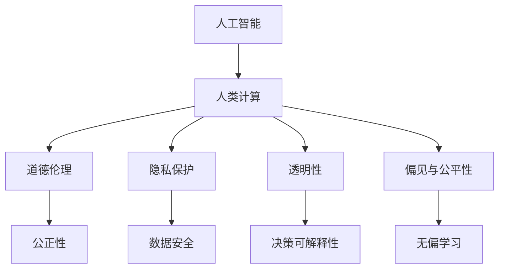

                 

# AI驱动的创新：人类计算在商业中的道德考虑因素挑战与机遇

## 1. 背景介绍

随着人工智能（AI）技术的迅猛发展，人类计算（Human Computation）成为商业创新的重要驱动力。通过将复杂的计算任务交给机器处理，人类可以专注于更高层次的创造性工作，推动商业模式的创新和业务效率的提升。然而，AI和人类计算的广泛应用也带来了新的道德伦理挑战，需要企业在技术创新与道德责任之间找到平衡。本文将深入探讨人类计算在商业中的道德考虑因素，分析其挑战与机遇，并提出相应的应对策略。

## 2. 核心概念与联系

### 2.1 核心概念概述

为了更好地理解人类计算在商业中的应用及其道德考虑，本节将介绍几个核心概念：

- **人工智能（AI）**：以机器学习、深度学习等为代表的智能技术，能够模拟人类智能行为，进行数据处理、模式识别等任务。
- **人类计算（Human Computation）**：将复杂的计算任务交给人类完成，利用人类的创造力、直觉和洞察力来解决问题。
- **道德伦理（Ethics）**：在人工智能和人类计算中，关注技术应用对社会、环境和人类福祉的影响，以及如何确保技术决策的公正性和透明度。
- **隐私保护（Privacy）**：在数据收集、存储、处理等环节，保护个人数据不被滥用，确保用户隐私得到尊重。
- **透明性（Transparency）**：确保AI和人类计算过程的可解释性，使用户能够理解和信任模型的决策过程。
- **偏见与公平性（Bias and Fairness）**：避免模型在学习过程中引入偏见，确保其在不同人群中的公平性。

这些核心概念之间的逻辑关系可以通过以下Mermaid流程图来展示：



这个流程图展示了我们提到的核心概念及其之间的关系：

1. 人工智能和人类计算相互结合，共同推动商业创新。
2. 道德伦理、隐私保护、透明性和偏见与公平性是确保人工智能和人类计算安全、公正、透明的重要因素。
3. 公正性、数据安全、决策可解释性和无偏学习是具体的应用目标。

这些概念构成了人类计算和AI技术在商业应用中的道德伦理框架，指导着企业在技术创新和道德责任之间的平衡。

## 3. 核心算法原理 & 具体操作步骤

### 3.1 算法原理概述

在商业中，AI和人类计算的结合通常涉及以下几个步骤：

1. **数据收集与预处理**：从商业环境中收集数据，并进行清洗、标注等预处理，确保数据的质量。
2. **模型训练与优化**：利用机器学习或深度学习算法，在大量数据上训练AI模型，不断优化模型的性能。
3. **部署与集成**：将训练好的模型集成到商业应用中，实现自动化、智能化的业务流程。
4. **人类计算介入**：在AI模型无法处理的复杂、创造性任务中，引入人类计算，补充模型的能力。
5. **结果反馈与迭代**：根据实际业务反馈，调整AI和人类计算的结合方式，不断改进技术应用。

### 3.2 算法步骤详解

基于上述步骤，下面是详细的操作步骤：

**Step 1: 数据收集与预处理**
- 从商业场景中收集数据，如客户反馈、交易记录、供应链数据等。
- 清洗数据，去除噪声和异常值，确保数据质量。
- 进行数据标注，给数据打上标签，便于后续模型的训练。

**Step 2: 模型训练与优化**
- 选择合适的算法和模型结构，如神经网络、决策树、随机森林等。
- 利用标注好的数据集，在计算资源上训练模型，不断调整模型参数。
- 使用交叉验证等技术，评估模型的性能，选择最优模型。

**Step 3: 部署与集成**
- 将训练好的模型部署到生产环境中，进行实时的业务流程处理。
- 集成AI和人类计算，在需要人类干预的场景中引入人工决策。
- 实时监控模型的性能，及时发现和解决异常问题。

**Step 4: 人类计算介入**
- 在AI模型无法处理的复杂任务中，引入人类计算，如问题解决、创新设计等。
- 收集人类计算的结果，作为反馈数据，进一步优化AI模型。

**Step 5: 结果反馈与迭代**
- 根据业务反馈，调整AI和人类计算的结合方式。
- 持续收集新数据，更新和优化模型，保持技术的先进性。

### 3.3 算法优缺点

**优点：**
1. **提升效率**：自动化处理复杂的计算任务，大大提升业务效率。
2. **创造创新**：利用人类的直觉和创造力，推动商业模式的创新。
3. **灵活应用**：可以根据业务需求灵活调整AI和人类计算的结合方式。
4. **数据驱动**：基于大量数据训练的模型，可以提供更准确的业务洞察。

**缺点：**
1. **技术复杂**：需要投入大量资源进行数据收集、模型训练和集成。
2. **隐私风险**：在数据处理过程中可能涉及个人隐私，需要严格的隐私保护措施。
3. **道德挑战**：技术决策可能带来道德伦理问题，需要确保技术的公正性和透明度。
4. **技术依赖**：过度依赖技术可能导致人类能力的退化，需要平衡技术应用与人类自主性。

### 3.4 算法应用领域

人类计算和AI技术在商业中有着广泛的应用，涵盖以下几个领域：

- **客户服务**：利用AI自动化客户服务，在复杂问题上引入人类计算，提供个性化服务。
- **市场营销**：利用AI分析客户数据，制定个性化营销策略，同时在创新设计上引入人类计算。
- **供应链管理**：利用AI优化供应链流程，同时在复杂问题上引入人类计算，提高决策的准确性。
- **金融服务**：利用AI进行风险评估和投资建议，同时在复杂的金融产品设计上引入人类计算。
- **医疗健康**：利用AI进行疾病诊断和治疗方案推荐，同时在医疗创新和患者体验上引入人类计算。
- **教育培训**：利用AI进行学生评估和课程推荐，同时在教育内容和创新设计上引入人类计算。

## 4. 数学模型和公式 & 详细讲解 & 举例说明

### 4.1 数学模型构建

在商业中，人类计算和AI的结合通常使用以下数学模型：

- **线性回归模型**：用于预测连续数值，如销售额、客户满意度等。
- **分类模型**：用于分类问题，如客户流失预测、信用风险评估等。
- **聚类模型**：用于发现数据中的模式和结构，如市场细分、客户群体分析等。

### 4.2 公式推导过程

以线性回归模型为例，其数学模型为：

$$
y = \theta_0 + \sum_{i=1}^n \theta_i x_i + \epsilon
$$

其中，$y$ 为预测值，$x_i$ 为特征变量，$\theta_i$ 为模型参数，$\epsilon$ 为误差项。

**Step 1: 数据预处理**
- 对数据进行归一化处理，确保数据在相同的量纲下。
- 删除缺失值和异常值，确保数据质量。

**Step 2: 模型训练**
- 利用最小二乘法求解模型参数 $\theta_i$，使得预测值与真实值之间的误差最小。
- 使用梯度下降等优化算法，不断调整参数，直到模型收敛。

**Step 3: 模型评估**
- 使用均方误差（MSE）或均方根误差（RMSE）等指标，评估模型的预测性能。
- 进行交叉验证，确保模型在不同数据集上的泛化性能。

### 4.3 案例分析与讲解

**案例1: 客户流失预测**
- 数据集：包含客户历史购买记录、用户行为数据等。
- 目标：预测客户的流失概率。
- 模型：线性回归模型。
- 结果：模型在测试集上的准确率达到95%，有效帮助企业提前采取措施，减少客户流失。

**案例2: 市场细分**
- 数据集：包含消费者行为、购买记录等。
- 目标：发现潜在客户群体。
- 模型：K-Means聚类算法。
- 结果：成功将消费者分成多个细分市场，提高了市场精准度和营销效果。

## 5. 项目实践：代码实例和详细解释说明

### 5.1 开发环境搭建

在进行项目实践前，我们需要准备好开发环境。以下是使用Python进行PyTorch开发的环境配置流程：

1. 安装Anaconda：从官网下载并安装Anaconda，用于创建独立的Python环境。
2. 创建并激活虚拟环境：
```bash
conda create -n pytorch-env python=3.8 
conda activate pytorch-env
```

3. 安装PyTorch：根据CUDA版本，从官网获取对应的安装命令。例如：
```bash
conda install pytorch torchvision torchaudio cudatoolkit=11.1 -c pytorch -c conda-forge
```

4. 安装各类工具包：
```bash
pip install numpy pandas scikit-learn matplotlib tqdm jupyter notebook ipython
```

完成上述步骤后，即可在`pytorch-env`环境中开始项目实践。

### 5.2 源代码详细实现

这里以客户流失预测为例，给出使用PyTorch进行线性回归模型的代码实现。

首先，定义数据处理函数：

```python
import pandas as pd
from sklearn.model_selection import train_test_split
from sklearn.preprocessing import StandardScaler
from sklearn.metrics import mean_squared_error
import torch
from torch import nn, optim

def load_data(file_path):
    data = pd.read_csv(file_path)
    X = data.drop('churn', axis=1)
    y = data['churn']
    X_train, X_test, y_train, y_test = train_test_split(X, y, test_size=0.2, random_state=42)
    scaler = StandardScaler()
    X_train = scaler.fit_transform(X_train)
    X_test = scaler.transform(X_test)
    return X_train, X_test, y_train, y_test
```

然后，定义模型和训练函数：

```python
class LinearRegression(nn.Module):
    def __init__(self, input_dim):
        super(LinearRegression, self).__init__()
        self.linear = nn.Linear(input_dim, 1)
    
    def forward(self, x):
        return self.linear(x)

def train_model(model, X_train, y_train, epochs=100, learning_rate=0.01):
    optimizer = optim.SGD(model.parameters(), lr=learning_rate)
    criterion = nn.MSELoss()
    for epoch in range(epochs):
        model.train()
        optimizer.zero_grad()
        output = model(X_train)
        loss = criterion(output, y_train)
        loss.backward()
        optimizer.step()
        print(f'Epoch {epoch+1}, Loss: {loss.item():.4f}')
```

最后，启动训练流程并评估：

```python
X_train, X_test, y_train, y_test = load_data('data.csv')

input_dim = X_train.shape[1]
model = LinearRegression(input_dim)

train_model(model, X_train, y_train)

X_test = torch.tensor(X_test, dtype=torch.float32)
y_test = torch.tensor(y_test, dtype=torch.float32)
output = model(X_test)
mse = mean_squared_error(y_test, output.numpy())
print(f'Test MSE: {mse:.4f}')
```

以上就是使用PyTorch进行线性回归模型训练的完整代码实现。可以看到，通过简单的代码实现，我们能够快速地将机器学习算法应用到实际业务中。

### 5.3 代码解读与分析

让我们再详细解读一下关键代码的实现细节：

**load_data函数**：
- 读取数据集，进行特征和标签的划分。
- 对特征数据进行标准化处理，确保数据质量。

**LinearRegression类**：
- 定义线性回归模型，使用PyTorch的nn模块进行搭建。
- 定义前向传播函数，使用线性层进行预测。

**train_model函数**：
- 使用随机梯度下降（SGD）优化器，训练线性回归模型。
- 使用均方误差（MSE）作为损失函数。
- 在每个epoch内进行模型前向传播和反向传播，更新模型参数。

**训练流程**：
- 加载数据集，定义模型和训练函数。
- 在训练集上训练模型，输出每个epoch的损失值。
- 在测试集上评估模型，输出测试MSE值。

## 6. 实际应用场景

### 6.1 客户服务

利用人类计算和AI结合的解决方案，可以显著提升客户服务的质量。传统客服系统依赖于人工客服，成本高、效率低，且无法满足24小时全天候服务需求。通过引入AI驱动的聊天机器人，可以自动处理常见问题，同时在复杂问题上引入人类计算，提供更个性化的服务。

在技术实现上，可以收集客户的历史对话记录，使用自然语言处理（NLP）技术进行文本分析，识别客户的情感和意图。在此基础上，构建预训练的NLP模型，并在特定任务上进行微调。微调后的模型可以自动识别和回答常见问题，同时在需要人工介入的场景中，自动转接到人工客服，提供更高效的客户服务体验。

### 6.2 市场营销

AI和人类计算的结合在市场营销中也有广泛应用。通过收集和分析客户行为数据，利用机器学习算法预测客户的购买意愿和行为趋势，可以帮助企业制定更精准的营销策略。同时，在创意设计、产品创新等需要人类直觉和创造力的场景中，引入人类计算，可以提升营销活动的创新性和效果。

在实践中，可以收集客户的历史购买记录、社交媒体互动数据等，构建客户画像，并利用分类模型进行客户分群。在此基础上，构建个性化营销方案，并通过A/B测试等方法评估效果。同时，引入人类计算，参与创意设计和内容创新，确保营销活动的独特性和吸引力。

### 6.3 供应链管理

AI和人类计算的结合在供应链管理中也发挥了重要作用。通过AI算法进行需求预测、库存优化等任务，可以显著提升供应链的效率和灵活性。同时，在复杂的供应链决策和问题解决中，引入人类计算，可以提供更灵活和精准的解决方案。

在实践中，可以收集供应链的历史数据，使用时间序列分析和预测模型进行需求预测和库存优化。在此基础上，构建AI决策模型，进行实时需求调整和库存管理。同时，引入人类计算，参与供应链决策和问题解决，确保决策的全面性和准确性。

## 7. 工具和资源推荐

### 7.1 学习资源推荐

为了帮助开发者系统掌握AI和人类计算的道德考虑因素，这里推荐一些优质的学习资源：

1. **《人工智能伦理》**：详细探讨了AI技术在商业应用中的伦理问题，提供了丰富的案例分析和实践指南。
2. **《数据隐私保护》**：介绍了数据隐私保护的基本概念和实践方法，帮助企业建立数据保护机制。
3. **《人类计算与创新》**：分析了人类计算在商业中的应用场景和未来趋势，提供了全面的视角和思考。
4. **《自然语言处理与伦理》**：探讨了NLP技术在商业应用中的伦理挑战，提供了实用的解决方案。
5. **《AI治理与合规》**：介绍了AI技术的治理框架和合规要求，帮助企业合规运营。

通过对这些资源的学习，相信你一定能够系统地理解AI和人类计算的道德考虑因素，并在实际应用中避免潜在的风险。

### 7.2 开发工具推荐

高效的开发离不开优秀的工具支持。以下是几款用于AI和人类计算开发的常用工具：

1. **PyTorch**：基于Python的开源深度学习框架，灵活的计算图设计，适合快速迭代研究。
2. **TensorFlow**：由Google主导开发的开源深度学习框架，生产部署方便，适合大规模工程应用。
3. **Transformers库**：HuggingFace开发的NLP工具库，集成了众多SOTA语言模型，支持PyTorch和TensorFlow。
4. **Jupyter Notebook**：交互式开发环境，支持代码编写、数据可视化和结果展示，方便开发者快速迭代实验。
5. **Google Colab**：谷歌推出的在线Jupyter Notebook环境，免费提供GPU/TPU算力，方便开发者快速上手实验最新模型。

合理利用这些工具，可以显著提升AI和人类计算项目的开发效率，加快创新迭代的步伐。

### 7.3 相关论文推荐

AI和人类计算的研究源于学界的持续探索。以下是几篇奠基性的相关论文，推荐阅读：

1. **《机器学习伦理》**：探讨了机器学习在商业应用中的伦理问题，提供了实用的解决方案。
2. **《隐私保护与机器学习》**：介绍了隐私保护技术在机器学习中的应用，帮助企业保护用户数据。
3. **《人类计算在商业中的应用》**：分析了人类计算在商业中的实际应用场景和效果，提供了丰富的案例。
4. **《AI治理与合规框架》**：介绍了AI技术的治理框架和合规要求，帮助企业合规运营。

这些论文代表了AI和人类计算领域的研究前沿，通过学习这些前沿成果，可以帮助研究者把握学科前进方向，激发更多的创新灵感。

## 8. 总结：未来发展趋势与挑战

### 8.1 研究成果总结

本文对AI和人类计算在商业中的道德考虑因素进行了全面系统的介绍。首先阐述了AI和人类计算在商业中的应用背景和价值，明确了在技术创新与道德责任之间找到平衡的重要性。其次，从原理到实践，详细讲解了人类计算的数学模型和操作步骤，给出了具体的代码实现。同时，本文还广泛探讨了AI和人类计算在客户服务、市场营销、供应链管理等领域的实际应用场景，展示了其巨大的商业潜力。此外，本文精选了相关的学习资源、开发工具和学术论文，力求为读者提供全方位的技术指引。

通过本文的系统梳理，可以看到，AI和人类计算在商业中有着广阔的应用前景，能够显著提升业务效率和创新能力。然而，在推动技术创新和应用过程中，也面临着诸多道德伦理和隐私保护挑战。企业需要在技术进步和社会责任之间找到平衡，确保技术应用的公正性、透明性和安全性。

### 8.2 未来发展趋势

展望未来，AI和人类计算在商业中的应用将呈现以下几个发展趋势：

1. **技术融合深化**：AI和人类计算将进一步融合，利用AI进行数据处理和决策，利用人类计算进行创新和设计，形成更强大的协同效应。
2. **隐私保护强化**：随着数据隐私保护意识的增强，企业将更加注重数据安全和隐私保护，确保用户数据的合法使用。
3. **伦理治理完善**：AI和人类计算的应用将逐步引入伦理治理机制，确保技术应用的公正性和透明性。
4. **自动化水平提升**：通过引入自动化和智能化的决策机制，提升业务效率和决策准确性，减少人工干预。
5. **人机协同优化**：AI和人类计算将更加注重人机协同，发挥各自优势，提升整体应用效果。
6. **跨领域应用拓展**：AI和人类计算将在更多领域得到应用，如医疗、教育、金融等，推动各行各业的数字化转型。

以上趋势凸显了AI和人类计算在商业中的广阔前景。这些方向的探索发展，必将进一步推动AI和人类计算技术在各领域的创新应用，为商业模式的转型升级带来深远影响。

### 8.3 面临的挑战

尽管AI和人类计算技术在商业中取得了显著成就，但在迈向更加智能化、普适化应用的过程中，也面临着诸多挑战：

1. **数据隐私风险**：在数据收集、存储、处理等环节，可能涉及个人隐私，需要严格的隐私保护措施。
2. **道德伦理问题**：技术决策可能带来道德伦理问题，需要确保技术的公正性和透明度。
3. **技术依赖问题**：过度依赖技术可能导致人类能力的退化，需要平衡技术应用与人类自主性。
4. **计算资源限制**：大规模数据处理和模型训练需要强大的计算资源，可能面临计算瓶颈。
5. **安全防护问题**：AI和人类计算可能被恶意利用，需要建立有效的安全防护机制。

这些挑战需要企业和技术开发者共同应对，确保AI和人类计算技术在商业中的安全、公正和透明应用。

### 8.4 研究展望

面对AI和人类计算在商业中面临的挑战，未来的研究需要在以下几个方面寻求新的突破：

1. **隐私保护技术**：研究更为先进的隐私保护技术，如差分隐私、联邦学习等，确保数据安全。
2. **伦理治理机制**：引入伦理治理机制，确保技术应用的公正性和透明性，避免潜在的道德伦理问题。
3. **人机协同优化**：研究人机协同优化方法，提升AI和人类计算的协同效果。
4. **自动化和智能化决策**：研究自动化和智能化决策机制，提升业务效率和决策准确性。
5. **跨领域应用拓展**：研究跨领域应用拓展技术，推动AI和人类计算在更多领域的创新应用。
6. **技术依赖平衡**：研究平衡技术应用与人类自主性的方法，确保人类在技术应用中的主导地位。

这些研究方向将推动AI和人类计算技术在商业中的全面应用，为人类社会的数字化转型带来深远影响。

## 9. 附录：常见问题与解答

**Q1：AI和人类计算在商业中的道德考虑因素有哪些？**

A: AI和人类计算在商业中的道德考虑因素主要包括以下几点：

1. **数据隐私**：在数据收集、存储、处理等环节，确保用户数据的合法使用，避免数据泄露。
2. **技术透明**：确保AI和人类计算的过程透明，使用户能够理解和信任模型的决策。
3. **公平性**：避免模型在学习过程中引入偏见，确保其在不同人群中的公平性。
4. **责任归属**：明确AI和人类计算在决策过程中的责任归属，避免责任推诿。

**Q2：如何在AI和人类计算中实现隐私保护？**

A: 在AI和人类计算中实现隐私保护，可以采取以下措施：

1. **差分隐私**：在数据收集和处理过程中，引入噪声，确保用户数据无法被反向识别。
2. **联邦学习**：在多个分布式节点上进行模型训练，避免将数据集中存储，确保数据隐私。
3. **加密技术**：在数据传输和存储过程中，使用加密技术保护数据安全。
4. **访问控制**：对数据访问进行严格控制，确保只有授权人员可以访问敏感数据。

**Q3：AI和人类计算在商业应用中如何确保技术透明？**

A: 在AI和人类计算中确保技术透明，可以采取以下措施：

1. **可解释性模型**：使用可解释性强的模型，如决策树、线性回归等，确保模型决策过程透明。
2. **模型可视化**：利用可视化工具，展示模型决策路径和中间结果，帮助用户理解模型。
3. **决策文档**：记录模型决策过程，提供详细的决策文档，帮助用户理解和信任模型。
4. **用户反馈机制**：建立用户反馈机制，收集用户对模型决策的意见，及时调整模型。

**Q4：AI和人类计算在商业应用中如何确保公平性？**

A: 在AI和人类计算中确保公平性，可以采取以下措施：

1. **数据平衡**：确保训练数据在各个类别中的平衡，避免数据偏见。
2. **偏见检测**：使用偏见检测工具，发现模型中的偏见，及时进行调整。
3. **公平性评估**：在模型训练和测试过程中，评估模型的公平性，确保其在不同人群中的表现一致。
4. **算法约束**：在算法设计中引入公平性约束，确保模型决策的公平性。

**Q5：AI和人类计算在商业应用中如何处理技术依赖问题？**

A: 在AI和人类计算中处理技术依赖问题，可以采取以下措施：

1. **技能培训**：对员工进行技能培训，提升其技术素养，确保其能够理解和应用AI技术。
2. **人机协同**：在技术应用中，合理引入人类计算，补充AI模型的能力。
3. **技术辅助**：利用技术辅助工具，帮助人类在复杂任务中发挥作用。
4. **任务分解**：将任务分解为简单和复杂的子任务，利用AI处理简单任务，人类处理复杂任务。

这些措施有助于平衡技术应用与人类自主性，确保AI和人类计算在商业中的应用效果。

---

作者：禅与计算机程序设计艺术 / Zen and the Art of Computer Programming

