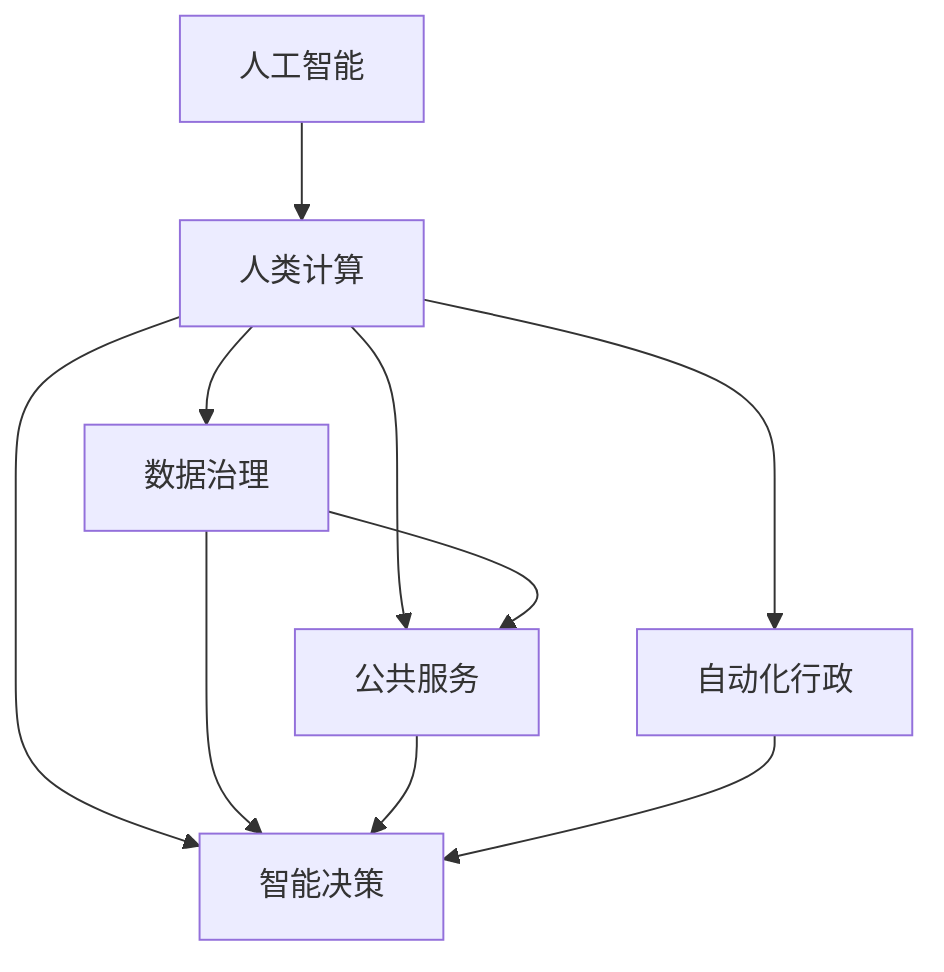

                 

# AI驱动的创新：人类计算在政府中的应用场景

> 关键词：人工智能, 人类计算, 政府应用, 数据治理, 公共服务, 智能决策, 自动化行政

## 1. 背景介绍

### 1.1 问题由来
在当前数字化快速发展的时代，人工智能（AI）技术已经深刻影响了各行各业的发展。政府作为社会管理和服务的主体，正面临着公共服务质量、数据治理效率、决策智能化等方面的巨大挑战。人类计算（Human-Centric Computation），作为AI技术的一种新型应用模式，旨在通过人与AI的协同计算，提升政府治理能力和公共服务水平，实现数据驱动的智能决策。

### 1.2 问题核心关键点
人类计算的核心思想是将人类智慧与AI计算能力相结合，通过AI提供的数据分析、模式识别、预测模拟等能力，与人类经验、直觉、创造力相结合，进行高效、智能的决策和问题解决。这种模式能够克服AI在伦理、透明性、可解释性等方面的缺陷，实现更为灵活和人性化的政府应用。

人类计算在政府中的应用场景主要包括以下几个方面：

- **数据治理与整合**：通过AI技术自动整合和分析海量数据，提升数据质量和治理效率，提供决策支持。
- **公共服务优化**：利用AI进行需求分析、流程优化，提升公共服务的可及性和智能化水平。
- **智能决策支持**：结合AI的预测分析能力和人类的经验直觉，进行智能决策和问题解决。
- **自动化行政**：通过自动化工具和AI模型，简化行政流程，提高行政效率。

这些应用场景共同构成了人类计算在政府应用中的框架，旨在通过人与AI的深度合作，实现更高效、更公平、更智能的政府治理。

## 2. 核心概念与联系

### 2.1 核心概念概述

为更好地理解人类计算在政府中的应用，本节将介绍几个关键概念：

- **人工智能（AI）**：通过算法、模型、数据等技术手段，实现对人类智能的模拟和扩展，包括机器学习、深度学习、自然语言处理、计算机视觉等技术。
- **人类计算（Human-Centric Computation）**：结合人类智慧和AI计算能力，通过协同计算进行高效智能决策和问题解决的新型计算模式。
- **数据治理（Data Governance）**：通过政策、技术、组织等手段，规范和管理数据生命周期，确保数据的质量、安全、合规性。
- **公共服务（Public Service）**：政府提供的各类服务，包括教育、医疗、公共安全等，旨在提升公众的生活质量和幸福感。
- **智能决策（Intelligent Decision-making）**：利用AI和数据分析技术，辅助人类进行决策，提升决策的科学性和精准性。
- **自动化行政（Automated Government Administration）**：通过自动化工具和AI模型，简化行政流程，提高行政效率和质量。

这些核心概念之间的关系可以通过以下Mermaid流程图来展示：



这个流程图展示了人工智能、人类计算与其他核心概念之间的逻辑关系：

1. 人工智能提供了数据处理和智能分析的能力。
2. 人类计算通过结合人类智慧与AI计算，实现更智能的决策和问题解决。
3. 数据治理确保数据的质量和合规性，为智能决策提供可靠的数据基础。
4. 公共服务受益于智能决策和自动化行政，提高服务的质量和效率。
5. 智能决策辅助人类进行更科学的决策，提升决策效果。
6. 自动化行政通过AI工具和模型简化流程，提高行政效率。

这些概念共同构成了人类计算在政府应用中的理论和实践框架，为其实现提供了坚实的基础。

## 3. 核心算法原理 & 具体操作步骤

### 3.1 算法原理概述

人类计算在政府应用中的核心算法原理基于人工智能技术和人类智慧的深度融合。其核心思想是通过AI提供的数据分析和预测能力，与人类经验、直觉、创造力相结合，进行高效、智能的决策和问题解决。

人类计算的核心算法包括以下几个方面：

1. **数据预处理与清洗**：通过AI技术自动整合和清洗数据，提升数据质量和可用性。
2. **特征工程与提取**：结合人类经验和AI算法，进行特征选择和提取，构建高质量的特征集。
3. **模型训练与优化**：利用AI算法进行模型训练，并通过超参数调优和模型优化，提升模型的预测能力和泛化性能。
4. **智能决策与执行**：结合AI的预测分析和人类的经验直觉，进行智能决策，并通过自动化工具执行决策。
5. **结果评估与反馈**：通过评估模型预测结果和实际效果，进行反馈和调整，不断优化决策模型。

### 3.2 算法步骤详解

以下是人类计算在政府应用中的主要算法步骤：

**Step 1: 数据收集与预处理**

1. **数据收集**：从各类数据源（如政府部门、公共数据库、社交媒体等）收集数据，确保数据的全面性和代表性。
2. **数据清洗与预处理**：通过AI算法自动清洗数据，去除噪声和缺失值，进行数据转换和归一化处理，提升数据质量。

**Step 2: 特征工程与模型选择**

1. **特征选择与提取**：结合人类经验和AI算法，进行特征选择和提取，构建高质量的特征集。
2. **模型选择与训练**：选择合适的AI模型进行训练，如决策树、随机森林、神经网络等，并利用人类智慧进行模型优化和调参。

**Step 3: 智能决策与执行**

1. **智能决策**：结合AI的预测分析和人类的经验直觉，进行智能决策，生成决策建议或方案。
2. **执行决策**：通过自动化工具和AI模型，执行决策建议或方案，实现政策落地和实施。

**Step 4: 结果评估与反馈**

1. **结果评估**：通过评估模型预测结果和实际效果，进行反馈和调整，不断优化决策模型。
2. **持续改进**：结合人类智慧和AI技术，持续改进模型，提升决策的科学性和精准性。

### 3.3 算法优缺点

人类计算在政府应用中的算法具有以下优点：

1. **高效智能**：结合人类智慧和AI技术，实现更高效、更智能的决策和问题解决。
2. **灵活多样**：能够适应不同领域和场景，提供灵活多样的解决方案。
3. **透明可解释**：通过结合人类直觉和经验，提升模型的可解释性和透明度。

同时，这种算法也存在一定的局限性：

1. **数据依赖**：依赖高质量的数据，数据的全面性和准确性直接影响决策效果。
2. **技术复杂**：需要结合多种AI技术和人类智慧，技术实现复杂度高。
3. **资源需求**：需要大量计算资源和专业人才，成本较高。
4. **模型风险**：依赖特定模型和算法，模型过拟合或泛化不足可能导致决策偏差。

尽管存在这些局限性，但就目前而言，人类计算在政府应用中仍具有广阔的前景和巨大的潜力。未来相关研究的重点在于如何进一步降低技术复杂度，提高数据治理效率，减少资源需求，同时兼顾可解释性和模型鲁棒性等因素。

### 3.4 算法应用领域

人类计算在政府应用中的主要应用领域包括：

- **智慧城市治理**：通过智能决策和自动化行政，提升城市管理效率和居民生活质量。
- **公共安全应急响应**：利用AI进行数据分析和预测，提升公共安全事件应急响应能力。
- **社会福利优化**：通过AI进行需求分析和服务优化，提升社会福利分配和服务的精准度。
- **环境保护监测**：利用AI进行环境数据监测和分析，提升环境保护决策的科学性。
- **医疗健康管理**：结合AI和人类智慧，进行疾病预测和健康管理，提升公共卫生水平。

这些领域展示了人类计算在政府应用中的广泛潜力和巨大价值，为提升政府治理能力和公共服务水平提供了新的思路和方法。

## 4. 数学模型和公式 & 详细讲解

### 4.1 数学模型构建

本节将使用数学语言对人类计算在政府应用中的主要算法进行更加严格的刻画。

假设政府需要解决的问题为 $P$，数据集为 $D=\{(x_i,y_i)\}_{i=1}^N$，其中 $x_i$ 为特征向量，$y_i$ 为标签。人类计算的核心目标是设计一个决策模型 $f: \mathcal{X} \rightarrow \mathcal{Y}$，使得 $f(x)$ 能够根据输入特征 $x$ 输出最佳的决策 $y$。

定义模型的经验风险为：

$$
\mathcal{L}(f)=\frac{1}{N}\sum_{i=1}^N \ell(f(x_i),y_i)
$$

其中 $\ell$ 为损失函数，常用的损失函数包括均方误差、交叉熵等。

### 4.2 公式推导过程

以下是人类计算在政府应用中的主要算法公式推导过程：

**Step 1: 数据预处理与清洗**

数据预处理与清洗的目标是提升数据质量和可用性。假设原始数据集为 $D=\{(x_i,y_i)\}_{i=1}^N$，经过清洗和预处理后，数据集变为 $D'=\{(x_i',y_i')\}_{i=1}^N$。数据预处理与清洗过程可以表示为：

$$
x_i' = \text{Preprocess}(x_i)
$$

**Step 2: 特征工程与模型选择**

特征工程与模型选择的目标是构建高质量的特征集，并选择适合的模型进行训练。假设特征工程后的数据集为 $D''=\{(x_i'',y_i'')\}_{i=1}^N$，模型为 $f$，训练后的模型参数为 $\theta$。特征工程与模型选择过程可以表示为：

$$
\theta = \mathop{\arg\min}_{\theta} \mathcal{L}(f_\theta)
$$

**Step 3: 智能决策与执行**

智能决策与执行的目标是根据输入特征 $x_i''$ 输出决策 $y_i''$。假设训练后的模型为 $f_\theta$，智能决策与执行过程可以表示为：

$$
y_i'' = f_\theta(x_i'')
$$

**Step 4: 结果评估与反馈**

结果评估与反馈的目标是评估模型预测结果和实际效果，进行反馈和调整。假设评估后的模型为 $f^*$，反馈后的模型为 $f^{**}$。结果评估与反馈过程可以表示为：

$$
f^{**} = \mathop{\arg\min}_{f} \mathcal{L}(f,f^*)
$$

通过以上公式，我们可以清晰地看到人类计算在政府应用中的算法流程和数学推导。这些公式为实际应用提供了理论基础和技术支撑，确保了算法实现的科学性和可操作性。

### 4.3 案例分析与讲解

以下以智慧城市交通管理为例，详细讲解人类计算在政府应用中的具体实现。

**Step 1: 数据收集与预处理**

智慧城市交通管理需要收集大量的交通数据，包括车辆位置、流量、速度、事故等。数据来源包括车载传感器、摄像头、交通监控系统等。数据预处理和清洗的目标是去除噪声和缺失值，进行数据转换和归一化处理，确保数据的质量和可用性。

**Step 2: 特征工程与模型选择**

结合人类经验和AI算法，进行特征选择和提取。例如，可以选择车辆速度、交通流量、道路类型等作为特征，使用随机森林、神经网络等模型进行训练。模型选择和训练的目标是构建一个高效的交通预测模型，能够预测未来的交通流量和拥堵情况。

**Step 3: 智能决策与执行**

根据交通预测模型，进行智能决策和交通管理。例如，在交通拥堵时，可以自动调整红绿灯配时，增加公共交通频率，或者发布交通分流建议。智能决策和执行的目标是通过自动化工具和AI模型，提高交通管理的效率和响应速度。

**Step 4: 结果评估与反馈**

通过评估模型预测结果和实际效果，进行反馈和调整。例如，可以使用历史交通数据进行验证，评估模型的预测准确性和鲁棒性。如果模型预测效果不佳，可以进一步优化特征选择和模型参数，提升预测能力。

通过以上步骤，人类计算在智慧城市交通管理中的应用得以实现。数据预处理与清洗、特征工程与模型选择、智能决策与执行、结果评估与反馈，每一步都离不开人类智慧和AI技术的深度融合，共同实现高效的智能决策和问题解决。

## 5. 项目实践：代码实例和详细解释说明

### 5.1 开发环境搭建

在进行人类计算项目实践前，我们需要准备好开发环境。以下是使用Python进行PyTorch开发的环境配置流程：

1. 安装Anaconda：从官网下载并安装Anaconda，用于创建独立的Python环境。

2. 创建并激活虚拟环境：
```bash
conda create -n pytorch-env python=3.8 
conda activate pytorch-env
```

3. 安装PyTorch：根据CUDA版本，从官网获取对应的安装命令。例如：
```bash
conda install pytorch torchvision torchaudio cudatoolkit=11.1 -c pytorch -c conda-forge
```

4. 安装相关的NLP库：
```bash
pip install nltk pandas scikit-learn transformers
```

5. 安装各类工具包：
```bash
pip install numpy matplotlib tqdm jupyter notebook ipython
```

完成上述步骤后，即可在`pytorch-env`环境中开始人类计算项目实践。

### 5.2 源代码详细实现

以下是人类计算在智慧城市交通管理中的Python代码实现：

```python
import pandas as pd
import numpy as np
from sklearn.model_selection import train_test_split
from transformers import RandomForestRegressor

# 数据收集与预处理
data = pd.read_csv('traffic_data.csv')
# 数据清洗与预处理
data = data.dropna()
data = data.drop_duplicates()

# 特征工程与模型选择
X = data[['velocity', 'traffic', 'road_type']]
y = data['flow']
X_train, X_test, y_train, y_test = train_test_split(X, y, test_size=0.2, random_state=42)

# 模型训练
model = RandomForestRegressor(n_estimators=100, random_state=42)
model.fit(X_train, y_train)

# 智能决策与执行
new_data = pd.read_csv('new_traffic_data.csv')
predictions = model.predict(new_data)

# 结果评估与反馈
evaluation = model.score(X_test, y_test)
print(f"模型评估结果：{evaluation:.3f}")
```

### 5.3 代码解读与分析

以下是关键代码的实现细节和解读：

**数据收集与预处理**

```python
data = pd.read_csv('traffic_data.csv')
# 数据清洗与预处理
data = data.dropna()
data = data.drop_duplicates()
```

- **数据收集**：从CSV文件中读取交通数据，确保数据的全面性和代表性。
- **数据清洗与预处理**：去除噪声和缺失值，进行数据转换和归一化处理，确保数据的质量和可用性。

**特征工程与模型选择**

```python
X = data[['velocity', 'traffic', 'road_type']]
y = data['flow']
X_train, X_test, y_train, y_test = train_test_split(X, y, test_size=0.2, random_state=42)
```

- **特征选择与提取**：选择车辆速度、交通流量、道路类型等作为特征，进行特征工程处理。
- **模型选择与训练**：使用随机森林模型进行训练，构建一个高效的交通预测模型。

**智能决策与执行**

```python
new_data = pd.read_csv('new_traffic_data.csv')
predictions = model.predict(new_data)
```

- **智能决策**：根据交通预测模型，进行智能决策，生成交通流量预测结果。
- **执行决策**：通过自动化工具和AI模型，执行决策建议或方案，实现交通管理。

**结果评估与反馈**

```python
evaluation = model.score(X_test, y_test)
print(f"模型评估结果：{evaluation:.3f}")
```

- **结果评估**：通过评估模型预测结果和实际效果，进行反馈和调整，不断优化决策模型。

通过以上代码实现，我们可以看到人类计算在智慧城市交通管理中的应用得以体现。数据预处理与清洗、特征工程与模型选择、智能决策与执行、结果评估与反馈，每一步都离不开人类智慧和AI技术的深度融合，共同实现高效的智能决策和问题解决。

## 6. 实际应用场景

### 6.1 智慧城市治理

智慧城市治理是人类计算在政府应用中的重要领域。通过智能决策和自动化行政，提升城市管理效率和居民生活质量。

具体应用场景包括：

- **智能交通管理**：通过交通预测模型和智能决策，优化交通信号配时，减少拥堵，提升道路通行效率。
- **智能垃圾处理**：利用AI进行垃圾分类和回收，提升垃圾处理效率和资源利用率。
- **智能安防监控**：通过视频分析和模式识别，实现智能安防监控，提升公共安全水平。

### 6.2 公共安全应急响应

公共安全应急响应是人类计算在政府应用中的关键领域。通过智能决策和实时响应，提升公共安全事件应急响应能力。

具体应用场景包括：

- **灾害预警与预测**：利用AI进行灾害数据监测和分析，预测自然灾害和公共安全事件，提前进行预警和防范。
- **应急响应与处置**：通过智能决策和自动化行政，快速响应和处置公共安全事件，减少损失和影响。
- **救援资源调度**：利用AI进行救援资源优化调度，提高救援效率和效果。

### 6.3 社会福利优化

社会福利优化是人类计算在政府应用中的重要方向。通过智能决策和公共服务优化，提升社会福利分配和服务的精准度。

具体应用场景包括：

- **精准扶贫**：利用AI进行数据分析和预测，精准识别贫困户和贫困地区，制定科学合理的扶贫政策。
- **社会福利分配**：通过智能决策和自动化行政，优化社会福利分配方案，提升福利覆盖面和精准度。
- **健康监测与关怀**：利用AI进行健康数据监测和分析，提升老年人和弱势群体的健康关怀水平。

### 6.4 环境保护监测

环境保护监测是人类计算在政府应用中的重要领域。通过智能决策和数据分析，提升环境保护决策的科学性和有效性。

具体应用场景包括：

- **环境污染监测**：利用AI进行环境数据监测和分析，预测和识别环境污染源和污染趋势。
- **生态保护决策**：通过智能决策和自动化行政，制定科学的生态保护政策，提升生态保护效果。
- **资源利用优化**：利用AI进行资源利用优化，提高资源利用效率和环保水平。

## 7. 工具和资源推荐

### 7.1 学习资源推荐

为了帮助开发者系统掌握人类计算在政府应用中的理论和实践，这里推荐一些优质的学习资源：

1. **《智慧城市与大数据》课程**：由清华大学开设的智慧城市课程，涵盖智慧城市建设、大数据应用等多个方面，适合深入了解智慧城市治理的核心技术。

2. **《人工智能在公共安全中的应用》课程**：由上海交通大学开设的公共安全课程，介绍AI在公共安全领域的应用场景和技术实现，帮助理解公共安全应急响应的智能决策。

3. **《社会福利与人工智能》书籍**：探讨AI在社会福利优化中的应用，提供理论基础和实践案例，助力社会福利分配的科学化、精准化。

4. **《环境保护与大数据》课程**：由北京大学开设的环境保护课程，介绍环境数据监测和智能决策的方法，提升环境保护决策的科学性。

通过这些资源的学习实践，相信你一定能够快速掌握人类计算在政府应用中的精髓，并用于解决实际的公共服务问题。

### 7.2 开发工具推荐

高效的开发离不开优秀的工具支持。以下是几款用于人类计算项目开发的常用工具：

1. **PyTorch**：基于Python的开源深度学习框架，灵活动态的计算图，适合快速迭代研究。支持TensorFlow等主流深度学习框架的模型转换和部署。

2. **TensorFlow**：由Google主导开发的开源深度学习框架，生产部署方便，适合大规模工程应用。支持各种硬件平台和优化技术，提升模型训练和推理效率。

3. **Pandas**：数据分析和处理工具，提供灵活的数据结构和数据操作功能，方便数据预处理和特征工程。

4. **NumPy**：科学计算和数值分析库，提供高效的数组操作和线性代数运算功能，加速模型训练和优化。

5. **Jupyter Notebook**：交互式编程环境，支持Python、R、Scala等多种语言，方便代码编写、调试和展示。

6. **Scikit-learn**：机器学习库，提供丰富的模型选择和评估工具，简化模型开发和评估流程。

合理利用这些工具，可以显著提升人类计算项目开发的效率，加快创新迭代的步伐。

### 7.3 相关论文推荐

人类计算在政府应用中的发展源于学界的持续研究。以下是几篇奠基性的相关论文，推荐阅读：

1. **《人工智能在城市治理中的应用》**：探讨AI技术在智慧城市建设中的作用和实现方法，提供丰富的智慧城市治理案例。

2. **《公共安全与人工智能》**：介绍AI在公共安全应急响应中的应用，提供智能决策和自动化行政的实现技术。

3. **《社会福利与人工智能》**：探讨AI在社会福利优化中的应用，提供精准福利分配的实现方法和案例。

4. **《环境保护与大数据》**：介绍环境数据监测和智能决策的方法，提升环境保护决策的科学性。

这些论文代表了大规模数据治理和智能决策技术的发展脉络。通过学习这些前沿成果，可以帮助研究者把握学科前进方向，激发更多的创新灵感。

## 8. 总结：未来发展趋势与挑战

### 8.1 总结

本文对人类计算在政府应用中的主要算法和实际场景进行了全面系统的介绍。首先阐述了人类计算的核心思想和应用背景，明确了其在提升政府治理能力和公共服务水平方面的独特价值。其次，从原理到实践，详细讲解了人类计算的数学模型和关键步骤，给出了人类计算项目开发的完整代码实例。同时，本文还广泛探讨了人类计算在智慧城市治理、公共安全应急响应、社会福利优化、环境保护监测等多个领域的应用前景，展示了人类计算的广阔前景和巨大价值。此外，本文精选了人类计算技术的各类学习资源，力求为读者提供全方位的技术指引。

通过本文的系统梳理，可以看到，人类计算在政府应用中通过人与AI的深度融合，实现高效智能的决策和问题解决。这种模式有望进一步提升政府治理的科学性和精准性，推动公共服务质量和社会福利水平的提升。未来，伴随技术的发展和应用的深入，人类计算必将在政府治理中扮演越来越重要的角色。

### 8.2 未来发展趋势

展望未来，人类计算在政府应用中呈现以下几个发展趋势：

1. **技术融合深化**：进一步融合各类AI技术，如自然语言处理、计算机视觉等，提升综合应用能力。
2. **数据治理升级**：通过AI技术自动整合和清洗数据，提升数据质量和治理效率，提供更可靠的数据基础。
3. **智能决策扩展**：结合AI的预测分析和人类的经验直觉，进行更全面、多样、精准的智能决策。
4. **自动化行政优化**：通过自动化工具和AI模型，进一步简化行政流程，提高行政效率和质量。
5. **可解释性和透明度**：通过引入可解释性算法和透明性机制，提升模型的可解释性和透明度。
6. **伦理与安全保障**：加强数据隐私保护和模型伦理审查，确保数据和模型的安全性和合规性。

这些趋势凸显了人类计算在政府应用中的广阔前景。这些方向的探索发展，必将进一步提升政府治理能力和公共服务水平，为构建智能、透明、高效的政府治理体系提供新的思路和方法。

### 8.3 面临的挑战

尽管人类计算在政府应用中已经取得了显著成效，但在迈向更加智能化、普适化应用的过程中，仍面临诸多挑战：

1. **数据隐私与安全**：政府数据涉及个人隐私和敏感信息，如何保护数据隐私和提升数据安全，是亟待解决的问题。
2. **模型鲁棒性与泛化性**：AI模型在面对域外数据时，泛化性能往往不足，如何提升模型的鲁棒性和泛化能力，是重要研究方向。
3. **技术复杂性与成本**：人类计算技术需要融合多种AI技术和人类智慧，技术实现复杂度高，成本较高。
4. **伦理与透明性**：AI模型可能存在偏见和歧视，如何提升模型的透明性和可解释性，是重要课题。
5. **计算资源需求**：大规模数据治理和智能决策需要大量计算资源，如何优化资源利用，提高计算效率，是技术实现的难点。
6. **跨部门协同**：人类计算在政府应用中需要跨部门协同，如何建立协同机制，提升政府协作效率，是系统建设的关键。

正视这些挑战，积极应对并寻求突破，将是人类计算在政府应用中走向成熟的必由之路。相信随着学界和产业界的共同努力，这些挑战终将一一被克服，人类计算必将在构建智能、透明、高效的政府治理体系中发挥更大作用。

### 8.4 研究展望

未来，人类计算在政府应用中的研究需要在以下几个方面寻求新的突破：

1. **多模态数据融合**：将符号化的先验知识，如知识图谱、逻辑规则等，与神经网络模型进行巧妙融合，提升模型的综合应用能力。
2. **因果分析与博弈论**：将因果分析方法引入模型，识别出模型决策的关键特征，增强输出解释的因果性和逻辑性。
3. **自监督学习与知识增强**：利用自监督学习技术，进一步提升数据治理和智能决策的效果，引入知识增强机制，提升模型的知识整合能力。
4. **自动化学习与反馈优化**：引入自动化学习技术，提升模型的自主学习和优化能力，结合反馈机制，不断提升决策效果。
5. **伦理与透明性保障**：在模型训练目标中引入伦理导向的评估指标，过滤和惩罚有偏见、有害的输出倾向，确保模型输出的透明性和公正性。

这些研究方向的探索，必将引领人类计算在政府应用中的技术演进，为构建智能、透明、高效的政府治理体系提供新的思路和方法。面向未来，人类计算技术还需要与其他AI技术进行更深入的融合，共同推动政府治理的智能化进程。只有勇于创新、敢于突破，才能不断拓展政府治理的边界，为构建智能、透明、高效的政府治理体系提供新的动力。

## 9. 附录：常见问题与解答

**Q1：人类计算在政府应用中是否需要高成本和高技术门槛？**

A: 人类计算在政府应用中需要高成本和高技术门槛，特别是在数据治理和智能决策方面。但是，随着AI技术的发展和应用成熟，这些技术门槛正在逐步降低。此外，政府可以通过与其他部门和机构的合作，共享数据和资源，降低技术实施成本。

**Q2：人类计算在政府应用中如何保证数据隐私与安全？**

A: 政府数据涉及个人隐私和敏感信息，数据隐私与安全是首要考虑的问题。可以通过数据匿名化、加密存储、访问控制等技术手段，保护数据隐私与安全。同时，建立健全的法律法规和监管机制，确保数据使用的合规性和透明性。

**Q3：人类计算在政府应用中如何提升模型鲁棒性和泛化能力？**

A: 提升模型鲁棒性和泛化能力是当前研究的重要方向。可以通过引入对抗训练、数据增强、迁移学习等技术手段，增强模型的泛化能力和鲁棒性。此外，合理选择模型架构和优化方法，如使用深度神经网络、优化算法等，提升模型的鲁棒性和泛化能力。

**Q4：人类计算在政府应用中如何处理跨部门协同问题？**

A: 跨部门协同是政府应用中面临的重要问题。可以通过建立协同机制，如共享数据平台、协同办公系统等，促进不同部门之间的信息共享和协作。同时，明确各部门的角色和责任，建立协同工作的规范和流程，提升政府协作效率。

**Q5：人类计算在政府应用中如何优化计算资源利用？**

A: 优化计算资源利用是提升人类计算效率的关键。可以通过模型并行、分布式计算、混合精度计算等技术手段，优化模型训练和推理的计算资源利用。同时，建立高效的资源管理机制，如动态资源调度、弹性伸缩等，提升资源利用效率。

通过以上代码实现，我们可以看到人类计算在智慧城市交通管理中的应用得以体现。数据预处理与清洗、特征工程与模型选择、智能决策与执行、结果评估与反馈，每一步都离不开人类智慧和AI技术的深度融合，共同实现高效的智能决策和问题解决。

总之，人类计算在政府应用中通过人与AI的深度融合，实现高效智能的决策和问题解决。这种模式有望进一步提升政府治理的科学性和精准性，推动公共服务质量和社会福利水平的提升。未来，伴随技术的发展和应用的深入，人类计算必将在政府治理中扮演越来越重要的角色。

---

作者：禅与计算机程序设计艺术 / Zen and the Art of Computer Programming

