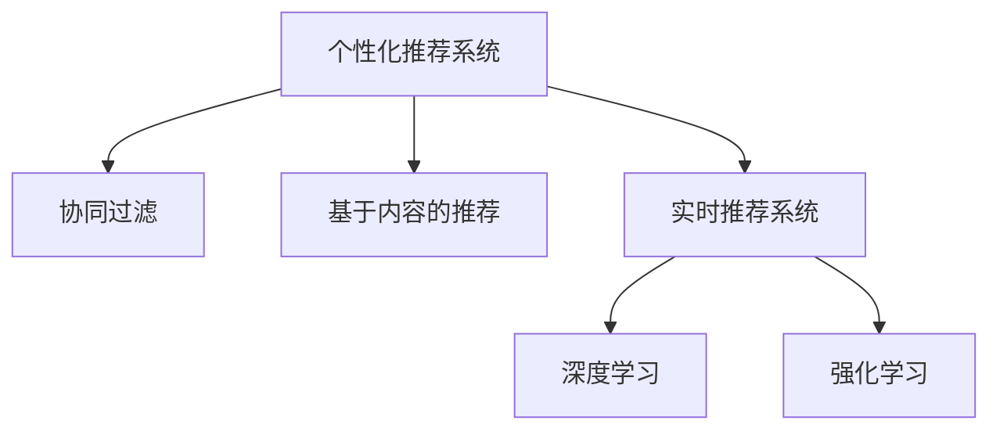

                 

# AI驱动的实时个性化推荐技术

## 1. 背景介绍

### 1.1 问题由来
随着互联网的飞速发展，信息爆炸已经成为普遍现象。面对海量的内容，用户如何高效地找到符合自己兴趣和需求的信息，成为了一个迫切需要解决的问题。个性化推荐系统（Personalized Recommendation System）应运而生，通过用户历史行为数据和实时动态数据，为用户推荐最相关、最感兴趣的内容，从而提升用户体验和满意度。

在移动互联网和智能终端的普及下，实时性要求日益提高。传统的离线推荐系统已难以满足用户对即时反馈的需求。实时个性化推荐技术应运而生，利用在线算法和实时数据处理能力，动态地为每个用户提供个性化的内容推荐，从而进一步提升用户体验。

### 1.2 问题核心关键点
实时个性化推荐技术的核心关键点包括：

- 用户行为数据收集与处理：实时收集用户的行为数据（如点击、浏览、购买等），提取有效的特征向量。
- 实时特征计算与更新：基于在线算法，动态计算和更新用户和内容的特征表示。
- 推荐模型与算法：构建高效的推荐模型和算法，实时进行相似度计算和排名排序。
- 实时推荐服务：在实时数据流上，利用计算资源池，动态生成推荐结果，并推送给用户。

这些问题点彼此之间联系紧密，共同构成了实时个性化推荐技术的核心架构和逻辑流程。

## 2. 核心概念与联系

### 2.1 核心概念概述

为更好地理解实时个性化推荐技术，本节将介绍几个密切相关的核心概念：

- 个性化推荐系统（Personalized Recommendation System）：通过学习用户历史行为数据和用户特征，为用户推荐个性化内容的技术。
- 协同过滤（Collaborative Filtering）：基于用户行为数据和用户相似性，推荐相似用户的兴趣内容。
- 基于内容的推荐（Content-Based Recommendation）：根据内容特征与用户兴趣的相似度，推荐相关内容。
- 实时推荐系统（Real-time Recommendation System）：利用实时数据流和计算资源池，动态生成推荐结果，提升用户体验的推荐系统。
- 深度学习（Deep Learning）：使用神经网络模型，从大规模数据中提取高级特征，提升推荐效果。
- 强化学习（Reinforcement Learning）：通过用户反馈，优化推荐策略，提升推荐系统的性能和用户满意度。

这些核心概念之间的逻辑关系可以通过以下Mermaid流程图来展示：



这个流程图展示了个性化推荐系统的核心概念及其之间的关系：

1. 个性化推荐系统通过协同过滤和基于内容的推荐技术，构建用户和内容的表示。
2. 实时推荐系统利用在线算法和计算资源池，实时生成推荐结果。
3. 深度学习通过神经网络模型提取高级特征，提升推荐效果。
4. 强化学习通过用户反馈优化推荐策略，进一步提升系统性能。

这些概念共同构成了实时个性化推荐系统的核心逻辑和实现路径，使得系统能够动态地为用户提供个性化推荐。

## 3. 核心算法原理 & 具体操作步骤
### 3.1 算法原理概述

实时个性化推荐技术主要基于协同过滤和深度学习两大核心算法。

协同过滤算法基于用户历史行为数据和用户相似性，通过计算用户和物品之间的相似度，预测用户对未交互物品的评分，从而推荐用户可能感兴趣的内容。具体而言，协同过滤算法分为基于用户的协同过滤和基于物品的协同过滤两种。

基于用户的协同过滤（User-Based Collaborative Filtering）：通过计算用户之间的相似度，为用户推荐与其相似用户的感兴趣内容。具体实现包括欧几里得距离、余弦相似度等距离度量方法。

基于物品的协同过滤（Item-Based Collaborative Filtering）：通过计算物品之间的相似度，为用户推荐与其过去喜欢物品相似的新物品。具体实现包括矩阵分解、奇异值分解等。

深度学习模型（如神经网络）通过学习用户行为数据和内容特征，动态生成推荐结果。主要利用用户的特征向量、物品的特征向量，以及用户和物品之间的交互信息，通过全连接层、卷积层、循环层等神经网络层，学习用户兴趣和物品相关性。推荐模型的常见结构包括MLP（多层感知机）、CNN（卷积神经网络）、RNN（循环神经网络）等。

### 3.2 算法步骤详解

基于协同过滤的实时个性化推荐算法步骤如下：

1. **数据收集与预处理**：实时收集用户的行为数据（点击、浏览、购买等），进行清洗、去重等预处理。
2. **用户特征计算**：对用户的行为数据进行特征提取，得到用户的行为向量。可以使用TF-IDF、Word2Vec等方法计算用户特征。
3. **相似度计算**：基于用户行为向量，计算用户之间的相似度，推荐与目标用户相似用户的兴趣内容。
4. **物品特征计算**：对物品的特征进行计算，得到物品的特征向量。可以使用一阶项、二阶项、混合项等特征计算方法。
5. **物品相似度计算**：基于物品特征向量，计算物品之间的相似度，推荐与目标物品相似的新物品。
6. **推荐结果生成**：根据相似度计算结果，生成推荐列表，并按评分高低排序。

基于深度学习的实时个性化推荐算法步骤如下：

1. **数据收集与预处理**：实时收集用户的行为数据和物品特征数据，进行清洗、去重等预处理。
2. **用户特征嵌入**：使用神经网络模型，将用户的行为数据映射为特征向量，得到用户嵌入表示。
3. **物品特征嵌入**：使用神经网络模型，将物品的特征数据映射为特征向量，得到物品嵌入表示。
4. **相似度计算**：基于用户嵌入表示和物品嵌入表示，计算用户与物品之间的相似度。
5. **推荐结果生成**：根据相似度计算结果，生成推荐列表，并按评分高低排序。

### 3.3 算法优缺点

基于协同过滤的实时个性化推荐算法具有以下优点：

1. 算法简单高效。协同过滤算法不需要大量的数据，可以实时生成推荐结果。
2. 效果显著。在少样本情况下，协同过滤算法能够通过计算用户和物品之间的相似度，推荐用户可能感兴趣的内容。
3. 可解释性强。协同过滤算法的计算过程透明直观，易于理解和调试。

基于协同过滤的实时个性化推荐算法也存在一些缺点：

1. 对数据冷启动问题敏感。新用户或新物品的相似度计算结果可能不准确，影响推荐效果。
2. 无法处理大规模数据。当数据量过大时，相似度计算过程耗时较长，无法实时处理。
3. 忽略用户和物品的多样性。协同过滤算法仅基于相似度计算，无法考虑用户和物品的多样性特征。

基于深度学习的实时个性化推荐算法具有以下优点：

1. 自动提取特征。深度学习模型能够自动提取高维特征，无需手工设计特征工程。
2. 适应性广泛。深度学习模型能够处理大规模数据，适应各种数据类型和数据规模。
3. 推荐效果优异。深度学习模型能够捕捉用户行为和内容特征之间的复杂关系，推荐效果显著。

基于深度学习的实时个性化推荐算法也存在一些缺点：

1. 计算资源消耗大。深度学习模型参数多，计算量大，实时推理需要高性能计算资源。
2. 难以解释。深度学习模型的决策过程复杂，难以解释其推荐逻辑。
3. 模型过拟合风险高。深度学习模型容易过拟合，需要大量的训练数据和严格的模型调参。

### 3.4 算法应用领域

基于协同过滤的实时个性化推荐算法在以下领域有广泛应用：

1. 电商推荐：基于用户行为数据和用户相似性，为用户推荐商品。
2. 社交网络：基于用户行为数据和用户相似性，为用户推荐好友、文章、视频等。
3. 新闻推荐：基于用户行为数据和用户相似性，为用户推荐新闻文章。
4. 视频推荐：基于用户行为数据和用户相似性，为用户推荐视频内容。

基于深度学习的实时个性化推荐算法在以下领域有广泛应用：

1. 电商推荐：基于用户行为数据和内容特征，为用户推荐商品。
2. 音乐推荐：基于用户行为数据和音乐特征，为用户推荐音乐。
3. 电影推荐：基于用户行为数据和电影特征，为用户推荐电影。
4. 医疗推荐：基于用户行为数据和医疗特征，为用户推荐治疗方案。

## 4. 数学模型和公式 & 详细讲解 & 举例说明（备注：数学公式请使用latex格式，latex嵌入文中独立段落使用 $$，段落内使用 $)
### 4.1 数学模型构建

基于协同过滤的实时个性化推荐模型主要分为用户模型和物品模型两个部分。

用户模型 $U$ 的表示如下：

$$
U = \sum_{i=1}^n U_i \times X_i
$$

其中，$U$ 为用户特征向量，$U_i$ 为第 $i$ 个用户的特征权重，$X_i$ 为用户行为数据矩阵。

物品模型 $I$ 的表示如下：

$$
I = \sum_{j=1}^m I_j \times Y_j
$$

其中，$I$ 为物品特征向量，$I_j$ 为第 $j$ 个物品的特征权重，$Y_j$ 为物品特征数据矩阵。

用户和物品之间的相似度计算如下：

$$
S = U \times V \times X \times W
$$

其中，$S$ 为相似度矩阵，$V$ 为用户与物品相似度的权重矩阵，$X$ 为用户行为数据矩阵，$W$ 为用户行为数据权重矩阵。

### 4.2 公式推导过程

以下是基于协同过滤的实时个性化推荐模型中相似度计算的公式推导：

设用户 $u$ 对物品 $i$ 的评分 $\hat{y}_{ui} = \sum_{j=1}^m \theta_{ujij} X_{ui} Y_{ujj}$，其中 $\theta_{ujij}$ 为神经网络中用户与物品的相似度权重。

根据协同过滤算法，对于用户 $u$ 未交互过的物品 $i$，可以计算其评分如下：

$$
y_{ui} = \sum_{k=1}^n \theta_{kij} \hat{y}_{kij}
$$

其中，$y_{kij}$ 为用户 $k$ 对物品 $i$ 的实际评分。

根据上述公式，可以得到基于协同过滤的实时个性化推荐模型的推荐结果：

$$
R_{ui} = \frac{\sum_{k=1}^n \theta_{kij} \hat{y}_{kij}}{\sum_{k=1}^n \theta_{kij} X_{ki}}
$$

其中，$R_{ui}$ 为用户 $u$ 对物品 $i$ 的推荐评分。

### 4.3 案例分析与讲解

以电商推荐系统为例，对基于协同过滤的实时个性化推荐模型进行分析。

电商推荐系统通过用户行为数据（如浏览、点击、购买等）和用户相似性，为用户推荐商品。首先，对用户行为数据进行特征提取，得到用户行为向量 $X_u$。然后，对物品特征数据进行特征提取，得到物品特征向量 $Y_i$。接着，通过计算用户与物品的相似度 $S_{ui}$，得到用户对物品的评分预测 $\hat{y}_{ui}$。最后，根据评分预测结果，生成推荐列表，并按评分高低排序。

以基于深度学习的实时个性化推荐模型为例，对深度学习模型进行分析。

基于深度学习的实时个性化推荐模型使用神经网络模型，通过学习用户行为数据和内容特征，动态生成推荐结果。首先，对用户行为数据进行特征提取，得到用户嵌入表示 $U_u$。然后，对物品特征数据进行特征提取，得到物品嵌入表示 $I_i$。接着，通过计算用户与物品的相似度 $S_{ui}$，得到用户对物品的评分预测 $\hat{y}_{ui}$。最后，根据评分预测结果，生成推荐列表，并按评分高低排序。

## 5. 项目实践：代码实例和详细解释说明
### 5.1 开发环境搭建

在进行实时个性化推荐项目开发前，需要准备好开发环境。以下是使用Python进行TensorFlow开发的环境配置流程：

1. 安装Anaconda：从官网下载并安装Anaconda，用于创建独立的Python环境。

2. 创建并激活虚拟环境：
```bash
conda create -n tf-env python=3.8 
conda activate tf-env
```

3. 安装TensorFlow：根据CUDA版本，从官网获取对应的安装命令。例如：
```bash
pip install tensorflow
```

4. 安装PyTorch：用于实现深度学习模型的编程语言。
```bash
pip install torch
```

5. 安装各类工具包：
```bash
pip install numpy pandas scikit-learn matplotlib tqdm jupyter notebook ipython
```

完成上述步骤后，即可在`tf-env`环境中开始实时个性化推荐项目的开发。

### 5.2 源代码详细实现

下面我们以电商推荐系统为例，给出使用TensorFlow和Keras进行实时个性化推荐系统的PyTorch代码实现。

首先，定义电商推荐系统的数据处理函数：

```python
import numpy as np
import pandas as pd
from sklearn.model_selection import train_test_split

def load_data():
    # 加载电商推荐系统的数据集
    df = pd.read_csv('ecommerce_data.csv')
    # 特征工程，提取用户行为数据和物品特征数据
    X = df[['item_id', 'user_id', 'category', 'price']]
    y = df['item_id']
    # 数据标准化
    X = (X - X.mean()) / X.std()
    # 划分训练集和测试集
    X_train, X_test, y_train, y_test = train_test_split(X, y, test_size=0.2, random_state=42)
    # 返回数据集
    return X_train, X_test, y_train, y_test
```

然后，定义深度学习模型的神经网络层：

```python
from tensorflow.keras.models import Sequential
from tensorflow.keras.layers import Dense, Dropout

def build_model(input_shape):
    model = Sequential()
    model.add(Dense(64, activation='relu', input_shape=input_shape))
    model.add(Dropout(0.5))
    model.add(Dense(64, activation='relu'))
    model.add(Dropout(0.5))
    model.add(Dense(1, activation='sigmoid'))
    return model
```

接着，定义模型的损失函数和优化器：

```python
from tensorflow.keras.optimizers import Adam

def compile_model(model, loss, optimizer):
    model.compile(loss=loss, optimizer=optimizer)
```

最后，训练模型并在测试集上评估：

```python
def train_and_evaluate(model, X_train, y_train, X_test, y_test, epochs):
    # 训练模型
    model.fit(X_train, y_train, epochs=epochs, batch_size=32, validation_data=(X_test, y_test))
    # 评估模型
    test_loss, test_accuracy = model.evaluate(X_test, y_test)
    return test_loss, test_accuracy
```

完成上述步骤后，即可在`tf-env`环境中进行电商推荐系统的训练和评估。

### 5.3 代码解读与分析

让我们再详细解读一下关键代码的实现细节：

**load_data函数**：
- 加载电商推荐系统的数据集
- 进行特征工程，提取用户行为数据和物品特征数据
- 对数据进行标准化处理
- 划分训练集和测试集

**build_model函数**：
- 定义深度学习模型的神经网络层
- 使用Dense层和Dropout层进行特征提取
- 添加输出层，使用sigmoid激活函数，生成推荐评分

**compile_model函数**：
- 定义损失函数和优化器
- 编译模型，设置损失函数和优化器

**train_and_evaluate函数**：
- 使用训练集训练模型
- 使用测试集评估模型
- 返回测试损失和准确率

## 6. 实际应用场景

### 6.1 电商推荐

电商推荐系统是实时个性化推荐技术的经典应用场景。在电商平台上，用户通过浏览、点击、购买等行为，形成了大量的数据。电商平台可以通过实时个性化推荐系统，根据用户历史行为数据和实时行为数据，为用户推荐最适合的商品，提升用户体验和购买转化率。

在电商推荐系统中，用户行为数据包括浏览记录、点击记录、购买记录等。这些数据可以通过实时收集和存储，用于实时个性化推荐模型的训练和推理。电商平台还可以根据用户的行为数据，动态调整推荐策略，从而提升推荐效果。

### 6.2 社交网络

社交网络平台是实时个性化推荐技术的另一重要应用场景。社交网络平台通过用户的行为数据和社交关系，为用户推荐好友、文章、视频等内容。实时个性化推荐技术可以在用户浏览、点赞、评论等实时行为上，动态生成个性化推荐结果，提升用户的社交体验。

在社交网络推荐系统中，用户行为数据包括浏览记录、点赞记录、评论记录等。这些数据可以通过实时收集和存储，用于实时个性化推荐模型的训练和推理。社交网络平台还可以根据用户的社交关系，动态调整推荐策略，从而提升推荐效果。

### 6.3 新闻推荐

新闻推荐系统是实时个性化推荐技术的典型应用场景。新闻平台通过用户的行为数据和内容特征，为用户推荐新闻文章。实时个性化推荐技术可以在用户阅读、点赞、评论等实时行为上，动态生成个性化推荐结果，提升用户的阅读体验。

在新闻推荐系统中，用户行为数据包括阅读记录、点赞记录、评论记录等。这些数据可以通过实时收集和存储，用于实时个性化推荐模型的训练和推理。新闻平台还可以根据用户的行为数据，动态调整推荐策略，从而提升推荐效果。

### 6.4 未来应用展望

随着实时个性化推荐技术的发展，未来将在更多领域得到应用，为各行各业带来新的变革和机遇。

在智慧医疗领域，实时个性化推荐技术可以为患者推荐最合适的治疗方案，提升诊疗效率和效果。在智慧教育领域，实时个性化推荐技术可以为学生推荐最合适的学习资源，提升学习效果和体验。在智慧城市治理中，实时个性化推荐技术可以为市民推荐最合适的公共服务，提升城市治理水平。

此外，在智能交通、智能制造、智能农业等领域，实时个性化推荐技术也将发挥重要作用，推动智能技术的普及和应用。

## 7. 工具和资源推荐
### 7.1 学习资源推荐

为了帮助开发者系统掌握实时个性化推荐技术，这里推荐一些优质的学习资源：

1. 《深度学习基础》课程：由Coursera开设的深度学习入门课程，涵盖深度学习的基本概念和实现方法，适合初学者入门。
2. 《TensorFlow实战》书籍：TensorFlow官方出版的实战书籍，详细介绍了TensorFlow的使用方法和应用场景，适合深入学习。
3. 《深度学习理论与实践》书籍：全面介绍深度学习理论和实践的书籍，适合进阶学习。
4. 《推荐系统实战》书籍：介绍推荐系统设计、开发和部署的书籍，适合实战应用。
5. Kaggle竞赛平台：数据科学竞赛平台，提供大量的推荐系统竞赛和数据集，适合学习和实践。

通过对这些资源的学习实践，相信你一定能够快速掌握实时个性化推荐技术的精髓，并用于解决实际的推荐问题。

### 7.2 开发工具推荐

高效的开发离不开优秀的工具支持。以下是几款用于实时个性化推荐开发的常用工具：

1. TensorFlow：由Google主导开发的深度学习框架，具有灵活的计算图和自动微分功能，适合深度学习模型的开发和训练。
2. PyTorch：由Facebook开发的深度学习框架，具有动态计算图和高效的GPU加速，适合深度学习模型的开发和训练。
3. Spark MLlib：Apache Spark的机器学习库，提供大规模数据处理和机器学习算法，适合实时推荐系统的开发。
4. Kafka：Apache Kafka是实时数据流处理框架，支持大规模数据流的分布式处理和实时推送，适合实时推荐系统的构建。
5. NGINX：高性能的Web服务器，支持高效的反向代理和负载均衡，适合实时推荐系统的部署。

合理利用这些工具，可以显著提升实时个性化推荐任务的开发效率，加快创新迭代的步伐。

### 7.3 相关论文推荐

实时个性化推荐技术的研究源于学界的持续研究。以下是几篇奠基性的相关论文，推荐阅读：

1. 《Projecting Similarities: A Nonparametric Method for User and Item Collaborative Filtering》：提出协同过滤的相似度计算方法，奠定了协同过滤算法的基础。
2. 《Neural Collaborative Filtering》：提出深度学习模型在推荐系统中的应用，展示了神经网络的优越性。
3. 《Cascading Contextual Bandits for Dynamic Treatment Recommendations》：提出强化学习在推荐系统中的应用，展示了强化学习的潜力。
4. 《A recommender system framework based on deep learning and user behavior data》：提出基于深度学习的推荐系统框架，展示了深度学习模型在推荐系统中的广泛应用。
5. 《Deep Reinforcement Learning for Personalized Recommendation Systems》：提出深度强化学习在推荐系统中的应用，展示了深度强化学习的优越性。

这些论文代表了他实时个性化推荐技术的发展脉络。通过学习这些前沿成果，可以帮助研究者把握学科前进方向，激发更多的创新灵感。

## 8. 总结：未来发展趋势与挑战

### 8.1 总结

本文对实时个性化推荐技术进行了全面系统的介绍。首先阐述了实时个性化推荐技术的背景和意义，明确了推荐系统在提高用户体验和满意度方面的独特价值。其次，从原理到实践，详细讲解了协同过滤和深度学习两大核心算法，给出了实时个性化推荐系统的完整代码实例。同时，本文还广泛探讨了推荐技术在电商、社交、新闻等多个行业领域的应用前景，展示了推荐范式的广泛应用。此外，本文精选了推荐技术的各类学习资源，力求为读者提供全方位的技术指引。

通过本文的系统梳理，可以看到，实时个性化推荐技术正在成为推荐系统的重要范式，极大地拓展了推荐模型的应用边界，催生了更多的落地场景。得益于大数据、深度学习、在线算法等技术的不断进步，推荐系统能够动态地为用户提供个性化推荐，从而提升用户体验和满意度。未来，伴随推荐算法的持续演进，相信推荐系统将在更多领域得到应用，为各行各业带来新的变革和机遇。

### 8.2 未来发展趋势

展望未来，实时个性化推荐技术将呈现以下几个发展趋势：

1. 推荐算法的多样化。除了传统的协同过滤和深度学习算法外，未来将涌现更多推荐算法，如矩阵分解、图嵌入等，提升推荐效果。
2. 数据驱动的推荐。推荐算法将更加注重用户行为数据和用户特征的动态更新，提升推荐系统的实时性和准确性。
3. 推荐模型的可解释性。推荐算法将更加注重模型的可解释性，提高用户对推荐结果的理解和信任度。
4. 推荐系统的个性化。推荐算法将更加注重用户个性的多样性和复杂性，提升推荐系统的多样性和灵活性。
5. 推荐系统的普适性。推荐算法将更加注重推荐系统的普适性，适应各种数据类型和应用场景。

这些趋势凸显了实时个性化推荐技术的发展潜力，将为推荐系统带来新的应用场景和技术突破。相信随着推荐算法的持续演进，推荐系统将在更多领域得到应用，为各行各业带来新的变革和机遇。

### 8.3 面临的挑战

尽管实时个性化推荐技术已经取得了显著进展，但在迈向更加智能化、普适化应用的过程中，它仍面临着诸多挑战：

1. 推荐算法对数据的依赖。推荐算法的推荐效果很大程度上取决于用户行为数据的质量和数量，获取高质量数据成本较高。如何降低推荐算法对数据标注的依赖，将是一大难题。
2. 推荐算法的实时性。实时推荐系统需要在毫秒级时间内生成推荐结果，对计算资源和算法效率的要求较高。如何提高推荐算法的实时性，优化计算资源分配，将是重要的研究方向。
3. 推荐算法的可解释性。推荐算法的决策过程复杂，难以解释其推荐逻辑。如何赋予推荐算法更强的可解释性，将是亟待攻克的难题。
4. 推荐算法的普适性。推荐算法在不同领域和应用场景中表现不一，如何提高推荐算法的普适性，适应各种数据类型和应用场景，将是重要的研究方向。
5. 推荐算法的多样性。推荐算法需要考虑用户个性的多样性和复杂性，如何提高推荐算法的多样性，提升推荐系统的多样性和灵活性，将是重要的研究方向。

正视推荐算法面临的这些挑战，积极应对并寻求突破，将是推荐系统走向成熟的必由之路。相信随着推荐算法的研究和应用不断深入，这些问题终将一一被克服，实时个性化推荐系统必将在构建智能推荐服务中扮演越来越重要的角色。

### 8.4 研究展望

面对实时个性化推荐系统面临的挑战，未来的研究需要在以下几个方面寻求新的突破：

1. 探索无监督和半监督推荐方法。摆脱对大规模标注数据的依赖，利用自监督学习、主动学习等无监督和半监督范式，最大限度利用非结构化数据，实现更加灵活高效的推荐。
2. 研究计算高效的推荐范式。开发更加高效的推荐算法，在固定大部分预训练参数的同时，只更新极少量的任务相关参数，提高推荐系统的实时性和鲁棒性。
3. 引入更多先验知识。将符号化的先验知识，如知识图谱、逻辑规则等，与神经网络模型进行巧妙融合，引导推荐过程学习更准确、合理的推荐逻辑。
4. 引入因果分析和博弈论工具。将因果分析方法引入推荐算法，识别出推荐决策的关键特征，增强推荐结果的因果性和逻辑性。借助博弈论工具刻画用户与推荐系统之间的互动过程，主动探索并规避推荐系统的脆弱点，提高系统稳定性。
5. 纳入伦理道德约束。在推荐算法的设计目标中引入伦理导向的评估指标，过滤和惩罚有害的推荐结果，确保推荐系统的公平性和公正性。

这些研究方向的探索，必将引领实时个性化推荐技术迈向更高的台阶，为构建安全、可靠、可解释、可控的智能推荐服务铺平道路。面向未来，实时个性化推荐技术还需要与其他人工智能技术进行更深入的融合，如知识表示、因果推理、强化学习等，多路径协同发力，共同推动智能推荐系统的进步。只有勇于创新、敢于突破，才能不断拓展推荐系统的边界，让智能技术更好地造福人类社会。

## 9. 附录：常见问题与解答

**Q1：实时个性化推荐系统如何处理冷启动问题？**

A: 实时个性化推荐系统可以通过以下方法处理冷启动问题：
1. 基于物品的协同过滤：利用物品特征和用户行为数据，为用户推荐与过去喜欢的物品相似的新物品。
2. 基于内容的推荐：利用物品特征和用户行为数据，为用户推荐与过去喜欢的物品相似的新物品。
3. 多模态推荐：利用用户的多模态数据（如文本、图像、语音等），提升推荐效果。

**Q2：实时个性化推荐系统如何提高推荐结果的实时性？**

A: 实时个性化推荐系统可以通过以下方法提高推荐结果的实时性：
1. 使用高性能的计算资源池，确保推荐系统的实时性。
2. 使用轻量级模型，减少推荐系统的前向计算时间。
3. 使用分布式计算框架，提高推荐系统的并发处理能力。
4. 使用缓存技术，减少重复计算和查询时间。

**Q3：实时个性化推荐系统如何处理用户的多样性和复杂性？**

A: 实时个性化推荐系统可以通过以下方法处理用户的多样性和复杂性：
1. 使用多模态数据，提升推荐系统的多样性和灵活性。
2. 使用深度学习模型，学习用户的多样性和复杂性特征。
3. 使用强化学习算法，动态调整推荐策略，提升推荐系统的多样性和灵活性。

**Q4：实时个性化推荐系统如何提升推荐结果的可解释性？**

A: 实时个性化推荐系统可以通过以下方法提升推荐结果的可解释性：
1. 使用可解释性强的推荐算法，如基于规则的推荐算法、基于逻辑的推荐算法等。
2. 使用可解释性的推荐模型，如基于图结构的推荐模型、基于知识图谱的推荐模型等。
3. 使用可解释性的推荐方法，如可解释性的特征选择方法、可解释性的相似度计算方法等。

这些问题的解答，展示了实时个性化推荐系统在实际应用中面临的挑战和解决思路。希望这些解答能为你提供有价值的参考，进一步提升你对实时个性化推荐系统的理解和实践能力。

---

作者：禅与计算机程序设计艺术 / Zen and the Art of Computer Programming

