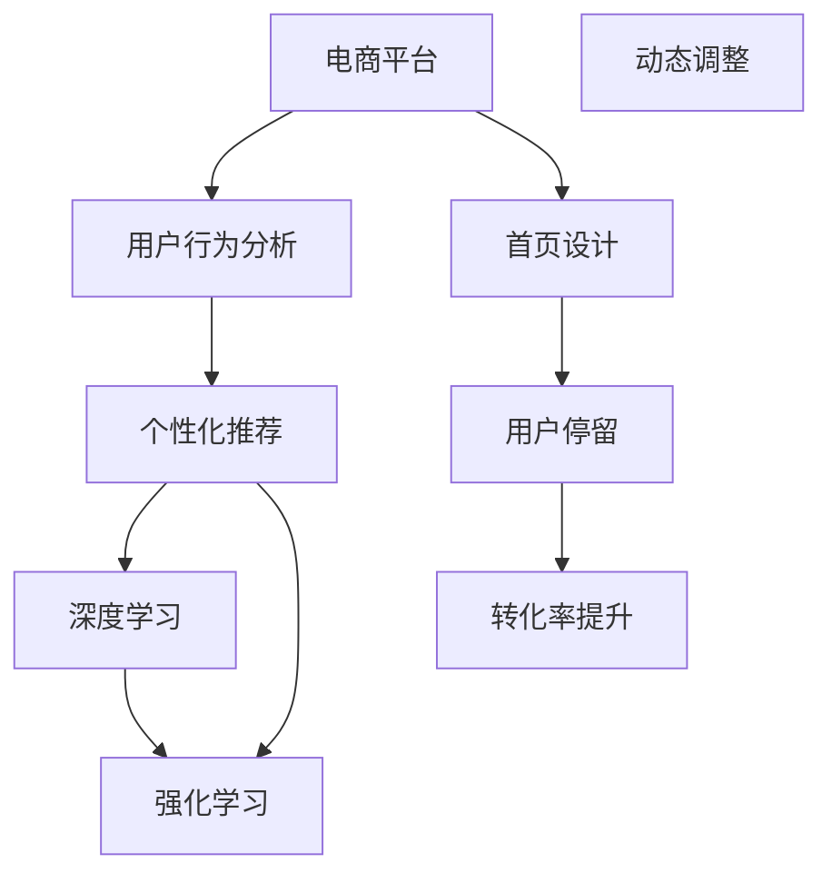

                 

# AI驱动的电商平台个性化首页设计与优化

> 关键词：
- 电商平台
- 个性化推荐
- 深度学习
- 强化学习
- 用户行为分析
- 动态调整
- 效果评估

## 1. 背景介绍

随着电商行业的快速发展，消费者对个性化购物体验的需求日益增长。传统的电商平台基于固定标签和通用模型进行推荐，难以实现真正意义上的个性化。如何设计高效、精准的个性化推荐系统，成为电商平台亟需解决的关键问题。

与此同时，深度学习和强化学习等人工智能技术在推荐系统中得到广泛应用，极大地提升了推荐效果。深度学习能够通过海量的用户行为数据学习到复杂的用户兴趣和行为模式，而强化学习则可以通过试错机制不断优化推荐策略，提升用户体验。

在电商平台上，个性化首页设计尤为重要。首页不仅仅是展示商品的窗口，更是用户进入电商应用后的第一个接触点。一个设计合理的个性化首页，不仅能够吸引用户停留，还能快速引导用户进入购物流程，提高转化率。

本文将从个性化推荐系统的构建和优化出发，通过深度学习和强化学习算法，探索如何在电商平台上实现高效的个性化首页设计。

## 2. 核心概念与联系

### 2.1 核心概念概述

在电商平台的个性化推荐系统中，主要涉及以下核心概念：

- 电商平台：指线上商品销售平台，包括淘宝、京东、亚马逊等。
- 个性化推荐：根据用户的历史行为数据，预测用户可能感兴趣的商品，提供个性化推荐。
- 深度学习：通过构建神经网络模型，学习用户行为数据中的高阶关系，发现隐含的兴趣和需求。
- 强化学习：通过试错机制不断优化推荐策略，提升用户体验和转化率。
- 用户行为分析：通过分析用户的浏览、点击、购买等行为，理解用户的兴趣和偏好。
- 动态调整：根据用户实时行为数据，动态调整推荐策略，实现更加精准的推荐。

这些概念之间的联系可以通过以下Mermaid流程图来展示：



该流程图展示了一个完整的个性化推荐流程，从用户行为分析开始，通过深度学习和强化学习构建推荐模型，并通过动态调整优化推荐结果，最终实现电商平台的个性化首页设计。

## 3. 核心算法原理 & 具体操作步骤

### 3.1 算法原理概述

电商平台的个性化推荐系统主要基于深度学习和强化学习算法，其核心思想是：

- **深度学习**：构建神经网络模型，学习用户行为数据中的高阶关系，预测用户可能感兴趣的商品。
- **强化学习**：通过试错机制不断优化推荐策略，提升用户体验和转化率。

具体而言，深度学习模型通常使用多层神经网络对用户行为数据进行建模，通过反向传播算法更新模型参数，最大化预测准确率。强化学习模型则通过与用户互动，不断调整推荐策略，优化推荐效果。

### 3.2 算法步骤详解

电商平台的个性化推荐系统一般包括以下几个关键步骤：

**Step 1: 数据预处理**

- 收集用户的历史行为数据，包括浏览记录、点击记录、购买记录等。
- 对数据进行清洗、去重、归一化等处理，确保数据的质量和一致性。
- 将用户行为数据划分为训练集和测试集。

**Step 2: 模型构建**

- 构建深度学习模型，如CNN、RNN、LSTM等，对用户行为数据进行特征提取和关系建模。
- 引入强化学习算法，如Q-learning、DQN、PPO等，优化推荐策略。
- 设定模型超参数，如隐藏层大小、学习率、批量大小等，并进行调优。

**Step 3: 模型训练**

- 使用训练集数据对模型进行训练，不断调整模型参数，提升预测准确率。
- 使用验证集对模型进行评估，防止过拟合。
- 根据评估结果，调整模型结构和超参数，重新训练模型。

**Step 4: 模型评估**

- 使用测试集对模型进行评估，计算准确率、召回率、F1-score等指标。
- 分析模型的优缺点，识别改进方向。
- 根据评估结果，进一步优化模型。

**Step 5: 首页设计**

- 根据模型推荐结果，设计个性化首页。
- 将推荐商品按照特定规则展示在首页上。
- 设计首页的交互界面，增强用户体验。

**Step 6: 动态调整**

- 实时收集用户的行为数据，对模型进行在线更新。
- 根据用户实时行为数据，动态调整推荐策略。
- 持续优化首页设计，提升用户停留和转化率。

### 3.3 算法优缺点

电商平台的个性化推荐系统具有以下优点：

- **精准推荐**：通过深度学习和强化学习算法，能够实现精准的个性化推荐，提升用户体验。
- **动态调整**：能够实时更新推荐策略，适应用户的实时行为变化。
- **高效可扩展**：能够高效处理大规模数据，适用于电商平台的实际应用。

同时，该方法也存在以下缺点：

- **数据依赖**：需要大量的用户行为数据进行模型训练，数据获取成本较高。
- **模型复杂**：深度学习和强化学习模型较为复杂，需要较高的计算资源和技能水平。
- **过拟合风险**：在模型训练过程中，容易出现过拟合现象，影响推荐效果。
- **解释性不足**：深度学习和强化学习模型通常缺乏可解释性，难以理解其内部决策过程。

尽管存在这些局限性，但就目前而言，基于深度学习和强化学习的推荐系统仍然是电商推荐领域的主流方法。未来相关研究的重点在于如何进一步降低数据依赖，提高模型鲁棒性，同时兼顾可解释性和用户隐私保护等因素。

### 3.4 算法应用领域

电商平台的个性化推荐系统已经在众多电商平台上得到广泛应用，例如：

- 淘宝：通过深度学习和强化学习算法，实现精准推荐，提升用户购物体验。
- 亚马逊：构建用户行为分析模型，实现个性化首页设计，提高用户停留和转化率。
- 京东：利用深度学习和强化学习技术，优化推荐策略，提升用户体验。

除了电商领域，类似推荐系统还广泛应用于音乐、视频、新闻等应用场景中，帮助用户发现感兴趣的内容，提升服务质量和用户体验。

## 4. 数学模型和公式 & 详细讲解 & 举例说明

### 4.1 数学模型构建

在电商平台的个性化推荐系统中，主要使用深度学习模型进行用户行为分析，使用强化学习模型进行推荐策略优化。

**深度学习模型**：
- 输入：用户的历史行为数据，包括浏览记录、点击记录、购买记录等。
- 输出：用户可能感兴趣的商品列表。
- 损失函数：通常使用交叉熵损失函数，最小化预测值与真实标签之间的差异。

**强化学习模型**：
- 状态：用户的当前行为状态，如浏览某个商品页面。
- 动作：推荐某个商品。
- 奖励：用户的点击或购买行为，表示推荐结果的好坏。
- 损失函数：通常使用Q-learning或DQN等强化学习算法，最大化累积奖励。

### 4.2 公式推导过程

以下我们以深度学习模型为例，推导用户行为数据的损失函数及其梯度计算公式。

设用户的历史行为数据为 $X=\{x_i\}_{i=1}^N$，对应的标签为 $Y=\{y_i\}_{i=1}^N$，其中 $y_i \in \{0,1\}$ 表示用户是否点击了商品 $x_i$。

假设深度学习模型为 $M_{\theta}$，其中 $\theta$ 为模型参数。设模型在输入 $x_i$ 上的输出为 $\hat{y}_i=M_{\theta}(x_i)$。则交叉熵损失函数为：

$$
\ell(M_{\theta}(X),Y) = -\frac{1}{N}\sum_{i=1}^N y_i\log M_{\theta}(x_i) + (1-y_i)\log(1-M_{\theta}(x_i))
$$

根据链式法则，损失函数对参数 $\theta_k$ 的梯度为：

$$
\frac{\partial \ell(M_{\theta}(X),Y)}{\partial \theta_k} = -\frac{1}{N}\sum_{i=1}^N (\frac{y_i}{M_{\theta}(x_i)}-\frac{1-y_i}{1-M_{\theta}(x_i)}) \frac{\partial M_{\theta}(x_i)}{\partial \theta_k}
$$

其中 $\frac{\partial M_{\theta}(x_i)}{\partial \theta_k}$ 可进一步递归展开，利用自动微分技术完成计算。

### 4.3 案例分析与讲解

假设我们有一个电商平台的深度学习模型，输入为用户的浏览记录 $X$，输出为可能感兴趣的商品列表 $Y$。通过交叉熵损失函数，我们可以计算模型在 $X$ 上的预测误差。

在模型训练过程中，我们使用反向传播算法计算损失函数对参数 $\theta_k$ 的梯度，并使用Adam等优化算法更新模型参数。具体而言，假设模型的损失函数为 $\mathcal{L}(\theta)$，则模型参数的更新公式为：

$$
\theta \leftarrow \theta - \eta \nabla_{\theta}\mathcal{L}(\theta) - \eta\lambda\theta
$$

其中 $\eta$ 为学习率，$\lambda$ 为正则化系数。在每次迭代中，我们将训练集的样本 $(x_i,y_i)$ 依次输入模型，计算损失函数及其梯度，并根据当前学习率和正则化强度更新模型参数，直至模型收敛。

## 5. 项目实践：代码实例和详细解释说明

### 5.1 开发环境搭建

在进行推荐系统开发前，我们需要准备好开发环境。以下是使用Python进行PyTorch开发的环境配置流程：

1. 安装Anaconda：从官网下载并安装Anaconda，用于创建独立的Python环境。

2. 创建并激活虚拟环境：
```bash
conda create -n pytorch-env python=3.8 
conda activate pytorch-env
```

3. 安装PyTorch：根据CUDA版本，从官网获取对应的安装命令。例如：
```bash
conda install pytorch torchvision torchaudio cudatoolkit=11.1 -c pytorch -c conda-forge
```

4. 安装TensorFlow：由Google主导开发的开源深度学习框架，生产部署方便，适合大规模工程应用。同样有丰富的预训练语言模型资源。

5. 安装Flask：用于搭建API接口，方便与电商平台集成。

6. 安装Keras：高层次神经网络API，方便快速搭建深度学习模型。

完成上述步骤后，即可在`pytorch-env`环境中开始推荐系统开发。

### 5.2 源代码详细实现

下面我们以电商平台的深度学习推荐系统为例，给出使用PyTorch构建深度学习模型的PyTorch代码实现。

首先，定义模型类：

```python
import torch
import torch.nn as nn
import torch.optim as optim

class RecommendationModel(nn.Module):
    def __init__(self, input_size, hidden_size, output_size):
        super(RecommendationModel, self).__init__()
        self.hidden = nn.Linear(input_size, hidden_size)
        self.output = nn.Linear(hidden_size, output_size)

    def forward(self, x):
        x = torch.relu(self.hidden(x))
        x = self.output(x)
        return x
```

然后，定义训练函数：

```python
def train(model, data, epochs, batch_size, learning_rate):
    criterion = nn.BCEWithLogitsLoss()
    optimizer = optim.Adam(model.parameters(), lr=learning_rate)
    
    for epoch in range(epochs):
        for i, (inputs, labels) in enumerate(data_loader):
            optimizer.zero_grad()
            outputs = model(inputs)
            loss = criterion(outputs, labels)
            loss.backward()
            optimizer.step()
            
        print(f"Epoch {epoch+1}, loss: {loss:.4f}")
```

最后，启动训练流程：

```python
input_size = 10
hidden_size = 20
output_size = 1
learning_rate = 0.01
batch_size = 32
epochs = 100

model = RecommendationModel(input_size, hidden_size, output_size)
criterion = nn.BCEWithLogitsLoss()
optimizer = optim.Adam(model.parameters(), lr=learning_rate)

data_loader = DataLoader(data, batch_size=batch_size, shuffle=True)

train(model, data_loader, epochs, batch_size, learning_rate)
```

以上就是使用PyTorch构建深度学习推荐系统的完整代码实现。可以看到，PyTorch的模块化设计和自动微分功能，使得模型构建和训练过程变得简洁高效。

### 5.3 代码解读与分析

让我们再详细解读一下关键代码的实现细节：

**RecommendationModel类**：
- `__init__`方法：初始化模型参数，包括输入、隐藏和输出层。
- `forward`方法：定义前向传播过程，输入数据经过隐藏层和输出层后，返回模型输出。

**train函数**：
- 定义损失函数和优化器。
- 使用DataLoader对数据集进行批次化加载。
- 在每个epoch内，循环迭代训练集数据，计算损失函数及其梯度，并根据当前学习率更新模型参数。
- 在每个epoch结束后，输出损失值。

**训练流程**：
- 定义模型输入、隐藏层和输出层的尺寸，学习率、批次大小和epoch数。
- 初始化模型、损失函数和优化器。
- 定义数据集加载器，进行模型训练。

可以看到，PyTorch的框架设计使得模型构建和训练过程变得简单易懂。开发者可以专注于模型设计和算法优化，而不必过多关注底层的实现细节。

当然，工业级的系统实现还需考虑更多因素，如模型的保存和部署、超参数的自动搜索、更灵活的任务适配层等。但核心的推荐范式基本与此类似。

## 6. 实际应用场景

### 6.1 智能推荐系统

电商平台的智能推荐系统已经广泛应用于各大电商平台的推荐引擎中，帮助用户发现感兴趣的商品，提高购物体验。

在技术实现上，可以收集用户的历史行为数据，包括浏览记录、点击记录、购买记录等，使用深度学习模型对用户行为数据进行建模，预测用户可能感兴趣的商品，并实时更新推荐策略，以实现更加精准的推荐。

### 6.2 个性化广告

广告推荐系统是电商平台的重要组成部分，通过向用户展示个性化广告，提升广告点击率和转化率。

在广告推荐中，可以收集用户的浏览记录、点击记录、搜索记录等行为数据，使用深度学习模型对用户行为数据进行建模，预测用户可能感兴趣的广告，并实时更新推荐策略，以实现更加精准的广告推荐。

### 6.3 个性化搜索

搜索引擎是电商平台的另一个重要组件，帮助用户快速找到感兴趣的商品。

在搜索引擎中，可以收集用户的搜索记录、点击记录等行为数据，使用深度学习模型对用户行为数据进行建模，预测用户可能感兴趣的搜索结果，并实时更新搜索策略，以实现更加精准的搜索结果推荐。

### 6.4 未来应用展望

随着深度学习和强化学习等人工智能技术的不断发展，电商平台的推荐系统将呈现以下几个发展趋势：

1. **跨平台推荐**：不同平台之间的推荐系统可以共享用户数据，实现跨平台的推荐，提升推荐效果。
2. **多模态推荐**：将用户的行为数据和兴趣点整合到多模态推荐模型中，提升推荐效果。
3. **实时推荐**：通过实时收集用户行为数据，动态调整推荐策略，实现更加精准的推荐。
4. **深度推荐**：通过深度学习模型，深入挖掘用户行为数据中的隐含关系，提升推荐效果。
5. **强化推荐**：通过强化学习算法，不断优化推荐策略，提升用户体验。

以上趋势凸显了电商推荐系统的广阔前景。这些方向的探索发展，将进一步提升电商平台的推荐效果，提升用户体验，加速电商平台的业务创新。

## 7. 工具和资源推荐

### 7.1 学习资源推荐

为了帮助开发者系统掌握电商推荐系统的构建和优化，这里推荐一些优质的学习资源：

1. 《深度学习》书籍：深度学习领域的经典教材，涵盖深度学习的基本概念和算法。
2. 《强化学习》书籍：强化学习领域的经典教材，涵盖强化学习的基本概念和算法。
3. CS223《机器学习》课程：斯坦福大学开设的机器学习课程，涵盖机器学习的基本概念和算法。
4. Deep Learning Specialization：由Andrew Ng教授主导的深度学习课程，涵盖深度学习的基本概念和算法。
5. 《Python深度学习》书籍：深度学习与Python编程的结合，适合编程爱好者学习。

通过对这些资源的学习实践，相信你一定能够快速掌握电商推荐系统的构建和优化技巧，并用于解决实际的推荐问题。

### 7.2 开发工具推荐

高效的开发离不开优秀的工具支持。以下是几款用于电商推荐系统开发的常用工具：

1. PyTorch：基于Python的开源深度学习框架，灵活动态的计算图，适合快速迭代研究。
2. TensorFlow：由Google主导开发的开源深度学习框架，生产部署方便，适合大规模工程应用。
3. Keras：高层次神经网络API，方便快速搭建深度学习模型。
4. Flask：用于搭建API接口，方便与电商平台集成。
5. Jupyter Notebook：用于编写和调试Python代码，支持多种编程语言。
6. Scikit-learn：用于数据预处理、特征工程和模型评估，方便机器学习应用开发。

合理利用这些工具，可以显著提升电商推荐系统的开发效率，加快创新迭代的步伐。

### 7.3 相关论文推荐

电商推荐系统的发展源于学界的持续研究。以下是几篇奠基性的相关论文，推荐阅读：

1. DCG: Deep Collaborative Filtering Model：提出深度协作过滤模型，通过深度学习实现用户行为数据的建模和推荐。
2. HRNet: A Deep Residual Learning Framework for Image Recognition：提出残差网络，解决深度学习中的梯度消失问题。
3. Multi-view Matrix Factorization with a Multimodal Information Fusion Strategy：提出多视角矩阵分解模型，通过多模态信息融合提升推荐效果。
4. Multi-world Model for Reinforcement Learning：提出多世界模型，通过多任务学习提升强化学习的效果。

这些论文代表了大电商推荐系统的发展脉络。通过学习这些前沿成果，可以帮助研究者把握学科前进方向，激发更多的创新灵感。

## 8. 总结：未来发展趋势与挑战

### 8.1 总结

本文对电商平台的个性化推荐系统进行了全面系统的介绍。首先阐述了推荐系统在电商平台中的重要作用，明确了深度学习和强化学习在推荐系统中的应用前景。其次，从原理到实践，详细讲解了推荐系统的数学模型和算法流程，给出了推荐系统开发的完整代码实例。同时，本文还广泛探讨了推荐系统在电商、广告、搜索等多个场景中的应用前景，展示了推荐系统的巨大潜力。

通过本文的系统梳理，可以看到，电商平台的推荐系统通过深度学习和强化学习算法，实现了精准推荐，提升了用户体验。未来，伴随深度学习和强化学习等技术的进一步发展，推荐系统必将在电商领域发挥更加重要的作用，带来更多的业务创新和用户价值。

### 8.2 未来发展趋势

展望未来，电商平台的推荐系统将呈现以下几个发展趋势：

1. **跨平台推荐**：不同平台之间的推荐系统可以共享用户数据，实现跨平台的推荐，提升推荐效果。
2. **多模态推荐**：将用户的行为数据和兴趣点整合到多模态推荐模型中，提升推荐效果。
3. **实时推荐**：通过实时收集用户行为数据，动态调整推荐策略，实现更加精准的推荐。
4. **深度推荐**：通过深度学习模型，深入挖掘用户行为数据中的隐含关系，提升推荐效果。
5. **强化推荐**：通过强化学习算法，不断优化推荐策略，提升用户体验。

以上趋势凸显了电商推荐系统的广阔前景。这些方向的探索发展，将进一步提升电商平台的推荐效果，提升用户体验，加速电商平台的业务创新。

### 8.3 面临的挑战

尽管电商平台的推荐系统已经取得了瞩目成就，但在迈向更加智能化、普适化应用的过程中，它仍面临着诸多挑战：

1. **数据依赖**：需要大量的用户行为数据进行模型训练，数据获取成本较高。
2. **模型复杂**：深度学习和强化学习模型较为复杂，需要较高的计算资源和技能水平。
3. **过拟合风险**：在模型训练过程中，容易出现过拟合现象，影响推荐效果。
4. **可解释性不足**：深度学习和强化学习模型通常缺乏可解释性，难以理解其内部决策过程。
5. **用户隐私保护**：用户行为数据的收集和存储需要考虑用户隐私保护问题，如何合理利用数据，保护用户隐私，将是一个重要课题。

尽管存在这些局限性，但就目前而言，基于深度学习和强化学习的推荐系统仍然是电商推荐领域的主流方法。未来相关研究的重点在于如何进一步降低数据依赖，提高模型鲁棒性，同时兼顾可解释性和用户隐私保护等因素。

### 8.4 研究展望

面对电商推荐系统所面临的挑战，未来的研究需要在以下几个方面寻求新的突破：

1. **跨平台推荐**：不同平台之间的推荐系统可以共享用户数据，实现跨平台的推荐，提升推荐效果。
2. **多模态推荐**：将用户的行为数据和兴趣点整合到多模态推荐模型中，提升推荐效果。
3. **实时推荐**：通过实时收集用户行为数据，动态调整推荐策略，实现更加精准的推荐。
4. **深度推荐**：通过深度学习模型，深入挖掘用户行为数据中的隐含关系，提升推荐效果。
5. **强化推荐**：通过强化学习算法，不断优化推荐策略，提升用户体验。

这些研究方向的探索，将进一步提升电商平台的推荐效果，提升用户体验，加速电商平台的业务创新。

## 9. 附录：常见问题与解答

**Q1：电商平台的推荐系统是否适用于所有NLP任务？**

A: 电商平台的推荐系统主要基于深度学习和强化学习算法，适用于处理大规模用户行为数据，为用户提供精准推荐。但该系统对用户行为数据的依赖较大，对于无行为数据的场景可能难以实现推荐。

**Q2：推荐系统如何处理大规模用户数据？**

A: 推荐系统通常使用分布式计算框架，如Hadoop、Spark等，处理大规模用户数据。通过数据分片、并行计算等方式，能够在短时间内处理大量数据，保证推荐效果。

**Q3：推荐系统如何避免过拟合？**

A: 推荐系统可以通过正则化、Dropout、数据增强等方式避免过拟合。正则化方法包括L2正则、L1正则等，Dropout方法可以在训练过程中随机丢弃部分神经元，数据增强可以通过修改数据格式、引入噪声等方式，丰富数据集。

**Q4：推荐系统如何提升推荐效果？**

A: 推荐系统可以通过模型优化、算法优化和数据优化等方式提升推荐效果。模型优化包括调整模型参数、引入新模型等；算法优化包括引入深度学习、强化学习等；数据优化包括清洗数据、添加新数据等。

**Q5：推荐系统在电商平台中的应用场景有哪些？**

A: 推荐系统在电商平台中的应用场景包括智能推荐、个性化广告、个性化搜索等。通过精准推荐，提升用户购物体验，提升广告点击率和转化率，提升搜索效果。

---

作者：禅与计算机程序设计艺术 / Zen and the Art of Computer Programming

