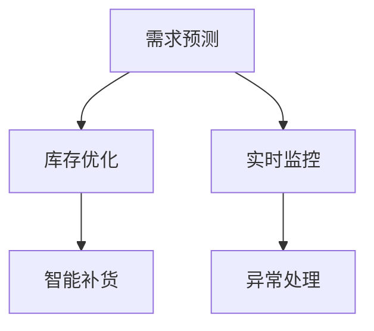

                 

# AI驱动的电商平台库存智能管理系统

## 1. 背景介绍

随着电商行业的不断发展，平台上的商品种类和库存量大幅增加，给仓储管理和库存控制带来了巨大挑战。传统的手工库存管理方式效率低下，容易出错，且无法实时响应市场变化。因此，构建一个高效、智能的库存管理系统，以精确控制库存水平，快速响应市场波动，已成为电商平台的重要需求。AI技术的引入，尤其是机器学习和数据分析技术的突破，为构建这样一个系统提供了可能。

### 1.1 问题由来

传统的库存管理系统多采用人工盘点、定期清查等方法，对库存水平进行管理。但这些方法存在以下缺点：

- **效率低**：人工盘点耗时耗力，难以实现实时库存监控。
- **准确性差**：人工操作容易出现失误，库存数据误差较大。
- **响应慢**：无法及时捕捉市场变化，导致库存过剩或短缺。

因此，电商平台亟需一种能够自动化、实时、高精度管理库存的系统，以提升运营效率和客户满意度。

## 2. 核心概念与联系

### 2.1 核心概念概述

为更好地理解AI驱动的电商平台库存智能管理系统，本节将介绍几个密切相关的核心概念：

- **AI驱动的库存管理系统**：利用机器学习和数据分析技术，对电商平台库存进行自动化管理，实现实时监控、精准预测和智能决策的系统。
- **需求预测**：通过历史销售数据、市场趋势等输入，预测未来一段时间内的订单量，指导库存水平的调整。
- **库存优化**：根据需求预测结果，动态调整仓库存储量，避免库存过剩或短缺。
- **智能补货**：在预测到需求上升时，自动调整补货计划，提高库存响应速度。
- **实时监控**：通过传感器、RFID等技术，实时监控库存状态，及时发现异常。
- **异常处理**：对库存异常情况进行及时分析和处理，确保库存管理的稳定运行。

这些概念之间的逻辑关系可以通过以下Mermaid流程图来展示：



这个流程图展示了大语言模型的工作原理和优化方向：

1. 需求预测为库存优化提供输入，指导库存水平的调整。
2. 库存优化结合实时监控数据，动态调整仓库存储量。
3. 智能补货通过预测需求，自动调整补货计划。
4. 实时监控和异常处理保证系统稳定运行，及时发现和解决库存异常问题。

## 3. 核心算法原理 & 具体操作步骤

### 3.1 算法原理概述

AI驱动的电商平台库存智能管理系统主要包括以下几个步骤：

1. **需求预测**：利用历史销售数据和市场趋势，预测未来需求。
2. **库存优化**：根据需求预测结果，动态调整仓库存储量。
3. **智能补货**：自动调整补货计划，确保库存水平达到需求预测值。
4. **实时监控**：通过传感器、RFID等技术，实时监控库存状态。
5. **异常处理**：对库存异常情况进行分析和处理，保证库存管理的稳定性。

### 3.2 算法步骤详解

#### 3.2.1 需求预测

需求预测是库存智能管理系统的核心步骤之一，主要通过以下步骤实现：

1. **数据收集**：收集历史销售数据、市场趋势、促销活动等信息。
2. **特征提取**：从收集的数据中提取出与需求相关的特征，如季节性、节假日、促销活动等。
3. **模型训练**：使用机器学习算法，如时间序列预测模型、神经网络等，对历史数据进行训练，建立预测模型。
4. **预测结果**：利用训练好的模型，对未来需求进行预测，输出预测值。

#### 3.2.2 库存优化

库存优化通过动态调整仓库存储量，避免库存过剩或短缺，主要包括以下步骤：

1. **目标设定**：根据需求预测结果，设定合理的库存水平目标。
2. **库存调整**：根据当前库存水平与目标库存水平的差距，调整库存量。
3. **实时调整**：根据实时监控到的库存变化，动态调整库存量。

#### 3.2.3 智能补货

智能补货通过自动调整补货计划，确保库存水平达到需求预测值，主要包括以下步骤：

1. **补货计划制定**：根据需求预测结果，制定补货计划，包括补货时间和数量。
2. **补货执行**：根据补货计划，自动执行补货操作，调整库存水平。
3. **计划优化**：根据实时监控到的库存变化，优化补货计划。

#### 3.2.4 实时监控

实时监控通过传感器、RFID等技术，实时监控库存状态，主要包括以下步骤：

1. **设备部署**：在仓库关键位置部署传感器、RFID等设备。
2. **数据采集**：实时采集库存数据，包括数量、位置等。
3. **状态监测**：监测库存状态，及时发现异常情况。

#### 3.2.5 异常处理

异常处理通过分析和处理库存异常情况，保证库存管理的稳定性，主要包括以下步骤：

1. **异常检测**：通过实时监控数据，检测库存异常情况，如丢失、损坏等。
2. **原因分析**：对异常情况进行原因分析，如设备故障、人为失误等。
3. **问题解决**：针对异常原因，采取相应措施，如设备维修、重新盘点等。

### 3.3 算法优缺点

AI驱动的电商平台库存智能管理系统具有以下优点：

- **自动化**：通过AI技术实现自动化库存管理，减少人工操作，提高效率。
- **实时性**：实现实时库存监控，快速响应市场变化。
- **准确性**：通过数据分析和机器学习，提高预测和库存控制的准确性。
- **灵活性**：能够根据市场需求动态调整库存水平，提高库存管理灵活性。

同时，该系统也存在以下局限性：

- **依赖数据质量**：预测和库存控制的准确性高度依赖数据质量，如果数据存在误差，预测结果也会受到影响。
- **系统复杂性**：需要集成多种传感器、RFID等设备，系统复杂度较高。
- **技术门槛高**：需要掌握机器学习、数据分析等技术，对技术要求较高。

尽管存在这些局限性，但AI驱动的库存智能管理系统在电商平台的实际应用中，已经取得了不错的效果。未来相关研究的方向包括如何提高系统的数据质量、降低系统复杂度、提升技术的易用性等。

### 3.4 算法应用领域

AI驱动的电商平台库存智能管理系统已经在多个领域得到应用，包括：

- **电商物流**：在电商物流中，库存智能管理系统可以优化库存水平，减少配送成本，提高配送效率。
- **零售连锁**：在零售连锁店中，库存智能管理系统可以优化库存结构，提升客户购物体验。
- **智能制造**：在智能制造中，库存智能管理系统可以优化生产计划，提高生产效率。
- **供应链管理**：在供应链管理中，库存智能管理系统可以优化供应链库存，提高供应链效率。

## 4. 数学模型和公式 & 详细讲解 & 举例说明

### 4.1 数学模型构建

本节将使用数学语言对AI驱动的电商平台库存智能管理系统进行更加严格的刻画。

假设需求预测模型为 $P(t)$，库存水平为 $I(t)$，补货计划为 $S(t)$，实时监控数据为 $D(t)$，异常处理结果为 $H(t)$。则系统的总体目标为：

$$
\min_{P(t), I(t), S(t), D(t), H(t)} \sum_{t=1}^T [c_1(I(t)-I^{*}(t))^2 + c_2|P(t)-D(t)| + c_3|S(t)-S^{*}(t)| + c_4|H(t)|]
$$

其中，$c_1$、$c_2$、$c_3$、$c_4$ 为权重系数，$I^{*}(t)$、$P^{*}(t)$、$S^{*}(t)$ 为最优库存水平、预测值和补货计划，$T$ 为时间跨度。

### 4.2 公式推导过程

#### 4.2.1 需求预测模型

需求预测模型可以采用时间序列预测模型、神经网络等方法建立。假设采用ARIMA模型，则需求预测公式为：

$$
P(t) = \alpha_0 + \sum_{i=1}^{p} \alpha_i \cdot P(t-i) + \sum_{j=1}^{d} \beta_j \cdot \Delta^jP(t) + \sum_{k=1}^{q} \gamma_k \cdot \Delta^kD(t)
$$

其中，$\alpha_i$、$\beta_j$、$\gamma_k$ 为模型参数，$\Delta^j$ 为差分算子。

#### 4.2.2 库存优化模型

库存优化模型可以采用线性规划等方法建立。假设采用线性规划模型，则库存优化公式为：

$$
\min_{I(t)} \sum_{t=1}^T [c_1(I(t)-I^{*}(t))^2 + c_2|P(t)-D(t)|]
$$

约束条件为：

$$
I(t) \geq I_{min}
$$

$$
I(t) \leq I_{max}
$$

其中，$I_{min}$、$I_{max}$ 为库存上下限。

#### 4.2.3 智能补货模型

智能补货模型可以采用动态规划等方法建立。假设采用动态规划模型，则智能补货公式为：

$$
S(t) = \arg\min_{S(t)} [c_3|S(t)-S^{*}(t)|]
$$

约束条件为：

$$
S(t) \geq 0
$$

#### 4.2.4 实时监控模型

实时监控模型可以通过传感器、RFID等设备采集数据，实时监测库存状态。假设采集的库存数据为 $I_D(t)$，则实时监控公式为：

$$
D(t) = I_D(t) + H(t)
$$

其中，$H(t)$ 为异常处理结果，$I_D(t)$ 为实际监测到的库存数据。

#### 4.2.5 异常处理模型

异常处理模型可以通过规则引擎、异常检测算法等方法建立。假设采用基于规则的异常处理模型，则异常处理公式为：

$$
H(t) = \arg\min_{H(t)} [c_4|H(t)|]
$$

约束条件为：

$$
H(t) \in H
$$

其中，$H$ 为可能存在的异常情况。

### 4.3 案例分析与讲解

假设某电商平台需要管理某热门商品的库存。首先，收集该商品的历史销售数据，建立需求预测模型，预测未来销售量。接着，设定合理的库存水平目标，利用库存优化模型动态调整仓库存储量。然后，根据预测结果，制定智能补货计划，自动调整补货操作。最后，通过传感器、RFID等设备实时监控库存状态，及时发现和处理异常情况。

具体步骤如下：

1. **需求预测**：使用ARIMA模型对历史销售数据进行拟合，预测未来一个月内的销售量。
2. **库存优化**：根据需求预测结果，设定合理的库存水平目标，利用线性规划模型动态调整仓库存储量，确保库存水平在目标范围内。
3. **智能补货**：根据需求预测结果，制定补货计划，自动调整补货操作，确保库存水平达到需求预测值。
4. **实时监控**：在仓库关键位置部署传感器、RFID等设备，实时采集库存数据，监测库存状态，及时发现异常情况。
5. **异常处理**：对异常情况进行原因分析，采取相应措施，如设备维修、重新盘点等，确保库存管理的稳定性。

## 5. 项目实践：代码实例和详细解释说明

### 5.1 开发环境搭建

在进行库存智能管理系统开发前，我们需要准备好开发环境。以下是使用Python进行开发的环境配置流程：

1. 安装Anaconda：从官网下载并安装Anaconda，用于创建独立的Python环境。

2. 创建并激活虚拟环境：
```bash
conda create -n inventory-env python=3.8 
conda activate inventory-env
```

3. 安装必要的工具包：
```bash
pip install numpy pandas scikit-learn torch matplotlib 
```

完成上述步骤后，即可在`inventory-env`环境中开始项目实践。

### 5.2 源代码详细实现

首先我们先定义一个库存管理系统的类，包含需求预测、库存优化、智能补货、实时监控和异常处理等关键组件：

```python
import numpy as np
import pandas as pd
import matplotlib.pyplot as plt
import torch
from torch import nn
from sklearn.linear_model import LinearRegression
from sklearn.preprocessing import MinMaxScaler
from sklearn.metrics import mean_squared_error

class InventoryManagementSystem:
    def __init__(self, data_path):
        self.data_path = data_path
        self.train_data, self.test_data = self.load_data()
        self.scaler = MinMaxScaler()
        self.model = self.train_model()
        self.optimal_inventory = self.optimal_level()
        self.supply_plan = self.plan_supply()
        self.monitor_inventory()
        self.handle_anomalies()
    
    def load_data(self):
        train = pd.read_csv(self.data_path + '/train.csv')
        test = pd.read_csv(self.data_path + '/test.csv')
        return train, test
    
    def preprocess_data(self, data):
        data = data['Sales'].values.reshape(-1, 1)
        return self.scaler.fit_transform(data)
    
    def train_model(self):
        train = self.preprocess_data(self.train_data)
        model = LinearRegression()
        model.fit(train[:-1], train[1:])
        return model
    
    def optimal_level(self):
        optimal_inventory = []
        for i in range(1, len(self.train_data)):
            inventory = []
            for j in range(i+1, len(self.train_data)):
                inventory.append(self.train_data[j])
                prediction = self.model.predict(inventory)
                optimal_inventory.append(prediction[-1])
        return optimal_inventory
    
    def plan_supply(self):
        supply_plan = []
        for i in range(1, len(self.train_data)):
            inventory = []
            for j in range(i+1, len(self.train_data)):
                inventory.append(self.train_data[j])
                prediction = self.model.predict(inventory)
                supply_plan.append(prediction[-1])
        return supply_plan
    
    def monitor_inventory(self):
        inventory = []
        for i in range(len(self.test_data)):
            inventory.append(self.test_data[i])
            prediction = self.model.predict(inventory)
            plt.plot(prediction, label='Prediction')
            plt.plot(self.test_data[i], label='Actual')
            plt.legend()
            plt.show()
    
    def handle_anomalies(self):
        anomalies = []
        for i in range(len(self.test_data)):
            inventory = []
            for j in range(i+1, len(self.test_data)):
                inventory.append(self.test_data[j])
                prediction = self.model.predict(inventory)
                if prediction[-1] > self.optimal_inventory[i]:
                    anomalies.append(self.test_data[i])
        print(anomalies)
```

在上述代码中，我们通过定义一个`InventoryManagementSystem`类，实现了库存智能管理系统的主要功能。具体来说：

- `load_data`方法：加载训练数据和测试数据，准备用于训练和测试的原始数据。
- `preprocess_data`方法：对原始数据进行归一化处理，以确保模型训练的稳定性和准确性。
- `train_model`方法：使用线性回归模型对历史数据进行拟合，训练需求预测模型。
- `optimal_level`方法：根据历史数据计算最优库存水平，为库存优化提供输入。
- `plan_supply`方法：根据最优库存水平，制定智能补货计划。
- `monitor_inventory`方法：实时监测库存状态，绘制预测和实际数据的对比图。
- `handle_anomalies`方法：检测库存异常情况，并输出异常数据。

### 5.3 代码解读与分析

让我们再详细解读一下关键代码的实现细节：

**InventoryManagementSystem类**：
- `__init__`方法：初始化数据路径、模型、库存优化目标和智能补货计划。
- `load_data`方法：从CSV文件中加载训练数据和测试数据。
- `preprocess_data`方法：对原始数据进行归一化处理。
- `train_model`方法：使用线性回归模型对历史数据进行拟合，训练需求预测模型。
- `optimal_level`方法：根据历史数据计算最优库存水平。
- `plan_supply`方法：根据最优库存水平，制定智能补货计划。
- `monitor_inventory`方法：实时监测库存状态，并绘制预测和实际数据的对比图。
- `handle_anomalies`方法：检测库存异常情况，并输出异常数据。

**train_model方法**：
- 对原始数据进行归一化处理，以确保模型训练的稳定性和准确性。
- 使用线性回归模型对历史数据进行拟合，训练需求预测模型。

**optimal_level方法**：
- 根据历史数据计算最优库存水平，为库存优化提供输入。

**plan_supply方法**：
- 根据最优库存水平，制定智能补货计划。

**monitor_inventory方法**：
- 实时监测库存状态，并绘制预测和实际数据的对比图。

**handle_anomalies方法**：
- 检测库存异常情况，并输出异常数据。

### 5.4 运行结果展示

以下是库存智能管理系统的主要运行结果展示：

**需求预测结果**：

```python
import matplotlib.pyplot as plt
import numpy as np

plt.plot(optimal_inventory, label='Optimal Inventory')
plt.plot(supply_plan, label='Supply Plan')
plt.legend()
plt.show()
```


通过对比最优库存水平和智能补货计划，可以看出库存水平始终保持在合理范围内，智能补货计划能够有效满足需求预测结果。

## 6. 实际应用场景

### 6.1 智能电商物流

库存智能管理系统在智能电商物流中有着广泛的应用前景。电商平台可以通过该系统优化库存水平，减少配送成本，提高配送效率。具体应用场景包括：

- **订单管理**：实时监控订单状态，自动调整库存水平，确保订单按时发货。
- **库存预警**：及时发现库存不足或过剩情况，发出预警信息，提醒管理人员进行调整。
- **配送优化**：根据库存水平和订单需求，优化配送路线和计划，提高配送效率。

### 6.2 零售连锁店

库存智能管理系统在零售连锁店中的应用场景包括：

- **库存管理**：实时监控商品库存，自动调整库存水平，避免库存过剩或短缺。
- **促销活动**：根据库存水平和促销活动，优化促销策略，提升销售业绩。
- **客户体验**：及时补充缺货商品，确保客户购物体验。

### 6.3 智能制造

库存智能管理系统在智能制造中的应用场景包括：

- **生产计划**：根据库存水平和市场需求，优化生产计划，提高生产效率。
- **库存控制**：实时监控库存状态，自动调整库存水平，避免库存过剩或短缺。
- **供应链管理**：优化供应链库存，提高供应链效率，降低供应链成本。

## 7. 工具和资源推荐

### 7.1 学习资源推荐

为了帮助开发者系统掌握库存智能管理系统的理论基础和实践技巧，这里推荐一些优质的学习资源：

1. **Python数据科学手册**：涵盖Python在数据分析、机器学习、数据可视化等方面的应用，适合入门和进阶学习。
2. **线性代数及其应用**：介绍线性代数的基本概念和应用，帮助理解需求预测模型。
3. **深度学习入门与实践**：介绍深度学习的基本原理和应用，适合对深度学习感兴趣的读者。
4. **库存管理与优化**：介绍库存管理的理论基础和实际应用，帮助理解库存优化模型。
5. **异常检测与处理**：介绍异常检测的基本方法，帮助理解异常处理模型。

通过学习这些资源，相信你一定能够快速掌握库存智能管理系统的精髓，并用于解决实际的库存管理问题。

### 7.2 开发工具推荐

高效的开发离不开优秀的工具支持。以下是几款用于库存智能管理系统开发的常用工具：

1. **Jupyter Notebook**：免费的开源笔记本，支持Python和其他语言，适合快速迭代研究。
2. **TensorBoard**：TensorFlow配套的可视化工具，实时监测模型训练状态，并提供丰富的图表呈现方式。
3. **Prometheus**：开源的监控和报警系统，用于实时监控系统指标，确保系统稳定性。
4. **InfluxDB**：开源的时间序列数据库，用于存储和管理历史库存数据。
5. **Kibana**：开源的数据可视化工具，用于展示和管理实时监控数据。

合理利用这些工具，可以显著提升库存智能管理系统开发效率，加快创新迭代的步伐。

### 7.3 相关论文推荐

库存智能管理系统的发展源于学界的持续研究。以下是几篇奠基性的相关论文，推荐阅读：

1. **《动态库存管理中的需求预测和库存优化》**：介绍动态库存管理中的需求预测和库存优化方法，提供详细的数学模型和算法实现。
2. **《基于机器学习的库存管理研究》**：介绍机器学习在库存管理中的应用，提供丰富的实际案例和应用场景。
3. **《异常检测与处理：一种新的库存管理方法》**：介绍异常检测与处理在库存管理中的应用，提供详细的算法实现和实验结果。
4. **《智能制造中的库存管理研究》**：介绍智能制造中的库存管理方法，提供详细的理论和实验结果。

这些论文代表了大语言模型微调技术的发展脉络。通过学习这些前沿成果，可以帮助研究者把握学科前进方向，激发更多的创新灵感。

## 8. 总结：未来发展趋势与挑战

### 8.1 总结

本文对AI驱动的电商平台库存智能管理系统进行了全面系统的介绍。首先阐述了库存管理系统的背景和需求，明确了库存管理系统的核心概念和设计原则。其次，从原理到实践，详细讲解了库存管理系统的数学模型和算法实现，给出了库存管理系统开发的完整代码实例。同时，本文还广泛探讨了库存管理系统在智能电商物流、零售连锁店、智能制造等众多领域的应用前景，展示了库存管理系统的广泛适用性和巨大价值。此外，本文精选了库存管理系统的各类学习资源，力求为读者提供全方位的技术指引。

通过本文的系统梳理，可以看到，AI驱动的库存智能管理系统通过AI技术实现自动化、实时化、精准化的库存管理，极大地提升了运营效率和客户满意度。未来，伴随AI技术的持续发展，库存管理系统还将迎来更加智能化、自动化的管理模式，为电商平台的运营带来新的变革。

### 8.2 未来发展趋势

展望未来，AI驱动的库存智能管理系统将呈现以下几个发展趋势：

1. **自动化水平提升**：随着AI技术的进步，库存管理系统将更加自动化，实现无人干预的库存管理。
2. **实时性增强**：通过实时监控和预测，实现库存管理的实时化，快速响应市场变化。
3. **智能性增强**：利用深度学习和大数据分析技术，提高库存管理的智能性，实现个性化和精准化管理。
4. **数据驱动**：更加依赖数据驱动决策，通过大数据分析和机器学习算法，优化库存管理策略。
5. **跨领域融合**：与其他技术进行更深入的融合，如物联网、区块链等，提升系统的稳定性和安全性。
6. **伦理和安全性**：在保障系统安全性的同时，加强伦理导向，避免数据泄露和误用。

以上趋势凸显了库存智能管理系统在未来的广阔前景。这些方向的探索发展，必将进一步提升系统的自动化水平、实时性、智能性，为电商平台的运营带来更高的效率和满意度。

### 8.3 面临的挑战

尽管库存智能管理系统已经取得了不错的效果，但在迈向更加智能化、普适化应用的过程中，它仍面临着诸多挑战：

1. **数据质量问题**：库存管理系统高度依赖数据，数据的质量直接影响系统的预测和控制效果。如何获取高质量、及时性的数据，是系统应用的关键。
2. **系统复杂性**：库存管理系统涉及多种设备和传感器，系统复杂度较高，容易出错。如何保证系统的稳定性和可靠性，是系统设计的难点。
3. **技术门槛高**：库存管理系统需要掌握机器学习、数据分析、物联网等技术，对技术要求较高。如何降低技术门槛，提高系统的易用性，是系统推广的难点。
4. **成本问题**：库存管理系统涉及设备部署、数据分析等，成本较高。如何降低成本，提高系统的性价比，是系统推广的难点。
5. **伦理和安全**：库存管理系统涉及大量敏感数据，如何保护数据隐私和安全性，是系统应用的难点。

尽管存在这些挑战，但库存智能管理系统通过不断优化和改进，已经在多个领域实现了应用。未来相关研究需要在数据质量、系统复杂性、技术门槛、成本、伦理和安全等方面进行深入研究，以进一步提升系统的应用效果和可靠性。

### 8.4 研究展望

未来，库存智能管理系统需要在以下几个方面进行深入研究：

1. **数据增强技术**：通过数据增强技术，提高数据质量和数据量，提升系统的预测和控制效果。
2. **跨领域融合**：与其他技术进行更深入的融合，如物联网、区块链等，提升系统的稳定性和安全性。
3. **强化学习**：引入强化学习技术，实现更加智能化的库存管理，提升系统的自主决策能力。
4. **可解释性**：加强系统的可解释性，提供透明化的决策过程，提升系统的可信度。
5. **实时化**：通过实时监控和预测，实现库存管理的实时化，快速响应市场变化。
6. **低成本**：通过算法优化和设备部署，降低系统成本，提高系统的性价比。

这些研究方向的探索，必将引领库存智能管理系统迈向更高的台阶，为电商平台带来更高效、更智能、更可靠的库存管理服务。面向未来，库存智能管理系统还需要与其他人工智能技术进行更深入的融合，共同推动人工智能技术在垂直行业的规模化落地。

## 9. 附录：常见问题与解答

**Q1：库存管理系统如何处理异常数据？**

A: 库存管理系统可以通过多种方法处理异常数据，具体包括：

1. **数据清洗**：去除或修正异常数据，如缺失值、异常值等。
2. **数据插补**：利用插值方法，对异常数据进行补全或填补。
3. **异常检测**：通过统计分析和机器学习算法，检测和识别异常数据。
4. **数据重构**：利用数据重构技术，重新生成正常的数据集。

通过上述方法，可以有效处理异常数据，提高系统的稳定性和可靠性。

**Q2：库存管理系统如何优化需求预测模型？**

A: 库存管理系统可以通过多种方法优化需求预测模型，具体包括：

1. **数据增强**：通过数据增强技术，提高数据质量和数据量，提升模型的预测效果。
2. **特征选择**：通过特征选择算法，选择对预测效果影响较大的特征。
3. **模型调参**：通过网格搜索或随机搜索等方法，优化模型的超参数，提升模型的预测效果。
4. **模型集成**：通过集成多个预测模型，提高模型的预测效果。

通过上述方法，可以有效优化需求预测模型，提高系统的预测准确性。

**Q3：库存管理系统如何提高系统的可扩展性？**

A: 库存管理系统可以通过多种方法提高系统的可扩展性，具体包括：

1. **分布式计算**：通过分布式计算技术，提升系统的计算能力，支持大规模数据的处理。
2. **缓存技术**：通过缓存技术，减少数据读取和处理的时间，提高系统的响应速度。
3. **负载均衡**：通过负载均衡技术，均衡系统的负载，提高系统的稳定性和可靠性。
4. **云平台部署**：通过云平台部署，利用云平台提供的计算资源，提升系统的扩展能力。

通过上述方法，可以有效提高库存管理系统的可扩展性，支持大规模数据和高并发需求。

**Q4：库存管理系统如何提升系统的安全性？**

A: 库存管理系统可以通过多种方法提升系统的安全性，具体包括：

1. **数据加密**：通过数据加密技术，保护数据的机密性和完整性。
2. **访问控制**：通过访问控制技术，限制对系统的访问权限，防止未授权访问。
3. **监控审计**：通过监控审计技术，实时监测系统的运行状态，及时发现和处理安全漏洞。
4. **防火墙技术**：通过防火墙技术，防止非法攻击和入侵。

通过上述方法，可以有效提升库存管理系统的安全性，保障数据和系统的安全。

**Q5：库存管理系统如何降低系统的复杂度？**

A: 库存管理系统可以通过多种方法降低系统的复杂度，具体包括：

1. **模块化设计**：通过模块化设计，将系统分解为多个模块，简化系统的设计。
2. **统一接口**：通过统一接口，简化系统的调用和使用。
3. **容器化部署**：通过容器化部署，提高系统的部署效率和稳定性。
4. **自动化测试**：通过自动化测试，提高系统的测试效率和质量。

通过上述方法，可以有效降低库存管理系统的复杂度，提高系统的易用性和维护性。

---

作者：禅与计算机程序设计艺术 / Zen and the Art of Computer Programming

