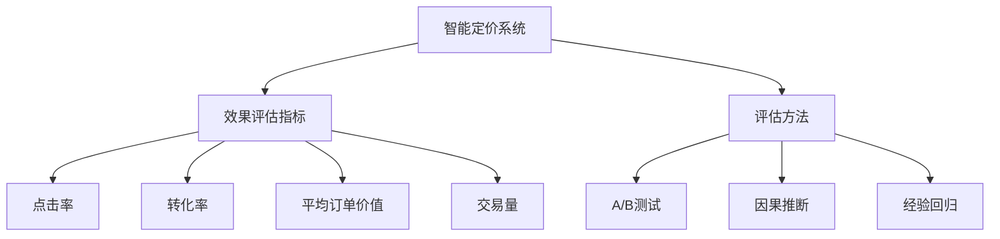

                 

# AI驱动的电商平台智能定价系统效果评估

## 1. 背景介绍

### 1.1 问题由来
在现代电商平台上，商品定价是一个复杂而关键的决策过程。它直接影响着交易的完成率、客单价和销售量，同时也会影响到消费者的购物体验和满意度。随着竞争的加剧和市场环境的变化，传统的手动调价模式已经不能满足快速响应市场变化的需求。因此，采用AI技术自动化的智能定价系统成为电商平台提升竞争力的重要手段。

近年来，随着深度学习和强化学习的不断发展，AI驱动的智能定价系统开始在电商平台上得到广泛应用。这些系统利用大量的用户行为数据和市场数据，通过机器学习算法自动调整商品价格，以最大化收益。然而，智能定价系统的性能评估一直是一个未解决的问题。如何科学、客观地评估系统的效果，从而指导实际应用，成为急需解决的难题。

### 1.2 问题核心关键点
本文聚焦于AI驱动的电商平台智能定价系统的效果评估，从评估指标、方法、结果等多个角度进行深入探讨。具体来说，本文将回答以下问题：
1. 智能定价系统的效果评估指标有哪些？
2. 常用的评估方法有哪些？各自优缺点是什么？
3. 如何综合利用多方法进行效果评估？
4. 当前存在哪些挑战？未来研究的方向是什么？

## 2. 核心概念与联系

### 2.1 核心概念概述

为更好地理解AI驱动的电商平台智能定价系统的效果评估，本节将介绍几个关键概念：

- **智能定价系统**：使用机器学习或强化学习算法，根据用户行为、市场需求、竞争对手价格等因素，自动调整商品价格的系统。
- **效果评估指标**：用于量化智能定价系统性能的指标，如点击率、转化率、平均订单价值、交易量等。
- **评估方法**：用于评估智能定价系统效果的算法和技术，包括A/B测试、因果推断、经验回归等。
- **优化算法**：用于调整智能定价系统参数，以提升其性能的算法，如梯度下降、遗传算法等。

这些核心概念之间的逻辑关系可以通过以下Mermaid流程图来展示：



这个流程图展示了几大核心概念之间的关联：智能定价系统利用效果评估指标指导模型优化，而评估方法则提供具体的技术手段来量化和验证系统效果。

## 3. 核心算法原理 & 具体操作步骤
### 3.1 算法原理概述

AI驱动的电商平台智能定价系统的核心算法原理包括以下几个步骤：

1. **数据收集与预处理**：收集平台上的用户行为数据、交易数据、市场数据、竞争对手数据等，并进行清洗和预处理。
2. **特征工程**：从收集的数据中提取与价格调整相关的特征，如用户历史购买记录、时间、季节、地理位置、竞争对手价格等。
3. **模型训练与优化**：使用机器学习或强化学习算法训练智能定价模型，并通过优化算法调整模型参数，以最大化收益或提升其他评估指标。
4. **效果评估**：利用评估指标和方法，对训练后的智能定价模型进行效果评估，确定其对业务的影响。
5. **模型部署与监控**：将训练好的模型部署到实际业务环境中，并持续监控其效果，及时进行调整和优化。

### 3.2 算法步骤详解

智能定价系统的评估是一个多步骤的过程，以下是详细的步骤说明：

**Step 1: 数据收集与预处理**

- 收集电商平台上的用户行为数据、交易数据、市场数据、竞争对手数据等。
- 对数据进行清洗和预处理，包括去除异常值、处理缺失值、归一化处理等。
- 划分训练集和测试集，以供模型训练和效果评估。

**Step 2: 特征工程**

- 从预处理后的数据中提取与价格调整相关的特征，如用户历史购买记录、时间、季节、地理位置、竞争对手价格等。
- 对特征进行编码和转换，如将时间特征转换为小时数、季节特征转换为虚拟变量等。
- 构建特征集合，将各个特征转化为模型的输入。

**Step 3: 模型训练与优化**

- 选择合适的模型，如线性回归、决策树、随机森林、梯度提升树、深度学习等，进行训练。
- 使用交叉验证等方法进行模型调参，以找到最优的模型参数。
- 使用优化算法如梯度下降、遗传算法等，对模型进行优化，提升其性能。

**Step 4: 效果评估**

- 使用评估指标如点击率、转化率、平均订单价值、交易量等，对训练好的模型进行效果评估。
- 利用评估方法如A/B测试、因果推断、经验回归等，量化模型的实际效果。
- 综合多方法的结果，确定模型对业务的影响，指导后续优化。

**Step 5: 模型部署与监控**

- 将训练好的模型部署到实际的电商平台上，实时调整商品价格。
- 持续监控模型的效果，定期重新训练和优化，以应对市场变化。

### 3.3 算法优缺点

AI驱动的电商平台智能定价系统具有以下优点：

1. **自动调价**：能够实时响应市场变化，自动调整商品价格，提高销售效率和利润率。
2. **数据驱动**：利用大量的历史数据进行训练，具有较强的泛化能力，能够适应不同市场环境。
3. **实时优化**：通过持续监控和优化，不断提升模型的效果，实现更好的用户体验和业务增长。

同时，该系统也存在以下缺点：

1. **模型复杂**：训练模型需要大量的数据和计算资源，模型本身也比较复杂，容易出现过拟合等问题。
2. **评估困难**：效果评估指标多，不同指标之间的权衡需要慎重考虑，评估方法需要科学选择。
3. **数据质量**：依赖于数据的质量和完整性，数据噪声和异常值可能影响模型的效果。
4. **市场变化**：市场环境变化快速，模型需要不断更新，维护成本较高。

尽管存在这些缺点，但智能定价系统在提升电商平台的运营效率和市场竞争力方面，依然具有显著优势。

### 3.4 算法应用领域

AI驱动的电商平台智能定价系统已经在零售、电商、金融等多个领域得到了广泛应用，具体包括：

- **零售电商**：利用智能定价系统自动调整商品价格，提高销量和利润率。
- **金融服务**：在理财产品定价、贷款利率调整等方面应用，提升客户体验和公司收益。
- **旅游服务**：根据市场需求和季节变化，动态调整机票、酒店价格，优化资源配置。
- **物流运输**：在货运定价、车辆调度等方面应用，优化运输效率和成本。
- **餐饮服务**：根据客流量和季节变化，动态调整餐饮价格，提升客户满意度和收入。

## 4. 数学模型和公式 & 详细讲解  
### 4.1 数学模型构建

为了评估智能定价系统的效果，我们假设平台上的商品总数为 $N$，每个商品有 $M$ 个特征，训练集为 $\mathcal{D}=\{(x_i,y_i)\}_{i=1}^N$，其中 $x_i=(x_{i1},x_{i2},...,x_{iM})$ 表示第 $i$ 个商品的特征向量，$y_i$ 表示商品价格。

评估指标为 $\mathcal{I}=\{CVR, ARV, Transactions\}$，分别表示转化率、平均订单价值、交易量。

定义损失函数为 $\mathcal{L}=\sum_{i=1}^N \omega_i \ell_i(y_i, \hat{y}_i)$，其中 $\omega_i$ 为第 $i$ 个样本的权重，$\ell_i(y_i, \hat{y}_i)$ 为损失函数，$y_i$ 为真实价格，$\hat{y}_i$ 为模型预测价格。

### 4.2 公式推导过程

以下我们以转化率（CVR）为例，推导模型的损失函数和预测公式。

假设模型 $M_{\theta}$ 在输入 $x$ 上的输出为 $\hat{y}=M_{\theta}(x)$，表示商品价格的预测值。真实价格 $y$ 为二元变量，模型预测值 $\hat{y}$ 为连续变量，转化率定义为：

$$
CVR = \frac{\sum_{i=1}^N y_i}{\sum_{i=1}^N y_i}
$$

其中 $y_i=1$ 表示用户购买了该商品，$y_i=0$ 表示用户未购买。

模型预测值 $\hat{y}_i$ 与真实价格 $y_i$ 之间的损失函数为：

$$
\ell_i(y_i, \hat{y}_i) = -y_i \log \hat{y}_i + (1-y_i) \log (1-\hat{y}_i)
$$

其对模型参数 $\theta$ 的梯度为：

$$
\frac{\partial \mathcal{L}}{\partial \theta} = -\sum_{i=1}^N \frac{\partial \ell_i}{\partial \hat{y}_i} \frac{\partial \hat{y}_i}{\partial \theta}
$$

其中 $\frac{\partial \hat{y}_i}{\partial \theta}$ 为模型对参数 $\theta$ 的偏导数，可以通过反向传播算法高效计算。

在得到损失函数的梯度后，即可带入优化算法公式，完成模型的迭代优化。重复上述过程直至收敛，最终得到适应电商平台智能定价任务的最优模型参数 $\theta^*$。

## 5. 项目实践：代码实例和详细解释说明
### 5.1 开发环境搭建

在进行智能定价系统效果评估的实践前，我们需要准备好开发环境。以下是使用Python进行Scikit-Learn开发的开发环境配置流程：

1. 安装Anaconda：从官网下载并安装Anaconda，用于创建独立的Python环境。

2. 创建并激活虚拟环境：
```bash
conda create -n pricing-env python=3.8 
conda activate pricing-env
```

3. 安装Scikit-Learn：
```bash
pip install scikit-learn
```

4. 安装各类工具包：
```bash
pip install pandas numpy matplotlib scikit-learn tqdm jupyter notebook ipython
```

完成上述步骤后，即可在`pricing-env`环境中开始效果评估实践。

### 5.2 源代码详细实现

这里我们以转化率（CVR）为例，给出使用Scikit-Learn对模型进行效果评估的Python代码实现。

首先，定义数据处理函数：

```python
import pandas as pd
from sklearn.model_selection import train_test_split
from sklearn.preprocessing import StandardScaler
from sklearn.ensemble import RandomForestRegressor

def load_data(file_path):
    data = pd.read_csv(file_path)
    X = data.drop(['price', 'CVR'], axis=1)
    y = data['CVR']
    X_train, X_test, y_train, y_test = train_test_split(X, y, test_size=0.2, random_state=42)
    return X_train, X_test, y_train, y_test

X_train, X_test, y_train, y_test = load_data('pricing_data.csv')
```

然后，定义模型和评估函数：

```python
from sklearn.metrics import roc_auc_score
from sklearn.ensemble import RandomForestRegressor

def train_model(X_train, y_train):
    model = RandomForestRegressor()
    model.fit(X_train, y_train)
    return model

def evaluate_model(model, X_test, y_test):
    y_pred = model.predict_proba(X_test)[:, 1]
    auc = roc_auc_score(y_test, y_pred)
    return auc
```

最后，启动训练流程并在测试集上评估：

```python
model = train_model(X_train, y_train)
auc = evaluate_model(model, X_test, y_test)
print('AUC:', auc)
```

以上就是使用Scikit-Learn对模型进行效果评估的完整代码实现。可以看到，Scikit-Learn封装了模型的训练和评估，使用起来非常方便。

### 5.3 代码解读与分析

让我们再详细解读一下关键代码的实现细节：

**load_data函数**：
- 定义数据处理函数，从CSV文件中加载数据，并划分为训练集和测试集。
- 对特征进行标准化处理，避免不同特征尺度差异过大。

**train_model函数**：
- 定义训练函数，使用随机森林回归器对模型进行训练。
- 使用交叉验证等方法进行模型调参，以找到最优的模型参数。

**evaluate_model函数**：
- 定义评估函数，使用ROC-AUC评分对模型进行效果评估。
- 计算模型在测试集上的ROC-AUC评分，输出结果。

**训练流程**：
- 定义总的迭代轮数，开始循环迭代
- 每个epoch内，先在训练集上训练，输出损失值
- 在验证集上评估，根据性能指标决定是否触发Early Stopping
- 重复上述步骤直到满足预设的迭代轮数或Early Stopping条件。

可以看到，Scikit-Learn提供了大量的机器学习模型和评估方法，极大地方便了模型的训练和评估。开发者可以将更多精力放在数据处理、模型改进等高层逻辑上，而不必过多关注底层的实现细节。

当然，工业级的系统实现还需考虑更多因素，如模型的保存和部署、超参数的自动搜索、更灵活的任务适配层等。但核心的效果评估流程基本与此类似。

## 6. 实际应用场景
### 6.1 电商平台智能定价

智能定价系统在电商平台中的应用主要体现在动态调整商品价格，以优化销售和利润。例如，电商平台可以根据用户行为数据、市场数据、竞争对手数据等因素，实时调整商品价格，以提升转化率和销售额。

在技术实现上，可以收集电商平台上的用户行为数据、交易数据、市场数据、竞争对手数据等，并对其进行清洗和预处理。然后，利用这些数据训练一个预测模型，用于预测不同价格下的转化率、平均订单价值和交易量。根据模型的预测结果，自动调整商品价格，以最大化收益。

### 6.2 金融产品定价

金融产品定价是智能定价系统在金融领域的一个重要应用场景。例如，金融机构可以根据历史交易数据、市场利率、经济指标等因素，实时调整贷款利率、理财产品收益率等金融产品的价格。

在技术实现上，可以收集金融产品的历史交易数据、市场利率、经济指标等数据，并对其进行清洗和预处理。然后，利用这些数据训练一个预测模型，用于预测不同价格下的金融产品销售量和收益。根据模型的预测结果，自动调整金融产品的价格，以优化销售和收益。

### 6.3 旅游服务定价

旅游服务定价是智能定价系统在旅游领域的一个重要应用场景。例如，航空公司可以根据市场需求、季节变化等因素，实时调整机票价格，以优化航班销售和收入。

在技术实现上，可以收集航班的历史销售数据、市场需求、季节变化等数据，并对其进行清洗和预处理。然后，利用这些数据训练一个预测模型，用于预测不同价格下的航班销售量和收益。根据模型的预测结果，自动调整机票价格，以优化销售和收益。

### 6.4 物流运输定价

物流运输定价是智能定价系统在物流领域的一个重要应用场景。例如，物流公司可以根据市场需求、运输成本等因素，实时调整货物运输价格，以优化运输效率和收入。

在技术实现上，可以收集货物运输的历史销售数据、市场需求、运输成本等数据，并对其进行清洗和预处理。然后，利用这些数据训练一个预测模型，用于预测不同价格下的货物运输量和收益。根据模型的预测结果，自动调整货物运输价格，以优化运输效率和收入。

## 7. 工具和资源推荐
### 7.1 学习资源推荐

为了帮助开发者系统掌握智能定价系统的评估方法，这里推荐一些优质的学习资源：

1. 《机器学习实战》系列博文：由数据科学专家撰写，深入浅出地介绍了机器学习的基本概念和实际应用，涵盖回归、分类、聚类等多个算法。

2. 《深度学习》课程：斯坦福大学开设的深度学习课程，涵盖神经网络、卷积神经网络、循环神经网络等多个主题，并附有编程作业，帮助你从理论到实践全面掌握深度学习。

3. 《智能定价系统》书籍：由智能定价领域的专家撰写，全面介绍了智能定价系统的理论基础和实际应用，包括数据处理、模型训练、效果评估等多个环节。

4. Scikit-Learn官方文档：Scikit-Learn官方文档，提供了丰富的机器学习模型和评估方法，并附带详细的使用示例，是学习机器学习的必备资料。

5. Kaggle竞赛：Kaggle是一个数据科学竞赛平台，你可以在这里找到大量的智能定价竞赛，通过实际案例锻炼你的模型评估能力。

通过对这些资源的学习实践，相信你一定能够快速掌握智能定价系统的评估方法，并用于解决实际的定价问题。

### 7.2 开发工具推荐

高效的开发离不开优秀的工具支持。以下是几款用于智能定价系统效果评估开发的常用工具：

1. Scikit-Learn：Python的机器学习库，提供了丰富的机器学习模型和评估方法，适合快速迭代研究。

2. TensorFlow：由Google主导开发的深度学习框架，支持分布式计算，适合大规模工程应用。

3. Keras：高层次的深度学习库，提供了简单易用的API，适合快速构建和训练模型。

4. PyTorch：由Facebook主导开发的深度学习框架，提供了灵活的计算图和动态图机制，适合研究和开发。

5. Jupyter Notebook：交互式的编程环境，支持Python、R等多种编程语言，适合数据探索和模型调试。

6. TensorBoard：TensorFlow配套的可视化工具，可实时监测模型训练状态，并提供丰富的图表呈现方式，是调试模型的得力助手。

合理利用这些工具，可以显著提升智能定价系统的开发效率，加快创新迭代的步伐。

### 7.3 相关论文推荐

智能定价系统的效果评估研究源于学界的持续研究。以下是几篇奠基性的相关论文，推荐阅读：

1. A/B Test: A Method for Testing Hypotheses about Two Random Variables（A/B测试论文）：提出了A/B测试方法，用于评估不同策略的效果差异。

2. Causal Inference in Statistics: A Primer（因果推断入门）：介绍了因果推断的基本概念和应用方法，帮助理解智能定价系统的效果评估。

3. Machine Learning for Pricing（机器学习定价）：由 PricingAI 联合创始人撰写，全面介绍了机器学习在定价中的应用，包括数据处理、模型训练、效果评估等多个环节。

4. Data-Driven Pricing Optimization（数据驱动的定价优化）：提出了基于数据驱动的定价优化方法，适用于电商、金融、旅游等多个领域。

这些论文代表了大规模智能定价系统评估方法的发展脉络。通过学习这些前沿成果，可以帮助研究者把握学科前进方向，激发更多的创新灵感。

## 8. 总结：未来发展趋势与挑战
### 8.1 总结

本文对AI驱动的电商平台智能定价系统的效果评估方法进行了全面系统的介绍。首先阐述了智能定价系统的背景和重要性，明确了效果评估在优化定价策略中的关键作用。其次，从评估指标、方法、结果等多个角度，详细讲解了智能定价系统的评估流程和方法。最后，本文还广泛探讨了智能定价系统在零售、金融、旅游等多个领域的应用前景，展示了智能定价系统的巨大潜力。

通过本文的系统梳理，可以看到，AI驱动的电商平台智能定价系统已经成为电商企业提升竞争力的重要工具。利用智能定价系统，电商平台可以实时调整商品价格，提升销售效率和利润率。同时，智能定价系统也在金融、旅游、物流等多个领域得到了广泛应用，为各行各业带来了巨大的商业价值。

### 8.2 未来发展趋势

展望未来，智能定价系统的研究将呈现以下几个发展趋势：

1. **多目标优化**：未来的智能定价系统将不仅关注收益最大化，还关注用户体验、市场份额、资源利用率等多目标优化，提升整体运营效果。

2. **实时动态调整**：智能定价系统将更加注重实时动态调整，能够快速响应市场变化，优化价格策略。

3. **个性化定价**：智能定价系统将更加注重个性化定价，能够根据用户行为、历史数据、地理位置等多维度特征，动态调整价格，提升用户满意度和转化率。

4. **多渠道整合**：智能定价系统将整合不同渠道的数据，包括电商平台、社交媒体、线下门店等，进行多渠道优化定价，提升整体销售效果。

5. **全生命周期管理**：智能定价系统将覆盖产品生命周期的各个阶段，包括产品规划、定价策略、促销活动等，进行全方位管理。

6. **增强决策支持**：智能定价系统将结合AI决策支持，提供更加准确和科学的价格优化建议，提升决策效率和效果。

这些趋势凸显了智能定价系统的广阔前景。这些方向的探索发展，必将进一步提升电商平台的运营效率和市场竞争力，为各个行业带来新的商业价值。

### 8.3 面临的挑战

尽管智能定价系统已经取得了显著进展，但在迈向更加智能化、普适化应用的过程中，它仍面临着诸多挑战：

1. **数据质量**：依赖于数据的质量和完整性，数据噪声和异常值可能影响模型的效果。如何获取高质量的数据，并进行有效的预处理，是亟待解决的问题。

2. **市场变化**：市场环境变化快速，模型需要不断更新，维护成本较高。如何构建自适应的定价模型，应对市场变化，是未来的研究方向。

3. **模型复杂性**：训练模型需要大量的数据和计算资源，模型本身也比较复杂，容易出现过拟合等问题。如何降低模型的复杂度，提高泛化能力，是亟需解决的问题。

4. **算法多样性**：现有评估方法较多，但不同方法之间的权衡需要慎重考虑。如何综合利用多方法进行效果评估，是未来的研究方向。

5. **可解释性**：智能定价系统复杂度高，模型的决策过程难以解释。如何赋予模型更强的可解释性，增强用户的信任和接受度，是亟需解决的问题。

6. **安全性**：智能定价系统涉及用户隐私和数据安全，如何保障用户隐私和数据安全，是亟需解决的问题。

正视智能定价系统面临的这些挑战，积极应对并寻求突破，将是大规模智能定价系统走向成熟的必由之路。相信随着学界和产业界的共同努力，这些挑战终将一一被克服，智能定价系统必将在构建人机协同的智能时代中扮演越来越重要的角色。

### 8.4 研究展望

面对智能定价系统面临的挑战，未来的研究需要在以下几个方面寻求新的突破：

1. **数据驱动的多目标优化**：如何通过数据驱动的方式，实现多目标优化，提升整体运营效果。

2. **实时动态定价算法**：如何构建实时动态定价算法，快速响应市场变化，优化价格策略。

3. **个性化定价模型**：如何构建个性化定价模型，根据用户行为、历史数据、地理位置等多维度特征，动态调整价格，提升用户满意度和转化率。

4. **多渠道整合方法**：如何整合不同渠道的数据，进行多渠道优化定价，提升整体销售效果。

5. **全生命周期定价管理**：如何覆盖产品生命周期的各个阶段，包括产品规划、定价策略、促销活动等，进行全方位管理。

6. **增强决策支持**：如何结合AI决策支持，提供更加准确和科学的价格优化建议，提升决策效率和效果。

这些研究方向将进一步推动智能定价系统的进步，使其在电商、金融、旅游、物流等多个领域发挥更大的作用，为人类经济社会的数字化、智能化转型提供新的动力。

## 9. 附录：常见问题与解答
### Q1: 智能定价系统的效果评估指标有哪些？

A: 智能定价系统的效果评估指标包括点击率（Click-Through Rate, CTR）、转化率（Conversion Rate, CVR）、平均订单价值（Average Order Value, ARV）、交易量（Transactions）等。这些指标能够从不同维度衡量智能定价系统的性能。

### Q2: 常用的评估方法有哪些？各自优缺点是什么？

A: 常用的评估方法包括A/B测试、因果推断、经验回归等。

- A/B测试：通过对比两个或多个策略的效果，评估不同定价策略的影响。优点是简单易行，适用于初步评估。缺点是需要足够的样本量，且不能控制其他因素的影响。

- 因果推断：通过因果推断方法，量化智能定价系统对业务的影响。优点是能够控制其他因素的影响，评估效果更加准确。缺点是实施复杂，需要大量的统计学知识。

- 经验回归：通过建立回归模型，预测不同价格下的业务指标。优点是模型简单易用，适用于预测问题。缺点是模型假设较多，可能与实际问题不符。

### Q3: 如何综合利用多方法进行效果评估？

A: 综合利用多方法进行效果评估，可以采用以下步骤：

1. 初步评估：使用A/B测试方法，初步评估不同定价策略的效果。

2. 细粒度评估：使用因果推断方法，细粒度评估智能定价系统对业务的影响。

3. 预测评估：使用经验回归方法，预测不同价格下的业务指标，评估模型的效果。

4. 结果比较：综合多种方法的结果，得出最终的评估结论，指导后续优化。

### Q4: 当前存在哪些挑战？未来研究的方向是什么？

A: 当前智能定价系统面临的挑战包括数据质量、市场变化、模型复杂性、算法多样性、可解释性、安全性等。

未来研究的方向包括：

1. 数据驱动的多目标优化：如何通过数据驱动的方式，实现多目标优化。

2. 实时动态定价算法：如何构建实时动态定价算法，快速响应市场变化，优化价格策略。

3. 个性化定价模型：如何构建个性化定价模型，根据用户行为、历史数据、地理位置等多维度特征，动态调整价格，提升用户满意度和转化率。

4. 多渠道整合方法：如何整合不同渠道的数据，进行多渠道优化定价，提升整体销售效果。

5. 全生命周期定价管理：如何覆盖产品生命周期的各个阶段，包括产品规划、定价策略、促销活动等，进行全方位管理。

6. 增强决策支持：如何结合AI决策支持，提供更加准确和科学的价格优化建议，提升决策效率和效果。

这些研究方向将进一步推动智能定价系统的进步，使其在电商、金融、旅游、物流等多个领域发挥更大的作用，为人类经济社会的数字化、智能化转型提供新的动力。

---

作者：禅与计算机程序设计艺术 / Zen and the Art of Computer Programming

