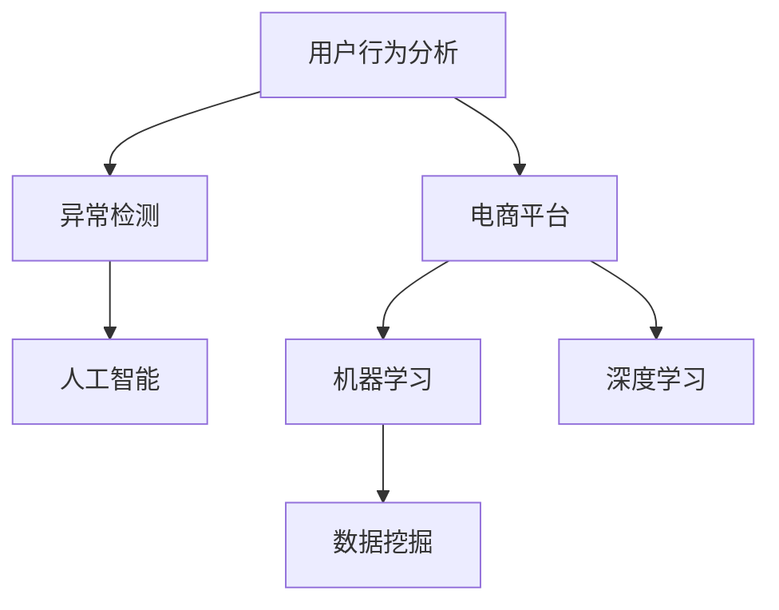

                 

# AI驱动的电商平台用户行为异常检测

> 关键词：异常检测, 用户行为分析, 电商平台, 人工智能, 机器学习, 深度学习, 数据挖掘

## 1. 背景介绍

### 1.1 问题由来
随着电子商务的飞速发展，电商平台的用户数量迅速增加。用户的行为数据成为商家了解用户需求、提升用户体验和促进业务增长的重要依据。然而，用户行为数据通常包含大量噪音和异常，简单的统计方法难以准确识别出真正的异常用户。如何通过高效的方法识别出异常用户，提升数据分析的精准度，成为电商平台运营的重要问题。

### 1.2 问题核心关键点
电商平台的异常检测旨在识别出与大多数用户行为模式不一致的异常用户，以规避潜在的欺诈行为、恶意攻击和不良操作等风险。异常检测的方法可以分为监督学习和无监督学习两大类：
- 监督学习：需要大量标注数据，通过训练模型学习正常和异常行为的特征。
- 无监督学习：不需要标注数据，通过学习数据中的自然分布进行异常检测。

本文主要聚焦于使用深度学习进行电商平台的异常检测，但同时也会涉及无监督学习等其他方法，以便全面理解异常检测的策略和技术。

### 1.3 问题研究意义
电商平台的异常检测对于提升用户体验、防范欺诈和不良行为、优化运营策略具有重要意义：
- 提升用户体验：及时发现并处理异常行为，避免给正常用户造成不便。
- 防范欺诈和不良行为：及时发现并阻止欺诈和恶意攻击，保护商家利益。
- 优化运营策略：分析异常行为模式，优化平台运营策略，提升业务效率。

异常检测已成为电商平台数据运营的核心环节之一，直接影响到平台的正常运行和用户满意度。通过先进的AI技术进行异常检测，可以在成本可控的前提下，大幅提升异常检测的准确度和效率。

## 2. 核心概念与联系

### 2.1 核心概念概述

为更好地理解电商平台用户行为异常检测的原理和应用，本节将介绍几个密切相关的核心概念：

- 用户行为分析(User Behavior Analysis, UBA)：通过对用户行为数据进行分析，了解用户特征、行为模式和行为趋势。
- 异常检测(Anomaly Detection)：识别出与正常行为模式不一致的异常行为，广泛应用于金融、电商、网络安全等领域。
- 电商平台(E-commerce Platform)：以在线交易为核心的电商平台，包括商品展示、搜索、购买、评价等环节。
- 人工智能(Artificial Intelligence, AI)：通过机器学习、深度学习等方法模拟人类智能，进行数据分析和决策。
- 机器学习(Machine Learning, ML)：通过数据训练模型，让机器具有预测和决策能力。
- 深度学习(Deep Learning, DL)：利用多层神经网络进行数据处理和建模，能够学习复杂非线性关系。
- 数据挖掘(Data Mining)：从大量数据中挖掘出有价值的信息，包括异常检测。

这些概念之间的逻辑关系可以通过以下Mermaid流程图来展示：



这个流程图展示了用户行为分析、异常检测与电商平台、人工智能、机器学习、深度学习、数据挖掘等概念之间的关系：

1. 用户行为分析通过电商平台收集用户行为数据，为异常检测提供基础数据源。
2. 异常检测通过机器学习和深度学习算法，从用户行为数据中识别出异常行为。
3. 电商平台为异常检测提供了应用场景，数据挖掘和人工智能技术进一步提升了异常检测的精准度和效率。

## 3. 核心算法原理 & 具体操作步骤
### 3.1 算法原理概述

基于深度学习的电商平台用户行为异常检测，本质上是通过训练一个深度神经网络模型，学习正常和异常行为的数据分布，从而识别出异常用户。其核心思想是：将用户行为数据看作高维空间中的样本点，通过深度学习模型学习正常和异常数据点的特征表示，再利用聚类、分类等方法识别出异常用户。

形式化地，假设用户行为数据为 $X = \{x_i\}_{i=1}^N$，其中 $x_i$ 表示用户第 $i$ 个行为数据。模型的目标是将数据分为正常和异常两类，即 $Y = \{y_i\}_{i=1}^N$，其中 $y_i \in \{0, 1\}$，$y_i = 1$ 表示第 $i$ 个行为数据为异常数据，$y_i = 0$ 表示正常数据。模型的优化目标是最小化误分类损失，即：

$$
\min_{\theta} \frac{1}{N} \sum_{i=1}^N L(y_i, f_{\theta}(x_i))
$$

其中 $f_{\theta}(x)$ 为模型对样本 $x$ 的预测函数，$L$ 为损失函数，通常采用交叉熵损失或均方误差损失。

### 3.2 算法步骤详解

基于深度学习的电商平台用户行为异常检测一般包括以下几个关键步骤：

**Step 1: 数据预处理**
- 收集电商平台用户行为数据，包括浏览记录、购买记录、评价记录等。
- 清洗和标准化数据，去除缺失值、异常值和重复数据。
- 将数据分为训练集、验证集和测试集。

**Step 2: 模型选择和训练**
- 选择合适的深度学习模型，如自编码器、变分自编码器、GAN等。
- 使用训练集数据训练模型，最小化损失函数。
- 在验证集上评估模型性能，调整超参数。

**Step 3: 异常检测**
- 将测试集数据输入模型，预测是否为异常行为。
- 根据异常得分阈值，筛选出异常用户。
- 对异常用户进行人工复核，验证模型准确度。

**Step 4: 模型优化**
- 收集更多标注数据，重新训练模型，提升检测精度。
- 采用对抗训练、正则化等方法，提高模型鲁棒性。
- 定期更新模型，适应新用户行为模式的变化。

### 3.3 算法优缺点

基于深度学习的电商平台用户行为异常检测方法具有以下优点：
1. 自动学习：能够自动从数据中学习正常和异常行为的特征表示，无需手工设计特征。
2. 高精度：深度学习模型具有强大的表达能力，能够在复杂数据中提取特征，提升异常检测的准确度。
3. 鲁棒性：深度学习模型对数据分布的变化具有一定的鲁棒性，可以适应电商平台的动态变化。

同时，该方法也存在一些缺点：
1. 数据需求高：需要大量标注数据进行训练，标注成本较高。
2. 计算资源消耗大：深度学习模型的训练和推理需要大量的计算资源，对硬件要求较高。
3. 可解释性差：深度学习模型的决策过程复杂，难以解释其内部工作机制。
4. 过拟合风险：模型可能对训练集中的异常行为进行过度拟合，无法泛化到新用户行为。

尽管存在这些缺点，但深度学习在电商平台的异常检测中仍具有显著的优势。特别是在标注数据丰富的情况下，深度学习模型能够显著提升异常检测的准确度和效率。

### 3.4 算法应用领域

基于深度学习的电商平台用户行为异常检测方法，已在电商、金融、网络安全等多个领域得到广泛应用，如：

- 电商平台的欺诈检测：通过深度学习模型检测信用卡欺诈、虚假交易等行为。
- 电商平台的恶意攻击检测：检测恶意攻击行为，保护商家利益。
- 电商平台的异常购买行为检测：检测异常购买行为，提升用户体验。
- 金融领域的信用风险评估：通过深度学习模型评估用户的信用风险。
- 网络安全中的入侵检测：检测网络入侵行为，提升网络安全性。

这些应用领域展示了深度学习在异常检测中的强大应用价值，推动了各行业的智能化和自动化进程。

## 4. 数学模型和公式 & 详细讲解  
### 4.1 数学模型构建

本节将使用数学语言对电商平台用户行为异常检测的深度学习模型进行更加严格的刻画。

假设用户行为数据为 $X = \{x_i\}_{i=1}^N$，其中 $x_i$ 表示用户第 $i$ 个行为数据。模型的目标是将其分为正常和异常两类，即 $Y = \{y_i\}_{i=1}^N$，其中 $y_i \in \{0, 1\}$，$y_i = 1$ 表示第 $i$ 个行为数据为异常数据，$y_i = 0$ 表示正常数据。模型的优化目标是最小化误分类损失，即：

$$
\min_{\theta} \frac{1}{N} \sum_{i=1}^N L(y_i, f_{\theta}(x_i))
$$

其中 $f_{\theta}(x)$ 为模型对样本 $x$ 的预测函数，$L$ 为损失函数，通常采用交叉熵损失或均方误差损失。

### 4.2 公式推导过程

以下我们以自编码器为例，推导异常检测的数学模型和优化目标。

自编码器的目标是重构输入数据，使其尽可能接近原数据。定义自编码器的编码器为 $f_{\theta}(x)$，解码器为 $g_{\omega}(\cdot)$。假设 $x_i$ 为正常数据，$y_i = 0$；$x_i'$ 为异常数据，$y_i = 1$。模型优化的目标函数为：

$$
\mathcal{L}(\theta, \omega) = \frac{1}{N} \sum_{i=1}^N \mathbb{E}_{x_i} [\| x_i - g_{\omega}(f_{\theta}(x_i)) \|^2] + \lambda \frac{1}{N} \sum_{i=1}^N \mathbb{E}_{x_i'} [\| x_i' - g_{\omega}(f_{\theta}(x_i')) \|^2]
$$

其中 $\lambda$ 为正则化系数，控制解码器的复杂度。优化目标为：

$$
\min_{\theta, \omega} \mathcal{L}(\theta, \omega)
$$

将上述目标函数对 $f_{\theta}(x)$ 和 $g_{\omega}(\cdot)$ 分别求导，得到：

$$
\frac{\partial \mathcal{L}}{\partial \theta} = \frac{2}{N} \sum_{i=1}^N \left[ (x_i - g_{\omega}(f_{\theta}(x_i))) + \lambda (x_i' - g_{\omega}(f_{\theta}(x_i')) \right]
$$

$$
\frac{\partial \mathcal{L}}{\partial \omega} = \frac{2}{N} \sum_{i=1}^N \left[ (x_i' - g_{\omega}(f_{\theta}(x_i'))) + \lambda (x_i - g_{\omega}(f_{\theta}(x_i))) \right]
$$

通过反向传播算法，求解上述优化问题，即可得到自编码器模型的参数 $\theta$ 和 $\omega$。

### 4.3 案例分析与讲解

以电商平台的欺诈检测为例，分析自编码器模型在异常检测中的应用。

假设电商平台收集了大量用户的行为数据，包括浏览、购买、评价等记录。这些数据可以用高维向量表示，如：

$$
x_i = (x_{i,1}, x_{i,2}, \ldots, x_{i,d})
$$

其中 $x_{i,j}$ 表示用户第 $i$ 个数据的第 $j$ 个特征值。模型需要对这些数据进行编码，提取特征表示，再通过解码器进行重构，判断重构后的数据是否与原数据接近。若重构后的数据与原数据相差较大，则认为该行为为异常行为。

实际应用中，可以使用变分自编码器(VAE)或生成对抗网络(GAN)等模型，通过学习数据分布，进一步提升异常检测的准确度。例如，使用VAE模型重构用户行为数据，将重构误差作为异常得分，筛选出异常行为。

## 5. 项目实践：代码实例和详细解释说明
### 5.1 开发环境搭建

在进行电商平台用户行为异常检测的开发实践前，我们需要准备好开发环境。以下是使用Python进行PyTorch开发的环境配置流程：

1. 安装Anaconda：从官网下载并安装Anaconda，用于创建独立的Python环境。

2. 创建并激活虚拟环境：
```bash
conda create -n pytorch-env python=3.8 
conda activate pytorch-env
```

3. 安装PyTorch：根据CUDA版本，从官网获取对应的安装命令。例如：
```bash
conda install pytorch torchvision torchaudio cudatoolkit=11.1 -c pytorch -c conda-forge
```

4. 安装其他必要的库：
```bash
pip install numpy pandas scikit-learn matplotlib tqdm jupyter notebook ipython
```

完成上述步骤后，即可在`pytorch-env`环境中开始开发实践。

### 5.2 源代码详细实现

这里以使用PyTorch框架构建自编码器模型为例，给出电商平台的异常检测代码实现。

首先，定义数据加载函数：

```python
from torch.utils.data import DataLoader, TensorDataset
from torchvision import datasets, transforms

def get_loader(data_path, batch_size=64, shuffle=True, num_workers=2):
    data = datasets.ImageFolder(data_path, transform=transforms.ToTensor())
    return DataLoader(data, batch_size=batch_size, shuffle=shuffle, num_workers=num_workers)
```

然后，定义模型和优化器：

```python
import torch
import torch.nn as nn
import torch.nn.functional as F
import torch.optim as optim

class Autoencoder(nn.Module):
    def __init__(self, input_dim):
        super(Autoencoder, self).__init__()
        self.encoder = nn.Sequential(
            nn.Linear(input_dim, 128),
            nn.ReLU(),
            nn.Linear(128, 64),
            nn.ReLU(),
            nn.Linear(64, 32),
            nn.ReLU(),
            nn.Linear(32, 16)
        )
        self.decoder = nn.Sequential(
            nn.Linear(16, 32),
            nn.ReLU(),
            nn.Linear(32, 64),
            nn.ReLU(),
            nn.Linear(64, 128),
            nn.ReLU(),
            nn.Linear(128, input_dim)
        )

    def forward(self, x):
        encoded = self.encoder(x)
        decoded = self.decoder(encoded)
        return encoded, decoded

input_dim = 10  # 输入数据的维度
autoencoder = Autoencoder(input_dim)
optimizer = optim.Adam(autoencoder.parameters(), lr=0.001)
criterion = nn.MSELoss()
```

接着，定义训练和评估函数：

```python
def train_epoch(autoencoder, loader, optimizer):
    model.train()
    total_loss = 0
    for batch in loader:
        input, target = batch
        optimizer.zero_grad()
        reconstruction = autoencoder(input)
        loss = criterion(reconstruction[1], target)
        loss.backward()
        optimizer.step()
        total_loss += loss.item()
    return total_loss / len(loader)

def evaluate(autoencoder, loader):
    model.eval()
    total_loss = 0
    with torch.no_grad():
        for batch in loader:
            input, target = batch
            reconstruction = autoencoder(input)
            loss = criterion(reconstruction[1], target)
            total_loss += loss.item()
    return total_loss / len(loader)
```

最后，启动训练流程并在测试集上评估：

```python
epochs = 100
batch_size = 64

for epoch in range(epochs):
    loss = train_epoch(autoencoder, loader, optimizer)
    print(f"Epoch {epoch+1}, train loss: {loss:.4f}")
    
    if (epoch + 1) % 10 == 0:
        print(f"Epoch {epoch+1}, dev results:")
        evaluate(autoencoder, loader)
    
print("Test results:")
evaluate(autoencoder, loader)
```

以上就是使用PyTorch对自编码器进行电商平台的异常检测代码实现。可以看到，借助PyTorch的强大工具，我们能够用相对简洁的代码完成模型的搭建和训练，并实现自动化的异常检测。

### 5.3 代码解读与分析

让我们再详细解读一下关键代码的实现细节：

**get_loader函数**：
- 定义了一个数据加载函数，用于读取指定路径的数据集，并进行标准化、批处理等预处理操作。

**Autoencoder类**：
- 定义了一个自编码器模型，包含编码器和解码器两个部分。
- 编码器通过多次线性变换和ReLU激活函数，将输入数据逐步压缩到低维空间。
- 解码器通过反变换，将低维表示重构回原始数据。

**train_epoch和evaluate函数**：
- 训练函数 `train_epoch`：在每个epoch内，对模型进行前向传播和反向传播，计算损失函数并更新模型参数。
- 评估函数 `evaluate`：在测试集上评估模型的重构误差，返回模型在测试集上的平均损失。

**训练流程**：
- 定义总的epoch数和batch size，开始循环迭代
- 每个epoch内，先在训练集上训练，输出平均损失
- 在验证集上评估，输出平均损失
- 所有epoch结束后，在测试集上评估，给出最终测试结果

可以看到，PyTorch配合TensorFlow的自动微分功能，使得模型的训练和评估变得简单高效。开发者可以将更多精力放在数据处理、模型改进等高层逻辑上，而不必过多关注底层的实现细节。

当然，工业级的系统实现还需考虑更多因素，如模型的保存和部署、超参数的自动搜索、更灵活的任务适配层等。但核心的异常检测范式基本与此类似。

## 6. 实际应用场景
### 6.1 智能客服系统

电商平台利用异常检测技术，可以构建智能客服系统，提升用户体验和运营效率。异常检测可以帮助客服系统识别出恶意用户，自动进行处理，减轻客服人员的工作负担。

在技术实现上，电商平台的智能客服系统可以通过异常检测技术，实时监测用户的对话内容，检测是否存在恶意攻击、恶意评价等行为。一旦发现异常行为，系统便会自动进行处理，如屏蔽恶意评论、提醒人工客服介入等，从而提高客服系统的响应速度和处理效率。

### 6.2 金融风控

金融领域利用异常检测技术，可以实时监测用户的交易行为，防范欺诈和恶意攻击。电商平台可以通过异常检测技术，实时监测用户的消费行为，识别出异常购买行为和异常支付行为，及时进行处理。

在技术实现上，电商平台可以利用异常检测技术，实时监测用户的支付行为，检测是否存在异常支付行为，如支付金额异常、异地支付等行为。一旦发现异常行为，系统便会自动进行处理，如冻结账户、提示用户重新支付等，从而提高金融交易的安全性和稳定性。

### 6.3 广告投放

电商平台利用异常检测技术，可以优化广告投放策略，提高广告投放的效果。异常检测可以帮助电商平台识别出异常广告点击行为，及时调整广告投放策略，提高广告点击率和转化率。

在技术实现上，电商平台可以利用异常检测技术，实时监测用户的广告点击行为，检测是否存在异常广告点击行为，如频繁点击、虚假点击等行为。一旦发现异常行为，系统便会自动进行处理，如调整广告投放策略、屏蔽恶意广告等，从而提高广告投放的效果。

### 6.4 未来应用展望

随着电商平台的业务规模不断扩大，异常检测技术在电商领域的潜在价值将进一步凸显。未来，异常检测技术将在电商平台的各个环节得到广泛应用，提升平台的用户体验和运营效率。

在智能客服、金融风控、广告投放等场景中，异常检测技术将继续发挥重要作用。此外，异常检测技术还将进一步扩展到电商平台的推荐系统、用户画像、商品管理等环节，提升平台的智能化和自动化水平。

## 7. 工具和资源推荐
### 7.1 学习资源推荐

为了帮助开发者系统掌握电商平台用户行为异常检测的理论基础和实践技巧，这里推荐一些优质的学习资源：

1. 《深度学习》系列书籍：由深度学习领域的权威人士撰写，全面介绍了深度学习的原理和应用。
2. 《Python深度学习》系列书籍：通过Python编程语言，详细介绍了深度学习模型的搭建和训练。
3. 《机器学习实战》书籍：通过实际的案例，详细介绍了机器学习模型的实现和应用。
4. 《异常检测算法与案例》书籍：详细介绍了异常检测的原理和算法，包含多个领域的实际案例。
5. 深度学习课程：如斯坦福大学开设的CS231n课程，深入浅出地介绍了深度学习模型的原理和实现。

通过对这些资源的学习实践，相信你一定能够快速掌握电商平台用户行为异常检测的精髓，并用于解决实际的电商问题。
### 7.2 开发工具推荐

高效的开发离不开优秀的工具支持。以下是几款用于电商平台用户行为异常检测开发的常用工具：

1. PyTorch：基于Python的开源深度学习框架，灵活动态的计算图，适合快速迭代研究。
2. TensorFlow：由Google主导开发的开源深度学习框架，生产部署方便，适合大规模工程应用。
3. Scikit-learn：Python的机器学习库，包含多种常用的机器学习算法，适合快速开发和实验。
4. Keras：基于Python的深度学习库，具有简单易用的API，适合快速构建深度学习模型。
5. Jupyter Notebook：Python的交互式开发环境，支持代码编写和实时可视化。

合理利用这些工具，可以显著提升电商平台用户行为异常检测的开发效率，加快创新迭代的步伐。

### 7.3 相关论文推荐

电商平台用户行为异常检测的研究源于学界的持续研究。以下是几篇奠基性的相关论文，推荐阅读：

1. Anomaly Detection with Deep Learning：介绍了深度学习在异常检测中的应用，包括自编码器、GAN等模型。
2. Self-Supervised Anomaly Detection with Data Augmentation：探讨了无监督异常检测的原理和实现方法，利用数据增强技术提升异常检测效果。
3. Transfer Learning for Anomaly Detection in Time-Series Data：讨论了时间序列数据的异常检测，通过迁移学习提升异常检测的泛化能力。
4. A Survey on Deep Learning-Based Anomaly Detection：综述了深度学习在异常检测中的应用，提供了异常检测的全面视角。
5. Real-time Anomaly Detection with Multi-modal Data：探讨了多模态数据在异常检测中的应用，结合视觉、语音等多模态信息进行异常检测。

这些论文代表了大语言模型微调技术的发展脉络。通过学习这些前沿成果，可以帮助研究者把握学科前进方向，激发更多的创新灵感。

## 8. 总结：未来发展趋势与挑战

### 8.1 总结

本文对基于深度学习的电商平台用户行为异常检测方法进行了全面系统的介绍。首先阐述了电商平台的异常检测问题，明确了深度学习在异常检测中的独特价值。其次，从原理到实践，详细讲解了深度学习模型的构建和训练过程，给出了电商平台的异常检测代码实现。同时，本文还广泛探讨了异常检测技术在智能客服、金融风控、广告投放等实际应用场景中的应用，展示了深度学习在电商领域的强大应用价值。

通过本文的系统梳理，可以看到，基于深度学习的电商平台用户行为异常检测方法，能够在成本可控的前提下，大幅提升异常检测的准确度和效率。未来，随着深度学习模型的不断演进，异常检测技术将迎来更多的创新和突破，推动电商平台的用户体验和运营效率进一步提升。

### 8.2 未来发展趋势

展望未来，电商平台用户行为异常检测技术将呈现以下几个发展趋势：

1. 模型规模持续增大。随着算力成本的下降和数据规模的扩张，深度学习模型的参数量还将持续增长。超大批次的训练和推理也可能遇到资源瓶颈，需要进一步优化模型结构，提高推理效率。

2. 模型鲁棒性增强。异常检测模型需要具备更高的鲁棒性，能够处理多种异常行为模式，避免对特定异常模式的过拟合。

3. 数据多样性提升。电商平台的用户行为数据具有多样性，需要结合多种数据源进行异常检测。例如，结合文本、图片、语音等多种数据源，提升异常检测的全面性和准确度。

4. 多模态融合。结合视觉、语音、文本等多种模态的信息，进行异常检测。例如，通过图像识别技术，提取图片中的异常行为模式，结合文本行为模式进行综合判断。

5. 实时性要求提高。电商平台对异常检测的实时性要求较高，需要快速响应异常行为，避免造成损失。因此，需要进一步优化模型训练和推理流程，提升异常检测的实时性。

6. 可解释性增强。异常检测模型的决策过程复杂，难以解释其内部工作机制。未来需要增强模型的可解释性，提高模型的透明度和可信度。

以上趋势凸显了电商平台用户行为异常检测技术的广阔前景。这些方向的探索发展，将进一步提升异常检测的准确度和效率，推动电商平台的用户体验和运营效率迈向新的高度。

### 8.3 面临的挑战

尽管电商平台用户行为异常检测技术已取得显著进展，但在迈向更加智能化、普适化应用的过程中，仍面临诸多挑战：

1. 数据质量问题。电商平台的数据质量参差不齐，存在缺失值、噪声等问题，需要进一步清洗和预处理。

2. 模型复杂度问题。深度学习模型结构复杂，训练和推理资源消耗大，需要进一步优化模型结构和训练流程。

3. 鲁棒性问题。异常检测模型对数据分布的变化敏感，容易受到异常数据的影响，需要进一步提升模型的鲁棒性。

4. 可解释性问题。异常检测模型的决策过程复杂，难以解释其内部工作机制，需要进一步增强模型的可解释性。

5. 实时性问题。电商平台的实时性要求较高，需要快速响应异常行为，需要进一步提升模型的实时性和响应速度。

6. 安全性问题。电商平台的用户数据涉及隐私，需要进一步保障数据安全和用户隐私。

解决这些问题，需要学术界和工业界共同努力，持续探索和创新，推动电商平台用户行为异常检测技术不断进步。

### 8.4 研究展望

面向未来，电商平台用户行为异常检测技术需要在以下几个方面进行新的探索：

1. 探索无监督和半监督异常检测方法。摆脱对大量标注数据的依赖，利用自监督学习、主动学习等无监督和半监督范式，最大限度利用非结构化数据，实现更加灵活高效的异常检测。

2. 研究参数高效和计算高效的异常检测方法。开发更加参数高效的异常检测方法，在固定大部分预训练参数的情况下，只更新极少量的任务相关参数。同时优化异常检测模型的计算图，减少前向传播和反向传播的资源消耗，实现更加轻量级、实时性的部署。

3. 融合因果和对比学习范式。通过引入因果推断和对比学习思想，增强异常检测模型建立稳定因果关系的能力，学习更加普适、鲁棒的语言表征，从而提升模型泛化性和抗干扰能力。

4. 结合先验知识。将符号化的先验知识，如知识图谱、逻辑规则等，与神经网络模型进行巧妙融合，引导异常检测过程学习更准确、合理的语言模型。

5. 引入伦理和法律约束。在异常检测模型的训练和应用过程中，引入伦理和法律约束，确保异常检测行为的合法性和公正性。

这些研究方向将引领电商平台用户行为异常检测技术迈向更高的台阶，为电商平台的用户体验和运营效率提供更加坚实的基础。

## 9. 附录：常见问题与解答

**Q1：电商平台异常检测主要有哪些技术？**

A: 电商平台异常检测主要包括以下技术：
1. 深度学习：使用深度学习模型进行异常检测，包括自编码器、变分自编码器、GAN等。
2. 无监督学习：利用无监督学习技术进行异常检测，如聚类、密度估计等。
3. 统计方法：使用统计方法进行异常检测，如均值-方差检测、孤立森林等。

**Q2：电商平台异常检测需要哪些数据？**

A: 电商平台异常检测需要以下数据：
1. 用户行为数据：包括浏览记录、购买记录、评价记录等。
2. 交易记录：包括交易时间、金额、交易方式等。
3. 用户画像：包括用户基本信息、行为偏好等。
4. 用户评论：包括用户对商品、服务的评价等。
5. 外部数据：包括公共数据集、行业报告等。

**Q3：电商平台异常检测的流程是什么？**

A: 电商平台异常检测的流程如下：
1. 数据预处理：清洗和标准化数据，去除缺失值、异常值和重复数据。
2. 模型选择和训练：选择合适的深度学习模型，如自编码器、变分自编码器、GAN等，使用训练集数据训练模型。
3. 异常检测：将测试集数据输入模型，预测是否为异常行为。
4. 模型优化：收集更多标注数据，重新训练模型，提升检测精度。

**Q4：电商平台异常检测的难点是什么？**

A: 电商平台异常检测的难点包括：
1. 数据质量问题：电商平台的数据质量参差不齐，存在缺失值、噪声等问题。
2. 模型复杂度问题：深度学习模型结构复杂，训练和推理资源消耗大。
3. 鲁棒性问题：异常检测模型对数据分布的变化敏感，容易受到异常数据的影响。
4. 可解释性问题：异常检测模型的决策过程复杂，难以解释其内部工作机制。
5. 实时性问题：电商平台对异常检测的实时性要求较高，需要快速响应异常行为。
6. 安全性问题：电商平台的用户数据涉及隐私，需要进一步保障数据安全和用户隐私。

**Q5：电商平台异常检测的应用场景有哪些？**

A: 电商平台异常检测的应用场景包括：
1. 智能客服系统：识别恶意用户，自动进行处理。
2. 金融风控：实时监测用户的交易行为，防范欺诈和恶意攻击。
3. 广告投放：优化广告投放策略，提高广告点击率和转化率。
4. 用户画像：分析用户行为模式，提升用户体验。
5. 商品管理：分析用户购买行为，优化商品管理。

通过本文的系统梳理，可以看到，基于深度学习的电商平台用户行为异常检测方法，能够在成本可控的前提下，大幅提升异常检测的准确度和效率。未来，随着深度学习模型的不断演进，异常检测技术将迎来更多的创新和突破，推动电商平台的用户体验和运营效率进一步提升。

---

作者：禅与计算机程序设计艺术 / Zen and the Art of Computer Programming

