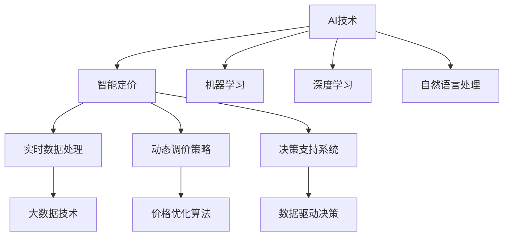

                 

# AI驱动的电商智能定价动态调整系统

## 1. 背景介绍

在电商行业中，商品的定价策略直接影响着销售业绩和顾客满意度。传统的定价方法依赖于市场调研、历史数据和专家经验，无法及时适应市场变化和消费者需求。人工智能(AI)技术的引入，为电商智能定价提供了新的解决方案，大幅提升了定价策略的自动化、精准化和动态化水平。

### 1.1 问题由来

电商行业的竞争日益激烈，为了吸引顾客，商家需要不断调整商品价格，以应对市场需求变化。然而，传统的定价方法存在以下局限性：

1. **时效性差**：市场变化快，价格调整周期长，难以实时响应市场动态。
2. **准确性低**：定价依赖经验，无法准确把握消费者的真实需求。
3. **成本高**：频繁的市场调研和人工定价耗费大量资源。

这些局限性限制了电商企业在全球市场中的竞争力。因此，亟需一种更加智能、高效的定价方法，以提升企业的市场反应能力和运营效率。

### 1.2 问题核心关键点

电商智能定价系统的核心目标是通过AI技术，实时动态地调整商品价格，以最大化销售额和利润。其核心关键点包括：

1. **实时数据处理**：快速分析海量市场数据，实时更新定价策略。
2. **智能定价算法**：利用机器学习模型预测市场需求和消费者行为，自动调整价格。
3. **动态调价策略**：根据市场变化，灵活调整价格，优化销售策略。
4. **决策支持系统**：提供数据驱动的决策支持，辅助业务决策。

这些关键点共同构成了电商智能定价系统的基础，使得企业在面对复杂多变的市场环境时，能够灵活应对，提升竞争力。

### 1.3 问题研究意义

电商智能定价系统的研究与实现，对于电商平台的发展具有重要意义：

1. **提升运营效率**：通过自动化定价，减少人工干预，提高运营效率。
2. **优化顾客体验**：实时调整价格，满足消费者需求，提升购物体验。
3. **增强市场竞争力**：快速响应市场变化，赢得更多市场份额。
4. **促进业务增长**：通过精准定价，提高销售额和利润。
5. **提供决策支持**：基于数据驱动的决策支持，辅助业务决策。

这些研究与应用价值的充分实现，将大幅提升电商企业的市场地位，推动电商行业向智能化、自动化方向发展。

## 2. 核心概念与联系

### 2.1 核心概念概述

电商智能定价系统涉及多个关键概念，包括AI、智能定价、实时数据处理、动态调价策略和决策支持系统。这些概念之间相互关联，共同支撑系统的构建和运行。

- **AI**：人工智能技术的统称，涉及机器学习、深度学习、自然语言处理等多种技术。
- **智能定价**：利用AI技术，自动调整商品价格，以实现最大化利润。
- **实时数据处理**：通过大数据技术，快速分析海量市场数据，提供实时决策支持。
- **动态调价策略**：根据市场变化，灵活调整价格，优化销售策略。
- **决策支持系统**：基于数据和算法，提供决策建议，辅助业务决策。

这些概念之间的逻辑关系可以通过以下Mermaid流程图来展示：



这个流程图展示了大语言模型的核心概念及其之间的关系：

1. AI技术为智能定价提供底层技术支持。
2. 实时数据处理和动态调价策略，基于AI技术实现具体功能的落地。
3. 决策支持系统基于实时数据和动态调价策略，辅助业务决策。

这些概念共同构成了电商智能定价系统的技术框架，使其能够在各种场景下发挥智能化的定价能力。

## 3. 核心算法原理 & 具体操作步骤
### 3.1 算法原理概述

电商智能定价系统基于AI技术，利用机器学习模型预测市场需求和消费者行为，自动调整商品价格。其核心算法原理可以总结如下：

1. **数据采集与预处理**：收集市场数据和消费者行为数据，进行清洗和预处理。
2. **模型训练与预测**：利用机器学习模型对数据进行训练，预测市场需求和消费者行为。
3. **动态调价**：根据预测结果，实时调整商品价格。
4. **性能评估与优化**：评估调价效果，根据反馈数据不断优化模型和策略。

### 3.2 算法步骤详解

电商智能定价系统的构建和运行主要包括以下步骤：

**Step 1: 数据采集与预处理**
- 收集市场数据、消费者行为数据等，如销量、价格、评论、浏览量等。
- 清洗和预处理数据，去除噪声和异常值。
- 划分训练集和测试集，用于模型训练和评估。

**Step 2: 模型选择与训练**
- 选择适合的机器学习模型，如线性回归、决策树、随机森林、神经网络等。
- 使用训练集对模型进行训练，调整超参数，优化模型性能。
- 使用验证集进行交叉验证，避免过拟合。

**Step 3: 预测与调价**
- 利用训练好的模型，对实时数据进行预测。
- 根据预测结果，动态调整商品价格。
- 记录调价效果，评估模型性能。

**Step 4: 优化与迭代**
- 根据调价效果和业务反馈，不断优化模型和策略。
- 引入新的数据和特征，更新模型参数。
- 循环迭代，不断提升系统性能。

### 3.3 算法优缺点

电商智能定价系统具有以下优点：

1. **实时性**：通过实时数据处理，能够快速响应市场变化，调整商品价格。
2. **准确性**：利用机器学习模型，预测市场需求和消费者行为，自动调整价格。
3. **灵活性**：动态调价策略，根据市场变化灵活调整价格，优化销售策略。
4. **决策支持**：基于数据驱动的决策支持，辅助业务决策。

同时，该系统也存在以下局限性：

1. **依赖数据质量**：系统性能依赖于数据的质量和多样性。
2. **模型复杂性**：构建复杂的机器学习模型需要大量计算资源和专业知识。
3. **市场变化快**：模型需要不断更新，以应对快速变化的市场环境。
4. **数据隐私问题**：数据采集和处理过程中可能涉及隐私问题。

尽管存在这些局限性，但电商智能定价系统仍然是大数据和AI技术在电商领域的重要应用。

### 3.4 算法应用领域

电商智能定价系统主要应用于以下几个领域：

1. **零售行业**：在线和离线零售，电商企业可以根据实时数据和消费者行为，动态调整商品价格，提高销售额。
2. **物流行业**：配送服务提供商可以基于需求预测，动态调整配送价格，优化配送效率。
3. **金融行业**：金融产品定价，金融机构可以根据市场变化，动态调整产品价格，提升收益。
4. **旅游行业**：旅游产品定价，旅游企业可以基于季节性和需求预测，动态调整产品价格，提高转化率。

这些应用场景展示了电商智能定价系统的广泛适用性，凸显了其在电商领域的巨大潜力。

## 4. 数学模型和公式 & 详细讲解 & 举例说明

### 4.1 数学模型构建

电商智能定价系统涉及多个数学模型，主要包括线性回归模型、决策树模型、神经网络模型等。这里以线性回归模型为例，进行详细讲解。

假设市场数据为 $(x_1, x_2, ..., x_n)$，商品价格为 $y$，线性回归模型为 $y = \beta_0 + \beta_1 x_1 + \beta_2 x_2 + ... + \beta_n x_n$。模型的目标是最小化预测误差 $\epsilon = y - \hat{y}$，其中 $\hat{y}$ 为预测值。

### 4.2 公式推导过程

根据最小二乘法，线性回归模型的参数估计公式为：

$$
\hat{\beta} = (X^T X)^{-1} X^T Y
$$

其中 $X$ 为自变量矩阵，$Y$ 为目标变量向量。使用该公式，可以估计出线性回归模型的参数 $\beta_0, \beta_1, ..., \beta_n$。

### 4.3 案例分析与讲解

假设有一个电商平台的销售数据，包含每天的销量 $x_1$、价格 $x_2$、促销活动 $x_3$ 等。利用线性回归模型，可以预测新产品的销售情况，并动态调整价格。

首先，使用历史销售数据进行模型训练，得到线性回归模型 $y = \beta_0 + \beta_1 x_1 + \beta_2 x_2 + \beta_3 x_3$。

然后，利用实时数据对模型进行预测，如新产品的销量为 $x_1$，价格为 $x_2$，促销活动为 $x_3$，可以得到预测的销售额 $\hat{y}$。

最后，根据预测结果，动态调整商品价格，优化销售策略。

## 5. 项目实践：代码实例和详细解释说明
### 5.1 开发环境搭建

在进行智能定价系统开发前，需要准备好开发环境。以下是使用Python进行TensorFlow开发的环境配置流程：

1. 安装Anaconda：从官网下载并安装Anaconda，用于创建独立的Python环境。

2. 创建并激活虚拟环境：
```bash
conda create -n tf-env python=3.8 
conda activate tf-env
```

3. 安装TensorFlow：根据CUDA版本，从官网获取对应的安装命令。例如：
```bash
conda install tensorflow
```

4. 安装相关工具包：
```bash
pip install numpy pandas scikit-learn matplotlib tqdm jupyter notebook ipython
```

完成上述步骤后，即可在`tf-env`环境中开始智能定价系统的开发。

### 5.2 源代码详细实现

以下是一个简单的智能定价系统代码实现，包括数据预处理、模型训练和动态调价：

```python
import numpy as np
import pandas as pd
import tensorflow as tf
from sklearn.linear_model import LinearRegression
from sklearn.model_selection import train_test_split

# 数据预处理
data = pd.read_csv('sales_data.csv')
X = data[['销量', '价格', '促销活动']]
y = data['销售额']
X_train, X_test, y_train, y_test = train_test_split(X, y, test_size=0.2)

# 模型训练
model = LinearRegression()
model.fit(X_train, y_train)

# 预测与调价
new_data = np.array([[100, 10, 1]])
predicted_sales = model.predict(new_data)
print(f"预测销售额: {predicted_sales}")

# 动态调价
if predicted_sales > 1000:
    new_price = 0.9 * original_price
    print(f"调整价格为: {new_price}")
else:
    print(f"保持原价: {original_price}")
```

### 5.3 代码解读与分析

让我们再详细解读一下关键代码的实现细节：

**数据预处理**：
- `pd.read_csv`：从CSV文件中读取数据。
- `train_test_split`：将数据集划分为训练集和测试集。

**模型训练**：
- `LinearRegression`：使用scikit-learn库中的线性回归模型。
- `fit`：对训练集进行模型拟合。

**预测与调价**：
- `predict`：对新数据进行预测。
- 根据预测结果，动态调整价格。

**代码示例**展示了如何使用Python和TensorFlow实现一个简单的智能定价系统。数据预处理、模型训练和动态调价等关键步骤清晰明了，便于理解和实现。

## 6. 实际应用场景
### 6.1 智能零售

智能零售是电商智能定价系统的重要应用场景之一。通过智能定价系统，电商平台可以根据实时数据和消费者行为，动态调整商品价格，提高销售额和用户满意度。

在实际应用中，可以收集平台上的历史销售数据，包括销量、价格、促销活动、用户行为等。利用这些数据训练线性回归模型，预测新产品的销量和销售额。根据预测结果，动态调整价格，优化销售策略。

### 6.2 动态定价

动态定价是另一个重要应用场景。在航班、酒店等行业，企业可以根据市场需求和季节性变化，实时调整价格。

通过智能定价系统，航空公司可以根据实时订票量、节假日、天气等数据，预测市场需求。根据预测结果，动态调整机票价格，优化资源配置。酒店管理公司也可以根据实时预订情况，动态调整房间价格，提升入住率。

### 6.3 推荐系统

推荐系统是电商智能定价系统的另一个重要应用领域。通过智能定价系统，企业可以根据用户行为数据，推荐商品和调整价格，提高用户转化率和满意度。

在实际应用中，可以利用智能定价系统，收集用户浏览、点击、购买等行为数据，构建推荐模型。根据用户行为预测其感兴趣的商品，动态调整商品价格，优化推荐效果。

### 6.4 未来应用展望

随着AI技术的不断进步，电商智能定价系统将迎来更多创新应用。未来，该系统将能够支持更多复杂场景，提供更精准的定价策略，提升企业的市场竞争力和运营效率。

在零售行业，智能定价系统将能够根据实时数据和消费者行为，动态调整商品价格，提升销售额和用户满意度。在金融行业，智能定价系统将能够实时调整金融产品价格，优化收益。在旅游行业，智能定价系统将能够根据季节性和需求预测，动态调整旅游产品价格，提高转化率。

## 7. 工具和资源推荐
### 7.1 学习资源推荐

为了帮助开发者系统掌握电商智能定价系统的理论基础和实践技巧，这里推荐一些优质的学习资源：

1. TensorFlow官方文档：TensorFlow的官方文档，提供了全面的API文档和教程，是学习TensorFlow的必备资料。

2. Scikit-learn官方文档：Scikit-learn的官方文档，提供了各种机器学习算法的详细介绍和示例。

3. 《深度学习》书籍：Ian Goodfellow所著，全面介绍了深度学习的基本概念和算法。

4. Coursera《机器学习》课程：斯坦福大学Andrew Ng教授开设的机器学习课程，系统讲解了机器学习的基本理论和方法。

5. Kaggle：数据科学竞赛平台，提供了大量的数据集和模型，可以学习和实践机器学习算法。

通过对这些资源的学习实践，相信你一定能够快速掌握电商智能定价系统的精髓，并用于解决实际的电商定价问题。

### 7.2 开发工具推荐

高效的开发离不开优秀的工具支持。以下是几款用于电商智能定价系统开发的常用工具：

1. TensorFlow：基于Python的开源深度学习框架，灵活动态的计算图，适合快速迭代研究。

2. Scikit-learn：基于Python的机器学习库，提供了丰富的机器学习算法实现。

3. Pandas：基于Python的数据处理库，提供了高效的数据处理和分析功能。

4. Jupyter Notebook：基于Python的交互式编程环境，方便调试和分享代码。

5. Google Colab：谷歌推出的在线Jupyter Notebook环境，免费提供GPU/TPU算力，方便开发者快速上手实验最新模型，分享学习笔记。

合理利用这些工具，可以显著提升电商智能定价系统的开发效率，加快创新迭代的步伐。

### 7.3 相关论文推荐

电商智能定价系统的发展源于学界的持续研究。以下是几篇奠基性的相关论文，推荐阅读：

1. "Price Prediction in E-Commerce" by Zheng et al.：研究了电商平台上商品价格的预测模型，利用历史销售数据和消费者行为数据构建预测模型。

2. "Online Dynamic Pricing for Hotels" by Tong et al.：研究了酒店行业的动态定价模型，利用市场需求和季节性数据动态调整价格。

3. "Recommender Systems for E-Commerce" by Chen et al.：研究了电商平台的推荐系统，利用用户行为数据和商品特征构建推荐模型。

4. "Real-time Pricing Optimization for Online Hotels" by Yang et al.：研究了实时定价优化模型，利用实时数据和需求预测动态调整价格。

5. "Deep Learning for E-commerce Recommendation" by Chen et al.：研究了深度学习在电商推荐中的应用，利用深度神经网络构建推荐模型。

这些论文代表了大语言模型微调技术的发展脉络。通过学习这些前沿成果，可以帮助研究者把握学科前进方向，激发更多的创新灵感。

## 8. 总结：未来发展趋势与挑战

### 8.1 总结

本文对电商智能定价系统的构建与实现进行了全面系统的介绍。首先阐述了电商智能定价系统的背景和意义，明确了系统在提升企业市场竞争力和运营效率方面的价值。其次，从原理到实践，详细讲解了系统的核心算法和操作步骤，给出了系统的完整代码实现。同时，本文还探讨了系统的应用场景和未来发展趋势，展示了其在电商领域的广泛应用潜力。

通过本文的系统梳理，可以看到，电商智能定价系统通过AI技术，实现了定价策略的自动化、精准化和动态化，大幅提升了企业的市场反应能力和运营效率。未来，随着AI技术的不断进步，该系统将在更多领域大放异彩。

### 8.2 未来发展趋势

展望未来，电商智能定价系统将呈现以下几个发展趋势：

1. **自动化程度提升**：通过更加智能化的算法和模型，自动完成市场分析和定价调整，减少人工干预。
2. **多维度数据融合**：引入更多维度的数据，如情感分析、用户画像等，提升定价决策的全面性和准确性。
3. **跨行业应用拓展**：向更多行业拓展，如金融、旅游、物流等，提供更加灵活的定价策略。
4. **实时性增强**：进一步优化数据处理和模型预测算法，实现更快速、更准确的定价决策。
5. **安全性保障**：引入数据加密和隐私保护技术，保障用户数据和模型安全。

以上趋势凸显了电商智能定价系统的广阔前景。这些方向的探索发展，将进一步提升系统的性能和应用范围，为电商企业带来更大的市场价值。

### 8.3 面临的挑战

尽管电商智能定价系统已经取得了显著成果，但在迈向更加智能化、普适化应用的过程中，它仍面临着诸多挑战：

1. **数据质量问题**：系统性能依赖于数据的质量和多样性，如何获取高质量、多维度数据，仍然是一个难题。
2. **算法复杂性**：构建复杂的机器学习模型需要大量计算资源和专业知识，如何优化算法，提升效率，是一个重要的研究方向。
3. **市场环境变化快**：模型需要不断更新，以应对快速变化的市场环境，如何实现模型的快速迭代和优化，是另一个挑战。
4. **数据隐私问题**：数据采集和处理过程中可能涉及隐私问题，如何平衡数据使用和隐私保护，是一个亟需解决的难题。

尽管存在这些挑战，但电商智能定价系统的发展潜力巨大，通过不断的技术创新和优化，可以克服这些困难，实现更加智能、普适的定价策略。

### 8.4 研究展望

未来，电商智能定价系统的研究将围绕以下几个方向展开：

1. **多模态数据融合**：结合文本、图像、视频等多模态数据，提升定价决策的全面性和准确性。
2. **因果推理**：引入因果推理模型，分析和解释定价决策的因果关系，提高系统的可解释性。
3. **跨领域应用**：向更多行业拓展，提供灵活的定价策略，提升系统的通用性。
4. **实时动态定价**：引入实时动态定价技术，提高系统的响应速度和决策效率。
5. **隐私保护**：采用隐私保护技术，保障用户数据和模型安全。

这些研究方向将进一步推动电商智能定价系统的发展，使其在更多场景下发挥更大的价值。

## 9. 附录：常见问题与解答

**Q1：电商智能定价系统是否适用于所有电商企业？**

A: 电商智能定价系统适用于大多数电商企业，但需要根据具体业务需求进行定制化开发。对于大型电商企业，系统可以提供实时定价和动态调价功能，提升市场反应速度。对于小型电商企业，系统也可以提供基础的价格预测和调价建议，帮助其优化定价策略。

**Q2：如何优化电商智能定价系统的性能？**

A: 电商智能定价系统的性能优化可以从以下几个方面进行：
1. **数据预处理**：提高数据质量，去除噪声和异常值，确保模型的训练数据集准确可靠。
2. **模型选择与优化**：选择适合的数据集和算法，优化模型超参数，提高模型的预测精度。
3. **实时数据处理**：优化数据采集和处理流程，提高系统的实时响应速度。
4. **多模型集成**：利用多个模型进行集成预测，提升预测准确性。
5. **动态调价策略**：根据市场变化和需求预测，灵活调整价格，优化销售策略。

**Q3：电商智能定价系统在实际应用中需要注意哪些问题？**

A: 电商智能定价系统在实际应用中需要注意以下问题：
1. **数据隐私**：数据采集和处理过程中可能涉及隐私问题，需要遵守相关法律法规。
2. **模型鲁棒性**：模型需要具备一定的鲁棒性，能够应对市场变化和异常情况。
3. **系统稳定性**：系统需要具备高可靠性和稳定性，避免因故障导致的服务中断。
4. **用户反馈**：系统需要具备良好的用户反馈机制，及时获取用户反馈信息，进行模型优化。
5. **实时性**：系统需要具备高实时性，能够快速响应市场变化和用户需求。

**Q4：电商智能定价系统的未来发展方向是什么？**

A: 电商智能定价系统的未来发展方向包括：
1. **智能化程度提升**：通过更加智能化的算法和模型，自动完成市场分析和定价调整，减少人工干预。
2. **多维度数据融合**：引入更多维度的数据，如情感分析、用户画像等，提升定价决策的全面性和准确性。
3. **跨行业应用拓展**：向更多行业拓展，如金融、旅游、物流等，提供更加灵活的定价策略。
4. **实时性增强**：进一步优化数据处理和模型预测算法，实现更快速、更准确的定价决策。
5. **安全性保障**：引入数据加密和隐私保护技术，保障用户数据和模型安全。

这些方向的探索发展，将进一步提升电商智能定价系统的性能和应用范围，为电商企业带来更大的市场价值。

---

作者：禅与计算机程序设计艺术 / Zen and the Art of Computer Programming

