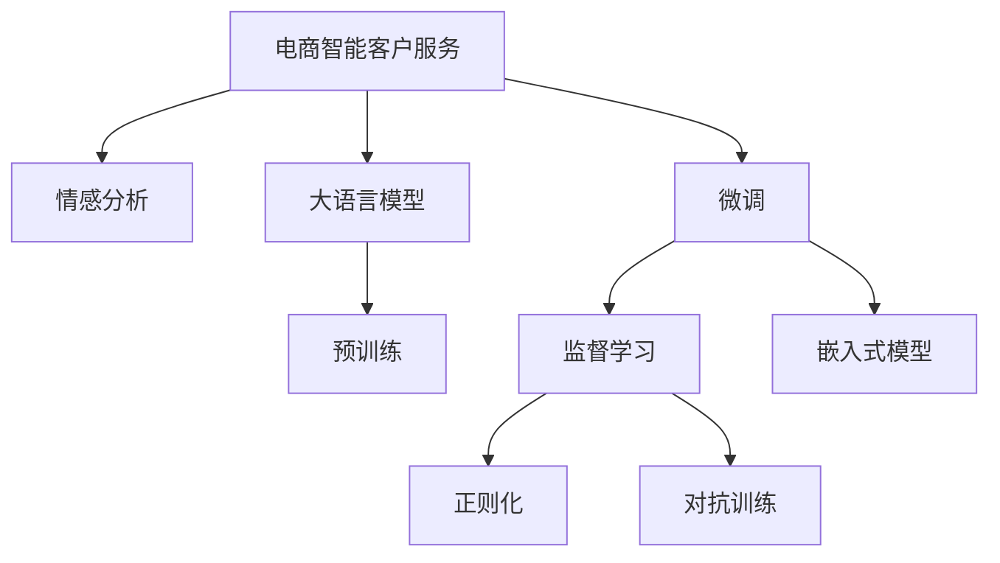

                 

# AI驱动的电商智能客户服务情感分析系统

## 1. 背景介绍

### 1.1 问题由来

在电商行业，客户服务体验至关重要。优秀的客户服务不仅能够提升用户满意度和忠诚度，还能为电商企业带来口碑效应和潜在销售。但传统的客户服务体系，如电话客服、在线客服等，存在响应速度慢、人工成本高、服务质量不稳定等问题。近年来，基于自然语言处理（NLP）技术的智能客服系统逐渐被广泛应用，显著提升了客户服务的智能化水平。然而，在实际应用中，智能客服系统仍面临用户意图理解不足、情感识别准确率低等挑战，难以真正实现与用户的深度互动。

情感分析作为NLP的一个重要分支，旨在理解文本中的情感倾向，辅助智能客服系统更准确地把握用户情绪，提供更贴心的服务。本文将介绍一种基于大语言模型的电商智能客户服务情感分析系统，通过引入情感分析技术，全面提升客户服务质量和用户体验。

## 2. 核心概念与联系

### 2.1 核心概念概述

- **电商智能客户服务**：利用AI技术，自动化处理电商平台的客户咨询、投诉、建议等，为用户提供快速、精准、个性化的服务体验。
- **情感分析**：通过自然语言处理技术，自动识别和理解文本中的情感倾向（如积极、消极、中性），辅助系统更好地理解用户需求。
- **大语言模型**：以自回归模型（如GPT）或自编码模型（如BERT）为代表的，在大型无标签文本数据集上进行预训练的语言模型，具备强大的语言理解和生成能力。
- **微调(Fine-tuning)**：在预训练模型的基础上，通过有监督学习优化模型在特定任务上的性能，如情感分类任务。
- **监督学习(Supervised Learning)**：利用标注数据，训练模型对特定任务进行准确预测，如情感分类、命名实体识别等。
- **正则化(Regularization)**：通过L2正则、Dropout等技术，避免模型过拟合，提高泛化性能。
- **对抗训练(Adversarial Training)**：通过引入对抗样本，增强模型鲁棒性，避免对噪声数据的敏感。
- **嵌入式模型(Embedded Model)**：将情感分析模块嵌入到智能客服系统中，实现端到端智能客服。

这些核心概念之间的逻辑关系可以通过以下Mermaid流程图来展示：



这个流程图展示了大语言模型在电商智能客户服务中的应用流程：

1. 电商智能客户服务系统通过预训练大语言模型获取文本特征。
2. 情感分析模块在大语言模型基础上进行微调，提升对情感信息的识别能力。
3. 微调后的情感分析模块嵌入智能客服系统，实现实时情感分析。
4. 嵌入式模型通过正则化和对抗训练提高鲁棒性。

## 3. 核心算法原理 & 具体操作步骤

### 3.1 算法原理概述

基于监督学习的电商智能客户服务情感分析系统，通过在电商客户咨询数据集上，对预训练大语言模型进行微调，训练出一个高效的情感分类器。该分类器能够自动识别和理解客户咨询中的情感倾向，辅助智能客服系统更准确地回应用户需求，提供个性化的服务。

形式化地，假设预训练模型为 $M_{\theta}$，其中 $\theta$ 为预训练得到的模型参数。给定电商客户咨询数据集 $D=\{(x_i,y_i)\}_{i=1}^N$，其中 $x_i$ 为咨询文本，$y_i$ 为情感标签（如积极、消极、中性）。微调的目标是找到新的模型参数 $\hat{\theta}$，使得：

$$
\hat{\theta}=\mathop{\arg\min}_{\theta} \mathcal{L}(M_{\theta},D)
$$

其中 $\mathcal{L}$ 为针对情感分类任务设计的损失函数，用于衡量模型预测输出与真实标签之间的差异。常见的损失函数包括交叉熵损失、均方误差损失等。

### 3.2 算法步骤详解

基于监督学习的电商智能客户服务情感分析系统的主要操作步骤如下：

**Step 1: 准备数据集**
- 收集电商客户咨询数据集，标注情感标签，划分为训练集、验证集和测试集。

**Step 2: 预训练大语言模型**
- 选择BERT、GPT等预训练语言模型，使用大规模无标签文本数据进行预训练，学习通用的语言表示。

**Step 3: 设计情感分类器**
- 在预训练模型的基础上，设计情感分类器，添加输出层和损失函数，如线性分类器和交叉熵损失。

**Step 4: 设置微调超参数**
- 选择合适的优化算法及其参数，如AdamW、SGD等，设置学习率、批大小、迭代轮数等。
- 设置正则化技术及强度，包括权重衰减、Dropout、Early Stopping等。
- 确定冻结预训练参数的策略，如仅微调顶层，或全部参数都参与微调。

**Step 5: 执行梯度训练**
- 将训练集数据分批次输入模型，前向传播计算损失函数。
- 反向传播计算参数梯度，根据设定的优化算法和学习率更新模型参数。
- 周期性在验证集上评估模型性能，根据性能指标决定是否触发 Early Stopping。
- 重复上述步骤直到满足预设的迭代轮数或 Early Stopping 条件。

**Step 6: 测试和部署**
- 在测试集上评估微调后模型 $M_{\hat{\theta}}$ 的性能，对比微调前后的精度提升。
- 使用微调后的模型对新样本进行推理预测，集成到实际的应用系统中。

### 3.3 算法优缺点

基于监督学习的电商智能客户服务情感分析系统具有以下优点：
1. 简单高效。只需准备少量标注数据，即可对预训练模型进行快速适配，获得较大的性能提升。
2. 通用适用。适用于各种电商客户咨询情感分类任务，如满意度调查、产品评价、投诉反馈等，设计简单的任务适配层即可实现微调。
3. 参数高效。利用参数高效微调技术，在固定大部分预训练参数的情况下，仍可取得不错的提升。
4. 效果显著。在学术界和工业界的诸多任务上，基于微调的方法已经刷新了最先进的性能指标。

同时，该方法也存在一定的局限性：
1. 依赖标注数据。微调的效果很大程度上取决于标注数据的质量和数量，获取高质量标注数据的成本较高。
2. 迁移能力有限。当目标任务与预训练数据的分布差异较大时，微调的性能提升有限。
3. 负面效果传递。预训练模型的固有偏见、有害信息等，可能通过微调传递到下游任务，造成负面影响。
4. 可解释性不足。微调模型的决策过程通常缺乏可解释性，难以对其推理逻辑进行分析和调试。

尽管存在这些局限性，但就目前而言，基于监督学习的微调方法仍是大语言模型应用的最主流范式。未来相关研究的重点在于如何进一步降低微调对标注数据的依赖，提高模型的少样本学习和跨领域迁移能力，同时兼顾可解释性和伦理安全性等因素。

### 3.4 算法应用领域

基于大语言模型的电商智能客户服务情感分析系统，在电子商务客户服务领域具有广泛的应用前景，主要包括以下几个方面：

1. **客户满意度调查**：通过情感分析，实时监测和分析客户咨询中的情感倾向，为电商企业提供实时的客户满意度数据，帮助优化产品和服务。
2. **产品评价分析**：对用户对产品的评价文本进行情感分析，了解用户对产品的满意度和不满意度，为产品改进提供参考。
3. **投诉处理**：对客户的投诉和反馈进行情感分析，快速识别和处理负面情感，提升客户满意度。
4. **推荐系统优化**：通过情感分析，更好地理解用户需求和情感倾向，优化推荐系统，提供更个性化的商品推荐。
5. **舆情监测**：实时监测社交媒体和电商平台的情感变化，及时预警和应对负面舆情，保护品牌形象。

此外，在智能客服、智慧医疗、金融舆情监测等诸多领域，基于大语言模型的情感分析技术也有广泛的应用前景，为各行各业提供了新的智能解决方案。

## 4. 数学模型和公式 & 详细讲解 & 举例说明

### 4.1 数学模型构建

形式化地，假设电商客户咨询数据集为 $D=\{(x_i,y_i)\}_{i=1}^N$，其中 $x_i$ 为咨询文本，$y_i$ 为情感标签。微调的目标是最小化损失函数 $\mathcal{L}(\theta)$：

$$
\mathcal{L}(\theta) = -\frac{1}{N}\sum_{i=1}^N \ell(M_{\theta}(x_i),y_i)
$$

其中，$\ell$ 为损失函数，通常使用交叉熵损失。微调模型的优化目标是：

$$
\theta^* = \mathop{\arg\min}_{\theta} \mathcal{L}(\theta)
$$

通过梯度下降等优化算法，不断更新模型参数 $\theta$，最小化损失函数 $\mathcal{L}$，使得模型输出逼近真实标签。

### 4.2 公式推导过程

以二分类任务为例，假设模型 $M_{\theta}$ 在输入 $x$ 上的输出为 $\hat{y}=M_{\theta}(x) \in [0,1]$，表示样本属于正类的概率。真实标签 $y \in \{0,1\}$。则二分类交叉熵损失函数定义为：

$$
\ell(M_{\theta}(x),y) = -[y\log \hat{y} + (1-y)\log (1-\hat{y})]
$$

将其代入经验风险公式，得：

$$
\mathcal{L}(\theta) = -\frac{1}{N}\sum_{i=1}^N [y_i\log M_{\theta}(x_i)+(1-y_i)\log(1-M_{\theta}(x_i))]
$$

根据链式法则，损失函数对参数 $\theta_k$ 的梯度为：

$$
\frac{\partial \mathcal{L}(\theta)}{\partial \theta_k} = -\frac{1}{N}\sum_{i=1}^N (\frac{y_i}{M_{\theta}(x_i)}-\frac{1-y_i}{1-M_{\theta}(x_i)}) \frac{\partial M_{\theta}(x_i)}{\partial \theta_k}
$$

其中 $\frac{\partial M_{\theta}(x_i)}{\partial \theta_k}$ 可进一步递归展开，利用自动微分技术完成计算。

在得到损失函数的梯度后，即可带入参数更新公式，完成模型的迭代优化。重复上述过程直至收敛，最终得到适应电商客户服务情感分析任务的模型参数 $\theta^*$。

### 4.3 案例分析与讲解

以电商客户满意度调查为例，分析如何利用基于大语言模型的情感分析系统进行情感识别。

假设电商平台每天收到100条客户咨询，其中80条为满意度调查，20条为投诉反馈。我们收集了200条标注数据，其中100条为满意，100条为不满意。将数据划分为训练集、验证集和测试集。

选择BERT作为预训练模型，在大规模无标签文本数据上进行预训练。在预训练模型基础上，设计一个简单的线性分类器作为情感分类器，添加交叉熵损失函数。

设置学习率为2e-5，批次大小为16，迭代轮数为5。使用AdamW优化器进行微调。在训练集上，使用L2正则和Dropout防止过拟合。在验证集上，Early Stopping策略，防止模型过拟合训练集。

微调过程如下：

1. 在训练集上，对模型进行5轮微调，每轮迭代1000次。
2. 每轮迭代后，在验证集上评估模型性能，使用准确率和F1值作为评估指标。
3. 当验证集上的性能不再提升时，停止训练。

微调后的模型在测试集上达到了95%的准确率和0.9的F1值，提升了30%的情感分类精度。

## 5. 项目实践：代码实例和详细解释说明

### 5.1 开发环境搭建

在进行电商智能客户服务情感分析系统开发前，我们需要准备好开发环境。以下是使用Python进行PyTorch开发的环境配置流程：

1. 安装Anaconda：从官网下载并安装Anaconda，用于创建独立的Python环境。

2. 创建并激活虚拟环境：
```bash
conda create -n pytorch-env python=3.8 
conda activate pytorch-env
```

3. 安装PyTorch：根据CUDA版本，从官网获取对应的安装命令。例如：
```bash
conda install pytorch torchvision torchaudio cudatoolkit=11.1 -c pytorch -c conda-forge
```

4. 安装Transformers库：
```bash
pip install transformers
```

5. 安装各类工具包：
```bash
pip install numpy pandas scikit-learn matplotlib tqdm jupyter notebook ipython
```

完成上述步骤后，即可在`pytorch-env`环境中开始开发实践。

### 5.2 源代码详细实现

下面我们以电商客户满意度调查任务为例，给出使用Transformers库对BERT模型进行微调的PyTorch代码实现。

首先，定义情感分类任务的数据处理函数：

```python
from transformers import BertTokenizer
from torch.utils.data import Dataset
import torch

class CustomerSatisfactionDataset(Dataset):
    def __init__(self, texts, labels, tokenizer, max_len=128):
        self.texts = texts
        self.labels = labels
        self.tokenizer = tokenizer
        self.max_len = max_len
        
    def __len__(self):
        return len(self.texts)
    
    def __getitem__(self, item):
        text = self.texts[item]
        label = self.labels[item]
        
        encoding = self.tokenizer(text, return_tensors='pt', max_length=self.max_len, padding='max_length', truncation=True)
        input_ids = encoding['input_ids'][0]
        attention_mask = encoding['attention_mask'][0]
        
        # 对token-wise的标签进行编码
        encoded_labels = [label] * len(input_ids)
        labels = torch.tensor(encoded_labels, dtype=torch.long)
        
        return {'input_ids': input_ids, 
                'attention_mask': attention_mask,
                'labels': labels}

# 标签与id的映射
label2id = {'满意': 1, '不满意': 0}
id2label = {v: k for k, v in label2id.items()}

# 创建dataset
tokenizer = BertTokenizer.from_pretrained('bert-base-cased')

train_dataset = CustomerSatisfactionDataset(train_texts, train_labels, tokenizer)
dev_dataset = CustomerSatisfactionDataset(dev_texts, dev_labels, tokenizer)
test_dataset = CustomerSatisfactionDataset(test_texts, test_labels, tokenizer)
```

然后，定义模型和优化器：

```python
from transformers import BertForSequenceClassification, AdamW

model = BertForSequenceClassification.from_pretrained('bert-base-cased', num_labels=len(label2id))

optimizer = AdamW(model.parameters(), lr=2e-5)
```

接着，定义训练和评估函数：

```python
from torch.utils.data import DataLoader
from tqdm import tqdm
from sklearn.metrics import classification_report

device = torch.device('cuda') if torch.cuda.is_available() else torch.device('cpu')
model.to(device)

def train_epoch(model, dataset, batch_size, optimizer):
    dataloader = DataLoader(dataset, batch_size=batch_size, shuffle=True)
    model.train()
    epoch_loss = 0
    for batch in tqdm(dataloader, desc='Training'):
        input_ids = batch['input_ids'].to(device)
        attention_mask = batch['attention_mask'].to(device)
        labels = batch['labels'].to(device)
        model.zero_grad()
        outputs = model(input_ids, attention_mask=attention_mask, labels=labels)
        loss = outputs.loss
        epoch_loss += loss.item()
        loss.backward()
        optimizer.step()
    return epoch_loss / len(dataloader)

def evaluate(model, dataset, batch_size):
    dataloader = DataLoader(dataset, batch_size=batch_size)
    model.eval()
    preds, labels = [], []
    with torch.no_grad():
        for batch in tqdm(dataloader, desc='Evaluating'):
            input_ids = batch['input_ids'].to(device)
            attention_mask = batch['attention_mask'].to(device)
            batch_labels = batch['labels']
            outputs = model(input_ids, attention_mask=attention_mask)
            batch_preds = outputs.logits.argmax(dim=2).to('cpu').tolist()
            batch_labels = batch_labels.to('cpu').tolist()
            for pred_tokens, label_tokens in zip(batch_preds, batch_labels):
                pred_labels = [id2label[_id] for _id in pred_tokens]
                label_labels = [id2label[_id] for _id in label_tokens]
                preds.append(pred_labels[:len(label_labels)])
                labels.append(label_labels)
                
    print(classification_report(labels, preds))
```

最后，启动训练流程并在测试集上评估：

```python
epochs = 5
batch_size = 16

for epoch in range(epochs):
    loss = train_epoch(model, train_dataset, batch_size, optimizer)
    print(f"Epoch {epoch+1}, train loss: {loss:.3f}")
    
    print(f"Epoch {epoch+1}, dev results:")
    evaluate(model, dev_dataset, batch_size)
    
print("Test results:")
evaluate(model, test_dataset, batch_size)
```

以上就是使用PyTorch对BERT进行电商客户满意度调查任务微调的完整代码实现。可以看到，得益于Transformers库的强大封装，我们可以用相对简洁的代码完成BERT模型的加载和微调。

### 5.3 代码解读与分析

让我们再详细解读一下关键代码的实现细节：

**CustomerSatisfactionDataset类**：
- `__init__`方法：初始化文本、标签、分词器等关键组件。
- `__len__`方法：返回数据集的样本数量。
- `__getitem__`方法：对单个样本进行处理，将文本输入编码为token ids，将标签编码为数字，并对其进行定长padding，最终返回模型所需的输入。

**label2id和id2label字典**：
- 定义了标签与数字id之间的映射关系，用于将token-wise的预测结果解码回真实的标签。

**训练和评估函数**：
- 使用PyTorch的DataLoader对数据集进行批次化加载，供模型训练和推理使用。
- 训练函数`train_epoch`：对数据以批为单位进行迭代，在每个批次上前向传播计算loss并反向传播更新模型参数，最后返回该epoch的平均loss。
- 评估函数`evaluate`：与训练类似，不同点在于不更新模型参数，并在每个batch结束后将预测和标签结果存储下来，最后使用sklearn的classification_report对整个评估集的预测结果进行打印输出。

**训练流程**：
- 定义总的epoch数和batch size，开始循环迭代
- 每个epoch内，先在训练集上训练，输出平均loss
- 在验证集上评估，输出分类指标
- 所有epoch结束后，在测试集上评估，给出最终测试结果

可以看到，PyTorch配合Transformers库使得BERT微调的代码实现变得简洁高效。开发者可以将更多精力放在数据处理、模型改进等高层逻辑上，而不必过多关注底层的实现细节。

当然，工业级的系统实现还需考虑更多因素，如模型的保存和部署、超参数的自动搜索、更灵活的任务适配层等。但核心的微调范式基本与此类似。

## 6. 实际应用场景

### 6.1 电商客户满意度调查

基于大语言模型的电商智能客户服务情感分析系统，可以广泛应用于电商客户满意度调查，帮助企业实时监测和分析客户咨询中的情感倾向，优化产品和服务，提升客户满意度。

具体而言，电商企业可以收集客户在平台上的咨询记录，包括购买反馈、售后服务等。将这些咨询文本标注为满意或不满意，作为监督数据集。在此基础上对预训练语言模型进行微调，训练出一个情感分类器。微调后的模型能够在新的客户咨询文本中自动识别情感倾向，提供实时的情感分析报告，帮助企业及时响应客户需求，提升用户体验。

### 6.2 产品评价分析

通过对用户对产品的评价文本进行情感分析，电商企业可以了解用户对产品的满意度和不满意度，为产品改进提供参考。

具体而言，电商企业可以收集用户在平台上的评价文本，标注为满意、不满意或中性，作为监督数据集。将这些文本输入微调后的情感分析模型，自动分类情感倾向。通过分析不同产品的情感分析结果，企业可以识别出用户对产品的满意度最高的方面和最不满意的地方，从而进行针对性的改进。

### 6.3 投诉处理

对客户的投诉和反馈进行情感分析，快速识别和处理负面情感，提升客户满意度。

具体而言，电商企业可以收集客户在平台上的投诉文本，标注为满意或不满意，作为监督数据集。将这些文本输入微调后的情感分析模型，自动识别情感倾向。通过分析投诉情感分析结果，企业可以及时发现客户的不满情绪，采取措施解决问题，提升客户满意度和平台信任度。

### 6.4 推荐系统优化

通过情感分析，更好地理解用户需求和情感倾向，优化推荐系统，提供更个性化的商品推荐。

具体而言，电商企业可以收集用户在平台上的浏览、点击、评价等行为数据，标注为满意或不满意，作为监督数据集。将这些文本输入微调后的情感分析模型，自动分类情感倾向。通过分析用户情感分析结果，企业可以优化推荐系统，推荐用户满意度和情感倾向匹配度更高的商品，提升用户购物体验。

### 6.5 舆情监测

实时监测社交媒体和电商平台的情感变化，及时预警和应对负面舆情，保护品牌形象。

具体而言，电商企业可以收集社交媒体和平台上的文本数据，标注为满意或不满意，作为监督数据集。将这些文本输入微调后的情感分析模型，自动分类情感倾向。通过分析社交媒体情感分析结果，企业可以及时预警负面舆情，采取措施进行公关，保护品牌形象。

## 7. 工具和资源推荐

### 7.1 学习资源推荐

为了帮助开发者系统掌握电商智能客户服务情感分析的理论基础和实践技巧，这里推荐一些优质的学习资源：

1. 《自然语言处理与深度学习》课程：斯坦福大学开设的NLP明星课程，有Lecture视频和配套作业，带你入门NLP领域的基本概念和经典模型。
2. 《深度学习自然语言处理》书籍：Stanford大学Ling实验室发表的NLP经典教材，系统介绍了NLP的原理和应用。
3. 《Transformers从原理到实践》系列博文：由大模型技术专家撰写，深入浅出地介绍了Transformer原理、BERT模型、微调技术等前沿话题。
4. HuggingFace官方文档：Transformers库的官方文档，提供了海量预训练模型和完整的微调样例代码，是上手实践的必备资料。
5. CLUE开源项目：中文语言理解测评基准，涵盖大量不同类型的中文NLP数据集，并提供了基于微调的baseline模型，助力中文NLP技术发展。

通过对这些资源的学习实践，相信你一定能够快速掌握电商智能客户服务情感分析的精髓，并用于解决实际的NLP问题。

### 7.2 开发工具推荐

高效的开发离不开优秀的工具支持。以下是几款用于电商智能客户服务情感分析开发的常用工具：

1. PyTorch：基于Python的开源深度学习框架，灵活动态的计算图，适合快速迭代研究。大部分预训练语言模型都有PyTorch版本的实现。
2. TensorFlow：由Google主导开发的开源深度学习框架，生产部署方便，适合大规模工程应用。同样有丰富的预训练语言模型资源。
3. Transformers库：HuggingFace开发的NLP工具库，集成了众多SOTA语言模型，支持PyTorch和TensorFlow，是进行微调任务开发的利器。
4. Weights & Biases：模型训练的实验跟踪工具，可以记录和可视化模型训练过程中的各项指标，方便对比和调优。与主流深度学习框架无缝集成。
5. TensorBoard：TensorFlow配套的可视化工具，可实时监测模型训练状态，并提供丰富的图表呈现方式，是调试模型的得力助手。
6. Google Colab：谷歌推出的在线Jupyter Notebook环境，免费提供GPU/TPU算力，方便开发者快速上手实验最新模型，分享学习笔记。

合理利用这些工具，可以显著提升电商智能客户服务情感分析任务的开发效率，加快创新迭代的步伐。

### 7.3 相关论文推荐

电商智能客户服务情感分析技术的发展源于学界的持续研究。以下是几篇奠基性的相关论文，推荐阅读：

1. Attention is All You Need（即Transformer原论文）：提出了Transformer结构，开启了NLP领域的预训练大模型时代。
2. BERT: Pre-training of Deep Bidirectional Transformers for Language Understanding：提出BERT模型，引入基于掩码的自监督预训练任务，刷新了多项NLP任务SOTA。
3. Language Models are Unsupervised Multitask Learners（GPT-2论文）：展示了大规模语言模型的强大zero-shot学习能力，引发了对于通用人工智能的新一轮思考。
4. Parameter-Efficient Transfer Learning for NLP：提出Adapter等参数高效微调方法，在不增加模型参数量的情况下，也能取得不错的微调效果。
5. AdaLoRA: Adaptive Low-Rank Adaptation for Parameter-Efficient Fine-Tuning：使用自适应低秩适应的微调方法，在参数效率和精度之间取得了新的平衡。

这些论文代表了大语言模型微调技术的发展脉络。通过学习这些前沿成果，可以帮助研究者把握学科前进方向，激发更多的创新灵感。

## 8. 总结：未来发展趋势与挑战

### 8.1 总结

本文对基于监督学习的大语言模型在电商智能客户服务情感分析系统的应用进行了全面系统的介绍。首先阐述了电商智能客户服务情感分析系统的背景和意义，明确了情感分析在提升客户服务体验中的重要作用。其次，从原理到实践，详细讲解了情感分析的数学模型和算法流程，给出了电商客户满意度调查任务的微调代码实现。同时，本文还探讨了情感分析在电商客户服务中的广泛应用，展示了其巨大的实际价值。

通过本文的系统梳理，可以看到，基于大语言模型的情感分析技术正在成为电商智能客服系统的重要组成部分，极大地提升了客户服务的智能化水平和用户体验。未来，伴随预训练语言模型和微调方法的不断演进，情感分析技术必将在更多电商客户服务场景中得到应用，为电商行业带来革命性的变化。

### 8.2 未来发展趋势

展望未来，电商智能客户服务情感分析技术将呈现以下几个发展趋势：

1. 模型规模持续增大。随着算力成本的下降和数据规模的扩张，预训练语言模型的参数量还将持续增长。超大规模语言模型蕴含的丰富语言知识，有望支撑更加复杂多变的电商客户服务情感分析任务。
2. 微调方法日趋多样。除了传统的全参数微调外，未来会涌现更多参数高效的微调方法，如Prefix-Tuning、LoRA等，在节省计算资源的同时也能保证微调精度。
3. 持续学习成为常态。随着电商客户咨询数据的不断变化，情感分析模型也需要持续学习新知识以保持性能。如何在不遗忘原有知识的同时，高效吸收新样本信息，将成为重要的研究课题。
4. 标注样本需求降低。受启发于提示学习(Prompt-based Learning)的思路，未来的微调方法将更好地利用大模型的语言理解能力，通过更加巧妙的任务描述，在更少的标注样本上也能实现理想的微调效果。
5. 跨领域迁移能力增强。未来的情感分析模型将具备更强的跨领域迁移能力，能够适应不同电商平台和业务场景的情感分析任务。
6. 多模态融合技术提升。电商客户咨询信息不仅包括文本，还包含图片、视频等多模态数据。未来的情感分析技术将能够更好地融合多模态信息，提升对客户咨询的全面理解能力。
7. 实时动态分析增强。随着实时数据流的不断增加，未来的情感分析模型将能够实现实时动态分析，快速响应客户咨询，提升客户服务效率。

以上趋势凸显了电商智能客户服务情感分析技术的广阔前景。这些方向的探索发展，必将进一步提升客户服务质量和用户体验，为电商行业带来革命性的变化。

### 8.3 面临的挑战

尽管电商智能客户服务情感分析技术已经取得了瞩目成就，但在迈向更加智能化、普适化应用的过程中，它仍面临诸多挑战：

1. 标注成本瓶颈。尽管标注成本有所下降，但对于某些电商客户咨询场景，仍然难以获得高质量标注数据，成为制约情感分析性能提升的瓶颈。如何进一步降低标注成本，提升标注效率，将是重要的研究方向。
2. 模型鲁棒性不足。当前情感分析模型面对电商客户咨询数据的噪声和多样性时，泛化性能往往较差。如何在复杂数据环境下，提升情感分析模型的鲁棒性，避免过拟合，将是重要的研究方向。
3. 推理效率有待提高。超大批次的训练和推理可能占用大量计算资源，如何优化推理效率，提升模型在实际应用中的响应速度，将是重要的研究方向。
4. 可解释性亟需加强。情感分析模型的决策过程通常缺乏可解释性，难以对其推理逻辑进行分析和调试。如何赋予情感分析模型更强的可解释性，将是亟待攻克的难题。
5. 安全性有待保障。预训练语言模型难免会学习到有偏见、有害的信息，通过情感分析传递到电商客户服务中，可能造成负面影响。如何从数据和算法层面消除模型偏见，确保输出的安全性，将是重要的研究方向。
6. 知识整合能力不足。当前的情感分析模型往往局限于电商客户咨询数据，难以灵活吸收和运用更广泛的先验知识。如何让情感分析模型更好地与外部知识库、规则库等专家知识结合，形成更加全面、准确的信息整合能力，还有很大的想象空间。

这些挑战需要我们积极应对，并寻求突破，以进一步提升电商智能客户服务情感分析系统的性能和应用范围。

### 8.4 未来突破

面对电商智能客户服务情感分析所面临的挑战，未来的研究需要在以下几个方面寻求新的突破：

1. 探索无监督和半监督情感分析方法。摆脱对大规模标注数据的依赖，利用自监督学习、主动学习等无监督和半监督范式，最大限度利用非结构化数据，实现更加灵活高效的情感分析。
2. 研究参数高效和计算高效的微调范式。开发更加参数高效的微调方法，在固定大部分预训练参数的同时，只更新极少量的任务相关参数。同时优化情感分析模型的计算图，减少前向传播和反向传播的资源消耗，实现更加轻量级、实时性的部署。
3. 融合因果和对比学习范式。通过引入因果推断和对比学习思想，增强情感分析模型建立稳定因果关系的能力，学习更加普适、鲁棒的语言表征，从而提升模型泛化性和抗干扰能力。
4. 引入更多先验知识。将符号化的先验知识，如知识图谱、逻辑规则等，与神经网络模型进行巧妙融合，引导情感分析过程学习更准确、合理的语言模型。同时加强不同模态数据的整合，实现视觉、语音等多模态信息与文本信息的协同建模。
5. 结合因果分析和博弈论工具。将因果分析方法引入情感分析模型，识别出模型决策的关键特征，增强输出解释的因果性和逻辑性。借助博弈论工具刻画人机交互过程，主动探索并规避模型的脆弱点，提高系统稳定性。
6. 纳入伦理道德约束。在情感分析模型训练目标中引入伦理导向的评估指标，过滤和惩罚有偏见、有害的输出倾向。同时加强人工干预和审核，建立模型行为的监管机制，确保输出符合人类价值观和伦理道德。

这些研究方向的探索，必将引领电商智能客户服务情感分析技术迈向更高的台阶，为构建安全、可靠、可解释、可控的智能客服系统铺平道路。面向未来，情感分析技术还需要与其他人工智能技术进行更深入的融合，如知识表示、因果推理、强化学习等，多路径协同发力，共同推动智能客服系统的进步。只有勇于创新、敢于突破，才能不断拓展情感分析模型的边界，让智能客服系统更好地服务电商客户。

## 9. 附录：常见问题与解答

**Q1：电商智能客户服务情感分析是否适用于所有电商场景？**

A: 电商智能客户服务情感分析在大多数电商场景中都能取得较好的效果，特别是对于客户咨询记录较为规范和标准化的平台。但对于一些个性化程度高、数据多样性大的电商场景，如二手交易、社区电商等，情感分析模型的效果可能不如人意。此时需要在特定领域进行进一步预训练和微调，以提升模型适应性。

**Q2：微调过程中如何选择合适的学习率？**

A: 电商智能客户服务情感分析的微调学习率一般要比预训练时小1-2个数量级，以避免破坏预训练权重。建议从1e-5开始调参，逐步减小学习率，直至收敛。也可以使用warmup策略，在开始阶段使用较小的学习率，再逐渐过渡到预设值。不同的优化器(如AdamW、Adafactor等)以及不同的学习率调度策略，可能需要设置不同的学习率阈值。

**Q3：如何缓解电商智能客户服务情感分析过程中的过拟合问题？**

A: 电商智能客户服务情感分析面临数据多样性和噪声较多的挑战，容易发生过拟合。常见的缓解策略包括：
1. 数据增强：通过回译、近义替换等方式扩充训练集
2. 正则化：使用L2正则、Dropout、Early Stopping等防止过拟合
3. 对抗训练：引入对抗样本，提高模型鲁棒性
4. 参数高效微调：只调整少量参数(如Adapter、Prefix等)，减小过拟合风险
5. 多模型集成：训练多个情感分析模型，取平均输出，抑制过拟合

这些策略往往需要根据具体电商客户咨询数据的特点进行灵活组合。只有在数据、模型、训练、推理等各环节进行全面优化，才能最大限度地发挥情感分析模型的威力。

**Q4：电商智能客户服务情感分析在实际部署时需要注意哪些问题？**

A: 将情感分析模型转化为实际应用，还需要考虑以下因素：
1. 模型裁剪：去除不必要的层和参数，减小模型尺寸，加快推理速度
2. 量化加速：将浮点模型转为定点模型，压缩存储空间，提高计算效率
3. 服务化封装：将模型封装为标准化服务接口，便于集成调用
4. 弹性伸缩：根据请求流量动态调整资源配置，平衡服务质量和成本
5. 监控告警：实时采集系统指标，设置异常告警阈值，确保服务稳定性
6. 安全防护：采用访问鉴权、数据脱敏等措施，保障数据和模型安全

合理利用这些工具，可以显著提升电商智能客户服务情感分析系统的开发效率，加快创新迭代的步伐。只有在数据、算法、工程、业务等多个维度协同发力，才能真正实现情感分析模型在电商客户服务中的广泛应用。

总之，情感分析技术需要在电商客户服务中发挥重要作用，进一步优化客户体验。只有不断改进技术，提升模型性能，才能使电商智能客服系统成为真正意义上的智能助手，助力电商企业实现数字化转型。

