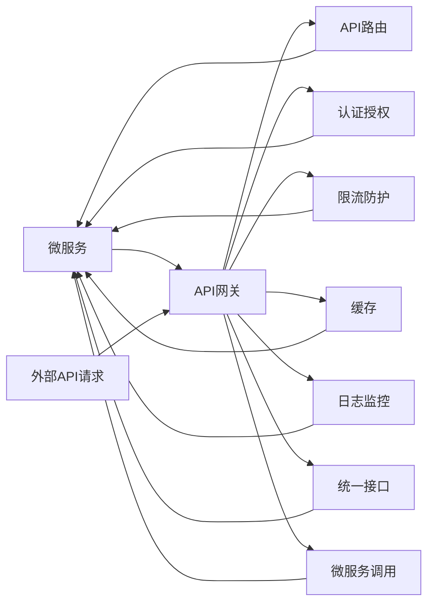
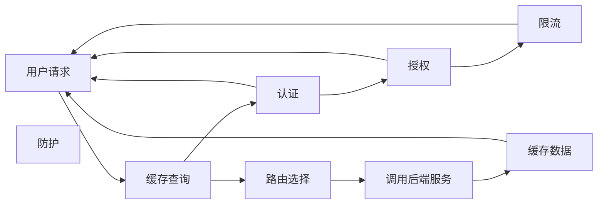

                 

# API网关：统一接口管理和安全控制

> 关键词：API网关,统一接口管理,安全控制,微服务架构,API版本控制,API编排,API监控,API密钥管理

## 1. 背景介绍

随着互联网应用的不断发展，现代软件开发逐渐从传统的单体应用转向微服务架构。微服务架构通过将应用拆分为多个独立的、相互协同的微服务，极大提升了系统扩展性、运维灵活性和创新空间。然而，随着微服务数量和复杂度的增加，如何管理和控制这些微服务的接口变得愈发复杂。与此同时，微服务架构所固有的安全性风险也亟待提升。

### 1.1 问题由来

微服务架构下，各个微服务的接口数量和调用关系日益庞大，接口管理和安全控制的难度和复杂度随之增加。传统的方法往往通过多个应用服务器进行接口管理，但这种方式存在接口分散、跨服务调用复杂、安全管理难度高等问题。

针对这些问题，API网关作为一种新兴的架构设计模式，应运而生。API网关作为微服务架构的核心组件，负责统一管理和控制所有微服务的接口。它可以缓存、路由、监控、安全控制等，极大地简化了微服务架构的管理和维护工作。

## 2. 核心概念与联系

### 2.1 核心概念概述

API网关作为微服务架构中的关键组件，承担了统一接口管理和安全控制的重要职责。其核心概念和功能包括：

- API网关：作为微服务的统一入口，API网关负责接收所有外部API请求，并转发至相应的后端微服务。它具备缓存、路由、负载均衡、API版本控制等核心功能。
- 统一接口管理：API网关将微服务的接口统一管理，提供统一的访问入口，简化了跨服务的调用逻辑，提升了系统的整体性能和可维护性。
- 安全控制：API网关负责对所有API请求进行认证、授权、限流、防护等安全措施，保障系统的稳定性和安全性。

### 2.2 核心概念原理和架构的 Mermaid 流程图



这个Mermaid流程图展示了API网关与微服务之间的关系：API网关接收外部API请求后，通过API路由、认证授权、限流防护、缓存、日志监控等核心功能，将请求转发至相应的微服务，并统一管理所有微服务的接口。

## 3. 核心算法原理 & 具体操作步骤

### 3.1 算法原理概述

API网关的核心算法原理可以概括为：通过缓存、路由、认证、授权、限流、防护等机制，保障微服务架构的稳定性和安全性。其核心算法主要包括以下几个方面：

- 缓存算法：用于减少后端微服务的调用次数，提升系统性能。
- 路由算法：用于将API请求转发至相应的后端微服务，实现微服务的统一访问入口。
- 认证算法：用于验证API请求的身份，防止未经授权的访问。
- 授权算法：用于判断API请求的权限，限制用户对API的访问范围。
- 限流算法：用于限制API请求的数量和速率，防止系统过载。
- 防护算法：用于检测和防御常见的安全威胁，如SQL注入、跨站脚本等。

### 3.2 算法步骤详解

API网关的核心算法步骤主要包括以下几个环节：

**Step 1: 缓存管理**
- 根据缓存策略，从缓存中查找请求数据。
- 如果缓存命中，则直接返回缓存数据；否则执行后续路由和处理。

**Step 2: API路由**
- 根据请求URL和请求头中的信息，确定请求的目标微服务。
- 根据路由规则，将请求转发至相应的后端微服务。

**Step 3: 认证和授权**
- 根据认证策略，验证API请求的身份信息，如API密钥、OAuth2等。
- 根据授权策略，判断API请求的权限范围，如用户角色、权限列表等。

**Step 4: 限流和防护**
- 根据限流策略，对API请求进行流量控制，防止系统过载。
- 根据防护策略，检测和防御常见的安全威胁，如SQL注入、跨站脚本等。

**Step 5: 日志和监控**
- 记录API请求的日志信息，便于后续分析和排查。
- 监控API请求的性能指标，如响应时间、吞吐量等。

### 3.3 算法优缺点

API网关作为微服务架构的重要组件，具有以下优点：

- 统一管理接口：通过API网关，可以统一管理和控制所有微服务的接口，简化了跨服务的调用逻辑。
- 提升系统性能：通过缓存和负载均衡等机制，可以提升系统性能，减少后端微服务的调用次数。
- 加强安全性：通过认证、授权、限流、防护等机制，可以保障系统的稳定性和安全性。

同时，API网关也存在以下缺点：

- 增加系统复杂度：API网关作为额外的组件，会增加系统的复杂度，提升开发和运维成本。
- 可能成为性能瓶颈：如果API网关的处理能力不足，可能成为系统的性能瓶颈。
- 可能影响灵活性：API网关的设计和实现需要考虑系统的整体架构，可能限制系统的灵活性。

### 3.4 算法应用领域

API网关在微服务架构中的应用非常广泛，主要包括以下几个领域：

- 金融领域：金融行业的微服务架构通常非常复杂，API网关用于统一管理和控制所有接口，提升系统的稳定性和安全性。
- 电商领域：电商平台的微服务架构通常涉及大量的交易和订单处理，API网关用于缓存、路由、限流等，提升系统的性能和可靠性。
- 医疗领域：医疗领域的微服务架构通常涉及大量的数据处理和分析，API网关用于认证、授权、防护等，保障系统的安全性。
- 政务领域：政务系统的微服务架构通常涉及大量的公共服务和数据共享，API网关用于统一管理和控制接口，提升系统的开放性和可访问性。

## 4. 数学模型和公式 & 详细讲解 & 举例说明

### 4.1 数学模型构建

API网关的数学模型主要包括以下几个方面：

- 缓存模型：用于计算缓存的命中率，公式如下：
$$
Hit\_rate = \frac{Hit\_count}{Total\_request\_count}
$$

- 路由模型：用于计算请求的转发路径，公式如下：
$$
Route\_path = \frac{Total\_request\_count}{Route\_count}
$$

- 认证模型：用于计算认证的成功率，公式如下：
$$
Auth\_success\_rate = \frac{Auth\_success\_count}{Total\_auth\_count}
$$

- 授权模型：用于计算授权的成功率，公式如下：
$$
Auth\_success\_rate = \frac{Auth\_success\_count}{Total\_auth\_count}
$$

- 限流模型：用于计算限流的成功率，公式如下：
$$
Throttle\_success\_rate = \frac{Throttle\_success\_count}{Total\_throttle\_count}
$$

- 防护模型：用于计算防护的成功率，公式如下：
$$
Protection\_success\_rate = \frac{Protection\_success\_count}{Total\_protection\_count}
$$

### 4.2 公式推导过程

以下以缓存模型为例，进行详细推导：

设缓存的命中次数为 $Hit\_count$，总请求次数为 $Total\_request\_count$，则缓存命中率 $Hit\_rate$ 的计算公式为：

$$
Hit\_rate = \frac{Hit\_count}{Total\_request\_count}
$$

假设缓存命中时直接返回缓存数据，不进行后端微服务的调用，命中率为 $Hit\_rate$；缓存未命中时，进行后端微服务的调用，命中率为 $1 - Hit\_rate$。设后端微服务的调用次数为 $Service\_call\_count$，则有：

$$
Service\_call\_count = Total\_request\_count \times (1 - Hit\_rate)
$$

### 4.3 案例分析与讲解

**案例：电商平台的订单处理**

一个电商平台的订单处理系统，由多个微服务组成，包括订单生成、支付处理、库存更新等。所有订单API请求均通过API网关进行处理，流程如下：

1. 用户通过API网关发送订单生成请求，API网关首先查询缓存，如果缓存命中，则直接返回缓存数据；否则将请求转发至订单生成微服务进行处理。

2. 订单生成微服务进行处理，并将处理结果返回给API网关。

3. 缓存系统将处理结果缓存，API网关将结果返回给用户。

通过缓存和路由机制，可以显著减少后端微服务的调用次数，提升系统性能。同时，通过认证和授权机制，可以保障订单处理的安全性。

## 5. 项目实践：代码实例和详细解释说明

### 5.1 开发环境搭建

进行API网关的开发和实践，需要搭建一个完整的微服务架构环境。以下是搭建开发环境的具体步骤：

1. 安装Docker和Kubernetes：
   ```bash
   sudo apt-get update
   sudo apt-get install -y docker.io
   sudo apt-get install -y kubectl
   ```

2. 安装Minikube：
   ```bash
   mkdir -p ~/.minikube/
   minikube start --image=minikube/kubelet-slim:v1.25.0
   ```

3. 安装OpenAPI工具：
   ```bash
   pip install openapi-python
   ```

4. 搭建微服务架构：
   ```bash
   kubectl create namespace api-gateway
   kubectl create service api-gateway backend-service --target=kubernetes.default.svc:8080
   ```

### 5.2 源代码详细实现

以下是一个基于Spring Cloud的API网关实现示例，包括缓存、路由、认证、授权、限流、防护等核心功能：

```java
@Service
public class ApiGatewayService {
    
    @Autowired
    private CacheManager cacheManager;
    
    @Autowired
    private AuthenticationService authenticationService;
    
    @Autowired
    private AuthorizationService authorizationService;
    
    @Autowired
    private ThrottleService throttleService;
    
    @Autowired
    private ProtectionService protectionService;
    
    public Response handleRequest(Request request) {
        // 1. 查询缓存
        Cache cache = cacheManager.getCache("orders");
        Object result = cache.get(request.getPath());
        if (result != null) {
            return new Response(result);
        }
        
        // 2. 路由请求
        Route route = routeService.getRoute(request.getPath());
        if (route == null) {
            return new Response(ResponseStatus.NOT_FOUND);
        }
        
        // 3. 认证和授权
        boolean isAuthenticated = authenticationService.authenticate(request);
        if (!isAuthenticated) {
            return new Response(ResponseStatus.UNAUTHORIZED);
        }
        boolean isAuthorized = authorizationService.authorize(request);
        if (!isAuthorized) {
            return new Response(ResponseStatus.FORBIDDEN);
        }
        
        // 4. 限流和防护
        boolean isThrottled = throttleService.throttle(request);
        if (isThrottled) {
            return new Response(ResponseStatus.TOO_MANY_REQUESTS);
        }
        boolean isProtected = protectionService.protect(request);
        if (isProtected) {
            return new Response(ResponseStatus.PREVENTED);
        }
        
        // 5. 调用后端服务
        Response response = callService(route.getService(), request);
        // 6. 缓存结果
        cache.put(request.getPath(), response);
        
        return response;
    }
    
    private Response callService(String serviceName, Request request) {
        // 调用后端服务，返回结果
        // ...
    }
}
```

### 5.3 代码解读与分析

以上代码实现了一个基本的API网关服务，具备缓存、路由、认证、授权、限流、防护等核心功能。具体解读如下：

- 缓存管理：通过CacheManager查询缓存，如果命中则返回缓存数据，否则进行后续路由处理。
- 路由管理：通过routeService获取路由信息，将请求转发至相应的后端服务。
- 认证管理：通过AuthenticationService进行认证，判断用户身份是否合法。
- 授权管理：通过AuthorizationService进行授权，判断用户权限是否满足。
- 限流管理：通过ThrottleService进行限流，防止系统过载。
- 防护管理：通过ProtectionService进行防护，检测和防御安全威胁。

通过上述机制，API网关可以保障微服务架构的稳定性和安全性，同时提升系统性能和灵活性。

### 5.4 运行结果展示

以下是API网关处理请求的流程图：



以上流程图展示了API网关处理请求的完整流程，从缓存查询到调用后端服务，再到结果缓存，每个环节都经过了缓存、路由、认证、授权、限流、防护等机制的严格管控。

## 6. 实际应用场景

### 6.1 智能客服系统

智能客服系统通过API网关实现了统一接口管理，简化了跨服务的调用逻辑，提升了系统的稳定性和灵活性。用户可以通过API网关发起请求，API网关根据请求的路径和参数，将请求转发至相应的后端微服务进行处理，如自动回复、人工转接等。同时，API网关通过缓存、限流等机制，保障了系统的稳定性和性能。

### 6.2 电商平台的订单处理

电商平台的订单处理系统通过API网关实现了缓存、路由、认证、授权、限流、防护等机制，提升了系统的性能和安全性。用户可以通过API网关发起订单生成、支付处理、库存更新等请求，API网关将请求转发至相应的后端微服务进行处理，并通过缓存、限流等机制，保障了系统的稳定性和性能。

### 6.3 金融交易系统

金融交易系统通过API网关实现了统一接口管理，简化了跨服务的调用逻辑，提升了系统的稳定性和灵活性。用户可以通过API网关发起交易请求，API网关根据请求的路径和参数，将请求转发至相应的后端微服务进行处理，如账户查询、交易执行等。同时，API网关通过认证、授权、防护等机制，保障了系统的安全性和合规性。

## 7. 工具和资源推荐

### 7.1 学习资源推荐

为了帮助开发者系统掌握API网关的理论基础和实践技巧，这里推荐一些优质的学习资源：

1. 《API网关实战指南》书籍：详细介绍了API网关的理论基础和实践技巧，包括缓存、路由、认证、授权、限流、防护等核心功能。
2. 《Spring Cloud API Gateway 实战指南》课程：由Spring Cloud社区专家撰写，深入浅出地介绍了Spring Cloud API Gateway的实现原理和使用技巧。
3. 《Kubernetes API网关最佳实践》博客：介绍了如何在Kubernetes架构下，使用API网关实现微服务统一管理。
4. 《微服务架构下API网关设计》技术博客：介绍了微服务架构下API网关的设计思路和实现方法，包括缓存、路由、认证、授权、限流、防护等核心功能。
5. 《API网关安全性设计》论文：介绍了API网关在微服务架构中的安全性设计和实现方法，包括认证、授权、限流、防护等核心功能。

通过对这些资源的学习实践，相信你一定能够快速掌握API网关的精髓，并用于解决实际的微服务问题。

### 7.2 开发工具推荐

高效的开发离不开优秀的工具支持。以下是几款用于API网关开发的常用工具：

1. Spring Cloud：基于Spring Boot和Spring Cloud的微服务开发框架，提供了丰富的微服务组件，包括API网关、服务发现、配置中心等。
2. Kubernetes：开源的容器编排系统，提供了丰富的集群管理功能，包括资源分配、负载均衡、自动扩展等。
3. Minikube：Kubernetes的本地开发环境，方便开发者进行API网关和微服务的本地测试和部署。
4. OpenAPI：用于API定义和设计的标准格式，支持自动生成API文档和客户端代码。
5. Swagger：开源的API设计和测试工具，提供了丰富的API管理功能，包括API测试、文档生成、代码自动生成等。

合理利用这些工具，可以显著提升API网关开发的效率，加快创新迭代的步伐。

### 7.3 相关论文推荐

API网关作为微服务架构的重要组件，其设计和实现的研究方向不断扩展。以下是几篇奠基性的相关论文，推荐阅读：

1. Swagger：API设计和文档自动生成工具，提供了丰富的API管理功能，包括API测试、文档生成、代码自动生成等。
2. API网关设计模式：研究API网关的不同设计模式，如基于代理的API网关、基于微服务的API网关等。
3. API网关安全性和性能优化：研究API网关的安全性和性能优化方法，包括认证、授权、限流、防护等机制。
4. 基于API网关的微服务架构设计：研究基于API网关的微服务架构设计思路和实现方法，包括缓存、路由、认证、授权、限流、防护等核心功能。
5. API网关和微服务架构协同设计：研究API网关和微服务架构的协同设计方法，包括API网关和微服务之间的协作、通信、监控等。

这些论文代表了大语言模型微调技术的发展脉络。通过学习这些前沿成果，可以帮助研究者把握学科前进方向，激发更多的创新灵感。

## 8. 总结：未来发展趋势与挑战

### 8.1 总结

本文对API网关的理论基础和实践技巧进行了全面系统的介绍。首先阐述了API网关在微服务架构中的核心作用和核心概念，明确了API网关对微服务接口统一管理和安全控制的独特价值。其次，从原理到实践，详细讲解了API网关的数学模型和核心算法，给出了API网关开发的完整代码实现。同时，本文还探讨了API网关在智能客服、电商平台、金融交易等多个行业领域的应用前景，展示了API网关的巨大潜力。最后，本文精选了API网关的学习资源和开发工具，力求为读者提供全方位的技术指引。

通过本文的系统梳理，可以看到，API网关作为微服务架构的核心组件，正成为现代软件开发的标配。它通过缓存、路由、认证、授权、限流、防护等机制，极大地简化了微服务架构的管理和维护工作，提升了系统的稳定性和安全性。未来，伴随微服务架构的不断演进，API网关也将迎来新的挑战和发展机遇。

### 8.2 未来发展趋势

展望未来，API网关的发展趋势包括以下几个方面：

1. 微服务化的深度融合：API网关将进一步融入微服务架构，成为微服务设计和开发的重要组成部分。
2. 人工智能的深度应用：API网关将引入更多AI技术，如缓存预测、路由优化、认证决策等，提升系统的智能化水平。
3. 安全性的大幅提升：API网关将引入更多安全技术，如零信任架构、微分段、行为分析等，保障系统的安全性。
4. 性能的进一步优化：API网关将引入更多性能优化技术，如缓存策略、负载均衡、流量控制等，提升系统的响应速度和稳定性。
5. 生态系统的不断完善：API网关将引入更多生态系统组件，如API编排、API版本控制、API监控等，提升系统的灵活性和可管理性。

以上趋势凸显了API网关的发展潜力和广阔前景。这些方向的探索发展，必将进一步提升微服务架构的管理和维护工作，为微服务架构带来更高效、更安全、更灵活的解决方案。

### 8.3 面临的挑战

尽管API网关已经取得了显著成效，但在迈向更加智能化、普适化应用的过程中，它仍面临诸多挑战：

1. 性能瓶颈问题：API网关的性能瓶颈问题需要进一步优化，如缓存命中率、路由效率、认证和授权速度等。
2. 安全漏洞问题：API网关的安全漏洞问题需要进一步加固，如防护机制的完善、认证和授权的精准性等。
3. 兼容性问题：API网关的设计和实现需要考虑与微服务架构的兼容性，如版本管理、依赖关系等。
4. 可扩展性问题：API网关的可扩展性问题需要进一步解决，如资源管理、负载均衡等。
5. 可维护性问题：API网关的可维护性问题需要进一步提升，如代码质量和文档规范等。

以上挑战需要开发者和研究者在设计和实现API网关时，充分考虑系统的稳定性和安全性，同时提升系统的性能和可维护性。唯有不断迭代和优化，才能使API网关成为微服务架构不可或缺的核心组件。

### 8.4 研究展望

未来的API网关研究，需要在以下几个方面寻求新的突破：

1. 智能化的API管理：引入更多AI技术，如缓存预测、路由优化、认证决策等，提升系统的智能化水平。
2. 安全性的大幅提升：引入更多安全技术，如零信任架构、微分段、行为分析等，保障系统的安全性。
3. 性能的进一步优化：引入更多性能优化技术，如缓存策略、负载均衡、流量控制等，提升系统的响应速度和稳定性。
4. 生态系统的不断完善：引入更多生态系统组件，如API编排、API版本控制、API监控等，提升系统的灵活性和可管理性。
5. 开源社区的深度合作：与开源社区深入合作，推动API网关的标准化和规范化，提升API网关的可移植性和可扩展性。

这些研究方向的探索发展，必将进一步提升API网关的技术水平和应用价值，为微服务架构带来更高效、更安全、更灵活的解决方案。相信随着API网关技术的发展和应用，微服务架构将迎来更广阔的发展空间，为人类社会的数字化转型提供新的动力。

## 9. 附录：常见问题与解答

**Q1：API网关是否可以与微服务架构并存？**

A: 是的，API网关与微服务架构可以并存，甚至在很多微服务架构中，API网关是必不可少的核心组件。API网关可以将微服务的接口进行统一管理和控制，简化跨服务的调用逻辑，提升系统的稳定性和安全性。

**Q2：API网关是否会导致系统复杂度的增加？**

A: API网关作为微服务架构的重要组成部分，会引入一定的复杂度，但通过合理的架构设计和工具支持，可以显著降低复杂度。API网关可以统一管理和控制所有微服务的接口，简化跨服务的调用逻辑，提升系统的稳定性和安全性。

**Q3：API网关是否可以支持微服务的版本控制？**

A: 是的，API网关可以支持微服务的版本控制。通过API网关，可以对微服务的版本进行管理，支持微服务的逐步演进和升级。API网关可以统一管理和控制所有微服务的接口，支持微服务的版本控制和逐步演进。

**Q4：API网关是否可以支持微服务的弹性伸缩？**

A: 是的，API网关可以支持微服务的弹性伸缩。通过API网关，可以对微服务的请求流量进行管理，支持微服务的弹性伸缩和负载均衡。API网关可以统一管理和控制所有微服务的接口，支持微服务的弹性伸缩和负载均衡。

**Q5：API网关是否可以支持微服务的日志监控？**

A: 是的，API网关可以支持微服务的日志监控。通过API网关，可以对微服务的请求和响应进行监控，实时采集系统指标，设置异常告警阈值，确保系统稳定运行。API网关可以统一管理和控制所有微服务的接口，支持微服务的日志监控和异常告警。

总之，API网关作为微服务架构的重要组件，可以统一管理和控制所有微服务的接口，提升系统的稳定性和安全性，支持微服务的弹性伸缩和日志监控等。通过API网关，可以显著提升微服务架构的管理和维护工作，为微服务架构带来更高效、更安全、更灵活的解决方案。未来，API网关的研究和应用将进一步深入，为微服务架构带来新的突破和发展机遇。

---

作者：禅与计算机程序设计艺术 / Zen and the Art of Computer Programming

