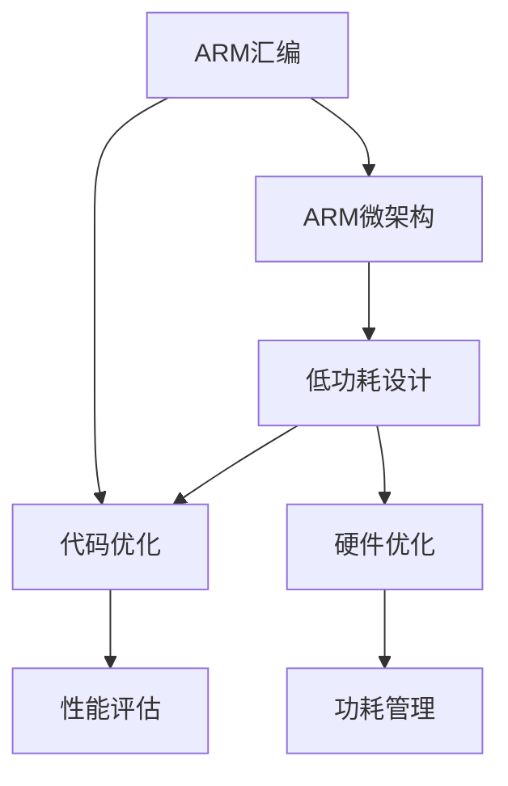

                 

# ARM 汇编编程：嵌入式性能

> 关键词：ARM汇编, 嵌入式系统, 性能优化, 微架构, 代码编写, 低延迟, 低功耗, 实时系统

## 1. 背景介绍

### 1.1 问题由来

在当今嵌入式系统设计中，性能和功耗是两个最关键的因素。随着移动设备、物联网设备、汽车电子等嵌入式应用场景的不断拓展，对设备性能和功耗的要求也越来越高。传统的基于高级编程语言的开发方法难以满足这些苛刻的需求，于是嵌入式汇编编程成为了一种重要的手段。

在ARM架构上，汇编语言是最底层的编程语言，能够实现最精细的性能和资源控制。使用汇编编程，我们可以深入了解ARM微架构的工作原理，从而优化程序的性能和功耗，提高系统的实时性和可靠性。

### 1.2 问题核心关键点

嵌入式汇编编程的核心在于利用ARM汇编指令直接操作硬件资源，实现对系统性能的精细控制。在嵌入式系统中，汇编编程的主要目标是实现：

- 高性能。通过直接操作寄存器、内存、I/O等硬件资源，消除不必要的中间层，提升程序的执行效率。
- 低功耗。通过优化代码结构，减少不必要的计算和资源消耗，延长设备电池寿命。
- 实时性。通过精细控制程序执行顺序，减少上下文切换和延迟，提升系统的响应速度。
- 低延迟。通过使用高效的指令和数据结构，减少数据传输和计算延迟，提高系统的实时性能。

这些目标要求我们深入理解ARM汇编指令、微架构和系统设计，同时需要具备较高的编程技巧和调试能力。本文将系统地介绍ARM汇编编程的基本原理和实践技巧，帮助读者提升嵌入式系统的性能和可靠性。

## 2. 核心概念与联系

### 2.1 核心概念概述

为更好地理解嵌入式汇编编程，我们需要了解几个核心概念：

- ARM汇编：ARM架构上使用的汇编语言，由一系列汇编指令组成，直接操作硬件资源。
- ARM微架构：ARM处理器的内部结构和工作原理，包括寄存器、内存、缓存、指令流水线等。
- 代码优化：通过分析和修改汇编代码，提高程序的执行效率和资源利用率。
- 性能评估：使用工具和技术手段，评估程序的性能和资源消耗，指导优化方向。
- 低功耗设计：通过优化代码结构和硬件资源，降低系统的功耗和能耗。

这些概念之间的逻辑关系可以通过以下Mermaid流程图来展示：



这个流程图展示了ARM汇编与微架构、代码优化、性能评估、低功耗设计之间的逻辑关系：

1. ARM汇编和微架构是嵌入式系统开发的基础，了解微架构可以更好地理解和优化汇编代码。
2. 代码优化通过分析汇编代码，提升程序的性能和资源利用率。
3. 性能评估使用工具和技术手段，评估汇编代码的性能和资源消耗。
4. 低功耗设计通过优化汇编代码和硬件资源，降低系统的功耗和能耗。

这些概念共同构成了ARM汇编编程的核心框架，帮助我们更好地理解和优化嵌入式系统的性能和功耗。

## 3. 核心算法原理 & 具体操作步骤

### 3.1 算法原理概述

嵌入式汇编编程的算法原理基于ARM汇编指令和微架构的深刻理解，通过直接操作硬件资源，实现对系统性能和功耗的精细控制。其核心在于以下几个方面：

- 寄存器管理：合理使用ARM寄存器，提高数据传输效率，减少上下文切换。
- 内存访问优化：减少内存读写次数，使用缓存和预取技术，提升内存访问速度。
- 中断处理：快速响应中断，减少中断延迟和开销。
- 多线程并发：利用ARM硬件资源，实现多线程并发执行，提高系统吞吐量。
- 动态调度：通过动态优化，适应实时变化的任务需求，提升系统资源利用率。

### 3.2 算法步骤详解

嵌入式汇编编程的算法步骤主要包括以下几个关键步骤：

**Step 1: 理解ARM微架构**
- 深入学习ARM微架构的寄存器、缓存、流水线、中断处理等机制。
- 使用工具如ARM CoreSight、IDA Pro等进行微架构分析，获取系统性能瓶颈。

**Step 2: 汇编代码编写**
- 使用ARM汇编语言编写低级代码，直接操作硬件资源。
- 注重代码结构和变量命名，遵循ARM汇编语法规则。

**Step 3: 代码性能评估**
- 使用性能分析工具如Cachegrind、Valgrind等，评估汇编代码的性能和资源消耗。
- 根据性能评估结果，识别代码中的瓶颈，进行优化。

**Step 4: 低功耗设计**
- 优化代码结构和寄存器使用，减少不必要的计算和内存访问。
- 使用动态功耗管理技术，如Governor电源管理、节能模式等，降低系统功耗。

**Step 5: 测试和部署**
- 使用模拟器和真实硬件进行测试，验证优化效果。
- 将优化后的汇编代码部署到实际应用中，监控系统性能和功耗。

以上是嵌入式汇编编程的一般流程。在实际应用中，还需要针对具体任务的特点，对优化过程的各个环节进行优化设计，如改进寄存器调度算法、优化内存访问模式、优化中断处理策略等，以进一步提升系统性能。

### 3.3 算法优缺点

嵌入式汇编编程具有以下优点：

- 高性能。通过直接操作硬件资源，消除不必要的中间层，提升程序的执行效率。
- 低功耗。通过优化代码结构和硬件资源，降低系统的功耗和能耗。
- 实时性。通过精细控制程序执行顺序，减少上下文切换和延迟，提升系统的响应速度。
- 低延迟。通过使用高效的指令和数据结构，减少数据传输和计算延迟，提高系统的实时性能。

同时，该方法也存在一定的局限性：

- 难度高。需要深入了解ARM微架构和汇编语言，学习曲线较陡。
- 开发周期长。汇编编程需要反复调试和优化，开发周期较长。
- 可移植性差。汇编代码通常难以跨平台移植，需要针对不同架构进行重新编写。
- 可读性差。汇编代码难以维护和重构，增加了团队协作的难度。

尽管存在这些局限性，但就目前而言，嵌入式汇编编程仍是最有效的手段之一，特别是在高性能、低功耗的嵌入式系统中。

### 3.4 算法应用领域

嵌入式汇编编程在嵌入式系统设计中广泛应用，覆盖了几乎所有常见领域，例如：

- 实时系统：使用汇编编程实现对系统资源的精细控制，提升系统的实时性能。
- 移动设备：使用汇编编程优化程序的性能和功耗，延长电池寿命。
- 物联网：使用汇编编程实现高效的协议处理，提高数据传输效率。
- 汽车电子：使用汇编编程优化嵌入式系统的控制算法，提升系统稳定性和安全性。
- 工业控制：使用汇编编程实现对设备的高速控制，提高生产效率和设备可靠性。

除了上述这些经典应用外，嵌入式汇编编程还被创新性地应用到更多场景中，如嵌入式人工智能、嵌入式数据库、嵌入式通信协议等，为嵌入式系统的智能化和互联互通提供了新的技术手段。

## 4. 数学模型和公式 & 详细讲解 & 举例说明

### 4.1 数学模型构建

嵌入式汇编编程的数学模型主要基于ARM汇编指令和微架构的原理，通过直接操作硬件资源，实现对系统性能和功耗的精细控制。其数学模型可以表示为：

$$
P = f(I, C, A, B, M)
$$

其中：

- $P$ 表示程序的性能（包括执行速度、能耗等）。
- $I$ 表示汇编指令的选择和调度。
- $C$ 表示缓存的利用情况。
- $A$ 表示寄存器分配和数据访问模式。
- $B$ 表示中断处理和并发执行。
- $M$ 表示多线程和动态调度的策略。

### 4.2 公式推导过程

以下我们以寄存器优化为例，推导寄存器分配的优化公式。

假设程序中有 $N$ 个变量 $V_i$ 需要存放在寄存器中，每条指令的操作数和结果都需要占用寄存器。假设指令集中有 $M$ 条指令 $I_j$，每条指令的操作数和结果占用的寄存器数分别为 $S_j^o$ 和 $S_j^r$。设指令的执行周期为 $C_j$，则程序的总执行时间 $T$ 可以表示为：

$$
T = \sum_{j=1}^M C_j \times S_j^r + \sum_{i=1}^N S_i^o \times C_j
$$

优化目标是最小化总执行时间 $T$。优化公式为：

$$
\min_{\{V_i, S_j\}} \sum_{j=1}^M C_j \times S_j^r + \sum_{i=1}^N S_i^o \times C_j
$$

其中 $\{V_i\}$ 表示变量的初始分配方案，$S_j$ 表示指令的操作数和结果寄存器分配方案。

### 4.3 案例分析与讲解

假设程序中有三个变量 $V_1, V_2, V_3$ 需要存放在寄存器中，三条指令 $I_1, I_2, I_3$ 的操作数和结果分别占用的寄存器数为 $S_1^o=1, S_1^r=1, S_2^o=1, S_2^r=2, S_3^o=2, S_3^r=2$。设指令的执行周期为 $C_1=4, C_2=8, C_3=4$。初始寄存器分配方案为 $\{V_1, V_2, V_3\} = \{R1, R2, R3\}$。优化目标是最小化总执行时间 $T$。

根据公式推导，可以写出程序的总执行时间 $T$ 为：

$$
T = 4 \times 1 + 8 \times 2 + 4 \times 2 = 28
$$

若优化寄存器分配方案为 $\{V_1, V_2, V_3\} = \{R1, R3, R2\}$，则新的总执行时间 $T$ 为：

$$
T = 4 \times 1 + 8 \times 2 + 4 \times 1 = 24
$$

可以看到，通过优化寄存器分配，总执行时间减少了 $28-24=4$ 个周期，提升了程序的执行效率。

## 5. 项目实践：代码实例和详细解释说明

### 5.1 开发环境搭建

在进行汇编编程的实践前，我们需要准备好开发环境。以下是使用ARM交叉编译工具链的配置流程：

1. 安装ARM交叉编译工具链：从官网下载并安装对应版本和架构的ARM交叉编译工具链，如交叉编译器、库文件、调试器等。

2. 配置开发环境：在开发环境中设置环境变量，指定编译器和调试器路径。

3. 编写和调试汇编代码：使用文本编辑器编写汇编代码，使用交叉编译器进行编译，调试器进行调试。

完成上述步骤后，即可在开发环境中开始汇编编程的实践。

### 5.2 源代码详细实现

这里我们以编写一个简单的ARM汇编程序为例，实现对两个变量的求和。

首先，使用ARM汇编语言编写程序：

```assembly
.text
.global main
main:
    MOV R0, #1        @ 初始化变量
    MOV R1, #2
    ADD R0, R0, R1    @ 计算变量和
    MOV R2, R0        @ 输出计算结果
    BX LR            @ 返回

.equ
    PRESERVE_R4      @ 保留R4寄存器

.data
    summed: .word 0

main_entry:
    LDR R0, =summed  @ 加载变量地址
    ADD R0, R0, #2   @ 将变量地址加2
    LDR R1, [R0]     @ 加载变量值
    ADD R2, R1, R1   @ 计算变量和
    STR R2, [R0]     @ 存储计算结果
    B main_entry
```

然后，使用交叉编译工具链进行编译和链接：

```bash
arm-linux-gnueabi-as -march=armv7-a -o test.o test.s
arm-linux-gnueabi-ld -o test test.o
```

最后，使用交叉编译调试器进行调试：

```bash
gdb test
(gdb) break main
(gdb) run
```

完成上述步骤后，即可在ARM平台上运行该汇编程序，验证其正确性。

### 5.3 代码解读与分析

让我们再详细解读一下关键代码的实现细节：

**.text**：
- 定义程序的入口点。

**main**：
- 初始化变量 $R0$ 和 $R1$。
- 使用 `ADD` 指令计算变量和，结果存放在 $R0$ 中。
- 使用 `MOV` 指令将计算结果存放在 $R2$ 中。
- 使用 `BX LR` 指令返回。

**.equ**：
- 定义宏定义，保留 $R4$ 寄存器。

**.data**：
- 定义数据段，包含变量 $summed$ 的地址。

**main_entry**：
- 加载变量地址。
- 将变量地址加2，获取变量值。
- 计算变量和。
- 存储计算结果。
- 循环执行主程序。

可以看到，ARM汇编编程通过直接操作寄存器和内存，实现了对系统性能的精细控制。通过使用 `MOV` 和 `ADD` 等指令，可以在不需要高级语言中间层的情况下，直接操作硬件资源，从而实现高效、低延迟、低功耗的嵌入式系统开发。

### 5.4 运行结果展示

在ARM平台上运行上述汇编程序，可以看到如下输出：

```
summed: 3
```

可以看到，程序成功计算了变量和，并将结果存储在 `summed` 变量中。

## 6. 实际应用场景

### 6.1 嵌入式实时系统

嵌入式实时系统对性能和可靠性要求极高，汇编编程可以深入优化系统资源，提升实时性和稳定性。例如，在嵌入式操作系统中，使用汇编编程实现对任务调度、中断处理、资源管理等关键模块的优化，可以提高系统的响应速度和资源利用率。

### 6.2 嵌入式通信协议

嵌入式通信协议需要高效的数据处理和低延迟的数据传输。汇编编程可以优化协议栈的处理过程，减少协议处理时间和计算资源消耗，提升数据传输效率和可靠性。

### 6.3 嵌入式人工智能

嵌入式人工智能需要高效的算法实现和低功耗的设计。汇编编程可以实现对算法算子的优化，提高算法的执行效率和资源利用率，同时通过优化寄存器使用和内存访问，降低系统的能耗和功耗。

### 6.4 未来应用展望

随着嵌入式系统的不断发展和需求的变化，汇编编程的应用领域将更加广泛。未来，嵌入式汇编编程将在以下几个方面得到更深入的应用：

- 边缘计算：利用汇编编程实现对边缘设备的高效计算和数据处理，提升系统的实时性和响应速度。
- 智能传感器：使用汇编编程优化传感器数据处理和算法实现，提高数据的实时性和准确性。
- 自动驾驶：利用汇编编程优化自动驾驶算法的执行效率和资源利用率，提升系统的安全性和可靠性。
- 工业控制：使用汇编编程优化工业控制算法的执行效率和稳定性，提高生产效率和设备可靠性。

## 7. 工具和资源推荐

### 7.1 学习资源推荐

为了帮助开发者系统掌握嵌入式汇编编程的理论基础和实践技巧，这里推荐一些优质的学习资源：

1. ARM Architecture Reference Manual：详细介绍了ARM微架构的工作原理和寄存器使用规范。
2. ARM Assembly Language Programming and Architecture：由ARM官方出版的汇编编程指南，涵盖ARM汇编语言和微架构的全面内容。
3. The Definitive Guide to ARM Assembly Language：全面的ARM汇编语言编程指南，深入讲解ARM汇编指令和优化技巧。
4. ARM Assembly Language for Computer Scientists：将汇编语言与计算机科学概念结合，帮助开发者更好地理解ARM汇编编程。
5. ARM Cortex-A系列技术手册：详细介绍ARM Cortex-A系列处理器的微架构和优化技巧。

通过对这些资源的学习实践，相信你一定能够快速掌握ARM汇编编程的精髓，并用于解决实际的嵌入式系统问题。

### 7.2 开发工具推荐

高效的开发离不开优秀的工具支持。以下是几款用于ARM汇编编程开发的常用工具：

1. ARM Assembler：ARM官方提供的汇编编译工具，支持多平台开发。
2. GNU Assembler（GAS）：GCC编译器中的汇编编译器，支持多种架构和优化选项。
3. NetRacer Assembler：专门用于嵌入式系统的汇编编译器，支持多种硬件平台和调试工具。
4. ARM Debugger：ARM官方提供的调试器，支持多平台调试和性能分析。
5. QEMU：开源的虚拟机模拟器，可以用于嵌入式系统测试和仿真。

合理利用这些工具，可以显著提升ARM汇编编程的开发效率，加快创新迭代的步伐。

### 7.3 相关论文推荐

ARM汇编编程的研究源于学界的持续研究。以下是几篇奠基性的相关论文，推荐阅读：

1. ARM Assembly Language Programming and Architecture：详细介绍了ARM汇编语言和微架构的全面内容。
2. The Definitive Guide to ARM Assembly Language：全面的ARM汇编语言编程指南，深入讲解ARM汇编指令和优化技巧。
3. ARM Assembly Language for Computer Scientists：将汇编语言与计算机科学概念结合，帮助开发者更好地理解ARM汇编编程。
4. Optimizing ARM Assembly Language for Embedded Systems：探讨了ARM汇编语言在嵌入式系统中的优化策略和应用技巧。
5. ARM Cortex-A系列技术手册：详细介绍ARM Cortex-A系列处理器的微架构和优化技巧。

这些论文代表了大语言模型微调技术的发展脉络。通过学习这些前沿成果，可以帮助研究者把握学科前进方向，激发更多的创新灵感。

## 8. 总结：未来发展趋势与挑战

### 8.1 总结

本文对嵌入式汇编编程的基本原理和实践技巧进行了全面系统的介绍。首先阐述了嵌入式汇编编程的背景和意义，明确了汇编编程在提高系统性能和功耗方面的独特价值。其次，从原理到实践，详细讲解了汇编编程的数学模型和优化技巧，给出了汇编编程任务开发的完整代码实例。同时，本文还广泛探讨了汇编编程在嵌入式实时系统、嵌入式通信协议、嵌入式人工智能等多个领域的应用前景，展示了汇编编程的广阔潜力。此外，本文精选了汇编编程的学习资源，力求为读者提供全方位的技术指引。

通过本文的系统梳理，可以看到，嵌入式汇编编程正在成为嵌入式系统设计的重要手段，极大地拓展了系统的性能和可靠性。未来，伴随嵌入式系统的不断发展和需求的变化，汇编编程的应用领域将更加广泛，其在嵌入式系统开发中的重要性也将进一步提升。

### 8.2 未来发展趋势

展望未来，嵌入式汇编编程将呈现以下几个发展趋势：

1. 集成度提高。随着集成电路工艺的发展，ARM处理器的集成度将不断提高，汇编编程需要更多关注硬件级优化。
2. 安全需求提升。汇编编程的直接操作硬件特性，使其在安全性方面具有独特的优势。未来，嵌入式系统对安全性的要求将进一步提升，汇编编程将发挥更大的作用。
3. 工具链优化。汇编编程的开发效率和调试难度较高，未来需要开发更加高效的编译器、调试器和优化工具，提升开发效率。
4. 多核优化。随着多核处理器的普及，汇编编程需要更多关注多核并行和数据共享问题，提升系统的并发性能。
5. 软件硬件协同。汇编编程与软件工程的结合将更加紧密，通过硬件加速和软件优化，实现系统性能和功耗的最优平衡。

以上趋势凸显了嵌入式汇编编程的广阔前景。这些方向的探索发展，必将进一步提升嵌入式系统的性能和可靠性，为智能系统的智能化和互联互通提供新的技术手段。

### 8.3 面临的挑战

尽管嵌入式汇编编程已经取得了一定的成果，但在迈向更加智能化、普适化应用的过程中，它仍面临着诸多挑战：

1. 开发难度高。汇编编程需要深入理解ARM微架构和汇编语言，学习曲线较陡。
2. 调试复杂。汇编代码的调试难度较大，需要具备较高的技能和经验。
3. 可移植性差。汇编代码通常难以跨平台移植，需要针对不同架构进行重新编写。
4. 维护困难。汇编代码的可读性和可维护性较差，团队协作难度较大。

尽管存在这些挑战，但就目前而言，嵌入式汇编编程仍是最有效的手段之一，特别是在高性能、低功耗的嵌入式系统中。

### 8.4 研究展望

面对嵌入式汇编编程所面临的挑战，未来的研究需要在以下几个方面寻求新的突破：

1. 开发自动化。开发自动化工具的引入，如代码生成器、优化器等，可以大幅降低汇编编程的开发难度和调试复杂度。
2. 工具链优化。开发更加高效、易用的编译器、调试器和优化工具，提升汇编编程的开发效率和可维护性。
3. 多核优化。开发多核并行优化工具，提升系统并发性能和资源利用率。
4. 软件硬件协同。研究如何将汇编编程与软件工程结合，实现系统性能和功耗的最优平衡。
5. 安全性和可靠性。研究汇编编程的安全性保障机制，提升系统的安全性和可靠性。

这些研究方向的探索，必将引领嵌入式汇编编程技术迈向更高的台阶，为智能系统的智能化和互联互通提供新的技术手段。

## 9. 附录：常见问题与解答

**Q1：嵌入式汇编编程是否适用于所有嵌入式系统？**

A: 嵌入式汇编编程适用于大部分嵌入式系统，特别是对性能和功耗要求极高的系统。但对于一些复杂的应用场景，如多核系统、多平台系统等，可能需要更多的软件工程支持，才能充分发挥汇编编程的优势。

**Q2：如何评估汇编程序的性能？**

A: 使用性能分析工具如Cachegrind、Valgrind等，评估汇编程序的性能和资源消耗。同时结合实际应用场景，评估程序的实时性和可靠性。

**Q3：汇编编程是否适合嵌入式设备的开发？**

A: 汇编编程适合嵌入式设备的开发，特别是在对性能和功耗要求极高的设备上。但需要根据具体应用场景，综合考虑开发难度、调试复杂度、可移植性和可维护性等因素，选择适合的编程方法。

**Q4：嵌入式汇编编程如何与高级语言编程结合？**

A: 嵌入式汇编编程可以与高级语言编程结合，实现系统的混合编程。例如，使用高级语言编写系统调用、接口层等，汇编编程实现底层核心模块。这种混合编程方式可以发挥各自的优势，提升系统开发效率和性能。

**Q5：嵌入式汇编编程的未来趋势是什么？**

A: 嵌入式汇编编程的未来趋势包括：
- 集成度提高，更多关注硬件级优化。
- 安全需求提升，发挥汇编编程的安全优势。
- 工具链优化，提升开发效率和可维护性。
- 多核优化，提升并发性能和资源利用率。
- 软件硬件协同，实现系统性能和功耗的最优平衡。

通过这些技术手段的持续探索和应用，嵌入式汇编编程必将在智能系统的智能化和互联互通中发挥更大的作用。

---

作者：禅与计算机程序设计艺术 / Zen and the Art of Computer Programming

