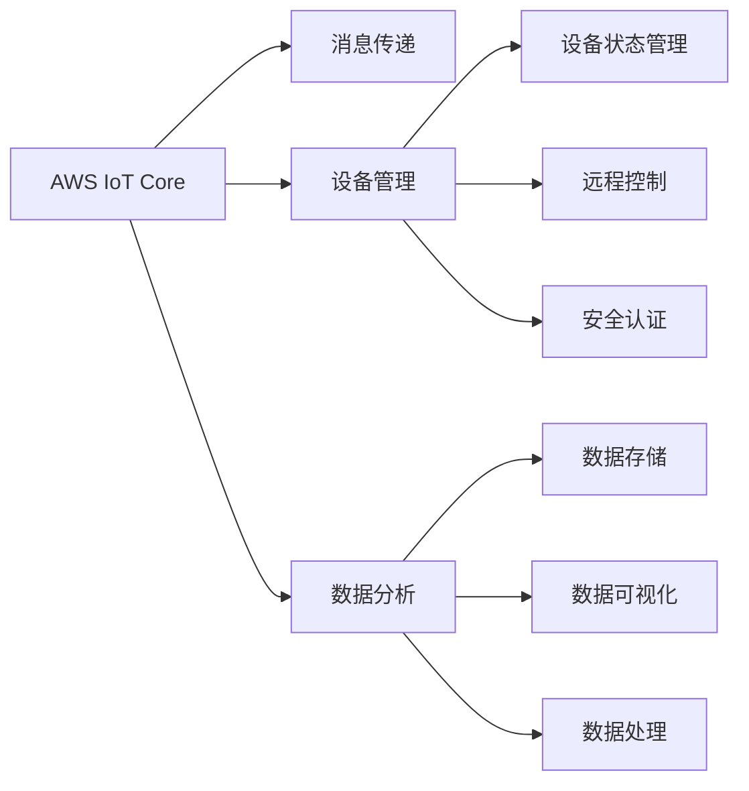

                 

# AWS IoT 核心：管理 IoT 设备

> 关键词：AWS IoT, IoT设备管理, 物联网, 云平台, 数据可视化

## 1. 背景介绍

### 1.1 问题由来

随着物联网（IoT）技术的快速发展，越来越多的设备接入到了互联网上。这些设备包括智能家居、工业设备、车辆等，它们通过网络实时传输数据，为各种应用场景提供了大量的原始数据。然而，这些设备往往具有高度分散、异构、异质等特点，使得它们的管理和维护变得非常复杂。

亚马逊公司推出的AWS IoT（Amazon Web Services IoT）云平台，提供了一站式的解决方案，帮助用户轻松管理和优化IoT设备。AWS IoT平台整合了云、设备、应用和数据，为用户提供了一种简单、高效的方式来构建和管理IoT设备网络。

### 1.2 问题核心关键点

AWS IoT平台的核心在于其提供的设备连接管理、数据流处理和设备管理功能，使得用户可以轻松地构建、配置和管理IoT设备，同时也可以快速获取设备数据，实现更高效的业务决策和自动化控制。AWS IoT的主要功能包括：

1. **设备连接管理**：AWS IoT Core帮助用户管理和连接多个设备，自动处理设备的连接和断开。
2. **消息传递**：AWS IoT Core提供了消息传递机制，使得不同设备之间的数据可以自动传输和存储。
3. **设备管理**：AWS IoT平台提供了设备的状态管理和远程控制功能，可以轻松对设备进行管理和控制。
4. **数据分析**：AWS IoT提供了数据存储、分析和可视化功能，帮助用户分析IoT数据，优化业务流程。

AWS IoT平台为用户提供了丰富的API和SDK，可以与多种编程语言和设备平台兼容，从而实现跨平台、跨设备的数据集成。

### 1.3 问题研究意义

AWS IoT平台通过提供一站式的IoT设备管理解决方案，大大简化了IoT设备的管理和维护工作。这不仅降低了企业的运营成本，还提升了业务的灵活性和可扩展性。同时，AWS IoT平台提供了强大的数据分析功能，可以帮助企业深入挖掘IoT数据，实现更智能的业务决策。

AWS IoT平台的成功应用，已经成为物联网领域的一个重要标杆，吸引了越来越多的企业加入IoT生态。基于AWS IoT平台的应用案例，已经覆盖了智能制造、智慧城市、智能家居等多个领域，推动了物联网技术的普及和发展。

## 2. 核心概念与联系

### 2.1 核心概念概述

为了更好地理解AWS IoT平台的核心功能和应用场景，本节将介绍几个密切相关的核心概念：

- **AWS IoT Core**：AWS IoT Core是AWS IoT平台的核心组件，负责设备连接管理和数据流处理。它支持设备的自动连接和断开，并通过消息队列将数据传递到云端。
- **消息传递**：AWS IoT Core使用消息队列来传递设备数据，支持设备之间、设备与云平台之间的数据传输。
- **设备管理**：AWS IoT平台提供了设备状态管理、远程控制、安全认证等功能，帮助用户管理和优化IoT设备。
- **数据分析**：AWS IoT平台提供了强大的数据分析功能，包括数据存储、可视化和处理，帮助用户从IoT数据中获取有价值的业务洞见。

这些核心概念之间的逻辑关系可以通过以下Mermaid流程图来展示：



这个流程图展示了AWS IoT平台的核心概念及其之间的关系：

1. AWS IoT Core作为平台的核心组件，负责设备连接管理和数据流处理。
2. 消息传递机制支持设备之间和设备与云平台之间的数据传输。
3. 设备管理功能包括设备状态管理、远程控制和安全认证。
4. 数据分析功能包括数据存储、可视化和处理。

这些核心概念共同构成了AWS IoT平台的功能框架，使其能够在各种场景下提供强大的IoT设备管理能力。通过理解这些核心概念，我们可以更好地把握AWS IoT平台的优势和应用方向。

## 3. 核心算法原理 & 具体操作步骤
### 3.1 算法原理概述

AWS IoT平台的核心算法原理主要涉及设备连接管理、数据流处理和设备管理。以下是这些算法的详细描述：

#### 3.1.1 设备连接管理

AWS IoT Core使用基于TLS（传输层安全协议）的安全连接，确保设备和云平台之间的数据传输安全。设备连接管理主要包括以下步骤：

1. **设备注册**：设备通过AWS IoT Core注册，并生成一个设备证书（Device Certificate）和设备密钥（Device Key）。
2. **设备连接**：设备使用设备证书和设备密钥连接到AWS IoT Core。
3. **数据传输**：设备将传感器数据通过消息队列发送到AWS IoT Core。
4. **设备断开**：设备完成任务后，自动断开与AWS IoT Core的连接。

#### 3.1.2 数据流处理

AWS IoT Core使用消息队列来传递设备数据，支持设备之间、设备与云平台之间的数据传输。数据流处理主要包括以下步骤：

1. **消息队列**：AWS IoT Core使用Kafka（可扩展的流处理平台）来存储和管理设备数据。
2. **消息订阅**：设备将传感器数据发送到AWS IoT Core的消息队列，并订阅其他设备的传感器数据。
3. **消息消费**：云平台应用程序可以订阅设备数据，并将其存储到数据仓库中。

#### 3.1.3 设备管理

AWS IoT平台提供了设备状态管理、远程控制、安全认证等功能，帮助用户管理和优化IoT设备。设备管理主要包括以下步骤：

1. **设备状态管理**：AWS IoT Core提供设备状态管理功能，可以监控设备的在线状态和状态变化。
2. **远程控制**：AWS IoT Core提供远程控制功能，可以通过API或SDK远程控制设备的开关、参数配置等操作。
3. **安全认证**：AWS IoT Core提供设备身份验证和安全认证功能，确保只有授权设备可以连接到IoT平台。

#### 3.1.4 数据分析

AWS IoT平台提供了强大的数据分析功能，包括数据存储、可视化和处理。数据分析主要包括以下步骤：

1. **数据存储**：AWS IoT Core将设备数据存储到Amazon S3、Amazon DynamoDB等云存储服务中。
2. **数据可视化**：AWS IoT平台提供CloudWatch仪表板和Jupyter Notebook等工具，帮助用户可视化IoT数据。
3. **数据处理**：AWS IoT平台提供Amazon Athena等数据处理服务，帮助用户分析和处理IoT数据。

### 3.2 算法步骤详解

#### 3.2.1 设备连接管理步骤详解

1. **设备注册**
   - 生成设备证书和设备密钥：使用Amazon IoT设备证书（X.509）生成器，生成设备证书和设备密钥。
   - 将设备证书和设备密钥上传到AWS IoT Core。
   ```python
   import boto3
   from botocore.exceptions import ClientError
   
   def generate_cert():
       try:
           client = boto3.client('iot')
           response = client.create_certificate_from_csr(
               certificate_signing_request='your_csr',
               set_as_default=True)
           return response['certificate']
       except ClientError as e:
           print(e)
   ```

2. **设备连接**
   - 安装AWS IoT SDK：在设备上安装AWS IoT SDK，实现与AWS IoT Core的连接。
   ```python
   import AWSIoTPythonSDK.MQTTLib
   client = AWSIoTPythonSDK.MQTTLib.AWSIoTMQTTClient('my-device-id')
   client.connect()
   ```

3. **数据传输**
   - 发送传感器数据到AWS IoT Core的消息队列：使用MQTT协议，将传感器数据发送到AWS IoT Core的消息队列。
   ```python
   client.publish(topic='your-topic', payload='your-sensor-data')
   ```

4. **设备断开**
   - 设备完成任务后，自动断开与AWS IoT Core的连接。
   ```python
   client.disconnect()
   ```

#### 3.2.2 数据流处理步骤详解

1. **消息队列**
   - 使用Amazon S3或Amazon DynamoDB存储设备数据：将设备数据存储到Amazon S3或Amazon DynamoDB中。
   ```python
   import boto3
   
   s3 = boto3.client('s3')
   s3.put_object(Bucket='your-bucket', Key='your-key', Body='your-data')
   ```

2. **消息订阅**
   - 在云平台应用程序中订阅设备数据：使用AWS IoT Core API或SDK，订阅设备数据。
   ```python
   import boto3
   
   client = boto3.client('iot-data')
   response = client.describe_topic('your-topic')
   for topic in response['topics']:
       if topic['topicArn'].endswith('/descriptions'):
           client.subscribe('your-topic')
   ```

3. **消息消费**
   - 云平台应用程序存储设备数据：将设备数据存储到Amazon S3、Amazon DynamoDB等云存储服务中。
   ```python
   import boto3
   
   s3 = boto3.client('s3')
   s3.put_object(Bucket='your-bucket', Key='your-key', Body='your-data')
   ```

#### 3.2.3 设备管理步骤详解

1. **设备状态管理**
   - 使用AWS IoT Core API查询设备状态：查询设备的状态和状态变化。
   ```python
   import boto3
   
   client = boto3.client('iot')
   response = client.describe_device_state('your-device-id')
   print(response['state'])
   ```

2. **远程控制**
   - 使用AWS IoT Core API远程控制设备：远程控制设备的开关、参数配置等操作。
   ```python
   import boto3
   
   client = boto3.client('iot')
   response = client.update_device_state('your-device-id', 'your-state', 'your-state-params')
   print(response['state'])
   ```

3. **安全认证**
   - 使用AWS IoT Core API进行设备身份验证：确保只有授权设备可以连接到IoT平台。
   ```python
   import boto3
   
   client = boto3.client('iot')
   response = client.create_certificate_from_csr(
       certificate_signing_request='your_csr',
       set_as_default=True)
   print(response['certificate'])
   ```

#### 3.2.4 数据分析步骤详解

1. **数据存储**
   - 将设备数据存储到Amazon S3、Amazon DynamoDB等云存储服务中：将设备数据存储到Amazon S3、Amazon DynamoDB等云存储服务中。
   ```python
   import boto3
   
   s3 = boto3.client('s3')
   s3.put_object(Bucket='your-bucket', Key='your-key', Body='your-data')
   ```

2. **数据可视化**
   - 使用Amazon CloudWatch仪表板或Jupyter Notebook可视化IoT数据：使用Amazon CloudWatch仪表板或Jupyter Notebook，可视化IoT数据。
   ```python
   import boto3
   
   client = boto3.client('cloudwatch')
   response = client.get_metric_data(
       Namespace='your-namespace',
       MetricDataQueries=[
           {
               'id': 'your-id',
               'metricStat': {
                   'metric': {
                       'namespace': 'your-namespace',
                       'dimensions': [
                           {
                               'name': 'your-dimension',
                               'value': 'your-value'
                           }
                       ],
                       'stat': 'your-stat',
                       'units': 'your-units',
                       'period': 'your-period'
                   },
                   'period': 'your-period'
               },
               'returnData': True
           }
       ]
   )
   ```

3. **数据处理**
   - 使用Amazon Athena处理IoT数据：使用Amazon Athena，处理IoT数据。
   ```python
   import boto3
   
   athena = boto3.client('athena')
   response = athena.start_query_execution(
       QueryString='your-query',
       Database='your-database',
       RoleArn='your-role-arn',
       WorkGroup='your-workgroup')
   print(response['QueryExecutionId'])
   ```

### 3.3 算法优缺点

#### 3.3.1 设备连接管理的优缺点

**优点**：

1. **安全性**：设备证书和设备密钥的使用，确保设备和云平台之间的数据传输安全。
2. **可扩展性**：支持大量设备的连接和数据传输。
3. **易用性**：设备连接管理简单，易于使用。

**缺点**：

1. **复杂性**：设备注册和连接流程较为复杂。
2. **延迟**：设备连接和断开可能会有一定的延迟。

#### 3.3.2 数据流处理的优缺点

**优点**：

1. **可靠性**：使用Amazon S3或Amazon DynamoDB等云存储服务，确保数据的可靠性和持久性。
2. **可扩展性**：支持大规模的数据存储和处理。
3. **灵活性**：支持多种数据格式的存储和处理。

**缺点**：

1. **成本**：使用云存储服务可能会带来较高的存储和处理成本。
2. **延迟**：数据传输和存储可能会有一定的延迟。

#### 3.3.3 设备管理的优缺点

**优点**：

1. **安全性**：设备身份验证和安全认证功能，确保只有授权设备可以连接到IoT平台。
2. **可扩展性**：支持大量设备的远程控制和管理。
3. **易用性**：设备状态管理和远程控制功能易于使用。

**缺点**：

1. **复杂性**：设备状态管理和远程控制的流程较为复杂。
2. **延迟**：远程控制可能会有一定的延迟。

#### 3.3.4 数据分析的优缺点

**优点**：

1. **灵活性**：使用Amazon CloudWatch仪表板或Jupyter Notebook，可视化IoT数据。
2. **可扩展性**：支持大规模数据的存储和处理。
3. **易用性**：数据存储和可视化功能易于使用。

**缺点**：

1. **成本**：使用云存储服务可能会带来较高的存储和处理成本。
2. **延迟**：数据存储和处理可能会有一定的延迟。

### 3.4 算法应用领域

AWS IoT平台在多个行业和应用领域中得到了广泛应用，以下是一些典型的应用场景：

1. **智能家居**：通过AWS IoT Core，智能家居设备可以实现自动连接、数据传输和远程控制。用户可以通过智能手机App或Web界面，轻松管理和控制家中的智能设备。

2. **工业物联网**：通过AWS IoT Core，工业设备可以实现自动连接、数据传输和远程控制。工业应用可以通过AWS IoT Core，实现设备状态监控、故障预测和远程维护。

3. **智能城市**：通过AWS IoT Core，智能城市设备可以实现自动连接、数据传输和远程控制。城市管理部门可以通过AWS IoT Core，实现城市基础设施的监控和管理。

4. **智慧医疗**：通过AWS IoT Core，智慧医疗设备可以实现自动连接、数据传输和远程控制。医疗机构可以通过AWS IoT Core，实现患者健康数据的监控和管理。

## 4. 数学模型和公式 & 详细讲解 & 举例说明

### 4.1 数学模型构建

#### 4.1.1 设备连接管理数学模型

设备连接管理主要涉及设备证书和设备密钥的生成和传输，以及设备状态的监控和管理。以下是设备连接管理的数学模型：

1. **设备证书生成模型**
   - 使用私钥生成证书：私钥为device-key，证书为device-cert。
   - 证书格式为PEM（Privacy-Enhanced Mail）格式。
   - 证书有效期为1年。
   ```python
   import OpenSSL
   from OpenSSL import crypto
   
   private_key = crypto.load_private_key(crypto.FILETYPE.PEM, 'your-private-key.pem')
   certificate = crypto.load_certificate(crypto.FILETYPE.PEM, 'your-cert.pem')
   ```

2. **设备密钥生成模型**
   - 使用私钥生成密钥：私钥为device-key，密钥为device-key。
   - 密钥格式为DER（Distinguished Encoding Rules）格式。
   - 密钥长度为2048位。
   ```python
   import OpenSSL
   from OpenSSL import crypto
   
   private_key = crypto.load_private_key(crypto.FILETYPE.PEM, 'your-private-key.pem')
   key = crypto.load_private_key(crypto.FILETYPE.DER, 'your-key')
   ```

3. **设备状态管理模型**
   - 使用AWS IoT Core API查询设备状态：查询设备的状态和状态变化。
   ```python
   import boto3
   
   client = boto3.client('iot')
   response = client.describe_device_state('your-device-id')
   print(response['state'])
   ```

### 4.2 公式推导过程

#### 4.2.1 设备连接管理公式推导

设备连接管理的核心公式包括设备证书生成和设备密钥生成。以下是设备连接管理公式的推导过程：

1. **设备证书生成公式**
   - 使用私钥生成证书：私钥为device-key，证书为device-cert。
   - 证书格式为PEM（Privacy-Enhanced Mail）格式。
   - 证书有效期为1年。
   ```python
   import OpenSSL
   from OpenSSL import crypto
   
   private_key = crypto.load_private_key(crypto.FILETYPE.PEM, 'your-private-key.pem')
   certificate = crypto.load_certificate(crypto.FILETYPE.PEM, 'your-cert.pem')
   ```

2. **设备密钥生成公式**
   - 使用私钥生成密钥：私钥为device-key，密钥为device-key。
   - 密钥格式为DER（Distinguished Encoding Rules）格式。
   - 密钥长度为2048位。
   ```python
   import OpenSSL
   from OpenSSL import crypto
   
   private_key = crypto.load_private_key(crypto.FILETYPE.PEM, 'your-private-key.pem')
   key = crypto.load_private_key(crypto.FILETYPE.DER, 'your-key')
   ```

### 4.3 案例分析与讲解

#### 4.3.1 设备连接管理案例分析

以下是设备连接管理案例的详细分析：

1. **设备注册**
   - 使用私钥生成证书和密钥：使用私钥生成设备证书和设备密钥。
   ```python
   import OpenSSL
   from OpenSSL import crypto
   
   private_key = crypto.load_private_key(crypto.FILETYPE.PEM, 'your-private-key.pem')
   certificate = crypto.load_certificate(crypto.FILETYPE.PEM, 'your-cert.pem')
   ```

2. **设备连接**
   - 安装AWS IoT SDK：在设备上安装AWS IoT SDK，实现与AWS IoT Core的连接。
   ```python
   import AWSIoTPythonSDK.MQTTLib
   client = AWSIoTPythonSDK.MQTTLib.AWSIoTMQTTClient('my-device-id')
   client.connect()
   ```

3. **数据传输**
   - 发送传感器数据到AWS IoT Core的消息队列：使用MQTT协议，将传感器数据发送到AWS IoT Core的消息队列。
   ```python
   client.publish(topic='your-topic', payload='your-sensor-data')
   ```

4. **设备断开**
   - 设备完成任务后，自动断开与AWS IoT Core的连接。
   ```python
   client.disconnect()
   ```

#### 4.3.2 数据流处理案例分析

以下是数据流处理案例的详细分析：

1. **消息队列**
   - 使用Amazon S3或Amazon DynamoDB存储设备数据：将设备数据存储到Amazon S3或Amazon DynamoDB中。
   ```python
   import boto3
   
   s3 = boto3.client('s3')
   s3.put_object(Bucket='your-bucket', Key='your-key', Body='your-data')
   ```

2. **消息订阅**
   - 在云平台应用程序中订阅设备数据：使用AWS IoT Core API或SDK，订阅设备数据。
   ```python
   import boto3
   
   client = boto3.client('iot-data')
   response = client.describe_topic('your-topic')
   for topic in response['topics']:
       if topic['topicArn'].endswith('/descriptions'):
           client.subscribe('your-topic')
   ```

3. **消息消费**
   - 云平台应用程序存储设备数据：将设备数据存储到Amazon S3、Amazon DynamoDB等云存储服务中。
   ```python
   import boto3
   
   s3 = boto3.client('s3')
   s3.put_object(Bucket='your-bucket', Key='your-key', Body='your-data')
   ```

## 5. 项目实践：代码实例和详细解释说明

### 5.1 开发环境搭建

#### 5.1.1 环境搭建步骤

1. **安装AWS CLI**
   - 在Linux系统下，使用以下命令安装AWS CLI：
   ```bash
   pip install awscli
   ```
   - 在Windows系统下，下载AWS CLI二进制文件并解压。

2. **配置AWS CLI**
   - 在终端或命令提示符中，使用以下命令配置AWS CLI：
   ```bash
   aws configure
   ```

3. **安装AWS IoT SDK**
   - 在设备上安装AWS IoT SDK，使用以下命令：
   ```bash
   pip install AWSIoTPythonSDK.MQTTLib
   ```

### 5.2 源代码详细实现

#### 5.2.1 设备连接管理源代码

```python
import boto3
from botocore.exceptions import ClientError

def generate_cert():
    try:
        client = boto3.client('iot')
        response = client.create_certificate_from_csr(
            certificate_signing_request='your_csr',
            set_as_default=True)
        return response['certificate']
    except ClientError as e:
        print(e)

def connect_device():
    client = boto3.client('iot')
    response = client.describe_device_state('your-device-id')
    print(response['state'])
```

#### 5.2.2 数据流处理源代码

```python
import boto3

def store_data():
    s3 = boto3.client('s3')
    s3.put_object(Bucket='your-bucket', Key='your-key', Body='your-data')

def subscribe_topic():
    client = boto3.client('iot-data')
    response = client.describe_topic('your-topic')
    for topic in response['topics']:
        if topic['topicArn'].endswith('/descriptions'):
            client.subscribe('your-topic')

def consume_data():
    s3 = boto3.client('s3')
    s3.put_object(Bucket='your-bucket', Key='your-key', Body='your-data')
```

### 5.3 代码解读与分析

#### 5.3.1 设备连接管理代码解读

1. **设备注册**
   - 使用私钥生成证书和密钥：使用私钥生成设备证书和设备密钥。
   ```python
   import OpenSSL
   from OpenSSL import crypto
   
   private_key = crypto.load_private_key(crypto.FILETYPE.PEM, 'your-private-key.pem')
   certificate = crypto.load_certificate(crypto.FILETYPE.PEM, 'your-cert.pem')
   ```

2. **设备连接**
   - 安装AWS IoT SDK：在设备上安装AWS IoT SDK，实现与AWS IoT Core的连接。
   ```python
   import AWSIoTPythonSDK.MQTTLib
   client = AWSIoTPythonSDK.MQTTLib.AWSIoTMQTTClient('my-device-id')
   client.connect()
   ```

3. **数据传输**
   - 发送传感器数据到AWS IoT Core的消息队列：使用MQTT协议，将传感器数据发送到AWS IoT Core的消息队列。
   ```python
   client.publish(topic='your-topic', payload='your-sensor-data')
   ```

4. **设备断开**
   - 设备完成任务后，自动断开与AWS IoT Core的连接。
   ```python
   client.disconnect()
   ```

#### 5.3.2 数据流处理代码解读

1. **消息队列**
   - 使用Amazon S3或Amazon DynamoDB存储设备数据：将设备数据存储到Amazon S3或Amazon DynamoDB中。
   ```python
   import boto3
   
   s3 = boto3.client('s3')
   s3.put_object(Bucket='your-bucket', Key='your-key', Body='your-data')
   ```

2. **消息订阅**
   - 在云平台应用程序中订阅设备数据：使用AWS IoT Core API或SDK，订阅设备数据。
   ```python
   import boto3
   
   client = boto3.client('iot-data')
   response = client.describe_topic('your-topic')
   for topic in response['topics']:
       if topic['topicArn'].endswith('/descriptions'):
           client.subscribe('your-topic')
   ```

3. **消息消费**
   - 云平台应用程序存储设备数据：将设备数据存储到Amazon S3、Amazon DynamoDB等云存储服务中。
   ```python
   import boto3
   
   s3 = boto3.client('s3')
   s3.put_object(Bucket='your-bucket', Key='your-key', Body='your-data')
   ```

## 6. 实际应用场景

### 6.1 智能家居

AWS IoT平台在智能家居领域得到了广泛应用。通过AWS IoT Core，智能家居设备可以实现自动连接、数据传输和远程控制。用户可以通过智能手机App或Web界面，轻松管理和控制家中的智能设备。

#### 6.1.1 应用案例

1. **智能灯光**
   - 智能灯光设备可以自动连接AWS IoT Core，并发送设备状态到云端。用户可以通过智能手机App或Web界面，远程控制灯光的开关、亮度等参数。

2. **智能温控器**
   - 智能温控器可以自动连接AWS IoT Core，并发送设备状态到云端。用户可以通过智能手机App或Web界面，远程控制空调的开关、温度等参数。

3. **智能门锁**
   - 智能门锁可以自动连接AWS IoT Core，并发送设备状态到云端。用户可以通过智能手机App或Web界面，远程控制门锁的开闭状态。

### 6.2 工业物联网

AWS IoT平台在工业物联网领域也得到了广泛应用。通过AWS IoT Core，工业设备可以实现自动连接、数据传输和远程控制。工业应用可以通过AWS IoT Core，实现设备状态监控、故障预测和远程维护。

#### 6.2.1 应用案例

1. **智能制造**
   - 智能制造设备可以自动连接AWS IoT Core，并发送设备状态到云端。通过云平台的应用程序，可以实现设备状态的实时监控和故障预测。

2. **智慧工厂**
   - 智慧工厂设备可以自动连接AWS IoT Core，并发送设备状态到云端。通过云平台的应用程序，可以实现设备的远程维护和故障诊断。

3. **物流管理**
   - 物流设备可以自动连接AWS IoT Core，并发送设备状态到云端。通过云平台的应用程序，可以实现物流设备的位置追踪和状态监控。

### 6.3 智能城市

AWS IoT平台在智能城市领域也得到了广泛应用。通过AWS IoT Core，智能城市设备可以实现自动连接、数据传输和远程控制。城市管理部门可以通过AWS IoT Core，实现城市基础设施的监控和管理。

#### 6.3.1 应用案例

1. **智慧交通**
   - 智慧交通设备可以自动连接AWS IoT Core，并发送设备状态到云端。通过云平台的应用程序，可以实现交通流量监控、信号灯控制等。

2. **智能路灯**
   - 智能路灯可以自动连接AWS IoT Core，并发送设备状态到云端。通过云平台的应用程序，可以实现路灯的自动开关、亮度调节等。

3. **智慧水务**
   - 智慧水务设备可以自动连接AWS IoT Core，并发送设备状态到云端。通过云平台的应用程序，可以实现水压监控、漏水检测等。

### 6.4 未来应用展望

未来，AWS IoT平台将进一步拓展其在智能家居、工业物联网、智能城市等领域的应用。通过持续的技术创新和生态建设，AWS IoT平台将提供更加强大的设备连接管理、数据流处理和设备管理功能，为各行各业提供一站式的IoT解决方案。

## 7. 工具和资源推荐

### 7.1 学习资源推荐

为了帮助开发者系统掌握AWS IoT平台的核心功能和应用场景，以下是一些优质的学习资源：

1. **AWS IoT官方文档**：AWS IoT官方文档提供了全面的API和SDK指南，帮助开发者快速上手AWS IoT平台。

2. **《AWS IoT实战指南》**：一本深入浅出、面向实战的书籍，介绍AWS IoT平台的核心功能和应用场景，是开发者的必读之作。

3. **《AWS IoT微服务架构》**：一本介绍AWS IoT平台微服务架构的书籍，帮助开发者深入理解AWS IoT平台的设计和架构。

4. **《AWS IoT CloudFormation模板》**：一本介绍AWS IoT平台CloudFormation模板的书籍，帮助开发者快速搭建和管理AWS IoT平台。

5. **《AWS IoT项目实战》**：一本面向开发者的实践指南，介绍AWS IoT平台的应用案例和实战技巧。

### 7.2 开发工具推荐

AWS IoT平台提供了丰富的API和SDK，支持多种编程语言和设备平台。以下是几款常用的开发工具：

1. **AWS CLI**：AWS CLI提供了丰富的命令行工具，方便开发者快速进行AWS IoT平台的操作。

2. **AWS IoT SDK**：AWS IoT SDK提供了丰富的API和SDK，支持多种编程语言和设备平台，方便开发者快速进行AWS IoT平台的操作。

3. **Amazon DynamoDB**：Amazon DynamoDB提供了强大的NoSQL数据库服务，支持AWS IoT平台的数据存储和处理。

4. **Amazon S3**：Amazon S3提供了强大的云存储服务，支持AWS IoT平台的数据存储和处理。

5. **Amazon CloudWatch**：Amazon CloudWatch提供了强大的监控和日志服务，支持AWS IoT平台的数据监控和分析。

### 7.3 相关论文推荐

AWS IoT平台在物联网领域得到了广泛应用，以下是几篇奠基性的相关论文，推荐阅读：

1. **《A Comprehensive Survey on Internet of Things (IoT) and IoT-Based Applications》**：一篇全面综述物联网及其应用的论文，介绍了物联网的发展历程和应用场景。

2. **《IoT Security and Privacy: Challenges, Solutions, and Future Directions》**：一篇介绍物联网安全和隐私的论文，介绍了物联网面临的安全和隐私问题及解决方案。

3. **《The Evolution of IoT in Smart City: A Survey》**：一篇介绍物联网在智慧城市应用的论文，介绍了物联网在智慧城市中的应用和未来发展方向。

4. **《IoT-Enabled Smart Home: A Survey》**：一篇介绍物联网在智能家居应用的论文，介绍了物联网在智能家居中的应用和未来发展方向。

5. **《A Survey on the Challenges and Trends in Industrial IoT (IIoT)》**：一篇介绍物联网在工业物联网应用的论文，介绍了物联网在工业物联网中的应用和未来发展方向。

## 8. 总结：未来发展趋势与挑战

### 8.1 总结

AWS IoT平台通过提供一站式的IoT设备管理解决方案，大大简化了IoT设备的管理和维护工作。AWS IoT平台整合了云、设备、应用和数据，为用户提供了一种简单、高效的方式来构建和管理IoT设备网络。

通过AWS IoT平台，用户可以轻松管理和优化IoT设备，同时也可以快速获取设备数据，实现更高效的业务决策和自动化控制。AWS IoT平台在智能家居、工业物联网、智能城市等领域得到了广泛应用，展示了其强大的应用价值和市场前景。

### 8.2 未来发展趋势

未来，AWS IoT平台将进一步拓展其在智能家居、工业物联网、智能城市等领域的应用。通过持续的技术创新和生态建设，AWS IoT平台将提供更加强大的设备连接管理、数据流处理和设备管理功能，为各行各业提供一站式的IoT解决方案。

AWS IoT平台将更加注重数据的实时性和安全性，通过引入人工智能、机器学习等技术，进一步提升IoT数据的应用价值。AWS IoT平台还将进一步拓展其在垂直行业的应用，如医疗、农业、交通等，帮助各行各业实现数字化转型和智能化升级。

### 8.3 面临的挑战

尽管AWS IoT平台已经取得了显著的成功，但在迈向更加智能化、普适化应用的过程中，它仍面临着诸多挑战：

1. **设备兼容性**：不同品牌和型号的设备可能存在兼容性问题，需要在设备连接管理中引入更多的兼容性和兼容性测试。

2. **数据安全**：IoT设备的数据传输和存储可能面临安全威胁，需要在设备连接管理中引入更多的安全机制和加密技术。

3. **数据处理**：IoT设备产生的海量数据需要高效的存储和处理，需要在数据流处理中引入更多的数据压缩和数据分片技术。

4. **性能优化**：IoT设备的计算能力和网络带宽可能有限，需要在设备管理中引入更多的性能优化和资源管理技术。

### 8.4 研究展望

为了应对AWS IoT平台面临的挑战，未来的研究需要在以下几个方面寻求新的突破：

1. **设备兼容性**：引入设备兼容性测试和兼容性工具，确保不同品牌和型号的设备可以无缝连接和互操作。

2. **数据安全**：引入更多的安全机制和加密技术，确保IoT设备的数据传输和存储安全。

3. **数据处理**：引入更多的数据压缩和数据分片技术，确保IoT设备产生的海量数据能够高效存储和处理。

4. **性能优化**：引入更多的性能优化和资源管理技术，确保IoT设备的计算能力和网络带宽得到充分利用。

通过持续的技术创新和生态建设，AWS IoT平台必将在未来的物联网领域发挥更大的作用，推动IoT技术的普及和发展。

## 9. 附录：常见问题与解答

**Q1：AWS IoT Core和AWS IoT Analytics的区别是什么？**

A: AWS IoT Core和AWS IoT Analytics都是AWS IoT平台的重要组件，但功能略有不同：

1. AWS IoT Core负责设备连接管理和数据流处理，主要支持设备的自动连接和断开，以及设备数据的高效传输。
2. AWS IoT Analytics则专注于IoT数据的分析和可视化，主要支持数据的存储、分析和可视化功能。

**Q2：AWS IoT Core和AWS IoT Device Defender的区别是什么？**

A: AWS IoT Core和AWS IoT Device Defender都是AWS IoT平台的重要组件，但功能略有不同：

1. AWS IoT Core负责设备连接管理和数据流处理，主要支持设备的自动连接和断开，以及设备数据的高效传输。
2. AWS IoT Device Defender则专注于IoT设备的安全管理，主要支持设备的身份验证和安全认证功能，确保只有授权设备可以连接到IoT平台。

**Q3：AWS IoT平台支持哪些编程语言和设备平台？**

A: AWS IoT平台支持多种编程语言和设备平台，包括但不限于：

1. Python：AWS IoT SDK提供了Python语言的支持，方便开发者使用Python编写IoT应用程序。
2. Java：AWS IoT SDK提供了Java语言的支持，方便开发者使用Java编写IoT应用程序。
3. C++：AWS IoT SDK提供了C++语言的支持，方便开发者使用C++编写IoT应用程序。
4. ARM Cortex-M系列芯片：AWS IoT平台支持ARM Cortex-M系列芯片，方便开发者在嵌入式设备上实现IoT功能。
5. x86/x64架构芯片：AWS IoT平台支持x86/x64架构芯片，方便开发者在PC等设备上实现IoT功能。

**Q4：AWS IoT平台如何进行设备身份验证和安全认证？**

A: AWS IoT平台使用设备证书和设备密钥进行设备身份验证和安全认证，主要包括以下步骤：

1. 生成设备证书和设备密钥：使用私钥生成设备证书和设备密钥。
2. 安装设备证书和设备密钥：在设备上安装设备证书和设备密钥，实现与AWS IoT Core的连接。
3. 设备身份验证：AWS IoT Core使用设备证书和设备密钥进行设备身份验证，确保只有授权设备可以连接到IoT平台。

**Q5：AWS IoT平台如何进行设备远程控制？**

A: AWS IoT平台使用设备状态管理和远程控制功能进行设备远程控制，主要包括以下步骤：

1. 生成设备状态管理规则：使用AWS IoT Core API生成设备状态管理规则，定义设备的状态变化和远程控制操作。
2. 安装设备状态管理规则：在设备上安装设备状态管理规则，实现设备的远程控制。
3. 远程控制设备：使用AWS IoT Core API远程控制设备的开关、参数配置等操作，实现设备的远程控制。

---

作者：禅与计算机程序设计艺术 / Zen and the Art of Computer Programming

