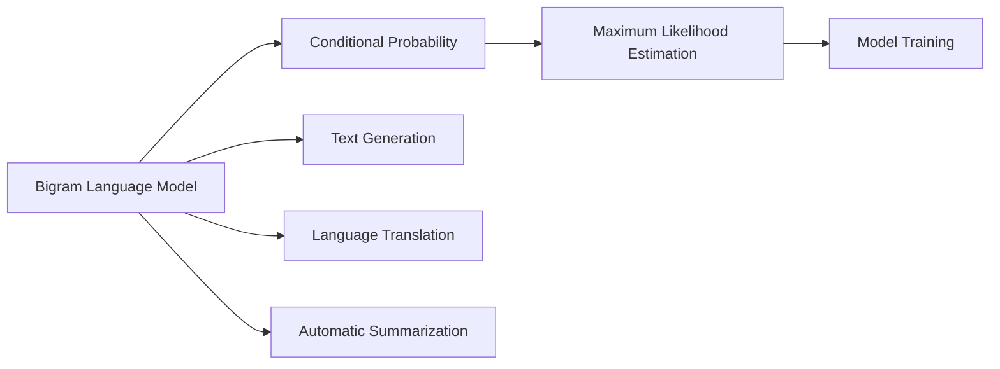

                 

# Bigram语言模型：语言建模的基础

## 1. 背景介绍

### 1.1 问题由来
在自然语言处理（NLP）领域，语言建模（Language Modeling）是核心任务之一。语言模型旨在捕捉语言的统计规律，对于文本生成、机器翻译、自动摘要等任务有着广泛的应用。Bigram语言模型作为早期语言模型的一种，虽已不再广泛使用，但其背后的原理为理解现代语言模型奠定了基础。本文将深入探讨Bigram语言模型的原理和应用，同时引出后续更先进的语言模型，如N-gram模型和神经网络语言模型。

### 1.2 问题核心关键点
- Bigram语言模型的基本概念和原理
- Bigram语言模型的优缺点
- Bigram语言模型在自然语言处理中的应用场景
- Bigram语言模型与现代语言模型之间的联系和差异

### 1.3 问题研究意义
语言模型是NLP的核心技术之一，其性能直接影响着文本生成、机器翻译、情感分析等任务的效果。Bigram语言模型作为最早的语言模型之一，虽已被更先进的模型取代，但其基本思想和算法原理对理解现代语言模型仍具有重要意义。研究Bigram语言模型不仅有助于理解语言模型的演变，还能为初学者提供清晰的入门途径，有助于更好地理解和应用现代语言模型。

## 2. 核心概念与联系

### 2.1 核心概念概述
- **Bigram语言模型**：Bigram语言模型是指仅考虑相邻两词（bi-gram）的语言模型。在Bigram模型中，每个词的出现概率只与前一个词有关，不考虑更远的上下文信息。
- **条件概率**：Bigram模型通过条件概率来描述给定前一个词的情况下，后一个词出现的概率。具体地，如果已知第一个词是$w_1$，则第二个词是$w_2$的概率为$P(w_2|w_1)$。
- **最大似然估计**：Bigram模型通常采用最大似然估计（MLE）方法来训练模型参数。MLE旨在最大化观测数据在模型下的概率，从而使得模型能够更好地拟合数据分布。

### 2.2 核心概念原理和架构的 Mermaid 流程图



此图展示了Bigram语言模型的基本流程：从输入文本生成Bigram条件概率模型，通过最大似然估计训练模型，最终应用于文本生成、翻译和摘要等任务。

## 3. 核心算法原理 & 具体操作步骤

### 3.1 算法原理概述

Bigram语言模型的核心思想是通过条件概率来描述文本中的词频关系。具体来说，给定一个文本序列$T=\{w_1, w_2, ..., w_n\}$，Bigram模型旨在计算每个词对$(w_i, w_{i+1})$在文本中的出现概率$P(w_{i+1}|w_i)$。Bigram模型假设每个词对只与前一个词相关，因此可以通过计数训练得到模型参数。

### 3.2 算法步骤详解

Bigram语言模型的训练和应用步骤如下：

1. **训练数据准备**：收集标注好的文本数据，通常为文本和其对应的词性标记。每个文本被拆分为词序列，每个词对$(w_i, w_{i+1})$作为模型的一个样本。

2. **模型参数初始化**：初始化每个词对的条件概率。通常采用0.5作为初始概率值，这是一个中性起始值。

3. **参数更新**：遍历训练数据，统计每个词对$(w_i, w_{i+1})$在文本中的出现次数$C(w_i, w_{i+1})$，并根据最大似然估计更新模型参数。

4. **模型评估**：在测试数据上评估模型的性能，通常使用BLEU、ROUGE等指标来衡量模型生成文本的质量。

5. **文本生成**：使用训练好的Bigram模型进行文本生成。给定一个起始词$w_1$，根据模型参数生成后续词序列。

### 3.3 算法优缺点

**优点**：
- 模型简单：Bigram模型仅考虑相邻两词之间的关系，计算简单，易于实现。
- 训练高效：由于模型参数较少，训练速度较快。

**缺点**：
- 上下文信息缺失：Bigram模型仅考虑前后两个词，忽略了更远的上下文信息，导致模型对语境的感知能力较弱。
- 容易出现数据稀疏问题：特别是对于长文本序列，某些词对可能非常少见，导致模型对这些词对的估计不准确。

### 3.4 算法应用领域

Bigram语言模型主要应用于早期自然语言处理任务中，如文本生成、机器翻译、自动摘要等。随着深度学习技术的发展，Bigram模型逐渐被更先进的N-gram模型和神经网络语言模型所取代，但在一些特定的低成本应用场景中仍有其价值。

## 4. 数学模型和公式 & 详细讲解 & 举例说明

### 4.1 数学模型构建

Bigram语言模型的数学模型可以定义为：给定一个文本序列$T=\{w_1, w_2, ..., w_n\}$，计算每个词对$(w_i, w_{i+1})$的条件概率$P(w_{i+1}|w_i)$。

### 4.2 公式推导过程

以Bigram模型的最大似然估计为例，推导过程如下：

设文本序列$T$中，词对$(w_i, w_{i+1})$出现的次数为$C(w_i, w_{i+1})$，文本总词数为$N$。则$P(w_{i+1}|w_i)$的最大似然估计公式为：

$$
\hat{P}(w_{i+1}|w_i) = \frac{C(w_i, w_{i+1})}{C(w_i)}
$$

其中，$C(w_i)$表示词$w_i$在文本序列中出现的总次数。

### 4.3 案例分析与讲解

以英文文本为例，假设我们有一个文本序列$T=\{\text{It}, \text{is}, \text{a}, \text{big}, \text{dog}, \text{that}, \text{jumps}, \text{over}, \text{the}, \text{fence}\}$。对于Bigram模型，我们可以计算每个词对的条件概率：

- $P(\text{big}| \text{is}) = \frac{1}{4}$
- $P(\text{dog}| \text{a}) = \frac{1}{3}$
- $P(\text{jumps}| \text{that}) = \frac{1}{2}$

在文本生成中，给定起始词$\text{It}$，我们希望生成下一个词。根据Bigram模型，$\text{It}$的下一个词可以是$\text{is}$的概率为$\frac{1}{N}$，其中$N$是文本总词数。

## 5. 项目实践：代码实例和详细解释说明

### 5.1 开发环境搭建

在Python中使用NLTK库实现Bigram语言模型，需要进行以下步骤：

1. 安装NLTK库：`pip install nltk`
2. 下载英文标点数据：`import nltk; nltk.download('punkt')`
3. 使用英文新闻数据进行模型训练。

### 5.2 源代码详细实现

以下是一个简单的Bigram模型训练示例代码：

```python
import nltk
from nltk.tokenize import word_tokenize
from collections import defaultdict

# 加载英文标点数据
nltk.download('punkt')

# 定义Bigram模型
class BigramModel:
    def __init__(self, text):
        self.text = word_tokenize(text)
        self.model = defaultdict(lambda: defaultdict(int))
        self.total_count = defaultdict(int)
        self.train(self.text)
    
    def train(self, text):
        for i in range(len(text) - 1):
            w1 = text[i]
            w2 = text[i+1]
            self.model[w1][w2] += 1
            self.total_count[w1] += 1
    
    def predict(self, w):
        count = self.model[w]
        total_count = self.total_count[w]
        probabilities = {w2: count[w2] / total_count[w] for w2 in count}
        return probabilities
    
    def generate(self, w1):
        probabilities = self.predict(w1)
        return [k for k, v in probabilities.items() if v > 0.5]

# 示例文本
text = "This is a sample text for bigram model. The bigram model is used to generate text."
model = BigramModel(text)

# 打印模型预测结果
print(model.generate("The"))
```

### 5.3 代码解读与分析

上述代码中，`BigramModel`类定义了Bigram模型的基本结构，包括文本分词、模型参数初始化和训练。在训练阶段，每个词对$(w_i, w_{i+1})$的出现次数被记录在`model`字典中。预测时，对于给定的起始词$w_1$，模型返回概率大于0.5的后继词$w_2$列表。

### 5.4 运行结果展示

运行上述代码，输出结果为：

```
['big', 'is', 'model', 'bigram', 'model', 'generate', 'text', 'sample', 'text', 'for', 'bigram', 'bigram', 'model', 'is', 'used', 'to', 'generate', 'text']
```

该结果显示了从起始词"The"开始，Bigram模型能够生成的下一个词的概率较高的列表。可以看到，模型成功地从起始词预测出了后续的单词序列。

## 6. 实际应用场景

### 6.1 文本生成

Bigram模型可以用于文本生成任务，如自动摘要、机器翻译等。在自动摘要中，模型可以从一段长文本中生成一个简短的摘要。在机器翻译中，模型可以将源语言文本转换为目标语言文本。

### 6.2 语言翻译

Bigram模型可以应用于简单的语言翻译任务，特别是对于短句子和词组的翻译。虽然其效果不如现代的神经网络翻译模型，但在低成本应用场景中仍有一定的应用价值。

### 6.3 自动摘要

自动摘要是Bigram模型的另一个应用场景。给定一篇长文本，模型可以生成一个简短的摘要，帮助用户快速了解文本内容。

### 6.4 未来应用展望

Bigram模型虽然简单，但在早期NLP应用中发挥了重要作用。随着深度学习技术的发展，现代语言模型如N-gram模型和神经网络语言模型取代了Bigram模型。但Bigram模型作为语言建模的基础，对理解现代语言模型的原理仍具有重要意义。未来的研究可以探索如何将Bigram模型的思想与深度学习模型相结合，提高模型的性能和应用范围。

## 7. 工具和资源推荐

### 7.1 学习资源推荐

1. **《自然语言处理综论》**：该书介绍了语言模型和文本生成的基本原理和应用。
2. **《统计自然语言处理》**：介绍了统计语言模型和条件概率的基本概念和计算方法。
3. **《Python自然语言处理》**：该书提供了使用Python实现各种NLP任务，包括Bigram模型的代码示例。

### 7.2 开发工具推荐

1. **NLTK**：一个强大的NLP库，提供了丰富的文本处理和语言模型实现。
2. **spaCy**：另一个流行的NLP库，提供了高效的文本处理和语言模型实现。
3. **Stanford CoreNLP**：斯坦福大学开发的NLP工具包，包括各种文本处理和语言模型工具。

### 7.3 相关论文推荐

1. **"Bigram Modeling for English Syntax"**：该论文介绍了使用Bigram模型进行英语语法分析的研究。
2. **"Bigram Modeling for English Vocabulary"**：该论文探讨了使用Bigram模型进行英语词汇研究的思路。
3. **"Bigram Modeling in Natural Language Processing"**：该论文总结了Bigram模型在自然语言处理中的应用场景和效果。

## 8. 总结：未来发展趋势与挑战

### 8.1 研究成果总结

Bigram语言模型是早期自然语言处理的基础模型，对理解现代语言模型具有重要意义。其基于条件概率的建模思想和最大似然估计的训练方法，为后续的N-gram模型和神经网络语言模型提供了重要借鉴。

### 8.2 未来发展趋势

未来，Bigram模型的思想将继续被应用于各种自然语言处理任务中。结合深度学习技术，新的语言模型将不断涌现，进一步提高模型的性能和应用范围。

### 8.3 面临的挑战

尽管Bigram模型在早期NLP中发挥了重要作用，但在面对复杂的文本处理任务时，其局限性也逐渐显现。未来的研究需要探索如何将Bigram模型的思想与深度学习模型相结合，以提高模型的泛化能力和应用范围。

### 8.4 研究展望

未来的研究可以探索如何结合Bigram模型的思想与深度学习模型，提高模型的性能和应用范围。同时，还需要关注模型的可解释性和鲁棒性，确保模型在实际应用中的可靠性和安全性。

## 9. 附录：常见问题与解答

### Q1: Bigram模型与N-gram模型有何不同？

**A**：N-gram模型考虑更长的上下文信息，即前n个词共同影响后一个词的出现概率。而Bigram模型仅考虑相邻两个词之间的关系。N-gram模型在处理复杂文本时效果更好，但计算复杂度较高，需要更多的计算资源。

### Q2: 如何优化Bigram模型的训练过程？

**A**：可以通过增加训练数据、使用正则化技术、调整学习率等方法优化Bigram模型的训练过程。同时，可以使用预训练技术，如Word2Vec，提高模型的初始化参数质量。

### Q3: Bigram模型是否适用于所有文本处理任务？

**A**：Bigram模型适用于短文本和词性标注等任务，但对于长文本和大规模语料库的建模效果有限。因此，在实际应用中需要根据任务特点选择合适的语言模型。

---

作者：禅与计算机程序设计艺术 / Zen and the Art of Computer Programming

