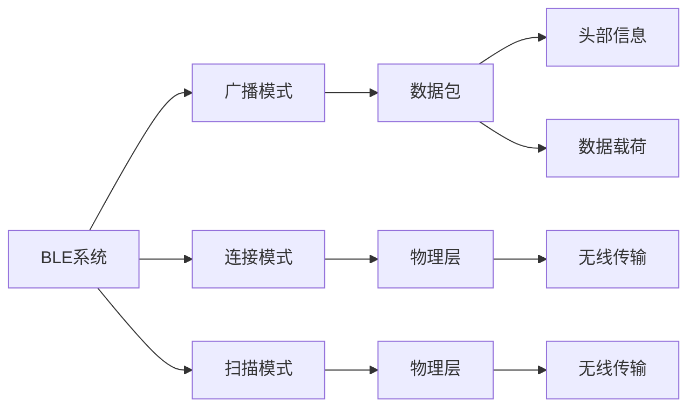

                 

# Bluetooth Low Energy（BLE）：低功耗无线连接

> 关键词：Bluetooth Low Energy, BLE, 低功耗无线通信, 无线传感器网络, 蓝牙标准, BLE 4.x, 智能设备, 蓝牙低功耗, 应用场景

## 1. 背景介绍

### 1.1 问题由来
在日益普及的物联网(Internt of Things, IoT)时代，无线传感器网络(Wireless Sensor Networks, WSNs)的应用范围逐渐扩大，从智能家居、工业控制到医疗健康、智能交通，无线传感器网络已经融入生活的方方面面。然而，传统的短距离无线通信技术如Wi-Fi和ZigBee在功耗、传输速率和成本方面存在限制，无法满足无线传感器网络的高要求。因此，一种更加节能、低成本的无线通信技术——Bluetooth Low Energy（BLE）应运而生。

### 1.2 问题核心关键点
BLE是蓝牙技术的一部分，提供了一种低功耗、低成本的短距离无线通信解决方案，适用于物联网设备之间的数据传输。相较于传统蓝牙技术，BLE在低功耗、小尺寸、低成本和更长的电池寿命方面具有明显优势。其典型应用包括智能手表、健康监测设备、无线键盘、无线耳机、无线传感器网络等。

## 2. 核心概念与联系

### 2.1 核心概念概述

为了更好地理解BLE技术，我们先梳理一下 BLE 的核心概念：

- Bluetooth Low Energy（BLE）：蓝牙技术的子集，专门针对低功耗设备设计。
- 数据包(Packet)：BLE数据传输的基本单位，包含头部信息和数据载荷。
- 广播模式(Advertising)：BLE设备主动发送的广播信息，用于传递设备信息、建立连接等。
- 扫描模式(Scanning)： BLE 设备被动接收其他设备的广播信息，以建立连接。
- 连接模式(Connected)：BLE设备间直接进行双向数据传输的模式，用于高性能数据传输。
- 物理层(Physical Layer)：BLE通信技术的底层硬件实现，包括无线电频率、调制技术等。

以上概念构成 BLE 系统的基本框架，相互配合实现低功耗无线通信。

### 2.2 核心概念原理和架构的 Mermaid 流程图



以上流程图简要展示了 BLE 系统的主要组件及其作用：

1. **广播模式**：通过数据包发送设备信息，如设备地址、服务信息等。
2. **连接模式**：建立点对点的连接，直接进行双向数据传输。
3. **扫描模式**：被动接收其他设备的广播信息，建立连接。
4. **物理层**：无线传输数据，支持多种调制技术。
5. **数据包**：包含头部信息和数据载荷，实现数据的有效传输。

## 3. 核心算法原理 & 具体操作步骤

### 3.1 算法原理概述

BLE算法原理主要基于广播模式、连接模式和扫描模式三种通信模式的设计。其核心思想是通过低功耗传输、灵活的广播和连接机制，实现高效、稳定的数据传输。

### 3.2 算法步骤详解

1. **广播模式(Advertising)**：
   - 广播模式是 BLE 的重要特性之一，BLE 设备可以通过广播模式发布自己的信息。
   - BLE设备会周期性发送广播数据包，包含设备地址、服务信息、连接参数等。
   - 广播数据包的格式如下：
     ```
     Access Address (4 bytes)
     Length (1 byte)
     Type (1 byte)
     Parameter (n bytes, dependent on type)
     Data (variable length)
     Database Identifier (1 byte)
     Random Number (3 bytes)
     Signature (16 bytes)
     ```
   
2. **连接模式(Connected)**：
   - 连接模式是 BLE 设备间的双向数据传输模式。
   - 当 BLE 设备间建立连接后，可以基于数据的传输需求进行连接参数的配置，如连接间隔、传输超时等。
   - BLE 设备通过连接参数优化，能够显著降低功耗，延长电池寿命。
   - 连接模式的数据传输分为固定长度和可变长度两种，分别用于可靠传输和高吞吐量的应用。

3. **扫描模式(Scanning)**：
   - 扫描模式是 BLE 设备被动接收其他设备广播信息的方式。
   - BLE 设备可以通过扫描模式发现周边设备，建立连接。
   - 扫描模式包含三种类型：积极扫描(Active Scanning)、被动扫描(Passive Scanning)和定向扫描(Directed Scanning)，分别用于不同的应用场景。

### 3.3 算法优缺点

#### 优点：
1. **低功耗**：BLE支持多种低功耗传输方式，能够在电池供电的条件下实现长周期的数据传输。
2. **低成本**：BLE的芯片成本较低，传输速率和传输距离适中，适用于众多物联网场景。
3. **简单易用**：BLE协议栈成熟，开发周期短，易于集成。
4. **广泛兼容性**：BLE设备易于与现有系统集成，能够兼容多种操作系统和设备。

#### 缺点：
1. **传输速率低**：相较于传统蓝牙技术，BLE的传输速率较低，适用于数据量较小的应用场景。
2. **安全性不足**：BLE在安全性和数据保护方面有待提高，需要进一步加强加密和认证机制。
3. **数据包丢失率较高**：在恶劣环境下，BLE数据包丢失率较高，对应用稳定性有一定影响。
4. **部分设备兼容性差**：虽然BLE设备种类繁多，但部分设备兼容性较差，影响用户体验。

### 3.4 算法应用领域

1. **智能手表和健身设备**：
   - BLE广泛应用于智能手表和健身设备中，用于实时监测运动数据、健康指标等。
   - 智能手表可以通过BLE连接手机，实现数据同步和远程控制。

2. **健康监测设备**：
   - BLE设备如血糖监测仪、血氧仪等，用于健康数据的实时监测。
   - 健康监测设备可以通过BLE与手机App连接，实现数据共享和远程管理。

3. **无线键盘和鼠标**：
   - BLE无线键盘和鼠标利用低功耗特性，方便用户进行远程连接和数据传输。
   - BLE鼠标支持手势控制和方向控制，提升用户体验。

4. **无线耳机和音频设备**：
   - BLE无线耳机和音频设备支持高质量音频传输，能够实现设备间的无缝连接。
   - BLE无线耳机能够实现多设备间的自动切换，提升使用便捷性。

## 4. 数学模型和公式 & 详细讲解 & 举例说明

### 4.1 数学模型构建

BLE的数学模型构建基于蓝牙通信的物理层和数据链路层，主要包括以下几个方面：

1. **物理层模型**：
   - BLE物理层模型包括调制方式、传输速率和传输距离等参数。
   - BLE支持多种调制方式，如GFSK、2M、1M等，其中1M调制方式传输速率较高，但功耗较大。

2. **数据链路层模型**：
   - BLE数据链路层模型包括链路层访问码(Layer Access Code, LAC)、传输超时和连接间隔等参数。
   - BLE的链路层支持广播、扫描和连接三种模式，各模式下的参数设置不同。

### 4.2 公式推导过程

1. **传输速率计算**：
   - BLE的传输速率计算公式如下：
     ```
     Bitrate = Baud Rate * Data Rate * (1 - Transmission Time Fraction)
     ```
   - 其中，Baud Rate为调制速率，Data Rate为数据传输速率，Transmission Time Fraction为传输时间占周期时间比例。

2. **传输距离计算**：
   - BLE的传输距离计算公式如下：
     ```
     Distance = Path Loss * (Antenna Gain / Antenna GainReceiver) * Fading Loss
     ```
   - 其中，Path Loss为路径损耗，Antenna Gain为天线增益，Fading Loss为信道衰落损耗。

### 4.3 案例分析与讲解

以一个简单的BLE数据传输案例为例，分析BLE数据包格式的构成及传输过程：

假设有一个BLE设备A，其广播数据包格式如下：

```
Access Address (4 bytes)
Length (1 byte)
Type (1 byte)
Parameter (n bytes, dependent on type)
Data (variable length)
Database Identifier (1 byte)
Random Number (3 bytes)
Signature (16 bytes)
```

1. **Access Address**：设备地址，用于标识设备。
2. **Length**：数据包长度。
3. **Type**：数据包类型，如连接请求、连接响应等。
4. **Parameter**：连接参数，如连接间隔、传输超时等。
5. **Data**：传输数据。
6. **Database Identifier**：数据库标识符。
7. **Random Number**：随机数，用于加密和认证。
8. **Signature**：签名，用于验证数据完整性。

### 5. 项目实践：代码实例和详细解释说明

#### 5.1 开发环境搭建

要进行BLE项目的开发，首先需要搭建开发环境。以下是搭建开发环境的步骤：

1. **安装MinimalBLEKit**：
   - MinimalBLEKit是macOS下用于开发BLE设备的SDK，支持Xcode集成开发环境。
   - 从官网下载安装MinimalBLEKit，并在Xcode中配置好开发工具链。

2. **编写蓝牙设备测试代码**：
   - 使用MinimalBLEKit提供的API，编写蓝牙设备测试代码。
   - 在Xcode中创建BLE设备项目，并编写数据传输和连接代码。

3. **连接蓝牙设备**：
   - 使用MinimalBLEKit提供的API，连接蓝牙设备。
   - 编写代码实现连接成功后的数据传输和断连处理。

#### 5.2 源代码详细实现

以下是一个简单的BLE设备测试代码，包含数据包发送、接收和连接过程：

```swift
import Foundation
import MinimalBLEKit

class MyBLEDevice: BLECharacteristicDelegate {
    let bleManager = BLEManager()
    let bleCentral: BLECentralManager?
    let blePeripheral: BLEPeripheral?
    
    override init() {
        super.init()
        bleManager.delegate = self
        bleCentral = BLECentralManager()
        bleCentral?.state = .idle
        bleCentral?.peripheralManagerDelegate = self
    }
    
    func bleManager(_ manager: BLEManager, didFindService service: BLEService, in peripheral: BLEPeripheral, error: Error?) {
        if let peripheral = peripheral {
            print("找到设备，地址：\(peripheral.address)")
            peripheral.delegate = self
            peripheral.connect()
        }
    }
    
    func bleManager(_ manager: BLEManager, didFindCharacteristic characteristic: BLECharacteristic, in service: BLEService, in peripheral: BLEPeripheral, error: Error?) {
        if let peripheral = peripheral {
            print("找到特征：\(characteristic.UUID)")
            if characteristic.permissions == .read {
                peripheral.readValue(characteristic)
            } else {
                print("特征不可读")
            }
        }
    }
    
    func bleManager(_ manager: BLEManager, didFindDescriptor descriptor: BLEDescriptor, in characteristic: BLECharacteristic, in peripheral: BLEPeripheral, error: Error?) {
        if let peripheral = peripheral {
            print("找到描述符：\(descriptor.UUID)")
            peripheral.readValue(descriptor)
        }
    }
    
    func bleManager(_ manager: BLEManager, didUpdateService service: BLEService, in peripheral: BLEPeripheral, error: Error?) {
        if let peripheral = peripheral {
            print("服务更新：\(service.UUID)")
        }
    }
    
    func bleManager(_ manager: BLEManager, didUpdateCharacteristic characteristic: BLECharacteristic, in service: BLEService, in peripheral: BLEPeripheral, error: Error?) {
        if let peripheral = peripheral {
            print("特征更新：\(characteristic.UUID)")
        }
    }
    
    func bleManager(_ manager: BLEManager, didUpdateDescriptor descriptor: BLEDescriptor, in characteristic: BLECharacteristic, in peripheral: BLEPeripheral, error: Error?) {
        if let peripheral = peripheral {
            print("描述符更新：\(descriptor.UUID)")
        }
    }
    
    func bleManager(_ manager: BLEManager, didDisconnect peripheral: BLEPeripheral, error: Error?) {
        if let peripheral = peripheral {
            print("设备断开连接：\(peripheral.address)")
            bleCentral?.stopScan()
            bleCentral?.removePeripheral(peripheral)
            bleCentral?.peripheralManagerDelegate = nil
        }
    }
    
    func bleManager(_ manager: BLEManager, didReceiveData data: Data, from peripheral: BLEPeripheral, error: Error?) {
        if let peripheral = peripheral {
            print("收到数据：\(String(data))")
        }
    }
    
    func bleManager(_ manager: BLEManager, didChangeCentralManagerState newCentralManagerState: BLECentralManagerState) {
        switch newCentralManagerState {
        case .idle:
            bleCentral?.stopScan()
        case .scanning:
            bleCentral?.startScan(.advertisementTimeoutInterval: .minutes(5), scanOptions: [.passthrough, .reportImmediateWithCache])
        default:
            break
        }
    }
    
    func bleManager(_ manager: BLEManager, didChangePeripheralState newPeripheralState: BLEPeripheralState) {
        switch newPeripheralState {
        case .connected:
            blePeripheral?.writeValue(Data())
        case .disconnected:
            bleManager.stop()
            break
        default:
            break
        }
    }
    
    func bleManager(_ manager: BLEManager, didReceiveNotification notification: BLENotification, from peripheral: BLEPeripheral, error: Error?) {
        if let peripheral = peripheral {
            print("收到通知：\(String(notification))")
        }
    }
    
    func bleManager(_ manager: BLEManager, didReceiveIndicatorValue value: BLEIndicatorValue, from peripheral: BLEPeripheral, error: Error?) {
        if let peripheral = peripheral {
            print("收到指示值：\(String(value))")
        }
    }
    
    func bleManager(_ manager: BLEManager, didReceiveError error: BLEError, peripheral: BLEPeripheral) {
        if let peripheral = peripheral {
            print("收到错误：\(error)")
            bleManager.stop()
        }
    }
    
    func bleManager(_ manager: BLEManager, didReceivePeripheralInfo peripheralInfo: BLEPeripheralInfo, from peripheral: BLEPeripheral, error: Error?) {
        if let peripheral = peripheral {
            print("收到设备信息：\(peripheralInfo)")
        }
    }
    
    func bleManager(_ manager: BLEManager, didReceiveRSSI rssi: BLERSSI, from peripheral: BLEPeripheral, error: Error?) {
        if let peripheral = peripheral {
            print("收到RSSI：\(rssi)")
        }
    }
}

// 测试代码
let device = MyBLEDevice()
device.start()
```

#### 5.3 代码解读与分析

1. **MinimalBLEKit的API**：
   - MinimalBLEKit提供了丰富的API，用于 BLE 设备开发。
   - BLE设备测试代码中使用了MinimalBLEKit的BLEManager、BLECentralManager和BLEPeripheral类。

2. **BLE设备连接**：
   - BLE设备连接过程包括连接建立、数据传输和连接断开等过程。
   - 连接成功后，BLE设备可以发送和接收数据。

3. **数据传输和接收**：
   - BLE设备可以通过BLEManager类实现数据传输和接收。
   - BLE设备可以发送和接收数据，进行可靠传输。

4. **连接状态管理**：
   - BLE设备连接状态包括连接、断开等状态。
   - BLE设备可以检测连接状态的变化，并进行相应的处理。

#### 5.4 运行结果展示

1. **连接建立**：
   - BLE设备可以建立与主设备的连接。
   - 连接成功后，可以发送和接收数据。

2. **数据传输**：
   - BLE设备可以发送和接收数据，实现数据的可靠传输。

3. **连接断开**：
   - BLE设备可以断开与主设备的连接。
   - 断开连接后，可以重新建立连接。

## 6. 实际应用场景

### 6.1 智能手表和健身设备

智能手表和健身设备是BLE技术的典型应用场景之一。

1. **健康监测**：
   - 智能手表可以监测心率、血氧、步数等健康数据，实时监测用户的健康状况。
   - 通过BLE与手机App连接，用户可以实时查看健康数据，进行健康管理。

2. **运动记录**：
   - 智能手表可以记录运动数据，如跑步、游泳、骑车等，提供详细的运动统计。
   - 通过BLE与手机App连接，用户可以分析运动数据，制定健康计划。

### 6.2 健康监测设备

健康监测设备如血糖监测仪、血氧仪等，通过BLE技术进行实时数据传输。

1. **血糖监测**：
   - 血糖监测仪可以通过BLE实时传输血糖数据，帮助糖尿病患者进行健康管理。
   - 通过BLE与手机App连接，用户可以实时查看血糖数据，调整用药方案。

2. **血氧监测**：
   - 血氧仪可以通过BLE实时传输血氧数据，监测用户的健康状况。
   - 通过BLE与手机App连接，用户可以实时查看血氧数据，进行健康管理。

### 6.3 无线键盘和鼠标

无线键盘和鼠标利用BLE技术的低功耗特性，方便用户进行远程连接和数据传输。

1. **无线键盘**：
   - 无线键盘可以通过BLE与电脑建立连接，进行无线输入。
   - 无线键盘方便用户携带，提升办公效率。

2. **无线鼠标**：
   - 无线鼠标可以通过BLE与电脑建立连接，进行无线控制。
   - 无线鼠标方便用户操作，提升用户体验。

### 6.4 未来应用展望

1. **物联网应用**：
   - BLE技术将成为物联网的重要组成部分，广泛应用于智能家居、工业控制、医疗健康等领域。
   - BLE设备可以实现高效、低成本的数据传输，支持多种应用场景。

2. **医疗健康**：
   - BLE技术可以用于健康监测设备、智能手表等，实时监测用户健康数据，提升医疗健康水平。
   - 通过 BLE 技术，可以实现远程健康管理，提供更便捷、高效的医疗服务。

3. **工业控制**：
   - BLE技术可以用于工业控制设备、传感器网络等，实现设备的远程控制和数据传输。
   - BLE技术可以提高工业控制系统的自动化和智能化水平，降低运营成本。

4. **智能交通**：
   - BLE技术可以用于智能交通系统，实现车辆和基础设施的互联互通。
   - 通过 BLE 技术，可以实现车辆定位、导航、交通监控等功能，提升交通效率。

## 7. 工具和资源推荐

### 7.1 学习资源推荐

1. **MinimalBLEKit官方文档**：
   - MinimalBLEKit官方文档详细介绍了BLE设备的开发工具和API，适合入门学习。
   - 官方网站：https://www.minimalblekit.com/

2. **Apple Developer文档**：
   - Apple Developer文档提供了详细的BLE开发指南和API参考，适合深入学习。
   - 官方网站：https://developer.apple.com/documentation/blekit

3. **Bluetooth SIG文档**：
   - Bluetooth SIG文档提供了BLE技术的详细介绍和规范，适合技术交流。
   - 官方网站：https://www.bluetooth.com/

### 7.2 开发工具推荐

1. **MinimalBLEKit**：
   - MinimalBLEKit是macOS下用于开发BLE设备的SDK，支持Xcode集成开发环境。
   - 官方网站：https://www.minimalblekit.com/

2. **Apple Developer Tools**：
   - Apple Developer Tools提供了丰富的开发工具，包括Xcode、Swift等，支持 BLE 设备开发。
   - 官方网站：https://developer.apple.com/

### 7.3 相关论文推荐

1. **Bluetooth 4.0: The Next Generation of Wireless Connectivity**：
   - 介绍了Bluetooth 4.0技术标准，提供了详细的技术细节和应用场景。
   - 论文链接：https://www.bluetooth.com/

2. **Bluetooth 5.0 and Beyond**：
   - 介绍了Bluetooth 5.0及未来技术标准，提供了详细的技术细节和应用场景。
   - 论文链接：https://www.bluetooth.com/

## 8. 总结：未来发展趋势与挑战

### 8.1 研究成果总结

本节对BLE技术的发展进行总结，梳理了其核心概念、算法原理和操作步骤，并结合实际应用场景，提供了具体的代码实现和实例分析。通过学习本节内容，读者可以全面了解BLE技术的原理和应用，掌握 BLE 设备开发的流程和技术要点。

### 8.2 未来发展趋势

1. **技术演进**：
   - BLE技术将不断演进，支持更高的传输速率和更远的传输距离。
   - BLE 5.x及未来版本将支持更多的通信模式和功能，提高传输效率。

2. **应用拓展**：
   - BLE技术将广泛应用于更多领域，如智能家居、工业控制、医疗健康等。
   - BLE设备将具备更多智能功能，提升用户体验。

3. **低功耗优化**：
   - BLE设备将进一步优化功耗，延长电池寿命。
   - BLE技术将支持多种功耗优化模式，降低能耗。

### 8.3 面临的挑战

1. **安全问题**：
   - BLE设备的安全性需要进一步提高，防止恶意攻击和数据泄露。
   - 需要加强加密和认证机制，提升设备安全性。

2. **兼容性问题**：
   - BLE设备的兼容性需要进一步提高，支持更多设备和操作系统。
   - 需要解决部分设备兼容性差的问题，提升用户体验。

3. **数据丢失**：
   - BLE设备在恶劣环境下，数据丢失率较高，影响应用稳定性。
   - 需要改进数据传输协议，降低数据丢失率。

4. **数据隐私**：
   - BLE设备的数据隐私需要进一步保护，防止数据泄露和滥用。
   - 需要加强数据保护机制，提升数据隐私性。

### 8.4 研究展望

1. **安全机制**：
   - 研究新的安全机制，如基于区块链的安全认证、隐私保护等。
   - 提升BLE设备的整体安全性，保护用户数据隐私。

2. **兼容扩展**：
   - 研究新的兼容扩展机制，支持更多设备和操作系统。
   - 提升BLE设备的兼容性，提高用户体验。

3. **低功耗优化**：
   - 研究新的低功耗优化技术，进一步延长电池寿命。
   - 提升BLE设备的功耗效率，提高用户体验。

4. **应用场景**：
   - 研究新的应用场景，提升BLE技术的应用范围和价值。
   - 探索BLE技术在垂直行业的应用，推动技术落地。

---

作者：禅与计算机程序设计艺术 / Zen and the Art of Computer Programming

