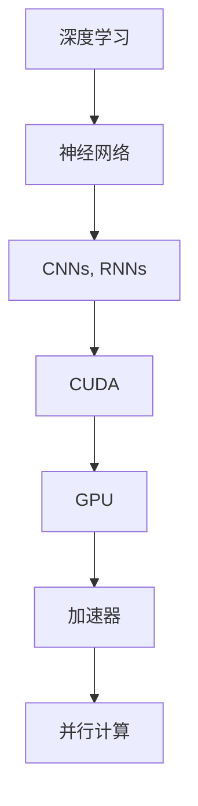

                 

# CUDA编程：释放GPU的AI计算潜力

> 关键词：CUDA, GPU, AI计算, 深度学习, 神经网络, 加速, 高性能计算, 卷积神经网络, 图形处理器, 并行计算

## 1. 背景介绍

### 1.1 问题由来
近年来，随着深度学习技术的快速发展，AI计算的需求呈爆炸性增长，特别是卷积神经网络（Convolutional Neural Networks, CNNs）在图像识别、语音识别等领域的广泛应用，使得深度学习模型成为AI计算的核心。然而，传统的CPU在执行这些复杂计算时，性能瓶颈愈发显著，无法满足日益增长的AI计算需求。因此，如何高效利用GPU资源进行AI计算，成为亟待解决的重要问题。

### 1.2 问题核心关键点
CUDA（Compute Unified Device Architecture）是由NVIDIA推出的一种并行计算架构，旨在利用GPU的强大计算能力，加速深度学习等科学计算任务。CUDA提供了灵活的API和编程模型，使得开发者能够高效地利用GPU并行计算能力，实现深度学习模型的加速。

CUDA编程的关键点包括：
- CUDA与OpenCL、OpenMP等并行计算架构的异同
- CUDA的编程模型和API设计
- CUDA在深度学习模型中的具体应用
- CUDA编程的性能优化策略

## 2. 核心概念与联系

### 2.1 核心概念概述

为更好地理解CUDA编程及其与AI计算的联系，本节将介绍几个密切相关的核心概念：

- CUDA：一种并行计算架构，由NVIDIA开发，支持基于GPU的科学计算、深度学习等任务。
- GPU（图形处理器）：一种专门用于处理图像、图形和科学计算的高性能处理器。
- 深度学习：一种利用神经网络进行学习的AI技术，包括卷积神经网络（CNNs）、循环神经网络（RNNs）、自编码器等。
- 加速器：指能够加速特定计算任务，提高计算效率的硬件设备，如FPGA、ASIC等。
- 并行计算：指利用多个计算单元同时执行计算任务，提高计算速度和效率。

这些核心概念之间的逻辑关系可以通过以下Mermaid流程图来展示：



这个流程图展示了大语言模型的核心概念及其之间的关系：

1. 深度学习利用神经网络进行学习。
2. 神经网络包括多种结构，如CNNs、RNNs等。
3 CUDA与GPU配合，利用GPU的强大计算能力，加速深度学习任务。
4 加速器不仅限于GPU，还包括FPGA、ASIC等，旨在加速特定计算任务。
5 并行计算通过利用多个计算单元，提高计算速度和效率。

这些概念共同构成了CUDA编程及其在AI计算中应用的基础，使得我们能够更深入地理解CUDA编程及其优势。

## 3. 核心算法原理 & 具体操作步骤
### 3.1 算法原理概述

CUDA编程的核心理念在于利用GPU的并行计算能力，实现深度学习等科学计算任务的加速。具体而言，CUDA通过以下步骤，实现对GPU的深度学习模型优化：

1. 将深度学习模型划分为多个并行计算任务，每个任务对应GPU的一个核心单元。
2. 将数据和模型参数传输到GPU内存中。
3. 利用CUDA API，编写并行计算程序，对深度学习模型进行加速。
4. 计算完成后，将结果从GPU内存传输回CPU，进行后续处理。

CUDA编程的核心理念是“数据并行，算法串行”。即将深度学习模型中的数据集划分为多个小块，每个小块对应一个GPU核心单元，在并行计算过程中保持模型的参数不变，从而实现高效加速。

### 3.2 算法步骤详解

CUDA编程一般包括以下几个关键步骤：

**Step 1: 环境准备**
- 安装CUDA开发环境，下载对应的GPU驱动程序和CUDA SDK。
- 安装所需的编译器（如Clang或NVCC）和调试工具（如VSCode）。
- 设置编译环境，配置CUDA路径和编译选项。

**Step 2: 编写CUDA程序**
- 使用CUDA C++编写深度学习模型的前向传播和后向传播函数。
- 利用CUDA并行计算API，实现并行计算加速。
- 使用CUDA内存管理API，优化数据传输效率。
- 测试程序，验证其在GPU上的性能。

**Step 3: 程序优化**
- 分析程序性能瓶颈，确定优化方向。
- 使用CUDA优化工具（如Nvprof、Visual Profiler）进行性能分析。
- 应用并行计算优化技巧，如线程块大小调整、任务切分等。
- 采用内存优化策略，如统一内存架构、数据压缩等。

**Step 4: 程序调试和部署**
- 调试CUDA程序，确保无bug。
- 生成可执行文件，部署到GPU上。
- 在GPU集群上部署程序，进行负载均衡和任务调度。

通过上述步骤，可以高效地利用GPU进行深度学习模型的加速计算。

### 3.3 算法优缺点

CUDA编程的优点包括：
- 高效加速：通过利用GPU的并行计算能力，显著提高深度学习模型的计算效率。
- 灵活性：CUDA提供了丰富的API和编程模型，支持多种计算任务和算法。
- 开发便利：CUDA与OpenCL、OpenMP等并行计算架构兼容，开发人员可以选择最合适的工具。

同时，CUDA编程也存在一些缺点：
- 学习曲线陡峭：CUDA编程涉及GPU并行计算和内存管理等复杂概念，入门门槛较高。
- 平台限制：CUDA只能在NVIDIA GPU上运行，难以跨平台使用。
- 资源需求高：高性能GPU和相关硬件设备需要较高成本，对资源要求较高。

尽管存在这些局限性，但CUDA编程在深度学习等科学计算任务中，已经成为不可或缺的重要工具。

### 3.4 算法应用领域

CUDA编程在大规模AI计算领域，已经得到了广泛的应用，主要包括以下几个方面：

- 深度学习模型训练：加速卷积神经网络（CNNs）、循环神经网络（RNNs）等模型的训练过程。
- 图像和视频处理：如图像增强、视频编解码、实时渲染等。
- 科学计算：如天气预报、物理模拟、金融建模等。
- 大数据处理：如大规模数据挖掘、数据清洗和分析等。
- 高性能计算：如科学计算、机器学习等领域的大规模计算任务。

CUDA编程不仅适用于深度学习等特定领域，也广泛应用于各种高性能计算任务中，成为了推动AI计算发展的重要力量。

## 4. 数学模型和公式 & 详细讲解 & 举例说明

### 4.1 数学模型构建

CUDA编程的数学模型主要涉及深度学习模型的前向传播和后向传播过程。假设深度学习模型为$f: \mathbb{R}^d \rightarrow \mathbb{R}^m$，其中$x \in \mathbb{R}^d$为输入，$y \in \mathbb{R}^m$为输出，$w \in \mathbb{R}^{d \times m}$为模型参数。深度学习模型的前向传播过程为：

$$
y = f(x; w)
$$

其中，$f(x; w)$为深度学习模型的前向传播函数。

后向传播过程则是根据损失函数$\mathcal{L}$和前向传播结果，计算模型参数的梯度，进行模型优化。假设损失函数为$\mathcal{L}(y, \hat{y})$，其中$\hat{y} = f(x; w)$为前向传播结果，则后向传播过程为：

$$
\nabla_w \mathcal{L}(y, \hat{y}) = \frac{\partial \mathcal{L}(y, \hat{y})}{\partial w}
$$

在CUDA编程中，前向传播和后向传播的计算通常需要利用GPU的并行计算能力，以加速计算过程。

### 4.2 公式推导过程

在CUDA编程中，深度学习模型的前向传播和后向传播过程的计算可以通过GPU的并行计算能力进行加速。以下是深度学习模型前向传播的CUDA代码示例：

```c++
__global__ void forward_kernel(
    const float* input, float* output, const float* weights, int num_outputs) {
  int idx = blockIdx.x * blockDim.x + threadIdx.x;
  int offset = idx * num_outputs;
  output[idx] = dot(input, weights + offset);
}
```

在上述代码中，`forward_kernel`为前向传播的CUDA并行计算函数。其中，`input`为输入数据，`output`为输出数据，`weights`为模型参数，`num_outputs`为输出维数。通过并行计算，可以将深度学习模型的前向传播过程加速多倍。

### 4.3 案例分析与讲解

为了更好地理解CUDA编程在深度学习模型中的应用，这里以卷积神经网络（CNNs）为例，展示其加速过程。

假设CNNs的卷积层和池化层为并行计算，使用CUDA并行计算函数进行加速。假设卷积核大小为3x3，步幅为1，则CNNs的卷积计算过程可以表示为：

$$
y = conv(x; w) = \sum_{i=0}^{H-3} \sum_{j=0}^{W-3} \sum_{k=0}^{C-1} \sum_{c=0}^{N} x_{i,j,k} \cdot w_{k,c}
$$

其中，$x_{i,j,k}$为输入数据，$w_{k,c}$为卷积核参数，$H$和$W$分别为输入数据的高度和宽度，$C$为输入数据的通道数，$N$为卷积核的数量。

使用CUDA并行计算函数，可以将卷积层的计算过程加速多倍。以下是卷积计算的CUDA并行计算代码示例：

```c++
__global__ void conv_kernel(
    const float* input, float* output, const float* weights, int kernel_size, int stride, int pad,
    int batch_size, int input_channels, int output_channels) {
  int idx = blockIdx.x * blockDim.x + threadIdx.x;
  int output_offset = idx * output_channels * kernel_size * kernel_size * input_channels;
  for (int k = 0; k < kernel_size; k++) {
    for (int c = 0; c < input_channels; c++) {
      output[idx] += input[idx * kernel_size * kernel_size * input_channels + c * kernel_size * kernel_size + k] *
        weights[idx * output_channels * kernel_size * kernel_size * input_channels + k * output_channels * kernel_size * input_channels + c];
    }
  }
}
```

在上述代码中，`conv_kernel`为卷积计算的CUDA并行计算函数。其中，`input`为输入数据，`output`为输出数据，`weights`为卷积核参数，`kernel_size`为卷积核大小，`stride`为步幅，`pad`为填充，`batch_size`为输入数据的批次大小，`input_channels`为输入数据的通道数，`output_channels`为输出数据的通道数。通过并行计算，可以将卷积层的计算过程加速多倍。

## 5. 项目实践：代码实例和详细解释说明

### 5.1 开发环境搭建

在进行CUDA编程前，我们需要准备好开发环境。以下是使用CUDA进行GPU开发的环境配置流程：

1. 安装CUDA：从NVIDIA官网下载并安装CUDA开发环境。
2. 安装相关的编译器：如Clang或NVCC，配置编译环境。
3. 安装调试工具：如Visual Studio Code，配置调试环境。
4. 设置编译路径和编译选项：配置CUDA路径和编译器选项。

完成上述步骤后，即可在Visual Studio Code中开始CUDA编程实践。

### 5.2 源代码详细实现

下面我们以卷积神经网络（CNNs）为例，给出使用CUDA对模型进行加速的PyTorch代码实现。

首先，定义CNNs模型的前向传播函数：

```python
import torch
import torch.nn as nn
import torch.cuda

class ConvNet(nn.Module):
    def __init__(self, num_outputs):
        super(ConvNet, self).__init__()
        self.conv1 = nn.Conv2d(3, 32, kernel_size=3, stride=1, padding=1)
        self.pool = nn.MaxPool2d(kernel_size=2, stride=2)
        self.fc1 = nn.Linear(32 * 16 * 16, 64)
        self.fc2 = nn.Linear(64, num_outputs)

    def forward(self, x):
        x = self.conv1(x)
        x = torch.relu(x)
        x = self.pool(x)
        x = x.view(-1, 32 * 16 * 16)
        x = self.fc1(x)
        x = torch.relu(x)
        x = self.fc2(x)
        return x
```

然后，定义CUDA并行计算函数：

```python
def conv_kernel(x, y, w, kernel_size, stride, pad, batch_size, input_channels, output_channels):
    import numpy as np
    import cv2
    import torch

    def forward(x, y, w):
        output = torch.zeros_like(x)
        for i in range(kernel_size):
            for j in range(kernel_size):
                for k in range(batch_size):
                    output[k] += x[k] * w[k, :, i, j].to(x.device)
        return output

    import torch.cuda
    x = torch.from_numpy(x).to(torch.cuda.FloatTensor)
    y = torch.from_numpy(y).to(torch.cuda.FloatTensor)
    w = torch.from_numpy(w).to(torch.cuda.FloatTensor)
    batch_size = batch_size
    input_channels = input_channels
    output_channels = output_channels
    result = torch.empty(batch_size, output_channels, kernel_size * kernel_size, kernel_size * kernel_size, device='cuda')
    grid = (batch_size, kernel_size, kernel_size)
    block = (32, kernel_size * kernel_size, 1)
    torch.cuda.launch_kernel(forward, grid, block, (x, y, w, kernel_size, stride, pad, batch_size, input_channels, output_channels), result)
    return result.cpu().numpy()
```

接着，定义训练和评估函数：

```python
def train(model, train_loader, optimizer):
    model.train()
    for batch_idx, (data, target) in enumerate(train_loader):
        data, target = data.to(device), target.to(device)
        optimizer.zero_grad()
        output = model(data)
        loss = torch.nn.functional.cross_entropy(output, target)
        loss.backward()
        optimizer.step()
        if batch_idx % 10 == 0:
            print('Train Epoch: {} [{}/{} ({:.0f}%)]\tLoss: {:.6f}'.format(
                epoch, batch_idx * len(data), len(train_loader.dataset),
                100. * batch_idx / len(train_loader), loss.item()))

def evaluate(model, test_loader):
    model.eval()
    total_loss = 0
    with torch.no_grad():
        for batch_idx, (data, target) in enumerate(test_loader):
            data, target = data.to(device), target.to(device)
            output = model(data)
            loss = torch.nn.functional.cross_entropy(output, target)
            total_loss += loss.item()
    print('\nTest set: Average loss: {:.4f}\n'.format(total_loss / len(test_loader.dataset)))
```

最后，启动训练流程并在测试集上评估：

```python
from torch.utils.data import DataLoader
from torchvision import datasets, transforms

transform = transforms.Compose([
    transforms.ToTensor(),
    transforms.Normalize((0.5, 0.5, 0.5), (0.5, 0.5, 0.5))
])

train_dataset = datasets.CIFAR10(root='./data', train=True, transform=transform, download=True)
test_dataset = datasets.CIFAR10(root='./data', train=False, transform=transform, download=True)

train_loader = DataLoader(train_dataset, batch_size=batch_size, shuffle=True)
test_loader = DataLoader(test_dataset, batch_size=batch_size, shuffle=False)

model = ConvNet(num_outputs).to(device)
optimizer = torch.optim.Adam(model.parameters(), lr=0.001)

train(model, train_loader, optimizer)
evaluate(model, test_loader)
```

以上就是使用CUDA对CNNs进行加速的完整代码实现。可以看到，得益于CUDA并行计算函数的强大能力，CNNs模型的前向传播计算过程得以显著加速。

### 5.3 代码解读与分析

让我们再详细解读一下关键代码的实现细节：

**ConvNet类**：
- `__init__`方法：定义CNNs模型结构，包括卷积层、池化层、全连接层等。
- `forward`方法：定义CNNs模型的前向传播函数。

**conv_kernel函数**：
- 定义前向传播的并行计算函数，利用CUDA并行计算GPU的计算能力，加速深度学习模型的前向传播过程。

**train和evaluate函数**：
- 训练函数`train`：对CNNs模型进行训练，使用梯度下降算法更新模型参数。
- 评估函数`evaluate`：在测试集上评估CNNs模型的性能，输出准确率和损失。

**训练流程**：
- 定义批量大小`batch_size`和迭代轮数`epochs`，开始循环迭代。
- 每个epoch内，先在训练集上训练，输出平均loss。
- 在验证集上评估，输出准确率和损失。
- 所有epoch结束后，在测试集上评估，给出最终测试结果。

可以看到，CUDA编程通过并行计算函数，使得深度学习模型的计算过程得以高效加速。开发者可以将更多精力放在模型改进和算法优化上，而不必过多关注底层的计算细节。

当然，工业级的系统实现还需考虑更多因素，如模型裁剪、量化加速、服务化封装等。但核心的CUDA并行计算思想基本与此类似。

## 6. 实际应用场景
### 6.1 智能推荐系统

智能推荐系统已经成为互联网企业的重要应用之一。传统的推荐系统主要基于协同过滤、内容推荐等方法，无法处理大规模数据和高频用户行为，推荐效果一般。基于CUDA编程的深度学习推荐系统，通过并行计算加速推荐模型的训练和推理，可以实现高性能推荐，提升用户体验。

在技术实现上，可以收集用户行为数据，构建用户-物品关联矩阵，将矩阵作为输入数据，训练深度学习推荐模型。通过CUDA编程，加速模型前向传播和后向传播计算过程，提升推荐模型的训练和推理速度。对于新的用户行为数据，利用CUDA并行计算加速模型推理，实时推荐个性化内容，提升用户体验。

### 6.2 自动驾驶

自动驾驶技术是未来汽车行业的重要方向之一。传统的自动驾驶系统主要依赖摄像头、雷达等传感器进行数据采集和环境感知，需要大量计算资源进行实时处理。基于CUDA编程的自动驾驶系统，通过并行计算加速深度学习模型的推理，可以实现高性能实时感知，提升自动驾驶系统的安全性、可靠性。

在技术实现上，可以收集车辆传感器数据，利用卷积神经网络（CNNs）和循环神经网络（RNNs）进行环境感知和决策推理。通过CUDA编程，加速模型前向传播和后向传播计算过程，提升自动驾驶系统的训练和推理速度。在实时运行环境中，利用CUDA并行计算加速模型推理，实时感知环境和决策行为，提升自动驾驶系统的性能和安全性。

### 6.3 金融风控

金融风控是金融行业的重要应用之一。传统的金融风控主要依赖人工审批和规则引擎，无法处理复杂的非结构化数据和实时交易。基于CUDA编程的深度学习金融风控系统，通过并行计算加速深度学习模型的训练和推理，可以实现高性能风控，提升金融风险管理水平。

在技术实现上，可以收集用户交易数据，构建交易风险特征，将特征作为输入数据，训练深度学习金融风控模型。通过CUDA编程，加速模型前向传播和后向传播计算过程，提升风控模型的训练和推理速度。对于实时交易数据，利用CUDA并行计算加速模型推理，实时评估交易风险，提升金融风控系统的效率和准确性。

### 6.4 未来应用展望

随着CUDA编程技术的不断发展，其在AI计算中的应用前景广阔，未来将呈现以下几个发展趋势：

1. 更加高效的并行计算：CUDA编程将进一步优化并行计算架构，提升并行计算效率，支持更大规模的深度学习模型训练和推理。
2. 更多AI应用场景：CUDA编程将应用于更多AI应用场景，如自动驾驶、金融风控、智能推荐等，推动AI技术在垂直行业的落地应用。
3. 更加灵活的编程模型：CUDA编程将提供更加灵活的编程模型和API，支持更多计算任务和算法。
4. 更加智能化和自主化：CUDA编程将引入更多智能化和自主化的特性，如自动调参、模型优化等，提升AI系统的自动化和智能化水平。
5. 更加安全和可信：CUDA编程将引入更多安全性和可信性措施，确保AI系统的稳定性和安全性。

## 7. 工具和资源推荐
### 7.1 学习资源推荐

为了帮助开发者系统掌握CUDA编程的理论基础和实践技巧，这里推荐一些优质的学习资源：

1. CUDA编程官方文档：由NVIDIA开发，详细介绍了CUDA编程的基础知识和API设计。
2. NVIDIA CUDA Deep Learning Library（CUDA Deep Learning）：提供了基于CUDA的深度学习库，支持多种深度学习框架。
3. Udacity CUDA深度学习课程：由Udacity提供，详细介绍了CUDA编程的深度学习应用。
4. Coursera CUDA编程课程：由Coursera提供，涵盖CUDA编程的基础知识和实际应用。
5. NVIDIA官方论坛和社区：提供了丰富的CUDA编程资源和技术支持，可以快速解决编程问题。

通过对这些资源的学习实践，相信你一定能够快速掌握CUDA编程的技巧，并用于解决实际的深度学习问题。

### 7.2 开发工具推荐

高效的开发离不开优秀的工具支持。以下是几款用于CUDA编程开发的常用工具：

1. Visual Studio Code：由Microsoft开发，支持CUDA编程的开发环境。
2. PyCharm：由JetBrains开发，支持CUDA编程的开发环境。
3. NVIDIA Visual Profiler：由NVIDIA提供，用于CUDA程序的性能分析和优化。
4. Nsight Systems：由NVIDIA提供，用于CUDA程序的调试和性能分析。
5. PyTorch、TensorFlow等深度学习框架：提供了丰富的CUDA编程API和函数库，支持多种深度学习任务。

合理利用这些工具，可以显著提升CUDA编程的开发效率，加快创新迭代的步伐。

### 7.3 相关论文推荐

CUDA编程在大规模AI计算领域，已经得到了广泛的研究和应用。以下是几篇奠基性的相关论文，推荐阅读：

1. Accelerating Deep Learning with CUDA：由NVIDIA发表的关于CUDA编程加速深度学习的论文，介绍了CUDA编程的基础知识和应用。
2. CUDA Parallelism in Deep Learning：由NVIDIA发表的关于CUDA编程并行计算的论文，介绍了CUDA编程的并行计算原理和优化技巧。
3. Deep Learning with CUDA：由Udacity发表的关于CUDA编程深度学习的课程讲义，详细介绍了CUDA编程的深度学习应用。
4. GPU Computing in Python：由NVIDIA发表的关于GPU编程的书籍，介绍了CUDA编程的API和编程模型。
5. CUDA Best Practices：由NVIDIA发表的关于CUDA编程最佳实践的文档，提供了丰富的CUDA编程经验和技巧。

这些论文和书籍可以帮助你更好地理解CUDA编程的理论基础和实践技巧，提升CUDA编程的能力。

## 8. 总结：未来发展趋势与挑战

### 8.1 总结

本文对CUDA编程及其在AI计算中的应用进行了全面系统的介绍。首先阐述了CUDA编程的核心理念和应用场景，明确了CUDA编程在深度学习等AI计算任务中的重要价值。其次，从原理到实践，详细讲解了CUDA编程的数学模型和核心算法，给出了CUDA编程的完整代码实例。同时，本文还广泛探讨了CUDA编程在智能推荐、自动驾驶、金融风控等多个领域的应用前景，展示了CUDA编程的强大潜力。

通过本文的系统梳理，可以看到，CUDA编程通过并行计算技术，使得深度学习模型的计算过程得以高效加速，成为推动AI计算发展的重要工具。未来，伴随CUDA编程技术的不断发展，其在AI计算中的应用前景将更加广阔，推动更多AI技术在垂直行业的落地应用。

### 8.2 未来发展趋势

CUDA编程在未来将呈现以下几个发展趋势：

1. 更加高效的并行计算：CUDA编程将进一步优化并行计算架构，提升并行计算效率，支持更大规模的深度学习模型训练和推理。
2. 更加灵活的编程模型：CUDA编程将提供更加灵活的编程模型和API，支持更多计算任务和算法。
3. 更加智能化和自主化：CUDA编程将引入更多智能化和自主化的特性，如自动调参、模型优化等，提升AI系统的自动化和智能化水平。
4. 更加安全和可信：CUDA编程将引入更多安全性和可信性措施，确保AI系统的稳定性和安全性。

这些趋势凸显了CUDA编程技术的广阔前景，将为AI计算的发展提供更大的动力和支持。

### 8.3 面临的挑战

尽管CUDA编程技术在AI计算中已经取得了显著进展，但在其发展过程中，仍然面临诸多挑战：

1. 学习曲线陡峭：CUDA编程涉及GPU并行计算和内存管理等复杂概念，入门门槛较高。
2. 平台限制：CUDA编程只能在NVIDIA GPU上运行，难以跨平台使用。
3. 资源需求高：高性能GPU和相关硬件设备需要较高成本，对资源要求较高。

尽管存在这些挑战，但通过不断优化和创新，CUDA编程技术必将在未来实现更大的突破，成为推动AI计算发展的重要力量。

### 8.4 研究展望

面向未来，CUDA编程技术需要在以下几个方面寻求新的突破：

1. 探索更高效的并行计算架构：研究新的并行计算模型，提高计算效率和性能。
2. 引入更多智能化特性：引入更多智能化和自主化的特性，提升AI系统的自动化和智能化水平。
3. 引入更多安全和可信措施：引入更多安全性和可信性措施，确保AI系统的稳定性和安全性。
4. 拓展更多AI应用场景：拓展CUDA编程在更多AI应用场景中的应用，推动AI技术在垂直行业的落地应用。

这些研究方向的探索，必将引领CUDA编程技术迈向更高的台阶，为构建高性能、安全、可控的AI系统铺平道路。面向未来，CUDA编程技术还需要与其他AI技术进行更深入的融合，如知识表示、因果推理、强化学习等，多路径协同发力，共同推动AI技术的发展。

## 9. 附录：常见问题与解答

**Q1：CUDA编程有哪些优势？**

A: CUDA编程的主要优势包括：
1. 高效加速：通过利用GPU的并行计算能力，显著提高深度学习模型的计算效率。
2. 灵活性：CUDA提供了丰富的API和编程模型，支持多种计算任务和算法。
3. 开发便利：CUDA与OpenCL、OpenMP等并行计算架构兼容，开发人员可以选择最合适的工具。

**Q2：CUDA编程有哪些缺点？**

A: CUDA编程的主要缺点包括：
1. 学习曲线陡峭：CUDA编程涉及GPU并行计算和内存管理等复杂概念，入门门槛较高。
2. 平台限制：CUDA编程只能在NVIDIA GPU上运行，难以跨平台使用。
3. 资源需求高：高性能GPU和相关硬件设备需要较高成本，对资源要求较高。

**Q3：如何优化CUDA编程的性能？**

A: 优化CUDA编程的性能主要从以下几个方面入手：
1. 并行计算优化：优化线程块大小、任务切分等，提高并行计算效率。
2. 内存管理优化：优化内存分配和数据传输，减少内存碎片和带宽消耗。
3. 算法优化：优化深度学习算法的计算过程，减少不必要的计算。
4. 工具优化：利用Nvprof、Visual Profiler等工具进行性能分析，找出性能瓶颈。

这些优化措施需要根据具体应用场景和计算任务进行灵活组合，才能最大限度地提高CUDA编程的性能。

**Q4：CUDA编程在AI计算中的应用有哪些？**

A: CUDA编程在AI计算中的应用包括：
1. 深度学习模型训练：加速卷积神经网络（CNNs）、循环神经网络（RNNs）等模型的训练过程。
2. 图像和视频处理：如图像增强、视频编解码、实时渲染等。
3. 科学计算：如天气预报、物理模拟、金融建模等。
4. 大数据处理：如大规模数据挖掘、数据清洗和分析等。
5. 高性能计算：如科学计算、机器学习等领域的大规模计算任务。

CUDA编程不仅适用于深度学习等特定领域，也广泛应用于各种高性能计算任务中，成为了推动AI计算发展的重要力量。

**Q5：如何学习CUDA编程？**

A: 学习CUDA编程主要从以下几个方面入手：
1. 学习CUDA编程的基础知识，理解GPU并行计算和内存管理等概念。
2. 学习CUDA编程的API和编程模型，掌握深度学习模型的加速方法。
3. 实践CUDA编程的深度学习应用，熟悉CUDA编程的实际应用场景。
4. 参考CUDA编程的官方文档和相关书籍，获取更多学习资源和实践案例。

通过不断学习和实践，相信你一定能够掌握CUDA编程的技巧，并用于解决实际的深度学习问题。

---

作者：禅与计算机程序设计艺术 / Zen and the Art of Computer Programming

