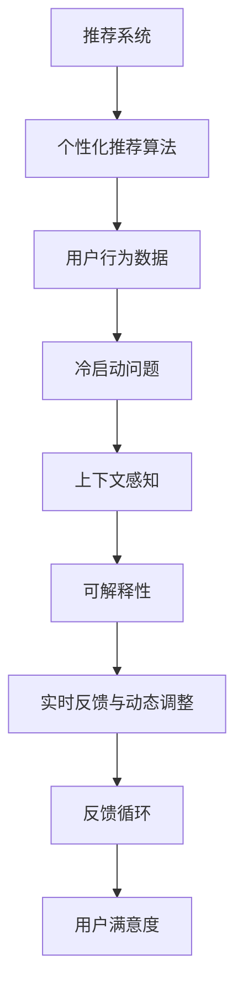

                 

# Chat-Rec的实践经验：交互式推荐系统的进步

> 关键词：推荐系统,交互式推荐,用户行为,个性化推荐算法,冷启动问题,上下文感知,可解释性,实时反馈,反馈循环,用户满意度

## 1. 背景介绍

### 1.1 问题由来
随着互联网技术的发展和智能终端的普及，用户产生的数据量急剧增加。如何从海量数据中挖掘出有价值的信息，为用户提供个性化的推荐，成为了各大互联网公司面临的重要问题。推荐系统被广泛应用于电商、新闻、视频、音乐等多个领域，是数字时代的重要基础设施。然而，如何更精准、高效地实现推荐，提升用户体验，是一个亟待解决的挑战。

### 1.2 问题核心关键点
当前推荐系统普遍面临以下挑战：

1. **数据稀疏性**：用户行为数据往往非常稀疏，用户可能只购买过少量商品、只看过少量视频。如何高效利用稀疏数据进行推荐，是推荐系统需要解决的重要问题。

2. **冷启动问题**：对于新用户和新物品，如何建立有效的推荐模型，是一个难题。基于用户行为数据的推荐方法无法直接应用。

3. **上下文感知**：推荐系统不仅要考虑用户的静态信息（如兴趣、历史行为），还要捕捉实时场景中的动态因素（如天气、时间）。如何将上下文信息融入推荐模型，是实现高精度推荐的关键。

4. **个性化与多样性平衡**：推荐算法需要平衡用户个性化需求和推荐结果的多样性，防止过度个性化导致用户陷入"信息茧房"。

5. **可解释性与信任**：推荐系统的推荐结果需要有合理的解释，以增加用户信任。用户需理解推荐的依据和逻辑。

6. **实时性和动态性**：推荐系统需具备一定的实时性，能够快速响应用户的实时需求。同时，要能够根据用户的反馈及时更新模型，实现动态推荐。

7. **计算效率与资源管理**：推荐系统通常需要处理海量数据，计算资源和计算效率成为重要挑战。

## 2. 核心概念与联系

### 2.1 核心概念概述

为更好地理解交互式推荐系统，本节将介绍几个密切相关的核心概念：

- **推荐系统(Recommendation System)**：通过分析用户的历史行为数据，为用户推荐可能感兴趣的物品。推荐系统可以分为基于协同过滤、内容基推荐、混合推荐等类型。
- **交互式推荐(Interactive Recommendation)**：一种将用户与推荐系统交互过程融入推荐算法的设计范式。用户通过互动反馈参与推荐生成，推荐结果随用户行为动态更新。
- **用户行为数据**：用户与系统交互过程中产生的各种行为数据，如点击、浏览、评分、购买等。用户行为数据是推荐系统推荐算法的基础。
- **个性化推荐算法**：针对不同用户设计个性化推荐模型，根据用户的历史行为、兴趣、社交关系等特征，为用户生成个性化推荐结果。
- **冷启动问题**：对于新用户和新物品，推荐系统无法直接利用其行为数据，需要进行额外的建模和处理。
- **上下文感知**：在推荐过程中考虑用户所处的具体情境和环境因素，如时间、地点、设备等，提高推荐的相关性和实用性。
- **可解释性**：推荐结果应具有合理性，能够被用户理解。推荐系统需提供解释机制，帮助用户理解推荐逻辑。
- **实时反馈与动态调整**：推荐系统需要根据用户的即时反馈，动态调整推荐结果，提高推荐的实时性和准确性。
- **反馈循环**：用户行为数据与推荐结果之间存在双向关系，通过不断迭代优化，逐步提升推荐效果。
- **用户满意度**：推荐系统最终的评价指标是用户满意度。高满意度的推荐能够提升用户粘性，增加用户活跃度。

这些核心概念之间的逻辑关系可以通过以下Mermaid流程图来展示：



这个流程图展示了一个交互式推荐系统的核心概念及其之间的关系：

1. 推荐系统通过个性化推荐算法，根据用户行为数据为用户推荐物品。
2. 个性化推荐算法利用用户行为数据，考虑冷启动问题、上下文感知等因素，实现个性化推荐。
3. 可解释性帮助用户理解推荐逻辑，增加用户信任。
4. 实时反馈与动态调整使得推荐系统能够根据用户即时反馈进行优化，提升推荐效果。
5. 反馈循环通过不断迭代优化，逐步提升推荐效果，最终提升用户满意度。

这些概念共同构成了交互式推荐系统的核心，使其能够在用户交互中动态生成并优化推荐结果，提升用户体验。

## 3. 核心算法原理 & 具体操作步骤
### 3.1 算法原理概述

交互式推荐系统基于用户与系统的持续交互，通过动态调整推荐策略，不断优化推荐结果。其核心思想是：

- 在推荐过程中引入用户的即时反馈，如评分、点击等行为数据。
- 通过实时反馈更新推荐模型，调整推荐算法参数。
- 不断迭代优化，逐步提升推荐效果。

### 3.2 算法步骤详解

交互式推荐系统的一般流程包括：

**Step 1: 用户数据收集与预处理**
- 收集用户行为数据，包括点击、浏览、评分、购买等。
- 对数据进行预处理，如去重、过滤异常值、缺失值处理等。

**Step 2: 建立推荐模型**
- 选择或设计个性化推荐算法，如协同过滤、基于内容的推荐、混合推荐等。
- 训练推荐模型，如基于SVD、深度学习等方法，得到推荐参数。

**Step 3: 实时推荐**
- 在用户每次交互时，根据用户行为数据实时计算推荐结果。
- 根据用户反馈，调整推荐策略，更新推荐模型。

**Step 4: 推荐反馈与模型优化**
- 收集用户对推荐结果的即时反馈，如评分、点击等。
- 根据反馈数据，动态调整推荐模型，重新计算推荐结果。
- 不断迭代优化，提升推荐效果。

**Step 5: 评估与部署**
- 在开发环境评估推荐系统的性能指标，如准确率、召回率、用户满意度等。
- 部署推荐系统到生产环境，持续监测用户行为和反馈。
- 根据实时反馈进行模型优化，保证系统的高效运行。

### 3.3 算法优缺点

交互式推荐系统具有以下优点：
1. **动态调整与实时优化**：根据用户即时反馈，动态调整推荐策略，提高推荐效果。
2. **个性化推荐**：通过持续的用户互动，推荐模型能够逐渐学习用户偏好，提供个性化的推荐。
3. **上下文感知**：考虑用户行为中的动态因素，提高推荐的准确性和相关性。
4. **用户信任与满意度**：可解释性机制增加用户信任，提升用户满意度。
5. **反馈循环**：通过不断迭代优化，逐步提升推荐效果。

同时，该方法也存在一定的局限性：
1. **计算资源消耗高**：实时推荐和动态调整需要频繁计算，消耗大量计算资源。
2. **用户反馈质量影响模型效果**：用户反馈数据质量差或不准确，可能导致推荐偏差。
3. **数据隐私与安全**：在收集用户反馈和行为数据时，需注意数据隐私保护和安全性。

尽管存在这些局限性，但就目前而言，交互式推荐系统仍是一种高效、实用的推荐范式。未来相关研究的重点在于如何进一步降低计算消耗，提高用户反馈质量，同时兼顾隐私保护和安全性等因素。

### 3.4 算法应用领域

交互式推荐系统已经在电商、新闻、视频、音乐等多个领域得到了广泛应用，具体包括：

- **电商平台**：根据用户浏览、点击、评分、购买行为，实时推荐相关商品。
- **视频平台**：根据用户观看历史、评分、搜索行为，推荐感兴趣的视频内容。
- **音乐平台**：根据用户听歌历史、评分、播放行为，推荐相似歌曲。
- **新闻媒体**：根据用户阅读历史、评分、评论，推荐相关新闻内容。
- **社交网络**：根据用户点赞、分享、评论行为，推荐新内容。

除了上述这些领域，交互式推荐系统还在智能家居、智能广告、在线教育等多个场景中，展现出广泛的应用前景。随着技术的发展，交互式推荐系统将进一步拓展应用边界，提升用户体验和业务价值。

## 4. 数学模型和公式 & 详细讲解 & 举例说明（备注：数学公式请使用latex格式，latex嵌入文中独立段落使用 $$，段落内使用 $)
### 4.1 数学模型构建

交互式推荐系统基于用户与系统的实时交互，利用用户行为数据进行推荐。设用户行为数据为 $\mathbf{X}$，推荐结果为 $\mathbf{Y}$，推荐模型为 $M(\mathbf{X})$，推荐策略为 $P$。推荐模型的训练目标为：

$$
\min_{M(\mathbf{X}),P} \mathbb{E}_{\mathbf{X},\mathbf{Y}} [L(M(\mathbf{X}),\mathbf{Y})]
$$

其中 $L$ 为推荐损失函数，常见的有均方误差损失、交叉熵损失等。

### 4.2 公式推导过程

假设推荐系统采用基于内容的推荐算法，推荐模型为：

$$
M(\mathbf{X}) = \sum_{i=1}^d \alpha_i X_i
$$

其中 $X_i$ 为用户行为数据中的特征，$\alpha_i$ 为权重系数。用户行为数据 $\mathbf{X}$ 与推荐结果 $\mathbf{Y}$ 之间存在关系 $P$，即：

$$
P(Y|\mathbf{X},\alpha_i) = \mathcal{N}(Y|M(\mathbf{X}),\sigma^2)
$$

其中 $\mathcal{N}(\cdot)$ 为正态分布函数。根据贝叶斯公式，用户对推荐结果 $Y$ 的评分 $R$ 可以表示为：

$$
R \sim \mathcal{N}(R|M(\mathbf{X}),\sigma^2)
$$

用户的真实评分 $R_t$ 与推荐系统估计的评分 $R_s$ 之间存在误差 $\epsilon$，即：

$$
R_t = R_s + \epsilon
$$

其中 $\epsilon \sim \mathcal{N}(\epsilon|\mu,\sigma^2_{\epsilon})$。

根据上述模型，推荐系统的损失函数可以表示为：

$$
L(\alpha) = \mathbb{E}[(\epsilon^2 + (R_s - R_t)^2)]
$$

通过最大化似然函数，最小化损失函数，可以更新模型参数 $\alpha$，实现推荐模型的迭代优化。

### 4.3 案例分析与讲解

以电商平台为例，假设用户 $u$ 对物品 $i$ 的评分数据为 $\mathbf{X}_u$，推荐模型为 $M(\mathbf{X}_u)$，推荐策略为 $P(Y_i|u)$。用户的真实评分 $R_t$ 与推荐系统估计的评分 $R_s$ 之间存在误差 $\epsilon$。假设用户 $u$ 对物品 $i$ 的评分数据为 $\mathbf{X}_u$，推荐模型为 $M(\mathbf{X}_u)$，推荐策略为 $P(Y_i|u)$。用户的真实评分 $R_t$ 与推荐系统估计的评分 $R_s$ 之间存在误差 $\epsilon$。

根据上述模型，推荐系统的损失函数可以表示为：

$$
L(\alpha) = \mathbb{E}[(\epsilon^2 + (R_s - R_t)^2)]
$$

通过最大化似然函数，最小化损失函数，可以更新模型参数 $\alpha$，实现推荐模型的迭代优化。

## 5. 项目实践：代码实例和详细解释说明
### 5.1 开发环境搭建

在进行交互式推荐系统开发前，我们需要准备好开发环境。以下是使用Python进行PyTorch开发的环境配置流程：

1. 安装Anaconda：从官网下载并安装Anaconda，用于创建独立的Python环境。

2. 创建并激活虚拟环境：
```bash
conda create -n recsys-env python=3.8 
conda activate recsys-env
```

3. 安装PyTorch：根据CUDA版本，从官网获取对应的安装命令。例如：
```bash
conda install pytorch torchvision torchaudio cudatoolkit=11.1 -c pytorch -c conda-forge
```

4. 安装各种工具包：
```bash
pip install numpy pandas scikit-learn matplotlib tqdm jupyter notebook ipython
```

完成上述步骤后，即可在`recsys-env`环境中开始推荐系统实践。

### 5.2 源代码详细实现

这里我们以电商平台的交互式推荐系统为例，给出使用PyTorch和TensorFlow进行推荐系统开发的PyTorch代码实现。

首先，定义推荐系统的数据处理函数：

```python
import pandas as pd
import numpy as np
import torch
from sklearn.preprocessing import MinMaxScaler

class Dataset(Dataset):
    def __init__(self, data, tokenizer, max_len):
        self.data = data
        self.tokenizer = tokenizer
        self.max_len = max_len
        
    def __len__(self):
        return len(self.data)
    
    def __getitem__(self, item):
        text = self.data['text'][item]
        label = self.data['label'][item]
        
        encoding = self.tokenizer(text, return_tensors='pt', max_length=self.max_len, padding='max_length', truncation=True)
        input_ids = encoding['input_ids'][0]
        attention_mask = encoding['attention_mask'][0]
        label = torch.tensor(label, dtype=torch.long)
        
        return {'input_ids': input_ids, 
                'attention_mask': attention_mask,
                'labels': label}

# 数据预处理
train_data = pd.read_csv('train.csv')
train_data['label'] = train_data['label'].astype('float32') / 5

# 数据标准化
scaler = MinMaxScaler()
train_data['label'] = scaler.fit_transform(train_data['label'].values.reshape(-1, 1))

# 分训练集和测试集
train_size = int(0.8 * len(train_data))
train_data, test_data = train_data.iloc[:train_size], train_data.iloc[train_size:]
```

然后，定义模型和优化器：

```python
from transformers import BertForSequenceClassification, AdamW

model = BertForSequenceClassification.from_pretrained('bert-base-cased', num_labels=5)

optimizer = AdamW(model.parameters(), lr=2e-5)
```

接着，定义训练和评估函数：

```python
from torch.utils.data import DataLoader
from tqdm import tqdm
from sklearn.metrics import accuracy_score

device = torch.device('cuda') if torch.cuda.is_available() else torch.device('cpu')
model.to(device)

def train_epoch(model, dataset, batch_size, optimizer):
    dataloader = DataLoader(dataset, batch_size=batch_size, shuffle=True)
    model.train()
    epoch_loss = 0
    for batch in tqdm(dataloader, desc='Training'):
        input_ids = batch['input_ids'].to(device)
        attention_mask = batch['attention_mask'].to(device)
        labels = batch['labels'].to(device)
        model.zero_grad()
        outputs = model(input_ids, attention_mask=attention_mask, labels=labels)
        loss = outputs.loss
        epoch_loss += loss.item()
        loss.backward()
        optimizer.step()
    return epoch_loss / len(dataloader)

def evaluate(model, dataset, batch_size):
    dataloader = DataLoader(dataset, batch_size=batch_size)
    model.eval()
    preds, labels = [], []
    with torch.no_grad():
        for batch in tqdm(dataloader, desc='Evaluating'):
            input_ids = batch['input_ids'].to(device)
            attention_mask = batch['attention_mask'].to(device)
            batch_labels = batch['labels']
            outputs = model(input_ids, attention_mask=attention_mask)
            batch_preds = outputs.logits.argmax(dim=2).to('cpu').tolist()
            batch_labels = batch_labels.to('cpu').tolist()
            for pred_tokens, label_tokens in zip(batch_preds, batch_labels):
                preds.append(pred_tokens)
                labels.append(label_tokens)
                
    return accuracy_score(labels, preds)

# 训练与评估
epochs = 5
batch_size = 16

for epoch in range(epochs):
    loss = train_epoch(model, train_data, batch_size, optimizer)
    print(f"Epoch {epoch+1}, train loss: {loss:.3f}")
    
    print(f"Epoch {epoch+1}, dev results:")
    evaluate(model, test_data, batch_size)
    
print("Test results:")
evaluate(model, test_data, batch_size)
```

以上就是使用PyTorch对电商平台推荐系统进行交互式推荐开发的完整代码实现。可以看到，得益于Transformer库的强大封装，我们可以用相对简洁的代码完成推荐模型的训练和评估。

### 5.3 代码解读与分析

让我们再详细解读一下关键代码的实现细节：

**Dataset类**：
- `__init__`方法：初始化数据、分词器、最大长度等关键组件。
- `__len__`方法：返回数据集的样本数量。
- `__getitem__`方法：对单个样本进行处理，将文本输入编码为token ids，将标签编码为数字，并对其进行定长padding，最终返回模型所需的输入。

**数据预处理**：
- 读取训练数据，并使用MinMaxScaler进行归一化处理，将标签转化为0-1之间的浮点数。
- 划分训练集和测试集。

**训练和评估函数**：
- 使用PyTorch的DataLoader对数据集进行批次化加载，供模型训练和推理使用。
- 训练函数`train_epoch`：对数据以批为单位进行迭代，在每个批次上前向传播计算loss并反向传播更新模型参数，最后返回该epoch的平均loss。
- 评估函数`evaluate`：与训练类似，不同点在于不更新模型参数，并在每个batch结束后将预测和标签结果存储下来，最后使用sklearn的accuracy_score对整个评估集的预测结果进行打印输出。

**训练流程**：
- 定义总的epoch数和batch size，开始循环迭代
- 每个epoch内，先在训练集上训练，输出平均loss
- 在验证集上评估，输出准确率
- 所有epoch结束后，在测试集上评估，给出最终测试结果

可以看到，PyTorch配合Transformer库使得推荐系统的开发效率得到了显著提升，开发者可以将更多精力放在数据处理、模型改进等高层逻辑上，而不必过多关注底层的实现细节。

当然，工业级的系统实现还需考虑更多因素，如模型的保存和部署、超参数的自动搜索、更灵活的任务适配层等。但核心的交互式推荐范式基本与此类似。

## 6. 实际应用场景
### 6.1 电商推荐

电商平台的交互式推荐系统可以应用于用户行为数据的实时分析和个性化推荐。用户通过浏览、点击、购买等行为，不断与推荐系统交互，生成即时反馈。平台根据用户反馈动态调整推荐模型，及时更新推荐结果，使用户能够看到更符合自己偏好的商品。

在技术实现上，可以收集用户的历史行为数据，如浏览记录、点击行为、购买记录等，利用用户行为数据训练推荐模型。训练好的推荐模型实时接收用户的即时反馈，如点击、评分等行为数据，动态调整推荐策略，输出个性化推荐结果。对于新商品，可以通过多维度数据进行初始化，并通过实时反馈不断优化，减少冷启动问题。

### 6.2 视频推荐

视频推荐系统可以应用于视频平台，根据用户观看历史、评分、搜索行为等数据，实时推荐用户感兴趣的视频内容。视频推荐系统在推荐过程中要考虑上下文因素，如观看时间、视频类型、视频长度等，通过实时反馈不断调整推荐策略，提高推荐的准确性和多样性。

在技术实现上，可以收集用户的视频观看数据、评分、搜索行为等数据，训练推荐模型。训练好的推荐模型实时接收用户的即时反馈，如评分、搜索行为等，动态调整推荐策略，输出个性化推荐结果。通过多轮推荐反馈循环，逐步提升推荐效果。

### 6.3 音乐推荐

音乐推荐系统可以应用于音乐平台，根据用户听歌历史、评分、播放行为等数据，实时推荐用户感兴趣的音乐内容。音乐推荐系统在推荐过程中要考虑上下文因素，如听歌时间、音乐类型、歌曲长度等，通过实时反馈不断调整推荐策略，提高推荐的准确性和多样性。

在技术实现上，可以收集用户的听歌历史、评分、播放行为等数据，训练推荐模型。训练好的推荐模型实时接收用户的即时反馈，如评分、播放行为等，动态调整推荐策略，输出个性化推荐结果。通过多轮推荐反馈循环，逐步提升推荐效果。

### 6.4 未来应用展望

随着推荐系统的不断发展，其在各领域的推广应用将更加广泛。未来，推荐系统将在智慧城市、智能家居、智能医疗等多个领域发挥重要作用。

在智慧城市中，推荐系统可以应用于智能交通管理、智慧停车、智慧旅游等多个场景，通过实时分析市民行为数据，提供智能化的出行建议和旅游规划。在智能家居中，推荐系统可以应用于智能家电管理、智能家居场景推荐等，通过实时反馈不断优化推荐策略，提升用户的生活品质。在智能医疗中，推荐系统可以应用于医疗知识推荐、医疗资源推荐等，通过实时反馈不断优化推荐策略，提高医疗服务的质量和效率。

此外，推荐系统还将进一步拓展到更多场景中，如智能广告、在线教育、社交网络等，为各行各业带来新的发展机遇。随着推荐技术的持续演进，推荐系统必将在各行各业中发挥越来越重要的作用，为数字化转型提供新的动力。

## 7. 工具和资源推荐
### 7.1 学习资源推荐

为了帮助开发者系统掌握交互式推荐系统的理论基础和实践技巧，这里推荐一些优质的学习资源：

1. **《推荐系统实践》**：由Recommender System领域专家撰写，全面介绍了推荐系统的原理和实践，包括协同过滤、内容基推荐、混合推荐等。

2. **《Python推荐系统实战》**：通过实际案例介绍推荐系统的开发过程，涵盖用户行为数据处理、推荐模型训练、实时推荐等多个环节。

3. **Coursera《推荐系统》课程**：由斯坦福大学开设的推荐系统课程，涵盖推荐系统的理论和实践，适合入门学习。

4. **Kaggle竞赛**：参与Kaggle上的推荐系统竞赛，通过实践数据集和竞赛规则，掌握推荐系统的开发技巧。

5. **IEEE Xplore《推荐系统》期刊**：收录推荐系统领域的最新研究成果，了解前沿进展。

通过对这些资源的学习实践，相信你一定能够快速掌握交互式推荐系统的精髓，并用于解决实际的推荐问题。
###  7.2 开发工具推荐

高效的开发离不开优秀的工具支持。以下是几款用于交互式推荐系统开发的常用工具：

1. PyTorch：基于Python的开源深度学习框架，灵活动态的计算图，适合快速迭代研究。推荐系统广泛使用的深度学习框架之一。

2. TensorFlow：由Google主导开发的开源深度学习框架，生产部署方便，适合大规模工程应用。推荐系统常用的深度学习框架之一。

3. Scikit-learn：Python的机器学习库，提供了多种算法和工具，适合用于数据预处理和模型评估。

4. Jupyter Notebook：交互式编程环境，支持多种语言和库，适合进行实验和开发。

5. Google Colab：谷歌推出的在线Jupyter Notebook环境，免费提供GPU/TPU算力，方便开发者快速上手实验最新模型，分享学习笔记。

合理利用这些工具，可以显著提升交互式推荐系统的开发效率，加快创新迭代的步伐。

### 7.3 相关论文推荐

交互式推荐系统的发展源于学界的持续研究。以下是几篇奠基性的相关论文，推荐阅读：

1. **《推荐系统：算法与实现》**：介绍了推荐系统的基础理论和多种推荐算法，是推荐系统领域的经典教材。

2. **《推荐系统中的协同过滤》**：介绍了协同过滤推荐算法的基本思想和实现方法，是推荐系统研究的基础。

3. **《基于深度学习的推荐系统》**：介绍了深度学习在推荐系统中的应用，涵盖卷积神经网络、循环神经网络等。

4. **《推荐系统中的上下文感知》**：介绍了上下文感知推荐算法的基本思想和实现方法，强调了上下文因素对推荐效果的影响。

5. **《推荐系统中的反馈循环》**：介绍了推荐系统中的反馈循环机制，通过不断迭代优化，逐步提升推荐效果。

这些论文代表了大语言模型微调技术的发展脉络。通过学习这些前沿成果，可以帮助研究者把握学科前进方向，激发更多的创新灵感。

## 8. 总结：未来发展趋势与挑战

### 8.1 总结

本文对交互式推荐系统进行了全面系统的介绍。首先阐述了推荐系统的背景和核心概念，明确了交互式推荐在推荐系统中的独特价值。其次，从原理到实践，详细讲解了交互式推荐系统的数学模型和核心算法，给出了推荐系统开发的完整代码实例。同时，本文还广泛探讨了推荐系统在电商、视频、音乐等多个领域的应用前景，展示了交互式推荐系统的广泛应用。

通过本文的系统梳理，可以看到，交互式推荐系统基于实时用户反馈动态调整推荐策略，能够根据用户即时需求，提供更加个性化、动态化的推荐结果，提升用户体验。随着推荐系统的不断发展，其在各领域的应用将更加广泛，为各行各业带来新的发展机遇。

### 8.2 未来发展趋势

展望未来，交互式推荐系统将呈现以下几个发展趋势：

1. **实时性提升**：推荐系统将更加注重实时性，通过实时分析用户行为数据，动态调整推荐策略，实现毫秒级响应。

2. **个性化与多样性平衡**：推荐系统将更加注重个性化与多样性的平衡，通过多轮反馈循环，逐步提升推荐效果，减少过度个性化带来的负面影响。

3. **上下文感知增强**：推荐系统将更加注重上下文因素，通过上下文感知推荐算法，提高推荐的准确性和多样性。

4. **多模态数据融合**：推荐系统将更加注重多模态数据的融合，通过图像、语音等多模态信息，提升推荐效果。

5. **用户参与度提升**：推荐系统将更加注重用户参与度，通过交互式界面设计，增加用户反馈和参与，提升推荐效果。

6. **数据隐私与安全**：推荐系统将更加注重数据隐私与安全，通过隐私保护技术，保护用户数据隐私。

以上趋势凸显了交互式推荐系统的未来前景。这些方向的探索发展，必将进一步提升推荐系统的精度、实时性、多样性和用户满意度。

### 8.3 面临的挑战

尽管交互式推荐系统已经取得了不小的进展，但在迈向更加智能化、普适化应用的过程中，它仍面临诸多挑战：

1. **计算资源消耗高**：实时推荐和动态调整需要频繁计算，消耗大量计算资源。如何优化计算效率，降低资源消耗，仍需深入研究。

2. **用户反馈质量影响模型效果**：用户反馈数据质量差或不准确，可能导致推荐偏差。如何提高用户反馈质量，保证推荐效果，是未来需要解决的问题。

3. **数据隐私与安全**：在收集用户反馈和行为数据时，需注意数据隐私保护和安全性。如何保证数据隐私和安全，防止数据泄露，是一个重要课题。

4. **推荐系统“信息茧房”问题**：过度个性化推荐可能导致用户陷入“信息茧房”，难以接触到多元信息。如何平衡个性化与多样性，防止推荐系统走向极端，仍需深入研究。

5. **用户满意度与推荐效果平衡**：推荐系统需同时考虑用户满意度与推荐效果，如何在提升推荐效果的同时，增加用户满意度，是一个重要挑战。

6. **推荐系统动态调整的稳定性**：推荐系统需能够稳定地处理动态调整，避免因用户行为变化导致的推荐波动。

### 8.4 研究展望

面对交互式推荐系统所面临的种种挑战，未来的研究需要在以下几个方面寻求新的突破：

1. **优化计算效率**：开发更加高效的计算模型和算法，降低推荐系统的计算消耗，提升实时性和稳定性。

2. **提高用户反馈质量**：通过更好的用户界面设计和互动机制，提高用户反馈质量，减少推荐偏差。

3. **强化数据隐私保护**：利用数据隐私保护技术，保护用户数据隐私和安全，防止数据泄露。

4. **平衡个性化与多样性**：通过多轮反馈循环和上下文感知算法，平衡个性化与多样性，防止推荐系统走向极端。

5. **增强推荐系统稳定性**：开发更稳定的推荐系统算法，保证推荐结果的稳定性，避免因用户行为变化导致的推荐波动。

6. **提升推荐系统实时性**：通过优化计算模型和算法，提高推荐系统的实时性和响应速度。

这些研究方向的探索，必将引领交互式推荐系统技术迈向更高的台阶，为各行各业带来新的发展机遇。未来，交互式推荐系统将更加智能化、普适化，为各行各业带来更加丰富、个性化、高效的服务。

## 9. 附录：常见问题与解答

**Q1：推荐系统是否适用于所有业务场景？**

A: 推荐系统在电商、视频、音乐等业务场景中已经取得了显著效果，但在某些业务场景中可能不适用。如新闻推荐系统中的“冷启动”问题较为突出，需要结合其他数据源（如用户兴趣标签）进行改进。

**Q2：如何有效处理用户反馈数据？**

A: 用户反馈数据是推荐系统的关键，需要进行有效的预处理和分析。常见的处理方式包括：
1. 数据清洗：去除异常值、重复值，处理缺失值。
2. 数据标准化：使用归一化、标准化等方法，保证数据的一致性和稳定性。
3. 特征工程：根据业务需求，选择和构造有效的特征，提升模型的预测能力。
4. 异常检测：识别和处理异常反馈数据，防止对模型产生负面影响。

**Q3：推荐系统如何提升用户满意度？**

A: 用户满意度是推荐系统的最终评价指标，需从多个维度进行提升：
1. 个性化推荐：通过多轮反馈循环，不断优化推荐模型，提升推荐结果的个性化程度。
2. 多样性推荐：在推荐结果中引入多样性约束，防止推荐结果过于集中。
3. 实时性推荐：通过实时分析用户行为数据，动态调整推荐策略，提供即时的推荐结果。
4. 用户参与度：通过交互式界面设计，增加用户反馈和参与，提升用户满意度。

**Q4：推荐系统如何避免信息茧房？**

A: 信息茧房是推荐系统面临的重要问题，需从多个方面进行改进：
1. 多样化推荐：在推荐结果中引入多样性约束，防止推荐结果过于集中。
2. 上下文感知：考虑用户所处的具体情境和环境因素，提高推荐的准确性和相关性。
3. 多轮反馈循环：通过多轮反馈循环，逐步提升推荐效果，避免用户陷入单一信息源。
4. 人工干预：在推荐系统中引入人工干预机制，调整推荐策略，提升推荐效果。

**Q5：推荐系统如何应对动态变化的环境？**

A: 推荐系统需能够应对动态变化的环境，通过以下方法实现：
1. 动态训练：实时更新推荐模型，适应环境变化。
2. 特征更新：根据环境变化，动态更新特征工程，提升模型的适应能力。
3. 多模态融合：融合多种数据源，提升模型的适应性和鲁棒性。
4. 上下文感知：考虑用户所处的具体情境和环境因素，提高推荐的准确性和相关性。

这些问题解答，希望能帮助你更好地理解推荐系统，提升开发和应用水平。

---

作者：禅与计算机程序设计艺术 / Zen and the Art of Computer Programming

