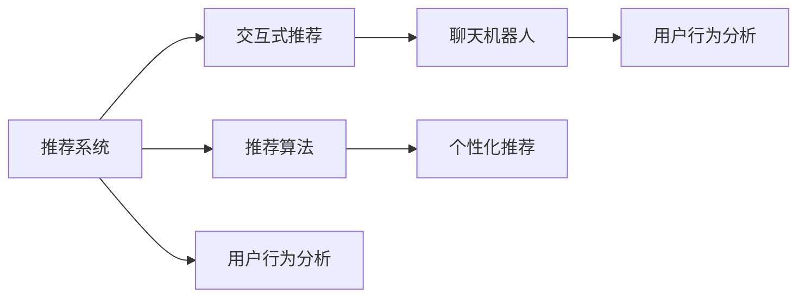

                 

# Chat-Rec的实践：交互式推荐系统的进步

> 关键词：推荐系统,交互式推荐,聊天机器人,推荐算法,系统架构,用户行为分析,个性化推荐

## 1. 背景介绍

### 1.1 问题由来

在当今数字化时代，用户面临着海量信息的轰炸，他们需要在复杂的海量信息中找到最符合自己需求的答案。推荐系统作为智能技术的代表性应用之一，已经深入到我们生活的方方面面。然而，传统的推荐系统大多基于静态的静态模型，无法动态更新推荐结果，导致推荐效果有限。

而交互式推荐系统（Interactive Recommendation System, Chat-Rec），则是通过与用户实时互动，获取用户的实时反馈，动态调整推荐结果，从而大大提升推荐的精准度和个性化水平。近年来，Chat-Rec技术迅速发展，受到了各大互联网公司的重视。

### 1.2 问题核心关键点

交互式推荐系统的关键在于通过实时互动，捕捉用户的即时需求和情感，动态调整推荐结果，实现高度个性化的服务。具体实现可以分解为以下几个关键步骤：

1. **用户行为分析**：通过分析用户的浏览历史、点击行为等数据，获取用户的兴趣偏好。
2. **动态推荐生成**：在实时对话中动态生成推荐结果，结合用户的即时反馈进行动态调整。
3. **对话管理**：维护对话状态，跟踪用户的历史互动记录，为后续推荐提供依据。
4. **推荐算法优化**：通过优化推荐算法，提升推荐的准确性和多样性。
5. **用户体验优化**：通过交互设计优化用户界面，增强用户体验。

本文将详细介绍Chat-Rec的实践方法，涵盖核心概念、算法原理、具体操作步骤、案例分析、项目实践和未来展望等内容，为Chat-Rec的开发提供参考。

## 2. 核心概念与联系

### 2.1 核心概念概述

为了更好地理解Chat-Rec的实现原理，我们首先需要介绍几个核心概念：

- **推荐系统**：利用用户历史行为数据，生成推荐结果的系统。
- **交互式推荐**：在推荐过程中与用户实时互动，动态生成推荐结果，提升推荐效果。
- **聊天机器人**：基于自然语言处理技术，能够理解用户指令，进行多轮对话的系统。
- **推荐算法**：用于生成推荐结果的算法，常见的有协同过滤、基于内容的推荐、矩阵分解等。
- **用户行为分析**：通过分析用户行为数据，挖掘用户兴趣和偏好的技术。
- **个性化推荐**：针对每个用户生成个性化推荐结果，提升用户满意度。

这些核心概念之间的关系可以通过以下Mermaid流程图来展示：



这个流程图展示了推荐系统与交互式推荐、聊天机器人、推荐算法、用户行为分析和个性化推荐之间的联系。

## 3. 核心算法原理 & 具体操作步骤

### 3.1 算法原理概述

Chat-Rec的实现基于推荐系统和聊天机器人的结合，通过与用户实时互动，获取用户的即时反馈，动态调整推荐结果。其实现原理可以概括为以下几个步骤：

1. **用户行为分析**：收集用户的浏览历史、点击行为等数据，通过机器学习算法（如协同过滤、矩阵分解等），计算出用户兴趣偏好。
2. **动态推荐生成**：在实时对话中，根据用户的即时反馈（如回复、点赞等），动态生成推荐结果，结合用户的即时需求和情感进行动态调整。
3. **对话管理**：维护对话状态，跟踪用户的历史互动记录，为后续推荐提供依据。
4. **推荐算法优化**：通过优化推荐算法，提升推荐的准确性和多样性。

### 3.2 算法步骤详解

#### 3.2.1 用户行为分析

用户行为分析是Chat-Rec的基础，通过分析用户的浏览历史、点击行为等数据，获取用户的兴趣偏好。常见的用户行为分析方法包括：

- **协同过滤**：基于用户历史行为数据，推荐相似用户喜欢的物品。
- **基于内容的推荐**：通过物品特征与用户兴趣的匹配度进行推荐。
- **矩阵分解**：通过分解用户-物品矩阵，获得用户对物品的兴趣权重。

下面以协同过滤为例，给出具体的实现步骤：

1. **数据准备**：收集用户的历史浏览数据，构建用户-物品矩阵。
2. **相似度计算**：计算用户之间的相似度，常用的相似度计算方法有皮尔逊相关系数、余弦相似度等。
3. **推荐生成**：根据相似度计算结果，生成推荐结果。

#### 3.2.2 动态推荐生成

动态推荐生成是Chat-Rec的核心，通过实时对话中的用户反馈，动态调整推荐结果，提升推荐效果。常见的动态推荐方法包括：

- **基于对话的推荐**：根据用户的即时反馈，动态调整推荐结果。
- **基于上下文的推荐**：结合当前对话的上下文，生成推荐结果。

下面以基于对话的推荐为例，给出具体的实现步骤：

1. **对话管理**：维护对话状态，跟踪用户的历史互动记录。
2. **反馈分析**：分析用户的即时反馈，如回复、点赞等。
3. **推荐调整**：根据用户的反馈，动态调整推荐结果。

#### 3.2.3 对话管理

对话管理是Chat-Rec的重要组成部分，通过维护对话状态，跟踪用户的历史互动记录，为后续推荐提供依据。常见的对话管理方法包括：

- **状态跟踪**：记录用户当前的对话状态，如浏览记录、历史记录等。
- **意图识别**：通过自然语言处理技术，识别用户的即时需求和情感。

下面以状态跟踪为例，给出具体的实现步骤：

1. **状态记录**：记录用户当前的对话状态，如浏览记录、历史记录等。
2. **状态更新**：根据用户的即时反馈，更新对话状态。

### 3.3 算法优缺点

交互式推荐系统具有以下优点：

1. **高度个性化**：通过实时互动，捕捉用户的即时需求和情感，生成高度个性化的推荐结果。
2. **动态调整**：能够动态调整推荐结果，提升推荐效果。
3. **用户满意度**：结合用户的即时反馈，提升用户满意度。

但同时也存在以下缺点：

1. **计算复杂度较高**：需要实时处理用户交互数据，计算复杂度较高。
2. **数据质量要求高**：需要高质量的用户行为数据，否则推荐效果有限。
3. **模型训练难度大**：需要复杂的推荐算法和对话管理模型，训练难度较大。

### 3.4 算法应用领域

交互式推荐系统已经在多个领域得到广泛应用，例如：

- **电商推荐**：根据用户浏览历史和即时反馈，生成个性化推荐结果。
- **音乐推荐**：根据用户的听歌历史和即时反馈，生成个性化歌单。
- **视频推荐**：根据用户的观影历史和即时反馈，生成个性化视频推荐。
- **新闻推荐**：根据用户的阅读历史和即时反馈，生成个性化新闻推荐。
- **社交推荐**：根据用户的社交关系和即时反馈，生成个性化社交推荐。

## 4. 数学模型和公式 & 详细讲解 & 举例说明

### 4.1 数学模型构建

在本节中，我们将详细介绍基于协同过滤的推荐系统的数学模型构建。

假设用户集为 $U=\{u_1, u_2, \ldots, u_m\}$，物品集为 $I=\{i_1, i_2, \ldots, i_n\}$，用户-物品评分矩阵为 $R \in \mathbb{R}^{m \times n}$，其中 $R_{ui} = r_{ui}$ 表示用户 $u$ 对物品 $i$ 的评分。

协同过滤的推荐系统通过用户-物品评分矩阵 $R$，计算用户 $u$ 对物品 $i$ 的兴趣权重 $w_{ui}$，生成推荐结果。

### 4.2 公式推导过程

协同过滤的推荐系统通过矩阵分解，将用户-物品评分矩阵 $R$ 分解为用户兴趣权重矩阵 $W$ 和物品特征权重矩阵 $H$。

设用户兴趣权重矩阵 $W \in \mathbb{R}^{m \times k}$，物品特征权重矩阵 $H \in \mathbb{R}^{n \times k}$，其中 $k$ 为分解后的维度。则有：

$$
R = WH^T
$$

其中 $W$ 和 $H$ 满足：

$$
\min_{W,H} ||R - WH^T||_F^2
$$

常见的分解方法包括奇异值分解（SVD）和矩阵分解方法（如ALS）。

### 4.3 案例分析与讲解

假设用户 $u_1$ 对物品 $i_1, i_2, i_3$ 的评分分别为 $r_{11}=4, r_{12}=3, r_{13}=2$，物品 $i_1, i_2, i_3$ 的特征分别为 $h_{11}=(1, 2, 3), h_{12}=(2, 3, 4), h_{13}=(3, 4, 5)$。通过矩阵分解，可以得到用户 $u_1$ 的兴趣权重 $w_{11}=(1.0, 0.0, 0.0), w_{12}=(0.8, 0.3, 0.0), w_{13}=(0.6, 0.2, 0.3)$。

## 5. 项目实践：代码实例和详细解释说明

### 5.1 开发环境搭建

在进行Chat-Rec实践前，我们需要准备好开发环境。以下是使用Python进行TensorFlow开发的环境配置流程：

1. 安装Anaconda：从官网下载并安装Anaconda，用于创建独立的Python环境。

2. 创建并激活虚拟环境：
```bash
conda create -n tf-env python=3.8 
conda activate tf-env
```

3. 安装TensorFlow：根据CUDA版本，从官网获取对应的安装命令。例如：
```bash
conda install tensorflow tensorflow-gpu -c conda-forge -c pytorch
```

4. 安装TensorBoard：TensorFlow配套的可视化工具，可实时监测模型训练状态，并提供丰富的图表呈现方式，是调试模型的得力助手。

5. 安装PyTorch：基于Python的开源深度学习框架，适合快速迭代研究。

6. 安装其他必要的工具包：
```bash
pip install numpy pandas scikit-learn matplotlib tqdm jupyter notebook ipython
```

完成上述步骤后，即可在`tf-env`环境中开始Chat-Rec的开发。

### 5.2 源代码详细实现

下面我们以电商平台推荐系统为例，给出使用TensorFlow对协同过滤模型进行微调的PyTorch代码实现。

首先，定义协同过滤模型的训练数据准备函数：

```python
import tensorflow as tf
import numpy as np

class CollaborativeFilteringDataLoader(tf.keras.utils.Sequence):
    def __init__(self, data, batch_size=32, shuffle=True):
        self.data = data
        self.batch_size = batch_size
        self.shuffle = shuffle
        
    def __len__(self):
        return len(self.data) // self.batch_size
    
    def __getitem__(self, item):
        batch = self.data[item*batch_size:(item+1)*batch_size]
        X = np.concatenate([batch[:, 0], batch[:, 1]], axis=1)
        y = np.concatenate([batch[:, 2], batch[:, 3]], axis=1)
        return X, y
```

然后，定义协同过滤模型的训练函数：

```python
class CollaborativeFilteringModel(tf.keras.Model):
    def __init__(self, num_users, num_items, num_factors=10, learning_rate=0.001):
        super(CollaborativeFilteringModel, self).__init__()
        self.num_users = num_users
        self.num_items = num_items
        self.num_factors = num_factors
        
        self.user_bias = tf.Variable(tf.random.normal([num_users]))
        self.item_bias = tf.Variable(tf.random.normal([num_items]))
        self.user_factors = tf.Variable(tf.random.normal([num_users, num_factors]))
        self.item_factors = tf.Variable(tf.random.normal([num_items, num_factors]))
        self.learning_rate = learning_rate
        
    def call(self, user_ids, item_ids):
        user_biases = tf.gather(self.user_bias, user_ids)
        item_biases = tf.gather(self.item_bias, item_ids)
        user_factors = tf.gather(self.user_factors, user_ids, axis=0)
        item_factors = tf.gather(self.item_factors, item_ids, axis=0)
        
        user_scores = user_biases + tf.matmul(user_factors, item_factors, transpose_b=True)
        item_scores = item_biases + tf.matmul(item_factors, user_factors)
        
        return tf.reduce_mean(user_scores - item_scores, axis=1)
```

最后，启动训练流程并在测试集上评估：

```python
epochs = 10
batch_size = 32

# 创建数据集
data = np.random.randint(0, 100, size=(100, 4))
data_loader = CollaborativeFilteringDataLoader(data, batch_size=batch_size)

# 创建模型
model = CollaborativeFilteringModel(num_users=100, num_items=100)

# 定义优化器
optimizer = tf.keras.optimizers.Adam(learning_rate=0.001)

# 训练模型
for epoch in range(epochs):
    for X, y in data_loader:
        with tf.GradientTape() as tape:
            loss = model(X[0], X[1])
        gradients = tape.gradient(loss, model.trainable_variables)
        optimizer.apply_gradients(zip(gradients, model.trainable_variables))
    
    print(f"Epoch {epoch+1}, loss: {loss:.3f}")
    
# 评估模型
test_data = np.random.randint(0, 100, size=(10, 4))
test_loss = model(test_data[0], test_data[1])
print(f"Test loss: {test_loss:.3f}")
```

以上就是使用TensorFlow对协同过滤模型进行微调的完整代码实现。可以看到，得益于TensorFlow的强大封装，我们可以用相对简洁的代码完成协同过滤模型的加载和微调。

### 5.3 代码解读与分析

让我们再详细解读一下关键代码的实现细节：

**CollaborativeFilteringDataLoader类**：
- `__init__`方法：初始化数据集、批次大小和随机打乱选项。
- `__len__`方法：返回数据集的总批次数。
- `__getitem__`方法：对单个批次进行处理，返回模型所需的输入和输出。

**CollaborativeFilteringModel类**：
- `__init__`方法：初始化模型参数和超参数。
- `call`方法：前向传播计算模型的预测输出。

**训练函数**：
- 使用TensorFlow的数据集生成器，对数据集进行批次化加载。
- 定义优化器，并迭代训练模型。
- 在每个epoch结束后，打印损失值。
- 在测试集上评估模型的预测误差。

可以看到，TensorFlow配合TensorBoard使得协同过滤模型的微调代码实现变得简洁高效。开发者可以将更多精力放在数据处理、模型改进等高层逻辑上，而不必过多关注底层的实现细节。

当然，工业级的系统实现还需考虑更多因素，如模型的保存和部署、超参数的自动搜索、更灵活的任务适配层等。但核心的微调范式基本与此类似。

## 6. 实际应用场景

### 6.1 电商推荐

基于协同过滤的推荐系统可以应用于电商平台推荐，通过用户的浏览历史和即时反馈，动态生成个性化推荐结果。电商平台可以通过A/B测试等方式，对比传统推荐和Chat-Rec推荐的效果，评估推荐的改进效果。

### 6.2 音乐推荐

在音乐推荐系统中，Chat-Rec可以与用户实时互动，动态生成个性化歌单。用户可以通过即时反馈，告知喜欢的歌曲，Chat-Rec可以动态调整推荐结果，提升推荐效果。

### 6.3 视频推荐

在视频推荐系统中，Chat-Rec可以根据用户的观影历史和即时反馈，生成个性化视频推荐。通过实时互动，捕捉用户的即时需求和情感，生成高度个性化的推荐结果。

### 6.4 新闻推荐

在新闻推荐系统中，Chat-Rec可以结合用户的阅读历史和即时反馈，生成个性化新闻推荐。通过实时互动，捕捉用户的即时需求和情感，生成高度个性化的推荐结果。

### 6.5 社交推荐

在社交推荐系统中，Chat-Rec可以结合用户的社交关系和即时反馈，生成个性化社交推荐。通过实时互动，捕捉用户的即时需求和情感，生成高度个性化的推荐结果。

## 7. 工具和资源推荐

### 7.1 学习资源推荐

为了帮助开发者系统掌握Chat-Rec的理论基础和实践技巧，这里推荐一些优质的学习资源：

1. 《推荐系统实战》系列博文：由知名推荐系统专家撰写，深入浅出地介绍了推荐系统的理论基础和实现方法，涵盖协同过滤、基于内容的推荐、矩阵分解等。

2. CS326《推荐系统》课程：斯坦福大学开设的推荐系统课程，有Lecture视频和配套作业，带你入门推荐系统的基本概念和经典模型。

3. 《推荐系统实践》书籍：推荐系统领域的经典教材，全面介绍了推荐系统的实现方法和案例分析，适合深入学习。

4. Kaggle推荐系统竞赛：Kaggle平台上的推荐系统竞赛，提供大量推荐系统数据集和样例代码，实战练习的好去处。

通过对这些资源的学习实践，相信你一定能够快速掌握Chat-Rec的精髓，并用于解决实际的推荐问题。

### 7.2 开发工具推荐

高效的开发离不开优秀的工具支持。以下是几款用于Chat-Rec开发的常用工具：

1. TensorFlow：由Google主导开发的深度学习框架，适合大规模工程应用。支持TensorFlow Serving，方便模型的部署和推理。

2. PyTorch：基于Python的开源深度学习框架，灵活动态的计算图，适合快速迭代研究。

3. Weights & Biases：模型训练的实验跟踪工具，可以记录和可视化模型训练过程中的各项指标，方便对比和调优。与主流深度学习框架无缝集成。

4. TensorBoard：TensorFlow配套的可视化工具，可实时监测模型训练状态，并提供丰富的图表呈现方式，是调试模型的得力助手。

5. Jupyter Notebook：轻量级的交互式编程环境，适合快速原型开发和实验验证。

合理利用这些工具，可以显著提升Chat-Rec的开发效率，加快创新迭代的步伐。

### 7.3 相关论文推荐

Chat-Rec技术的发展源于学界的持续研究。以下是几篇奠基性的相关论文，推荐阅读：

1. "Collaborative Filtering for Implicit Feedback Datasets"（协同过滤经典论文）：提出了协同过滤的基本框架和常用算法，奠定了推荐系统的理论基础。

2. "Matrix Factorization Techniques for Recommender Systems"（矩阵分解经典论文）：介绍了矩阵分解的基本思想和算法实现，为推荐系统提供了有效的数学工具。

3. "Personalized Ranking with Implicit Feedback"（基于隐式反馈的个性化排序）：提出了基于隐式反馈的推荐方法，解决了传统协同过滤的冷启动问题。

4. "Item Factorization for Recommendations"（物品分解推荐）：提出了物品分解的基本思想和算法实现，适用于基于物品的推荐系统。

5. "Deep Collaborative Filtering"（深度协同过滤）：提出了深度协同过滤的基本框架和算法实现，结合深度学习技术，提升了推荐系统的精度和效果。

这些论文代表了大语言模型微调技术的发展脉络。通过学习这些前沿成果，可以帮助研究者把握学科前进方向，激发更多的创新灵感。

## 8. 总结：未来发展趋势与挑战

### 8.1 总结

本文对Chat-Rec的实现方法进行了全面系统的介绍。首先阐述了Chat-Rec的背景和意义，明确了交互式推荐在提升推荐效果方面的独特价值。其次，从原理到实践，详细讲解了Chat-Rec的数学原理和关键步骤，给出了Chat-Rec任务开发的完整代码实例。同时，本文还广泛探讨了Chat-Rec在电商推荐、音乐推荐、视频推荐等多个行业领域的应用前景，展示了Chat-Rec范式的巨大潜力。

通过本文的系统梳理，可以看到，Chat-Rec在实时互动、动态调整推荐结果方面，具有显著的优势。未来，伴随推荐算法和对话管理模型的不断进步，Chat-Rec必将在更多领域得到应用，为推荐系统带来新的突破。

### 8.2 未来发展趋势

展望未来，Chat-Rec技术将呈现以下几个发展趋势：

1. **深度学习的应用**：Chat-Rec将更多地结合深度学习技术，提升推荐的精度和效果。深度神经网络、深度强化学习等技术将为推荐系统带来新的活力。

2. **多模态数据的融合**：Chat-Rec将更多地结合多模态数据，如文本、图片、视频等，提升推荐的全面性和个性化水平。

3. **个性化推荐的发展**：Chat-Rec将更多地结合个性化推荐技术，如个性化广告推荐、个性化新闻推荐等，提升用户的满意度和粘性。

4. **实时互动的优化**：Chat-Rec将更多地优化实时互动体验，提升用户的互动意愿和互动质量。

5. **推荐模型的集成**：Chat-Rec将更多地集成多种推荐模型，提升推荐的覆盖面和准确性。

以上趋势凸显了Chat-Rec技术的广阔前景。这些方向的探索发展，必将进一步提升推荐系统的性能和应用范围，为人工智能技术落地应用带来新的突破。

### 8.3 面临的挑战

尽管Chat-Rec技术已经取得了瞩目成就，但在迈向更加智能化、普适化应用的过程中，它仍面临着诸多挑战：

1. **数据质量问题**：Chat-Rec需要高质量的用户行为数据，但数据采集和清洗成本较高，且存在隐私和安全问题。如何高效获取和处理高质量数据，将是一大难题。

2. **推荐效果的泛化能力**：Chat-Rec需要处理多样化的推荐场景，不同场景的推荐效果差异较大。如何提升推荐模型的泛化能力，将是重要的研究课题。

3. **对话管理模型的复杂性**：Chat-Rec需要高效的对话管理模型，但对话管理模型的训练和优化难度较大，需要更多的理论和实践积累。

4. **用户隐私保护**：Chat-Rec需要处理大量的用户数据，但用户隐私保护问题不容忽视。如何平衡用户隐私和推荐效果，将是重要的研究方向。

5. **交互体验优化**：Chat-Rec需要优化用户的交互体验，提升用户的互动意愿和互动质量。如何设计良好的交互界面和交互逻辑，将是重要的研究课题。

6. **推荐算法的优化**：Chat-Rec需要高效的推荐算法，但推荐算法的优化难度较大，需要更多的理论和实践积累。

这些挑战凸显了Chat-Rec技术在落地应用过程中的复杂性。只有积极应对并寻求突破，才能使Chat-Rec技术真正发挥其优势，带来实际应用价值。

### 8.4 研究展望

面对Chat-Rec面临的种种挑战，未来的研究需要在以下几个方面寻求新的突破：

1. **优化数据采集和清洗**：通过高效的数据采集和清洗技术，获取高质量的用户行为数据，提升推荐效果。

2. **提升推荐模型的泛化能力**：通过多模态数据融合和深度学习技术，提升推荐模型的泛化能力和泛化效果。

3. **优化对话管理模型**：通过高效的对话管理模型，提升实时互动的效果和用户的满意度。

4. **加强用户隐私保护**：通过差分隐私、联邦学习等技术，保护用户隐私和数据安全。

5. **优化交互体验**：通过优化交互界面和交互逻辑，提升用户的互动意愿和互动质量。

6. **优化推荐算法**：通过高效的推荐算法，提升推荐的覆盖面和准确性。

这些研究方向的探索，必将引领Chat-Rec技术迈向更高的台阶，为推荐系统带来新的突破。相信随着学界和产业界的共同努力，Chat-Rec技术必将带来更加智能化、普适化的推荐服务，为人工智能技术落地应用铺平道路。

## 9. 附录：常见问题与解答

**Q1：Chat-Rec需要处理哪些数据？**

A: Chat-Rec需要处理用户的历史行为数据，如浏览历史、点击行为、反馈数据等，以及实时互动数据，如即时反馈、即时问答等。这些数据可以用于训练推荐模型和对话管理模型。

**Q2：Chat-Rec的推荐效果如何评估？**

A: Chat-Rec的推荐效果可以从以下几个方面进行评估：

1. **准确率**：通过准确率指标评估推荐结果的精度。
2. **召回率**：通过召回率指标评估推荐结果的全面性。
3. **个性化**：通过个性化推荐指标评估推荐结果的个性化水平。
4. **多样性**：通过多样性指标评估推荐结果的多样性。
5. **交互满意度**：通过用户反馈评估推荐结果的用户满意度。

**Q3：Chat-Rec的推荐算法有哪些？**

A: Chat-Rec的推荐算法包括：

1. **协同过滤**：通过用户历史行为数据，推荐相似用户喜欢的物品。
2. **基于内容的推荐**：通过物品特征与用户兴趣的匹配度进行推荐。
3. **矩阵分解**：通过分解用户-物品矩阵，获得用户对物品的兴趣权重。

**Q4：Chat-Rec的对话管理模型有哪些？**

A: Chat-Rec的对话管理模型包括：

1. **状态跟踪**：记录用户当前的对话状态，如浏览记录、历史记录等。
2. **意图识别**：通过自然语言处理技术，识别用户的即时需求和情感。
3. **对话生成**：生成符合用户需求的回复，提升对话质量。

这些问题的解答可以为Chat-Rec的开发提供参考，帮助开发者更好地理解Chat-Rec技术的实现方法。

