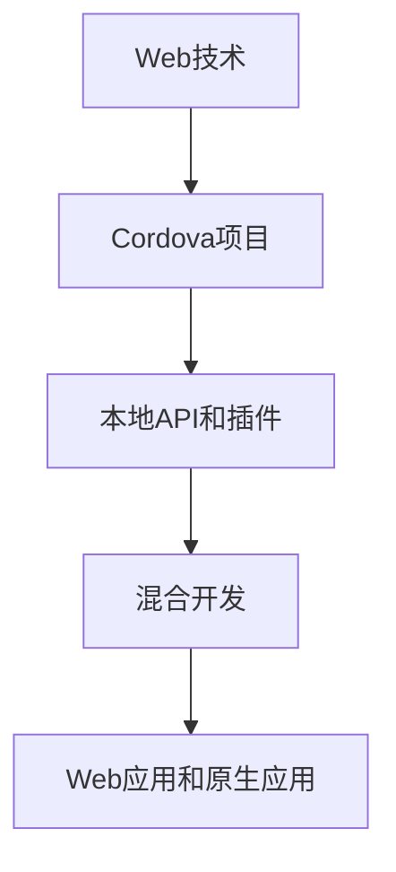

                 

# Cordova 框架：混合移动应用开发

## 1. 背景介绍

随着移动互联网的迅速发展，越来越多的企业希望构建跨平台的应用，以覆盖更广泛的终端用户。传统的原生应用开发方式虽然可以提供完美的用户体验，但开发成本高、部署复杂、维护困难。与此同时，Web技术以其跨平台特性受到广泛关注，但浏览器的性能瓶颈和用户体验问题难以解决。

在这种背景下，Cordova应运而生。作为一种基于Web技术的混合开发框架，Cordova能够帮助开发者通过使用HTML5、CSS3和JavaScript等Web技术，结合本地应用接口(APIs)和插件，构建跨平台的原生应用。Cordova在兼顾Web技术的便捷性和原生应用的性能之间，找到了一个完美的平衡点。

Cordova诞生于2010年，由Adobe公司主导开发，现在由Apache基金会维护。Cordova的成功在很大程度上得益于Web技术的进步和开放源代码社区的支持，吸引了大量开发者和企业用户使用。它已成为构建混合移动应用的重要工具之一，应用广泛，包括电商、金融、教育等多个领域。

## 2. 核心概念与联系

### 2.1 核心概念概述

要理解Cordova框架的原理和架构，首先需要掌握以下几个核心概念：

- **Web技术**：指基于HTML5、CSS3和JavaScript等标准技术的Web开发方式。这些技术成熟稳定，开发效率高，能够快速构建Web页面。
- **本地API和插件**：指在移动设备上提供的一系列API接口和插件，用于访问设备的硬件和软件资源，如摄像头、位置、通讯录等。通过这些API和插件，Web应用能够获得与原生应用相同的权限。
- **混合开发**：指将Web技术和本地API和插件相结合的开发方式，既利用了Web技术的便捷性，又借助了本地API和插件的强大功能，实现跨平台的原生应用开发。
- **Cordova项目**：指使用Cordova框架构建的混合移动应用。Cordova项目包含了HTML、CSS、JavaScript以及本地API和插件代码。
- **Web应用和原生应用**：Web应用指完全基于Web技术构建的应用，主要运行在浏览器中。原生应用指针对特定平台构建的应用，运行在操作系统提供的运行环境中。

### 2.2 核心概念原理和架构的 Mermaid 流程图



这个流程图展示了Web技术、Cordova项目、本地API和插件、混合开发以及Web应用和原生应用之间的联系。

## 3. 核心算法原理 & 具体操作步骤

### 3.1 算法原理概述

Cordova框架的核心原理在于将Web技术和本地API和插件相结合，实现跨平台的原生应用开发。其基本流程如下：

1. 在Web前端使用HTML5、CSS3和JavaScript等Web技术开发应用界面。
2. 通过Cordova提供的API和插件，访问设备硬件和软件资源。
3. 通过Cordova的框架功能，将Web应用编译为原生应用。
4. 原生应用运行在操作系统提供的运行环境中，提供与原生应用相同的用户体验。

### 3.2 算法步骤详解

#### 3.2.1 初始化Cordova项目

在开发Cordova项目之前，首先需要初始化一个Cordova项目。步骤如下：

1. 创建Cordova项目目录，例如`myapp`。
2. 在项目目录下运行以下命令：
```bash
cordova create myapp.com myapp
```
其中`myapp.com`为应用名称，`myapp`为应用目录名。
3. 进入项目目录：
```bash
cd myapp
```

#### 3.2.2 添加本地API和插件

Cordova支持大量本地API和插件，用于访问设备硬件和软件资源。步骤如下：

1. 在项目目录下运行以下命令，获取所需API和插件：
```bash
cordova plugin add https://npmjs.com/package/your-plugin-name
```
其中`https://npmjs.com/package/your-plugin-name`为插件的npm地址。
2. 在项目目录下的`config.xml`文件中，添加插件的名称和版本号：
```xml
<plugin name="your-plugin-name" source="npm" />
```

#### 3.2.3 构建和发布Cordova项目

完成Cordova项目的开发后，需要将项目编译为原生应用。步骤如下：

1. 在项目目录下运行以下命令，构建项目：
```bash
cordova build platform-name
```
其中`platform-name`为目标平台，如`ios`、`android`等。
2. 在构建成功后的目录下，运行以下命令，打包应用：
```bash
cordova prepare platform-name
```
3. 在打包成功后的目录下，运行以下命令，发布应用：
```bash
cordova install platform-name
```

### 3.3 算法优缺点

Cordova框架在混合开发领域具有以下优点：

- **跨平台**：使用Cordova框架，开发者可以一次编写代码，跨平台发布应用，大大降低了开发成本和维护难度。
- **高性能**：Cordova框架结合了Web技术和本地API和插件，实现了高性能的原生应用开发。
- **易于维护**：Web技术成熟稳定，开发者可以利用现有Web开发技术，快速构建应用界面。

同时，Cordova框架也存在一些缺点：

- **兼容性问题**：由于Cordova框架依赖于Web技术和本地API和插件，不同平台之间的兼容性问题仍然存在。
- **性能瓶颈**：Web技术和本地API和插件的结合，可能带来性能瓶颈，特别是网络通信、动画等复杂操作。
- **API限制**：某些本地API和插件可能需要特定平台支持，开发者需要谨慎选择。

### 3.4 算法应用领域

Cordova框架广泛应用于多个领域，包括但不限于：

- **电商应用**：如淘宝、京东等电商平台，使用Cordova框架开发了跨平台的移动应用，方便用户随时随地进行购物。
- **金融应用**：如支付宝、微信支付等金融应用，使用Cordova框架开发了跨平台的移动应用，方便用户进行资金管理和支付。
- **教育应用**：如学而思、新东方等教育机构，使用Cordova框架开发了跨平台的移动应用，方便学生和家长进行在线学习和管理。
- **游戏应用**：如王者荣耀、和平精英等游戏应用，使用Cordova框架开发了跨平台的移动应用，方便用户随时随地进行游戏。
- **企业应用**：如OA系统、CRM系统等企业应用，使用Cordova框架开发了跨平台的移动应用，方便员工随时随地进行办公和管理。

## 4. 数学模型和公式 & 详细讲解 & 举例说明

### 4.1 数学模型构建

Cordova框架的核心数学模型是基于Web技术和本地API和插件的混合开发模型。该模型主要包括以下几个组成部分：

- **Web模型**：基于HTML5、CSS3和JavaScript等Web技术，构建应用界面。
- **本地API模型**：提供一系列本地API，用于访问设备硬件和软件资源。
- **插件模型**：提供各种插件，用于实现Web技术访问本地API和插件的功能。
- **混合开发模型**：将Web模型、本地API模型和插件模型结合，实现跨平台的原生应用开发。

### 4.2 公式推导过程

Cordova框架的数学模型推导过程如下：

1. 使用Web技术构建应用界面，数学表达式为：
```math
HTML5 + CSS3 + JavaScript
```
2. 使用本地API访问设备硬件和软件资源，数学表达式为：
```math
local-API
```
3. 使用插件实现Web技术访问本地API和插件的功能，数学表达式为：
```math
plugin
```
4. 将Web模型、本地API模型和插件模型结合，实现跨平台的原生应用开发，数学表达式为：
```math
hybrid-app = Web-app + local-API + plugin
```

### 4.3 案例分析与讲解

以下是一个简单的Cordova项目示例，用于访问设备位置信息：

1. 在项目目录下运行以下命令，安装位置API插件：
```bash
cordova plugin add cordova-plugin-global-position
```
2. 在项目目录下的`config.xml`文件中，添加位置API插件：
```xml
<plugin name="cordova-plugin-global-position" />
```
3. 在项目目录下创建一个JavaScript文件，编写访问位置信息的代码：
```javascript
var position = navigator.geolocation.getCurrentPosition(function(position) {
  console.log("Latitude: " + position.coords.latitude);
  console.log("Longitude: " + position.coords.longitude);
});
```
4. 在项目目录下创建一个HTML文件，使用JavaScript代码获取位置信息：
```html
<!DOCTYPE html>
<html>
<head>
  <meta charset="utf-8">
  <title>获取位置信息</title>
</head>
<body>
  <script src="script.js"></script>
</body>
</html>
```

## 5. 项目实践：代码实例和详细解释说明

### 5.1 开发环境搭建

要在本地搭建Cordova开发环境，需要安装以下工具：

1. Node.js：Cordova框架依赖于Node.js环境。
2. npm：Node.js的包管理器，用于安装和更新Cordova框架。
3. Cordova CLI：Cordova命令行工具，用于管理Cordova项目。

安装完成后，进入项目目录，运行以下命令：
```bash
cordova create myapp.com myapp
cd myapp
cordova platform add ios
cordova platform add android
```

### 5.2 源代码详细实现

以下是一个简单的Cordova项目示例，用于访问设备位置信息：

1. 在项目目录下创建一个JavaScript文件，编写访问位置信息的代码：
```javascript
var position = navigator.geolocation.getCurrentPosition(function(position) {
  console.log("Latitude: " + position.coords.latitude);
  console.log("Longitude: " + position.coords.longitude);
});
```
2. 在项目目录下创建一个HTML文件，使用JavaScript代码获取位置信息：
```html
<!DOCTYPE html>
<html>
<head>
  <meta charset="utf-8">
  <title>获取位置信息</title>
</head>
<body>
  <script src="script.js"></script>
</body>
</html>
```
3. 在项目目录下创建一个`config.xml`文件，添加位置API插件：
```xml
<plugin name="cordova-plugin-global-position" />
```

### 5.3 代码解读与分析

**JavaScript代码**：
- `navigator.geolocation.getCurrentPosition()`方法用于获取设备的位置信息。
- `position.coords.latitude`和`position.coords.longitude`分别表示设备的纬度和经度。

**HTML文件**：
- `<script>`标签用于引入JavaScript文件。

**`config.xml`文件**：
- `<plugin>`标签用于添加本地API插件。

### 5.4 运行结果展示

在项目目录下运行以下命令，构建项目：
```bash
cordova build ios
cordova build android
```

构建成功后，在模拟器或设备上运行应用，可以看到设备的位置信息。

## 6. 实际应用场景

### 6.1 企业应用

Cordova框架在企业应用中广泛应用。例如，某企业开发了统一的OA系统，使用Cordova框架开发了跨平台的移动应用，方便员工随时随地进行办公和管理。

### 6.2 教育应用

某教育机构使用Cordova框架开发了跨平台的移动应用，方便学生和家长进行在线学习和管理。

### 6.3 电商应用

某电商平台使用Cordova框架开发了跨平台的移动应用，方便用户随时随地进行购物。

## 7. 工具和资源推荐

### 7.1 学习资源推荐

为了帮助开发者系统掌握Cordova框架的原理和应用，以下是一些优质的学习资源：

1. **Cordova官方文档**：Cordova官方文档提供了详细的API文档和教程，是学习Cordova框架的最佳入门资源。
2. **Cordova中文社区**：Cordova中文社区提供了丰富的中文教程和讨论区，方便开发者交流和学习。
3. **Cordova教程**：在Codrops、CSS-Tricks等网站上有大量关于Cordova框架的教程和示例，适合入门开发者。

### 7.2 开发工具推荐

Cordova框架的开发主要依赖以下工具：

1. **Visual Studio Code**：Visual Studio Code是一款轻量级的代码编辑器，支持Cordova框架的开发和调试。
2. **Xcode**：Xcode是苹果官方的IDE，用于开发iOS应用。
3. **Android Studio**：Android Studio是谷歌官方的IDE，用于开发Android应用。

### 7.3 相关论文推荐

以下几篇论文详细介绍了Cordova框架的原理和应用：

1. **Cordova: A cross-platform development tool for iOS and Android**：该论文介绍了Cordova框架的基本原理和应用，适合入门开发者。
2. **Cordova: Hybrid Development**：该论文详细介绍了Cordova框架的开发流程和最佳实践，适合有经验的开发者。
3. **Cordova: A Practical Guide for Beginners**：该论文提供了详细的Cordova框架入门指南和示例，适合初学者。

## 8. 总结：未来发展趋势与挑战

### 8.1 总结

本文对Cordova框架进行了全面系统的介绍。首先阐述了Cordova框架的背景和意义，明确了其在跨平台原生应用开发中的重要价值。其次，从原理到实践，详细讲解了Cordova框架的数学模型和操作步骤，给出了Cordova项目开发的完整代码实例。同时，本文还广泛探讨了Cordova框架在企业应用、教育应用、电商应用等领域的实际应用场景，展示了其巨大的应用潜力。此外，本文精选了Cordova框架的学习资源、开发工具和相关论文，力求为开发者提供全方位的技术指引。

通过本文的系统梳理，可以看到，Cordova框架在混合开发领域已经取得了显著成效，其强大的跨平台能力和便捷的开发体验，使其成为构建混合移动应用的重要工具之一。未来，随着Web技术和本地API和插件的不断发展，Cordova框架必将在更广泛的领域发挥更大的作用，为移动互联网应用的开发提供新的解决方案。

### 8.2 未来发展趋势

展望未来，Cordova框架的发展趋势主要包括以下几个方面：

1. **Web技术的不断进步**：Web技术的发展，如WebAssembly、WebVR等，将进一步提升Web应用的性能和用户体验，为Cordova框架提供更多的功能和优化方案。
2. **本地API和插件的完善**：随着移动设备硬件和软件资源的不断丰富，本地API和插件将更加完善，支持更多的设备功能和跨平台特性。
3. **混合开发的优化**：Cordova框架将继续优化Web技术和本地API和插件的结合方式，提升混合开发的性能和用户体验。
4. **跨平台开发的统一标准**：Cordova框架将推动跨平台开发的统一标准，使得不同平台之间的应用能够更加顺畅地互操作。
5. **新平台的支持**：Cordova框架将不断扩展对新平台的支持，如WebAssembly平台、ARKit等，拓展应用场景。

### 8.3 面临的挑战

尽管Cordova框架已经取得了一定成就，但在迈向更加智能化、普适化应用的过程中，它仍面临以下挑战：

1. **性能瓶颈**：Web技术和本地API和插件的结合可能带来性能瓶颈，特别是在网络通信、动画等复杂操作上。
2. **兼容性问题**：不同平台之间的兼容性问题仍然存在，需要不断优化和调整。
3. **API限制**：某些本地API和插件可能需要特定平台支持，开发者需要谨慎选择。
4. **安全性问题**：Cordova框架涉及跨平台访问设备资源，可能存在安全隐患，需要加强安全防护措施。
5. **开发成本**：Cordova框架的开发需要一定的技术门槛，需要开发者具备一定的Web开发和本地API和插件开发经验。

### 8.4 研究展望

面对Cordova框架面临的这些挑战，未来的研究需要在以下几个方面寻求新的突破：

1. **性能优化**：进一步优化Web技术和本地API和插件的结合方式，提升混合应用的性能和用户体验。
2. **兼容性提升**：解决不同平台之间的兼容性问题，推动跨平台开发的统一标准。
3. **API拓展**：引入更多本地API和插件，支持更多的设备功能和跨平台特性。
4. **安全性保障**：加强Cordova框架的安全防护措施，保障数据和应用的安全性。
5. **开发工具改进**：开发更加便捷和高效的开发工具，降低Cordova框架的开发门槛。

总之，Cordova框架作为混合开发的重要工具，在未来的发展中将面临更多的挑战和机遇。只有不断优化和改进，才能在跨平台原生应用开发领域持续发挥重要作用。

## 9. 附录：常见问题与解答

**Q1: Cordova框架和React Native的区别是什么？**

A: Cordova框架是基于Web技术的混合开发框架，而React Native是基于原生技术栈的混合开发框架。Cordova框架更注重Web技术和本地API和插件的结合，适合对性能要求不高的场景。React Native框架更注重代码复用和原生体验，适合对性能要求较高的场景。

**Q2: 如何使用Cordova框架访问本地API？**

A: 使用Cordova框架访问本地API需要先安装相应的API插件。例如，要访问设备位置信息，可以使用`cordova-plugin-global-position`插件。在`config.xml`文件中添加该插件，并在JavaScript代码中使用相应的API方法。

**Q3: Cordova框架在Android和iOS平台上如何优化性能？**

A: 在Android平台上，可以通过使用Xposed框架、修改配置文件等手段优化性能。在iOS平台上，可以使用WebAssembly技术、优化页面渲染等手段优化性能。

**Q4: 如何使用Cordova框架实现动画效果？**

A: 在Cordova框架中，可以使用CSS3动画实现简单的动画效果。在JavaScript代码中，可以通过`setInterval()`函数定时更新页面元素的位置和样式，实现复杂的动画效果。

---

作者：禅与计算机程序设计艺术 / Zen and the Art of Computer Programming

