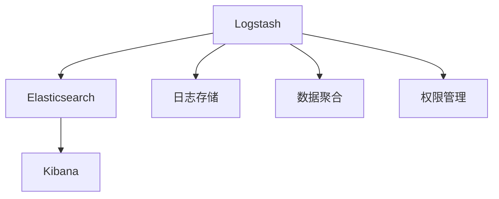

                 

# ELK日志安全与权限管理

## 1. 背景介绍

### 1.1 问题由来

随着互联网和数字化转型的加速，企业的IT环境变得越来越复杂。越来越多的应用程序和设备接入网络，产生了大量的日志数据。这些日志数据不仅记录了系统的运行状态和错误信息，还包含了敏感的用户信息和业务操作细节。如何安全地存储、管理和分析这些日志数据，成为了IT团队面临的重大挑战。

同时，随着企业业务的发展和数据量的激增，对日志数据的处理效率和权限管理要求也越来越高。传统的日志管理工具往往难以满足这些需求，因此，新的解决方案应运而生，其中最受欢迎的就是基于Elastic Stack（简称ELK）的日志管理系统。

### 1.2 问题核心关键点

ELK是由Elasticsearch、Logstash和Kibana组成的一个开源日志分析平台，用于收集、存储和可视化各种日志数据。其核心优势包括：
1. 强大的搜索和分析能力，支持多维度的数据聚合和可视化。
2. 灵活的数据收集和处理机制，支持多种数据源的日志收集。
3. 丰富的安全和权限控制功能，能够保护敏感数据。

因此，基于ELK的日志安全与权限管理成为了企业IT团队关注的焦点。本文将详细介绍ELK平台的安全与权限管理功能，并探讨其应用场景、挑战与未来发展方向。

## 2. 核心概念与联系

### 2.1 核心概念概述

为更好地理解ELK日志安全与权限管理，本节将介绍几个密切相关的核心概念：

- Elasticsearch：一个分布式、高性能的搜索与分析引擎，用于存储和管理大量日志数据。
- Logstash：一个数据处理管道，用于收集、过滤和转换各种数据源的日志数据。
- Kibana：一个基于Web的数据可视化工具，用于展示和分析Elasticsearch中的数据。
- 日志存储：将日志数据安全地存储在Elasticsearch中，确保数据的完整性和可恢复性。
- 数据聚合：通过Elasticsearch的聚合功能，对日志数据进行统计分析和可视化。
- 权限管理：通过ELK的权限控制机制，确保只有授权用户能够访问和管理日志数据。

这些核心概念之间的逻辑关系可以通过以下Mermaid流程图来展示：



这个流程图展示了一个典型的ELK日志管理系统，其中Logstash负责数据收集和处理，Elasticsearch负责数据存储和分析，Kibana负责数据展示和可视化，权限管理则贯穿整个流程。

## 3. 核心算法原理 & 具体操作步骤
### 3.1 算法原理概述

ELK日志安全与权限管理的核心在于通过Elasticsearch的权限控制机制，确保只有授权用户能够访问和管理日志数据。其核心算法原理包括以下几个方面：

- 身份认证：通过用户名和密码、OAuth等认证机制，确保只有合法的用户可以访问ELK系统。
- 角色授权：将用户分配到不同的角色中，每个角色对应一组权限，控制用户对日志数据的访问和操作。
- 权限映射：将用户角色和权限映射到ELK的API接口，确保用户只能访问其权限范围内的数据。
- 审计记录：记录用户的访问日志和操作日志，用于监控和追踪不正当行为。

### 3.2 算法步骤详解

基于ELK的日志安全与权限管理主要包括以下几个关键步骤：

**Step 1: 配置Elasticsearch的权限控制**

- 安装并启动Elasticsearch节点，确保节点之间能够正常通信。
- 配置Elasticsearch的集群设置，确保集群可用性。
- 启用Elasticsearch的安全插件，如Shiro或APM-Security。
- 创建管理员账户，并设置密码。

**Step 2: 配置Logstash的输入和输出插件**

- 在Logstash的配置文件中，添加输入插件（如file、http等），用于收集日志数据。
- 添加输出插件（如elasticsearch），将日志数据发送到Elasticsearch集群。

**Step 3: 配置Kibana的安全插件**

- 在Kibana的配置文件中，添加安全插件，如Elasticsearch Shiro或X-Pack Security。
- 配置Kibana的用户角色和权限，确保只有授权用户能够访问Kibana仪表板。

**Step 4: 配置Elasticsearch的聚合和数据访问策略**

- 在Elasticsearch中，配置聚合函数，对日志数据进行统计分析。
- 设置Elasticsearch的访问策略，限制用户对日志数据的访问权限。

**Step 5: 记录和审计日志访问**

- 启用Elasticsearch的审计记录功能，记录用户的访问日志和操作日志。
- 定期检查审计日志，发现和处理异常行为。

### 3.3 算法优缺点

基于ELK的日志安全与权限管理方法具有以下优点：
1. 灵活性高。ELK支持多种数据源的日志收集，能够适应各种应用场景。
2. 性能强。Elasticsearch的高效搜索和分析能力，可以处理大规模的日志数据。
3. 可扩展性好。ELK是一个开放平台，可以根据需求进行扩展和定制。
4. 安全可靠。ELK的权限控制机制和审计功能，可以保障数据的安全性和合规性。

同时，该方法也存在一些局限性：
1. 学习曲线陡峭。ELK的配置和部署需要一定的技术背景，新手入门较为困难。
2. 资源消耗高。Elasticsearch对硬件资源要求较高，需要足够的CPU、内存和存储。
3. 成本较高。ELK的开源版免费，但商业版需要付费，增加了企业的运营成本。
4. 灵活性有限。ELK的安全和权限控制功能虽然强大，但无法完全替代专业的安全平台。

尽管存在这些局限性，但ELK的安全与权限管理在实际应用中已经得到了广泛的应用，特别是在企业IT基础设施管理、网络安全监控等领域。未来相关研究的重点在于如何进一步优化ELK的安全性能，降低配置和使用门槛，同时兼顾可扩展性和可维护性。

### 3.4 算法应用领域

基于ELK的日志安全与权限管理方法在多个领域都有广泛的应用，例如：

- 企业IT基础设施管理：收集和分析企业内部的系统日志，监控服务运行状态，及时发现和解决问题。
- 网络安全监控：收集和分析网络设备的日志数据，检测和防范网络攻击和安全威胁。
- 应用性能监控：收集和分析应用日志，优化应用性能，提升用户体验。
- 事件日志管理：收集和分析事件日志，进行事件关联分析，提高事件响应的准确性和效率。
- 业务运营分析：收集和分析业务运营日志，进行业务指标分析，优化业务流程。

除了上述这些经典应用外，ELK的安全与权限管理还被创新性地应用到更多场景中，如异常行为检测、风险评估、合规性监控等，为企业提供了全面的IT运营保障。

## 4. 数学模型和公式 & 详细讲解 & 举例说明

### 4.1 数学模型构建

本节将使用数学语言对ELK日志安全与权限管理的配置过程进行更加严格的刻画。

假设Elasticsearch的集群节点数量为 $N$，每个节点有 $M$ 个分片，每个分片有 $K$ 个副本。日志数据被分为多个索引，每个索引有 $L$ 个文档。假设用户 $u$ 拥有角色 $r$，其对应的权限集合为 $P_r$。用户 $u$ 访问日志数据时，需要满足以下条件：

1. $u$ 必须通过身份认证和授权验证，即：
$$
\text{Auth}(u) \wedge \text{Auth}(r) \implies \text{Access}(u, P_r)
$$

2. 访问操作必须在用户角色对应的权限范围内，即：
$$
\text{Operation} \in P_r \implies \text{Access}(u, P_r)
$$

3. 访问操作必须是安全的，即：
$$
\text{Operation} \in P_r \wedge \text{Access}(u, P_r) \implies \text{Safe}(\text{Operation})
$$

其中，$\text{Auth}(u)$ 表示用户 $u$ 通过身份认证，$\text{Auth}(r)$ 表示用户 $u$ 拥有角色 $r$，$\text{Operation}$ 表示访问操作，$\text{Access}(u, P_r)$ 表示用户 $u$ 可以访问权限集合 $P_r$ 中的数据，$\text{Safe}(\text{Operation})$ 表示访问操作是安全的。

### 4.2 公式推导过程

以下我们以用户角色和权限的映射为例，推导用户如何访问Elasticsearch中的日志数据。

假设用户 $u$ 拥有角色 $r$，角色 $r$ 对应的权限集合为 $P_r = \{a, b, c\}$，表示用户可以访问索引 $a$、$b$、$c$ 中的日志数据。假设用户需要访问索引 $a$ 中的文档，则用户访问操作满足：

$$
\text{Operation} \in P_r \wedge \text{Access}(u, P_r) \implies \text{Access}(u, \{a, b, c\})
$$

根据上述公式，用户 $u$ 可以通过以下步骤访问索引 $a$ 中的文档：

1. 身份认证和授权验证：
$$
\text{Auth}(u) \wedge \text{Auth}(r) \implies \text{Access}(u, \{a, b, c\})
$$

2. 检查访问操作是否在用户角色对应的权限范围内：
$$
\text{Operation} \in \{a, b, c\} \implies \text{Access}(u, \{a, b, c\})
$$

3. 检查访问操作是否安全：
$$
\text{Operation} \in \{a, b, c\} \wedge \text{Access}(u, \{a, b, c\}) \implies \text{Safe}(\text{Operation})
$$

通过上述推导，我们可以看到，ELK的权限控制机制是通过对用户身份、角色、权限和操作进行严格的逻辑验证，确保用户只能访问其权限范围内的数据。这种权限控制机制的数学模型为ELK的安全与权限管理提供了坚实的理论基础。

### 4.3 案例分析与讲解

下面以一个具体的案例来分析ELK日志安全与权限管理的实际应用。

假设某企业的IT团队需要使用ELK来监控其网络设备的日志数据。具体步骤如下：

1. 在Elasticsearch集群中创建管理员账户，并设置密码。
2. 配置Logstash，收集网络设备的日志数据，并发送到Elasticsearch集群。
3. 配置Kibana，创建仪表板，展示网络设备的日志数据。
4. 配置Elasticsearch的安全插件，启用Shiro或APM-Security。
5. 创建多个用户角色，如管理员、工程师、审计员，并为每个角色分配相应的权限。
6. 配置Elasticsearch的访问策略，限制用户对日志数据的访问权限。
7. 启用Elasticsearch的审计记录功能，记录用户的访问日志和操作日志。

假设管理员 $A$ 需要访问所有网络设备的日志数据，工程师 $E$ 只能访问其负责的设备日志数据，审计员 $O$ 只能访问日志数据的审计日志。则管理员 $A$ 可以通过以下步骤访问所有网络设备的日志数据：

1. 身份认证和授权验证：
$$
\text{Auth}(A) \wedge \text{Auth}(管理员角色) \implies \text{Access}(A, \{设备1, 设备2, 设备3\})
$$

2. 检查访问操作是否在用户角色对应的权限范围内：
$$
\text{Operation} \in \{设备1, 设备2, 设备3\} \implies \text{Access}(A, \{设备1, 设备2, 设备3\})
$$

3. 检查访问操作是否安全：
$$
\text{Operation} \in \{设备1, 设备2, 设备3\} \wedge \text{Access}(A, \{设备1, 设备2, 设备3\}) \implies \text{Safe}(\text{Operation})
$$

通过上述案例分析，我们可以看到，ELK的日志安全与权限管理通过配置用户角色和权限，确保了日志数据的安全性和合规性，为企业的IT基础设施管理提供了坚实的保障。

## 5. 项目实践：代码实例和详细解释说明
### 5.1 开发环境搭建

在进行ELK日志安全与权限管理实践前，我们需要准备好开发环境。以下是使用Elasticsearch进行ELK配置的环境配置流程：

1. 安装Elasticsearch：从官网下载并安装Elasticsearch，确保安装版本与当前环境兼容。

2. 配置Elasticsearch的集群设置：设置节点数量、磁盘配额、内存配额等参数。

3. 安装并启动Elasticsearch节点，确保节点之间能够正常通信。

4. 配置Elasticsearch的安全插件，如Shiro或APM-Security。

5. 创建管理员账户，并设置密码。

6. 配置Elasticsearch的集群监控和告警设置，确保集群可用性。

完成上述步骤后，即可在Elasticsearch集群上开始日志安全与权限管理的实践。

### 5.2 源代码详细实现

这里我们以配置用户角色和权限为例，给出Elasticsearch的配置代码实现。

```python
from elasticsearch import Elasticsearch

# 创建Elasticsearch连接
es = Elasticsearch([{'host': 'localhost', 'port': 9200}])

# 创建管理员账户
body = {
    "password": "admin_password",
    "roles": ["admin"]
}
es.users.create_user("admin", body=body, password_hashed=True)

# 创建审计员账户
body = {
    "password": "auditor_password",
    "roles": ["auditor"]
}
es.users.create_user("auditor", body=body, password_hashed=True)

# 创建工程师账户
body = {
    "password": "engineer_password",
    "roles": ["engineer"]
}
es.users.create_user("engineer", body=body, password_hashed=True)

# 创建用户角色
body = {
    "name": "admin_role",
    "roles": ["admin"]
}
es.cluster.put_role_mapping(body=body)

body = {
    "name": "auditor_role",
    "roles": ["auditor"]
}
es.cluster.put_role_mapping(body=body)

body = {
    "name": "engineer_role",
    "roles": ["engineer"]
}
es.cluster.put_role_mapping(body=body)
```

以上代码实现了创建管理员、审计员和工程师账户，并为每个用户分配相应的角色。在实际应用中，开发者可以根据需求灵活配置用户角色和权限，确保日志数据的访问控制。

### 5.3 代码解读与分析

让我们再详细解读一下关键代码的实现细节：

**Elasticsearch连接配置**：
- 使用`elasticsearch`库创建Elasticsearch连接对象`es`，连接地址为`localhost:9200`。

**用户账户创建**：
- 使用`es.users.create_user`方法创建用户账户，包括用户名、密码和角色。`password_hashed=True`表示密码以哈希形式存储，提高了安全性。

**用户角色创建**：
- 使用`es.cluster.put_role_mapping`方法创建用户角色，包括角色名称和对应的权限列表。

通过上述代码实现，ELK的日志安全与权限管理功能得到了有效的配置。开发者可以根据具体需求，灵活配置用户角色和权限，确保日志数据的访问控制。

## 6. 实际应用场景
### 6.1 智能客服系统

基于ELK的日志安全与权限管理，可以应用于智能客服系统的构建。智能客服系统通常需要收集和分析大量的用户互动日志，以提升服务质量和用户体验。

具体而言，可以收集智能客服系统的用户互动日志，并存储在Elasticsearch集群中。通过配置Kibana仪表板，实时展示客服的响应时间、用户满意度等关键指标。同时，通过配置Elasticsearch的访问策略，确保只有授权客服才能访问这些互动日志，保护用户隐私和数据安全。

### 6.2 金融舆情监测

金融行业对数据的敏感性和安全性要求非常高。基于ELK的日志安全与权限管理，可以为金融舆情监测系统提供有力的支持。

具体而言，可以收集金融舆情监测系统的日志数据，并存储在Elasticsearch集群中。通过配置Kibana仪表板，实时展示舆情事件、舆情趋势等关键指标。同时，通过配置Elasticsearch的访问策略，确保只有授权人员才能访问这些舆情数据，保护金融机构的数据安全和合规性。

### 6.3 个性化推荐系统

基于ELK的日志安全与权限管理，可以应用于个性化推荐系统的构建。个性化推荐系统通常需要收集和分析用户的行为数据，以提升推荐效果和用户满意度。

具体而言，可以收集个性化推荐系统的用户行为日志，并存储在Elasticsearch集群中。通过配置Kibana仪表板，实时展示用户行为、推荐效果等关键指标。同时，通过配置Elasticsearch的访问策略，确保只有授权用户才能访问这些行为日志，保护用户隐私和数据安全。

### 6.4 未来应用展望

随着ELK的不断发展和完善，其应用场景将会更加广泛。未来，ELK的日志安全与权限管理功能将进一步拓展，应用于更多垂直行业领域。

在智慧医疗领域，ELK可以应用于电子病历、医疗设备日志的存储和分析，提高医疗服务的质量和效率。在智慧城市治理中，ELK可以应用于城市事件监测、舆情分析、应急指挥等环节，提高城市管理的自动化和智能化水平。

此外，在企业生产、社会治理、文娱传媒等众多领域，ELK的安全与权限管理功能也将不断得到应用，为经济社会发展提供新的技术路径。相信随着ELK技术的持续演进，其应用范围将不断扩展，为更多行业带来创新的IT解决方案。

## 7. 工具和资源推荐
### 7.1 学习资源推荐

为了帮助开发者系统掌握ELK的安全与权限管理理论基础和实践技巧，这里推荐一些优质的学习资源：

1. Elasticsearch官方文档：Elasticsearch的官方文档，提供了全面的API接口和配置说明，是ELK开发的基础。

2. Logstash官方文档：Logstash的官方文档，提供了丰富的插件和配置示例，帮助开发者掌握数据收集和处理。

3. Kibana官方文档：Kibana的官方文档，提供了灵活的仪表板配置和数据可视化功能，是ELK开发的强大工具。

4. ELK Stack Cookbook：一本实战性的ELK Stack配置和应用指南，涵盖ELK的常见配置和优化技巧。

5. ELK Stack for Developers：一本面向开发者的ELK Stack实战指南，介绍ELK的实际应用场景和最佳实践。

通过对这些资源的学习实践，相信你一定能够快速掌握ELK的安全与权限管理精髓，并用于解决实际的IT问题。
###  7.2 开发工具推荐

高效的开发离不开优秀的工具支持。以下是几款用于ELK开发和部署的工具：

1. Kibana：一个基于Web的数据可视化工具，用于展示和分析Elasticsearch中的数据。

2. Elasticsearch：一个分布式、高性能的搜索与分析引擎，用于存储和管理大量日志数据。

3. Logstash：一个数据处理管道，用于收集、过滤和转换各种数据源的日志数据。

4. X-Pack Security：Elasticsearch的内置安全插件，提供细粒度的访问控制和审计功能。

5. Shiro：一个基于Java的安全框架，可以与Elasticsearch集成，提供身份认证和授权功能。

6. Kibana仪表板：通过Kibana创建仪表板，展示和分析Elasticsearch中的数据。

7. Elastic Stack Cookbook：一个ELK Stack的配置和应用指南，涵盖ELK的常见配置和优化技巧。

合理利用这些工具，可以显著提升ELK的安全与权限管理开发效率，加快创新迭代的步伐。

### 7.3 相关论文推荐

ELK的安全与权限管理技术的发展源于学界的持续研究。以下是几篇奠基性的相关论文，推荐阅读：

1. "Implementing Elasticsearch Security: Access Control, Authentication and Authorization"：详细介绍了Elasticsearch的安全控制机制，包括身份认证、授权和审计。

2. "Enabling Security on Elasticsearch"：介绍了Elasticsearch的Shiro插件，提供细粒度的访问控制功能。

3. "Elastic Stack for DevOps"：探讨了Elasticsearch在DevOps环境中的应用，包括日志收集、存储和分析。

4. "A Survey on Big Data Security Technologies"：综述了大数据安全技术的研究现状和发展方向，包括ELK的安全与权限管理。

这些论文代表了大数据安全技术的发展脉络。通过学习这些前沿成果，可以帮助研究者把握学科前进方向，激发更多的创新灵感。

## 8. 总结：未来发展趋势与挑战
### 8.1 总结

本文对基于ELK的日志安全与权限管理方法进行了全面系统的介绍。首先阐述了ELK平台的优势和核心功能，明确了ELK在日志数据管理和访问控制方面的独特价值。其次，从原理到实践，详细讲解了ELK的安全与权限管理配置过程，给出了ELK日志安全与权限管理代码实现的完整实例。同时，本文还探讨了ELK在多个领域的应用场景，展示了ELK的强大应用潜力。

通过本文的系统梳理，我们可以看到，基于ELK的日志安全与权限管理方法已经成为企业IT基础设施管理的重要手段，极大地提升了日志数据的存储、管理和分析效率，保障了数据的安全性和合规性。未来，伴随ELK技术的不断演进，其应用范围将不断拓展，为更多行业带来创新的IT解决方案。

### 8.2 未来发展趋势

展望未来，ELK的安全与权限管理技术将呈现以下几个发展趋势：

1. 云化部署。ELK可以部署在云平台上，提供弹性扩展和按需计费的服务。

2. 大数据集成。ELK可以与其他大数据平台（如Hadoop、Spark）集成，提升数据处理能力。

3. 实时分析和监控。ELK可以提供实时的日志分析和监控功能，提升数据响应速度。

4. 微服务架构。ELK可以支持微服务架构，提高系统的可扩展性和可用性。

5. 容器化部署。ELK可以容器化部署，提高系统的部署效率和可移植性。

6. 自动化运维。ELK可以提供自动化的运维和监控功能，提高系统管理和维护的效率。

这些趋势凸显了ELK的安全与权限管理技术的先进性和灵活性，为ELK的广泛应用提供了坚实的基础。

### 8.3 面临的挑战

尽管ELK的安全与权限管理技术已经取得了不小的成就，但在迈向更加智能化、普适化应用的过程中，它仍面临着诸多挑战：

1. 学习曲线陡峭。ELK的配置和部署需要一定的技术背景，新手入门较为困难。

2. 资源消耗高。Elasticsearch对硬件资源要求较高，需要足够的CPU、内存和存储。

3. 灵活性有限。ELK的安全和权限控制功能虽然强大，但无法完全替代专业的安全平台。

4. 安全风险。ELK的日志存储和传输过程中可能面临数据泄露、篡改等安全风险，需要采取严格的保护措施。

5. 运维复杂。ELK的运维和管理需要专业知识，企业需要投入大量人力和时间。

尽管存在这些挑战，ELK的安全与权限管理技术在实际应用中已经得到了广泛的应用，特别是在企业IT基础设施管理、网络安全监控等领域。未来相关研究的重点在于如何进一步优化ELK的安全性能，降低配置和使用门槛，同时兼顾可扩展性和可维护性。

### 8.4 研究展望

面对ELK安全与权限管理所面临的挑战，未来的研究需要在以下几个方面寻求新的突破：

1. 引入先进的数据保护技术。引入先进的数据加密和访问控制技术，提升ELK的安全性和隐私保护能力。

2. 实现自动化的配置和运维。引入自动化配置和运维工具，降低ELK的使用门槛，提高系统的可靠性和可维护性。

3. 支持多种数据源的集成。支持多种数据源的集成，提升ELK的兼容性和适用性。

4. 引入先进的机器学习技术。引入先进的机器学习技术，提升ELK的安全性和性能。

5. 实现微服务架构和云化部署。支持微服务架构和云化部署，提高ELK的扩展性和可用性。

6. 实现自动化的监控和告警。实现自动化的监控和告警功能，提升ELK的运维效率和响应速度。

这些研究方向将引领ELK的安全与权限管理技术迈向更高的台阶，为ELK的广泛应用提供坚实的技术保障。

## 9. 附录：常见问题与解答

**Q1：ELK的安全与权限管理如何部署？**

A: ELK的安全与权限管理部署可以分为以下步骤：

1. 安装并启动Elasticsearch节点，确保节点之间能够正常通信。
2. 配置Elasticsearch的集群设置，确保集群可用性。
3. 启用Elasticsearch的安全插件，如Shiro或APM-Security。
4. 创建管理员账户，并设置密码。
5. 配置Logstash，收集日志数据，并发送到Elasticsearch集群。
6. 配置Kibana，创建仪表板，展示和分析Elasticsearch中的数据。
7. 配置Elasticsearch的访问策略，限制用户对日志数据的访问权限。

完成上述步骤后，ELK的安全与权限管理即可在Elasticsearch集群上部署。

**Q2：ELK的安全与权限管理如何配置？**

A: ELK的安全与权限管理配置可以分为以下步骤：

1. 创建用户账户和角色，并为每个用户分配相应的角色。
2. 配置Elasticsearch的访问策略，限制用户对日志数据的访问权限。
3. 启用Elasticsearch的审计记录功能，记录用户的访问日志和操作日志。
4. 配置Logstash的输入和输出插件，确保日志数据的正确收集和存储。
5. 配置Kibana的安全插件，确保只有授权用户能够访问Kibana仪表板。

通过上述配置，ELK的安全与权限管理功能即可在Elasticsearch集群上实现。

**Q3：ELK的安全与权限管理有哪些优势？**

A: ELK的安全与权限管理具有以下优势：

1. 灵活性高。ELK支持多种数据源的日志收集，能够适应各种应用场景。
2. 性能强。Elasticsearch的高效搜索和分析能力，可以处理大规模的日志数据。
3. 可扩展性好。ELK是一个开放平台，可以根据需求进行扩展和定制。
4. 安全可靠。ELK的权限控制机制和审计功能，可以保障数据的安全性和合规性。

这些优势使得ELK成为企业IT基础设施管理和网络安全监控的理想选择。

**Q4：ELK的安全与权限管理有哪些应用场景？**

A: ELK的安全与权限管理可以应用于以下场景：

1. 企业IT基础设施管理：收集和分析企业内部的系统日志，监控服务运行状态，及时发现和解决问题。
2. 网络安全监控：收集和分析网络设备的日志数据，检测和防范网络攻击和安全威胁。
3. 应用性能监控：收集和分析应用日志，优化应用性能，提升用户体验。
4. 事件日志管理：收集和分析事件日志，进行事件关联分析，提高事件响应的准确性和效率。
5. 业务运营分析：收集和分析业务运营日志，进行业务指标分析，优化业务流程。

这些应用场景展示了ELK的安全与权限管理在企业IT基础设施管理和网络安全监控中的广泛应用。

**Q5：ELK的安全与权限管理如何保障数据安全？**

A: ELK的安全与权限管理可以通过以下方式保障数据安全：

1. 身份认证和授权验证：确保只有合法的用户可以访问ELK系统。
2. 访问操作在用户角色对应的权限范围内：确保用户只能访问其权限范围内的数据。
3. 访问操作是安全的：确保访问操作不会导致数据泄露或篡改。
4. 审计记录：记录用户的访问日志和操作日志，用于监控和追踪不正当行为。

通过上述措施，ELK的安全与权限管理能够保障数据的安全性和合规性，为企业的IT基础设施管理和网络安全监控提供坚实的保障。

---

作者：禅与计算机程序设计艺术 / Zen and the Art of Computer Programming

