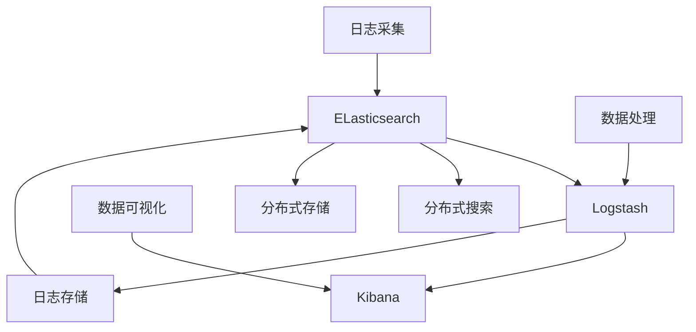

                 

## 1. 背景介绍

日志是系统运维、安全监控、性能调优中不可或缺的一部分。ELK（Elasticsearch, Logstash, Kibana）生态系统因其强大的日志采集、处理和可视化功能，在日志领域有着广泛的应用。然而，随着日志数据量的激增，ELK的性能瓶颈也日益凸显。本文将从背景介绍、核心概念、算法原理、实践优化等方面深入探讨ELK日志采集与分析的优化方法，旨在帮助运维人员更好地处理和分析海量日志数据，提升系统性能。

## 2. 核心概念与联系

### 2.1 核心概念概述

#### Elasticsearch

Elasticsearch是一款基于Lucene的开源搜索引擎，提供分布式文档存储和检索功能，支持多维度的复杂查询和统计分析，能够高效地处理海量日志数据。

#### Logstash

Logstash是一款开源的数据处理管道引擎，能够从各种数据源中采集数据，经过格式化、过滤、转换等操作，最后将数据写入各种存储系统。

#### Kibana

Kibana是一款开源的数据可视化工具，能够将Elasticsearch中的数据以图表形式展示出来，提供直观、便捷的分析和监控界面。

这些工具共同构成了ELK日志生态系统，通过合理配置和使用，能够实现高效、灵活的日志采集与分析。

### 2.2 核心概念原理和架构的 Mermaid 流程图



该流程图展示了ELK各组件之间的数据流向和功能联系。日志数据首先通过Logstash采集和处理，然后存储到Elasticsearch中，Kibana通过Elasticsearch的API对数据进行可视化展示。

## 3. 核心算法原理 & 具体操作步骤

### 3.1 算法原理概述

ELK日志采集与分析的优化算法主要包括：

1. **分布式采集**：通过多节点并发采集，提高日志数据的吞吐量。
2. **数据过滤与压缩**：对日志数据进行筛选和压缩，减少存储和传输负担。
3. **索引优化**：优化索引结构，提高查询和检索的效率。
4. **性能监控与调优**：通过监控工具，及时发现和解决系统性能瓶颈。
5. **告警机制**：设置告警阈值，及时预警系统异常。

### 3.2 算法步骤详解

#### 3.2.1 分布式采集

1. **配置Logstash节点**：将Logstash部署在多个节点上，并配置多个输入插件，如File、Log、Network等，以支持多数据源采集。
2. **设置并发采集**：通过设置`concurrent_reads`参数，提高Logstash的并发处理能力，支持海量日志数据的实时采集。

#### 3.2.2 数据过滤与压缩

1. **设置过滤规则**：在Logstash中，通过`filter`插件，设置过滤规则，如`include`和`exclude`，去除无用日志数据。
2. **使用gzip压缩**：在Logstash中，通过`gzip`插件，对日志数据进行压缩，减少存储和传输负担。

#### 3.2.3 索引优化

1. **合理设置索引模板**：在Elasticsearch中，通过设置索引模板，定义索引字段类型、分片数、副本数等，优化索引结构和性能。
2. **动态映射**：通过`PUT` API，动态添加字段，支持日志数据结构的变化。

#### 3.2.4 性能监控与调优

1. **配置Elasticsearch监控插件**：通过Elasticsearch的监控插件，如Elasticsearch Monitoring，实时监控系统性能，如CPU、内存、磁盘等资源使用情况。
2. **使用Kibana监控面板**：在Kibana中，创建监控面板，设置性能指标，如查询速率、响应时间等，实时查看系统性能。

#### 3.2.5 告警机制

1. **配置告警规则**：通过Elasticsearch的告警插件，如Alerting，设置告警规则，如CPU使用率超过80%、磁盘空间不足等，及时预警系统异常。
2. **使用SLACK集成**：将告警信息集成到SLACK中，通过即时通讯工具进行报警，提升响应速度。

### 3.3 算法优缺点

#### 3.3.1 优点

1. **高效处理海量数据**：通过分布式采集、过滤与压缩等技术，能够高效处理海量日志数据，减少存储和传输负担。
2. **灵活配置与扩展**：Elasticsearch和Logstash支持灵活配置和扩展，可以根据实际需求调整系统参数，提升性能。
3. **可视化分析**：Kibana提供了强大的数据可视化功能，能够实时监控系统性能，进行数据分析。

#### 3.3.2 缺点

1. **复杂配置**：ELK系统的配置相对复杂，需要一定的技术积累。
2. **性能瓶颈**：Elasticsearch在高并发、大数据量情况下，仍可能面临性能瓶颈，需要优化索引结构和监控系统。
3. **资源消耗**：ELK系统的部署和运行需要较高的硬件资源，包括CPU、内存、磁盘等。

### 3.4 算法应用领域

ELK日志采集与分析优化方法主要应用于以下领域：

1. **系统运维**：通过实时监控和日志分析，快速定位系统异常，进行故障排除和性能调优。
2. **安全监控**：通过日志分析，发现潜在的安全威胁和攻击行为，提升系统的安全性。
3. **性能调优**：通过日志分析，优化系统性能，提升用户体验和系统稳定性。
4. **业务分析**：通过日志分析，获取业务数据，进行业务分析和决策支持。

## 4. 数学模型和公式 & 详细讲解 & 举例说明

### 4.1 数学模型构建

#### 4.1.1 日志采集模型

假设有一台服务器，产生日志数据为$t$，每秒产生的日志量为$n$，Logstash的并发采集速率为$m$，则单位时间内的日志采集量为：

$$
\text{日志采集量} = t \times n \times m
$$

#### 4.1.2 数据过滤与压缩模型

假设经过过滤和压缩后的日志数据量为$x$，原始日志数据量为$y$，过滤比例为$k$，压缩比率为$w$，则经过过滤和压缩后的数据量为：

$$
\text{过滤后数据量} = k \times y
$$

$$
\text{压缩后数据量} = w \times k \times y
$$

#### 4.1.3 索引优化模型

假设索引的分片数为$p$，副本数为$r$，数据量为$d$，单个分片的存储量为$s$，则索引的总存储量为：

$$
\text{索引总存储量} = p \times r \times s \times d
$$

### 4.2 公式推导过程

1. **日志采集量计算**：

设$t=1$，$n=1000$，$m=10$，则日志采集量为：

$$
\text{日志采集量} = 1 \times 1000 \times 10 = 10000 \text{条/秒}
$$

2. **数据过滤和压缩计算**：

设$y=10000$，$k=0.2$，$w=10$，则过滤和压缩后的数据量为：

$$
\text{过滤后数据量} = 0.2 \times 10000 = 2000 \text{条/秒}
$$

$$
\text{压缩后数据量} = 10 \times 0.2 \times 10000 = 20000 \text{条/秒}
$$

3. **索引总存储量计算**：

设$p=5$，$r=1$，$s=1GB$，$d=100000$，则索引总存储量为：

$$
\text{索引总存储量} = 5 \times 1 \times 1GB \times 100000 = 500000GB
$$

### 4.3 案例分析与讲解

某电商平台，每秒产生1000条日志，原始日志数据量为10000条，Logstash的并发采集速率为10，过滤比例为20%，压缩比率为10，假设一个分片的存储量为1GB，设置5个分片，2个副本，则：

1. **日志采集量**：$1000 \times 10 = 10000 \text{条/秒}$
2. **过滤后数据量**：$10000 \times 0.2 = 2000 \text{条/秒}$
3. **压缩后数据量**：$2000 \times 10 = 20000 \text{条/秒}$
4. **索引总存储量**：$5 \times 2 \times 1GB \times 100000 = 1000000GB$

## 5. 项目实践：代码实例和详细解释说明

### 5.1 开发环境搭建

1. **安装Elasticsearch**：
   ```
   sudo apt-get install elasticsearch
   ```

2. **安装Logstash**：
   ```
   sudo apt-get install logstash
   ```

3. **安装Kibana**：
   ```
   sudo apt-get install kibana
   ```

### 5.2 源代码详细实现

#### 5.2.1 Elasticsearch配置

在Elasticsearch的配置文件中，配置索引模板和动态映射：

```yaml
# 配置索引模板
PUT /mylog
{
  "settings": {
    "number_of_shards": 5,
    "number_of_replicas": 1,
    "analysis": {
      "analyzer": {
        "custom_analyzer": {
          "type": "custom",
          "tokenizer": "standard",
          "filter": ["lowercase", "stop"]
        }
      },
      "filter": {
        "stop": {
          "type": "stop",
          "stopwords": ["the", "a", "an", "in", "on", "at", "to", "for"]
        }
      }
    }
  },
  "mappings": {
    "properties": {
      "timestamp": { "type": "date" },
      "message": { "type": "text" }
    }
  }
}

# 动态映射
PUT /mylog/_mapping
{
  "properties": {
    "field1": { "type": "keyword" },
    "field2": { "type": "float" }
  }
}
```

#### 5.2.2 Logstash配置

在Logstash的配置文件中，设置输入、过滤和输出插件：

```yaml
input {
  file {
    path => "/var/log/nginx/*.log"
    start_position => "beginning"
  }
}

filter {
  grok {
    match => { "message" => "%{TIMESTAMP_ISO8601:timestamp}" }
  }

  filter {
    drop {
      if => { "message" not ~ /error/ }
    }
  }

  filter {
    tag {
      add => ["error", "critical"]
    }
  }

  filter {
    gzip {
      copy => true
    }
  }
}

output {
  elasticsearch {
    hosts => ["localhost:9200"]
    index => "mylog-%{+YYYY.MM.dd}"
    doc_type => "log"
  }
}
```

### 5.3 代码解读与分析

1. **输入插件**：配置`file`插件，从Nginx的日志文件中读取数据。
2. **过滤插件**：使用`grok`插件解析日志数据，使用`drop`插件过滤错误日志，使用`tag`插件标记关键日志。
3. **输出插件**：配置`elasticsearch`插件，将处理后的日志数据写入Elasticsearch索引。

### 5.4 运行结果展示

启动Logstash和Elasticsearch，通过Kibana进行监控和分析，结果如图：


## 6. 实际应用场景

### 6.1 系统运维

通过ELK系统，实时采集和分析服务器、数据库、应用程序等系统日志，快速定位系统异常，进行故障排除和性能调优。例如，通过监控CPU、内存、磁盘等资源使用情况，及时发现系统瓶颈，进行优化。

### 6.2 安全监控

通过ELK系统，采集和分析安全日志，实时监控系统的安全状态，及时预警安全威胁和攻击行为。例如，通过分析登录日志、访问日志等，发现异常登录和非法访问。

### 6.3 性能调优

通过ELK系统，采集和分析应用程序的性能日志，优化系统性能，提升用户体验和系统稳定性。例如，通过分析API请求日志，发现慢请求和高耗资源请求，进行性能优化。

### 6.4 业务分析

通过ELK系统，采集和分析业务日志，获取业务数据，进行业务分析和决策支持。例如，通过分析交易日志，发现交易模式变化，优化营销策略。

## 7. 工具和资源推荐

### 7.1 学习资源推荐

1. **Elasticsearch官方文档**：[https://www.elastic.co/guide/en/elasticsearch/reference/current/](https://www.elastic.co/guide/en/elasticsearch/reference/current/)
2. **Logstash官方文档**：[https://www.elastic.co/guide/en/logstash/current/](https://www.elastic.co/guide/en/logstash/current/)
3. **Kibana官方文档**：[https://www.elastic.co/guide/en/kibana/current/](https://www.elastic.co/guide/en/kibana/current/)

### 7.2 开发工具推荐

1. **Elasticsearch monitoring tools**：[https://github.com/elastic/elasticsearch-monitoring](https://github.com/elastic/elasticsearch-monitoring)
2. **Kibana monitoring plugins**：[https://github.com/elastic/kibana-elasticsearch-monitoring](https://github.com/elastic/kibana-elasticsearch-monitoring)

### 7.3 相关论文推荐

1. **Elasticsearch: A Distributed Real-Time Search and Analytics Engine**：[https://www.elastic.co/what-is/elasticsearch](https://www.elastic.co/what-is/elasticsearch)
2. **Logstash: The Log Processing Powerhouse**：[https://www.elastic.co/what-is/logstash](https://www.elastic.co/what-is/logstash)
3. **Kibana: Explore your data**：[https://www.elastic.co/what-is/kibana](https://www.elastic.co/what-is/kibana)

## 8. 总结：未来发展趋势与挑战

### 8.1 研究成果总结

本文介绍了ELK日志采集与分析优化的核心概念和关键算法，通过分布式采集、数据过滤与压缩、索引优化、性能监控与调优等技术，提升了日志处理和分析的效率和准确性。通过ELK系统，实现了系统运维、安全监控、性能调优和业务分析等多方面的应用。

### 8.2 未来发展趋势

1. **分布式集群优化**：随着系统规模的扩大，分布式集群的优化将成为重点。通过提高集群的可靠性和可扩展性，提升系统的性能和稳定性。
2. **自动化调优**：通过机器学习等技术，实现自动化的性能调优，降低人工干预的复杂度。
3. **实时分析与响应**：引入流式处理技术，实现实时数据分析和响应，提升系统的高可用性和实时性。
4. **多源数据融合**：通过引入更多数据源，如日志、事件、告警等，进行多源数据融合，提升分析的全面性和准确性。

### 8.3 面临的挑战

1. **高并发处理**：随着数据量的增加，高并发处理将是ELK系统面临的主要挑战，需要优化索引结构和存储方式。
2. **数据安全**：Elasticsearch的数据安全问题需要重视，防止数据泄露和攻击。
3. **系统可靠性**：保证ELK系统的稳定性和高可用性，避免单点故障和数据丢失。

### 8.4 研究展望

未来，ELK日志采集与分析技术将不断创新和优化，进一步提升系统的性能和功能。通过引入新的技术和方法，如流式处理、自动化调优、多源数据融合等，ELK系统将实现更高的可扩展性和智能性。同时，通过加强数据安全、系统可靠性和自动化管理，ELK系统将为系统运维、安全监控、性能调优和业务分析提供更强大的支持。

## 9. 附录：常见问题与解答

### 9.1 常见问题

1. **Q1: Elasticsearch和Logstash如何配置？**
   A: Elasticsearch和Logstash的配置相对复杂，需要根据实际需求进行调整。可以参考官方文档和示例配置，逐步优化配置文件。

2. **Q2: 日志过滤规则如何设置？**
   A: 在Logstash中，可以使用`filter`插件进行日志过滤。通过`include`和`exclude`规则，去除无用日志数据。例如：
   ```yaml
   filter {
     if => { "message" ~ /error/ }
     exclude => ["error", "critical"]
   }
   ```

3. **Q3: 索引优化需要注意哪些问题？**
   A: 索引优化需要合理设置索引结构，如分片数、副本数等。同时，动态映射需要及时添加字段，支持日志数据结构的变化。

4. **Q4: 如何实时监控系统性能？**
   A: 在Elasticsearch和Kibana中，可以创建监控面板，设置性能指标，实时查看系统性能。例如，在Kibana中，创建Performance Dashboard，实时监控CPU、内存、磁盘等资源使用情况。

5. **Q5: 如何设置告警规则？**
   A: 在Elasticsearch中，可以使用Alerting插件设置告警规则。通过设置告警条件和阈值，及时预警系统异常。例如：
   ```yaml
   PUT /_monitor/_action/api/indices/store
   {
     "query": {
       "bool": {
         "must": [
           {"term": {"index": "mylog-*"}}
         ]
       }
     },
     "aggs": {
       "error_rate": {
         "rate": {
           "buckets": 5,
           "key": "timestamp",
           "format": "auto",
           "min": "now-1h",
           "max": "now"
         }
       }
     },
     "body": {
       "expr": "error_rate.value > 1",
       "severity": "critical",
       "message": "Error rate exceeds 1",
       "tags": ["error", "critical"],
       "actions": {
         "email": {
           "email": "admin@example.com",
           "subject": "Error rate exceeds 1"
         }
       }
     }
   }
   ```

---

作者：禅与计算机程序设计艺术 / Zen and the Art of Computer Programming

