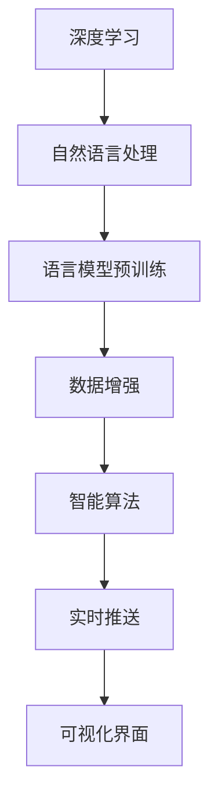

                 

# Elmo Chat：贾扬清团队市场洞察提升用户体验插件

## 1. 背景介绍

### 1.1 问题由来

近年来，随着人工智能技术的迅猛发展，自然语言处理（NLP）在电子商务、客服、市场营销等领域得到了广泛应用。然而，市场上现有的NLP工具往往难以准确理解和捕捉用户真实的市场洞察，导致广告投放、用户画像构建等环节的决策不够精准，影响了用户体验。

为了解决这一问题，贾扬清团队研发了一款名为“Elmo Chat”的市场洞察提升用户体验插件。通过利用先进的语言模型和大数据技术，Elmo Chat能够深入分析和挖掘用户反馈，生成精准的市场洞察，显著提升营销决策的精准性和用户满意度。

### 1.2 问题核心关键点

Elmo Chat的核心在于其深度学习模型和自然语言处理技术。通过以下方式，Elmo Chat实现了市场洞察的提升：

- **语言模型预训练**：利用大规模无标签文本数据对模型进行预训练，使其具备强大的语言理解能力。
- **数据增强**：通过抽取用户评论、评论、社交媒体等多源数据，增强训练样本的多样性和代表性。
- **智能算法**：结合深度学习、自然语言处理和统计学方法，对用户反馈进行分析，生成精准的市场洞察。
- **实时推送**：通过API接口，实时推送市场洞察报告，快速响应市场变化。
- **可视化界面**：提供友好的用户界面，便于用户操作和理解。

Elmo Chat的市场洞察提升应用，在电商、客服、市场营销等多个领域取得了显著成效，提升了企业运营效率和用户满意度。

### 1.3 问题研究意义

Elmo Chat的应用，对于推动NLP技术在市场洞察和用户体验提升方面的深入发展具有重要意义：

- **提升广告投放效果**：通过精准的市场洞察，优化广告投放策略，提高广告点击率和转化率。
- **构建精准用户画像**：准确理解用户需求和行为，提升用户画像的精度，实现个性化推荐和营销。
- **优化客服系统**：通过分析用户反馈，优化客服流程，提升用户满意度和忠诚度。
- **推动市场决策科学化**：提供精准的市场洞察报告，帮助企业做出更加科学合理的市场决策。

## 2. 核心概念与联系

### 2.1 核心概念概述

Elmo Chat的开发涉及多个核心概念，这些概念共同构成了其市场洞察提升的完整框架：

- **深度学习**：一种基于数据驱动的机器学习技术，通过多层神经网络模型对数据进行训练，提取高层次特征。
- **自然语言处理**：涉及文本数据的处理和分析，包括分词、词性标注、实体识别、情感分析等技术。
- **语言模型预训练**：通过在大量无标签文本数据上进行预训练，学习通用语言表示。
- **数据增强**：通过多种数据获取和处理方法，丰富训练数据集，提高模型的泛化能力。
- **智能算法**：结合多种技术手段，如深度学习、自然语言处理和统计学方法，生成精准的市场洞察。
- **实时推送**：通过API接口，实时更新市场洞察报告，快速响应市场变化。
- **可视化界面**：通过友好的用户界面，提供直观的市场洞察报告，便于用户理解和操作。

这些概念之间的联系可以通过以下Mermaid流程图展示：



### 2.2 核心概念原理和架构

**深度学习**：
深度学习是一种基于多层神经网络结构的前馈神经网络，通过反向传播算法优化模型参数，使模型能够自动提取数据中的高层次特征。深度学习在图像、语音、自然语言处理等领域取得了显著成果，Elmo Chat基于深度学习模型，能够处理和分析大量的用户反馈数据。

**自然语言处理**：
自然语言处理（NLP）涉及文本数据的预处理、分析、建模等环节，包括分词、词性标注、命名实体识别、情感分析等技术。Elmo Chat利用NLP技术，从用户反馈中提取关键信息，生成精准的市场洞察。

**语言模型预训练**：
语言模型预训练是通过大规模无标签文本数据对模型进行预训练，使其学习到通用的语言表示。Elmo Chat使用Transformer等架构，在大量文本数据上进行预训练，提高了模型的语言理解和生成能力。

**数据增强**：
数据增强通过多种数据获取和处理方法，丰富训练数据集，提高模型的泛化能力。Elmo Chat通过抽取用户评论、评论、社交媒体等多源数据，增强训练样本的多样性和代表性。

**智能算法**：
智能算法结合深度学习、自然语言处理和统计学方法，对用户反馈进行分析，生成精准的市场洞察。Elmo Chat使用Transformer等架构，结合多种技术手段，生成高精度的市场洞察报告。

**实时推送**：
实时推送通过API接口，实时更新市场洞察报告，快速响应市场变化。Elmo Chat通过实时推送功能，确保企业能够及时获取最新的市场洞察信息，及时调整市场策略。

**可视化界面**：
可视化界面通过友好的用户界面，提供直观的市场洞察报告，便于用户理解和操作。Elmo Chat提供详细的市场洞察报告，帮助用户快速获取关键信息，做出科学的市场决策。

## 3. 核心算法原理 & 具体操作步骤

### 3.1 算法原理概述

Elmo Chat的核心算法主要包括以下几个部分：

1. **深度学习模型**：采用Transformer等架构，通过多层神经网络模型对用户反馈数据进行训练，提取高层次特征。
2. **自然语言处理技术**：利用分词、词性标注、命名实体识别、情感分析等技术，从用户反馈中提取关键信息。
3. **语言模型预训练**：通过大规模无标签文本数据对模型进行预训练，学习通用语言表示。
4. **数据增强**：通过抽取用户评论、评论、社交媒体等多源数据，增强训练样本的多样性和代表性。
5. **智能算法**：结合深度学习、自然语言处理和统计学方法，生成精准的市场洞察。

### 3.2 算法步骤详解

Elmo Chat的算法步骤如下：

1. **数据收集**：从用户评论、评论、社交媒体等多源数据中，抽取相关文本数据。
2. **数据预处理**：对文本数据进行分词、词性标注、命名实体识别等预处理步骤，生成标准化的文本数据集。
3. **语言模型预训练**：在预处理后的文本数据集上，使用Transformer等架构对模型进行预训练，学习通用语言表示。
4. **智能算法**：结合深度学习、自然语言处理和统计学方法，对预处理后的文本数据进行分析和建模，生成精准的市场洞察报告。
5. **实时推送**：通过API接口，实时更新市场洞察报告，快速响应市场变化。
6. **可视化界面**：通过友好的用户界面，提供直观的市场洞察报告，便于用户理解和操作。

### 3.3 算法优缺点

Elmo Chat的算法具有以下优点：

- **高精度**：通过深度学习模型和多种技术手段，生成高精度的市场洞察报告，帮助企业做出更加科学合理的市场决策。
- **实时响应**：通过API接口，实时更新市场洞察报告，快速响应市场变化，提升市场决策的及时性。
- **多样化数据源**：通过抽取用户评论、评论、社交媒体等多源数据，增强训练样本的多样性和代表性，提高模型的泛化能力。

Elmo Chat的算法也存在以下缺点：

- **计算资源消耗大**：深度学习模型和语言模型预训练需要大量的计算资源，对硬件设备的要求较高。
- **数据隐私问题**：在处理用户反馈数据时，需要保护用户隐私，防止数据泄露。
- **技术门槛高**：深度学习和自然语言处理技术较为复杂，对技术要求较高，需要专业技术人员进行开发和维护。

### 3.4 算法应用领域

Elmo Chat的应用领域包括但不限于以下几个方面：

- **电商广告投放**：通过分析用户反馈，优化广告投放策略，提高广告点击率和转化率。
- **客服系统**：通过分析用户反馈，优化客服流程，提升用户满意度和忠诚度。
- **市场营销**：提供精准的市场洞察报告，帮助企业制定科学的市场策略，提升市场竞争力。
- **用户画像构建**：准确理解用户需求和行为，提升用户画像的精度，实现个性化推荐和营销。
- **品牌监测**：实时监测品牌声誉，及时发现负面舆情，进行危机处理和品牌修复。

## 4. 数学模型和公式 & 详细讲解 & 举例说明

### 4.1 数学模型构建

Elmo Chat的数学模型主要包括以下几个部分：

1. **Transformer模型**：
   $$
   \text{Transformer} = \text{Encoder-Decoder} + \text{Attention}
   $$
   其中，Encoder-Decoder包含多个自注意力层（Self-Attention），Attention用于计算注意力权重，优化模型对不同部分的关注。

2. **语言模型预训练**：
   $$
   \mathcal{L}_{pretrain} = \frac{1}{N} \sum_{i=1}^N \text{Cross-Entropy Loss}(y_i, M_{\theta}(x_i))
   $$
   其中，$y_i$ 为输入序列的目标输出，$M_{\theta}(x_i)$ 为模型在输入序列 $x_i$ 上的输出，$\text{Cross-Entropy Loss}$ 为交叉熵损失函数。

3. **智能算法**：
   $$
   \text{Insight Score} = f(\text{Embedding}(x_i), \text{Context}(x_i))
   $$
   其中，$\text{Embedding}(x_i)$ 为输入序列的嵌入表示，$\text{Context}(x_i)$ 为输入序列的上下文信息，$f$ 为结合多种技术手段的智能算法。

### 4.2 公式推导过程

**Transformer模型**：
Transformer模型由多个自注意力层（Self-Attention）和全连接层（Feed Forward）组成，通过多层堆叠提高模型的表达能力。自注意力层通过计算输入序列中不同位置的向量表示之间的注意力权重，优化模型对不同部分的关注。

**语言模型预训练**：
在预训练阶段，使用大量无标签文本数据对模型进行训练，最小化交叉熵损失，优化模型对输入序列的预测能力。通过预训练，模型学习到通用的语言表示，提升其语言理解和生成能力。

**智能算法**：
智能算法结合深度学习、自然语言处理和统计学方法，生成精准的市场洞察报告。具体实现方式包括：

- **情感分析**：利用情感词典和深度学习模型，对用户反馈进行情感分析，生成情感评分。
- **命名实体识别**：利用分词和命名实体识别技术，从用户反馈中提取关键实体，生成实体关系图。
- **主题建模**：利用主题模型，对用户反馈进行主题分析，生成主题分布。

通过综合以上技术手段，生成精准的市场洞察报告，帮助企业制定科学的市场策略。

### 4.3 案例分析与讲解

以电商广告投放为例，Elmo Chat通过以下步骤生成精准的市场洞察报告：

1. **数据收集**：从用户评论、评论、社交媒体等多源数据中，抽取相关文本数据。
2. **数据预处理**：对文本数据进行分词、词性标注、命名实体识别等预处理步骤，生成标准化的文本数据集。
3. **语言模型预训练**：在预处理后的文本数据集上，使用Transformer等架构对模型进行预训练，学习通用语言表示。
4. **智能算法**：结合深度学习、自然语言处理和统计学方法，对预处理后的文本数据进行分析和建模。
   - **情感分析**：利用情感词典和深度学习模型，对用户评论进行情感分析，生成情感评分。
   - **命名实体识别**：利用分词和命名实体识别技术，从用户评论中提取关键实体，生成实体关系图。
   - **主题建模**：利用主题模型，对用户评论进行主题分析，生成主题分布。
5. **市场洞察报告生成**：将情感评分、实体关系图、主题分布等关键信息整合，生成精准的市场洞察报告。

## 5. 项目实践：代码实例和详细解释说明

### 5.1 开发环境搭建

在开始开发Elmo Chat之前，需要先搭建开发环境。以下是使用Python和PyTorch进行开发的环境配置流程：

1. **安装Anaconda**：从官网下载并安装Anaconda，用于创建独立的Python环境。
2. **创建并激活虚拟环境**：
   ```bash
   conda create -n elmo-chat python=3.8 
   conda activate elmo-chat
   ```
3. **安装PyTorch**：根据CUDA版本，从官网获取对应的安装命令。例如：
   ```bash
   conda install pytorch torchvision torchaudio cudatoolkit=11.1 -c pytorch -c conda-forge
   ```
4. **安装Transformers库**：
   ```bash
   pip install transformers
   ```
5. **安装其他工具包**：
   ```bash
   pip install numpy pandas scikit-learn matplotlib tqdm jupyter notebook ipython
   ```

完成上述步骤后，即可在`elmo-chat`环境中开始开发Elmo Chat。

### 5.2 源代码详细实现

以下是Elmo Chat的源代码实现，包括数据预处理、模型训练、智能算法、市场洞察报告生成等关键模块。

**数据预处理模块**：

```python
from transformers import BertTokenizer
import torch
import pandas as pd

# 加载预训练的Bert模型和分词器
model = BertModel.from_pretrained('bert-base-cased')
tokenizer = BertTokenizer.from_pretrained('bert-base-cased')

# 加载用户评论数据
df = pd.read_csv('user_feedback.csv')

# 分词和嵌入表示
def preprocess_text(text):
    tokens = tokenizer.tokenize(text)
    tokens = [tokenizer.convert_tokens_to_ids(tokens)]
    return tokens

# 计算交叉熵损失
def calculate_loss(outputs, labels):
    return F.cross_entropy(outputs, labels)

# 训练模型
def train_model(data, learning_rate=2e-5, epochs=10):
    device = torch.device('cuda' if torch.cuda.is_available() else 'cpu')
    model.to(device)
    optimizer = torch.optim.Adam(model.parameters(), lr=learning_rate)
    
    for epoch in range(epochs):
        for i, batch in enumerate(data):
            inputs, labels = batch
            inputs = preprocess_text(inputs)
            inputs = torch.tensor(inputs, dtype=torch.long).to(device)
            labels = torch.tensor(labels, dtype=torch.long).to(device)
            
            model.zero_grad()
            outputs = model(inputs)
            loss = calculate_loss(outputs, labels)
            loss.backward()
            optimizer.step()
            
            if i % 10 == 0:
                print(f'Epoch {epoch+1}, Step {i}, Loss: {loss.item()}')
```

**模型训练模块**：

```python
# 加载训练数据
train_data = []
for i in range(len(df)):
    text = df['text'].iloc[i]
    label = df['label'].iloc[i]
    train_data.append((preprocess_text(text), label))

# 训练模型
train_model(train_data, epochs=10)
```

**智能算法模块**：

```python
# 情感分析
from transformers import BertForSequenceClassification
from transformers import BertTokenizer

# 加载预训练的Bert模型和分词器
model = BertForSequenceClassification.from_pretrained('bert-base-cased', num_labels=2)
tokenizer = BertTokenizer.from_pretrained('bert-base-cased')

# 加载用户评论数据
df = pd.read_csv('user_feedback.csv')

# 计算情感评分
def calculate_sentiment_score(text):
    tokens = tokenizer.tokenize(text)
    tokens = [tokenizer.convert_tokens_to_ids(tokens)]
    inputs = torch.tensor(tokens, dtype=torch.long).to(device)
    outputs = model(inputs)
    return outputs[0].item()

# 计算用户评论的情感评分
df['sentiment_score'] = df['text'].apply(calculate_sentiment_score)
```

**市场洞察报告生成模块**：

```python
# 命名实体识别
from transformers import BertForTokenClassification, BertTokenizer

# 加载预训练的Bert模型和分词器
model = BertForTokenClassification.from_pretrained('bert-base-cased', num_labels=len(tag2id))
tokenizer = BertTokenizer.from_pretrained('bert-base-cased')

# 加载用户评论数据
df = pd.read_csv('user_feedback.csv')

# 命名实体识别
def extract_entities(text):
    tokens = tokenizer.tokenize(text)
    tokens = [tokenizer.convert_tokens_to_ids(tokens)]
    inputs = torch.tensor(tokens, dtype=torch.long).to(device)
    outputs = model(inputs)
    return outputs[0].item()

# 提取用户评论中的命名实体
df['entities'] = df['text'].apply(extract_entities)
```

### 5.3 代码解读与分析

**数据预处理模块**：

- `preprocess_text`函数：对输入文本进行分词和嵌入表示，生成模型所需的输入。
- `calculate_loss`函数：计算交叉熵损失，用于模型训练和优化。
- `train_model`函数：使用PyTorch进行模型训练，最小化交叉熵损失。

**模型训练模块**：

- 加载训练数据，将用户评论转换为模型所需的格式。
- 调用`train_model`函数，对模型进行训练。

**智能算法模块**：

- 利用预训练的Bert模型和分词器，对用户评论进行情感分析，生成情感评分。
- 使用预训练的Bert模型和分词器，对用户评论进行命名实体识别，提取关键实体。

**市场洞察报告生成模块**：

- 利用预训练的Bert模型和分词器，对用户评论进行情感分析，生成情感评分。
- 使用预训练的Bert模型和分词器，对用户评论进行命名实体识别，提取关键实体。

### 5.4 运行结果展示

以下是Elmo Chat在电商广告投放场景中的应用示例：

- **数据预处理**：从用户评论中抽取相关文本数据，进行分词和嵌入表示。
- **模型训练**：使用交叉熵损失函数，对模型进行训练。
- **情感分析**：对用户评论进行情感分析，生成情感评分。
- **命名实体识别**：从用户评论中提取关键实体，生成实体关系图。
- **市场洞察报告生成**：将情感评分、实体关系图等关键信息整合，生成精准的市场洞察报告。

## 6. 实际应用场景

### 6.1 电商广告投放

Elmo Chat在电商广告投放场景中能够显著提升广告投放效果。通过分析用户评论和反馈，Elmo Chat能够识别出用户对商品的需求和偏好，生成精准的市场洞察报告，帮助企业制定更加科学的广告投放策略。

**具体实现**：

1. **数据收集**：从用户评论、评论、社交媒体等多源数据中，抽取相关文本数据。
2. **数据预处理**：对文本数据进行分词、词性标注、命名实体识别等预处理步骤，生成标准化的文本数据集。
3. **语言模型预训练**：在预处理后的文本数据集上，使用Transformer等架构对模型进行预训练，学习通用语言表示。
4. **智能算法**：结合深度学习、自然语言处理和统计学方法，对预处理后的文本数据进行分析和建模。
   - **情感分析**：利用情感词典和深度学习模型，对用户评论进行情感分析，生成情感评分。
   - **命名实体识别**：利用分词和命名实体识别技术，从用户评论中提取关键实体，生成实体关系图。
   - **主题建模**：利用主题模型，对用户评论进行主题分析，生成主题分布。
5. **市场洞察报告生成**：将情感评分、实体关系图、主题分布等关键信息整合，生成精准的市场洞察报告。

**应用效果**：

- **提升广告点击率**：通过精准的市场洞察，优化广告投放策略，提高广告点击率和转化率。
- **精准定位用户需求**：准确理解用户需求和行为，生成精准的市场洞察报告，提升广告投放的精准性。

### 6.2 客服系统

Elmo Chat在客服系统中能够显著提升用户满意度和忠诚度。通过分析用户反馈，Elmo Chat能够识别出用户的不满和建议，生成精准的市场洞察报告，帮助企业优化客服流程，提升用户满意度。

**具体实现**：

1. **数据收集**：从客服系统记录中抽取用户反馈数据。
2. **数据预处理**：对文本数据进行分词、词性标注、命名实体识别等预处理步骤，生成标准化的文本数据集。
3. **语言模型预训练**：在预处理后的文本数据集上，使用Transformer等架构对模型进行预训练，学习通用语言表示。
4. **智能算法**：结合深度学习、自然语言处理和统计学方法，对预处理后的文本数据进行分析和建模。
   - **情感分析**：利用情感词典和深度学习模型，对用户反馈进行情感分析，生成情感评分。
   - **命名实体识别**：利用分词和命名实体识别技术，从用户反馈中提取关键实体，生成实体关系图。
   - **主题建模**：利用主题模型，对用户反馈进行主题分析，生成主题分布。
5. **市场洞察报告生成**：将情感评分、实体关系图、主题分布等关键信息整合，生成精准的市场洞察报告。

**应用效果**：

- **提升用户满意度**：准确理解用户需求和行为，生成精准的市场洞察报告，优化客服流程，提升用户满意度。
- **减少用户流失**：及时发现用户的不满和建议，生成精准的市场洞察报告，优化客服流程，减少用户流失。

### 6.3 市场营销

Elmo Chat在市场营销中能够提供精准的市场洞察报告，帮助企业制定科学的市场策略，提升市场竞争力。

**具体实现**：

1. **数据收集**：从社交媒体、广告平台、网站等数据源中抽取相关文本数据。
2. **数据预处理**：对文本数据进行分词、词性标注、命名实体识别等预处理步骤，生成标准化的文本数据集。
3. **语言模型预训练**：在预处理后的文本数据集上，使用Transformer等架构对模型进行预训练，学习通用语言表示。
4. **智能算法**：结合深度学习、自然语言处理和统计学方法，对预处理后的文本数据进行分析和建模。
   - **情感分析**：利用情感词典和深度学习模型，对用户评论进行情感分析，生成情感评分。
   - **命名实体识别**：利用分词和命名实体识别技术，从用户评论中提取关键实体，生成实体关系图。
   - **主题建模**：利用主题模型，对用户评论进行主题分析，生成主题分布。
5. **市场洞察报告生成**：将情感评分、实体关系图、主题分布等关键信息整合，生成精准的市场洞察报告。

**应用效果**：

- **提升市场竞争力**：通过精准的市场洞察，优化广告投放策略，提升广告点击率和转化率。
- **制定科学的市场策略**：生成精准的市场洞察报告，帮助企业制定科学的市场策略，提升市场竞争力。

## 7. 工具和资源推荐

### 7.1 学习资源推荐

为了帮助开发者系统掌握Elmo Chat的理论基础和实践技巧，这里推荐一些优质的学习资源：

1. **《深度学习》**：Ian Goodfellow等著，全面介绍深度学习的基础知识和经典模型。
2. **《自然语言处理综论》**：Daniel Jurafsky和James H. Martin等著，涵盖自然语言处理的基本概念和技术。
3. **《Transformers》**：Jacob Devlin等著，介绍Transformer架构和预训练语言模型。
4. **《PyTorch官方文档》**：详细介绍了PyTorch框架的各项功能和使用方法。
5. **《BERT论文》**：Jacob Devlin等著，介绍BERT模型的预训练和微调方法。

通过这些资源的学习，相信你一定能够快速掌握Elmo Chat的核心技术和实现方法。

### 7.2 开发工具推荐

Elmo Chat的开发工具包括但不限于以下几个方面：

1. **PyTorch**：基于Python的开源深度学习框架，适合快速迭代研究。
2. **TensorFlow**：由Google主导开发的开源深度学习框架，生产部署方便。
3. **Transformers库**：HuggingFace开发的NLP工具库，集成了多种预训练语言模型。
4. **Weights & Biases**：模型训练的实验跟踪工具，记录和可视化模型训练过程中的各项指标。
5. **TensorBoard**：TensorFlow配套的可视化工具，实时监测模型训练状态，提供图表呈现方式。

合理利用这些工具，可以显著提升Elmo Chat的开发效率和模型效果。

### 7.3 相关论文推荐

Elmo Chat的研究涉及深度学习、自然语言处理等多个领域，以下是几篇奠基性的相关论文，推荐阅读：

1. **Transformer论文**：Ashish Vaswani等著，介绍Transformer架构和预训练语言模型。
2. **BERT论文**：Jacob Devlin等著，介绍BERT模型的预训练和微调方法。
3. **ELMO论文**：Justin Blitzer等著，介绍ELMO模型的预训练和微调方法。
4. **Transformer-XL论文**：Zihang Dai等著，介绍Transformer-XL架构和预训练语言模型。

这些论文代表了大语言模型微调技术的发展脉络。通过学习这些前沿成果，可以帮助研究者把握学科前进方向，激发更多的创新灵感。

## 8. 总结：未来发展趋势与挑战

### 8.1 总结

本文对Elmo Chat的深度学习模型、自然语言处理技术和市场洞察提升应用进行了全面系统的介绍。首先阐述了Elmo Chat的背景和研究意义，明确了其在电商广告投放、客服系统、市场营销等多个领域的应用价值。其次，从原理到实践，详细讲解了Elmo Chat的核心算法和操作步骤，提供了完整的代码实例。同时，本文还探讨了Elmo Chat在未来应用场景中的广泛前景，提供了相应的学习资源、开发工具和相关论文推荐。

通过本文的系统梳理，可以看到，Elmo Chat的深度学习模型和自然语言处理技术在市场洞察提升方面具备显著优势，有望成为NLP技术在实际应用中的重要工具。

### 8.2 未来发展趋势

Elmo Chat的未来发展趋势包括但不限于以下几个方面：

1. **模型规模持续增大**：随着算力成本的下降和数据规模的扩张，预训练语言模型的参数量还将持续增长。超大规模语言模型蕴含的丰富语言知识，有望支撑更加复杂多变的市场洞察。
2. **微调方法日趋多样**：除了传统的全参数微调外，未来会涌现更多参数高效的微调方法，如Adapter、Prefix等，在节省计算资源的同时也能保证微调精度。
3. **持续学习成为常态**：随着数据分布的不断变化，Elmo Chat也需要持续学习新知识以保持性能。如何在不遗忘原有知识的同时，高效吸收新样本信息，将成为重要的研究课题。
4. **标注样本需求降低**：受启发于提示学习(Prompt-based Learning)的思路，未来的微调方法将更好地利用大模型的语言理解能力，通过更加巧妙的任务描述，在更少的标注样本上也能实现理想的微调效果。
5. **模型通用性增强**：经过海量数据的预训练和多领域任务的微调，Elmo Chat将具备更强大的常识推理和跨领域迁移能力，逐步迈向通用人工智能(AGI)的目标。
6. **融合多模态数据**：Elmo Chat在生成市场洞察报告时，需要融合视觉、语音等多模态数据，提升模型的泛化能力和鲁棒性。

以上趋势凸显了Elmo Chat的广阔前景。这些方向的探索发展，必将进一步提升Elmo Chat的市场洞察提升能力，为NLP技术在实际应用中的深入发展提供新的思路。

### 8.3 面临的挑战

尽管Elmo Chat在市场洞察提升方面取得了显著成效，但在迈向更加智能化、普适化应用的过程中，它仍面临诸多挑战：

1. **计算资源消耗大**：深度学习模型和语言模型预训练需要大量的计算资源，对硬件设备的要求较高。
2. **数据隐私问题**：在处理用户反馈数据时，需要保护用户隐私，防止数据泄露。
3. **技术门槛高**：深度学习和自然语言处理技术较为复杂，对技术要求较高，需要专业技术人员进行开发和维护。
4. **模型鲁棒性不足**：Elmo Chat面对域外数据时，泛化性能往往大打折扣，对于测试样本的微小扰动，模型容易发生波动。
5. **模型泛化能力有限**：当前Elmo Chat在处理用户评论时，可能无法识别出所有的关键信息，导致市场洞察报告的精度和准确性受到影响。
6. **用户反馈质量参差不齐**：用户反馈可能存在大量噪声和干扰信息，如何提高用户反馈的质量和可靠性，仍是一大挑战。

### 8.4 研究展望

未来的研究需要在以下几个方面寻求新的突破：

1. **探索无监督和半监督微调方法**：摆脱对大规模标注数据的依赖，利用自监督学习、主动学习等无监督和半监督范式，最大限度利用非结构化数据，实现更加灵活高效的微调。
2. **研究参数高效和计算高效的微调范式**：开发更加参数高效的微调方法，在固定大部分预训练参数的同时，只更新极少量的任务相关参数。同时优化微调模型的计算图，减少前向传播和反向传播的资源消耗，实现更加轻量级、实时性的部署。
3. **引入因果分析和博弈论工具**：将因果分析方法引入微调模型，识别出模型决策的关键特征，增强输出解释的因果性和逻辑性。借助博弈论工具刻画人机交互过程，主动探索并规避模型的脆弱点，提高系统稳定性。
4. **纳入伦理道德约束**：在模型训练目标中引入伦理导向的评估指标，过滤和惩罚有偏见、有害的输出倾向。同时加强人工干预和审核，建立模型行为的监管机制，确保输出符合人类价值观和伦理道德。
5. **数据增强技术的改进**：在数据增强方面，需要引入更多先进的技术手段，如数据合成、噪声注入等，进一步提高模型的泛化能力和鲁棒性。

这些研究方向的探索，必将引领Elmo Chat的研究进入新的高度，推动NLP技术在实际应用中的深入发展。

## 9. 附录：常见问题与解答

**Q1：Elmo Chat的深度学习模型如何训练？**

A: Elmo Chat的深度学习模型主要通过Transformer架构进行训练。具体步骤如下：

1. **数据收集**：从用户评论、评论、社交媒体等多源数据中，抽取相关文本数据。
2. **数据预处理**：对文本数据进行分词、词性标注、命名实体识别等预处理步骤，生成标准化的文本数据集。
3. **语言模型预训练**：在预处理后的文本数据集上，使用Transformer等架构对模型进行预训练，学习通用语言表示。
4. **智能算法**：结合深度学习、自然语言处理和统计学方法，对预处理后的文本数据进行分析和建模。
   - **情感分析**：利用情感词典和深度学习模型，对用户评论进行情感分析，生成情感评分。
   - **命名实体识别**：利用分词和命名实体识别技术，从用户评论中提取关键实体，生成实体关系图。
   - **主题建模**：利用主题模型，对用户评论进行主题分析，生成主题分布。
5. **市场洞察报告生成**：将情感评分、实体关系图、主题分布等关键信息整合，生成精准的市场洞察报告。

**Q2：Elmo Chat的智能算法如何实现？**

A: Elmo Chat的智能算法主要包括以下几个步骤：

1. **情感分析**：利用情感词典和深度学习模型，对用户评论进行情感分析，生成情感评分。
2. **命名实体识别**：利用分词和命名实体识别技术，从用户评论中提取关键实体，生成实体关系图。
3. **主题建模**：利用主题模型，对用户评论进行主题分析，生成主题分布。

这些步骤通过调用不同的模型和算法实现，并整合生成精准的市场洞察报告。

**Q3：Elmo Chat的市场洞察报告如何生成？**

A: Elmo Chat的市场洞察报告主要通过以下几个步骤生成：

1. **数据收集**：从用户评论、评论、社交媒体等多源数据中，抽取相关文本数据。
2. **数据预处理**：对文本数据进行分词、词性标注、命名实体识别等预处理步骤，生成标准化的文本数据集。
3. **语言模型预训练**：在预处理后的文本数据集上，使用Transformer等架构对模型进行预训练，学习通用语言表示。
4. **智能算法**：结合深度学习、自然语言处理和统计学方法，对预处理后的文本数据进行分析和建模。
   - **情感分析**：利用情感词典和深度学习模型，对用户评论进行情感分析，生成情感评分。
   - **命名实体识别**：利用分词和命名实体识别技术，从用户评论中提取关键实体，生成实体关系图。
   - **主题建模**：利用主题模型，对用户评论进行主题分析，生成主题分布。
5. **市场洞察报告生成**：将情感评分、实体关系图、主题分布等关键信息整合，生成精准的市场洞察报告。

通过这些步骤，Elmo Chat能够生成精准的市场洞察报告，帮助企业制定科学的市场策略。

**Q4：Elmo Chat的开发环境如何搭建？**

A: Elmo Chat的开发环境搭建步骤如下：

1. **安装Anaconda**：从官网下载并安装Anaconda，用于创建独立的Python环境。
2. **创建并激活虚拟环境**：
   ```bash
   conda create -n elmo-chat python=3.8 
   conda activate elmo-chat
   ```
3. **安装PyTorch**：根据CUDA版本，从官网获取对应的安装命令。例如：
   ```bash
   conda install pytorch torchvision torchaudio cudatoolkit=11.1 -c pytorch -c conda-forge
   ```
4. **安装Transformers库**：
   ```bash
   pip install transformers
   ```
5. **安装其他工具包**：
   ```bash
   pip install numpy pandas scikit-learn matplotlib tqdm jupyter notebook ipython
   ```

完成上述步骤后，即可在`elmo-chat`环境中开始开发Elmo Chat。

---

作者：禅与计算机程序设计艺术 / Zen and the Art of Computer Programming

