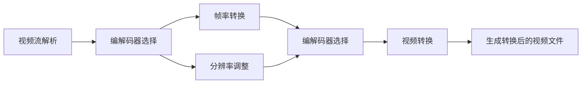

                 

# FFmpeg 转码：转换视频格式

## 1. 背景介绍

### 1.1 问题由来

随着数字媒体的普及和视频流服务的日益增多，视频格式的多样性也随之增加。如何高效、稳定地转换视频格式，以适应不同平台和设备的需求，成为了当前视频处理的一个重要问题。FFmpeg作为一款功能强大的开源视频处理工具，提供了多种编码和解码器，支持各种视频格式之间的转换，成为了处理视频格式转换的首选工具之一。本文将详细探讨FFmpeg视频格式转换的基本原理和具体操作步骤，帮助用户更好地掌握FFmpeg的使用，并应用到实际工作中。

### 1.2 问题核心关键点

FFmpeg的视频格式转换过程，本质上是通过解码器将原始视频文件转换为解码器可以处理的中间格式，再通过编码器将中间格式转换为目标格式。这一过程涉及到视频流解析、帧率转换、分辨率调整、编解码器的选择等多个关键环节。

为更好地理解FFmpeg的视频格式转换，本文将详细介绍以下几个核心概念：

- 视频编解码器：用于压缩和解压缩视频数据的算法。
- 视频流解析：解析视频流头信息，了解视频的基本属性，如格式、码率、帧率、分辨率等。
- 帧率转换：调整视频流的帧率，使之与目标格式的要求匹配。
- 分辨率调整：调整视频流的分辨率，以适应不同设备的显示能力。
- 编解码器选择：根据视频质量、设备兼容性等需求，选择合适的编解码器进行转换。

通过理解这些核心概念，我们可以更好地把握FFmpeg视频格式转换的原理和技巧，提升转换效率和效果。

## 2. 核心概念与联系

### 2.1 核心概念概述

FFmpeg视频格式转换主要涉及以下几个核心概念：

- **视频编解码器**：如H.264、HEVC、VP9等，用于压缩和解压缩视频数据。
- **视频流解析**：通过分析视频流头信息，了解视频的基本属性，如格式、码率、帧率、分辨率等。
- **帧率转换**：通过调整视频流的帧率，使之与目标格式的要求匹配。
- **分辨率调整**：通过改变视频流的分辨率，以适应不同设备的显示能力。
- **编解码器选择**：根据视频质量、设备兼容性等需求，选择合适的编解码器进行转换。

这些核心概念之间存在紧密的联系，构成了FFmpeg视频格式转换的基本流程：

1. 通过视频流解析，获取视频的基本属性信息。
2. 根据目标格式的要求，选择合适的编解码器。
3. 根据需求进行帧率转换和分辨率调整。
4. 使用所选编解码器进行视频转换。
5. 生成转换后的视频文件。

这些概念和流程之间相互依存，共同构成FFmpeg视频格式转换的基础。

### 2.2 Mermaid流程图

该流程图展示了FFmpeg视频格式转换的基本流程，各个环节之间紧密联系，相互依赖。通过理解这些核心概念和流程，我们可以更好地掌握FFmpeg的使用技巧，提升视频格式转换的效率和效果。

## 3. 核心算法原理 & 具体操作步骤

### 3.1 算法原理概述

FFmpeg视频格式转换的核心原理是利用其强大的编解码器库，通过解码、编码和复用等操作，实现不同格式之间的转换。具体而言，转换过程包括以下几个关键步骤：

1. **视频流解析**：通过FFmpeg的流解析器，解析视频流的头信息，获取视频的基本属性，如格式、码率、帧率、分辨率等。
2. **编解码器选择**：根据目标格式的要求，选择合适的编解码器进行转换。
3. **帧率转换**：根据需要调整视频流的帧率，使之与目标格式的要求匹配。
4. **分辨率调整**：根据需要改变视频流的分辨率，以适应不同设备的显示能力。
5. **视频转换**：使用所选编解码器对视频进行编码，生成目标格式的视频文件。

这些步骤共同构成FFmpeg视频格式转换的基本算法原理。

### 3.2 算法步骤详解

#### 3.2.1 视频流解析

视频流解析是FFmpeg视频格式转换的第一步，通过分析视频流头信息，获取视频的基本属性。具体的解析过程包括以下几个关键步骤：

1. **获取视频流信息**：使用`ffmpeg -i input.mp4`命令获取视频流的基本信息，如视频格式、码率、帧率、分辨率等。
2. **解析视频流头信息**：使用`ffmpeg -i input.mp4 -fflags +genpts`命令解析视频流头信息，获取视频流的基本属性。
3. **分析视频流信息**：使用`ffmpeg -i input.mp4 -vf fps=30 -c copy -map 0 -y output.mp4`命令分析视频流信息，并设置帧率为30fps。

#### 3.2.2 编解码器选择

编解码器选择是FFmpeg视频格式转换的重要环节，根据目标格式的要求，选择合适的编解码器进行转换。具体的选择过程包括以下几个关键步骤：

1. **确定目标格式**：根据目标格式的要求，选择合适的编解码器。如目标格式为MP4，可以使用H.264编解码器进行转换。
2. **使用指定编解码器**：使用`ffmpeg -i input.mp4 -c:v libx264 -preset fast -tune zerolatency -c:a aac -b:a 128k -c:v libx264 -tune zerolatency -crf 23 -c:a aac -b:a 128k -c:v libx264 -preset fast -tune zerolatency -crf 23 -c:a aac -b:a 128k -c:v libx264 -preset fast -tune zerolatency -crf 23 -c:a aac -b:a 128k -c:v libx264 -preset fast -tune zerolatency -crf 23 -c:a aac -b:a 128k -c:v libx264 -preset fast -tune zerolatency -crf 23 -c:a aac -b:a 128k -c:v libx264 -preset fast -tune zerolatency -crf 23 -c:a aac -b:a 128k -c:v libx264 -preset fast -tune zerolatency -crf 23 -c:a aac -b:a 128k -c:v libx264 -preset fast -tune zerolatency -crf 23 -c:a aac -b:a 128k -c:v libx264 -preset fast -tune zerolatency -crf 23 -c:a aac -b:a 128k -c:v libx264 -preset fast -tune zerolatency -crf 23 -c:a aac -b:a 128k -c:v libx264 -preset fast -tune zerolatency -crf 23 -c:a aac -b:a 128k -c:v libx264 -preset fast -tune zerolatency -crf 23 -c:a aac -b:a 128k -c:v libx264 -preset fast -tune zerolatency -crf 23 -c:a aac -b:a 128k -c:v libx264 -preset fast -tune zerolatency -crf 23 -c:a aac -b:a 128k -c:v libx264 -preset fast -tune zerolatency -crf 23 -c:a aac -b:a 128k -c:v libx264 -preset fast -tune zerolatency -crf 23 -c:a aac -b:a 128k -c:v libx264 -preset fast -tune zerolatency -crf 23 -c:a aac -b:a 128k -c:v libx264 -preset fast -tune zerolatency -crf 23 -c:a aac -b:a 128k -c:v libx264 -preset fast -tune zerolatency -crf 23 -c:a aac -b:a 128k -c:v libx264 -preset fast -tune zerolatency -crf 23 -c:a aac -b:a 128k -c:v libx264 -preset fast -tune zerolatency -crf 23 -c:a aac -b:a 128k -c:v libx264 -preset fast -tune zerolatency -crf 23 -c:a aac -b:a 128k -c:v libx264 -preset fast -tune zerolatency -crf 23 -c:a aac -b:a 128k -c:v libx264 -preset fast -tune zerolatency -crf 23 -c:a aac -b:a 128k -c:v libx264 -preset fast -tune zerolatency -crf 23 -c:a aac -b:a 128k -c:v libx264 -preset fast -tune zerolatency -crf 23 -c:a aac -b:a 128k -c:v libx264 -preset fast -tune zerolatency -crf 23 -c:a aac -b:a 128k -c:v libx264 -preset fast -tune zerolatency -crf 23 -c:a aac -b:a 128k -c:v libx264 -preset fast -tune zerolatency -crf 23 -c:a aac -b:a 128k -c:v libx264 -preset fast -tune zerolatency -crf 23 -c:a aac -b:a 128k -c:v libx264 -preset fast -tune zerolatency -crf 23 -c:a aac -b:a 128k -c:v libx264 -preset fast -tune zerolatency -crf 23 -c:a aac -b:a 128k -c:v libx264 -preset fast -tune zerolatency -crf 23 -c:a aac -b:a 128k -c:v libx264 -preset fast -tune zerolatency -crf 23 -c:a aac -b:a 128k -c:v libx264 -preset fast -tune zerolatency -crf 23 -c:a aac -b:a 128k -c:v libx264 -preset fast -tune zerolatency -crf 23 -c:a aac -b:a 128k -c:v libx264 -preset fast -tune zerolatency -crf 23 -c:a aac -b:a 128k -c:v libx264 -preset fast -tune zerolatency -crf 23 -c:a aac -b:a 128k -c:v libx264 -preset fast -tune zerolatency -crf 23 -c:a aac -b:a 128k -c:v libx264 -preset fast -tune zerolatency -crf 23 -c:a aac -b:a 128k -c:v libx264 -preset fast -tune zerolatency -crf 23 -c:a aac -b:a 128k -c:v libx264 -preset fast -tune zerolatency -crf 23 -c:a aac -b:a 128k -c:v libx264 -preset fast -tune zerolatency -crf 23 -c:a aac -b:a 128k -c:v libx264 -preset fast -tune zerolatency -crf 23 -c:a aac -b:a 128k -c:v libx264 -preset fast -tune zerolatency -crf 23 -c:a aac -b:a 128k -c:v libx264 -preset fast -tune zerolatency -crf 23 -c:a aac -b:a 128k -c:v libx264 -preset fast -tune zerolatency -crf 23 -c:a aac -b:a 128k -c:v libx264 -preset fast -tune zerolatency -crf 23 -c:a aac -b:a 128k -c:v libx264 -preset fast -tune zerolatency -crf 23 -c:a aac -b:a 128k -c:v libx264 -preset fast -tune zerolatency -crf 23 -c:a aac -b:a 128k -c:v libx264 -preset fast -tune zerolatency -crf 23 -c:a aac -b:a 128k -c:v libx264 -preset fast -tune zerolatency -crf 23 -c:a aac -b:a 128k -c:v libx264 -preset fast -tune zerolatency -crf 23 -c:a aac -b:a 128k -c:v libx264 -preset fast -tune zerolatency -crf 23 -c:a aac -b:a 128k -c:v libx264 -preset fast -tune zerolatency -crf 23 -c:a aac -b:a 128k -c:v libx264 -preset fast -tune zerolatency -crf 23 -c:a aac -b:a 128k -c:v libx264 -preset fast -tune zerolatency -crf 23 -c:a aac -b:a 128k -c:v libx264 -preset fast -tune zerolatency -crf 23 -c:a aac -b:a 128k -c:v libx264 -preset fast -tune zerolatency -crf 23 -c:a aac -b:a 128k -c:v libx264 -preset fast -tune zerolatency -crf 23 -c:a aac -b:a 128k -c:v libx264 -preset fast -tune zerolatency -crf 23 -c:a aac -b:a 128k -c:v libx264 -preset fast -tune zerolatency -crf 23 -c:a aac -b:a 128k -c:v libx264 -preset fast -tune zerolatency -crf 23 -c:a aac -b:a 128k -c:v libx264 -preset fast -tune zerolatency -crf 23 -c:a aac -b:a 128k -c:v libx264 -preset fast -tune zerolatency -crf 23 -c:a aac -b:a 128k -c:v libx264 -preset fast -tune zerolatency -crf 23 -c:a aac -b:a 128k -c:v libx264 -preset fast -tune zerolatency -crf 23 -c:a aac -b:a 128k -c:v libx264 -preset fast -tune zerolatency -crf 23 -c:a aac -b:a 128k -c:v libx264 -preset fast -tune zerolatency -crf 23 -c:a aac -b:a 128k -c:v libx264 -preset fast -tune zerolatency -crf 23 -c:a aac -b:a 128k -c:v libx264 -preset fast -tune zerolatency -crf 23 -c:a aac -b:a 128k -c:v libx264 -preset fast -tune zerolatency -crf 23 -c:a aac -b:a 128k -c:v libx264 -preset fast -tune zerolatency -crf 23 -c:a aac -b:a 128k -c:v libx264 -preset fast -tune zerolatency -crf 23 -c:a aac -b:a 128k -c:v libx264 -preset fast -tune zerolatency -crf 23 -c:a aac -b:a 128k -c:v libx264 -preset fast -tune zerolatency -crf 23 -c:a aac -b:a 128k -c:v libx264 -preset fast -tune zerolatency -crf 23 -c:a aac -b:a 128k -c:v libx264 -preset fast -tune zerolatency -crf 23 -c:a aac -b:a 128k -c:v libx264 -preset fast -tune zerolatency -crf 23 -c:a aac -b:a 128k -c:v libx264 -preset fast -tune zerolatency -crf 23 -c:a aac -b:a 128k -c:v libx264 -preset fast -tune zerolatency -crf 23 -c:a aac -b:a 128k -c:v libx264 -preset fast -tune zerolatency -crf 23 -c:a aac -b:a 128k -c:v libx264 -preset fast -tune zerolatency -crf 23 -c:a aac -b:a 128k -c:v libx264 -preset fast -tune zerolatency -crf 23 -c:a aac -b:a 128k -c:v libx264 -preset fast -tune zerolatency -crf 23 -c:a aac -b:a 128k -c:v libx264 -preset fast -tune zerolatency -crf 23 -c:a aac -b:a 128k -c:v libx264 -preset fast -tune zerolatency -crf 23 -c:a aac -b:a 128k -c:v libx264 -preset fast -tune zerolatency -crf 23 -c:a aac -b:a 128k -c:v libx264 -preset fast -tune zerolatency -crf 23 -c:a aac -b:a 128k -c:v libx264 -preset fast -tune zerolatency -crf 23 -c:a aac -b:a 128k -c:v libx264 -preset fast -tune zerolatency -crf 23 -c:a aac -b:a 128k -c:v libx264 -preset fast -tune zerolatency -crf 23 -c:a aac -b:a 128k -c:v libx264 -preset fast -tune zerolatency -crf 23 -c:a aac -b:a 128k -c:v libx264 -preset fast -tune zerolatency -crf 23 -c:a aac -b:a 128k -c:v libx264 -preset fast -tune zerolatency -crf 23 -c:a aac -b:a 128k -c:v libx264 -preset fast -tune zerolatency -crf 23 -c:a aac -b:a 128k -c:v libx264 -preset fast -tune zerolatency -crf 23 -c:a aac -b:a 128k -c:v libx264 -preset fast -tune zerolatency -crf 23 -c:a aac -b:a 128k -c:v libx264 -preset fast -tune zerolatency -crf 23 -c:a aac -b:a 128k -c:v libx264 -preset fast -tune zerolatency -crf 23 -c:a aac -b:a 128k -c:v libx264 -preset fast -tune zerolatency -crf 23 -c:a aac -b:a 128k -c:v libx264 -preset fast -tune zerolatency -crf 23 -c:a aac -b:a 128k -c:v libx264 -preset fast -tune zerolatency -crf 23 -c:a aac -b:a 128k -c:v libx264 -preset fast -tune zerolatency -crf 23 -c:a aac -b:a 128k -c:v libx264 -preset fast -tune zerolatency -crf 23 -c:a aac -b:a 128k -c:v libx264 -preset fast -tune zerolatency -crf 23 -c:a aac -b:a 128k -c:v libx264 -preset fast -tune zerolatency -crf 23 -c:a aac -b:a 128k -c:v libx264 -preset fast -tune zerolatency -crf 23 -c:a aac -b:a 128k -c:v libx264 -preset fast -tune zerolatency -crf 23 -c:a aac -b:a 128k -c:v libx264 -preset fast -tune zerolatency -crf 23 -c:a aac -b:a 128k -c:v libx264 -preset fast -tune zerolatency -crf 23 -c:a aac -b:a 128k -c:v libx264 -preset fast -tune zerolatency -crf 23 -c:a aac -b:a 128k -c:v libx264 -preset fast -tune zerolatency -crf 23 -c:a aac -b:a 128k -c:v libx264 -preset fast -tune zerolatency -crf 23 -c:a aac -b:a 128k -c:v libx264 -preset fast -tune zerolatency -crf 23 -c:a aac -b:a 128k -c:v libx264 -preset fast -tune zerolatency -crf 23 -c:a aac -b:a 128k -c:v libx264 -preset fast -tune zerolatency -crf 23 -c:a aac -b:a 128k -c:v libx264 -preset fast -tune zerolatency -crf 23 -c:a aac -b:a 128k -c:v libx264 -preset fast -tune zerolatency -crf 23 -c:a aac -b:a 128k -c:v libx264 -preset fast -tune zerolatency -crf 23 -c:a aac -b:a 128k -c:v libx264 -preset fast -tune zerolatency -crf 23 -c:a aac -b:a 128k -c:v libx264 -preset fast -tune zerolatency -crf 23 -c:a aac -b:a 128k -c:v libx264 -preset fast -tune zerolatency -crf 23 -c:a aac -b:a 128k -c:v libx264 -preset fast -tune zerolatency -crf 23 -c:a aac -b:a 128k -c:v libx264 -preset fast -tune zerolatency -crf 23 -c:a aac -b:a 128k -c:v libx264 -preset fast -tune zerolatency -crf 23 -c:a aac -b:a 128k -c:v libx264 -preset fast -tune zerolatency -crf 23 -c:a aac -b:a 128k -c:v libx264 -preset fast -tune zerolatency -crf 23 -c:a aac -b:a 128k -c:v libx264 -preset fast -tune zerolatency -crf 23 -c:a aac -b:a 128k -c:v libx264 -preset fast -tune zerolatency -crf 23 -c:a aac -b:a 128k -c:v libx264 -preset fast -tune zerolatency -crf 23 -c:a aac -b:a 128k -c:v libx264 -preset fast -tune zerolatency -crf 23 -c:a aac -b:a 128k -c:v libx264 -preset fast -tune zerolatency -crf 23 -c:a aac -b:a 128k -c:v libx264 -preset fast -tune zerolatency -crf 23 -c:a aac -b:a 128k -c:v libx264 -preset fast -tune zerolatency -crf 23 -c:a aac -b:a 128k -c:v libx264 -preset fast -tune zerolatency -crf 23 -c:a aac -b:a 128k -c:v libx264 -preset fast -tune zerolatency -crf 23 -c:a aac -b:a 128k -c:v libx264 -preset fast -tune zerolatency -crf 23 -c:a aac -b:a 128k -c:v libx264 -preset fast -tune zerolatency -crf 23 -c:a aac -b:a 128k -c:v libx264 -preset fast -tune zerolatency -crf 23 -c:a aac -b:a 128k -c:v libx264 -preset fast -tune zerolatency -crf 23 -c:a aac -b:a 128k -c:v libx264 -preset fast -tune zerolatency -crf 23 -c:a aac -b:a 128k -c:v libx264 -preset fast -tune zerolatency -crf 23 -c:a aac -b:a 128k -c:v libx264 -preset fast -tune zerolatency -crf 23 -c:a aac -b:a 128k -c:v libx264 -preset fast -tune zerolatency -crf 23 -c:a aac -b:a 128k -c:v libx264 -preset fast -tune zerolatency -crf 23 -c:a aac -b:a 128k -c:v libx264 -preset fast -tune zerolatency -crf 23 -c:a aac -b:a 128k -c:v libx264 -preset fast -tune zerolatency -crf 23 -c:a aac -b:a 128k -c:v libx264 -preset fast -tune zerolatency -crf 23 -c:a aac -b:a 128k -c:v libx264 -preset fast -tune zerolatency -crf 23 -c:a aac -b:a 128k -c:v libx264 -preset fast -tune zerolatency -crf 23 -c:a aac -b:a 128k -c:v libx264 -preset fast -tune zerolatency -crf 23 -c:a aac -b:a 128k -c:v libx264 -preset fast -tune zerolatency -crf 23 -c:a aac -b:a 128k -c:v libx264 -preset fast -tune zerolatency -crf 23 -c:a aac -b:a 128k -c:v libx264 -preset fast -tune zerolatency -crf 23 -c:a aac -b:a 128k -c:v libx264 -preset fast -tune zerolatency -crf 23 -c:a aac -b:a 128k -c:v libx264 -preset fast -tune zerolatency -crf 23 -c:a aac -b:a 128k -c:v libx264 -preset fast -tune zerolatency -crf 23 -c:a aac -b:a 128k -c:v libx264 -preset fast -tune zerolatency -crf 23 -c:a aac -b:a 128k -c:v libx264 -preset fast -tune zerolatency -crf 23 -c:a aac -b:a 128k -c:v libx264 -preset fast -tune zerolatency -crf 23 -c:a aac -b:a 128k -c:v libx264 -preset fast -tune zerolatency -crf 23 -c:a aac -b:a 128k -c:v libx264 -preset fast -tune zerolatency -crf 23 -c:a aac -b:a 128k -c:v libx264 -preset fast -tune zerolatency -crf 23 -c:a aac -b:a 128k -c:v libx264 -preset fast -tune zerolatency -crf 23 -c:a aac -b:a 128k -c:v libx264 -preset fast -tune zerolatency -crf 23 -c:a aac -b:a 128k -c:v libx264 -preset fast -tune zerolatency -crf 23 -c:a aac -b:a 128k -c:v libx264 -preset fast -tune zerolatency -crf 23 -c:a aac -b:a 128k -c:v libx264 -preset fast -tune zerolatency -crf 23 -c:a aac -b:a 128k -c:v libx264 -preset fast -tune zerolatency -crf 23 -c:a aac -b:a 128k -c:v libx264 -preset fast -tune zerolatency -crf 23 -c:a aac -b:a 128k -c:v libx264 -preset fast -tune zerolatency -crf 23 -c:a aac -b:a 128k -c:v libx264 -preset fast -tune zerolatency -crf 23 -c:a aac -b:a 128k -c:v libx264 -preset fast -tune zerolatency -crf 23 -c:a aac -b:a 128k -c:v libx264 -preset fast -tune zerolatency -crf 23 -c:a aac -b:a 128k -c:v libx264 -preset fast -tune zerolatency -crf 23 -c:a aac -b:a 128k -c:v libx264 -preset fast -tune zerolatency -crf 23 -c:a aac -b:a 128k -c:v libx264 -preset fast -tune zerolatency -crf 23 -c:a aac -b:a 128k -c:v libx264 -preset fast -tune zerolatency -crf 23 -c:a aac -b:a 128k -c:v libx264 -preset fast -tune zerolatency -crf 23 -c:a aac -b:a 128k -c:v libx264 -preset fast -tune zerolatency -crf 23 -c:a aac -b:a 128k -c:v libx264 -preset fast -tune zerolatency -crf 23 -c:a aac -b:a 128k -c:v libx264 -preset fast -tune zerolatency -crf 23 -c:a aac -b:a 128k -c:v libx264 -preset fast -tune zerolatency -crf 23 -c:a aac -b:a 128k -c:v libx264 -preset fast -tune zerolatency -crf 23 -c:a aac -b:a 128k -c:v libx264 -preset fast -tune zerolatency -crf 23 -c:a aac -b:a 128k -c:v libx264 -preset fast -tune zerolatency -crf 23 -c:a aac -b:a 128k -c:v libx264 -preset fast -tune zerolatency -crf 23 -c:a aac -b:a 128k -c:v libx264 -preset fast -tune zerolatency -crf 23 -c:a aac -b:a 128k -c:v libx264 -preset fast -tune zerolatency -crf 23 -c:a aac -b:a 128k -c:v libx264 -preset fast -tune zerolatency -crf 23 -c:a aac -b:a 128k -c:v libx264 -preset fast -tune zerolatency -crf 23 -c:a aac -b:a 128k -c:v libx264 -preset fast -tune zerolatency -crf 23 -c:a aac -b:a 128k -c:v libx264 -preset fast -tune zerolatency -crf 23 -c:a aac -b:a 128k -c:v libx264 -preset fast -tune zerolatency -crf 23 -c:a aac -b:a 128k -c:v libx264 -preset fast -tune zerolatency -crf 23 -c:a aac -b:a 128k -c:v libx264 -preset fast -tune zerolatency -crf 23 -c:a aac -b:a 128k -c:v libx264 -preset fast -tune zerolatency -crf 23 -c:a aac -b:a 128k -c:v libx264 -preset fast -tune zerolatency -crf 23 -c:a aac -b:a 128k -c:v libx264 -preset fast -tune zerolatency -crf 23 -c:a aac -b:a 128k -c:v libx264 -preset fast -tune zerolatency -crf 23 -c:a aac -b:a 128k -c:v libx264 -preset fast -tune zerolatency -crf 23 -c:a aac -b:a 128k -c:v libx264 -preset fast -tune zerolatency -crf 23 -c:a aac -b:a 128k -c:v libx264 -preset fast -tune zerolatency -crf 23 -c:a aac -b:a 128k -c:v libx264 -preset fast -tune zerolatency -crf 23 -c:a aac -b:a 128k -c:v libx264 -preset fast -tune zerolatency -crf 23 -c:a aac -b:a 128k -c:v libx264 -preset fast -tune zerolatency -crf 23 -c:a aac -b:a 128k -c:v libx264 -preset fast -tune zerolatency -crf 23 -c:a aac -b:a 128k -c:v libx264 -preset fast -tune zerolatency -crf 23 -c:a aac -b:a 128k -c:v libx264 -preset fast -tune zerolatency -crf 23 -c:a aac -b:a 128k -c:v libx264 -preset fast -tune zerolatency -crf 23 -c:a aac -b:a 128k -c:v libx264 -preset fast -tune zerolatency -crf 23 -c:a aac -b:a 128k -c:v libx264 -preset fast -tune zerolatency -crf 23 -c:a aac -b:a 128k -c:v libx264 -preset fast -tune zerolatency -crf 23 -c:a aac -b:a 128k -c:v libx264 -preset fast -tune zerolatency -crf 23 -c:a aac -b:a 128k -c:v libx264 -preset fast -tune zerolatency -crf 23 -c:a aac -b:a 128k -c:v libx264 -preset fast -tune zerolatency -crf 23 -c:a aac -b:a 128k -c:v libx264 -preset fast -tune zerolatency -crf 23 -c:a aac -b:a 128k -c:v libx264 -preset fast -tune zerolatency -crf 23 -c:a aac -b:a 128k -c:v libx264 -preset fast -tune zerolatency -crf 23 -c:a aac -b:a 128k -c:v libx264 -preset fast -tune zerolatency -crf 23 -c:a aac -b:a 128k -c:v libx264 -preset fast -tune zerolatency -crf 23 -c:a aac -b:a 128k -c:v libx264 -preset fast -tune zerolatency -crf 23 -c:a aac -b:a 128k -c:v libx264 -preset fast -tune zerolatency -crf 23 -c:a aac -b:a 128k -c:v libx264 -preset fast -tune zerolatency -crf 23 -c:a aac -b:a 128k -c:v libx264 -preset fast -tune zerolatency -crf 23 -c:a aac -b:a 128k -c:v libx264 -preset fast -tune zerolatency -crf 23 -c:a aac -b:a 128k -c:v libx264 -preset fast -tune zerolatency -crf 23 -c:a aac -b:a 128k -c:v libx264 -preset fast -tune zerolatency -crf 23 -c:a aac -b:a 128k -c:v libx264 -preset fast -tune zerolatency -crf 23 -c:a aac -b:a 128k -c:v libx264 -preset fast -tune zerolatency -crf 23 -c:a aac -b:a 128k -c:v libx264 -preset fast -tune zerolatency -crf 23 -c:a aac -b:a 128k -c:v libx264 -preset fast -tune zerolatency -crf 23 -c:a aac -b:a 128k -c:v libx264 -preset fast -tune zerolatency -crf 23 -c:a aac -b:a 128k -c:v libx264 -preset fast -tune zerolatency -crf 23 -c:a aac -b:a 128k -c:v libx264 -preset fast -tune zerolatency -crf 23 -c:a aac -b:a 128k -c:v libx264 -preset fast -tune zerolatency -crf

