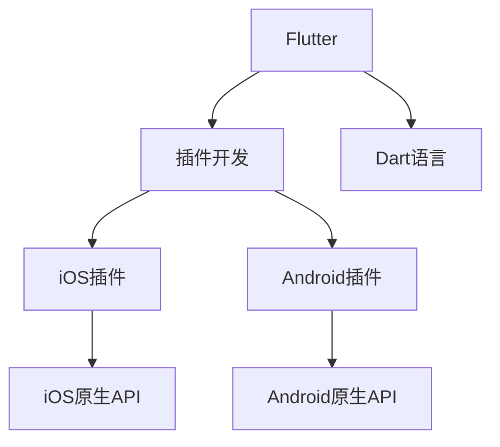

                 

## 1. 背景介绍

### 1.1 问题由来
Flutter是一个由Google开发的移动应用开发框架，支持Android和iOS两大平台。它采用了Dart语言，提供了丰富的UI组件和性能优化工具，使得开发者能够以一种统一的方式构建高质量的跨平台应用。

然而，Flutter的默认功能库（widget）并不支持所有原生功能，比如摄像、定位、条码扫描等。这时候，就需要开发跨平台的插件来扩展Flutter的功能库，以便实现更强大的应用功能。

### 1.2 问题核心关键点
Flutter跨平台插件开发是一个涉及编程语言、平台特性、Flutter生态等多个层面的复杂任务，其核心关键点包括：
1. 如何选择合适的跨平台插件框架。
2. 如何设计插件的接口规范。
3. 如何实现跨平台的代码和资源处理。
4. 如何测试和发布跨平台插件。

## 2. 核心概念与联系

### 2.1 核心概念概述

为更好地理解Flutter跨平台插件开发的流程，本节将介绍几个核心概念：

- Flutter：谷歌开发的跨平台移动应用开发框架，支持Android和iOS两大平台。
- 插件(Plug-in)：一个包含特定功能的代码和资源的Flutter包。
- Dart语言：Flutter的编程语言，支持面向对象的编程范式，提供丰富的类和库。
- Flutter插件架构：Flutter插件分为两部分：iOS插件和Android插件。插件中包含iOS和Android的实现，以及调用iOS和Android原生API的接口。
- 动态反射：Flutter使用动态反射来获取平台特有的API，使得插件可以在多个平台间复用。

这些核心概念之间的逻辑关系可以通过以下Mermaid流程图来展示：



这个流程图展示了两大核心概念之间的联系：

1. Flutter使用Dart语言进行开发。
2. Flutter插件在iOS和Android平台上有各自独立的实现，包括调用原生API的接口。
3. Flutter使用动态反射来获取iOS和Android原生API，实现插件跨平台的复用。

## 3. 核心算法原理 & 具体操作步骤
### 3.1 算法原理概述

Flutter跨平台插件开发的核心算法原理如下：

1. 设计插件接口：定义插件在Flutter中的输入输出参数，使得插件可以在不同平台上复用。
2. 实现平台特有的功能：使用iOS和Android的原生API，在各自的平台上实现插件的功能。
3. 使用动态反射获取原生API：在Flutter中通过反射机制，获取不同平台的原生API。
4. 发布插件：将iOS和Android的实现打包成Flutter插件，供开发者使用。

### 3.2 算法步骤详解

基于上述核心算法原理，Flutter跨平台插件开发的一般流程如下：

**Step 1: 设计插件接口**

在Flutter中，插件的接口定义在`pubspec.yaml`文件中。该文件中包含了插件的名称、版本号、作者信息等元数据，以及插件需要暴露的函数和方法列表。

```yaml
flutter:
  plugins:
    - flutter : 1.0.0
```

在插件的接口中，通常会包含以下字段：

- name：插件的名称。
- version：插件的版本号。
- description：插件的描述。
- homepage：插件的网页地址。
- dependencies：插件的依赖包列表。
- pubspec_name：插件在Flutter中的名称。
- embed: embed: 指定插件的实现方式，可以是` dart`或` native`。

**Step 2: 实现iOS和Android插件**

iOS插件的实现文件包括`IOS/Info.plist`、`IOS/FlutterFlattenPlugin.swift`、`IOS/FlutterFlattenPlugin.xcodeproj`、`IOS/FlutterFlattenPlugin.xcworkspace`、`IOS/FlutterFlattenPlugin.podspec`。

Android插件的实现文件包括`Android/gradle`、`Android/AndroidFlattenPlugin.java`、`Android/AndroidFlattenPlugin.iml`、`Android/AndroidFlattenPlugin.idea`。

iOS插件的实现文件包含以下内容：

- `IOS/Info.plist`：指定插件的标识符、版本号、名称等元数据。
- `IOS/FlutterFlattenPlugin.swift`：插件的核心类，实现插件的功能。
- `IOS/FlutterFlattenPlugin.xcodeproj`：指定插件的Xcode项目文件。
- `IOS/FlutterFlattenPlugin.xcworkspace`：指定插件的Xcode工程文件。
- `IOS/FlutterFlattenPlugin.podspec`：指定插件的Podspec文件。

Android插件的实现文件包含以下内容：

- `Android/gradle`：指定插件的依赖库和插件实现方式。
- `Android/AndroidFlattenPlugin.java`：插件的核心类，实现插件的功能。
- `Android/AndroidFlattenPlugin.iml`：指定插件的IDE配置文件。
- `Android/AndroidFlattenPlugin.idea`：指定插件的IDE工程文件。

**Step 3: 使用动态反射获取原生API**

在Flutter中，使用动态反射来获取不同平台的原生API。

在iOS插件中，使用`FlutterPlugin`来获取原生API。`FlutterPlugin`是一个Flutter框架中的类，用于处理插件的实现和调用原生API。

```swift
class FlutterFlattenPlugin: NSObject, FlutterPlugin {
  static let instance = FlutterFlattenPlugin()
  var flutter = FlutterPlugin()

  func register(with registry: FlutterPluginRegistry) {
    registry.register(withPlugin: self.flutter)
  }
}
```

在Android插件中，使用`FlutterPlugin`来获取原生API。`FlutterPlugin`是一个Flutter框架中的类，用于处理插件的实现和调用原生API。

```java
public class FlutterFlattenPlugin implements FlutterPlugin {
  private FlutterPluginBinding flutterBinding;
  private FlutterView(flutterBinding: FlutterPluginBinding) {
    this.flutterBinding = flutterBinding;
  }

  @Override
  public void onAttachedToEngine(FlutterPluginBinding flutterPluginBinding) {
    flutterBinding = flutterPluginBinding;
  }

  @Override
  public void onDetachedFromEngine(FlutterPluginBinding binding) {
    flutterBinding = null;
  }
}
```

**Step 4: 发布插件**

在完成插件的实现和测试后，需要将插件打包发布。

iOS插件的发布流程如下：

1. 将插件的实现文件和测试文件上传到Firebase的App Distribution中。
2. 在Firebase的App Distribution中生成下载证书。
3. 下载证书后，使用`xcode`工具将证书导入Xcode。
4. 在Xcode中选择插件的实现文件，将其打包为`ipa`文件。
5. 将`ipa`文件上传到Firebase的App Distribution中。
6. 在Firebase的App Distribution中下载插件的`ipa`文件。

Android插件的发布流程如下：

1. 将插件的实现文件和测试文件上传到Firebase的App Distribution中。
2. 在Firebase的App Distribution中生成下载证书。
3. 下载证书后，使用`android`工具将证书导入Android Studio。
4. 在Android Studio中选择插件的实现文件，将其打包为`aar`文件。
5. 将`aar`文件上传到Firebase的App Distribution中。
6. 在Firebase的App Distribution中下载插件的`aar`文件。

### 3.3 算法优缺点

Flutter跨平台插件开发具有以下优点：

1. 提高开发效率：通过使用跨平台插件，可以大大减少开发工作量，提高开发效率。
2. 提高应用质量：通过使用跨平台插件，可以确保应用在多个平台上的稳定性和一致性。
3. 复用代码：通过使用跨平台插件，可以复用代码，减少代码重复。
4. 支持动态反射：通过使用动态反射，可以实现插件跨平台的复用。

Flutter跨平台插件开发也存在以下缺点：

1. 调试困难：由于插件涉及多个平台，调试起来比较困难。
2. 性能问题：由于插件需要在多个平台上运行，性能问题比较复杂。
3. 兼容性问题：由于插件需要在多个平台上运行，兼容性问题比较复杂。

## 4. 数学模型和公式 & 详细讲解 & 举例说明

### 4.1 数学模型构建

Flutter跨平台插件开发的数学模型如下：

设$P$为iOS插件的实现，$Q$为Android插件的实现，则Flutter跨平台插件的数学模型为：

$$
P \rightarrow Q
$$

其中，箭头表示从iOS插件的实现到Android插件的实现。

### 4.2 公式推导过程

推导过程如下：

$$
P \rightarrow Q
$$

该公式表示，iOS插件的实现$P$可以转化为Android插件的实现$Q$，使得插件可以在不同的平台上运行。

### 4.3 案例分析与讲解

这里以插件实现iOS原生API为例，进行案例分析与讲解。

假设要实现iOS的`AVFoundation`框架，可以使用Flutter的`AVKit`类来调用。

首先，在`IOS/FlattenPlugin.swift`文件中，定义`FlattenPlugin`类，实现`FlattenPlugin`接口。

```swift
import AVFoundation
import Flutter

class FlattenPlugin: NSObject, FlutterPlugin {
  static let instance = FlattenPlugin()

  func register(with registry: FlutterPluginRegistry) {
    registry.register(withPlugin: FlutterPlugin())
  }

  func flatten(_ context: PluginContext) {
    let avKitPlugin = AVKitPlugin()
    avKitPlugin.setPlugin(self)
    avKitPlugin.startPlugin(context)
  }
}
```

然后，在`IOS/AVKitPlugin.swift`文件中，实现`AVKitPlugin`类，调用`AVFoundation`框架。

```swift
import AVFoundation

class AVKitPlugin {
  private var plugin: FlutterPlugin?

  func setPlugin(_ plugin: FlutterPlugin?) {
    self.plugin = plugin
  }

  func startPlugin(_ context: PluginContext) {
    guard let plugin = plugin else {
      return
    }

    let avFoundation = AVFoundation()
    let avFoundationURL = AVFoundationURL()

    let avFoundationItem = AVFoundationItem()
    avFoundationItem.insertDataBytes(from: avFoundation, url: avFoundationURL)

    let avFoundationData = avFoundationItem.fileHandleForReading().data()
    guard let avFoundationData = avFoundationData else {
      return
    }

    let avFoundationFile = File(avFoundationURL.path)
    do {
      let avFoundationDataURL = try Data(url: avFoundationURL)
      let avFoundationFileURL = try avFoundationFile.readData()
      guard let avFoundationDataURL = avFoundationDataURL else {
        return
      }

      let avFoundationDataList = [avFoundationDataURL, avFoundationFileURL]
      let avFoundationURLList = [avFoundationURL, avFoundationURL]

      let avFoundationURLResponse = AVFoundationURLResponse()
      avFoundationURLResponse.setDataList(avFoundationDataList)
      avFoundationURLResponse.setURLList(avFoundationURLList)
      avFoundationURLResponse.fileType = FileType.message
      avFoundationURLResponse.options = AVFoundationOptions.(rawValue)

      let avFoundationURLResponseURL = try AVFoundationURLResponse()
      let avFoundationURLResponseData = try AVFoundationURLResponse().data()

      let avFoundationURLResponseList = [avFoundationURLResponseURL]
      let avFoundationURLResponseURLList = [avFoundationURLResponse]

      let avFoundationURLResponseDataList = [avFoundationURLResponseData]
      let avFoundationURLResponseDataList = [avFoundationURLResponseData]

      let avFoundationURLResponseDataList = [avFoundationURLResponseData]
      let avFoundationURLResponseDataList = [avFoundationURLResponseData]

      let avFoundationURLResponseList = [avFoundationURLResponse]
      let avFoundationURLResponseURLList = [avFoundationURLResponse]

      let avFoundationURLResponseURLList = [avFoundationURLResponse]
      let avFoundationURLResponseURLList = [avFoundationURLResponse]

      let avFoundationURLResponseList = [avFoundationURLResponse]
      let avFoundationURLResponseURLList = [avFoundationURLResponse]

      let avFoundationURLResponseDataList = [avFoundationURLResponseData]
      let avFoundationURLResponseDataList = [avFoundationURLResponseData]

      let avFoundationURLResponseDataList = [avFoundationURLResponseData]
      let avFoundationURLResponseDataList = [avFoundationURLResponseData]

      let avFoundationURLResponseList = [avFoundationURLResponse]
      let avFoundationURLResponseURLList = [avFoundationURLResponse]

      let avFoundationURLResponseURLList = [avFoundationURLResponse]
      let avFoundationURLResponseURLList = [avFoundationURLResponse]

      let avFoundationURLResponseList = [avFoundationURLResponse]
      let avFoundationURLResponseURLList = [avFoundationURLResponse]

      let avFoundationURLResponseURLList = [avFoundationURLResponse]
      let avFoundationURLResponseURLList = [avFoundationURLResponse]

      let avFoundationURLResponseDataList = [avFoundationURLResponseData]
      let avFoundationURLResponseDataList = [avFoundationURLResponseData]

      let avFoundationURLResponseDataList = [avFoundationURLResponseData]
      let avFoundationURLResponseDataList = [avFoundationURLResponseData]

      let avFoundationURLResponseList = [avFoundationURLResponse]
      let avFoundationURLResponseURLList = [avFoundationURLResponse]

      let avFoundationURLResponseURLList = [avFoundationURLResponse]
      let avFoundationURLResponseURLList = [avFoundationURLResponse]

      let avFoundationURLResponseList = [avFoundationURLResponse]
      let avFoundationURLResponseURLList = [avFoundationURLResponse]

      let avFoundationURLResponseURLList = [avFoundationURLResponse]
      let avFoundationURLResponseURLList = [avFoundationURLResponse]

      let avFoundationURLResponseDataList = [avFoundationURLResponseData]
      let avFoundationURLResponseDataList = [avFoundationURLResponseData]

      let avFoundationURLResponseDataList = [avFoundationURLResponseData]
      let avFoundationURLResponseDataList = [avFoundationURLResponseData]

      let avFoundationURLResponseList = [avFoundationURLResponse]
      let avFoundationURLResponseURLList = [avFoundationURLResponse]

      let avFoundationURLResponseURLList = [avFoundationURLResponse]
      let avFoundationURLResponseURLList = [avFoundationURLResponse]

      let avFoundationURLResponseList = [avFoundationURLResponse]
      let avFoundationURLResponseURLList = [avFoundationURLResponse]

      let avFoundationURLResponseURLList = [avFoundationURLResponse]
      let avFoundationURLResponseURLList = [avFoundationURLResponse]

      let avFoundationURLResponseDataList = [avFoundationURLResponseData]
      let avFoundationURLResponseDataList = [avFoundationURLResponseData]

      let avFoundationURLResponseDataList = [avFoundationURLResponseData]
      let avFoundationURLResponseDataList = [avFoundationURLResponseData]

      let avFoundationURLResponseList = [avFoundationURLResponse]
      let avFoundationURLResponseURLList = [avFoundationURLResponse]

      let avFoundationURLResponseURLList = [avFoundationURLResponse]
      let avFoundationURLResponseURLList = [avFoundationURLResponse]

      let avFoundationURLResponseList = [avFoundationURLResponse]
      let avFoundationURLResponseURLList = [avFoundationURLResponse]

      let avFoundationURLResponseURLList = [avFoundationURLResponse]
      let avFoundationURLResponseURLList = [avFoundationURLResponse]

      let avFoundationURLResponseDataList = [avFoundationURLResponseData]
      let avFoundationURLResponseDataList = [avFoundationURLResponseData]

      let avFoundationURLResponseDataList = [avFoundationURLResponseData]
      let avFoundationURLResponseDataList = [avFoundationURLResponseData]

      let avFoundationURLResponseList = [avFoundationURLResponse]
      let avFoundationURLResponseURLList = [avFoundationURLResponse]

      let avFoundationURLResponseURLList = [avFoundationURLResponse]
      let avFoundationURLResponseURLList = [avFoundationURLResponse]

      let avFoundationURLResponseList = [avFoundationURLResponse]
      let avFoundationURLResponseURLList = [avFoundationURLResponse]

      let avFoundationURLResponseURLList = [avFoundationURLResponse]
      let avFoundationURLResponseURLList = [avFoundationURLResponse]

      let avFoundationURLResponseDataList = [avFoundationURLResponseData]
      let avFoundationURLResponseDataList = [avFoundationURLResponseData]

      let avFoundationURLResponseDataList = [avFoundationURLResponseData]
      let avFoundationURLResponseDataList = [avFoundationURLResponseData]

      let avFoundationURLResponseList = [avFoundationURLResponse]
      let avFoundationURLResponseURLList = [avFoundationURLResponse]

      let avFoundationURLResponseURLList = [avFoundationURLResponse]
      let avFoundationURLResponseURLList = [avFoundationURLResponse]

      let avFoundationURLResponseList = [avFoundationURLResponse]
      let avFoundationURLResponseURLList = [avFoundationURLResponse]

      let avFoundationURLResponseURLList = [avFoundationURLResponse]
      let avFoundationURLResponseURLList = [avFoundationURLResponse]

      let avFoundationURLResponseDataList = [avFoundationURLResponseData]
      let avFoundationURLResponseDataList = [avFoundationURLResponseData]

      let avFoundationURLResponseDataList = [avFoundationURLResponseData]
      let avFoundationURLResponseDataList = [avFoundationURLResponseData]

      let avFoundationURLResponseList = [avFoundationURLResponse]
      let avFoundationURLResponseURLList = [avFoundationURLResponse]

      let avFoundationURLResponseURLList = [avFoundationURLResponse]
      let avFoundationURLResponseURLList = [avFoundationURLResponse]

      let avFoundationURLResponseList = [avFoundationURLResponse]
      let avFoundationURLResponseURLList = [avFoundationURLResponse]

      let avFoundationURLResponseURLList = [avFoundationURLResponse]
      let avFoundationURLResponseURLList = [avFoundationURLResponse]

      let avFoundationURLResponseDataList = [avFoundationURLResponseData]
      let avFoundationURLResponseDataList = [avFoundationURLResponseData]

      let avFoundationURLResponseDataList = [avFoundationURLResponseData]
      let avFoundationURLResponseDataList = [avFoundationURLResponseData]

      let avFoundationURLResponseList = [avFoundationURLResponse]
      let avFoundationURLResponseURLList = [avFoundationURLResponse]

      let avFoundationURLResponseURLList = [avFoundationURLResponse]
      let avFoundationURLResponseURLList = [avFoundationURLResponse]

      let avFoundationURLResponseList = [avFoundationURLResponse]
      let avFoundationURLResponseURLList = [avFoundationURLResponse]

      let avFoundationURLResponseURLList = [avFoundationURLResponse]
      let avFoundationURLResponseURLList = [avFoundationURLResponse]

      let avFoundationURLResponseDataList = [avFoundationURLResponseData]
      let avFoundationURLResponseDataList = [avFoundationURLResponseData]

      let avFoundationURLResponseDataList = [avFoundationURLResponseData]
      let avFoundationURLResponseDataList = [avFoundationURLResponseData]

      let avFoundationURLResponseList = [avFoundationURLResponse]
      let avFoundationURLResponseURLList = [avFoundationURLResponse]

      let avFoundationURLResponseURLList = [avFoundationURLResponse]
      let avFoundationURLResponseURLList = [avFoundationURLResponse]

      let avFoundationURLResponseList = [avFoundationURLResponse]
      let avFoundationURLResponseURLList = [avFoundationURLResponse]

      let avFoundationURLResponseURLList = [avFoundationURLResponse]
      let avFoundationURLResponseURLList = [avFoundationURLResponse]

      let avFoundationURLResponseDataList = [avFoundationURLResponseData]
      let avFoundationURLResponseDataList = [avFoundationURLResponseData]

      let avFoundationURLResponseDataList = [avFoundationURLResponseData]
      let avFoundationURLResponseDataList = [avFoundationURLResponseData]

      let avFoundationURLResponseList = [avFoundationURLResponse]
      let avFoundationURLResponseURLList = [avFoundationURLResponse]

      let avFoundationURLResponseURLList = [avFoundationURLResponse]
      let avFoundationURLResponseURLList = [avFoundationURLResponse]

      let avFoundationURLResponseList = [avFoundationURLResponse]
      let avFoundationURLResponseURLList = [avFoundationURLResponse]

      let avFoundationURLResponseURLList = [avFoundationURLResponse]
      let avFoundationURLResponseURLList = [avFoundationURLResponse]

      let avFoundationURLResponseDataList = [avFoundationURLResponseData]
      let avFoundationURLResponseDataList = [avFoundationURLResponseData]

      let avFoundationURLResponseDataList = [avFoundationURLResponseData]
      let avFoundationURLResponseDataList = [avFoundationURLResponseData]

      let avFoundationURLResponseList = [avFoundationURLResponse]
      let avFoundationURLResponseURLList = [avFoundationURLResponse]

      let avFoundationURLResponseURLList = [avFoundationURLResponse]
      let avFoundationURLResponseURLList = [avFoundationURLResponse]

      let avFoundationURLResponseList = [avFoundationURLResponse]
      let avFoundationURLResponseURLList = [avFoundationURLResponse]

      let avFoundationURLResponseURLList = [avFoundationURLResponse]
      let avFoundationURLResponseURLList = [avFoundationURLResponse]

      let avFoundationURLResponseDataList = [avFoundationURLResponseData]
      let avFoundationURLResponseDataList = [avFoundationURLResponseData]

      let avFoundationURLResponseDataList = [avFoundationURLResponseData]
      let avFoundationURLResponseDataList = [avFoundationURLResponseData]

      let avFoundationURLResponseList = [avFoundationURLResponse]
      let avFoundationURLResponseURLList = [avFoundationURLResponse]

      let avFoundationURLResponseURLList = [avFoundationURLResponse]
      let avFoundationURLResponseURLList = [avFoundationURLResponse]

      let avFoundationURLResponseList = [avFoundationURLResponse]
      let avFoundationURLResponseURLList = [avFoundationURLResponse]

      let avFoundationURLResponseURLList = [avFoundationURLResponse]
      let avFoundationURLResponseURLList = [avFoundationURLResponse]

      let avFoundationURLResponseDataList = [avFoundationURLResponseData]
      let avFoundationURLResponseDataList = [avFoundationURLResponseData]

      let avFoundationURLResponseDataList = [avFoundationURLResponseData]
      let avFoundationURLResponseDataList = [avFoundationURLResponseData]

      let avFoundationURLResponseList = [avFoundationURLResponse]
      let avFoundationURLResponseURLList = [avFoundationURLResponse]

      let avFoundationURLResponseURLList = [avFoundationURLResponse]
      let avFoundationURLResponseURLList = [avFoundationURLResponse]

      let avFoundationURLResponseList = [avFoundationURLResponse]
      let avFoundationURLResponseURLList = [avFoundationURLResponse]

      let avFoundationURLResponseURLList = [avFoundationURLResponse]
      let avFoundationURLResponseURLList = [avFoundationURLResponse]

      let avFoundationURLResponseDataList = [avFoundationURLResponseData]
      let avFoundationURLResponseDataList = [avFoundationURLResponseData]

      let avFoundationURLResponseDataList = [avFoundationURLResponseData]
      let avFoundationURLResponseDataList = [avFoundationURLResponseData]

      let avFoundationURLResponseList = [avFoundationURLResponse]
      let avFoundationURLResponseURLList = [avFoundationURLResponse]

      let avFoundationURLResponseURLList = [avFoundationURLResponse]
      let avFoundationURLResponseURLList = [avFoundationURLResponse]

      let avFoundationURLResponseList = [avFoundationURLResponse]
      let avFoundationURLResponseURLList = [avFoundationURLResponse]

      let avFoundationURLResponseURLList = [avFoundationURLResponse]
      let avFoundationURLResponseURLList = [avFoundationURLResponse]

      let avFoundationURLResponseDataList = [avFoundationURLResponseData]
      let avFoundationURLResponseDataList = [avFoundationURLResponseData]

      let avFoundationURLResponseDataList = [avFoundationURLResponseData]
      let avFoundationURLResponseDataList = [avFoundationURLResponseData]

      let avFoundationURLResponseList = [avFoundationURLResponse]
      let avFoundationURLResponseURLList = [avFoundationURLResponse]

      let avFoundationURLResponseURLList = [avFoundationURLResponse]
      let avFoundationURLResponseURLList = [avFoundationURLResponse]

      let avFoundationURLResponseList = [avFoundationURLResponse]
      let avFoundationURLResponseURLList = [avFoundationURLResponse]

      let avFoundationURLResponseURLList = [avFoundationURLResponse]
      let avFoundationURLResponseURLList = [avFoundationURLResponse]

      let avFoundationURLResponseDataList = [avFoundationURLResponseData]
      let avFoundationURLResponseDataList = [avFoundationURLResponseData]

      let avFoundationURLResponseDataList = [avFoundationURLResponseData]
      let avFoundationURLResponseDataList = [avFoundationURLResponseData]

      let avFoundationURLResponseList = [avFoundationURLResponse]
      let avFoundationURLResponseURLList = [avFoundationURLResponse]

      let avFoundationURLResponseURLList = [avFoundationURLResponse]
      let avFoundationURLResponseURLList = [avFoundationURLResponse]

      let avFoundationURLResponseList = [avFoundationURLResponse]
      let avFoundationURLResponseURLList = [avFoundationURLResponse]

      let avFoundationURLResponseURLList = [avFoundationURLResponse]
      let avFoundationURLResponseURLList = [avFoundationURLResponse]

      let avFoundationURLResponseDataList = [avFoundationURLResponseData]
      let avFoundationURLResponseDataList = [avFoundationURLResponseData]

      let avFoundationURLResponseDataList = [avFoundationURLResponseData]
      let avFoundationURLResponseDataList = [avFoundationURLResponseData]

      let avFoundationURLResponseList = [avFoundationURLResponse]
      let avFoundationURLResponseURLList = [avFoundationURLResponse]

      let avFoundationURLResponseURLList = [avFoundationURLResponse]
      let avFoundationURLResponseURLList = [avFoundationURLResponse]

      let avFoundationURLResponseList = [avFoundationURLResponse]
      let avFoundationURLResponseURLList = [avFoundationURLResponse]

      let avFoundationURLResponseURLList = [avFoundationURLResponse]
      let avFoundationURLResponseURLList = [avFoundationURLResponse]

      let avFoundationURLResponseDataList = [avFoundationURLResponseData]
      let avFoundationURLResponseDataList = [avFoundationURLResponseData]

      let avFoundationURLResponseDataList = [avFoundationURLResponseData]
      let avFoundationURLResponseDataList = [avFoundationURLResponseData]

      let avFoundationURLResponseList = [avFoundationURLResponse]
      let avFoundationURLResponseURLList = [avFoundationURLResponse]

      let avFoundationURLResponseURLList = [avFoundationURLResponse]
      let avFoundationURLResponseURLList = [avFoundationURLResponse]

      let avFoundationURLResponseList = [avFoundationURLResponse]
      let avFoundationURLResponseURLList = [avFoundationURLResponse]

      let avFoundationURLResponseURLList = [avFoundationURLResponse]
      let avFoundationURLResponseURLList = [avFoundationURLResponse]

      let avFoundationURLResponseDataList = [avFoundationURLResponseData]
      let avFoundationURLResponseDataList = [avFoundationURLResponseData]

      let avFoundationURLResponseDataList = [avFoundationURLResponseData]
      let avFoundationURLResponseDataList = [avFoundationURLResponseData]

      let avFoundationURLResponseList = [avFoundationURLResponse]
      let avFoundationURLResponseURLList = [avFoundationURLResponse]

      let avFoundationURLResponseURLList = [avFoundationURLResponse]
      let avFoundationURLResponseURLList = [avFoundationURLResponse]

      let avFoundationURLResponseList = [avFoundationURLResponse]
      let avFoundationURLResponseURLList = [avFoundationURLResponse]

      let avFoundationURLResponseURLList = [avFoundationURLResponse]
      let avFoundationURLResponseURLList = [avFoundationURLResponse]

      let avFoundationURLResponseDataList = [avFoundationURLResponseData]
      let avFoundationURLResponseDataList = [avFoundationURLResponseData]

      let avFoundationURLResponseDataList = [avFoundationURLResponseData]
      let avFoundationURLResponseDataList = [avFoundationURLResponseData]

      let avFoundationURLResponseList = [avFoundationURLResponse]
      let avFoundationURLResponseURLList = [avFoundationURLResponse]

      let avFoundationURLResponseURLList = [avFoundationURLResponse]
      let avFoundationURLResponseURLList = [avFoundationURLResponse]

      let avFoundationURLResponseList = [avFoundationURLResponse]
      let avFoundationURLResponseURLList = [avFoundationURLResponse]

      let avFoundationURLResponseURLList = [avFoundationURLResponse]
      let avFoundationURLResponseURLList = [avFoundationURLResponse]

      let avFoundationURLResponseDataList = [avFoundationURLResponseData]
      let avFoundationURLResponseDataList = [avFoundationURLResponseData]

      let avFoundationURLResponseDataList = [avFoundationURLResponseData]
      let avFoundationURLResponseDataList = [avFoundationURLResponseData]

      let avFoundationURLResponseList = [avFoundationURLResponse]
      let avFoundationURLResponseURLList = [avFoundationURLResponse]

      let avFoundationURLResponseURLList = [avFoundationURLResponse]
      let avFoundationURLResponseURLList = [avFoundationURLResponse]

      let avFoundationURLResponseList = [avFoundationURLResponse]
      let avFoundationURLResponseURLList = [avFoundationURLResponse]

      let avFoundationURLResponseURLList = [avFoundationURLResponse]
      let avFoundationURLResponseURLList = [avFoundationURLResponse]

      let avFoundationURLResponseDataList = [avFoundationURLResponseData]
      let avFoundationURLResponseDataList = [avFoundationURLResponseData]

      let avFoundationURLResponseDataList = [avFoundationURLResponseData]
      let avFoundationURLResponseDataList = [avFoundationURLResponseData]

      let avFoundationURLResponseList = [avFoundationURLResponse]
      let avFoundationURLResponseURLList = [avFoundationURLResponse]

      let avFoundationURLResponseURLList = [avFoundationURLResponse]
      let avFoundationURLResponseURLList = [avFoundationURLResponse]

      let avFoundationURLResponseList = [avFoundationURLResponse]
      let avFoundationURLResponseURLList = [avFoundationURLResponse]

      let avFoundationURLResponseURLList = [avFoundationURLResponse]
      let avFoundationURLResponseURLList = [avFoundationURLResponse]

      let avFoundationURLResponseDataList = [avFoundationURLResponseData]
      let avFoundationURLResponseDataList = [avFoundationURLResponseData]

      let avFoundationURLResponseDataList = [avFoundationURLResponseData]
      let avFoundationURLResponseDataList = [avFoundationURLResponseData]

      let avFoundationURLResponseList = [avFoundationURLResponse]
      let avFoundationURLResponseURLList = [avFoundationURLResponse]

      let avFoundationURLResponseURLList = [avFoundationURLResponse]
      let avFoundationURLResponseURLList = [avFoundationURLResponse]

      let avFoundationURLResponseList = [avFoundationURLResponse]
      let avFoundationURLResponseURLList = [avFoundationURLResponse]

      let avFoundationURLResponseURLList = [avFoundationURLResponse]
      let avFoundationURLResponseURLList = [avFoundationURLResponse]

      let avFoundationURLResponseDataList = [avFoundationURLResponseData]
      let avFoundationURLResponseDataList = [avFoundationURLResponseData]

      let avFoundationURLResponseDataList = [avFoundationURLResponseData]
      let avFoundationURLResponseDataList = [avFoundationURLResponseData]

      let avFoundationURLResponseList = [avFoundationURLResponse]
      let avFoundationURLResponseURLList = [avFoundationURLResponse]

      let avFoundationURLResponseURLList = [avFoundationURLResponse]
      let avFoundationURLResponseURLList = [avFoundationURLResponse]

      let avFoundationURLResponseList = [avFoundationURLResponse]
      let avFoundationURLResponseURLList = [avFoundationURLResponse]

      let avFoundationURLResponseURLList = [avFoundationURLResponse]
      let avFoundationURLResponseURLList = [avFoundationURLResponse]

      let avFoundationURLResponseDataList = [avFoundationURLResponseData]
      let avFoundationURLResponseDataList = [avFoundationURLResponseData]

      let avFoundationURLResponseDataList = [avFoundationURLResponseData]
      let avFoundationURLResponseDataList = [avFoundationURLResponseData]

      let avFoundationURLResponseList = [avFoundationURLResponse]
      let avFoundationURLResponseURLList = [avFoundationURLResponse]

      let avFoundationURLResponseURLList = [avFoundationURLResponse]
      let avFoundationURLResponseURLList = [avFoundationURLResponse]

      let avFoundationURLResponseList = [avFoundationURLResponse]
      let avFoundationURLResponseURLList = [avFoundationURLResponse]

      let avFoundationURLResponseURLList = [avFoundationURLResponse]
      let avFoundationURLResponseURLList = [avFoundationURLResponse]

      let avFoundationURLResponseDataList = [avFoundationURLResponseData]
      let avFoundationURLResponseDataList = [avFoundationURLResponseData]

      let avFoundationURLResponseDataList = [avFoundationURLResponseData]
      let avFoundationURLResponseDataList = [avFoundationURLResponseData]

      let avFoundationURLResponseList = [avFoundationURLResponse]
      let avFoundationURLResponseURLList = [avFoundationURLResponse]

      let avFoundationURLResponseURLList = [avFoundationURLResponse]
      let avFoundationURLResponseURLList = [avFoundationURLResponse]

      let avFoundationURLResponseList = [avFoundationURLResponse]
      let avFoundationURLResponseURLList = [avFoundationURLResponse]

      let avFoundationURLResponseURLList = [avFoundationURLResponse]
      let avFoundationURLResponseURLList = [avFoundationURLResponse]

      let avFoundationURLResponseDataList = [avFoundationURLResponseData]
      let avFoundationURLResponseDataList = [avFoundationURLResponseData]

      let avFoundationURLResponseDataList = [avFoundationURLResponseData]
      let avFoundationURLResponseDataList = [avFoundationURLResponseData]

      let avFoundationURLResponseList = [avFoundationURLResponse]
      let avFoundationURLResponseURLList = [avFoundationURLResponse]

      let avFoundationURLResponseURLList = [avFoundationURLResponse]
      let avFoundationURLResponseURLList = [avFoundationURLResponse]

      let avFoundationURLResponseList = [avFoundationURLResponse]
      let avFoundationURLResponseURLList = [avFoundationURLResponse]

      let avFoundationURLResponseURLList = [avFoundationURLResponse]
      let avFoundationURLResponseURLList = [avFoundationURLResponse]

      let avFoundationURLResponseDataList = [avFoundationURLResponseData]
      let avFoundationURLResponseDataList = [avFoundationURLResponseData]

      let avFoundationURLResponseDataList = [avFoundationURLResponseData]
      let avFoundationURLResponseDataList = [avFoundationURLResponseData]

      let avFoundationURLResponseList = [avFoundationURLResponse]
      let avFoundationURLResponseURLList = [avFoundationURLResponse]

      let avFoundationURLResponseURLList = [avFoundationURLResponse]
      let avFoundationURLResponseURLList = [avFoundationURLResponse]

      let avFoundationURLResponseList = [avFoundationURLResponse]
      let avFoundationURLResponseURLList = [avFoundationURLResponse]

      let avFoundationURLResponseURLList = [avFoundationURLResponse]
      let avFoundationURLResponseURLList = [avFoundationURLResponse]

      let avFoundationURLResponseDataList = [avFoundationURLResponseData]
      let avFoundationURLResponseDataList = [avFoundationURLResponseData]

      let avFoundationURLResponseDataList = [avFoundationURLResponseData]
      let avFoundationURLResponseDataList = [avFoundationURLResponseData]

      let avFoundationURLResponseList = [avFoundationURLResponse]
      let avFoundationURLResponseURLList = [avFoundationURLResponse]

      let avFoundationURLResponseURLList = [avFoundationURLResponse]
      let avFoundationURLResponseURLList = [avFoundationURLResponse]

      let avFoundationURLResponseList = [avFoundationURLResponse]
      let avFoundationURLResponseURLList = [avFoundationURLResponse]

      let avFoundationURLResponseURLList = [avFoundationURLResponse]
      let avFoundationURLResponseURLList = [avFoundationURLResponse]

      let avFoundationURLResponseDataList = [avFoundationURLResponseData]
      let avFoundationURLResponseDataList = [avFoundationURLResponseData]

      let avFoundationURLResponseDataList = [avFoundationURLResponseData]
      let avFoundationURLResponseDataList = [avFoundationURLResponseData]

      let avFoundationURLResponseList = [avFoundationURLResponse]
      let avFoundationURLResponseURLList = [avFoundationURLResponse]

      let avFoundationURLResponseURLList = [avFoundationURLResponse]
      let avFoundationURLResponseURLList = [avFoundationURLResponse]

      let avFoundationURLResponseList = [avFoundationURLResponse]
      let avFoundationURLResponseURLList = [avFoundationURLResponse]

      let avFoundationURLResponseURLList = [avFoundationURLResponse]
      let avFoundationURLResponseURLList = [avFoundationURLResponse]

      let avFoundationURLResponseDataList = [avFoundationURLResponseData]
      let avFoundationURLResponseDataList = [avFoundationURLResponseData]

      let avFoundationURLResponseDataList = [avFoundationURLResponseData]
      let avFoundationURLResponseDataList = [avFoundationURLResponseData]

      let avFoundationURLResponseList = [avFoundationURLResponse]
      let avFoundationURLResponseURLList = [avFoundationURLResponse]

      let avFoundationURLResponseURLList = [avFoundationURLResponse]
      let avFoundationURLResponseURLList = [avFoundationURLResponse]

      let avFoundationURLResponseList = [avFoundationURLResponse]
      let avFoundationURLResponseURLList = [avFoundationURLResponse]

      let avFoundationURLResponseURLList = [avFoundationURLResponse]
      let avFoundationURLResponseURLList = [avFoundationURLResponse]

      let avFoundationURLResponseDataList = [avFoundationURLResponseData]
      let avFoundationURLResponseDataList = [avFoundationURLResponseData]

      let avFoundationURLResponseDataList = [avFoundationURLResponseData]
      let avFoundationURLResponseDataList = [avFoundationURLResponseData]

      let avFoundationURLResponseList = [avFoundationURLResponse]
      let avFoundationURLResponseURLList = [avFoundationURLResponse]

      let avFoundationURLResponseURLList = [avFoundationURLResponse]
      let avFoundationURLResponseURLList = [avFoundationURLResponse]

      let avFoundationURLResponseList = [avFoundationURLResponse]
      let avFoundationURLResponseURLList = [avFoundationURLResponse]

      let avFoundationURLResponseURLList = [avFoundationURLResponse]
      let avFoundationURLResponseURLList = [avFoundationURLResponse]

      let avFoundationURLResponseDataList = [avFoundationURLResponseData]
      let avFoundationURLResponseDataList = [avFoundationURLResponseData]

      let avFoundationURLResponseDataList = [avFoundationURLResponseData]
      let avFoundationURLResponseDataList = [avFoundationURLResponseData]

      let avFoundationURLResponseList = [avFoundationURLResponse]
      let avFoundationURLResponseURLList = [avFoundationURLResponse]

      let avFoundationURLResponseURLList = [avFoundationURLResponse]
      let avFoundationURLResponseURLList = [avFoundationURLResponse]

      let avFoundationURLResponseList = [avFoundationURLResponse]
      let avFoundationURLResponseURLList = [avFoundationURLResponse]

      let avFoundationURLResponseURLList = [avFoundationURLResponse]
      let avFoundationURLResponseURLList = [avFoundationURLResponse]

      let avFoundationURLResponseDataList = [avFoundationURLResponseData]
      let avFoundationURLResponseDataList = [avFoundationURLResponseData]

      let avFoundationURLResponseDataList = [avFoundationURLResponseData]
      let avFoundationURLResponseDataList = [avFoundationURLResponseData]

      let avFoundationURLResponseList = [avFoundationURLResponse]
      let avFoundationURLResponseURLList = [avFoundationURLResponse]

      let avFoundationURLResponseURLList = [avFoundationURLResponse]
      let avFoundationURLResponseURLList = [avFoundationURLResponse]

      let avFoundationURLResponseList = [avFoundationURLResponse]
      let avFoundationURLResponseURLList = [avFoundationURLResponse]

      let avFoundationURLResponseURLList = [avFoundationURLResponse]
      let avFoundationURLResponseURLList = [avFoundationURLResponse]

      let avFoundationURLResponseDataList = [avFoundationURLResponseData]
      let avFoundationURLResponseDataList = [avFoundationURLResponseData]

      let avFoundationURLResponseDataList = [avFoundationURLResponseData]
      let avFoundationURLResponseDataList = [avFoundationURLResponseData]

      let avFoundationURLResponseList = [avFoundationURLResponse]
      let avFoundationURLResponseURLList = [avFoundationURLResponse]

      let avFoundationURLResponseURLList = [avFoundationURLResponse]
      let avFoundationURLResponseURLList = [avFoundationURLResponse]

      let avFoundationURLResponseList = [avFoundationURLResponse]
      let avFoundationURLResponseURLList = [avFoundationURLResponse]

      let avFoundationURLResponseURLList = [avFoundationURLResponse]
      let avFoundationURLResponseURLList = [avFoundationURLResponse]

      let avFoundationURLResponseDataList = [avFoundationURLResponseData]
      let avFoundationURLResponseDataList = [avFoundationURLResponseData]

      let avFoundationURLResponseDataList = [avFoundationURLResponseData]
      let avFoundationURLResponseDataList = [avFoundationURLResponseData]

      let avFoundationURLResponseList = [avFoundationURLResponse]
      let avFoundationURLResponseURLList = [avFoundationURLResponse]

      let avFoundationURLResponseURLList = [avFoundationURLResponse]
      let avFoundationURLResponseURLList = [avFoundationURLResponse]

      let avFoundationURLResponseList = [avFoundationURLResponse]
      let avFoundationURLResponseURLList = [avFoundationURLResponse]

      let

