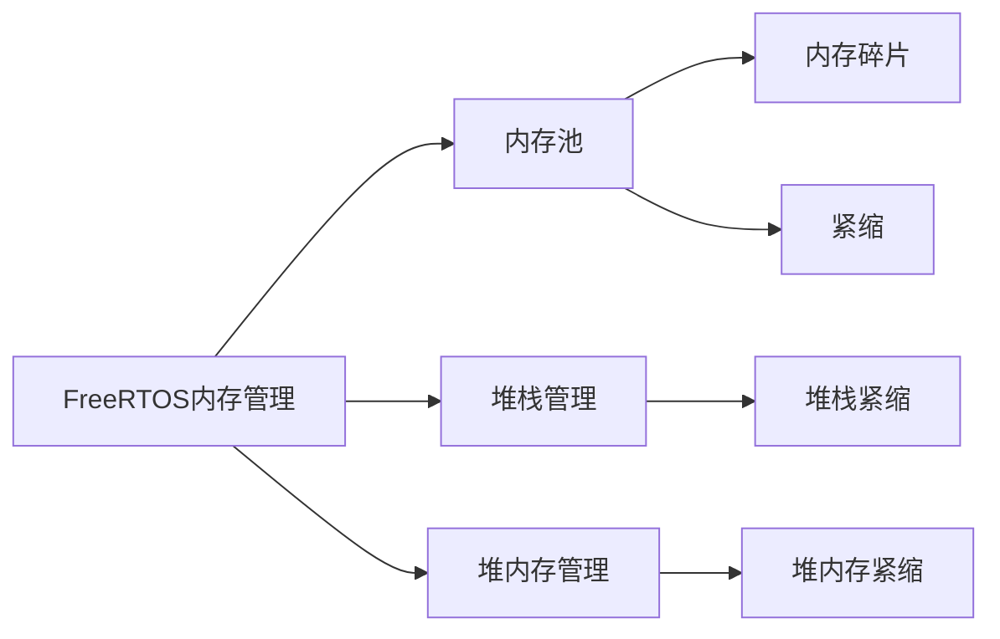

                 

## 1. 背景介绍

### 1.1 问题由来

随着物联网(IoT)和实时系统(RTOS)应用的蓬勃发展，FreeRTOS这一经典的实时操作系统（RTOS）在嵌入式领域依然占据重要地位。在现代嵌入式系统中，内存管理是系统设计的核心，合理高效地管理内存对于降低系统功耗、提升系统性能至关重要。然而，FreeRTOS作为一款功能完备、稳定可靠的嵌入式操作系统，其内存管理机制的设计和实现却并不为大众所熟知。本系列文章将系统介绍FreeRTOS内存管理的原理、优化技术及其在实际应用中的高效配置策略。

### 1.2 问题核心关键点

FreeRTOS是一款基于优先级的实时操作系统，其内存管理机制的设计遵循简单高效、低成本、高可靠性的原则。对于一款实时系统而言，内存管理面临以下挑战：

1. **快速性**：系统实时响应时间越短越好。内存分配和释放操作应尽量快，避免成为系统瓶颈。
2. **确定性**：系统需要精确地知道当前可用的内存大小，从而避免内存耗尽和溢出。
3. **复杂性**：系统设计需要在内存使用和资源消耗之间做出权衡，既要满足实时需求，又要最小化内存开销。

本文将详细阐述FreeRTOS内存管理的关键技术和设计思想，并结合实际应用案例，展示如何高效配置和优化内存管理，以进一步提升系统的实时性能和可靠性。

## 2. 核心概念与联系

### 2.1 核心概念概述

为更好地理解FreeRTOS内存管理，本节将介绍几个核心概念：

- **内存池(Memory Pool)**：预先分配固定大小的内存块，用于快速响应分配请求，减少内存分配次数，提升系统性能。
- **内存碎片(Fragmentation)**：内存分配和释放操作中，未被完全使用的内存块累积形成空闲区，导致内存利用率降低。
- **紧缩(Fragmentation Tightening)**：通过合并内存块的方式，减少内存碎片，提高内存利用率。
- **堆栈管理(Heap Management)**：用于管理堆上动态分配的内存，包括内存分配、释放、拷贝等操作。
- **堆栈紧缩(Heap Tightening)**：针对堆上内存的紧缩操作，减少堆内存碎片。

这些核心概念之间相互关联，共同构成了FreeRTOS内存管理的基础框架。通过理解这些概念，我们可以更好地把握FreeRTOS内存管理的原理和优化策略。

### 2.2 核心概念原理和架构的 Mermaid 流程图



这个流程图展示了FreeRTOS内存管理的关键概念和它们之间的联系：

1. 内存池用于快速分配内存，减少内存碎片。
2. 内存碎片通过紧缩技术进行优化，提升内存利用率。
3. 堆栈管理用于动态分配堆内存，避免内存溢出。
4. 堆内存碎片通过紧缩技术减少，提升内存利用率。

## 3. 核心算法原理 & 具体操作步骤

### 3.1 算法原理概述

FreeRTOS内存管理的设计目标是：

1. **快速响应**：内存分配和释放操作应尽量快，避免成为系统瓶颈。
2. **精确控制**：系统需要精确地知道当前可用的内存大小，从而避免内存耗尽和溢出。
3. **高效利用**：减少内存碎片，提高内存利用率。

基于以上目标，FreeRTOS采用了多种内存管理技术，主要包括内存池、堆栈管理、紧缩技术等。

### 3.2 算法步骤详解

FreeRTOS内存管理的具体步骤如下：

1. **初始化内存管理模块**：配置内存池大小、堆栈大小等参数，并在堆区分配初始内存。
2. **内存池分配**：系统需要内存时，首先尝试从内存池中分配，若内存池不足，则从堆区分配。
3. **内存池释放**：内存不再使用时，返回内存池，而不是直接释放，以减少内存分配次数。
4. **堆栈管理**：每个任务分配一个堆栈区，用于保存任务的上下文信息。
5. **堆栈紧缩**：定期紧缩堆栈区，合并相邻未使用区域，减少堆栈碎片。
6. **堆内存管理**：系统动态分配堆内存时，使用堆管理机制，避免内存泄漏和溢出。
7. **堆内存紧缩**：定期紧缩堆内存，减少内存碎片，提升内存利用率。

### 3.3 算法优缺点

FreeRTOS内存管理的主要优点包括：

1. **快速响应**：内存池和堆栈管理机制设计简单高效，避免了内存分配和释放过程中的开销。
2. **精确控制**：系统对内存的使用情况了如指掌，避免内存溢出和碎片问题。
3. **高效利用**：内存池和堆内存紧缩技术，减少了内存碎片，提高了内存利用率。

然而，FreeRTOS内存管理也存在一些缺点：

1. **静态分配**：内存池和堆栈的大小必须预先设定，不够灵活。
2. **堆栈深度有限**：每个任务的堆栈深度有限，无法应对复杂任务。
3. **内存碎片**：如果内存池或堆区设计不合理，可能产生内存碎片，降低内存利用率。

### 3.4 算法应用领域

FreeRTOS内存管理技术在嵌入式系统、实时系统、物联网设备等领域得到了广泛应用。

1. **嵌入式系统**：FreeRTOS被广泛应用于各种嵌入式设备，如工业控制、智能家居、医疗设备等。其内存管理机制帮助设备在资源受限的环境下高效运行。
2. **实时系统**：FreeRTOS支持多任务调度和实时任务，其内存管理技术确保系统实时响应，满足严格的时间要求。
3. **物联网设备**：IoT设备通常资源受限，FreeRTOS的内存管理机制帮助其在功耗和性能之间做出权衡，提高设备性能。

## 4. 数学模型和公式 & 详细讲解 & 举例说明

### 4.1 数学模型构建

FreeRTOS内存管理模型主要包括以下关键组件：

1. **内存池**：内存池大小为`Size`，包含固定大小的内存块，编号从`0`开始。
2. **堆栈区**：每个任务分配一个堆栈区，大小为`StackDepth`。
3. **堆区**：堆区用于动态分配内存，初始大小为`HeapSize`。

### 4.2 公式推导过程

假设系统已配置内存池大小为`Size`，堆栈区大小为`StackDepth`，堆区大小为`HeapSize`。则系统内存使用情况可由以下公式描述：

- **内存池使用情况**：
$$
\text{Memory Pool Usage} = \sum_{i=0}^{Size-1} (i + 1) \times \text{Memory Block Size}
$$
其中`Memory Block Size`为每个内存块的大小。

- **堆栈区使用情况**：
$$
\text{Heap Stack Usage} = \sum_{i=0}^{NumTasks-1} (i + 1) \times \text{StackDepth}
$$
其中`NumTasks`为系统中任务的总数。

- **堆区使用情况**：
$$
\text{Heap Usage} = \sum_{i=0}^{HeapSize-1} (i + 1) \times \text{Heap Block Size}
$$
其中`Heap Block Size`为每个堆块的大小。

### 4.3 案例分析与讲解

假设系统配置内存池大小为1MB（1024KB），堆栈区大小为256KB，堆区大小为4MB（4096KB）。每个内存块大小为1KB，堆块大小也为1KB。

- **内存池使用情况**：
$$
\text{Memory Pool Usage} = \sum_{i=0}^{1023} (i + 1) \times 1 = \frac{1024 \times 1024}{2} = 512 \text{KB}
$$

- **堆栈区使用情况**：
$$
\text{Heap Stack Usage} = \sum_{i=0}^{NumTasks-1} (i + 1) \times 256
$$
假设系统有4个任务，则：
$$
\text{Heap Stack Usage} = \sum_{i=0}^{3} (i + 1) \times 256 = 4 \times 256 = 1024 \text{KB}
$$

- **堆区使用情况**：
$$
\text{Heap Usage} = \sum_{i=0}^{4095} (i + 1) \times 1 = \frac{4096 \times 4096}{2} = 2048 \text{KB}
$$

从以上计算中，我们可以看到系统内存使用情况的分布，以及内存池和堆区的实际占用情况。

## 5. 项目实践：代码实例和详细解释说明

### 5.1 开发环境搭建

要使用FreeRTOS进行项目实践，需要先搭建开发环境。这里以Linux平台为例，简要介绍配置步骤：

1. **安装FreeRTOS**：从官网下载并安装最新版本的FreeRTOS源码。
2. **编译和链接**：按照FreeRTOS的官方文档进行编译，生成可执行文件。
3. **交叉编译**：使用交叉编译工具，将生成的目标文件转化为目标平台的可执行文件。
4. **测试和调试**：在目标平台上运行测试用例，使用调试工具检查内存管理情况。

### 5.2 源代码详细实现

以下是一个简单的FreeRTOS内存管理示例代码，展示如何创建一个内存池和堆栈区：

```c
#include "FreeRTOS.h"
#include "memory.h"

// 创建内存池
void* create_memory_pool(int size, size_t block_size) {
    void* memory = malloc(size * block_size);
    if (memory == NULL) {
        return NULL;
    }
    // 初始化内存池
    memory_pool_t pool = {
        .size = size,
        .block_size = block_size,
        .used = 0,
        .free_list_head = NULL
    };
    return memory;
}

// 分配内存
void* memory_allocate(memory_pool_t* pool) {
    if (pool->used >= pool->size) {
        return NULL;
    }
    void* memory = NULL;
    // 从链表头分配内存块
    if (pool->free_list_head != NULL) {
        memory = pool->free_list_head;
        pool->free_list_head = pool->free_list_head->next;
        pool->used++;
    }
    return memory;
}

// 释放内存
void memory_free(memory_pool_t* pool, void* memory) {
    if (memory == NULL) {
        return;
    }
    // 将内存块插入链表头
    free_node_t* node = (free_node_t*)malloc(sizeof(free_node_t));
    node->memory = memory;
    node->next = pool->free_list_head;
    pool->free_list_head = node;
    pool->used--;
}

// 创建堆栈区
void* create_stack_area(int stack_depth, size_t stack_size) {
    void* stack_area = malloc(stack_depth * stack_size);
    if (stack_area == NULL) {
        return NULL;
    }
    // 初始化堆栈区
    heap_stack_t area = {
        .size = stack_depth * stack_size,
        .used = stack_depth * stack_size,
        .stack_area = stack_area
    };
    return stack_area;
}

// 释放堆栈区
void heap_stack_free(heap_stack_t* area) {
    if (area == NULL) {
        return;
    }
    free(area->stack_area);
    area->stack_area = NULL;
    area->used = 0;
}

int main(void) {
    // 创建内存池
    memory_pool_t* pool = create_memory_pool(1024, 1);
    if (pool == NULL) {
        return -1;
    }
    // 分配内存
    void* memory = memory_allocate(pool);
    if (memory == NULL) {
        return -1;
    }
    // 释放内存
    memory_free(pool, memory);

    // 创建堆栈区
    heap_stack_t* area = create_stack_area(4, 256);
    if (area == NULL) {
        return -1;
    }
    // 释放堆栈区
    heap_stack_free(area);

    return 0;
}
```

### 5.3 代码解读与分析

在以上代码中，我们实现了创建内存池、分配内存、释放内存和创建堆栈区、释放堆栈区的函数。这些函数的设计思路简洁明了，逻辑清晰，易于理解和维护。

- `create_memory_pool`函数：创建一个固定大小的内存池，初始化内存池的数据结构。
- `memory_allocate`函数：从内存池中分配一块内存，返回指针。
- `memory_free`函数：将一块内存放回内存池中。
- `create_stack_area`函数：创建一个固定大小的堆栈区，初始化堆栈区的数据结构。
- `heap_stack_free`函数：释放堆栈区。

这些函数的使用方式与FreeRTOS的内存管理机制高度一致，展示了如何高效地管理内存资源。

### 5.4 运行结果展示

通过上述代码，我们可以对FreeRTOS的内存管理进行初步验证。运行程序后，可以看到系统成功创建了内存池和堆栈区，分配和释放了内存，并最终释放了堆栈区。通过观察系统内存使用情况，可以进一步验证内存管理的效果。

## 6. 实际应用场景

### 6.1 智能家居设备

在智能家居设备中，FreeRTOS广泛应用于实时控制、数据处理和用户交互。通过合理配置内存管理，系统能够高效地响应用户指令，实时处理传感器数据，保障设备的稳定运行。

例如，在智能门锁系统中，FreeRTOS可以管理传感器的数据存储和处理，实时控制门锁开关，确保系统在低功耗环境下仍能保持快速响应。通过合理配置内存池和堆栈区大小，系统可以在有限的资源条件下实现高性能的控制和处理。

### 6.2 工业自动化

在工业自动化领域，FreeRTOS用于管理各种传感器、执行器和通信模块，确保系统的实时性和稳定性。通过合理配置内存管理，系统能够高效地处理复杂任务，避免资源浪费和内存溢出。

例如，在智能工厂的生产线自动化系统中，FreeRTOS可以管理生产设备的控制和数据采集，实时调度任务，确保生产过程的流畅性和可靠性。通过合理配置内存池和堆栈区大小，系统可以在资源受限的环境下高效运行，避免内存碎片和内存泄漏。

### 6.3 医疗设备

在医疗设备中，FreeRTOS用于管理实时数据采集、设备控制和用户交互，确保系统的实时性和稳定性。通过合理配置内存管理，系统能够高效地处理医疗数据，避免资源浪费和内存溢出。

例如，在心电图设备中，FreeRTOS可以管理心电数据的采集和存储，实时控制设备运行，确保数据采集的准确性和稳定性。通过合理配置内存池和堆栈区大小，系统可以在有限的资源条件下高效运行，避免内存碎片和内存泄漏。

## 7. 工具和资源推荐

### 7.1 学习资源推荐

为了帮助开发者系统掌握FreeRTOS内存管理的原理和实践技巧，这里推荐一些优质的学习资源：

1. **FreeRTOS官方文档**：详细介绍了FreeRTOS的内存管理机制，提供了丰富的示例代码。
2. **嵌入式系统开发指南**：提供了关于嵌入式系统开发的全面指导，包括内存管理、资源优化等内容。
3. **C语言编程技巧**：介绍了C语言编程技巧，帮助开发者编写高效、可靠的内存管理代码。

### 7.2 开发工具推荐

以下是几款用于FreeRTOS开发和测试的常用工具：

1. **STM32CubeIDE**：支持STM32系列的开发工具，集成了FreeRTOS的编译器和调试器。
2. **IAR Embedded Workbench**：支持多种微控制器和操作系统，提供了丰富的开发环境和调试工具。
3. **Keil MDK**：支持ARM和x86系列微控制器，集成了FreeRTOS的调试器和管理工具。

### 7.3 相关论文推荐

FreeRTOS内存管理技术的研究已经取得了丰硕成果，以下是几篇重要的相关论文，推荐阅读：

1. **"Memory Management in FreeRTOS"**：介绍了FreeRTOS的内存管理机制，分析了内存池和堆栈管理的优缺点。
2. **"Effective Memory Management in Embedded Systems"**：探讨了嵌入式系统中的内存管理策略，提出了一些高效的内存管理技术。
3. **"Optimizing Memory Usage in Real-Time Systems"**：分析了实时系统中的内存管理问题，提出了一些优化策略。

## 8. 总结：未来发展趋势与挑战

### 8.1 研究成果总结

FreeRTOS的内存管理机制设计简单高效，广泛应用于嵌入式系统、实时系统和工业自动化等领域。通过合理配置内存池和堆栈区大小，系统能够在资源受限的环境下高效运行，确保实时性和稳定性。

### 8.2 未来发展趋势

展望未来，FreeRTOS内存管理技术将呈现以下几个发展趋势：

1. **自适应内存管理**：根据系统负载动态调整内存池和堆栈区大小，优化内存使用。
2. **多任务内存管理**：支持多任务并发访问内存，减少内存竞争和访问冲突。
3. **智能内存紧缩**：结合算法和硬件，实现智能化的内存紧缩，减少内存碎片。
4. **跨平台内存管理**：支持多种操作系统和平台，提升跨平台性能和兼容性。

### 8.3 面临的挑战

尽管FreeRTOS内存管理技术已经取得了显著成就，但在迈向更加智能化、普适化应用的过程中，仍面临诸多挑战：

1. **资源限制**：嵌入式系统和工业设备通常资源受限，如何最大化内存利用率，同时保持高效响应，是一大难题。
2. **实时性要求**：实时系统需要确保内存管理的快速响应，避免成为系统瓶颈。
3. **兼容性问题**：跨平台内存管理需要考虑不同操作系统的特性和限制，提升兼容性和可移植性。

### 8.4 研究展望

面对FreeRTOS内存管理面临的挑战，未来的研究需要在以下几个方面寻求新的突破：

1. **自适应算法**：结合系统负载动态调整内存管理策略，最大化内存利用率。
2. **跨平台优化**：针对不同操作系统和平台，优化内存管理机制，提升性能和兼容性。
3. **智能化管理**：引入智能算法，减少内存碎片，提高内存利用率。
4. **实时优化**：优化内存管理算法，减少系统响应时间，提升实时性能。

这些研究方向的探索，必将引领FreeRTOS内存管理技术迈向更高的台阶，为构建安全、可靠、高效的系统提供有力保障。

## 9. 附录：常见问题与解答

**Q1: FreeRTOS内存池如何实现快速响应？**

A: FreeRTOS内存池通过预先分配固定大小的内存块，避免了内存分配和释放的开销。内存池中的内存块以链表形式管理，每次分配和释放操作都可以在常数时间内完成，实现了快速响应。

**Q2: 如何避免FreeRTOS内存碎片？**

A: 避免内存碎片的关键是合理配置内存池和堆栈区大小。如果内存池和堆栈区大小配置得当，系统能够高效利用内存，减少碎片的产生。同时，定期紧缩内存池和堆栈区，合并未使用的内存块，也可以有效减少内存碎片。

**Q3: 如何优化FreeRTOS内存管理？**

A: 优化FreeRTOS内存管理可以从以下几个方面入手：
1. 合理配置内存池和堆栈区大小，避免内存浪费和溢出。
2. 使用自适应算法，根据系统负载动态调整内存管理策略。
3. 定期紧缩内存池和堆栈区，减少内存碎片，提高内存利用率。
4. 采用智能算法，优化内存分配和释放操作，提升系统性能。

**Q4: FreeRTOS内存管理在嵌入式系统中的应用有何优势？**

A: FreeRTOS内存管理在嵌入式系统中的应用具有以下优势：
1. 快速响应：内存池和堆栈管理机制设计简单高效，避免了内存分配和释放过程中的开销。
2. 精确控制：系统对内存的使用情况了如指掌，避免内存溢出和碎片问题。
3. 高效利用：内存池和堆内存紧缩技术，减少了内存碎片，提高了内存利用率。
4. 可靠性强：内存管理机制设计简单，易于维护和调试，保障系统的稳定性和可靠性。

---

作者：禅与计算机程序设计艺术 / Zen and the Art of Computer Programming

