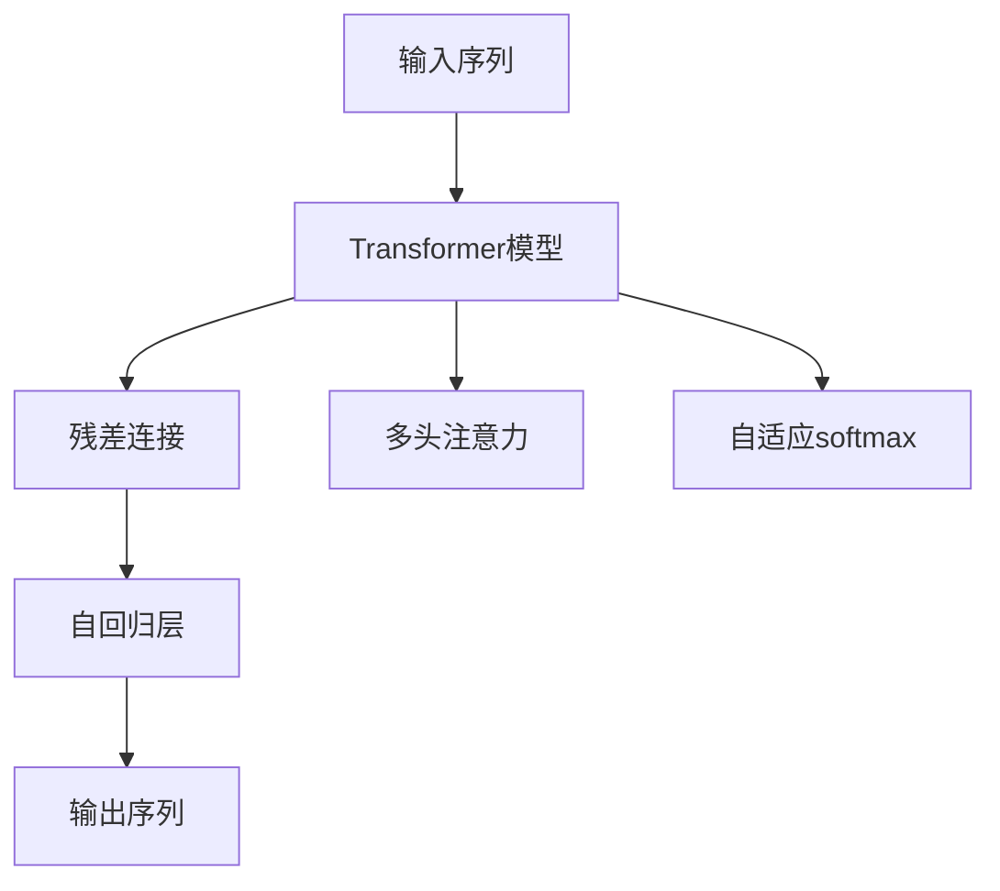

                 

# GPT-2模型解析：现代语言模型的基石

> 关键词：GPT-2,自回归模型,自适应softmax,残差连接,注意力机制,预训练语言模型

## 1. 背景介绍

自深度学习技术诞生以来，语言模型一直是自然语言处理(Natural Language Processing, NLP)领域的核心问题。早期基于循环神经网络(RNN)和卷积神经网络(CNN)的语言模型，虽然在一些特定的任务上取得了不错的效果，但由于存在计算量庞大、模型复杂度高、难以训练等问题，逐渐被新一代基于Transformer的预训练语言模型所取代。其中，OpenAI发布的GPT-2模型是最具代表性的代表。

GPT-2（Generative Pre-trained Transformer 2）是由OpenAI开发的一种自回归语言模型，自发布以来因其卓越的生成能力和广泛的适应性，迅速在学术界和工业界引起了广泛关注。本文将详细解析GPT-2模型的设计理念和关键算法，并探讨其在大规模文本生成、自然语言推理、对话系统等多个领域的应用潜力。

## 2. 核心概念与联系

### 2.1 核心概念概述

为便于读者深入理解GPT-2模型，我们首先介绍其核心概念：

- **自回归语言模型**：与传统的自编码语言模型不同，自回归模型通过生成前一个单词预测下一个单词，这种顺序预测的方式使得模型可以自然地生成流畅连贯的文本。

- **Transformer结构**：由Google提出的Transformer模型利用多头注意力机制，高效地捕捉输入和输出序列之间的依赖关系，相对于传统的RNN和CNN结构，具有更好的并行计算能力和更强的上下文理解能力。

- **残差连接**：自编码模型中的残差连接技术，允许网络在训练过程中更好地传播梯度，增强了模型的非线性映射能力。

- **自适应softmax**：一种基于动态划分vocab表的技术，使得模型可以处理更稠密的vocab表，提高模型对长尾单词的处理能力。

这些核心概念构成了GPT-2模型的基石，使得其在文本生成、语言推理、对话系统等多个任务上均表现出色。

### 2.2 核心概念原理和架构的 Mermaid 流程图



这个图展示了GPT-2模型的基本架构：输入序列经过Transformer编码器，通过残差连接和多头注意力机制后，进入自回归层，最后通过自适应softmax得到输出序列。

## 3. 核心算法原理 & 具体操作步骤
### 3.1 算法原理概述

GPT-2模型的核心算法原理包括以下几个关键部分：

- **自回归模型**：GPT-2是一种自回归模型，其每个时间步的预测只依赖于前面的时间步，这种顺序预测的方式使得模型可以自然地生成连贯的文本。

- **Transformer结构**：采用Transformer结构，通过多头注意力机制捕捉输入序列的上下文信息，从而使得模型能够学习到复杂的语言结构。

- **残差连接**：通过残差连接技术，增强了模型的非线性映射能力和梯度传播，使得模型更容易训练。

- **自适应softmax**：动态划分vocab表，提高模型对长尾单词的处理能力。

### 3.2 算法步骤详解

GPT-2模型的训练过程大致可以分为以下几个步骤：

1. **数据预处理**：将原始文本数据转化为模型可以接受的输入格式，包括分词、编码、标准化等预处理步骤。

2. **模型初始化**：初始化模型参数，如Transformer编码器、残差连接、多头注意力、自适应softmax等模块。

3. **预训练**：在大规模无标签文本数据上进行预训练，学习通用的语言表示。GPT-2模型采用自回归方式进行预训练，每个时间步只依赖于前面的时间步，从而构建起语言的连贯性。

4. **微调**：在特定任务的数据集上进行微调，以适应具体的文本生成、语言推理、对话系统等任务。微调时通常只微调模型顶层分类器，以避免破坏预训练的权重。

5. **评估和优化**：在验证集上评估模型性能，根据性能指标调整超参数，如学习率、批大小、迭代轮数等，以提升模型效果。

### 3.3 算法优缺点

GPT-2模型具有以下优点：

- **生成能力强大**：GPT-2在文本生成任务上表现出色，能够生成流畅连贯的文本，且风格多样，适应性强。

- **结构简单高效**：采用Transformer结构和自适应softmax技术，模型并行化程度高，训练速度快。

- **应用广泛**：GPT-2可以应用于各种NLP任务，包括文本生成、语言推理、对话系统等，具有广泛的适用性。

- **可解释性强**：由于采用了Transformer结构，GPT-2模型内部参数关系清晰，可解释性强。

GPT-2模型也存在一些缺点：

- **计算资源需求高**：GPT-2模型参数量巨大，训练和推理过程中需要大量的计算资源，对硬件设备要求高。

- **过拟合风险**：由于模型参数量大，训练过程中容易发生过拟合，特别是在微调过程中，需要采取正则化等措施来避免。

- **模型泛化能力有限**：GPT-2模型在特定领域的数据集上微调效果较好，但在域外数据上泛化能力可能不足。

### 3.4 算法应用领域

GPT-2模型广泛应用于文本生成、语言推理、对话系统等多个领域，具体如下：

- **文本生成**：GPT-2模型能够生成连贯流畅的文本，广泛应用于文本生成、自然语言处理等任务。

- **语言推理**：利用GPT-2模型进行语言推理任务，判断自然语言文本的逻辑关系。

- **对话系统**：在对话系统中，GPT-2模型能够理解用户的意图，并生成适当的回复。

- **机器翻译**：通过微调GPT-2模型，可以用于文本翻译任务，提高翻译的准确性和流畅性。

## 4. 数学模型和公式 & 详细讲解 & 举例说明

### 4.1 数学模型构建

GPT-2模型采用自回归模型，其数学模型可以表示为：

$$
P(w_{1:T} | w_{<1:T}) = \prod_{t=1}^T P(w_t | w_{<t})
$$

其中 $w_{1:T}$ 表示整个文本序列，$w_{<1:T}$ 表示文本序列的左侧部分。$P(w_t | w_{<t})$ 表示在已知左侧文本的前提下，生成第 $t$ 个单词的概率。

### 4.2 公式推导过程

GPT-2模型通过Transformer编码器捕捉输入序列的上下文信息，其公式推导过程如下：

$$
\mathrm{Encoder}_{2} = \mathrm{MLP}(\mathrm{FFN}(\mathrm{Add}(\mathrm{Attention}(\mathrm{MultiHeadAttention}(\mathrm{Q}, \mathrm{K}, \mathrm{V}), \mathrm{S})))
$$

其中 $\mathrm{MLP}$ 表示全连接层，$\mathrm{FFN}$ 表示前馈神经网络，$\mathrm{Add}$ 表示残差连接，$\mathrm{Attention}$ 表示多头注意力机制，$\mathrm{MultiHeadAttention}$ 表示多头注意力，$\mathrm{Q}, \mathrm{K}, \mathrm{V}$ 分别表示查询、键、值向量，$\mathrm{S}$ 表示缩放因子，用于提高注意力权重更新的稳定性。

### 4.3 案例分析与讲解

假设有一句话 "I went to the"，我们需要预测下一个单词是什么。GPT-2模型通过Transformer编码器处理句子，得到文本表示，再通过自适应softmax得到下一个单词的概率分布。假设模型输出的概率分布为 $[P(w_1), P(w_2), P(w_3), ..., P(w_{|Vocab|})]$，其中 $|Vocab|$ 为词汇表大小。根据最大似然估计，下一个单词 $w_{t+1}$ 的概率为：

$$
P(w_{t+1}) = \frac{P(w_{t+1} | w_{<t+1})}{\sum_{j=1}^{|Vocab|} P(w_j | w_{<t+1})}
$$

根据以上公式，模型输出概率最大的单词即为预测结果。

## 5. 项目实践：代码实例和详细解释说明

### 5.1 开发环境搭建

在进行GPT-2模型实践前，我们需要准备好开发环境。以下是使用Python进行PyTorch开发的环境配置流程：

1. 安装Anaconda：从官网下载并安装Anaconda，用于创建独立的Python环境。

2. 创建并激活虚拟环境：
```bash
conda create -n pytorch-env python=3.8 
conda activate pytorch-env
```

3. 安装PyTorch：根据CUDA版本，从官网获取对应的安装命令。例如：
```bash
conda install pytorch torchvision torchaudio cudatoolkit=11.1 -c pytorch -c conda-forge
```

4. 安装TensorFlow：如果需要进行多任务学习，还可以安装TensorFlow：
```bash
conda install tensorflow
```

5. 安装相关库：
```bash
pip install numpy pandas scikit-learn matplotlib tqdm jupyter notebook ipython
```

完成上述步骤后，即可在`pytorch-env`环境中开始GPT-2模型的开发和实验。

### 5.2 源代码详细实现

下面以实现GPT-2文本生成为例，给出使用PyTorch的代码实现：

```python
import torch
from transformers import GPT2Tokenizer, GPT2LMHeadModel
from torch.utils.data import Dataset, DataLoader
from tqdm import tqdm

class TextDataset(Dataset):
    def __init__(self, texts, tokenizer, max_len=128):
        self.texts = texts
        self.tokenizer = tokenizer
        self.max_len = max_len
        
    def __len__(self):
        return len(self.texts)
    
    def __getitem__(self, item):
        text = self.texts[item]
        encoding = self.tokenizer(text, return_tensors='pt', max_length=self.max_len, padding='max_length', truncation=True)
        return {'input_ids': encoding['input_ids'], 'attention_mask': encoding['attention_mask']}

tokenizer = GPT2Tokenizer.from_pretrained('gpt2')

model = GPT2LMHeadModel.from_pretrained('gpt2')
model.to('cuda')
model.eval()

def generate_text(model, tokenizer, max_len, num_words):
    input_ids = tokenizer.encode('I went to the', return_tensors='pt').to('cuda')
    out_ids = []
    for i in range(num_words):
        with torch.no_grad():
            outputs = model.generate(input_ids, max_length=max_len, num_return_sequences=1)
        out_ids.append(tokenizer.decode(outputs[0], skip_special_tokens=True))
    return out_ids

generated_text = generate_text(model, tokenizer, max_len=128, num_words=5)
print(generated_text)
```

### 5.3 代码解读与分析

让我们再详细解读一下关键代码的实现细节：

**TextDataset类**：
- `__init__`方法：初始化文本、分词器等关键组件。
- `__len__`方法：返回数据集的样本数量。
- `__getitem__`方法：对单个样本进行处理，将文本输入编码为token ids，并返回模型所需的输入。

**GPT2LMHeadModel和GPT2Tokenizer**：
- 从HuggingFace下载预训练模型和分词器，使用Transformer库的封装模块进行模型的加载和分词。

**generate_text函数**：
- 使用预训练模型和分词器，生成指定长度的文本序列。
- 循环多次生成文本，直至达到指定长度，返回生成结果。

可以看到，PyTorch配合Transformer库使得GPT-2模型的实现变得简洁高效。开发者可以将更多精力放在数据处理、模型改进等高层逻辑上，而不必过多关注底层的实现细节。

当然，工业级的系统实现还需考虑更多因素，如模型的保存和部署、超参数的自动搜索、更灵活的任务适配层等。但核心的文本生成任务基本与此类似。

## 6. 实际应用场景
### 6.1 智能客服系统

基于GPT-2模型的智能客服系统，可以广泛应用于智能客服系统的构建。传统客服往往需要配备大量人力，高峰期响应缓慢，且一致性和专业性难以保证。而使用GPT-2模型的智能客服系统，可以7x24小时不间断服务，快速响应客户咨询，用自然流畅的语言解答各类常见问题。

在技术实现上，可以收集企业内部的历史客服对话记录，将问题和最佳答复构建成监督数据，在此基础上对预训练模型进行微调。微调后的模型能够自动理解用户意图，匹配最合适的答案模板进行回复。对于客户提出的新问题，还可以接入检索系统实时搜索相关内容，动态组织生成回答。如此构建的智能客服系统，能大幅提升客户咨询体验和问题解决效率。

### 6.2 金融舆情监测

金融机构需要实时监测市场舆论动向，以便及时应对负面信息传播，规避金融风险。传统的人工监测方式成本高、效率低，难以应对网络时代海量信息爆发的挑战。基于GPT-2模型的文本分类和情感分析技术，为金融舆情监测提供了新的解决方案。

具体而言，可以收集金融领域相关的新闻、报道、评论等文本数据，并对其进行主题标注和情感标注。在此基础上对预训练语言模型进行微调，使其能够自动判断文本属于何种主题，情感倾向是正面、中性还是负面。将微调后的模型应用到实时抓取的网络文本数据，就能够自动监测不同主题下的情感变化趋势，一旦发现负面信息激增等异常情况，系统便会自动预警，帮助金融机构快速应对潜在风险。

### 6.3 个性化推荐系统

当前的推荐系统往往只依赖用户的历史行为数据进行物品推荐，无法深入理解用户的真实兴趣偏好。基于GPT-2模型的个性化推荐系统可以更好地挖掘用户行为背后的语义信息，从而提供更精准、多样的推荐内容。

在实践中，可以收集用户浏览、点击、评论、分享等行为数据，提取和用户交互的物品标题、描述、标签等文本内容。将文本内容作为模型输入，用户的后续行为（如是否点击、购买等）作为监督信号，在此基础上微调预训练语言模型。微调后的模型能够从文本内容中准确把握用户的兴趣点。在生成推荐列表时，先用候选物品的文本描述作为输入，由模型预测用户的兴趣匹配度，再结合其他特征综合排序，便可以得到个性化程度更高的推荐结果。

### 6.4 未来应用展望

随着GPT-2模型和微调方法的不断发展，基于GPT-2模型的应用场景将不断扩展，为传统行业带来变革性影响。

在智慧医疗领域，基于GPT-2的医疗问答、病历分析、药物研发等应用将提升医疗服务的智能化水平，辅助医生诊疗，加速新药开发进程。

在智能教育领域，GPT-2模型可应用于作业批改、学情分析、知识推荐等方面，因材施教，促进教育公平，提高教学质量。

在智慧城市治理中，GPT-2模型可应用于城市事件监测、舆情分析、应急指挥等环节，提高城市管理的自动化和智能化水平，构建更安全、高效的未来城市。

此外，在企业生产、社会治理、文娱传媒等众多领域，基于GPT-2的人工智能应用也将不断涌现，为经济社会发展注入新的动力。相信随着技术的日益成熟，GPT-2模型必将在更广阔的应用领域大放异彩，深刻影响人类的生产生活方式。

## 7. 工具和资源推荐
### 7.1 学习资源推荐

为了帮助开发者系统掌握GPT-2模型的理论基础和实践技巧，这里推荐一些优质的学习资源：

1. 《Transformer from Principles to Practice》系列博文：由大模型技术专家撰写，深入浅出地介绍了Transformer原理、GPT-2模型、微调技术等前沿话题。

2. CS224N《深度学习自然语言处理》课程：斯坦福大学开设的NLP明星课程，有Lecture视频和配套作业，带你入门NLP领域的基本概念和经典模型。

3. 《Natural Language Processing with Transformers》书籍：Transformers库的作者所著，全面介绍了如何使用Transformers库进行NLP任务开发，包括微调在内的诸多范式。

4. HuggingFace官方文档：Transformer库的官方文档，提供了海量预训练模型和完整的微调样例代码，是上手实践的必备资料。

5. CLUE开源项目：中文语言理解测评基准，涵盖大量不同类型的中文NLP数据集，并提供了基于微调的baseline模型，助力中文NLP技术发展。

通过对这些资源的学习实践，相信你一定能够快速掌握GPT-2模型的精髓，并用于解决实际的NLP问题。
###  7.2 开发工具推荐

高效的开发离不开优秀的工具支持。以下是几款用于GPT-2模型微调开发的常用工具：

1. PyTorch：基于Python的开源深度学习框架，灵活动态的计算图，适合快速迭代研究。大部分预训练语言模型都有PyTorch版本的实现。

2. TensorFlow：由Google主导开发的开源深度学习框架，生产部署方便，适合大规模工程应用。同样有丰富的预训练语言模型资源。

3. Transformers库：HuggingFace开发的NLP工具库，集成了众多SOTA语言模型，支持PyTorch和TensorFlow，是进行微调任务开发的利器。

4. Weights & Biases：模型训练的实验跟踪工具，可以记录和可视化模型训练过程中的各项指标，方便对比和调优。与主流深度学习框架无缝集成。

5. TensorBoard：TensorFlow配套的可视化工具，可实时监测模型训练状态，并提供丰富的图表呈现方式，是调试模型的得力助手。

6. Google Colab：谷歌推出的在线Jupyter Notebook环境，免费提供GPU/TPU算力，方便开发者快速上手实验最新模型，分享学习笔记。

合理利用这些工具，可以显著提升GPT-2模型微调任务的开发效率，加快创新迭代的步伐。

### 7.3 相关论文推荐

GPT-2模型和微调技术的发展源于学界的持续研究。以下是几篇奠基性的相关论文，推荐阅读：

1. Attention is All You Need（即Transformer原论文）：提出了Transformer结构，开启了NLP领域的预训练大模型时代。

2. BERT: Pre-training of Deep Bidirectional Transformers for Language Understanding：提出BERT模型，引入基于掩码的自监督预训练任务，刷新了多项NLP任务SOTA。

3. Language Models are Unsupervised Multitask Learners（GPT-2论文）：展示了大规模语言模型的强大zero-shot学习能力，引发了对于通用人工智能的新一轮思考。

4. Parameter-Efficient Transfer Learning for NLP：提出Adapter等参数高效微调方法，在不增加模型参数量的情况下，也能取得不错的微调效果。

5. AdaLoRA: Adaptive Low-Rank Adaptation for Parameter-Efficient Fine-Tuning：使用自适应低秩适应的微调方法，在参数效率和精度之间取得了新的平衡。

6. Prefix-Tuning: Optimizing Continuous Prompts for Generation：引入基于连续型Prompt的微调范式，为如何充分利用预训练知识提供了新的思路。

这些论文代表了大语言模型微调技术的发展脉络。通过学习这些前沿成果，可以帮助研究者把握学科前进方向，激发更多的创新灵感。

## 8. 总结：未来发展趋势与挑战

### 8.1 总结

本文对GPT-2模型的设计理念和核心算法进行了详细解析，并探讨了其在大规模文本生成、自然语言推理、对话系统等多个领域的应用潜力。首先阐述了GPT-2模型的背景和设计思路，明确了自回归语言模型和Transformer结构在大规模语言模型中的应用。其次，从原理到实践，详细讲解了GPT-2模型的训练过程和微调技巧，给出了微调任务开发的完整代码实例。同时，本文还广泛探讨了GPT-2模型在智能客服、金融舆情、个性化推荐等多个行业领域的应用前景，展示了GPT-2模型的巨大潜力。最后，本文精选了GPT-2模型的各类学习资源，力求为读者提供全方位的技术指引。

通过本文的系统梳理，可以看到，GPT-2模型作为当前最先进的自回归语言模型，在文本生成、语言推理、对话系统等多个任务上均表现出色。GPT-2模型为NLP领域的研究者和开发者提供了强大的工具和理论基础，推动了人工智能技术在更多实际场景中的应用。未来，随着GPT-2模型和微调方法的持续演进，相信NLP技术必将在更广泛的领域大放异彩，深刻影响人类的生产生活方式。

### 8.2 未来发展趋势

展望未来，GPT-2模型和微调技术将呈现以下几个发展趋势：

1. **模型规模持续增大**：随着算力成本的下降和数据规模的扩张，预训练语言模型的参数量还将持续增长。超大规模语言模型蕴含的丰富语言知识，有望支撑更加复杂多变的下游任务微调。

2. **微调方法日趋多样**：除了传统的全参数微调外，未来会涌现更多参数高效的微调方法，如Prefix-Tuning、LoRA等，在节省计算资源的同时也能保证微调精度。

3. **持续学习成为常态**：随着数据分布的不断变化，GPT-2模型也需要持续学习新知识以保持性能。如何在不遗忘原有知识的同时，高效吸收新样本信息，将成为重要的研究课题。

4. **标注样本需求降低**：受启发于提示学习(Prompt-based Learning)的思路，未来的微调方法将更好地利用GPT-2模型的语言理解能力，通过更加巧妙的任务描述，在更少的标注样本上也能实现理想的微调效果。

5. **多模态微调崛起**：当前的微调主要聚焦于纯文本数据，未来会进一步拓展到图像、视频、语音等多模态数据微调。多模态信息的融合，将显著提升GPT-2模型对现实世界的理解和建模能力。

6. **模型通用性增强**：经过海量数据的预训练和多领域任务的微调，未来的GPT-2模型将具备更强大的常识推理和跨领域迁移能力，逐步迈向通用人工智能(AGI)的目标。

以上趋势凸显了GPT-2模型微调技术的广阔前景。这些方向的探索发展，必将进一步提升NLP系统的性能和应用范围，为人类认知智能的进化带来深远影响。

### 8.3 面临的挑战

尽管GPT-2模型在文本生成、语言推理、对话系统等多个任务上表现出色，但在迈向更加智能化、普适化应用的过程中，它仍面临着诸多挑战：

1. **计算资源瓶颈**：GPT-2模型参数量巨大，训练和推理过程中需要大量的计算资源，对硬件设备要求高。这限制了GPT-2模型的应用范围和效果。

2. **过拟合风险**：由于模型参数量大，训练过程中容易发生过拟合，特别是在微调过程中，需要采取正则化等措施来避免。

3. **模型泛化能力有限**：GPT-2模型在特定领域的数据集上微调效果较好，但在域外数据上泛化能力可能不足。

4. **推理效率有待提高**：虽然GPT-2模型精度高，但在实际部署时往往面临推理速度慢、内存占用大等效率问题。

5. **可解释性亟需加强**：当前GPT-2模型更像是"黑盒"系统，难以解释其内部工作机制和决策逻辑。对于医疗、金融等高风险应用，算法的可解释性和可审计性尤为重要。

6. **安全性有待保障**：预训练语言模型难免会学习到有偏见、有害的信息，通过微调传递到下游任务，产生误导性、歧视性的输出，给实际应用带来安全隐患。

7. **知识整合能力不足**：现有的微调模型往往局限于任务内数据，难以灵活吸收和运用更广泛的先验知识。如何让微调过程更好地与外部知识库、规则库等专家知识结合，形成更加全面、准确的信息整合能力，还有很大的想象空间。

正视GPT-2模型面临的这些挑战，积极应对并寻求突破，将是大规模语言模型微调走向成熟的必由之路。相信随着学界和产业界的共同努力，这些挑战终将一一被克服，GPT-2模型必将在构建人机协同的智能时代中扮演越来越重要的角色。

### 8.4 研究展望

面对GPT-2模型和微调技术所面临的挑战，未来的研究需要在以下几个方面寻求新的突破：

1. **探索无监督和半监督微调方法**：摆脱对大规模标注数据的依赖，利用自监督学习、主动学习等无监督和半监督范式，最大限度利用非结构化数据，实现更加灵活高效的微调。

2. **研究参数高效和计算高效的微调范式**：开发更加参数高效的微调方法，在固定大部分预训练参数的同时，只更新极少量的任务相关参数。同时优化微调模型的计算图，减少前向传播和反向传播的资源消耗，实现更加轻量级、实时性的部署。

3. **融合因果和对比学习范式**：通过引入因果推断和对比学习思想，增强GPT-2模型建立稳定因果关系的能力，学习更加普适、鲁棒的语言表征，从而提升模型泛化性和抗干扰能力。

4. **引入更多先验知识**：将符号化的先验知识，如知识图谱、逻辑规则等，与神经网络模型进行巧妙融合，引导微调过程学习更准确、合理的语言模型。同时加强不同模态数据的整合，实现视觉、语音等多模态信息与文本信息的协同建模。

5. **结合因果分析和博弈论工具**：将因果分析方法引入GPT-2模型，识别出模型决策的关键特征，增强输出解释的因果性和逻辑性。借助博弈论工具刻画人机交互过程，主动探索并规避模型的脆弱点，提高系统稳定性。

6. **纳入伦理道德约束**：在模型训练目标中引入伦理导向的评估指标，过滤和惩罚有偏见、有害的输出倾向。同时加强人工干预和审核，建立模型行为的监管机制，确保输出符合人类价值观和伦理道德。

这些研究方向的探索，必将引领GPT-2模型微调技术迈向更高的台阶，为构建安全、可靠、可解释、可控的智能系统铺平道路。面向未来，GPT-2模型微调技术还需要与其他人工智能技术进行更深入的融合，如知识表示、因果推理、强化学习等，多路径协同发力，共同推动自然语言理解和智能交互系统的进步。只有勇于创新、敢于突破，才能不断拓展GPT-2模型的边界，让智能技术更好地造福人类社会。

## 9. 附录：常见问题与解答

**Q1：GPT-2模型与其他预训练语言模型的主要区别是什么？**

A: GPT-2模型与BERT、T5等预训练语言模型的主要区别在于模型架构和训练方式的不同。GPT-2采用自回归模型，通过逐个预测下一个单词，从而构建起语言的连贯性；而BERT和T5采用自编码模型，通过预测上下文中的单词，从而捕捉词与词之间的关系。因此，GPT-2在文本生成和对话系统等任务上表现更为出色，BERT则在文本分类、实体识别等任务上表现优异。

**Q2：GPT-2模型在微调过程中需要注意哪些问题？**

A: GPT-2模型在微调过程中需要注意以下几个问题：
1. **学习率的选择**：由于GPT-2模型参数量较大，建议从较低的初始学习率开始调参，逐步增大，直至收敛。
2. **过拟合风险**：在微调过程中，需要采取正则化等措施，如L2正则、Dropout、Early Stopping等，以避免过拟合。
3. **梯度爆炸和消失问题**：在微调过程中，可能需要使用梯度截断、梯度累积等技术，避免梯度爆炸和消失问题。
4. **数据增强**：在微调过程中，可以通过数据增强的方式扩充训练集，如回译、近义替换等，以提高模型的泛化能力。

**Q3：GPT-2模型在实际应用中如何优化推理效率？**

A: 优化GPT-2模型的推理效率，可以从以下几个方面入手：
1. **模型裁剪**：去除不必要的层和参数，减小模型尺寸，加快推理速度。
2. **量化加速**：将浮点模型转为定点模型，压缩存储空间，提高计算效率。
3. **并行化计算**：利用多核、GPU/TPU等并行计算资源，提升推理速度。
4. **内存优化**：通过调整批大小、使用混合精度计算等方式，优化内存使用，避免显存不足问题。

**Q4：如何评估GPT-2模型的性能？**

A: 评估GPT-2模型的性能可以从以下几个方面进行：
1. **BLEU、ROUGE等自动评估指标**：用于衡量生成文本的质量和流畅度。
2. **人类评估**：通过人工阅读和评估生成的文本，判断文本的连贯性和可理解性。
3. **应用效果评估**：在实际应用中，通过评估模型在特定任务上的表现，如情感分析、文本分类等，判断模型效果。
4. **模型可解释性评估**：通过分析模型输出和训练过程，评估模型的可解释性和透明性。

**Q5：GPT-2模型在医疗、金融等领域的应用有哪些？**

A: GPT-2模型在医疗、金融等领域的应用主要有以下几个方面：
1. **医疗领域**：用于医疗问答、病历分析、药物研发等任务，辅助医生诊疗，加速新药开发进程。
2. **金融领域**：用于金融舆情监测、智能客服、客户情绪分析等任务，提升金融服务的智能化水平，提高客户体验。
3. **法律领域**：用于法律文本生成、智能合同审核、法律咨询等任务，提升法律服务的效率和准确性。

通过本文的系统梳理，可以看到，GPT-2模型作为当前最先进的自回归语言模型，在文本生成、语言推理、对话系统等多个任务上均表现出色。GPT-2模型为NLP领域的研究者和开发者提供了强大的工具和理论基础，推动了人工智能技术在更多实际场景中的应用。未来，随着GPT-2模型和微调方法的持续演进，相信NLP技术必将在更广泛的领域大放异彩，深刻影响人类的生产生活方式。

---

作者：禅与计算机程序设计艺术 / Zen and the Art of Computer Programming

