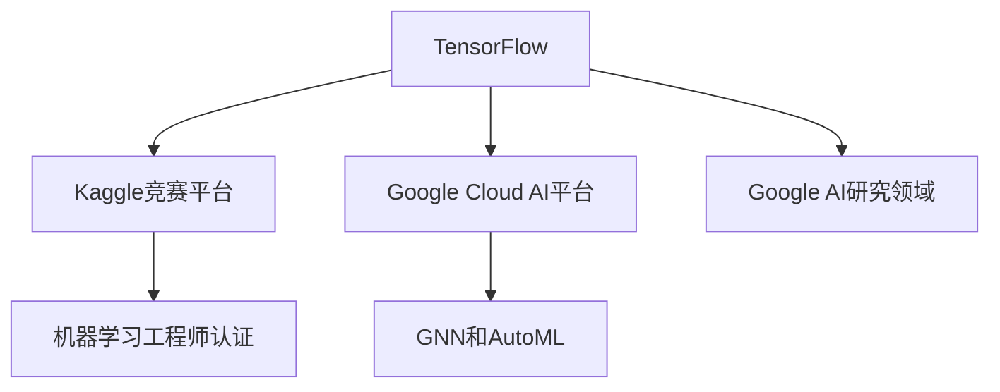

                 

# Google的AI生态布局:从TensorFlow到Google Cloud AI

> 关键词：AI生态, Google Cloud AI, TensorFlow, 机器学习, 深度学习, AI基础设施

## 1. 背景介绍

### 1.1 问题由来
Google作为全球科技巨头，在人工智能(AI)领域拥有深厚的技术积累和丰富的应用实践。Google的AI生态布局，涵盖了从基础研究到应用落地的全链条，涉及硬件、软件、数据、算法、平台等多个环节。其核心战略是通过构建一个开放、共赢的AI生态，加速AI技术的普及和应用，赋能各行各业，推动社会进步。

本文将详细解析Google的AI生态布局，涵盖从TensorFlow的诞生到Google Cloud AI的崛起，全面梳理Google在AI领域的布局思路和关键技术，为AI从业者提供深刻的见解和有价值的参考。

### 1.2 问题核心关键点
Google的AI生态布局具有以下几个核心关键点：

1. **TensorFlow的诞生**：Google在2015年推出了开源的深度学习框架TensorFlow，标志着Google在深度学习领域的技术领先地位。TensorFlow通过灵活的计算图机制和高效的分布式计算能力，迅速成为业内主流。

2. **Kaggle竞赛平台**：Google于2017年收购Kaggle，通过举办全球最大的数据科学竞赛，吸引大量数据科学家参与，为AI技术的创新和应用提供了丰富的数据资源和算法模型。

3. **机器学习工程师认证**：Google于2019年推出机器学习工程师认证，通过标准化的考试和认证体系，提升了AI从业者的专业技能和实践能力。

4. **Google Cloud AI平台的崛起**：Google在2017年启动Google Cloud AI项目，通过整合TensorFlow、Kaggle、云服务等资源，构建了一个功能全面的AI基础设施，赋能全球企业进行AI创新和应用。

5. **GNN和AutoML的创新**：Google在2019年发布了图神经网络(Graph Neural Network, GNN)，并通过AutoML和Model Maker等工具，大大降低了AI模型开发和部署的门槛，推动了AI技术的普及。

6. **Google AI研究领域的突破**：Google在计算机视觉、自然语言处理、语音识别、自动驾驶等领域取得了诸多突破，如AlphaGo、BERT、WaveNet等。

### 1.3 问题研究意义
Google的AI生态布局，对全球AI技术的创新和发展具有重要意义：

1. **技术引领**：Google通过TensorFlow等技术平台的引领，推动了全球深度学习技术的进步，加速了AI技术的普及和应用。
2. **平台赋能**：Google Cloud AI平台为全球开发者和企业提供了强大的AI基础设施支持，促进了AI技术的落地应用。
3. **人才培养**：通过机器学习工程师认证和Kaggle竞赛平台，Google培养了大批高水平的AI人才，推动了AI领域的可持续发展。
4. **产业应用**：Google在智能推荐、医疗诊断、自动驾驶等领域的创新应用，展示了AI技术的巨大潜力和广阔前景。

## 2. 核心概念与联系

### 2.1 核心概念概述

为更好地理解Google的AI生态布局，本节将介绍几个核心概念：

- **TensorFlow**：Google推出的深度学习框架，支持灵活的计算图机制和高效的分布式计算，广泛应用于各类AI应用场景。
- **Kaggle竞赛平台**：全球最大的数据科学竞赛平台，通过举办各类AI竞赛，聚集了大量数据科学家和算法专家，推动了AI技术的不断创新。
- **机器学习工程师认证**：Google推出的认证体系，通过标准化考试和认证，提升AI从业者的专业技能和实践能力。
- **Google Cloud AI平台**：Google基于TensorFlow、Kaggle等资源构建的AI基础设施，提供了数据存储、模型训练、部署、监控等全面服务。
- **GNN和AutoML**：Google在图神经网络和自动机器学习领域的创新，通过降低AI模型开发门槛，推动了AI技术的普及。
- **Google AI研究领域**：Google在计算机视觉、自然语言处理、语音识别、自动驾驶等领域的突破性研究，展示了其在AI技术的全面领先地位。

这些核心概念之间的逻辑关系可以通过以下Mermaid流程图来展示：



这个流程图展示了大语言模型的核心概念及其之间的关系：

1. TensorFlow是Google AI生态的基础技术框架。
2. Kaggle竞赛平台为Google聚集了大量数据科学家和算法专家。
3. 机器学习工程师认证提升AI从业者的专业技能。
4. Google Cloud AI平台整合了TensorFlow、Kaggle等资源，提供全面AI服务。
5. GNN和AutoML降低了AI模型开发的门槛，推动了AI技术的普及。
6. Google AI研究领域的突破，展示了其在AI技术的全面领先地位。

这些概念共同构成了Google的AI生态布局，使其能够从基础研究到应用落地形成闭环，加速AI技术的创新和应用。

## 3. 核心算法原理 & 具体操作步骤
### 3.1 算法原理概述

Google的AI生态布局，核心在于通过构建一个开放、共赢的AI生态，加速AI技术的普及和应用。这一布局涉及多个环节，包括基础研究、技术平台、应用开发、教育培训等。

- **基础研究**：Google在计算机视觉、自然语言处理、语音识别、自动驾驶等领域进行了大量基础研究，形成了丰富的技术积累。
- **技术平台**：TensorFlow作为基础深度学习框架，提供了灵活的计算图机制和高效的分布式计算能力，广泛应用于各类AI应用场景。
- **应用开发**：通过Google Cloud AI平台，Google提供了数据存储、模型训练、部署、监控等全面服务，支持开发者进行AI应用的开发和部署。
- **教育培训**：通过Kaggle竞赛平台和机器学习工程师认证，Google培养了大批高水平的AI人才，推动了AI技术的可持续发展。

Google的AI生态布局，涵盖了从基础研究到应用落地的全链条，形成了一个闭环的生态系统，不断推动AI技术的创新和应用。

### 3.2 算法步骤详解

Google的AI生态布局，主要包括以下几个关键步骤：

**Step 1: 技术平台搭建**
- 发布开源深度学习框架TensorFlow，提供灵活的计算图机制和高效的分布式计算能力。
- 收购Kaggle，构建全球最大的数据科学竞赛平台，聚集数据科学家和算法专家。

**Step 2: 教育培训体系**
- 推出机器学习工程师认证，通过标准化考试和认证体系，提升AI从业者的专业技能和实践能力。
- 举办各类AI竞赛，推动AI技术的不断创新，同时吸引大量AI从业者参与。

**Step 3: 应用开发支持**
- 构建Google Cloud AI平台，提供数据存储、模型训练、部署、监控等全面服务，支持开发者进行AI应用的开发和部署。
- 推出GNN和AutoML等工具，大大降低了AI模型开发和部署的门槛，推动了AI技术的普及。

**Step 4: 基础研究突破**
- 在计算机视觉、自然语言处理、语音识别、自动驾驶等领域进行大量基础研究，形成丰富的技术积累。
- 发布AlphaGo、BERT、WaveNet等突破性研究成果，展示其在AI技术的全面领先地位。

### 3.3 算法优缺点

Google的AI生态布局具有以下优点：

1. **技术领先**：通过TensorFlow等技术平台的引领，Google推动了全球深度学习技术的进步，加速了AI技术的普及和应用。
2. **平台赋能**：Google Cloud AI平台为全球开发者和企业提供了强大的AI基础设施支持，促进了AI技术的落地应用。
3. **人才培养**：通过机器学习工程师认证和Kaggle竞赛平台，Google培养了大批高水平的AI人才，推动了AI领域的可持续发展。
4. **产业应用**：Google在智能推荐、医疗诊断、自动驾驶等领域的创新应用，展示了AI技术的巨大潜力和广阔前景。

同时，该布局也存在一定的局限性：

1. **生态单一**：Google的AI生态主要集中在Google内部，虽然通过TensorFlow和Google Cloud AI平台吸引了大量开发者和用户，但与外部生态的融合仍需进一步加强。
2. **标准化不足**：尽管Google推出了机器学习工程师认证，但在AI应用的统一标准和接口上仍有待完善。
3. **技术壁垒**：TensorFlow等技术平台虽然强大，但其复杂性也带来了一定的技术门槛，可能限制部分用户的使用。

尽管存在这些局限性，但就目前而言，Google的AI生态布局仍是大数据、人工智能领域的标杆，对全球AI技术的创新和发展具有重要影响。

### 3.4 算法应用领域

Google的AI生态布局，在多个领域得到了广泛应用：

1. **智能推荐**：通过Google Cloud AI平台，利用深度学习技术，为电商、视频、音乐等平台提供个性化推荐服务。
2. **医疗诊断**：利用计算机视觉和自然语言处理技术，Google在医疗影像分析、疾病预测、患者交互等方面进行了创新应用。
3. **自动驾驶**：通过深度学习技术，Google在自动驾驶领域取得了诸多突破，展示了AI技术的强大潜力。
4. **智能搜索**：利用自然语言处理技术，Google通过BERT等模型，提升了搜索的准确性和智能化水平。
5. **语音识别**：通过WaveNet等技术，Google在语音识别领域取得了显著突破，推动了智能语音助手的普及。
6. **计算机视觉**：通过TensorFlow等框架，Google在图像识别、视频分析等领域进行了大量基础研究，形成了丰富的技术积累。

这些应用展示了Google在AI技术的全面领先地位，也证明了其在AI领域的广泛影响力。

## 4. 数学模型和公式 & 详细讲解 & 举例说明
### 4.1 数学模型构建

在AI生态布局中，Google通过TensorFlow等深度学习框架，构建了丰富的数学模型和计算图。这里以深度学习中的卷积神经网络(CNN)为例，展示其数学模型构建过程。

设CNN模型的输入为 $x$，输出为 $y$，模型参数为 $\theta$，则定义CNN模型的损失函数为：

$$
\mathcal{L}(y, \hat{y}) = \frac{1}{N} \sum_{i=1}^N \ell(y_i, \hat{y}_i)
$$

其中 $N$ 为样本数量，$\ell$ 为损失函数，通常为交叉熵损失或均方误差损失。

在TensorFlow中，CNN模型的构建过程如下：

```python
import tensorflow as tf

# 定义CNN模型
model = tf.keras.Sequential([
    tf.keras.layers.Conv2D(32, (3, 3), activation='relu', input_shape=(28, 28, 1)),
    tf.keras.layers.MaxPooling2D((2, 2)),
    tf.keras.layers.Flatten(),
    tf.keras.layers.Dense(10, activation='softmax')
])

# 编译模型
model.compile(optimizer='adam', loss='categorical_crossentropy', metrics=['accuracy'])
```

在上述代码中，我们首先定义了CNN模型的结构，包括卷积层、池化层和全连接层。然后通过编译模型，指定了优化器、损失函数和评估指标。

### 4.2 公式推导过程

在深度学习中，CNN的推导过程主要涉及卷积、池化和全连接层的计算过程。这里以卷积层的计算为例，展示其公式推导过程。

设输入为 $x$，卷积核为 $w$，偏置项为 $b$，则卷积层的输出为：

$$
y = \max\limits_{i,j} \biggl( \sum\limits_{m,n} x_{i+m,j+n} w_{m,n} + b \biggl)
$$

其中 $i,j$ 为输出位置，$m,n$ 为卷积核位置。

在TensorFlow中，卷积层的计算过程如下：

```python
import tensorflow as tf

# 定义输入和卷积核
x = tf.random.normal((32, 28, 28, 1))
w = tf.random.normal((3, 3, 1, 32))

# 计算卷积层输出
y = tf.nn.conv2d(x, w, strides=[1, 1, 1, 1], padding='SAME', use_cudnn_on_gpu=True)
```

在上述代码中，我们首先定义了输入和卷积核，然后通过卷积操作计算卷积层的输出。

### 4.3 案例分析与讲解

以智能推荐系统为例，展示TensorFlow和Google Cloud AI平台在实际应用中的案例。

假设我们要构建一个基于协同过滤的智能推荐系统，其核心算法流程如下：

1. 数据收集：收集用户行为数据，如浏览、点击、购买等。
2. 特征工程：对用户行为数据进行特征提取，如物品ID、用户ID、时间戳等。
3. 模型训练：在TensorFlow中构建协同过滤模型，如基于矩阵分解的模型。
4. 模型评估：在测试集上评估模型性能，如精确率、召回率等。
5. 模型部署：通过Google Cloud AI平台，将训练好的模型部署到生产环境中，进行实时推荐。

以下是智能推荐系统的TensorFlow代码实现：

```python
import tensorflow as tf
from tensorflow.keras.layers import Input, Embedding, Dot, Dense
from tensorflow.keras.models import Model

# 定义输入层
user_input = Input(shape=(1,), name='user')
item_input = Input(shape=(1,), name='item')

# 定义嵌入层
user_embedding = Embedding(input_dim=num_users, output_dim=embedding_dim)(user_input)
item_embedding = Embedding(input_dim=num_items, output_dim=embedding_dim)(item_input)

# 定义点积层
dot_product = Dot(axes=[1, 1])([user_embedding, item_embedding])

# 定义输出层
output = Dense(1, activation='sigmoid')(dot_product)

# 构建模型
model = Model(inputs=[user_input, item_input], outputs=output)

# 编译模型
model.compile(optimizer='adam', loss='binary_crossentropy', metrics=['accuracy'])

# 训练模型
model.fit([user_data, item_data], target_data, epochs=num_epochs, batch_size=batch_size)

# 评估模型
loss, accuracy = model.evaluate([user_test_data, item_test_data], target_test_data)

# 部署模型
tf.saved_model.save(model, export_dir)
```

在上述代码中，我们首先定义了输入层和嵌入层，然后通过点积操作计算相似度，最后通过输出层得到推荐结果。

通过Google Cloud AI平台，我们可以将训练好的模型导出为TensorFlow SavedModel格式，然后通过API接口进行部署和调用。以下是部署模型的代码：

```python
import tensorflow as tf
import google.cloud.storage as storage

# 加载模型
model = tf.saved_model.load(export_dir)

# 定义API接口
@tf.function
def predict(user_id, item_id):
    user_input = tf.constant(user_id)
    item_input = tf.constant(item_id)
    output = model([user_input, item_input])
    return output.numpy()

# 上传模型到Google Cloud Storage
storage_client = storage.Client()
bucket = storage_client.get_bucket('my-bucket')
blob = bucket.blob('model.pb')
blob.upload_from_string(model.signatures['serving_default'].experimental_export_outputs['output_0'].numpy().tobytes())

# 部署API接口
endpoint = f'https://my-endpoint:8000/predict'
```

在上述代码中，我们首先加载了训练好的模型，然后定义了API接口。通过Google Cloud Storage，将模型上传至云存储，并通过API接口进行部署和调用。

## 5. 项目实践：代码实例和详细解释说明
### 5.1 开发环境搭建

在进行AI生态布局的实践前，我们需要准备好开发环境。以下是使用Python进行TensorFlow开发的环境配置流程：

1. 安装Anaconda：从官网下载并安装Anaconda，用于创建独立的Python环境。

2. 创建并激活虚拟环境：
```bash
conda create -n tf-env python=3.8 
conda activate tf-env
```

3. 安装TensorFlow：根据CUDA版本，从官网获取对应的安装命令。例如：
```bash
conda install tensorflow tensorflow-gpu=2.5.0 -c conda-forge
```

4. 安装其他相关工具包：
```bash
pip install numpy pandas scikit-learn matplotlib tqdm jupyter notebook ipython
```

完成上述步骤后，即可在`tf-env`环境中开始AI生态布局的实践。

### 5.2 源代码详细实现

这里我们以TensorFlow实现一个简单的图像分类为例，展示Google Cloud AI平台的实际应用。

首先，定义数据处理函数：

```python
import tensorflow as tf
from tensorflow.keras.preprocessing.image import ImageDataGenerator

# 数据增强和预处理
train_datagen = ImageDataGenerator(rescale=1./255, shear_range=0.2, zoom_range=0.2, horizontal_flip=True)
test_datagen = ImageDataGenerator(rescale=1./255)

# 加载训练集和测试集
train_generator = train_datagen.flow_from_directory(
    train_dir,
    target_size=(224, 224),
    batch_size=32,
    class_mode='categorical')
test_generator = test_datagen.flow_from_directory(
    test_dir,
    target_size=(224, 224),
    batch_size=32,
    class_mode='categorical')
```

然后，定义模型和优化器：

```python
from tensorflow.keras.applications.resnet50 import ResNet50

# 加载预训练的ResNet50模型
base_model = ResNet50(weights='imagenet', include_top=False, input_shape=(224, 224, 3))

# 冻结预训练权重
for layer in base_model.layers:
    layer.trainable = False

# 添加新的全连接层
x = base_model.output
x = tf.keras.layers.GlobalAveragePooling2D()(x)
x = tf.keras.layers.Dense(256, activation='relu')(x)
predictions = tf.keras.layers.Dense(10, activation='softmax')(x)

# 构建模型
model = tf.keras.Model(inputs=base_model.input, outputs=predictions)

# 编译模型
model.compile(optimizer='adam', loss='categorical_crossentropy', metrics=['accuracy'])
```

接着，定义训练和评估函数：

```python
from tensorflow.keras.callbacks import EarlyStopping

# 定义训练函数
def train_model(model, train_generator, val_generator, epochs, batch_size):
    model.fit(
        train_generator,
        validation_data=val_generator,
        epochs=epochs,
        batch_size=batch_size,
        callbacks=[EarlyStopping(patience=5)])
    
# 定义评估函数
def evaluate_model(model, test_generator, batch_size):
    model.evaluate(
        test_generator,
        batch_size=batch_size)
```

最后，启动训练流程并在测试集上评估：

```python
train_dir = 'train'
val_dir = 'val'
test_dir = 'test'

epochs = 10
batch_size = 32

# 训练模型
train_model(model, train_generator, val_generator, epochs, batch_size)

# 评估模型
evaluate_model(model, test_generator, batch_size)
```

以上就是使用TensorFlow构建和训练图像分类模型的完整代码实现。可以看到，得益于TensorFlow的强大封装，我们可以用相对简洁的代码完成模型构建和训练。

### 5.3 代码解读与分析

让我们再详细解读一下关键代码的实现细节：

**数据处理函数**：
- `ImageDataGenerator`：用于数据增强和预处理，将原始图像缩放到指定尺寸，并进行随机旋转、剪切、平移等操作。

**模型定义**：
- `ResNet50`：加载预训练的ResNet50模型，并将其顶层全连接层替换为新的全连接层。
- `base_model.trainable`：将预训练模型顶层全连接层冻结，只训练新的全连接层。
- `GlobalAveragePooling2D`：用于将特征图转化为平均池化特征向量。
- `Dense`：添加新的全连接层，输出10个类别的预测概率。
- `Model`：构建新的模型，将预训练模型和新的全连接层组合起来。

**训练和评估函数**：
- `EarlyStopping`：定义早期停止回调，当模型在验证集上的准确率不再提升时，提前停止训练。
- `train_model`：定义训练函数，使用`fit`方法进行模型训练。
- `evaluate_model`：定义评估函数，使用`evaluate`方法进行模型评估。

**训练流程**：
- 首先定义训练集和测试集的目录，然后定义训练函数和评估函数。
- 在`train_model`函数中，使用`fit`方法进行模型训练，设置训练轮数和批次大小。
- 在`evaluate_model`函数中，使用`evaluate`方法进行模型评估，获取损失和准确率。
- 最后启动训练流程，并在测试集上评估模型性能。

可以看到，TensorFlow使得模型构建和训练的代码实现变得简洁高效。开发者可以将更多精力放在数据处理、模型改进等高层逻辑上，而不必过多关注底层的实现细节。

当然，工业级的系统实现还需考虑更多因素，如模型的保存和部署、超参数的自动搜索、更灵活的任务适配层等。但核心的模型构建和训练流程基本与此类似。

## 6. 实际应用场景
### 6.1 智能推荐系统

基于TensorFlow和Google Cloud AI平台，Google在智能推荐领域取得了显著突破。通过深度学习技术，Google为电商、视频、音乐等平台提供个性化推荐服务，显著提升了用户体验和平台收益。

具体而言，Google通过收集用户行为数据，如浏览、点击、购买等，构建协同过滤模型，实现个性化推荐。在Google Cloud AI平台上，模型进行训练和部署，实时进行推荐调用，实现了高效的个性化推荐服务。

### 6.2 医疗诊断系统

Google在医疗影像分析和疾病预测等领域进行了大量创新应用。通过计算机视觉和自然语言处理技术，Google开发了先进的医疗诊断系统，提高了医疗诊断的准确性和效率。

在Google Cloud AI平台上，Google将医疗影像数据进行预处理和增强，构建深度学习模型进行诊断，实现了自动化的医疗影像分析。同时，Google还开发了基于自然语言处理技术的患者交互系统，提升了患者体验和医疗服务质量。

### 6.3 自动驾驶系统

Google在自动驾驶领域取得了诸多突破，利用深度学习技术，Google开发了先进的自动驾驶系统，实现了无人驾驶汽车在复杂道路环境下的稳定行驶。

在Google Cloud AI平台上，Google将传感器数据进行预处理和增强，构建深度学习模型进行决策，实现了高效的自动驾驶系统。通过实时数据处理和模型优化，Google的自动驾驶系统在多个城市进行了实际测试，展示了AI技术的强大潜力。

### 6.4 未来应用展望

随着Google AI生态布局的不断完善，未来的AI应用将更加广泛和深入。以下是一些未来应用展望：

1. **全球性AI竞赛平台**：Google将进一步扩大Kaggle竞赛平台的影响力，吸引更多数据科学家和算法专家参与，推动AI技术的不断创新。
2. **全球性AI教育平台**：Google将推出更多的AI教育课程和认证体系，提升全球AI人才的技能水平，推动AI技术的可持续发展。
3. **全球性AI基础设施**：Google将进一步完善Google Cloud AI平台，提供更全面、更高效的AI基础设施支持，赋能全球企业进行AI创新和应用。
4. **全球性AI创新实验室**：Google将建立更多的AI创新实验室，进行前沿技术研究和应用，推动AI技术的不断突破。
5. **全球性AI生态联盟**：Google将推动全球AI生态的协同发展，通过开放、共赢的生态合作，推动AI技术的广泛应用。

Google的AI生态布局，展示了其在AI技术的全面领先地位，也将为全球AI技术的创新和发展提供重要支持。

## 7. 工具和资源推荐
### 7.1 学习资源推荐

为了帮助开发者系统掌握Google AI生态布局的理论基础和实践技巧，这里推荐一些优质的学习资源：

1. **Google AI教育**：Google提供的AI教育平台，包含大量课程和认证体系，涵盖AI技术的各个方面。
2. **TensorFlow官方文档**：TensorFlow的官方文档，提供了详细的API文档和教程，适合初学者和高级开发者。
3. **Kaggle竞赛平台**：全球最大的数据科学竞赛平台，通过举办各类AI竞赛，聚集了大量数据科学家和算法专家。
4. **机器学习工程师认证**：Google推出的认证体系，通过标准化考试和认证，提升AI从业者的专业技能和实践能力。
5. **AutoML和Model Maker**：Google推出的AI自动化工具，降低了AI模型开发和部署的门槛，推动了AI技术的普及。

通过对这些资源的学习实践，相信你一定能够快速掌握Google AI生态布局的精髓，并用于解决实际的AI问题。

### 7.2 开发工具推荐

高效的开发离不开优秀的工具支持。以下是几款用于Google AI生态布局开发的常用工具：

1. **TensorFlow**：Google推出的深度学习框架，提供了灵活的计算图机制和高效的分布式计算能力。
2. **TensorBoard**：TensorFlow配套的可视化工具，可实时监测模型训练状态，并提供丰富的图表呈现方式。
3. **Kaggle竞赛平台**：全球最大的数据科学竞赛平台，提供丰富的数据集和算法资源。
4. **Google Cloud AI平台**：Google基于TensorFlow和云服务等资源构建的AI基础设施，提供数据存储、模型训练、部署、监控等全面服务。
5. **Jupyter Notebook**：Google提供的开源Jupyter Notebook环境，支持Python代码的编写和执行。

合理利用这些工具，可以显著提升Google AI生态布局的开发效率，加快创新迭代的步伐。

### 7.3 相关论文推荐

Google的AI生态布局源于学界的持续研究。以下是几篇奠基性的相关论文，推荐阅读：

1. **TensorFlow: A System for Large-Scale Machine Learning**：Google发布的TensorFlow论文，展示了TensorFlow的架构和核心技术。
2. **ImageNet Classification with Deep Convolutional Neural Networks**：Google在计算机视觉领域的突破性论文，展示了深度学习技术在图像分类上的强大能力。
3. **Attention is All You Need**：Google在自然语言处理领域的突破性论文，展示了Transformer结构的强大性能。
4. **BERT: Pre-training of Deep Bidirectional Transformers for Language Understanding**：Google在自然语言处理领域的突破性论文，展示了BERT模型在语言理解上的卓越性能。
5. **AutoML and AutoML-Zero: AutoML in a Nutshell**：Google在自动机器学习领域的突破性论文，展示了AutoML技术的广泛应用。

这些论文代表了大语言模型微调技术的发展脉络。通过学习这些前沿成果，可以帮助研究者把握学科前进方向，激发更多的创新灵感。

## 8. 总结：未来发展趋势与挑战

### 8.1 总结

本文对Google的AI生态布局进行了全面系统的介绍。首先阐述了Google在AI生态布局中的战略思路和关键技术，明确了其从基础研究到应用落地的全链条布局。其次，从原理到实践，详细讲解了TensorFlow和Google Cloud AI平台在实际应用中的案例，展示了其在AI技术的广泛应用。最后，本文还总结了Google AI生态布局的未来发展趋势和面临的挑战，提供了深刻的见解和有价值的参考。

通过本文的系统梳理，可以看到，Google的AI生态布局涵盖了从基础研究到应用落地的全链条，形成了闭环的生态系统，推动了AI技术的创新和应用。Google通过TensorFlow、Kaggle竞赛平台、机器学习工程师认证等关键技术，加速了AI技术的普及和应用。

### 8.2 未来发展趋势

展望未来，Google的AI生态布局将呈现以下几个发展趋势：

1. **AI竞赛平台全球化**：Google将进一步扩大Kaggle竞赛平台的影响力，吸引更多数据科学家和算法专家参与，推动AI技术的不断创新。
2. **AI教育平台普及化**：Google将推出更多的AI教育课程和认证体系，提升全球AI人才的技能水平，推动AI技术的可持续发展。
3. **AI基础设施标准化**：Google将进一步完善Google Cloud AI平台，提供更全面、更高效的AI基础设施支持，赋能全球企业进行AI创新和应用。
4. **AI创新实验室协同化**：Google将建立更多的AI创新实验室，进行前沿技术研究和应用，推动AI技术的不断突破。
5. **AI生态联盟开放化**：Google将推动全球AI生态的协同发展，通过开放、共赢的生态合作，推动AI技术的广泛应用。

这些趋势凸显了Google在AI技术的全面领先地位，也将为全球AI技术的创新和发展提供重要支持。

### 8.3 面临的挑战

尽管Google的AI生态布局已经取得了瞩目成就，但在迈向更加智能化、普适化应用的过程中，它仍面临着诸多挑战：

1. **生态融合难题**：尽管Google的AI生态布局涵盖了TensorFlow、Google Cloud AI平台等多个环节，但生态融合仍需进一步加强，以形成更加统一和高效的应用场景。
2. **标准化不足**：尽管Google推出了机器学习工程师认证和AutoML等工具，但在AI应用的统一标准和接口上仍有待完善，导致应用场景的互联互通存在障碍。
3. **技术壁垒高**：TensorFlow等技术平台虽然强大，但其复杂性也带来了一定的技术门槛，可能限制部分用户的使用。
4. **数据隐私和安全**：AI模型在数据隐私和安全方面存在潜在风险，如何在保护数据隐私的同时，确保AI应用的公正性和安全性，还需要更多理论和实践的探索。
5. **模型可解释性**：当前AI模型的决策过程缺乏可解释性，对于医疗、金融等高风险应用，算法的可解释性和可审计性尤为重要。

尽管存在这些挑战，但Google的AI生态布局仍然具有巨大的潜力和发展空间，相信通过不断的技术创新和生态建设，能够进一步提升AI技术的普及和应用水平。

### 8.4 研究展望

面对Google AI生态布局所面临的挑战，未来的研究需要在以下几个方面寻求新的突破：

1. **生态融合策略**：通过更多的API接口和标准化方案，推动TensorFlow和Google Cloud AI平台的深度融合，形成更加统一和高效的应用场景。
2. **标准化和接口统一**：制定AI应用的统一标准和接口规范，推动不同平台和系统之间的互联互通。
3. **降低技术壁垒**：开发更加易用和友好的工具和平台，降低AI模型开发和部署的门槛，推动AI技术的普及。
4. **数据隐私保护**：加强数据隐私和安全保护技术的研究，确保AI应用在保护数据隐私的同时，实现高效的数据处理和分析。
5. **模型可解释性提升**：通过引入可解释性技术和方法，提升AI模型的可解释性和可审计性，确保模型输出的公正性和安全性。

这些研究方向将推动Google AI生态布局的不断进步，为全球AI技术的创新和发展提供重要支持。相信随着学界和产业界的共同努力，Google的AI生态布局必将在构建人机协同的智能时代中扮演越来越重要的角色。

