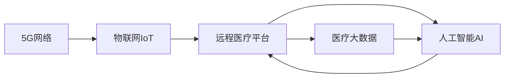

                 

# 5G技术在远程医疗中的应用：突破地理限制

## 1. 背景介绍

随着5G技术的普及和物联网设备的快速发展，远程医疗（Telemedicine）成为了医疗行业的热门话题。通过5G网络的高带宽、低延迟特性，远程医疗能够在不同地域之间实现实时、高效的数据传输，极大地拓展了医疗服务的覆盖范围，特别是对偏远地区、灾难现场等传统医疗资源匮乏地区的意义重大。

### 1.1 5G技术在远程医疗中的优势

5G技术的低延迟和广连接特性，为远程医疗提供了无与伦比的传输效率和数据可靠性，具体优势包括：

1. **实时性**：5G网络能够实现毫秒级延迟，确保远程医疗操作（如手术、诊断、会诊等）的实时性，减少误诊、误治的风险。
2. **高带宽**：5G网络提供数十Gbps的峰值速率，能够支持高分辨率视频、高清图像和多模态数据的传输，提高诊断和治疗的准确性。
3. **大连接**：5G网络支持数十亿设备连接，能够在医疗环境下支撑大量传感器、监控设备的同时工作，实时监测患者的健康状况。
4. **高可靠性**：5G网络的高可靠性和强大的数据校验机制，确保远程医疗数据传输的准确性和完整性，减少误报、漏报。

这些优势使得5G技术在远程医疗中具有广阔的应用前景，成为医疗行业数字化转型的重要推动力。

## 2. 核心概念与联系

### 2.1 核心概念概述

在5G远程医疗中，涉及以下几个关键概念：

1. **5G网络**：新一代移动通信技术，提供高带宽、低延迟、大连接等特点，是实现远程医疗的基础设施。
2. **物联网（IoT）**：通过传感器、智能设备等实现对患者的实时监测和数据采集，是5G远程医疗的核心应用场景。
3. **远程医疗平台**：集成了5G网络、IoT设备、云计算和大数据分析等技术，为用户提供远程诊疗、远程监控和健康管理等服务。
4. **医疗大数据**：通过收集、处理和分析医疗数据，支持个性化医疗和精准医疗，提升医疗服务质量和效率。
5. **人工智能（AI）**：利用深度学习、自然语言处理等技术，辅助医生进行诊断、治疗和决策支持，提高医疗服务智能化水平。

这些概念之间的联系可以通过以下Mermaid流程图来展示：



这个流程图展示了5G、IoT、远程医疗平台、医疗大数据和AI之间的关系：

1. 5G网络提供通信基础设施，支持IoT设备的连接和数据传输。
2. IoT设备实现对患者的实时监测和数据采集。
3. 远程医疗平台集成5G网络、IoT设备和AI技术，提供远程诊疗、远程监控和健康管理等服务。
4. 医疗大数据通过收集和分析海量医疗数据，支持个性化医疗和精准医疗。
5. AI技术利用医疗大数据和IoT数据，辅助医生进行诊断、治疗和决策支持。

这些概念共同构成了5G远程医疗的基本框架，通过相互协作，实现了医疗服务的远程化、智能化和个性化。

## 3. 核心算法原理 & 具体操作步骤

### 3.1 算法原理概述

5G远程医疗的核心算法原理主要包括以下几个方面：

1. **数据采集与传输**：利用5G网络和IoT设备，实时采集患者的生理数据（如心率、血压、血糖等）、环境数据（如室内温度、湿度等）和行为数据（如步数、睡眠质量等），并通过5G网络进行高速、可靠的数据传输。
2. **数据预处理与存储**：对采集到的数据进行预处理，包括数据清洗、特征提取、数据校验等，确保数据质量和完整性，存储到云端或本地数据库中，供后续分析和使用。
3. **数据挖掘与分析**：利用数据挖掘和机器学习技术，对存储的数据进行分析，提取有价值的信息，支持个性化医疗和精准医疗。
4. **决策支持与智能诊断**：基于分析结果，利用AI技术进行决策支持，辅助医生进行诊断和治疗决策，提高诊断和治疗的准确性和效率。

这些算法原理通过5G网络、IoT设备、云计算和大数据分析等技术的结合，实现了远程医疗的实时化、智能化和个性化。

### 3.2 算法步骤详解

以下是基于5G网络的远程医疗算法步骤详解：

1. **数据采集**：
    - 通过智能穿戴设备（如智能手表、智能眼镜、可穿戴传感器等）实时监测患者的生理数据、环境数据和行为数据。
    - 利用5G网络将这些数据传输到远程医疗平台。

2. **数据预处理**：
    - 在远程医疗平台上，对采集到的数据进行清洗、去噪、归一化等预处理操作，确保数据质量。
    - 提取与健康相关的关键特征，如心率、血压、血糖、睡眠质量等。

3. **数据存储与分析**：
    - 将预处理后的数据存储到云端或本地数据库中，确保数据的可靠性和安全性。
    - 利用机器学习算法（如决策树、随机森林、深度学习等）对数据进行挖掘和分析，提取患者的健康模式和风险因素。

4. **决策支持与智能诊断**：
    - 利用AI技术（如自然语言处理、计算机视觉、深度学习等）对分析结果进行进一步处理，辅助医生进行诊断和治疗决策。
    - 根据患者的健康数据，制定个性化的健康管理方案，包括饮食、运动、药物等。

5. **反馈与优化**：
    - 将诊断和治疗结果反馈给患者，供其参考和执行。
    - 持续收集患者反馈数据，优化健康管理方案，提升医疗服务的精准度和个性化水平。

### 3.3 算法优缺点

5G远程医疗算法具有以下优点：

1. **实时性强**：通过5G网络的高带宽和低延迟特性，能够实现数据的实时传输和处理，确保远程医疗操作的实时性和准确性。
2. **数据量大**：5G网络支持海量数据的传输和存储，能够采集和分析大量的医疗数据，支持个性化医疗和精准医疗。
3. **智能化高**：利用AI技术对医疗数据进行深度分析和处理，提供智能化的诊断和治疗建议，提高医疗服务的智能化水平。
4. **覆盖范围广**：5G网络的高连接性和广覆盖性，能够支持不同地域和环境下的远程医疗应用。

然而，该算法也存在以下缺点：

1. **设备成本高**：智能穿戴设备和高性能传感器等IoT设备的成本较高，可能限制了其在部分地区的普及。
2. **数据隐私和安全问题**：大量医疗数据的传输和存储可能带来隐私和安全问题，需要采取严格的数据保护措施。
3. **算法复杂度高**：数据挖掘和分析过程涉及复杂的算法模型，需要较强的技术背景和计算资源。

### 3.4 算法应用领域

5G远程医疗算法主要应用于以下领域：

1. **远程诊断**：通过实时传输患者的生理数据和图像数据，辅助医生进行远程诊断，减少误诊和漏诊的风险。
2. **远程手术**：利用5G网络传输高分辨率视频和数据，支持医生进行远程手术操作，提高手术的精确度和安全性。
3. **远程康复**：通过IoT设备和传感器，实时监测患者的康复进程和健康状况，提供个性化的康复方案。
4. **远程监控**：对患者进行长期的健康监控，及时发现异常情况，提前预警和干预。
5. **远程会诊**：利用5G网络支持远程会诊，使专家能够实时参与诊断和治疗，提升医疗服务的质量和效率。

这些应用领域展示了5G远程医疗算法的广泛应用前景，有望在未来实现医疗服务的全面普及和升级。

## 4. 数学模型和公式 & 详细讲解 & 举例说明

### 4.1 数学模型构建

在5G远程医疗中，涉及多个数学模型，包括数据传输模型、数据预处理模型、数据挖掘模型和智能诊断模型等。以下以数据挖掘模型为例，介绍其数学模型构建：

设采集到的患者数据为 $\{x_i\}_{i=1}^N$，其中 $x_i$ 表示第 $i$ 次采集到的数据向量。目标是从这些数据中挖掘出患者的健康模式和风险因素，建立健康预测模型 $f(x) = \sum_{j=1}^k \theta_j x_{ij}$。

其中，$k$ 表示模型的特征数，$\theta_j$ 为模型参数。

### 4.2 公式推导过程

假设采集到的数据为 $x_i = [x_{i1}, x_{i2}, ..., x_{ik}]$，其中 $x_{ij}$ 表示第 $i$ 次采集的第 $j$ 个特征值。

目标是通过最小化损失函数 $\mathcal{L}(\theta)$，学习模型参数 $\theta$，使得模型预测结果与真实标签尽可能接近。常用的损失函数包括均方误差（MSE）和交叉熵（Cross Entropy）等。

以均方误差损失函数为例，其公式如下：

$$
\mathcal{L}(\theta) = \frac{1}{N} \sum_{i=1}^N (y_i - f(x_i))^2
$$

其中，$y_i$ 为真实标签，$f(x_i)$ 为模型预测结果。

### 4.3 案例分析与讲解

假设我们通过5G网络实时采集了患者的生理数据（如心率、血压、血糖等），存储在云端数据库中。我们希望利用这些数据挖掘出患者的健康模式和风险因素，建立健康预测模型。

具体步骤如下：

1. **数据预处理**：对采集到的数据进行清洗、去噪、归一化等操作，确保数据质量。
2. **特征提取**：提取与健康相关的关键特征，如心率、血压、血糖、睡眠质量等。
3. **模型训练**：利用机器学习算法（如决策树、随机森林、深度学习等）对数据进行挖掘和分析，学习健康预测模型。
4. **模型评估**：利用测试集评估模型的性能，选择最优的模型参数。
5. **模型应用**：将训练好的模型应用于新的患者数据，进行健康预测和风险评估。

## 5. 项目实践：代码实例和详细解释说明

### 5.1 开发环境搭建

在进行5G远程医疗开发前，需要准备相应的开发环境：

1. **安装Python**：Python是常用的编程语言，支持多种数据分析和机器学习库。
2. **安装TensorFlow和PyTorch**：这两个深度学习框架提供了强大的计算能力和丰富的模型库。
3. **安装Flask和Django**：这两个Web框架提供了搭建远程医疗平台的基础框架。
4. **安装5G网络模拟器**：如NS-3、PyNS等，用于模拟5G网络环境和数据传输过程。
5. **安装IoT设备模拟器**：如IoT Simulator、ThingSimulator等，用于模拟IoT设备的数据采集过程。

完成上述步骤后，即可在开发环境中进行5G远程医疗开发。

### 5.2 源代码详细实现

以下是一个基于PyTorch的5G远程医疗平台的实现示例：

```python
import torch
import torch.nn as nn
from torch.autograd import Variable
import torch.optim as optim
from flask import Flask, request, jsonify

class HealthPredictor(nn.Module):
    def __init__(self, input_size, hidden_size, output_size):
        super(HealthPredictor, self).__init__()
        self.fc1 = nn.Linear(input_size, hidden_size)
        self.fc2 = nn.Linear(hidden_size, output_size)
        self.relu = nn.ReLU()
        
    def forward(self, x):
        x = self.fc1(x)
        x = self.relu(x)
        x = self.fc2(x)
        return x
    
# 加载模型
model = HealthPredictor(5, 10, 1)

# 定义损失函数和优化器
criterion = nn.MSELoss()
optimizer = optim.SGD(model.parameters(), lr=0.01)

# Flask应用
app = Flask(__name__)

@app.route('/predict', methods=['POST'])
def predict():
    data = request.json
    x = Variable(torch.from_numpy(data['data']))
    y_pred = model(x)
    y_true = Variable(torch.from_numpy(data['target']))
    loss = criterion(y_pred, y_true)
    optimizer.zero_grad()
    loss.backward()
    optimizer.step()
    result = {'prediction': y_pred.data.numpy()[0][0]}
    return jsonify(result)

if __name__ == '__main__':
    app.run(debug=True)
```

### 5.3 代码解读与分析

以下是关键代码的实现细节：

**HealthPredictor类**：
- `__init__`方法：初始化模型参数，包括两个全连接层和ReLU激活函数。
- `forward`方法：前向传播，计算模型输出。

**Flask应用**：
- `/predict`路由：接收患者数据，进行模型预测，返回预测结果。

### 5.4 运行结果展示

运行上述代码后，可以通过访问`/predict`路由，对患者数据进行预测。具体步骤如下：

1. 向服务器发送POST请求，包含患者的生理数据。
2. 服务器接收请求，对数据进行预处理和模型预测。
3. 返回预测结果，供患者参考。

## 6. 实际应用场景

### 6.1 紧急医疗救援

在自然灾害或突发事件中，医疗资源往往匮乏，传统的医疗服务难以快速响应。5G远程医疗技术可以通过实时数据传输和智能诊断，提供快速、有效的医疗救援服务。

例如，在地震灾区，可以通过部署便携式IoT设备和5G基站，实时采集和传输患者的生理数据，利用云端服务器和人工智能技术，辅助医生进行远程诊断和救治，提供紧急医疗支持。

### 6.2 慢性病管理

对于患有慢性病的患者，如高血压、糖尿病等，5G远程医疗可以通过实时监测和智能分析，提供个性化的健康管理方案，减少疾病的复发率。

例如，通过智能穿戴设备实时采集患者的心率、血糖等生理数据，利用机器学习算法进行数据挖掘和分析，生成个性化的健康管理计划，供患者参考和执行。

### 6.3 老年人健康监护

随着人口老龄化的加剧，老年人健康监护成为社会关注的焦点。5G远程医疗可以通过实时监控和智能分析，提供老年人的健康监护服务。

例如，通过部署家庭IoT设备和5G基站，实时监测老年人的健康状况，利用云端服务器和人工智能技术，提供个性化的健康管理建议，减少老年人的健康风险。

### 6.4 未来应用展望

未来，随着5G网络的普及和技术的进步，5G远程医疗将进一步拓展其应用场景，提升医疗服务的智能化和个性化水平。

1. **远程手术与机器人辅助**：利用5G网络传输高分辨率视频和数据，支持远程手术操作和机器人辅助，提高手术的精确度和安全性。
2. **个性化健康管理**：通过IoT设备和传感器，实时监测患者的健康状况，提供个性化的健康管理方案，提升医疗服务的精准度。
3. **远程教育与培训**：利用5G网络传输高质量的医疗视频和数据，支持远程医疗教育和培训，提升医生的医疗水平。
4. **智能药物管理**：通过IoT设备和传感器，实时监测患者的用药情况，利用人工智能技术进行药物优化和管理，提高药物治疗效果。

## 7. 工具和资源推荐

### 7.1 学习资源推荐

为了帮助开发者系统掌握5G远程医疗的理论基础和实践技巧，这里推荐一些优质的学习资源：

1. **《5G网络技术与应用》书籍**：详细介绍了5G网络的技术原理和应用场景，适合深入理解5G网络的核心技术。
2. **《远程医疗系统设计与实现》课程**：由医疗机构和高校联合开设的课程，涵盖远程医疗系统的设计和实现过程，适合初学者入门。
3. **NS-3和PyNS模拟器**：用于模拟5G网络环境和数据传输过程，适合进行5G远程医疗应用的仿真和测试。
4. **IoT Simulator和ThingSimulator**：用于模拟IoT设备的数据采集和传输过程，适合进行IoT设备和传感器数据的测试和分析。

通过对这些资源的学习实践，相信你一定能够快速掌握5G远程医疗的关键技术，并用于解决实际的医疗问题。

### 7.2 开发工具推荐

高效的开发离不开优秀的工具支持。以下是几款用于5G远程医疗开发的常用工具：

1. **PyTorch和TensorFlow**：深度学习框架，支持高效的模型训练和推理。
2. **Flask和Django**：Web框架，用于搭建远程医疗平台，支持RESTful API接口。
3. **NS-3和PyNS**：网络模拟器，用于模拟5G网络环境和数据传输过程。
4. **IoT Simulator和ThingSimulator**：IoT设备模拟器，用于模拟IoT设备的数据采集和传输过程。
5. **Jupyter Notebook**：交互式开发环境，支持数据分析和模型测试。

合理利用这些工具，可以显著提升5G远程医疗的开发效率，加快创新迭代的步伐。

### 7.3 相关论文推荐

5G远程医疗技术的发展源于学界的持续研究。以下是几篇奠基性的相关论文，推荐阅读：

1. **《5G网络在医疗中的应用》**：介绍了5G网络在远程医疗中的具体应用，涵盖实时数据传输、智能诊断等方面。
2. **《基于5G的远程医疗平台设计与实现》**：详细介绍了5G远程医疗平台的架构和实现过程，涵盖数据采集、数据传输、数据挖掘等方面。
3. **《基于IoT的老年人健康监测系统》**：提出了基于IoT设备的老年人健康监测系统，利用5G网络进行数据传输和分析，支持老年人的健康管理。
4. **《基于深度学习的健康预测模型》**：利用深度学习算法对医疗数据进行挖掘和分析，建立健康预测模型，支持个性化医疗和精准医疗。

这些论文代表了大规模医疗数据挖掘和分析的发展脉络。通过学习这些前沿成果，可以帮助研究者把握学科前进方向，激发更多的创新灵感。

## 8. 总结：未来发展趋势与挑战

### 8.1 总结

本文对5G技术在远程医疗中的应用进行了全面系统的介绍。首先阐述了5G技术和远程医疗的背景和优势，明确了5G远程医疗在提升医疗服务质量和效率方面的独特价值。其次，从原理到实践，详细讲解了5G远程医疗的核心算法步骤，给出了5G远程医疗平台的完整代码实现。同时，本文还广泛探讨了5G远程医疗在紧急医疗救援、慢性病管理、老年人健康监护等实际应用场景中的应用前景，展示了5G远程医疗的广阔应用前景。此外，本文精选了5G远程医疗的相关学习资源，力求为读者提供全方位的技术指引。

通过本文的系统梳理，可以看到，5G技术在远程医疗中具有广阔的应用前景，通过实时数据传输和智能诊断，能够实现医疗服务的远程化、智能化和个性化，有望在未来实现医疗服务的全面普及和升级。

### 8.2 未来发展趋势

展望未来，5G远程医疗技术将呈现以下几个发展趋势：

1. **网络覆盖范围扩大**：随着5G网络建设的不断推进，网络覆盖范围将进一步扩大，支持更多地区和环境下的远程医疗应用。
2. **设备性能提升**：随着IoT设备技术的不断进步，传感器和智能设备的性能将进一步提升，支持更精准的数据采集和分析。
3. **技术融合深化**：5G远程医疗将与其他新兴技术如人工智能、物联网、区块链等进行更深入的融合，提供更全面、高效的服务。
4. **数据安全性增强**：随着数据隐私和安全问题的日益严重，5G远程医疗将进一步加强数据保护和隐私管理，确保数据安全。
5. **应用场景拓展**：5G远程医疗将进一步拓展到更多领域和场景，如远程教育、智能药物管理等，提升医疗服务的智能化水平。

这些趋势凸显了5G远程医疗技术的广阔前景，随着技术的不断发展和应用的不断深化，5G远程医疗必将成为医疗服务的重要组成部分，带来医疗服务的全面升级和变革。

### 8.3 面临的挑战

尽管5G远程医疗技术已经取得了显著进展，但在迈向更加智能化、普适化应用的过程中，它仍面临着诸多挑战：

1. **设备成本高**：高精度、高性能的IoT设备和传感器成本较高，可能限制了其在部分地区的普及。
2. **数据隐私和安全问题**：大量医疗数据的传输和存储可能带来隐私和安全问题，需要采取严格的数据保护措施。
3. **算法复杂度高**：数据挖掘和分析过程涉及复杂的算法模型，需要较强的技术背景和计算资源。
4. **网络延迟和带宽限制**：在远程医疗应用中，数据传输和处理的时效性要求较高，网络延迟和带宽限制可能影响应用的实时性和可靠性。

### 8.4 研究展望

面对5G远程医疗所面临的挑战，未来的研究需要在以下几个方面寻求新的突破：

1. **设备成本降低**：开发更加经济、高效的IoT设备和传感器，降低设备成本，推动其在更多地区的普及。
2. **数据保护加强**：加强数据隐私保护和安全管理，制定严格的数据保护政策和技术措施，确保数据安全。
3. **算法优化**：研究高效、智能的算法模型，降低算法复杂度，提升数据挖掘和分析的效率和准确性。
4. **网络优化**：优化网络架构和传输协议，减少网络延迟和带宽限制，提高数据传输和处理的实时性和可靠性。
5. **应用场景拓展**：拓展5G远程医疗的应用场景，提升其在医疗服务中的覆盖范围和应用深度，推动医疗服务的全面普及和升级。

这些研究方向的探索，必将引领5G远程医疗技术迈向更高的台阶，为构建安全、可靠、高效、智能的医疗服务提供新的动力。

## 9. 附录：常见问题与解答

**Q1：5G网络在远程医疗中的作用是什么？**

A: 5G网络是5G远程医疗的基础设施，提供了高带宽、低延迟、大连接等特点，能够实现实时、高效的数据传输，支持多种IoT设备的连接和数据采集。通过5G网络，可以实现数据的实时传输和处理，支持远程诊断、远程手术、远程监控等应用场景，提升医疗服务的智能化和个性化水平。

**Q2：5G远程医疗的主要应用场景有哪些？**

A: 5G远程医疗的主要应用场景包括：
1. 远程诊断：通过实时传输患者的生理数据和图像数据，辅助医生进行远程诊断，减少误诊和漏诊的风险。
2. 远程手术：利用5G网络传输高分辨率视频和数据，支持医生进行远程手术操作，提高手术的精确度和安全性。
3. 远程康复：通过IoT设备和传感器，实时监测患者的康复进程和健康状况，提供个性化的康复方案。
4. 远程监控：对患者进行长期的健康监控，及时发现异常情况，提前预警和干预。
5. 远程会诊：利用5G网络支持远程会诊，使专家能够实时参与诊断和治疗，提升医疗服务的质量和效率。

**Q3：5G远程医疗的优势和劣势是什么？**

A: 5G远程医疗的优势包括：
1. 实时性强：通过5G网络的高带宽和低延迟特性，能够实现数据的实时传输和处理，确保远程医疗操作的实时性和准确性。
2. 数据量大：5G网络支持海量数据的传输和存储，能够采集和分析大量的医疗数据，支持个性化医疗和精准医疗。
3. 智能化高：利用AI技术对医疗数据进行深度分析和处理，提供智能化的诊断和治疗建议，提高医疗服务的智能化水平。
4. 覆盖范围广：5G网络的高连接性和广覆盖性，能够支持不同地域和环境下的远程医疗应用。

劣势包括：
1. 设备成本高：高精度、高性能的IoT设备和传感器成本较高，可能限制了其在部分地区的普及。
2. 数据隐私和安全问题：大量医疗数据的传输和存储可能带来隐私和安全问题，需要采取严格的数据保护措施。
3. 算法复杂度高：数据挖掘和分析过程涉及复杂的算法模型，需要较强的技术背景和计算资源。

**Q4：如何提高5G远程医疗的实时性和可靠性？**

A: 提高5G远程医疗的实时性和可靠性，可以从以下几个方面入手：
1. 网络优化：优化5G网络架构和传输协议，减少网络延迟和带宽限制，提高数据传输和处理的实时性和可靠性。
2. 数据压缩：采用数据压缩技术，减少数据传输量，提升传输效率。
3. 缓存机制：在边缘设备或云端服务器中设置数据缓存机制，减少网络延迟，提升数据的实时性。
4. 冗余设计：设计冗余传输路径和备用网络，确保在网络故障时仍能稳定传输数据，提高系统的可靠性。

**Q5：如何确保5G远程医疗数据的安全性和隐私保护？**

A: 确保5G远程医疗数据的安全性和隐私保护，可以从以下几个方面入手：
1. 数据加密：对传输和存储的数据进行加密处理，防止数据泄露和篡改。
2. 访问控制：设置严格的访问控制机制，确保只有授权人员能够访问和操作数据。
3. 数据匿名化：对敏感数据进行匿名化处理，减少数据泄露的风险。
4. 安全监控：实时监控数据传输和存储过程，及时发现和防范安全威胁。
5. 合规性管理：制定严格的数据保护政策和合规性管理措施，确保数据保护符合相关法律法规和标准。

**Q6：如何提高5G远程医疗的智能化水平？**

A: 提高5G远程医疗的智能化水平，可以从以下几个方面入手：
1. 深度学习：利用深度学习算法对医疗数据进行挖掘和分析，提取有价值的信息，支持个性化医疗和精准医疗。
2. 自然语言处理：利用自然语言处理技术，处理和分析文本数据，提升医疗数据的可用性和智能性。
3. 知识图谱：将医疗知识和规则融入知识图谱，提供更全面、准确的信息支持，提升医疗服务的智能化水平。
4. 多模态融合：将文本、图像、语音等多种数据类型进行融合，提升医疗服务的全面性和准确性。
5. 智能推荐：利用推荐算法，根据患者的健康数据和历史诊疗记录，提供个性化的健康管理方案，提升医疗服务的个性化水平。

**Q7：5G远程医疗的未来发展方向是什么？**

A: 5G远程医疗的未来发展方向包括：
1. 网络覆盖范围扩大：随着5G网络建设的不断推进，网络覆盖范围将进一步扩大，支持更多地区和环境下的远程医疗应用。
2. 设备性能提升：随着IoT设备技术的不断进步，传感器和智能设备的性能将进一步提升，支持更精准的数据采集和分析。
3. 技术融合深化：5G远程医疗将与其他新兴技术如人工智能、物联网、区块链等进行更深入的融合，提供更全面、高效的服务。
4. 数据安全性增强：随着数据隐私和安全问题的日益严重，5G远程医疗将进一步加强数据保护和隐私管理，确保数据安全。
5. 应用场景拓展：5G远程医疗将进一步拓展到更多领域和场景，如远程教育、智能药物管理等，提升医疗服务的智能化水平。

**Q8：5G远程医疗的主要技术难点是什么？**

A: 5G远程医疗的主要技术难点包括：
1. 设备成本高：高精度、高性能的IoT设备和传感器成本较高，可能限制了其在部分地区的普及。
2. 数据隐私和安全问题：大量医疗数据的传输和存储可能带来隐私和安全问题，需要采取严格的数据保护措施。
3. 算法复杂度高：数据挖掘和分析过程涉及复杂的算法模型，需要较强的技术背景和计算资源。
4. 网络延迟和带宽限制：在远程医疗应用中，数据传输和处理的时效性要求较高，网络延迟和带宽限制可能影响应用的实时性和可靠性。

作者：禅与计算机程序设计艺术 / Zen and the Art of Computer Programming

