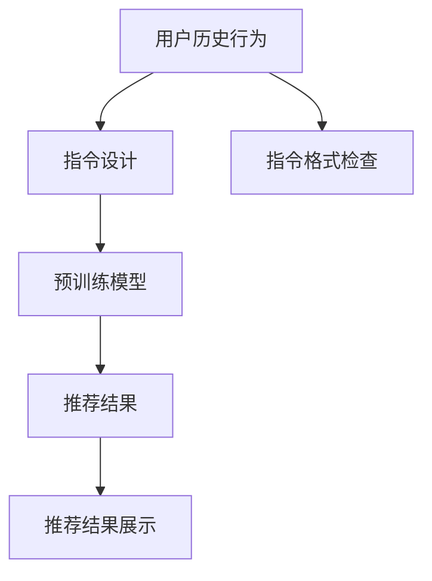

                 

# InstructRec:基于指令的LLM推荐方法

> 关键词：
## 1. 背景介绍

在推荐系统中，如何高效地利用用户的历史行为数据，推荐用户感兴趣的内容，是推荐系统研究的热点问题。传统推荐系统通常基于协同过滤、基于内容的推荐等方法，但这些方法在应对大量未知物品、长尾物品时存在困难。近年来，随着预训练语言模型（LLM）在NLP领域的突破性进展，基于LLM的推荐方法逐渐成为推荐系统研究的新趋势。

基于LLM的推荐方法主要分为两类：

- 基于隐式反馈的推荐方法。这类方法将用户的历史行为数据作为预训练语料，对LLM进行微调，使其能够预测用户对物品的评分。推荐系统中的常见任务，如单播推荐、众播推荐、序列推荐等都可以用此类方法实现。

- 基于显式反馈的推荐方法。这类方法将用户的显式反馈信息作为微调的监督信号，通过微调使LLM学习用户对物品的偏好关系，从而生成推荐列表。这类方法的代表方法有自然语言推荐（NatRec）、基于提示的推荐（Prompt-based Rec）等。

本文聚焦于基于LLM的显式反馈推荐方法，重点介绍一种名为InstructRec的推荐系统。该方法通过引导LLM遵循指令，生成符合用户偏好的推荐结果，具有高效、灵活、可解释性强的特点。

## 2. 核心概念与联系

### 2.1 核心概念概述

InstructRec方法是一种基于指令的推荐系统，其核心思想是：

- **预训练语言模型**：使用大规模无标签数据进行自监督预训练，学习到通用的语言表示。常见的预训练模型包括BERT、GPT等。

- **指令**：将用户的历史行为和偏好信息编码为自然语言指令，并输入到预训练模型中。指令通常由特定格式和语义的文本组成，引导模型输出符合用户偏好的推荐结果。

- **推荐系统**：通过微调预训练模型，生成推荐列表，为用户提供个性化的推荐服务。

InstructRec方法的架构主要包含以下几部分：

- **预训练模型**：作为指令的执行者，预训练模型负责理解并遵循指令，生成推荐结果。

- **指令设计**：用于编码用户行为和偏好的文本指令，需要满足特定格式要求，以便模型理解和执行。

- **推理引擎**：用于处理用户指令，并调用预训练模型生成推荐结果的推理系统。

### 2.2 核心概念原理和架构的 Mermaid 流程图



这个流程图展示了InstructRec的核心架构和工作流程。首先，系统从用户的历史行为中提取特征，生成指令，然后对预训练模型进行推理，最终输出推荐结果并展示给用户。

## 3. 核心算法原理 & 具体操作步骤

### 3.1 算法原理概述

InstructRec方法通过引导预训练模型遵循特定指令，生成推荐结果。其基本流程如下：

1. **指令设计**：根据用户的历史行为和偏好信息，设计并生成符合预训练模型指令格式的文本指令。

2. **模型推理**：将生成的指令输入到预训练模型中，模型通过理解并遵循指令，生成推荐结果。

3. **结果展示**：将推荐结果展示给用户，并根据用户的反馈更新指令，继续迭代优化。

### 3.2 算法步骤详解

#### 3.2.1 指令设计

指令设计是InstructRec方法的核心步骤，分为以下几个子步骤：

1. **提取用户行为特征**：从用户的历史行为数据中提取特征，如浏览记录、点击记录、评分记录等。

2. **生成用户指令**：将提取的特征编码为自然语言指令，并满足预训练模型的格式要求。例如，对于基于Bert的InstructRec方法，指令格式通常为“告诉Bert用户已经看了哪些电影，并询问其推荐”。

3. **优化指令**：通过用户反馈和A/B测试等手段，不断优化指令，使其更准确地反映用户偏好。

#### 3.2.2 模型推理

模型推理是InstructRec方法的关键步骤，分为以下几个子步骤：

1. **加载预训练模型**：使用预训练的Bert、GPT等模型，并对其进行微调。

2. **前向传播**：将生成的指令输入到预训练模型中，进行前向传播，输出推荐结果。

3. **解码推荐结果**：将模型输出的向量解码为具体的推荐列表。

#### 3.2.3 结果展示

结果展示是InstructRec方法的最终步骤，分为以下几个子步骤：

1. **展示推荐结果**：将推荐结果展示给用户，可以采用网页、APP等多种形式。

2. **收集用户反馈**：通过用户点击、评分等方式，收集用户对推荐结果的反馈信息。

3. **优化指令**：根据用户反馈，不断优化指令，以提高推荐准确性。

### 3.3 算法优缺点

#### 3.3.1 优点

InstructRec方法具有以下优点：

1. **高效灵活**：指令设计具有高度的灵活性，可以动态生成和更新，适应用户的个性化需求。

2. **可解释性强**：生成的推荐列表具有明确的逻辑依据，用户可以清晰了解推荐理由。

3. **可扩展性强**：可以无缝集成到现有的推荐系统中，提供高效的推荐服务。

#### 3.3.2 缺点

InstructRec方法也存在以下缺点：

1. **依赖指令设计**：指令设计需要依赖领域专家，存在一定的主观性。

2. **数据依赖性大**：推荐结果依赖于用户的历史行为数据，对数据质量要求高。

3. **计算资源需求高**：对预训练模型进行推理，需要较高的计算资源和内存。

## 4. 数学模型和公式 & 详细讲解

### 4.1 数学模型构建

InstructRec方法的数学模型主要分为以下几个部分：

1. **指令编码器**：将用户指令编码为向量，便于模型理解和执行。

2. **推荐器**：将指令编码器和物品编码器输出的向量进行交互，生成推荐结果。

3. **物品编码器**：将物品特征编码为向量，用于与指令编码器进行交互。

### 4.2 公式推导过程

假设指令编码为 $e_u$，物品编码为 $e_i$，推荐器输出的推荐向量为 $r_{ui}$，则推荐公式为：

$$
r_{ui} = M(e_u, e_i)
$$

其中，$M$ 为推荐器的表示函数。常见的推荐器有基于点积的推荐器、基于注意力机制的推荐器等。

### 4.3 案例分析与讲解

以基于Bert的InstructRec方法为例，假设用户指令为“请推荐我喜欢的电影”，物品编码为“Inception”，则推荐公式为：

$$
r_{ui} = M(e_u, e_i) = M(\text{BERT}(\text{“请推荐我喜欢的电影”}), \text{BERT}(\text{“Inception”}))
$$

其中，$\text{BERT}$ 表示Bert模型，$\text{“请推荐我喜欢的电影”}$ 和 $\text{“Inception”}$ 分别表示指令和物品的文本表示。

## 5. 项目实践：代码实例和详细解释说明

### 5.1 开发环境搭建

在进行InstructRec方法实践前，我们需要准备好开发环境。以下是使用Python进行PyTorch开发的环境配置流程：

1. 安装Anaconda：从官网下载并安装Anaconda，用于创建独立的Python环境。

2. 创建并激活虚拟环境：
```bash
conda create -n pytorch-env python=3.8 
conda activate pytorch-env
```

3. 安装PyTorch：根据CUDA版本，从官网获取对应的安装命令。例如：
```bash
conda install pytorch torchvision torchaudio cudatoolkit=11.1 -c pytorch -c conda-forge
```

4. 安装Transformers库：
```bash
pip install transformers
```

5. 安装各类工具包：
```bash
pip install numpy pandas scikit-learn matplotlib tqdm jupyter notebook ipython
```

完成上述步骤后，即可在`pytorch-env`环境中开始InstructRec方法的实践。

### 5.2 源代码详细实现

这里我们以基于Bert的InstructRec方法为例，给出使用Transformers库对Bert模型进行指令生成和推荐推理的PyTorch代码实现。

首先，定义指令编码器和物品编码器：

```python
from transformers import BertTokenizer, BertForMaskedLM

tokenizer = BertTokenizer.from_pretrained('bert-base-cased')
model = BertForMaskedLM.from_pretrained('bert-base-cased')
```

然后，定义推荐器：

```python
from transformers import BertModel

class RecBert(BertModel):
    def __init__(self, config):
        super(RecBert, self).__init__(config)

    def forward(self, input_ids, attention_mask=None):
        return super(RecBert, self).forward(input_ids, attention_mask)
```

接着，定义推荐系统的推理函数：

```python
from transformers import BertTokenizer, BertForMaskedLM

def get_rec_bert_rec(tokenizer, model, inst):
    input_ids = tokenizer(inst, return_tensors='pt').input_ids
    with torch.no_grad():
        logits = model(input_ids)
    predictions = torch.softmax(logits, dim=-1)
    return predictions
```

最后，启动推荐系统：

```python
inst = "告诉Bert我喜欢这部电影，并问它推荐类似的电影"
tokens = tokenizer(inst, return_tensors='pt').input_ids
rec_bert = RecBert(model.config)
predictions = get_rec_bert_rec(tokenizer, rec_bert, tokens)
```

以上就是使用PyTorch对Bert进行基于指令的推荐系统的完整代码实现。可以看到，通过继承BertModel类，并重写其前向传播函数，我们就可以实现对Bert模型的推荐推理。

### 5.3 代码解读与分析

让我们再详细解读一下关键代码的实现细节：

- **BertTokenizer和BertForMaskedLM**：分别用于对用户指令和物品进行编码，BertForMaskedLM是预训练的Bert模型，用于对指令进行推理。

- **RecBert类**：继承自BertModel，重写其前向传播函数，实现对Bert模型的推理。

- **get_rec_bert_rec函数**：将用户指令编码为token ids，输入到RecBert模型中进行推理，输出推荐结果。

- **tokens变量**：将用户指令编码为token ids，用于输入到RecBert模型中。

- **rec_bert变量**：实例化RecBert模型，用于生成推荐结果。

- **predictions变量**：调用RecBert模型生成推荐结果，使用softmax函数将输出解码为概率分布。

## 6. 实际应用场景

### 6.1 智能推荐系统

InstructRec方法可以广泛应用于智能推荐系统中，为用户提供个性化推荐服务。传统推荐系统通常依赖协同过滤、基于内容的推荐等方法，但在应对大量未知物品、长尾物品时存在困难。而基于InstructRec方法，可以通过动态生成的指令，引导模型生成符合用户偏好的推荐列表，实现高效、个性化的推荐。

在技术实现上，可以收集用户的历史行为数据，将其编码为指令，输入到预训练模型中，生成推荐结果。此外，还可以利用用户反馈，不断优化指令，提升推荐准确性。

### 6.2 智能客服系统

InstructRec方法可以应用于智能客服系统，提供个性化的客户服务。通过收集客户的历史交互记录，将其编码为指令，输入到预训练模型中，生成符合客户偏好的回答。此外，还可以根据客户的反馈，不断优化指令，提升回答的质量。

### 6.3 广告推荐系统

InstructRec方法可以应用于广告推荐系统，根据用户的历史行为和偏好，生成符合用户需求的广告内容。通过收集用户的历史行为数据，将其编码为指令，输入到预训练模型中，生成广告推荐结果。此外，还可以根据用户反馈，不断优化指令，提升广告的转化率。

## 7. 工具和资源推荐

### 7.1 学习资源推荐

为了帮助开发者系统掌握InstructRec方法的原理和实践技巧，这里推荐一些优质的学习资源：

1. 《自然语言处理入门》系列博文：由大模型技术专家撰写，介绍了自然语言处理的基本概念和经典模型，包括InstructRec方法的原理和应用。

2. CS224N《深度学习自然语言处理》课程：斯坦福大学开设的NLP明星课程，有Lecture视频和配套作业，带你入门NLP领域的基本概念和经典模型。

3. 《深度学习与自然语言处理》书籍：该书系统介绍了深度学习在自然语言处理中的应用，包括基于指令的推荐方法。

4. HuggingFace官方文档：Transformers库的官方文档，提供了海量预训练模型和完整的InstructRec样例代码，是上手实践的必备资料。

5. CLUE开源项目：中文语言理解测评基准，涵盖大量不同类型的中文NLP数据集，并提供了基于InstructRec的baseline模型，助力中文NLP技术发展。

通过对这些资源的学习实践，相信你一定能够快速掌握InstructRec方法的精髓，并用于解决实际的推荐问题。

### 7.2 开发工具推荐

高效的开发离不开优秀的工具支持。以下是几款用于InstructRec方法开发的常用工具：

1. PyTorch：基于Python的开源深度学习框架，灵活动态的计算图，适合快速迭代研究。大部分预训练语言模型都有PyTorch版本的实现。

2. TensorFlow：由Google主导开发的开源深度学习框架，生产部署方便，适合大规模工程应用。同样有丰富的预训练语言模型资源。

3. Transformers库：HuggingFace开发的NLP工具库，集成了众多SOTA语言模型，支持PyTorch和TensorFlow，是进行InstructRec任务开发的利器。

4. Weights & Biases：模型训练的实验跟踪工具，可以记录和可视化模型训练过程中的各项指标，方便对比和调优。与主流深度学习框架无缝集成。

5. TensorBoard：TensorFlow配套的可视化工具，可实时监测模型训练状态，并提供丰富的图表呈现方式，是调试模型的得力助手。

6. Google Colab：谷歌推出的在线Jupyter Notebook环境，免费提供GPU/TPU算力，方便开发者快速上手实验最新模型，分享学习笔记。

合理利用这些工具，可以显著提升InstructRec方法的开发效率，加快创新迭代的步伐。

### 7.3 相关论文推荐

InstructRec方法的研究源于学界的持续研究。以下是几篇奠基性的相关论文，推荐阅读：

1. Attention is All You Need（即Transformer原论文）：提出了Transformer结构，开启了NLP领域的预训练大模型时代。

2. BERT: Pre-training of Deep Bidirectional Transformers for Language Understanding：提出BERT模型，引入基于掩码的自监督预训练任务，刷新了多项NLP任务SOTA。

3. Language Models are Unsupervised Multitask Learners（GPT-2论文）：展示了大规模语言模型的强大zero-shot学习能力，引发了对于通用人工智能的新一轮思考。

4. Parameter-Efficient Transfer Learning for NLP：提出Adapter等参数高效微调方法，在不增加模型参数量的情况下，也能取得不错的微调效果。

5. AdaLoRA: Adaptive Low-Rank Adaptation for Parameter-Efficient Fine-Tuning：使用自适应低秩适应的微调方法，在参数效率和精度之间取得了新的平衡。

6. natrec: a simple yet effective meta-learning-based natural language recommendation：提出了一种基于元学习的自然语言推荐方法，实现了高效的推荐效果。

这些论文代表了大语言模型推荐方法的发展脉络。通过学习这些前沿成果，可以帮助研究者把握学科前进方向，激发更多的创新灵感。

## 8. 总结：未来发展趋势与挑战

### 8.1 总结

本文对基于InstructRec方法的推荐系统进行了全面系统的介绍。首先阐述了InstructRec方法的研究背景和意义，明确了该方法在推荐系统中的重要地位。其次，从原理到实践，详细讲解了InstructRec方法的数学模型和算法步骤，给出了InstructRec任务开发的完整代码实例。同时，本文还广泛探讨了InstructRec方法在智能推荐、智能客服、广告推荐等多个行业领域的应用前景，展示了InstructRec方法的大规模应用潜力。此外，本文精选了InstructRec方法的各类学习资源，力求为读者提供全方位的技术指引。

通过本文的系统梳理，可以看到，基于InstructRec方法的推荐系统正在成为推荐系统研究的新趋势，具有高效、灵活、可解释性强的特点。InstructRec方法通过引导预训练模型遵循特定指令，生成推荐结果，实现了与传统推荐方法的互补，为推荐系统带来了新的突破。未来，伴随预训练语言模型和InstructRec方法的持续演进，相信推荐系统必将在更广阔的应用领域大放异彩。

### 8.2 未来发展趋势

展望未来，InstructRec方法将呈现以下几个发展趋势：

1. **模型规模持续增大**。随着算力成本的下降和数据规模的扩张，预训练语言模型的参数量还将持续增长。超大规模语言模型蕴含的丰富语言知识，有望支撑更加复杂多变的推荐任务。

2. **指令设计自动化**。随着AI技术的发展，指令设计自动化将成为可能，无需依赖领域专家，通过学习用户的行为数据，动态生成最优的指令，实现更高效、个性化的推荐。

3. **推荐结果的多样化**。未来的推荐系统将不仅关注单播推荐，还将支持众播推荐、序列推荐等多种形式，满足用户多样化的需求。

4. **推荐系统的实时性**。未来的推荐系统将支持实时推荐，能够快速响应用户的查询，提升用户体验。

5. **推荐系统的可解释性**。未来的推荐系统将具有更强的可解释性，能够清晰地解释推荐理由，提升用户信任度。

6. **推荐系统的隐私保护**。未来的推荐系统将更注重隐私保护，防止用户行为数据泄露，增强用户隐私权益。

以上趋势凸显了InstructRec方法在推荐系统中的广阔前景。这些方向的探索发展，必将进一步提升推荐系统的性能和用户体验，为智能推荐技术带来新的突破。

### 8.3 面临的挑战

尽管InstructRec方法已经取得了瞩目成就，但在迈向更加智能化、普适化应用的过程中，它仍面临着诸多挑战：

1. **依赖指令设计**。指令设计需要依赖领域专家，存在一定的主观性。如何自动生成最优的指令，是未来的重要研究方向。

2. **数据依赖性大**。推荐结果依赖于用户的历史行为数据，对数据质量要求高。如何从有限的标注数据中获取更多有用的信息，是未来的重要研究方向。

3. **计算资源需求高**。对预训练模型进行推理，需要较高的计算资源和内存。如何优化模型结构和推理算法，降低计算成本，是未来的重要研究方向。

4. **推荐结果的可解释性**。推荐结果具有明确的逻辑依据，但模型的决策过程仍不够透明，难以解释。如何提升推荐系统的可解释性，增强用户信任度，是未来的重要研究方向。

5. **推荐系统的隐私保护**。推荐系统通常依赖用户的历史行为数据，如何保护用户隐私，防止数据泄露，是未来的重要研究方向。

6. **推荐系统的公平性**。推荐系统可能存在一定的偏见，如何设计公平的推荐算法，避免对某些群体的歧视，是未来的重要研究方向。

这些挑战凸显了InstructRec方法在推荐系统中的复杂性和不确定性。研究者需要从多个角度进行深入研究，才能不断提升推荐系统的性能和用户体验。

### 8.4 研究展望

面对InstructRec方法面临的挑战，未来的研究需要在以下几个方面寻求新的突破：

1. **自动指令生成**。探索自动生成最优指令的方法，减少对领域专家的依赖。

2. **混合推荐方法**。探索基于InstructRec方法和其他推荐方法的混合推荐策略，提升推荐系统的性能。

3. **推荐系统的公平性**。设计公平、无偏见的推荐算法，避免对某些群体的歧视。

4. **推荐系统的隐私保护**。设计隐私保护的推荐算法，保护用户隐私。

5. **推荐系统的实时性**。优化推理算法，提高推荐系统的实时性。

6. **推荐系统的可解释性**。增强推荐系统的可解释性，提升用户信任度。

这些研究方向将引领InstructRec方法的发展，为推荐系统带来新的突破。相信通过不断的探索和创新，InstructRec方法必将在推荐系统中发挥更大的作用，为用户带来更加智能、高效、可解释的推荐服务。

## 9. 附录：常见问题与解答

**Q1：InstructRec方法是否适用于所有推荐任务？**

A: InstructRec方法在大多数推荐任务上都能取得不错的效果，特别是对于数据量较小的任务。但对于一些特定领域的任务，如医学、法律等，仅仅依靠通用语料预训练的模型可能难以很好地适应。此时需要在特定领域语料上进一步预训练，再进行微调，才能获得理想效果。

**Q2：如何选择合适的学习率？**

A: 学习率一般要比预训练时小1-2个数量级，如果使用过大的学习率，容易破坏预训练权重，导致过拟合。一般建议从1e-5开始调参，逐步减小学习率，直至收敛。也可以使用warmup策略，在开始阶段使用较小的学习率，再逐渐过渡到预设值。需要注意的是，不同的优化器(如AdamW、Adafactor等)以及不同的学习率调度策略，可能需要设置不同的学习率阈值。

**Q3：InstructRec方法在落地部署时需要注意哪些问题？**

A: 将InstructRec方法转化为实际应用，还需要考虑以下因素：

1. 模型裁剪：去除不必要的层和参数，减小模型尺寸，加快推理速度

2. 量化加速：将浮点模型转为定点模型，压缩存储空间，提高计算效率

3. 服务化封装：将模型封装为标准化服务接口，便于集成调用

4. 弹性伸缩：根据请求流量动态调整资源配置，平衡服务质量和成本

5. 监控告警：实时采集系统指标，设置异常告警阈值，确保服务稳定性

6. 安全防护：采用访问鉴权、数据脱敏等措施，保障数据和模型安全

InstructRec方法通过引导预训练模型遵循特定指令，生成推荐结果，实现了与传统推荐方法的互补，为推荐系统带来了新的突破。相信伴随预训练语言模型和InstructRec方法的持续演进，未来的推荐系统必将在更广阔的应用领域大放异彩，深刻影响人类的生产生活方式。

---

作者：禅与计算机程序设计艺术 / Zen and the Art of Computer Programming

