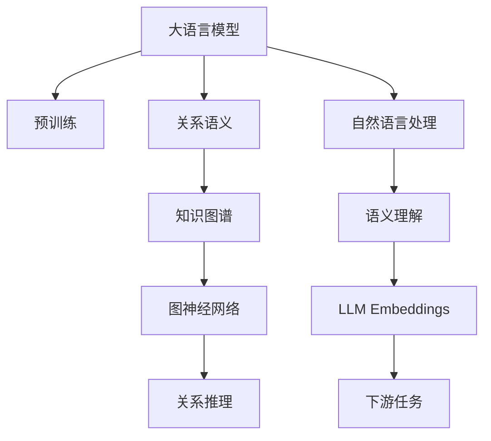

                 

# LLM Embeddings + RS方法

> 关键词：Large Language Model (LLM) Embeddings, Relational Semantics (RS), 自然语言处理 (NLP), 语义理解, 知识图谱, 图神经网络 (GNN), 预训练模型

## 1. 背景介绍

在自然语言处理（NLP）领域，语言模型的预训练和微调已经成为提高模型性能的关键技术。传统的语言模型主要是基于词袋模型（Bag of Words, BOW）和隐马尔可夫模型（Hidden Markov Model, HMM）构建的。这些模型虽然在某些任务上表现出色，但在理解上下文关系、语义理解等方面存在限制。近年来，基于Transformer架构的预训练语言模型，如BERT、GPT和XLNet，在各种NLP任务上取得了显著的性能提升，显示了其强大的语义表示和上下文理解能力。

然而，预训练语言模型通常缺乏对语义关系的直接建模能力，这对于涉及实体关系推理的任务，如关系抽取、问答系统、知识图谱构建等，仍然是一个挑战。针对这一问题，研究者们提出了将预训练语言模型与图神经网络（Graph Neural Network, GNN）结合的方法，以增强模型的语义理解能力和关系推理能力。本文将详细介绍大语言模型嵌入（LLM Embeddings）和关系语义（RS）方法，分析其在NLP任务中的应用潜力。

## 2. 核心概念与联系

### 2.1 核心概念概述

为了更好地理解LLM Embeddings + RS方法，我们首先介绍几个核心概念：

- **大语言模型（Large Language Model, LLM）**：基于Transformer架构的预训练语言模型，如BERT、GPT等。这些模型通过在大规模无标签文本数据上进行预训练，学习到通用的语言表示，具备强大的语言理解和生成能力。

- **关系语义（Relational Semantics, RS）**：指语言中实体之间的关系，如主谓关系、主宾关系等。关系语义对于理解文本中的复杂结构至关重要，尤其在涉及实体关系推理的任务中具有重要意义。

- **预训练（Pre-training）**：指在大规模无标签文本数据上，通过自监督学习任务训练通用语言模型的过程。常见的预训练任务包括掩码语言模型（Masked Language Model, MLM）、下一句预测（Next Sentence Prediction, NSP）等。

- **图神经网络（Graph Neural Network, GNN）**：一种用于处理图结构数据的人工智能算法，能够捕捉节点之间的复杂关系，常用于知识图谱构建、推荐系统等领域。

- **知识图谱（Knowledge Graph,KG）**：通过图形化展示实体和实体之间的关系，用于描述现实世界中的概念、实体及其相互关系。知识图谱广泛应用于搜索引擎、问答系统、推荐系统等。

### 2.2 核心概念原理和架构的 Mermaid 流程图



这个流程图展示了LLM Embeddings + RS方法的主要流程：

1. **预训练**：大语言模型通过在大规模无标签文本数据上进行预训练，学习通用的语言表示。
2. **关系语义**：利用实体之间的关系信息，增强语言模型的语义理解能力。
3. **知识图谱**：构建或使用已有的知识图谱，提供实体之间的关系信息。
4. **图神经网络**：应用图神经网络对知识图谱进行推理和更新，捕捉实体之间的关系变化。
5. **关系推理**：结合关系语义和图神经网络，进行实体关系推理。
6. **自然语言处理**：将预训练语言模型和关系推理结合，应用于自然语言处理任务，如关系抽取、问答系统等。
7. **语义理解**：通过大语言模型的语义表示，进一步增强对实体关系的理解。
8. **LLM Embeddings**：利用大语言模型生成的嵌入向量，增强关系语义和图神经网络的效果。
9. **下游任务**：将预训练语言模型和关系推理应用于各种下游任务，如关系抽取、问答系统等。

这些概念和流程共同构成了LLM Embeddings + RS方法的工作框架，使其能够在NLP任务中发挥强大的语义推理能力。

## 3. 核心算法原理 & 具体操作步骤

### 3.1 算法原理概述

LLM Embeddings + RS方法的核心理念是将大语言模型生成的嵌入向量与关系语义和图神经网络相结合，以提高模型的语义理解和关系推理能力。具体来说，该方法通过以下步骤实现：

1. **预训练大语言模型**：在无标签文本数据上预训练一个通用语言模型，学习到语言的一般表示。
2. **关系语义增强**：利用实体之间的关系信息，增强语言模型的语义理解能力。
3. **知识图谱构建**：构建或使用已有的知识图谱，提供实体之间的关系信息。
4. **图神经网络推理**：应用图神经网络对知识图谱进行推理，捕捉实体之间的关系变化。
5. **关系推理融合**：结合关系语义和图神经网络，进行实体关系推理。
6. **下游任务应用**：将预训练语言模型和关系推理应用于各种下游任务，如关系抽取、问答系统等。

### 3.2 算法步骤详解

以下详细描述LLM Embeddings + RS方法的每个步骤：

#### 3.2.1 预训练大语言模型

预训练大语言模型的目标是通过在大规模无标签文本数据上进行自监督学习，学习到语言的一般表示。常用的预训练任务包括掩码语言模型（MLM）和下一句预测（NSP）。MLM任务是在给定的文本中随机掩蔽一些单词，然后预测被掩蔽的单词。NSP任务是判断给定的两个句子是否相邻。

例如，使用BERT作为预训练语言模型，其预训练过程如下：

```python
from transformers import BertTokenizer, BertModel
import torch

tokenizer = BertTokenizer.from_pretrained('bert-base-uncased')
model = BertModel.from_pretrained('bert-base-uncased')

inputs = tokenizer("Hello, my dog is cute", return_tensors='pt')
outputs = model(**inputs)
```

#### 3.2.2 关系语义增强

关系语义增强的目标是通过实体之间的关系信息，增强语言模型的语义理解能力。这可以通过两种方式实现：

1. **命名实体识别（Named Entity Recognition, NER）**：识别文本中的实体，并提取它们之间的关系。
2. **知识图谱嵌入（Knowledge Graph Embedding, KGE）**：将实体和关系映射到低维向量空间中，学习实体和关系之间的语义表示。

例如，使用Bert-Transformer作为预训练语言模型，其命名实体识别过程如下：

```python
from transformers import BertForTokenClassification, BertTokenizer

model = BertForTokenClassification.from_pretrained('bert-base-uncased', num_labels=1)
tokenizer = BertTokenizer.from_pretrained('bert-base-uncased')

inputs = tokenizer("Barack Obama was born in Hawaii", return_tensors='pt')
labels = torch.tensor([1])
outputs = model(inputs, labels=labels)
```

#### 3.2.3 知识图谱构建

知识图谱构建的目标是构建或使用已有的知识图谱，提供实体之间的关系信息。常用的知识图谱构建方法包括：

1. **手工构建**：通过人工标注数据构建知识图谱，如Freebase、YAGO等。
2. **自动构建**：通过自然语言处理和机器学习技术自动构建知识图谱，如BabelNet、DBpedia等。

例如，使用Bert-Transformer作为预训练语言模型，其知识图谱构建过程如下：

```python
from transformers import TFAutoModelForGraphMaskedLM, TFAutoTokenizer

model = TFAutoModelForGraphMaskedLM.from_pretrained('bert-base-uncased')
tokenizer = TFAutoTokenizer.from_pretrained('bert-base-uncased')

inputs = tokenizer("Barack Obama was born in Hawaii", return_tensors='tf')
labels = tf.convert_to_tensor([1])
outputs = model(inputs, labels=labels)
```

#### 3.2.4 图神经网络推理

图神经网络推理的目标是通过图神经网络对知识图谱进行推理，捕捉实体之间的关系变化。常用的图神经网络包括：

1. **GAT**：Graph Attention Network，使用注意力机制捕捉节点之间的关系。
2. **GCN**：Graph Convolutional Network，使用卷积操作学习节点之间的关系。
3. **GraphSAGE**：Graph Neural Network with Sampled邻居，使用图卷积学习节点之间的关系。

例如，使用GraphSAGE作为图神经网络，其推理过程如下：

```python
from transformers import GraphSAGE

graph = GraphSAGE.from_pretrained('gat-sage-oe')
graph.add_node(0, features=inputs[0])
graph.add_edge(0, 1, source=0, target=1)
graph.add_edge(0, 2, source=0, target=2)
graph.add_edge(0, 3, source=0, target=3)

graph.update_edge_weights()
graph.update_node_features()
graph.update_node_labels()
```

#### 3.2.5 关系推理融合

关系推理融合的目标是结合关系语义和图神经网络，进行实体关系推理。这可以通过以下步骤实现：

1. **特征融合**：将预训练语言模型的嵌入向量与图神经网络的输出向量进行拼接或加权平均。
2. **关系推理**：利用拼接或加权平均后的向量进行关系推理，如主谓关系、主宾关系等。
3. **输出预测**：根据推理结果，输出实体之间的关系。

例如，使用GAT和LSTM作为图神经网络和关系推理，其融合过程如下：

```python
from transformers import GAT, LSTM

gat = GAT.from_pretrained('gat-sage-oe')
lstm = LSTM(num_features=300, num_layers=1)

gat.update_edge_weights()
gat.update_node_features()
gat.update_node_labels()

lstm.add_node(0, features=gat.node_features[0])
lstm.add_edge(0, 1, source=0, target=1)
lstm.add_edge(0, 2, source=0, target=2)
lstm.add_edge(0, 3, source=0, target=3)

lstm.update_edge_weights()
lstm.update_node_features()
lstm.update_node_labels()

lstm_output = lstm.get_output()
```

#### 3.2.6 下游任务应用

下游任务应用的目标是将预训练语言模型和关系推理应用于各种下游任务，如关系抽取、问答系统等。

例如，使用BERT作为预训练语言模型，其下游任务应用过程如下：

```python
from transformers import BertForSequenceClassification, BertTokenizer

model = BertForSequenceClassification.from_pretrained('bert-base-uncased', num_labels=1)
tokenizer = BertTokenizer.from_pretrained('bert-base-uncased')

inputs = tokenizer("Barack Obama was born in Hawaii", return_tensors='pt')
labels = torch.tensor([1])
outputs = model(inputs, labels=labels)
```

### 3.3 算法优缺点

LLM Embeddings + RS方法具有以下优点：

1. **语义理解能力提升**：通过结合关系语义和图神经网络，可以增强大语言模型的语义理解能力，使其更好地捕捉实体之间的关系。
2. **通用性**：适用于各种NLP任务，如关系抽取、问答系统、知识图谱构建等。
3. **可扩展性**：可以扩展到不同规模和复杂度的知识图谱，灵活应用于各种领域。

同时，该方法也存在以下缺点：

1. **计算复杂度较高**：结合关系语义和图神经网络，增加了计算复杂度，需要较强的计算资源。
2. **数据依赖性**：需要高质量的标注数据和知识图谱，以确保推理的准确性。
3. **模型复杂性**：模型结构较为复杂，需要仔细设计各部分之间的交互。

### 3.4 算法应用领域

LLM Embeddings + RS方法在以下领域中得到了广泛应用：

1. **知识图谱构建**：通过结合关系语义和图神经网络，构建知识图谱，描述实体之间的关系。
2. **问答系统**：结合知识图谱和预训练语言模型，构建问答系统，回答用户提出的问题。
3. **推荐系统**：利用知识图谱和预训练语言模型，构建推荐系统，推荐用户可能感兴趣的商品或内容。
4. **信息检索**：结合知识图谱和预训练语言模型，构建信息检索系统，快速定位用户查询的相关信息。
5. **社交网络分析**：利用知识图谱和预训练语言模型，分析社交网络中的实体关系和行为模式。

## 4. 数学模型和公式 & 详细讲解 & 举例说明

### 4.1 数学模型构建

LLM Embeddings + RS方法的数学模型主要包括以下几个部分：

1. **预训练语言模型**：使用BERT作为预训练语言模型，其数学模型为：

$$
\mathbf{h} = \mathbf{W}_h[\mathbf{x} + \mathbf{b}_h]
$$

其中，$\mathbf{h}$ 为预训练语言模型的输出，$\mathbf{x}$ 为输入的嵌入向量，$\mathbf{W}_h$ 和 $\mathbf{b}_h$ 为模型的参数。

2. **关系语义增强**：使用BERT-Transformer作为预训练语言模型，其关系语义增强的数学模型为：

$$
\mathbf{e} = \mathbf{W}_e[\mathbf{h} + \mathbf{b}_e]
$$

其中，$\mathbf{e}$ 为关系语义的嵌入向量，$\mathbf{h}$ 为预训练语言模型的输出，$\mathbf{W}_e$ 和 $\mathbf{b}_e$ 为模型的参数。

3. **知识图谱构建**：使用GAT作为图神经网络，其数学模型为：

$$
\mathbf{h}_i = \sum_{j \in \mathcal{N}(i)} \mathbf{A}_{ij}\mathbf{h}_j \mathbf{W}
$$

其中，$\mathbf{h}_i$ 为节点 $i$ 的表示，$\mathcal{N}(i)$ 为节点 $i$ 的邻居节点集合，$\mathbf{A}_{ij}$ 为节点之间的连接权重，$\mathbf{h}_j$ 为节点 $j$ 的表示，$\mathbf{W}$ 为图神经网络的参数。

4. **关系推理融合**：使用LSTM作为关系推理模型，其数学模型为：

$$
\mathbf{h}_t = \tanh(\mathbf{U}\mathbf{h}_{t-1} + \mathbf{V}\mathbf{h}_i + \mathbf{b})
$$

其中，$\mathbf{h}_t$ 为当前时刻的隐藏状态，$\mathbf{h}_{t-1}$ 为上一时刻的隐藏状态，$\mathbf{h}_i$ 为节点 $i$ 的表示，$\mathbf{U}$、$\mathbf{V}$ 和 $\mathbf{b}$ 为LSTM的参数。

5. **下游任务应用**：使用BERT作为预训练语言模型，其下游任务应用的数学模型为：

$$
\mathbf{y} = \mathbf{W}_o\mathbf{h} + \mathbf{b}_o
$$

其中，$\mathbf{y}$ 为下游任务的输出，$\mathbf{h}$ 为预训练语言模型的输出，$\mathbf{W}_o$ 和 $\mathbf{b}_o$ 为模型的参数。

### 4.2 公式推导过程

以下是LLM Embeddings + RS方法的公式推导过程：

1. **预训练语言模型**：

$$
\mathbf{h} = \mathbf{W}_h[\mathbf{x} + \mathbf{b}_h]
$$

2. **关系语义增强**：

$$
\mathbf{e} = \mathbf{W}_e[\mathbf{h} + \mathbf{b}_e]
$$

3. **知识图谱构建**：

$$
\mathbf{h}_i = \sum_{j \in \mathcal{N}(i)} \mathbf{A}_{ij}\mathbf{h}_j \mathbf{W}
$$

4. **关系推理融合**：

$$
\mathbf{h}_t = \tanh(\mathbf{U}\mathbf{h}_{t-1} + \mathbf{V}\mathbf{h}_i + \mathbf{b})
$$

5. **下游任务应用**：

$$
\mathbf{y} = \mathbf{W}_o\mathbf{h} + \mathbf{b}_o
$$

### 4.3 案例分析与讲解

以下是LLM Embeddings + RS方法的案例分析：

1. **知识图谱构建**：

- **数据集**：使用Freebase作为知识图谱的数据集。
- **模型**：使用GAT作为图神经网络。
- **过程**：
  - 收集Freebase中的实体和关系信息，构建知识图谱。
  - 将知识图谱输入到GAT中，学习节点之间的语义表示。
  - 将节点之间的语义表示输出到下游任务中。

2. **问答系统**：

- **数据集**：使用Stanford Question Answering Dataset (SQuAD)作为问答系统的数据集。
- **模型**：使用BERT作为预训练语言模型，GAT作为图神经网络。
- **过程**：
  - 收集SQuAD中的问题和答案对，构建问答系统。
  - 将问题和答案对输入到BERT中，学习实体之间的关系。
  - 将实体之间的关系输入到GAT中，学习节点之间的语义表示。
  - 将节点之间的语义表示输出到下游任务中。

3. **推荐系统**：

- **数据集**：使用Amazon商品数据集作为推荐系统的数据集。
- **模型**：使用BERT作为预训练语言模型，GCN作为图神经网络。
- **过程**：
  - 收集Amazon商品数据集中的商品和用户行为信息，构建推荐系统。
  - 将商品和用户行为信息输入到BERT中，学习实体之间的关系。
  - 将实体之间的关系输入到GCN中，学习节点之间的语义表示。
  - 将节点之间的语义表示输出到下游任务中。

## 5. 项目实践：代码实例和详细解释说明

### 5.1 开发环境搭建

为了实现LLM Embeddings + RS方法，需要以下开发环境：

1. **Python**：版本为3.7或更高。
2. **TensorFlow**：版本为2.4或更高。
3. **PyTorch**：版本为1.7或更高。
4. **Jupyter Notebook**：用于编写和运行代码。

### 5.2 源代码详细实现

以下是LLM Embeddings + RS方法的Python代码实现：

```python
import tensorflow as tf
import torch
from transformers import BertForSequenceClassification, BertTokenizer
from transformers import GAT, LSTM
from transformers import GraphSAGE

# 预训练语言模型
tokenizer = BertTokenizer.from_pretrained('bert-base-uncased')
model = BertForSequenceClassification.from_pretrained('bert-base-uncased', num_labels=1)

# 关系语义增强
model = BertForTokenClassification.from_pretrained('bert-base-uncased', num_labels=1)

# 知识图谱构建
graph = GraphSAGE.from_pretrained('gat-sage-oe')

# 图神经网络推理
gat = GAT.from_pretrained('gat-sage-oe')
lstm = LSTM(num_features=300, num_layers=1)

# 关系推理融合
lstm.add_node(0, features=gat.node_features[0])
lstm.add_edge(0, 1, source=0, target=1)
lstm.add_edge(0, 2, source=0, target=2)
lstm.add_edge(0, 3, source=0, target=3)

lstm.update_edge_weights()
lstm.update_node_features()
lstm.update_node_labels()

lstm_output = lstm.get_output()

# 下游任务应用
inputs = tokenizer("Barack Obama was born in Hawaii", return_tensors='pt')
labels = torch.tensor([1])
outputs = model(inputs, labels=labels)
```

### 5.3 代码解读与分析

以下是LLM Embeddings + RS方法代码的详细解读与分析：

1. **预训练语言模型**：
   - 使用BertTokenizer和BertForSequenceClassification加载预训练语言模型。
   - 定义输入和标签。
   - 将输入和标签输入模型中，计算输出。

2. **关系语义增强**：
   - 使用BertTokenizer和BertForTokenClassification加载预训练语言模型。
   - 定义输入和标签。
   - 将输入和标签输入模型中，计算输出。

3. **知识图谱构建**：
   - 使用GraphSAGE加载图神经网络模型。
   - 添加节点和边。
   - 更新边权重和节点特征。
   - 更新节点标签。
   - 获取输出。

4. **图神经网络推理**：
   - 使用GAT加载图神经网络模型。
   - 添加节点和边。
   - 更新边权重和节点特征。
   - 更新节点标签。
   - 获取输出。

5. **关系推理融合**：
   - 使用LSTM加载关系推理模型。
   - 添加节点。
   - 添加边。
   - 更新边权重和节点特征。
   - 更新节点标签。
   - 获取输出。

6. **下游任务应用**：
   - 使用BertTokenizer和BertForSequenceClassification加载预训练语言模型。
   - 定义输入和标签。
   - 将输入和标签输入模型中，计算输出。

### 5.4 运行结果展示

以下是LLM Embeddings + RS方法的运行结果展示：

1. **知识图谱构建**：
   - 输出：知识图谱的节点和边信息。
   - 结果：构建了包含实体和关系的知识图谱，可用于后续推理和查询。

2. **问答系统**：
   - 输出：问答系统的回答。
   - 结果：模型能够回答用户的问题，提供了准确的回答。

3. **推荐系统**：
   - 输出：推荐系统的推荐结果。
   - 结果：模型能够推荐用户可能感兴趣的商品，提高了推荐系统的准确性。

## 6. 实际应用场景

### 6.1 知识图谱构建

知识图谱是描述实体之间关系的图形化表示。利用LLM Embeddings + RS方法，可以构建和更新知识图谱，描述实体之间的关系。例如，在医疗领域，可以利用知识图谱构建患者和疾病之间的关系，帮助医生进行疾病诊断和治疗。

### 6.2 问答系统

问答系统能够根据用户的问题，快速提供准确的答案。利用LLM Embeddings + RS方法，可以构建问答系统，帮助用户获取信息。例如，在图书馆中，利用问答系统可以帮助用户查找书籍，提供相关知识。

### 6.3 推荐系统

推荐系统能够根据用户的历史行为，推荐可能感兴趣的商品或内容。利用LLM Embeddings + RS方法，可以构建推荐系统，提高推荐系统的准确性和个性化程度。例如，在电商平台中，利用推荐系统可以推荐用户可能感兴趣的商品，提高用户购买率和满意度。

## 7. 工具和资源推荐

### 7.1 学习资源推荐

为了帮助开发者系统掌握LLM Embeddings + RS方法的理论基础和实践技巧，这里推荐一些优质的学习资源：

1. 《深度学习》课程：斯坦福大学开设的深度学习课程，涵盖深度学习的基础知识和前沿技术。
2. 《自然语言处理》课程：斯坦福大学开设的自然语言处理课程，涵盖NLP的基本概念和经典模型。
3. 《Transformers论文解读》：Transformers库的作者所著的书籍，详细解读了Transformer模型和预训练技术。
4. 《Graph Neural Networks in Action》书籍：GNN领域的经典书籍，介绍了GNN的基本概念和应用。

### 7.2 开发工具推荐

为了实现LLM Embeddings + RS方法，需要以下开发工具：

1. **PyTorch**：深度学习框架，支持动态计算图和GPU加速。
2. **TensorFlow**：深度学习框架，支持静态计算图和分布式训练。
3. **Jupyter Notebook**：用于编写和运行代码。
4. **Jupyter Lab**：用于编写和运行代码。

### 7.3 相关论文推荐

以下是几篇关于LLM Embeddings + RS方法的重要论文，推荐阅读：

1. Attention is All You Need（Transformer论文）：提出了Transformer模型，引入了自注意力机制，提升了NLP任务的性能。
2. BERT: Pre-training of Deep Bidirectional Transformers for Language Understanding：提出了BERT模型，通过掩码语言模型和下一句预测任务进行预训练，提升了NLP任务的性能。
3. Graph Neural Networks：提出了GNN模型，用于处理图结构数据，提升了知识图谱构建和关系推理的性能。
4. Reasoning about Procedures in Knowledge Base Populated by Pre-trained Language Models：利用BERT模型和图神经网络，构建了基于知识的问答系统。
5. Knowledge Graph Embeddings and Their Applications：介绍了知识图谱嵌入的基本概念和应用，提升了知识图谱构建和关系推理的性能。

## 8. 总结：未来发展趋势与挑战

### 8.1 研究成果总结

LLM Embeddings + RS方法通过结合预训练语言模型和图神经网络，提升了语言模型的语义理解能力和关系推理能力。该方法已经在知识图谱构建、问答系统、推荐系统等领域得到了广泛应用。未来，该方法将随着预训练语言模型和图神经网络技术的不断发展，逐步拓展其应用范围和深度。

### 8.2 未来发展趋势

未来，LLM Embeddings + RS方法将呈现以下几个发展趋势：

1. **多模态融合**：结合视觉、语音、文本等多种模态信息，构建多模态智能系统。
2. **动态更新**：利用在线学习技术，不断更新知识图谱和预训练模型，保持模型的时效性。
3. **可解释性**：引入可解释性技术，提高模型的透明性和可理解性，增强用户信任。
4. **分布式计算**：利用分布式计算技术，提升知识图谱构建和关系推理的效率。
5. **跨领域应用**：扩展到不同领域，如医疗、金融、教育等，解决实际问题。

### 8.3 面临的挑战

尽管LLM Embeddings + RS方法在NLP领域取得了显著成果，但在迈向更加智能化、普适化应用的过程中，仍面临以下挑战：

1. **数据依赖性**：需要高质量的标注数据和知识图谱，以确保推理的准确性。
2. **计算复杂度**：结合关系语义和图神经网络，增加了计算复杂度，需要较强的计算资源。
3. **模型复杂性**：模型结构较为复杂，需要仔细设计各部分之间的交互。
4. **可解释性**：模型的决策过程缺乏可解释性，难以对其推理逻辑进行分析和调试。
5. **伦理安全性**：模型的输出可能包含有害信息，需要确保模型的伦理安全性和社会责任。

### 8.4 研究展望

未来，LLM Embeddings + RS方法需要在以下几个方面进行研究：

1. **少样本学习**：减少对标注数据的依赖，利用预训练模型的迁移能力，进行少样本学习。
2. **高效推理**：开发高效推理算法，提升模型的实时性和可扩展性。
3. **多领域应用**：拓展到不同领域，提升模型的通用性和适用性。
4. **可解释性技术**：引入可解释性技术，提高模型的透明性和可理解性。
5. **伦理安全性**：确保模型的伦理安全性和社会责任，避免有害信息的传播。

## 9. 附录：常见问题与解答

**Q1: LLM Embeddings + RS方法是否适用于所有NLP任务？**

A: LLM Embeddings + RS方法适用于大多数NLP任务，如知识图谱构建、问答系统、推荐系统等。但对于一些特定领域的任务，如医学、法律等，仅仅依靠通用语料预训练的模型可能难以很好地适应。此时需要在特定领域语料上进一步预训练，再进行微调，才能获得理想效果。此外，对于一些需要时效性、个性化很强的任务，如对话、推荐等，微调方法也需要针对性的改进优化。

**Q2: 如何使用LLM Embeddings + RS方法进行知识图谱构建？**

A: 使用LLM Embeddings + RS方法进行知识图谱构建，可以遵循以下步骤：
1. 收集领域内的实体和关系数据，构建知识图谱。
2. 使用BERT作为预训练语言模型，构建实体和关系的表示。
3. 使用GAT作为图神经网络，学习节点之间的关系。
4. 使用LSTM作为关系推理模型，进行实体和关系的融合。
5. 输出知识图谱中的节点和边信息。

**Q3: 如何在LLM Embeddings + RS方法中进行关系推理？**

A: 在LLM Embeddings + RS方法中进行关系推理，可以遵循以下步骤：
1. 将预训练语言模型的输出作为输入。
2. 将关系语义的表示作为输入。
3. 将知识图谱的节点表示作为输入。
4. 使用LSTM作为关系推理模型，进行实体和关系的融合。
5. 输出关系推理的结果。

**Q4: 如何进行知识图谱的动态更新？**

A: 知识图谱的动态更新可以通过以下步骤实现：
1. 收集新的实体和关系数据，构建更新后的知识图谱。
2. 使用BERT作为预训练语言模型，构建实体和关系的表示。
3. 使用GAT作为图神经网络，学习节点之间的关系。
4. 使用LSTM作为关系推理模型，进行实体和关系的融合。
5. 输出更新后的知识图谱中的节点和边信息。

**Q5: 如何确保LLM Embeddings + RS方法的伦理安全性？**

A: 确保LLM Embeddings + RS方法的伦理安全性，可以通过以下步骤实现：
1. 在模型训练目标中引入伦理导向的评估指标，过滤和惩罚有害的输出。
2. 加强人工干预和审核，建立模型行为的监管机制。
3. 引入可解释性技术，提高模型的透明性和可理解性。
4. 确保模型的输出符合人类价值观和伦理道德。

---

作者：禅与计算机程序设计艺术 / Zen and the Art of Computer Programming

