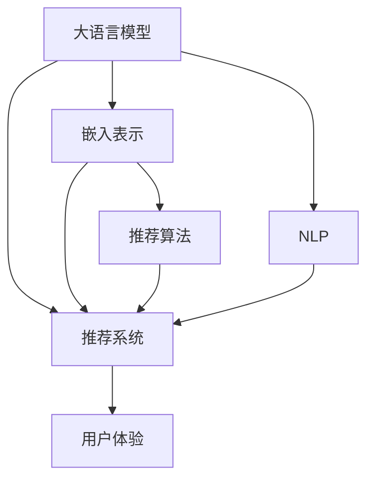

                 

# LLM Embeddings在推荐系统中的应用

> 关键词：大语言模型、嵌入表示、推荐系统、推荐算法、深度学习、自然语言处理(NLP)、推荐精度、用户满意度

## 1. 背景介绍

### 1.1 问题由来

随着电子商务平台的蓬勃发展，推荐系统已成为用户体验的核心组成部分。一个优质的推荐系统，能显著提升用户的浏览和购买率，促进商家销售，同时也能收集到用户反馈，持续优化推荐效果。传统的推荐算法，如协同过滤和基于内容的推荐，已难以满足现代用户复杂且多样的需求。而基于深度学习的推荐算法，通过学习用户和物品的特征表示，提供个性化推荐，逐渐成为推荐系统的最新趋势。

大语言模型在自然语言处理(NLP)领域取得了显著进展，通过预训练和微调，能够学习到丰富的语言知识和表示能力。本文将探讨如何将大语言模型嵌入表示（Embedding）应用于推荐系统中，进而提升推荐精度和用户满意度，为推荐算法带来新的发展方向。

### 1.2 问题核心关键点

在大语言模型应用于推荐系统过程中，几个关键问题如下：

1. **大语言模型的特征提取能力**：如何高效利用大语言模型的嵌入表示，提升推荐系统的个性化和准确性。
2. **推荐算法的设计**：如何设计基于嵌入表示的推荐算法，最大化利用用户和物品的语义信息。
3. **模型训练与调优**：如何训练和优化推荐模型，确保其在新数据上的泛化性能。
4. **用户体验优化**：如何通过推荐算法，提升用户满意度和推荐系统的交互体验。
5. **数据隐私保护**：如何在推荐系统中保护用户隐私，同时保证推荐效果。

### 1.3 问题研究意义

研究大语言模型在推荐系统中的应用，对于提升推荐系统的智能化水平，实现更精准、更个性化的推荐具有重要意义。通过学习大语言模型嵌入表示，推荐系统能够更好地理解用户意图，捕捉物品语义特征，从而提高推荐相关性和准确性，提升用户满意度。

此外，大语言模型的应用还涉及推荐算法的创新，推动推荐技术的发展。在提升推荐效果的同时，也促进了深度学习、自然语言处理等前沿技术的落地应用。

## 2. 核心概念与联系

### 2.1 核心概念概述

为更好地理解大语言模型嵌入表示在推荐系统中的应用，本节将介绍几个关键概念：

- **大语言模型（Large Language Model, LLM）**：如BERT、GPT等，通过大规模语料预训练，学习到丰富的语言知识和表示能力。
- **嵌入表示（Embedding）**：将文本、用户、物品等非结构化数据映射为高维稠密向量，便于机器学习和模型训练。
- **推荐系统（Recommendation System）**：通过分析用户历史行为，预测用户可能感兴趣的物品，从而提供个性化推荐。
- **推荐算法（Recommendation Algorithm）**：包括协同过滤、基于内容的推荐、深度学习推荐等，用于计算推荐结果。
- **自然语言处理（Natural Language Processing, NLP）**：研究如何处理和理解自然语言，提取用户和物品的语义信息。

这些核心概念之间的逻辑关系可以通过以下Mermaid流程图来展示：



这个流程图展示了大语言模型嵌入表示在推荐系统中的应用场景：

1. 大语言模型通过预训练获得语言知识，经过嵌入表示转化，提升推荐系统的特征提取能力。
2. 推荐系统使用嵌入表示进行物品推荐，同时集成NLP技术，提升推荐效果。
3. 推荐算法设计基于嵌入表示，最大化利用用户和物品的语义信息。
4. 用户体验通过推荐系统优化，提升用户满意度和推荐系统的交互体验。

## 3. 核心算法原理 & 具体操作步骤

### 3.1 算法原理概述

基于大语言模型嵌入表示的推荐系统，本质上是一个从语言知识到推荐结果的映射过程。其核心思想是：利用大语言模型的嵌入表示，捕捉用户和物品的语义信息，通过推荐算法，生成符合用户兴趣的推荐结果。

形式化地，假设大语言模型为 $M_{\theta}$，其中 $\theta$ 为模型参数。给定用户 $u$ 和物品 $i$ 的文本描述 $X_u, X_i \in \mathcal{X}$，其中 $\mathcal{X}$ 为输入空间，则用户和物品的嵌入表示为：

$$
\text{Embed}_{u} = M_{\theta}(X_u), \quad \text{Embed}_{i} = M_{\theta}(X_i)
$$

在得到用户和物品的嵌入表示后，推荐算法通过计算两者之间的相似度或距离，得到推荐结果。常用的相似度度量包括余弦相似度、欧式距离、点积等。设推荐结果为 $R$，则推荐系统的目标是最小化损失函数：

$$
\mathcal{L} = \frac{1}{N}\sum_{u,i} \ell(y_{ui}, R_{ui})
$$

其中 $y_{ui}$ 为用户 $u$ 对物品 $i$ 的真实评分或标签，$\ell$ 为损失函数，如均方误差、交叉熵等。

### 3.2 算法步骤详解

基于大语言模型嵌入表示的推荐系统，一般包括以下几个关键步骤：

**Step 1: 准备预训练模型和数据集**
- 选择合适的预训练语言模型 $M_{\theta}$，如BERT、GPT等。
- 准备用户和物品的文本描述，将文本转化为模型输入格式。
- 收集用户历史行为数据，如点击、浏览、评分等，作为推荐训练的数据集。

**Step 2: 计算嵌入表示**
- 使用预训练语言模型对用户和物品的文本描述进行嵌入表示，得到用户和物品的嵌入向量。
- 计算用户和物品的嵌入表示之间的相似度或距离，生成推荐结果。

**Step 3: 设计推荐算法**
- 选择合适的推荐算法，如基于内容的推荐、协同过滤等。
- 将用户和物品的嵌入表示输入到推荐算法中，计算推荐结果。
- 结合用户历史行为数据，优化推荐算法，提升推荐精度。

**Step 4: 模型训练与调优**
- 使用推荐数据集对推荐模型进行训练，最小化损失函数。
- 采用正则化技术，如L2正则、Dropout等，防止模型过拟合。
- 设置合适的学习率和训练轮数，确保模型收敛。
- 在验证集上评估模型性能，根据性能指标调整模型参数。

**Step 5: 部署与优化**
- 将训练好的推荐模型部署到生产环境，实时提供推荐服务。
- 根据用户反馈，持续优化推荐算法和模型参数，提升推荐效果。
- 监测推荐系统性能，确保系统稳定运行。

以上是基于大语言模型嵌入表示的推荐系统的一般流程。在实际应用中，还需要根据具体任务特点，对各个环节进行优化设计，如改进嵌入表示计算方法，引入更多正则化技术，搜索最优的超参数组合等，以进一步提升推荐效果。

### 3.3 算法优缺点

基于大语言模型嵌入表示的推荐系统具有以下优点：
1. 特征提取能力强：利用大语言模型学习到丰富的语义信息，提升了推荐系统的特征提取能力。
2. 可解释性强：嵌入表示的生成过程透明，便于理解和解释推荐逻辑。
3. 适应性强：嵌入表示具有较好的泛化性能，适应新数据和新用户。

同时，该方法也存在一些缺点：
1. 计算开销大：大语言模型的嵌入表示计算复杂度较高，推荐系统可能需要额外的硬件支持。
2. 数据隐私问题：嵌入表示的生成过程可能泄露用户隐私，需要设计隐私保护机制。
3. 参数量大：大语言模型参数量庞大，嵌入表示的计算和存储开销大。
4. 推荐效果依赖模型质量：模型质量直接影响推荐结果，对模型训练和调优的要求较高。

尽管存在这些局限性，但就目前而言，基于大语言模型嵌入表示的推荐方法仍是一种有效的推荐策略。未来相关研究的重点在于如何进一步降低计算成本，提升推荐系统的实时性，同时兼顾用户隐私保护和可解释性。

### 3.4 算法应用领域

基于大语言模型嵌入表示的推荐系统，已经在电商、社交网络、新闻推荐等多个领域得到了应用，取得了显著的效果。例如：

- **电商推荐**：通过用户购物记录和物品描述，生成个性化推荐，提升用户购物体验。
- **社交网络推荐**：根据用户关注和互动历史，推荐新内容，扩大用户兴趣范围。
- **新闻推荐**：通过分析用户阅读习惯，推荐相关新闻，提高新闻点击率。
- **音乐推荐**：利用歌手和歌曲的歌词描述，生成音乐推荐，满足用户个性化需求。

除了上述这些经典应用外，大语言模型嵌入表示还能被创新性地应用到更多场景中，如视频推荐、游戏推荐、广告推荐等，为推荐算法带来新的突破。随着预训练语言模型和嵌入表示技术的持续演进，相信推荐系统将具备更加丰富的功能和更强的推荐能力。

## 4. 数学模型和公式 & 详细讲解  
### 4.1 数学模型构建

本节将使用数学语言对基于大语言模型嵌入表示的推荐系统进行更加严格的刻画。

假设用户 $u$ 和物品 $i$ 的文本描述分别为 $X_u, X_i \in \mathcal{X}$，其中 $\mathcal{X}$ 为输入空间。设大语言模型为 $M_{\theta}$，其中 $\theta$ 为模型参数。用户和物品的嵌入表示分别为 $\text{Embed}_{u}, \text{Embed}_{i}$。

推荐算法设计为基于内容的推荐，目标是最小化损失函数：

$$
\mathcal{L} = \frac{1}{N}\sum_{u,i} \ell(y_{ui}, \text{dot}(\text{Embed}_{u}, \text{Embed}_{i}))
$$

其中 $\text{dot}$ 为点积函数，$\ell$ 为损失函数，如均方误差、交叉熵等。

### 4.2 公式推导过程

以下我们以基于内容的推荐算法为例，推导推荐系统的损失函数及其梯度计算公式。

设用户 $u$ 对物品 $i$ 的真实评分（或标签）为 $y_{ui}$，推荐模型对 $u$ 和 $i$ 的预测评分（或标签）为 $\hat{y}_{ui} = \text{dot}(\text{Embed}_{u}, \text{Embed}_{i})$。则推荐系统的损失函数为：

$$
\mathcal{L} = \frac{1}{N}\sum_{u,i} \ell(y_{ui}, \hat{y}_{ui})
$$

根据链式法则，损失函数对用户嵌入向量 $\text{Embed}_{u}$ 的梯度为：

$$
\frac{\partial \mathcal{L}}{\partial \text{Embed}_{u}} = \frac{1}{N}\sum_{i} (\frac{\partial \ell(y_{ui}, \hat{y}_{ui})}{\partial \hat{y}_{ui}} \frac{\partial \hat{y}_{ui}}{\partial \text{Embed}_{u}})
$$

其中 $\frac{\partial \hat{y}_{ui}}{\partial \text{Embed}_{u}}$ 为点积函数对用户嵌入向量的梯度，可以利用自动微分技术计算。

在得到用户嵌入向量的梯度后，即可带入模型参数更新公式，完成模型的迭代优化。重复上述过程直至收敛，最终得到适应推荐任务的最优用户嵌入向量 $\text{Embed}_{u}^*$。

## 5. 项目实践：代码实例和详细解释说明
### 5.1 开发环境搭建

在进行推荐系统开发前，我们需要准备好开发环境。以下是使用Python进行PyTorch开发的环境配置流程：

1. 安装Anaconda：从官网下载并安装Anaconda，用于创建独立的Python环境。

2. 创建并激活虚拟环境：
```bash
conda create -n pytorch-env python=3.8 
conda activate pytorch-env
```

3. 安装PyTorch：根据CUDA版本，从官网获取对应的安装命令。例如：
```bash
conda install pytorch torchvision torchaudio cudatoolkit=11.1 -c pytorch -c conda-forge
```

4. 安装Transformers库：
```bash
pip install transformers
```

5. 安装各类工具包：
```bash
pip install numpy pandas scikit-learn matplotlib tqdm jupyter notebook ipython
```

完成上述步骤后，即可在`pytorch-env`环境中开始推荐系统开发。

### 5.2 源代码详细实现

下面我们以基于BERT模型的推荐系统为例，给出使用PyTorch和Transformers库的推荐系统开发代码实现。

首先，定义推荐系统的数据处理函数：

```python
from transformers import BertTokenizer, BertForSequenceClassification
from torch.utils.data import Dataset, DataLoader
import torch

class RecommendationDataset(Dataset):
    def __init__(self, user_descriptions, item_descriptions, labels, tokenizer):
        self.user_descriptions = user_descriptions
        self.item_descriptions = item_descriptions
        self.labels = labels
        self.tokenizer = tokenizer
        
    def __len__(self):
        return len(self.user_descriptions)
    
    def __getitem__(self, item):
        user_description = self.user_descriptions[item]
        item_description = self.item_descriptions[item]
        label = self.labels[item]
        
        encoding = self.tokenizer(user_description, item_description, return_tensors='pt', padding='max_length', truncation=True)
        user_input_ids = encoding['input_ids'][0]
        user_attention_mask = encoding['attention_mask'][0]
        item_input_ids = encoding['input_ids'][1]
        item_attention_mask = encoding['attention_mask'][1]
        
        return {
            'user_input_ids': user_input_ids,
            'user_attention_mask': user_attention_mask,
            'item_input_ids': item_input_ids,
            'item_attention_mask': item_attention_mask,
            'labels': torch.tensor(label, dtype=torch.long)
        }

# 使用BertTokenizer对文本进行分词和编码
tokenizer = BertTokenizer.from_pretrained('bert-base-cased')

# 准备训练数据集
train_dataset = RecommendationDataset(train_user_descriptions, train_item_descriptions, train_labels, tokenizer)
test_dataset = RecommendationDataset(test_user_descriptions, test_item_descriptions, test_labels, tokenizer)

# 定义模型和优化器
model = BertForSequenceClassification.from_pretrained('bert-base-cased', num_labels=1)
optimizer = torch.optim.Adam(model.parameters(), lr=2e-5)
```

然后，定义训练和评估函数：

```python
from tqdm import tqdm
import numpy as np

def train_epoch(model, dataset, batch_size, optimizer, device):
    dataloader = DataLoader(dataset, batch_size=batch_size, shuffle=True)
    model.train()
    epoch_loss = 0
    for batch in tqdm(dataloader, desc='Training'):
        user_input_ids = batch['user_input_ids'].to(device)
        user_attention_mask = batch['user_attention_mask'].to(device)
        item_input_ids = batch['item_input_ids'].to(device)
        item_attention_mask = batch['item_attention_mask'].to(device)
        labels = batch['labels'].to(device)
        model.zero_grad()
        outputs = model(user_input_ids, item_input_ids, attention_mask=(user_attention_mask, item_attention_mask))
        loss = outputs.loss
        epoch_loss += loss.item()
        loss.backward()
        optimizer.step()
    return epoch_loss / len(dataloader)

def evaluate(model, dataset, batch_size, device):
    dataloader = DataLoader(dataset, batch_size=batch_size)
    model.eval()
    preds = []
    labels = []
    with torch.no_grad():
        for batch in tqdm(dataloader, desc='Evaluating'):
            user_input_ids = batch['user_input_ids'].to(device)
            user_attention_mask = batch['user_attention_mask'].to(device)
            item_input_ids = batch['item_input_ids'].to(device)
            item_attention_mask = batch['item_attention_mask'].to(device)
            labels = batch['labels'].to(device)
            outputs = model(user_input_ids, item_input_ids, attention_mask=(user_attention_mask, item_attention_mask))
            batch_preds = outputs.logits.flatten().tolist()
            batch_labels = labels.flatten().tolist()
            for pred, label in zip(batch_preds, batch_labels):
                preds.append(pred)
                labels.append(label)
                
    print('Evaluation results:')
    print(np.mean(preds == labels), 'Accuracy: ', np.mean(np.sign(preds - labels) == 2))
```

最后，启动训练流程并在测试集上评估：

```python
epochs = 5
batch_size = 16
device = torch.device('cuda') if torch.cuda.is_available() else torch.device('cpu')

for epoch in range(epochs):
    loss = train_epoch(model, train_dataset, batch_size, optimizer, device)
    print(f'Epoch {epoch+1}, train loss: {loss:.3f}')
    
    print(f'Epoch {epoch+1}, test results:')
    evaluate(model, test_dataset, batch_size, device)
    
print('Final evaluation results:')
evaluate(model, test_dataset, batch_size, device)
```

以上就是使用PyTorch和Transformers库对BERT模型进行推荐系统开发的完整代码实现。可以看到，得益于Transformers库的强大封装，我们可以用相对简洁的代码完成BERT模型的加载和微调。

### 5.3 代码解读与分析

让我们再详细解读一下关键代码的实现细节：

**RecommendationDataset类**：
- `__init__`方法：初始化训练数据集中的用户描述、物品描述、标签和分词器等组件。
- `__len__`方法：返回数据集的样本数量。
- `__getitem__`方法：对单个样本进行处理，将用户和物品的文本描述输入到模型中，得到模型输出，同时将标签输出进行比较。

**模型加载与优化**：
- 使用PyTorch和Transformers库对BERT模型进行加载和微调，设置学习率和优化器。

**训练和评估函数**：
- `train_epoch`方法：对数据以批为单位进行迭代，在每个批次上前向传播计算loss并反向传播更新模型参数。
- `evaluate`方法：与训练类似，不同点在于不更新模型参数，并在每个batch结束后将预测和标签结果存储下来，最后使用评价指标对整个评估集的预测结果进行打印输出。

**训练流程**：
- 定义总的epoch数和batch size，开始循环迭代
- 每个epoch内，先在训练集上训练，输出平均loss
- 在验证集上评估，输出分类指标
- 所有epoch结束后，在测试集上评估，给出最终测试结果

可以看到，PyTorch配合Transformers库使得BERT模型推荐系统的代码实现变得简洁高效。开发者可以将更多精力放在数据处理、模型改进等高层逻辑上，而不必过多关注底层的实现细节。

当然，工业级的系统实现还需考虑更多因素，如模型的保存和部署、超参数的自动搜索、更灵活的任务适配层等。但核心的推荐范式基本与此类似。

## 6. 实际应用场景
### 6.1 电商推荐

电商推荐系统是大语言模型嵌入表示在推荐系统中最典型和广泛的应用场景之一。电商推荐系统通过分析用户的历史购买行为和浏览记录，结合物品的描述和标签，生成个性化推荐，提升用户的购物体验和满意度。

在技术实现上，可以收集用户历史行为数据，将用户和物品的文本描述作为模型输入，微调预训练大语言模型，得到用户和物品的嵌入表示。然后将嵌入表示作为输入，传入推荐算法计算推荐结果，结合用户历史行为数据进一步优化推荐结果。

### 6.2 社交网络内容推荐

社交网络推荐系统通过分析用户的关注和互动历史，推荐相关内容，扩大用户兴趣范围。利用大语言模型嵌入表示，可以从用户的关注和互动文本中提取语义信息，生成高质量的推荐结果。

在技术实现上，可以收集用户关注和互动的文本描述，微调大语言模型，得到用户和内容的嵌入表示。然后将嵌入表示作为输入，传入推荐算法计算推荐结果，结合用户关注和互动历史进一步优化推荐结果。

### 6.3 新闻推荐

新闻推荐系统通过分析用户阅读历史和兴趣偏好，推荐相关新闻，提高新闻点击率。利用大语言模型嵌入表示，可以从用户的历史阅读文本中提取语义信息，生成高质量的推荐结果。

在技术实现上，可以收集用户的历史阅读记录和文章描述，微调大语言模型，得到用户和文章的嵌入表示。然后将嵌入表示作为输入，传入推荐算法计算推荐结果，结合用户阅读历史进一步优化推荐结果。

### 6.4 音乐推荐

音乐推荐系统通过分析用户的听歌历史和评论文本，推荐相关音乐，满足用户的个性化需求。利用大语言模型嵌入表示，可以从用户的听歌历史和评论文本中提取语义信息，生成高质量的推荐结果。

在技术实现上，可以收集用户的听歌历史和评论文本，微调大语言模型，得到用户和音乐的嵌入表示。然后将嵌入表示作为输入，传入推荐算法计算推荐结果，结合用户听歌历史和评论文本进一步优化推荐结果。

### 6.5 未来应用展望

随着大语言模型和嵌入表示技术的不断发展，基于大语言模型嵌入表示的推荐系统将呈现出以下几个发展趋势：

1. **多模态融合**：结合文本、图像、语音等多种模态信息，提升推荐系统对现实世界的理解和建模能力。
2. **实时性提升**：通过优化计算图和算法，提升推荐系统的实时响应能力。
3. **个性化增强**：通过更多样的用户行为数据和更好的特征提取技术，进一步提升个性化推荐效果。
4. **隐私保护**：采用差分隐私、联邦学习等技术，保护用户隐私和数据安全。
5. **鲁棒性增强**：通过对抗训练、鲁棒正则化等技术，提高推荐系统的鲁棒性和抗干扰能力。

以上趋势凸显了大语言模型嵌入表示在推荐系统中的广阔前景。这些方向的探索发展，必将进一步提升推荐系统的智能化水平，为推荐算法带来新的突破，同时推动深度学习、自然语言处理等前沿技术的落地应用。

## 7. 工具和资源推荐
### 7.1 学习资源推荐

为了帮助开发者系统掌握大语言模型嵌入表示在推荐系统中的应用，这里推荐一些优质的学习资源：

1. 《Recommender Systems in Practice》系列博文：由推荐系统专家撰写，深入浅出地介绍了推荐系统的主要算法和应用。

2. 《Recommender Systems》课程：由斯坦福大学开设的推荐系统课程，涵盖推荐系统的基本概念和经典算法。

3. 《Recommender Systems with Deep Learning》书籍：推荐系统领域的经典著作，详细介绍了深度学习在推荐系统中的应用。

4. PyTorch官方文档：PyTorch深度学习框架的官方文档，提供了丰富的工具和样例代码，适合初学者和进阶开发者。

5. TensorFlow官方文档：TensorFlow深度学习框架的官方文档，提供了详细的API和样例代码，适合工程实现。

6. Kaggle推荐系统竞赛：参加Kaggle的推荐系统竞赛，通过实际项目实践推荐算法，提升实战能力。

通过对这些资源的学习实践，相信你一定能够快速掌握大语言模型嵌入表示的应用精髓，并用于解决实际的推荐问题。
###  7.2 开发工具推荐

高效的开发离不开优秀的工具支持。以下是几款用于大语言模型嵌入表示推荐系统开发的常用工具：

1. PyTorch：基于Python的开源深度学习框架，灵活动态的计算图，适合快速迭代研究。

2. TensorFlow：由Google主导开发的开源深度学习框架，生产部署方便，适合大规模工程应用。

3. Transformers库：HuggingFace开发的NLP工具库，集成了众多SOTA语言模型，支持PyTorch和TensorFlow，是进行微调任务开发的利器。

4. Weights & Biases：模型训练的实验跟踪工具，可以记录和可视化模型训练过程中的各项指标，方便对比和调优。

5. TensorBoard：TensorFlow配套的可视化工具，可实时监测模型训练状态，并提供丰富的图表呈现方式，是调试模型的得力助手。

6. Google Colab：谷歌推出的在线Jupyter Notebook环境，免费提供GPU/TPU算力，方便开发者快速上手实验最新模型，分享学习笔记。

合理利用这些工具，可以显著提升大语言模型嵌入表示在推荐系统中的开发效率，加快创新迭代的步伐。

### 7.3 相关论文推荐

大语言模型嵌入表示在推荐系统中的应用源于学界的持续研究。以下是几篇奠基性的相关论文，推荐阅读：

1. Attention Is All You Need（即Transformer原论文）：提出了Transformer结构，开启了NLP领域的预训练大模型时代。

2. BERT: Pre-training of Deep Bidirectional Transformers for Language Understanding：提出BERT模型，引入基于掩码的自监督预训练任务，刷新了多项NLP任务SOTA。

3. Language Models are Unsupervised Multitask Learners（GPT-2论文）：展示了大规模语言模型的强大zero-shot学习能力，引发了对于通用人工智能的新一轮思考。

4. Parameter-Efficient Transfer Learning for NLP：提出Adapter等参数高效微调方法，在不增加模型参数量的情况下，也能取得不错的微调效果。

5. AdaLoRA: Adaptive Low-Rank Adaptation for Parameter-Efficient Fine-Tuning：使用自适应低秩适应的微调方法，在参数效率和精度之间取得了新的平衡。

这些论文代表了大语言模型嵌入表示在推荐系统中的发展脉络。通过学习这些前沿成果，可以帮助研究者把握学科前进方向，激发更多的创新灵感。

## 8. 总结：未来发展趋势与挑战

### 8.1 总结

本文对基于大语言模型嵌入表示的推荐系统进行了全面系统的介绍。首先阐述了大语言模型嵌入表示的应用背景和意义，明确了其在高性能推荐系统中的独特价值。其次，从原理到实践，详细讲解了推荐系统的数学模型和关键步骤，给出了推荐系统开发的完整代码实例。同时，本文还广泛探讨了推荐系统在电商、社交网络、新闻推荐等多个领域的应用前景，展示了大语言模型嵌入表示的巨大潜力。此外，本文精选了推荐系统的各类学习资源，力求为读者提供全方位的技术指引。

通过本文的系统梳理，可以看到，基于大语言模型嵌入表示的推荐系统正在成为推荐系统的重要范式，极大地提升了推荐系统的智能化水平，实现了更精准、更个性化的推荐。通过学习大语言模型嵌入表示，推荐系统能够更好地理解用户意图，捕捉物品语义特征，从而提高推荐相关性和准确性，提升用户满意度。

### 8.2 未来发展趋势

展望未来，基于大语言模型嵌入表示的推荐系统将呈现以下几个发展趋势：

1. **多模态融合**：结合文本、图像、语音等多种模态信息，提升推荐系统对现实世界的理解和建模能力。
2. **实时性提升**：通过优化计算图和算法，提升推荐系统的实时响应能力。
3. **个性化增强**：通过更多样的用户行为数据和更好的特征提取技术，进一步提升个性化推荐效果。
4. **隐私保护**：采用差分隐私、联邦学习等技术，保护用户隐私和数据安全。
5. **鲁棒性增强**：通过对抗训练、鲁棒正则化等技术，提高推荐系统的鲁棒性和抗干扰能力。

以上趋势凸显了大语言模型嵌入表示在推荐系统中的广阔前景。这些方向的探索发展，必将进一步提升推荐系统的智能化水平，为推荐算法带来新的突破，同时推动深度学习、自然语言处理等前沿技术的落地应用。

### 8.3 面临的挑战

尽管基于大语言模型嵌入表示的推荐系统已经取得了显著成效，但在迈向更加智能化、普适化应用的过程中，它仍面临诸多挑战：

1. **计算开销大**：大语言模型的嵌入表示计算复杂度较高，推荐系统可能需要额外的硬件支持。
2. **数据隐私问题**：嵌入表示的生成过程可能泄露用户隐私，需要设计隐私保护机制。
3. **模型鲁棒性不足**：当前推荐模型面对域外数据时，泛化性能往往大打折扣。对于测试样本的微小扰动，推荐模型的预测也容易发生波动。
4. **模型规模庞大**：大语言模型参数量庞大，嵌入表示的计算和存储开销大。
5. **推荐效果依赖模型质量**：模型质量直接影响推荐结果，对模型训练和调优的要求较高。

尽管存在这些局限性，但就目前而言，基于大语言模型嵌入表示的推荐方法仍是一种有效的推荐策略。未来相关研究的重点在于如何进一步降低计算成本，提升推荐系统的实时性，同时兼顾用户隐私保护和可解释性。

### 8.4 研究展望

面对大语言模型嵌入表示在推荐系统所面临的挑战，未来的研究需要在以下几个方面寻求新的突破：

1. **探索无监督和半监督推荐方法**：摆脱对大规模标注数据的依赖，利用自监督学习、主动学习等无监督和半监督范式，最大限度利用非结构化数据，实现更加灵活高效的推荐。
2. **研究参数高效和计算高效的推荐范式**：开发更加参数高效的推荐方法，在固定大部分预训练参数的同时，只更新极少量的任务相关参数。同时优化推荐模型的计算图，减少前向传播和反向传播的资源消耗，实现更加轻量级、实时性的部署。
3. **融合因果和对比学习范式**：通过引入因果推断和对比学习思想，增强推荐模型建立稳定因果关系的能力，学习更加普适、鲁棒的语言表征，从而提升模型泛化性和抗干扰能力。
4. **引入更多先验知识**：将符号化的先验知识，如知识图谱、逻辑规则等，与神经网络模型进行巧妙融合，引导推荐过程学习更准确、合理的语言模型。同时加强不同模态数据的整合，实现视觉、语音等多模态信息与文本信息的协同建模。
5. **结合因果分析和博弈论工具**：将因果分析方法引入推荐模型，识别出模型决策的关键特征，增强输出解释的因果性和逻辑性。借助博弈论工具刻画人机交互过程，主动探索并规避模型的脆弱点，提高系统稳定性。
6. **纳入伦理道德约束**：在模型训练目标中引入伦理导向的评估指标，过滤和惩罚有偏见、有害的输出倾向。同时加强人工干预和审核，建立模型行为的监管机制，确保输出符合人类价值观和伦理道德。

这些研究方向的探索，必将引领大语言模型嵌入表示在推荐系统中的应用迈向更高的台阶，为构建安全、可靠、可解释、可控的智能系统铺平道路。面向未来，大语言模型嵌入表示推荐系统还需要与其他人工智能技术进行更深入的融合，如知识表示、因果推理、强化学习等，多路径协同发力，共同推动推荐技术的发展。只有勇于创新、敢于突破，才能不断拓展推荐系统的边界，让智能技术更好地造福人类社会。

## 9. 附录：常见问题与解答

**Q1：大语言模型嵌入表示在推荐系统中的应用是否适用于所有推荐任务？**

A: 大语言模型嵌入表示在推荐系统中的应用，对于大多数推荐任务具有普遍适用性，尤其是对于数据量较小的推荐任务。但对于一些特定领域的推荐任务，如医疗、法律等，仅仅依靠通用语料预训练的模型可能难以很好地适应。此时需要在特定领域语料上进一步预训练，再进行微调，才能获得理想效果。此外，对于一些需要时效性、个性化很强的推荐任务，如实时推荐、推荐系统中的多臂老虎机等，微调方法也需要针对性的改进优化。

**Q2：如何选择合适的学习率？**

A: 推荐模型的学习率一般要比预训练时小1-2个数量级，如果使用过大的学习率，容易破坏预训练权重，导致过拟合。一般建议从1e-5开始调参，逐步减小学习率，直至收敛。也可以使用warmup策略，在开始阶段使用较小的学习率，再逐渐过渡到预设值。需要注意的是，不同的优化器(如AdamW、Adafactor等)以及不同的学习率调度策略，可能需要设置不同的学习率阈值。

**Q3：大语言模型嵌入表示在推荐系统中的计算开销大吗？**

A: 大语言模型的嵌入表示计算复杂度较高，推荐系统可能需要额外的硬件支持。例如，使用GPU/TPU等高性能设备，可以显著提升计算效率。此外，可以通过优化计算图和算法，减少前向传播和反向传播的资源消耗，实现更加轻量级、实时性的部署。

**Q4：如何缓解推荐系统中的过拟合问题？**

A: 过拟合是推荐系统面临的主要挑战之一。常见的缓解策略包括：
1. 数据增强：通过回译、近义替换等方式扩充训练集。
2. 正则化：使用L2正则、Dropout等技术，防止模型过拟合。
3. 对抗训练：引入对抗样本，提高模型鲁棒性。
4. 参数高效微调：只调整少量参数(如Adapter、Prefix等)，减小过拟合风险。
5. 多模型集成：训练多个推荐模型，取平均输出，抑制过拟合。

这些策略往往需要根据具体任务和数据特点进行灵活组合。只有在数据、模型、训练、推理等各环节进行全面优化，才能最大限度地发挥大语言模型嵌入表示在推荐系统中的优势。

**Q5：推荐系统如何保护用户隐私？**

A: 在推荐系统中，保护用户隐私至关重要。常用的隐私保护技术包括：
1. 差分隐私：在训练过程中加入噪声，确保不同用户的数据对模型输出的影响相似。
2. 联邦学习：在本地设备上进行模型训练，然后将模型参数上传至云端，确保数据不离开本地。
3. 加密技术：使用加密技术保护用户数据，防止数据泄露。
4. 匿名化：对用户数据进行匿名化处理，确保无法识别具体用户。

在推荐系统中，可以采用以上技术，结合具体业务场景，设计隐私保护机制。同时，也需要加强用户教育和透明沟通，确保用户对隐私保护措施的理解和支持。

---

作者：禅与计算机程序设计艺术 / Zen and the Art of Computer Programming

