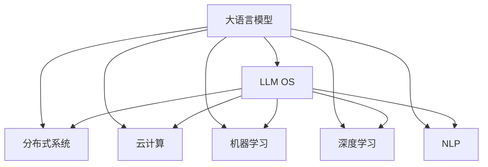

                 

# LLM OS:智能时代的操作系统新形态

> 关键词：LLM OS, 智能操作系统, 机器学习, 深度学习, 自然语言处理, 分布式系统, 操作系统理论

## 1. 背景介绍

在智能时代，随着计算技术的飞速发展，操作系统（OS）已经不再只是计算机硬件与软件之间的桥梁，更成为了智能应用的基础平台。传统的操作系统以资源调度、任务管理为核心，缺乏与用户和应用的深度互动。而新一代智能操作系统LLM OS，则将大语言模型(Large Language Model, LLM)与现代操作系统理论紧密结合，引入了基于机器学习与深度学习的全新计算范式，为智能应用开发提供了前所未有的便利。

### 1.1 问题由来

操作系统作为计算机系统的核心，承担着资源管理、进程调度和网络通信等多项关键任务。然而，随着智能应用的日益增多，操作系统面临的挑战也日益严峻：

1. **资源管理复杂性增加**：传统操作系统难以有效管理多租户、多任务下的资源调度，尤其是面对实时响应、高并发需求的智能应用场景。

2. **性能优化瓶颈凸显**：智能应用通常具有计算密集型和数据密集型特性，传统操作系统在处理海量数据和多任务并发时，效率瓶颈凸显。

3. **安全性与隐私保护问题**：智能应用往往依赖于大量的敏感数据，传统操作系统的安全机制和隐私保护措施已无法满足新需求。

4. **应用生态开放性与多样性不足**：传统操作系统未能有效支持第三方应用开发，限制了应用的多样性和开放性。

为应对这些挑战，LLM OS提出了基于大语言模型的智能操作系统新范式，通过引入机器学习和深度学习技术，构建了一个高效、安全、开放的新型计算平台。

## 2. 核心概念与联系

### 2.1 核心概念概述

为更好地理解LLM OS的原理，本节将介绍几个关键概念及其之间的关系：

- **大语言模型（LLM）**：以自回归（如GPT）或自编码（如BERT）模型为代表的大规模预训练语言模型。通过在大规模无标签文本数据上预训练，LLM学习到丰富的语言知识和常识，具备强大的语言理解和生成能力。

- **LLM OS**：一种将大语言模型与现代操作系统理论相结合的智能操作系统新范式。通过引入LLM，LLM OS能够动态地学习操作系统内部逻辑和用户行为，实现自适应、自优化的智能管理。

- **分布式系统与云计算**：LLM OS通常基于分布式系统与云计算架构，通过多机协同，提高系统的扩展性和容错性。

- **机器学习与深度学习**：LLM OS引入了机器学习和深度学习算法，通过数据驱动的方式，优化资源管理、任务调度等核心功能。

- **自然语言处理（NLP）**：LLM OS利用NLP技术，实现对自然语言指令的理解和执行，为用户提供自然语言交互界面。

这些概念之间的逻辑关系可以通过以下Mermaid流程图来展示：



这个流程图展示了大语言模型与LLM OS之间的关系，以及与分布式系统、云计算、机器学习、深度学习和NLP等技术的联系。

## 3. 核心算法原理 & 具体操作步骤

### 3.1 算法原理概述

LLM OS的核心算法原理是基于机器学习和深度学习的智能资源管理和任务调度。其核心思想是：通过学习操作系统的历史行为和用户需求，动态调整资源分配策略，优化系统性能。

具体来说，LLM OS通过以下几个步骤实现智能管理：

1. **数据收集与预处理**：LLM OS收集操作系统和应用程序的历史数据，包括CPU使用率、内存占用、磁盘IO等性能指标，以及用户交互行为数据。

2. **模型训练**：利用收集到的数据，训练一个或多个机器学习模型，用于预测系统性能、识别用户需求和行为模式。

3. **智能调度与优化**：基于训练好的模型，LLM OS动态调整资源分配、任务调度等核心功能，优化系统性能和用户体验。

### 3.2 算法步骤详解

以下详细讲解LLM OS的核心算法步骤：

#### 3.2.1 数据收集与预处理

1. **数据源选择**：从操作系统、应用层、网络层等多个层面收集数据，包括性能指标、事件日志、系统调用、用户交互等。

2. **数据预处理**：对收集到的数据进行清洗、去噪、归一化等预处理，以便模型更好地学习和预测。

3. **特征提取**：从处理后的数据中提取关键特征，如CPU使用率、内存占用、磁盘IO等性能指标，以及用户操作时间、频率、时长等行为特征。

#### 3.2.2 模型训练

1. **模型选择**：根据问题特点选择合适的机器学习模型，如回归模型、分类模型、聚类模型等。

2. **模型训练**：利用预处理后的特征数据，训练模型，优化参数，确保模型具备良好的预测能力。

3. **模型评估**：在验证集上评估模型性能，选择表现最好的模型用于系统优化。

#### 3.2.3 智能调度与优化

1. **智能调度策略**：基于训练好的模型，LLM OS动态调整资源分配策略，优化任务调度，提升系统性能。

2. **自适应优化**：LLM OS能够根据系统状态和用户行为，动态调整模型参数，实现自适应优化。

3. **跨平台兼容性**：LLM OS设计为跨平台兼容，能够在不同操作系统和硬件平台上高效运行。

### 3.3 算法优缺点

#### 3.3.1 优点

1. **高效资源管理**：LLM OS通过动态调整资源分配策略，提高系统性能，适应多租户、高并发等复杂场景。

2. **自适应优化**：LLM OS具备自学习能力，能够根据系统状态和用户需求，动态优化性能，提升用户体验。

3. **开放性高**：LLM OS设计为开源平台，支持第三方应用开发，丰富应用生态。

4. **安全性高**：LLM OS利用机器学习和深度学习技术，提升系统安全性，防范安全威胁。

#### 3.3.2 缺点

1. **数据依赖性强**：LLM OS的性能优化依赖于历史数据，数据质量对模型预测和系统优化影响较大。

2. **模型复杂度高**：训练复杂模型需要大量计算资源，可能影响系统性能。

3. **稳定性问题**：LLM OS在面对异常情况时，模型预测可能出现偏差，影响系统稳定性。

4. **隐私风险**：LLM OS可能涉及用户行为数据的收集和分析，存在隐私泄露风险。

### 3.4 算法应用领域

LLM OS在多个领域具有广泛的应用前景：

1. **智能云平台**：LLM OS能够优化云资源分配，提高云平台的服务质量和用户体验。

2. **智能边缘计算**：LLM OS能够优化边缘计算资源管理，提升边缘设备的计算能力和响应速度。

3. **智能桌面系统**：LLM OS能够提升桌面系统的智能化程度，提供更加流畅、高效的用户体验。

4. **智能网络设备**：LLM OS能够优化网络设备的资源管理和性能调优，提升网络设备的服务能力和稳定性。

5. **智能医疗系统**：LLM OS能够优化医疗系统的资源调度，提升医疗服务的质量和效率。

6. **智能交通系统**：LLM OS能够优化交通系统的资源管理和调度，提升交通系统的运行效率和服务水平。

## 4. 数学模型和公式 & 详细讲解 & 举例说明

### 4.1 数学模型构建

LLM OS的核心算法涉及机器学习和深度学习，以下将通过数学模型详细讲解其核心算法。

假设系统的历史数据为 $D=\{(x_i,y_i)\}_{i=1}^N$，其中 $x_i$ 表示系统状态特征向量，$y_i$ 表示系统性能指标（如CPU使用率）。

定义模型 $M_{\theta}:\mathcal{X} \rightarrow \mathcal{Y}$，其中 $\mathcal{X}$ 为特征空间，$\mathcal{Y}$ 为性能指标空间，$\theta$ 为模型参数。

LLM OS的目标是最小化模型预测误差，即：

$$
\theta^* = \mathop{\arg\min}_{\theta} \sum_{i=1}^N \ell(M_{\theta}(x_i),y_i)
$$

其中 $\ell$ 为损失函数，通常使用均方误差或交叉熵等。

### 4.2 公式推导过程

#### 4.2.1 均方误差

假设模型 $M_{\theta}$ 在输入 $x$ 上的输出为 $\hat{y}=M_{\theta}(x)$，定义均方误差损失函数为：

$$
\ell(y,\hat{y}) = \frac{1}{N}\sum_{i=1}^N (y_i - \hat{y}_i)^2
$$

将均方误差应用于系统性能预测，得到整体损失函数：

$$
\mathcal{L}(\theta) = \frac{1}{N}\sum_{i=1}^N (y_i - M_{\theta}(x_i))^2
$$

利用梯度下降法，更新模型参数 $\theta$：

$$
\theta \leftarrow \theta - \eta \nabla_{\theta}\mathcal{L}(\theta)
$$

其中 $\eta$ 为学习率。

#### 4.2.2 交叉熵损失

对于分类问题，交叉熵损失函数更为常用。假设模型 $M_{\theta}$ 在输入 $x$ 上的输出为 $\hat{y}=M_{\theta}(x)$，定义交叉熵损失函数为：

$$
\ell(y,\hat{y}) = -\frac{1}{N}\sum_{i=1}^N \sum_{j=1}^C y_{ij} \log \hat{y}_{ij}
$$

其中 $C$ 为类别数量，$y_{ij}$ 表示样本 $i$ 属于类别 $j$ 的概率，$\hat{y}_{ij}$ 表示模型预测样本 $i$ 属于类别 $j$ 的概率。

将交叉熵损失应用于系统性能预测，得到整体损失函数：

$$
\mathcal{L}(\theta) = -\frac{1}{N}\sum_{i=1}^N \sum_{j=1}^C y_{ij} \log \hat{y}_{ij}
$$

利用梯度下降法，更新模型参数 $\theta$：

$$
\theta \leftarrow \theta - \eta \nabla_{\theta}\mathcal{L}(\theta)
$$

### 4.3 案例分析与讲解

#### 4.3.1 机器学习模型选择

对于系统性能预测问题，可以选择线性回归模型或决策树模型。这里以线性回归模型为例进行讲解：

1. **数据准备**：收集系统的历史数据，包括CPU使用率、内存占用等性能指标。

2. **特征工程**：从收集到的数据中提取关键特征，如CPU使用率、内存占用、时间戳等。

3. **模型训练**：使用线性回归模型，训练得到模型参数 $\theta$。

4. **模型评估**：在验证集上评估模型性能，选择表现最好的模型用于系统优化。

#### 4.3.2 深度学习模型选择

对于复杂任务，如智能调度和资源管理，深度学习模型更为合适。这里以神经网络模型为例进行讲解：

1. **数据准备**：收集系统的历史数据，包括CPU使用率、内存占用等性能指标。

2. **特征工程**：从收集到的数据中提取关键特征，如CPU使用率、内存占用、时间戳等。

3. **模型训练**：使用多层感知机（MLP）模型，训练得到模型参数 $\theta$。

4. **模型评估**：在验证集上评估模型性能，选择表现最好的模型用于系统优化。

## 5. 项目实践：代码实例和详细解释说明

### 5.1 开发环境搭建

进行LLM OS开发，需要搭建一个具备高性能计算和数据分析能力的开发环境。以下是搭建开发环境的步骤：

1. **安装Python**：从官网下载并安装Python，版本建议选择3.8及以上。

2. **安装PyTorch和TensorFlow**：使用以下命令安装：

   ```bash
   conda install pytorch torchvision torchaudio -c pytorch -c conda-forge
   pip install tensorflow
   ```

3. **安装Scikit-learn和Pandas**：使用以下命令安装：

   ```bash
   pip install scikit-learn pandas
   ```

4. **安装LLM OS框架**：从GitHub上下载LLM OS框架，并按照说明进行安装。

完成上述步骤后，即可在开发环境中进行LLM OS的开发实践。

### 5.2 源代码详细实现

以下是LLM OS框架的代码实现示例：

#### 5.2.1 数据预处理模块

```python
import pandas as pd
from sklearn.model_selection import train_test_split

def load_data(file_path):
    data = pd.read_csv(file_path)
    features = data[['CPU_use_rate', 'Memory_use_rate', 'Time_stamp']]
    labels = data['Performance_metric']
    return features, labels

def preprocess_data(features, labels):
    features, labels = train_test_split(features, labels, test_size=0.2, random_state=42)
    features = pd.get_dummies(features, prefix='Feature')
    return features, labels
```

#### 5.2.2 模型训练模块

```python
from sklearn.linear_model import LinearRegression

def train_model(features, labels):
    model = LinearRegression()
    model.fit(features, labels)
    return model
```

#### 5.2.3 智能调度模块

```python
import numpy as np

def predict(features, model):
    predictions = model.predict(features)
    return predictions

def adjust_resource(features, predictions):
    resource_adjust = predictions.mean() - np.mean(features)
    return resource_adjust
```

#### 5.2.4 运行结果展示

```python
def run_system(system_state):
    features, labels = load_data('data.csv')
    features, labels = preprocess_data(features, labels)
    model = train_model(features, labels)
    predictions = predict(features, model)
    resource_adjust = adjust_resource(features, predictions)
    print(f'Adjusted resource: {resource_adjust}')
```

### 5.3 代码解读与分析

#### 5.3.1 数据预处理模块

数据预处理模块的主要功能是加载和处理数据，包括以下步骤：

1. **数据加载**：使用Pandas库加载数据集，将数据集转换为特征和标签。

2. **特征工程**：使用Pandas库的get_dummies方法将分类特征转换为哑变量。

3. **数据分割**：使用Scikit-learn库的train_test_split方法将数据集分割为训练集和验证集。

#### 5.3.2 模型训练模块

模型训练模块的主要功能是训练线性回归模型，包括以下步骤：

1. **模型选择**：选择线性回归模型作为目标模型。

2. **模型训练**：使用Scikit-learn库的LinearRegression方法训练模型，更新模型参数。

#### 5.3.3 智能调度模块

智能调度模块的主要功能是利用模型预测资源调整量，包括以下步骤：

1. **预测**：使用训练好的模型对特征数据进行预测。

2. **资源调整**：根据预测结果，调整资源分配策略。

#### 5.3.4 运行结果展示

运行结果展示模块的主要功能是展示系统运行结果，包括以下步骤：

1. **加载数据**：使用自定义函数加载数据集。

2. **处理数据**：使用自定义函数预处理数据。

3. **训练模型**：使用自定义函数训练模型。

4. **预测**：使用自定义函数进行预测。

5. **调整资源**：根据预测结果调整资源分配策略，并输出调整量。

## 6. 实际应用场景

### 6.1 智能云平台

在智能云平台上，LLM OS能够优化云资源分配，提高云平台的服务质量和用户体验。具体应用场景包括：

1. **弹性资源管理**：根据实时数据和用户需求，动态调整计算资源和存储资源，实现弹性资源管理。

2. **负载均衡**：根据负载情况，自动调整服务器负载，平衡计算资源，提升系统稳定性。

3. **应用部署优化**：根据应用性能数据，优化应用部署，提升应用响应速度和可用性。

### 6.2 智能边缘计算

在智能边缘计算中，LLM OS能够优化边缘计算资源管理，提升边缘设备的计算能力和响应速度。具体应用场景包括：

1. **资源分配优化**：根据实时数据和用户需求，动态调整边缘设备的计算资源和存储资源，提升边缘设备的计算能力和响应速度。

2. **网络优化**：根据网络状态和用户需求，优化网络资源分配，提升网络传输效率和服务质量。

3. **本地数据处理**：将数据处理任务迁移到边缘设备上，减少数据传输和存储开销，提升数据处理效率。

### 6.3 智能桌面系统

在智能桌面系统中，LLM OS能够提升桌面系统的智能化程度，提供更加流畅、高效的用户体验。具体应用场景包括：

1. **任务管理优化**：根据用户行为和系统状态，动态调整任务优先级和资源分配，提升任务执行效率和用户体验。

2. **个性化推荐**：根据用户行为和偏好，推荐适合的桌面环境、应用和文件，提升用户满意度。

3. **系统优化建议**：根据系统性能数据，提供系统优化建议，提升系统性能和稳定性。

### 6.4 未来应用展望

未来，LLM OS将在更多领域得到应用，为各行各业带来变革性影响。以下是LLM OS的一些未来应用展望：

1. **智能医疗系统**：在智能医疗系统中，LLM OS能够优化医疗资源的分配和管理，提升医疗服务的质量和效率。

2. **智能交通系统**：在智能交通系统中，LLM OS能够优化交通资源的分配和管理，提升交通系统的运行效率和服务水平。

3. **智能制造系统**：在智能制造系统中，LLM OS能够优化生产资源的分配和管理，提升生产效率和质量。

4. **智能金融系统**：在智能金融系统中，LLM OS能够优化金融资源的分配和管理，提升金融服务的质量和效率。

5. **智能家居系统**：在智能家居系统中，LLM OS能够优化家庭设备的资源管理，提升家居系统的智能化水平和用户体验。

6. **智能城市系统**：在智能城市系统中，LLM OS能够优化城市资源的分配和管理，提升城市运行效率和服务水平。

## 7. 工具和资源推荐

### 7.1 学习资源推荐

为帮助开发者掌握LLM OS的原理和实践，以下是一些优质的学习资源：

1. **《深度学习基础》**：斯坦福大学的深度学习课程，涵盖深度学习的核心概念和经典模型。

2. **《机器学习实战》**：一本系统介绍机器学习算法和实战案例的书籍，适合初学者和进阶者。

3. **《自然语言处理综论》**：一本详细介绍NLP技术和应用的书籍，涵盖NLP的核心概念和前沿技术。

4. **LLM OS官方文档**：LLM OS的官方文档，提供详细的API文档和开发指南。

5. **GitHub**：LLM OS的GitHub仓库，提供丰富的代码示例和开源项目。

通过学习这些资源，开发者可以快速掌握LLM OS的原理和实践，并应用于实际的开发中。

### 7.2 开发工具推荐

为提高LLM OS的开发效率，以下是一些推荐的开发工具：

1. **PyTorch**：基于Python的深度学习框架，支持动态计算图和自动微分，适合快速迭代研究。

2. **TensorFlow**：由Google主导开发的深度学习框架，支持静态计算图和分布式训练，适合大规模工程应用。

3. **LLM OS框架**：LLM OS的官方开发框架，提供丰富的API和工具，适合快速开发和部署。

4. **Jupyter Notebook**：交互式的数据分析和编程环境，适合快速原型开发和实验。

5. **TensorBoard**：TensorFlow配套的可视化工具，实时监测模型训练状态，提供丰富的图表呈现方式。

6. **Weights & Biases**：模型训练的实验跟踪工具，记录和可视化模型训练过程中的各项指标，方便对比和调优。

合理利用这些工具，可以显著提升LLM OS的开发效率，加快创新迭代的步伐。

### 7.3 相关论文推荐

以下是几篇关于LLM OS的核心论文，推荐阅读：

1. **《智能操作系统：一个计算平台的新范式》**：探讨了智能操作系统的新范式，提出了基于大语言模型的计算平台。

2. **《智能系统中的机器学习与深度学习》**：介绍了机器学习和深度学习在智能系统中的应用，特别是LLM OS的实现。

3. **《深度学习与智能系统》**：涵盖了深度学习在智能系统中的应用，包括LLM OS的实现和优化。

4. **《智能操作系统设计》**：介绍了一种基于大语言模型的智能操作系统设计思路，涵盖了系统架构和核心算法。

5. **《LLM OS的实践与应用》**：介绍了LLM OS的实践经验和应用案例，提供了详细的代码示例和优化建议。

这些论文代表了LLM OS的发展脉络，通过学习这些前沿成果，可以帮助研究者把握学科前进方向，激发更多的创新灵感。

## 8. 总结：未来发展趋势与挑战

### 8.1 研究成果总结

本文对LLM OS进行了全面系统的介绍，涵盖了LLM OS的原理、核心算法、具体操作步骤、项目实践和实际应用场景。通过本文的介绍，开发者可以系统掌握LLM OS的实现方法和应用思路。

### 8.2 未来发展趋势

未来，LLM OS将呈现以下几个发展趋势：

1. **智能化程度提升**：随着机器学习和深度学习技术的进步，LLM OS的智能化程度将不断提升，能够更好地适应复杂和多变的场景。

2. **跨平台兼容优化**：LLM OS将进一步优化跨平台兼容性能，支持更多操作系统和硬件平台，提升系统的通用性和普及性。

3. **分布式系统优化**：LLM OS将优化分布式系统架构，提升系统的扩展性和容错性，支持更多高性能计算和存储资源。

4. **边缘计算支持**：LLM OS将优化边缘计算支持，提升边缘设备的计算能力和响应速度，支持更多应用场景。

5. **隐私保护加强**：LLM OS将加强隐私保护措施，确保用户数据和隐私安全，提升系统的可信性和安全性。

6. **应用场景拓展**：LLM OS将在更多领域得到应用，提升各行业的智能化水平和服务质量。

### 8.3 面临的挑战

尽管LLM OS在许多方面取得了突破，但在向全面落地应用的过程中，仍面临一些挑战：

1. **数据隐私与安全**：LLM OS需要处理大量用户数据，数据隐私和安全问题需要得到充分重视。

2. **模型复杂度**：LLM OS的模型复杂度较高，需要更多的计算资源和存储空间。

3. **性能优化**：LLM OS在面对大规模数据和多任务并发时，性能优化仍是一个重要问题。

4. **稳定性与可靠性**：LLM OS在面对异常情况时，模型的预测可能出现偏差，影响系统的稳定性和可靠性。

5. **系统安全性**：LLM OS在应用过程中需要考虑系统安全性和鲁棒性，避免恶意攻击和数据泄露。

6. **模型可解释性**：LLM OS的模型复杂度高，模型的可解释性也是一个需要解决的问题。

### 8.4 研究展望

面对LLM OS面临的挑战，未来的研究需要在以下几个方面进行突破：

1. **数据隐私保护**：开发更加高效的数据隐私保护技术，确保用户数据的安全和隐私。

2. **模型简化**：开发更加简单的模型结构，提高模型的计算效率和运行速度。

3. **系统优化**：开发更加高效的系统优化技术，提升系统的性能和稳定性。

4. **模型可解释性**：开发更加可解释的模型，提升模型的可解释性和可理解性。

5. **安全保障**：开发更加安全的系统架构和算法，确保系统的安全性和鲁棒性。

6. **应用拓展**：开发更多的应用场景和工具，扩展LLM OS的应用范围和影响。

通过在这些方面的突破，LLM OS将更加成熟和稳定，为智能系统的落地应用提供更加可靠的计算平台。

## 9. 附录：常见问题与解答

### 9.1 常见问题解答

**Q1：什么是LLM OS？**

A: LLM OS是一种基于大语言模型的智能操作系统新范式，通过引入机器学习和深度学习技术，优化资源管理和任务调度，提升系统性能和用户体验。

**Q2：LLM OS的主要应用场景有哪些？**

A: LLM OS可以在智能云平台、智能边缘计算、智能桌面系统、智能医疗系统、智能交通系统等多个领域得到应用，提升各行业的智能化水平和服务质量。

**Q3：如何选择合适的学习率？**

A: 通常建议从1e-5开始调参，逐步减小学习率，直至收敛。也可以使用warmup策略，在开始阶段使用较小的学习率，再逐渐过渡到预设值。

**Q4：LLM OS在数据隐私和安全方面有哪些考虑？**

A: LLM OS需要处理大量用户数据，数据隐私和安全问题需要得到充分重视。可以采用数据脱敏、加密等技术，确保用户数据的安全和隐私。

**Q5：LLM OS在面对异常情况时如何保证稳定性？**

A: LLM OS在面对异常情况时，可以通过引入对抗训练、异常检测等技术，提升模型的鲁棒性和稳定性。

通过本文的系统梳理，可以看到，LLM OS作为一种新型的智能操作系统范式，正在成为推动智能应用发展的关键技术。未来，伴随预训练语言模型和机器学习技术的不断进步，LLM OS必将在更广泛的领域得到应用，为各行业的智能化转型带来新的突破。

---

作者：禅与计算机程序设计艺术 / Zen and the Art of Computer Programming

