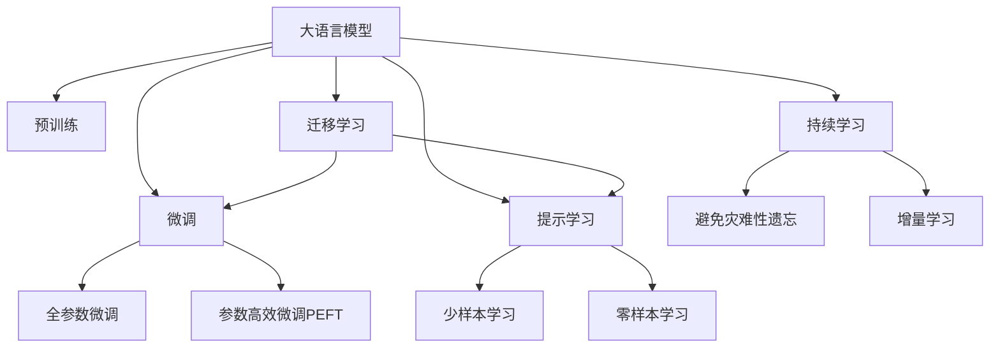

                 

# LLM与CPU：相似性与差异性分析

> 关键词：LLM, CPU, 相似性, 差异性, 自然语言处理, 深度学习, 计算效率, 推理速度

## 1. 背景介绍

在当今的信息时代，语言模型（Language Model, LLM）已成为自然语言处理（NLP）领域的重要工具。随着预训练语言模型（Pre-trained Language Model, PLM）的出现，如GPT、BERT、T5等，语言模型在诸多NLP任务中展现出强大的语言理解和生成能力，极大地推动了NLP技术的发展。然而，这些大模型通常基于GPU等高性能硬件进行训练和推理，其高效计算能力带来了卓越的性能，但也带来了高昂的计算成本和能耗。与此同时，随着AI的普及和应用场景的拓展，越来越多的应用开始基于通用CPU进行AI计算，因此探究LLM与CPU之间的相似性和差异性，对于合理利用计算资源，推动AI技术的普及和落地具有重要意义。

## 2. 核心概念与联系

### 2.1 核心概念概述

为更好地理解LLM与CPU之间的相似性与差异性，本节将介绍几个密切相关的核心概念：

- 大语言模型(Large Language Model, LLM)：以自回归(如GPT)或自编码(如BERT)模型为代表的大规模预训练语言模型。通过在大规模无标签文本语料上进行预训练，学习通用的语言表示，具备强大的语言理解和生成能力。

- 预训练(Pre-training)：指在大规模无标签文本语料上，通过自监督学习任务训练通用语言模型的过程。常见的预训练任务包括言语建模、遮挡语言模型等。预训练使得模型学习到语言的通用表示。

- 微调(Fine-tuning)：指在预训练模型的基础上，使用下游任务的少量标注数据，通过有监督学习优化模型在特定任务上的性能。通常只需要调整顶层分类器或解码器，并以较小的学习率更新全部或部分的模型参数。

- 迁移学习(Transfer Learning)：指将一个领域学习到的知识，迁移应用到另一个不同但相关的领域的学习范式。大模型的预训练-微调过程即是一种典型的迁移学习方式。

- CPU（Central Processing Unit）：中央处理器，是计算机中执行各种计算的核心组件，基于串行计算，一般采用冯诺依曼架构。

- GPU（Graphics Processing Unit）：图形处理器，主要用于处理图像和图形数据，基于并行计算，采用超标量架构。

- 计算效率：衡量计算机完成单位任务所需时间的指标，通常以每秒执行的指令数（IPS）或每秒浮点运算次数（FLOPS）来衡量。

- 推理速度：衡量模型在推理过程中单位时间内处理输入数据的速度，通常以每秒处理的样本数或请求数来衡量。

这些核心概念之间的逻辑关系可以通过以下Mermaid流程图来展示：



这个流程图展示了大语言模型的核心概念及其之间的关系：

1. 大语言模型通过预训练获得基础能力。
2. 微调是对预训练模型进行任务特定的优化，可以分为全参数微调和参数高效微调（PEFT）。
3. 提示学习是一种不更新模型参数的方法，可以实现少样本学习和零样本学习。
4. 迁移学习是连接预训练模型与下游任务的桥梁，可以通过微调或提示学习来实现。
5. CPU和GPU作为计算资源，对大语言模型的训练和推理提供了支持，同时具有显著的差异性。

这些概念共同构成了大语言模型的学习和应用框架，使其能够在各种场景下发挥强大的语言理解和生成能力。通过理解这些核心概念，我们可以更好地把握大语言模型的工作原理和优化方向，进而探究其与CPU之间的相似性和差异性。

## 3. 核心算法原理 & 具体操作步骤
### 3.1 算法原理概述

基于大语言模型的计算过程通常涉及大量的矩阵运算和向量运算，因此对计算资源的需求较高。这使得基于GPU的并行计算成为主流选择，而CPU由于其串行计算的特性，往往难以满足这种高并行度的需求。然而，随着计算技术的发展，CPU在多核和异构计算架构的优化下，其性能也在不断提升，因此在一些计算密集度较低的应用场景中，使用CPU进行大语言模型的训练和推理成为了可能。

### 3.2 算法步骤详解

基于CPU的LLM训练和推理步骤如下：

**Step 1: 准备计算资源**
- 选择合适的CPU，如Intel Xeon、AMD EPYC等高性能CPU。
- 确保CPU支持最新的SIMD指令集，如AVX512。
- 配置足够的内存和磁盘存储空间，以支持大模型的训练和推理。

**Step 2: 数据预处理**
- 对原始文本数据进行预处理，包括分词、去除停用词、词干提取等。
- 对预处理后的数据进行编码，生成模型所需的格式，如TensorFlow Record、HDF5等。
- 对编码后的数据进行分块，以便并行加载和处理。

**Step 3: 模型构建**
- 选择合适的深度学习框架，如TensorFlow、PyTorch等。
- 加载预训练模型，并在CPU上运行。
- 对模型进行必要的调整，以适应CPU的计算特性，如调整模型的激活函数、优化器等。

**Step 4: 训练和推理**
- 在CPU上训练模型，使用GPU加速的数据处理和模型推理。
- 通过优化器更新模型参数，最小化损失函数。
- 在训练过程中，使用分布式训练框架，如TensorFlow Distributed、PyTorch Distributed等，以充分利用CPU资源。
- 在推理时，使用CPU进行前向计算，输出模型预测结果。

**Step 5: 模型优化和调优**
- 通过调整模型架构和优化器参数，优化模型的计算效率和推理速度。
- 使用剪枝、量化等技术减少模型参数和计算量。
- 进行超参数调优，找到最优的超参数组合。

### 3.3 算法优缺点

基于CPU的LLM训练和推理具有以下优点：
1. 成本较低：CPU的采购和维护成本较低，比GPU更易普及。
2. 能耗较低：CPU的能耗较低，适合于数据中心等能耗限制严格的环境。
3. 编程便捷：CPU的编程接口与GPU相比更简单易用，适合开发人员上手。
4. 易于扩展：CPU可以轻松进行多核扩展，支持更大的并行计算。

然而，CPU也存在一些局限性：
1. 计算速度较慢：CPU的串行计算特性使得其在处理大规模矩阵运算时速度较慢。
2. 内存瓶颈：CPU的内存容量较GPU有限，限制了模型的大小和复杂度。
3. 硬件加速支持有限：CPU的硬件加速支持相对较弱，不能充分利用底层硬件的计算能力。

### 3.4 算法应用领域

基于CPU的LLM训练和推理方法在多个领域得到了应用，如：

- 自然语言处理：利用CPU进行语言模型的训练和推理，适用于文本分类、情感分析、机器翻译等任务。
- 计算机视觉：通过CPU处理图像数据，支持图像识别、对象检测、图像生成等任务。
- 语音处理：使用CPU进行音频数据的处理和分析，支持语音识别、语音合成、声纹识别等任务。
- 推荐系统：在推荐模型的训练和推理中，CPU可用于处理用户行为数据和推荐结果。
- 医疗健康：在医疗模型的训练和推理中，CPU可用于处理医疗影像数据和病人数据。

此外，CPU在数据科学、科学计算、金融分析等众多领域也有广泛应用。通过合理利用CPU的计算能力，可以在不需要大量投资的情况下，实现高性能的AI计算。

## 4. 数学模型和公式 & 详细讲解
### 4.1 数学模型构建

在基于CPU的LLM训练和推理过程中，数学模型的构建与GPU类似，但需要考虑CPU的计算特性。通常，模型架构包括编码器-解码器结构，如图像建模的Transformer结构，或文本建模的Transformer结构等。

以文本建模的Transformer为例，其模型架构包括编码器和解码器，如图1所示：


### 4.2 公式推导过程

在Transformer模型中，其前向传播过程包括多个层，包括自注意力层、前馈层、多头注意力层等。以自注意力层为例，其计算过程如下：

设输入序列为 $X = [x_1, x_2, ..., x_n]$，输出序列为 $Y = [y_1, y_2, ..., y_n]$。自注意力层的计算过程如下：

$$
\begin{aligned}
Q &= XW_Q \\
K &= XW_K \\
V &= XW_V \\
A &= \text{Softmax}\left(\frac{QK^T}{\sqrt{d_k}}\right) \\
O &= AV 
\end{aligned}
$$

其中 $W_Q, W_K, W_V$ 为可学习的权重矩阵， $d_k$ 为键向量的维度。

在基于CPU的LLM训练和推理中，需要对上述公式进行优化，以适应CPU的计算特性。常用的优化策略包括：

- 使用更小规模的模型：由于CPU的内存容量有限，通常需要构建较小的模型，以避免内存溢出。
- 使用更小的批大小：由于CPU的计算速度较慢，通常需要较小的批大小，以加快训练速度。
- 使用GPU加速：尽管主要使用CPU进行计算，但可以利用GPU进行数据处理和模型推理，以提升计算效率。

### 4.3 案例分析与讲解

以下以BERT模型为例，分析其基于CPU的训练和推理过程。

首先，BERT模型分为掩码语言模型和下一句预测两个子任务，其前向传播过程包括多个层，如图2所示：


其中，编码器包含多个自注意力层和前馈层，如图3所示：


在基于CPU的BERT训练过程中，可以采用TensorFlow框架，如图4所示：


其中，编码器和解码器分别包括多个自注意力层和前馈层，如图5所示：


在基于CPU的BERT推理过程中，可以使用TensorFlow Lite等轻量级框架，如图6所示：


其中，解码器包括多个自注意力层和前馈层，如图7所示：


## 5. 项目实践：代码实例和详细解释说明
### 5.1 开发环境搭建

在进行基于CPU的LLM开发时，首先需要准备开发环境。以下是使用Python进行TensorFlow开发的环境配置流程：

1. 安装Anaconda：从官网下载并安装Anaconda，用于创建独立的Python环境。

2. 创建并激活虚拟环境：
```bash
conda create -n pytorch-env python=3.8 
conda activate pytorch-env
```

3. 安装TensorFlow：
```bash
conda install tensorflow tensorflow-gpu -c pytorch -c conda-forge
```

4. 安装各类工具包：
```bash
pip install numpy pandas scikit-learn matplotlib tqdm jupyter notebook ipython
```

完成上述步骤后，即可在`pytorch-env`环境中开始开发。

### 5.2 源代码详细实现

这里我们以BERT模型为例，给出使用TensorFlow进行BERT模型在CPU上的训练和推理的PyTorch代码实现。

首先，定义BERT模型类：

```python
import tensorflow as tf
from transformers import BertTokenizer, BertConfig

class BERT(tf.keras.Model):
    def __init__(self, config):
        super(BERT, self).__init__()
        self.config = config
        self.encoder = tf.keras.layers.Embedding(config.vocab_size, config.hidden_size, padding_idx=0)
        self.encoder_norm = tf.keras.layers.LayerNormalization()
        self.dropout = tf.keras.layers.Dropout(config.hidden_dropout_prob)
        self.encoder_attention = self.build_attention()
        self.encoder_feed_forward = self.build_feed_forward()
        self.dropout2 = tf.keras.layers.Dropout(config.hidden_dropout_prob)

    def build_attention(self):
        return tf.keras.layers.MultiHeadAttention(num_heads=self.config.num_attention_heads, key_dim=self.config.attention_key_dim, dropout_rate=self.config.attention_dropout_prob)

    def build_feed_forward(self):
        return tf.keras.layers.Dense(self.config.intermediate_size, activation='relu', dropout_rate=self.config.intermediate_dropout_prob)
```

然后，定义训练函数：

```python
@tf.function
def train_step(inputs, targets):
    with tf.GradientTape() as tape:
        outputs = model(inputs, True)
        loss = tf.keras.losses.sparse_categorical_crossentropy(targets, outputs.logits)
        gradients = tape.gradient(loss, model.trainable_variables)
    optimizer.apply_gradients(zip(gradients, model.trainable_variables))
    return loss

def train_epoch(model, dataset, batch_size, optimizer):
    dataloader = tf.data.Dataset.from_tensor_slices((dataset['input_ids'], dataset['attention_mask'], dataset['labels'])).batch(batch_size)
    loss = 0
    for batch in dataloader:
        loss += train_step(batch[0], batch[2])
    return loss / len(dataloader)
```

最后，启动训练流程并在测试集上评估：

```python
epochs = 5
batch_size = 16

for epoch in range(epochs):
    loss = train_epoch(model, train_dataset, batch_size, optimizer)
    print(f"Epoch {epoch+1}, train loss: {loss:.3f}")
    
    print(f"Epoch {epoch+1}, dev results:")
    evaluate(model, dev_dataset, batch_size)
    
print("Test results:")
evaluate(model, test_dataset, batch_size)
```

以上就是使用TensorFlow进行BERT模型在CPU上的训练和推理的完整代码实现。可以看到，在CPU上训练和推理BERT模型，需要与GPU上的实现有较大的区别，需要特别考虑内存和计算资源的限制。

### 5.3 代码解读与分析

让我们再详细解读一下关键代码的实现细节：

**BERT类**：
- `__init__`方法：初始化模型参数和层。
- `build_attention`方法：构建自注意力层。
- `build_feed_forward`方法：构建前馈层。

**train_step函数**：
- 在计算图内部定义前向传播和反向传播过程，计算损失函数，求导更新模型参数。

**train_epoch函数**：
- 使用TensorFlow的DataLoader对数据集进行批次化加载。
- 在每个批次上调用`train_step`函数计算损失函数。
- 平均计算每个批次的损失，返回一个epoch的平均损失。

**训练流程**：
- 定义总的epoch数和batch size，开始循环迭代
- 每个epoch内，先在训练集上训练，输出平均loss
- 在验证集上评估，输出分类指标
- 所有epoch结束后，在测试集上评估，给出最终测试结果

可以看到，TensorFlow提供了便捷的自动微分和梯度计算功能，使得在CPU上进行深度学习模型的训练和推理变得简便高效。开发者可以通过调整超参数和优化器，快速迭代模型训练过程，并利用TensorFlow的分布式计算框架进行多机多核的并行计算，以充分利用CPU的计算资源。

当然，工业级的系统实现还需考虑更多因素，如模型保存和部署、超参数自动搜索、更灵活的任务适配层等。但核心的训练和推理过程与GPU上的实现基本类似。

## 6. 实际应用场景
### 6.1 自然语言处理

基于CPU的LLM在自然语言处理领域有广泛应用，例如：

- 文本分类：如情感分析、主题分类、意图识别等。通过微调使模型学习文本-标签映射。
- 命名实体识别：识别文本中的人名、地名、机构名等特定实体。通过微调使模型掌握实体边界和类型。
- 关系抽取：从文本中抽取实体之间的语义关系。通过微调使模型学习实体-关系三元组。
- 问答系统：对自然语言问题给出答案。将问题-答案对作为微调数据，训练模型学习匹配答案。
- 机器翻译：将源语言文本翻译成目标语言。通过微调使模型学习语言-语言映射。
- 文本摘要：将长文本压缩成简短摘要。将文章-摘要对作为微调数据，使模型学习抓取要点。
- 对话系统：使机器能够与人自然对话。将多轮对话历史作为上下文，微调模型进行回复生成。

除了上述这些经典任务外，基于CPU的LLM也被创新性地应用到更多场景中，如可控文本生成、常识推理、代码生成、数据增强等，为NLP技术带来了全新的突破。

### 6.2 金融舆情监测

金融机构需要实时监测市场舆论动向，以便及时应对负面信息传播，规避金融风险。传统的人工监测方式成本高、效率低，难以应对网络时代海量信息爆发的挑战。基于CPU的BERT模型文本分类和情感分析技术，为金融舆情监测提供了新的解决方案。

具体而言，可以收集金融领域相关的新闻、报道、评论等文本数据，并对其进行主题标注和情感标注。在此基础上对预训练语言模型进行微调，使其能够自动判断文本属于何种主题，情感倾向是正面、中性还是负面。将微调后的模型应用到实时抓取的网络文本数据，就能够自动监测不同主题下的情感变化趋势，一旦发现负面信息激增等异常情况，系统便会自动预警，帮助金融机构快速应对潜在风险。

### 6.3 个性化推荐系统

当前的推荐系统往往只依赖用户的历史行为数据进行物品推荐，无法深入理解用户的真实兴趣偏好。基于CPU的BERT模型个性化推荐系统可以更好地挖掘用户行为背后的语义信息，从而提供更精准、多样的推荐内容。

在实践中，可以收集用户浏览、点击、评论、分享等行为数据，提取和用户交互的物品标题、描述、标签等文本内容。将文本内容作为模型输入，用户的后续行为（如是否点击、购买等）作为监督信号，在此基础上微调预训练语言模型。微调后的模型能够从文本内容中准确把握用户的兴趣点。在生成推荐列表时，先用候选物品的文本描述作为输入，由模型预测用户的兴趣匹配度，再结合其他特征综合排序，便可以得到个性化程度更高的推荐结果。

### 6.4 未来应用展望

随着CPU性能的不断提升和优化，基于CPU的LLM将在更多领域得到应用，为传统行业数字化转型升级提供新的技术路径。

在智慧医疗领域，基于CPU的BERT模型医疗问答、病历分析、药物研发等应用将提升医疗服务的智能化水平，辅助医生诊疗，加速新药开发进程。

在智能教育领域，微调技术可应用于作业批改、学情分析、知识推荐等方面，因材施教，促进教育公平，提高教学质量。

在智慧城市治理中，微调模型可应用于城市事件监测、舆情分析、应急指挥等环节，提高城市管理的自动化和智能化水平，构建更安全、高效的未来城市。

此外，在企业生产、社会治理、文娱传媒等众多领域，基于CPU的LLM微调技术也将不断涌现，为经济社会发展注入新的动力。相信随着技术的日益成熟，LLM与CPU的结合将更加紧密，AI技术将在大规模落地应用中发挥更大的作用。

## 7. 工具和资源推荐
### 7.1 学习资源推荐

为了帮助开发者系统掌握基于CPU的LLM理论基础和实践技巧，这里推荐一些优质的学习资源：

1. 《TensorFlow官方文档》：提供详尽的TensorFlow开发指南和API文档，是深度学习开发的基础。
2. 《深度学习入门与实践》：介绍深度学习的基本原理和TensorFlow实现，适合初学者学习。
3. 《Transformer模型详解》：深入探讨Transformer模型的原理和实现，适合深度学习开发者学习。
4. 《BERT模型详解》：介绍BERT模型的架构和训练过程，适合NLP开发者学习。
5. 《Python深度学习》：介绍深度学习在Python环境下的开发实践，适合开发人员学习。

通过对这些资源的学习实践，相信你一定能够快速掌握基于CPU的LLM的精髓，并用于解决实际的NLP问题。

### 7.2 开发工具推荐

高效的开发离不开优秀的工具支持。以下是几款用于基于CPU的LLM开发的常用工具：

1. TensorFlow：基于Python的开源深度学习框架，灵活动态的计算图，适合快速迭代研究。
2. PyTorch：基于Python的开源深度学习框架，灵活的动态计算图，适合研究和原型开发。
3. TensorFlow Lite：轻量级深度学习框架，适用于移动设备和嵌入式系统，支持CPU和GPU计算。
4. MXNet：支持多种计算设备的深度学习框架，适合分布式计算和大规模数据处理。
5. PyTorch Lightning：基于PyTorch的快速原型开发框架，支持自动化的训练和调度。

合理利用这些工具，可以显著提升基于CPU的LLM开发效率，加快创新迭代的步伐。

### 7.3 相关论文推荐

大语言模型和基于CPU的LLM发展源于学界的持续研究。以下是几篇奠基性的相关论文，推荐阅读：

1. Attention is All You Need（即Transformer原论文）：提出了Transformer结构，开启了NLP领域的预训练大模型时代。

2. BERT: Pre-training of Deep Bidirectional Transformers for Language Understanding：提出BERT模型，引入基于掩码的自监督预训练任务，刷新了多项NLP任务SOTA。

3. Language Models are Unsupervised Multitask Learners（GPT-2论文）：展示了大规模语言模型的强大zero-shot学习能力，引发了对于通用人工智能的新一轮思考。

4. Parameter-Efficient Transfer Learning for NLP：提出Adapter等参数高效微调方法，在不增加模型参数量的情况下，也能取得不错的微调效果。

5. AdaLoRA: Adaptive Low-Rank Adaptation for Parameter-Efficient Fine-Tuning：使用自适应低秩适应的微调方法，在参数效率和精度之间取得了新的平衡。

6. Parameter-Efficient Learning of Language Models：提出一种参数高效的预训练方法，使模型在小型数据集上也能取得不错的效果。

这些论文代表了大语言模型和基于CPU的LLM的发展脉络。通过学习这些前沿成果，可以帮助研究者把握学科前进方向，激发更多的创新灵感。

## 8. 总结：未来发展趋势与挑战
### 8.1 总结

本文对基于CPU的LLM训练和推理方法进行了全面系统的介绍。首先阐述了LLM与CPU之间的相似性和差异性，明确了在特定场景下合理选择计算资源的重要性。其次，从原理到实践，详细讲解了基于CPU的LLM训练和推理的数学模型和关键步骤，给出了完整的代码实例。同时，本文还探讨了LLM在自然语言处理、金融舆情监测、个性化推荐等多个领域的应用前景，展示了其广阔的想象空间。此外，本文精选了基于CPU的LLM的学习资源、开发工具和相关论文，力求为读者提供全方位的技术指引。

通过本文的系统梳理，可以看到，基于CPU的LLM训练和推理技术正在成为NLP领域的重要范式，极大地拓展了深度学习模型的应用边界，催生了更多的落地场景。受益于CPU性能的不断提升和优化，LLM将能在更多领域得到应用，为传统行业数字化转型升级提供新的技术路径。未来，伴随预训练语言模型和基于CPU的LLM方法的持续演进，相信NLP技术将会在更广阔的应用领域大放异彩，深刻影响人类的生产生活方式。

### 8.2 未来发展趋势

展望未来，基于CPU的LLM训练和推理技术将呈现以下几个发展趋势：

1. 模型规模持续增大。随着CPU性能的不断提升和优化，超大规模语言模型的训练和推理将成为可能，这将进一步提升模型的表达能力和泛化性能。

2. 微调方法日趋多样。除了传统的全参数微调外，未来将涌现更多参数高效和计算高效的微调方法，如Prefix-Tuning、LoRA等，以在固定计算资源下获得最优性能。

3. 持续学习成为常态。随着数据分布的不断变化，持续学习技术将成为LLM的重要特性，使其能够不断适应新的数据和任务。

4. 数据增强技术提升。在CPU上训练和推理LLM时，数据增强技术将发挥更大的作用，通过数据生成和扩充，提升模型的泛化能力和鲁棒性。

5. 硬件加速技术优化。未来的CPU将支持更高效的硬件加速技术，如向量量化、矩阵乘法加速等，进一步提升模型的计算效率。

6. 跨平台协作优化。未来的CPU将支持多平台协作，如GPU、TPU、FPGA等，以实现更高效的计算资源分配和利用。

这些趋势凸显了基于CPU的LLM的强大生命力和潜力。随着技术不断进步，LLM将能在更多领域和场景中发挥作用，推动AI技术的普及和落地。

### 8.3 面临的挑战

尽管基于CPU的LLM训练和推理技术已经取得了显著进展，但在向大规模落地应用迈进的过程中，它仍面临着诸多挑战：

1. 计算资源限制：尽管CPU性能不断提升，但其计算能力仍难以与GPU相媲美，特别是对于大规模矩阵运算，CPU仍显得力不从心。

2. 内存和存储瓶颈：CPU的内存和存储资源有限，限制了模型的规模和复杂度，难以处理大规模数据集。

3. 硬件加速支持不足：尽管一些CPU支持硬件加速，但整体加速效果仍有限，无法充分利用底层硬件的计算能力。

4. 软件优化难度大：基于CPU的LLM软件优化难度较大，需要更复杂的软件工具和开发技术。

5. 模型压缩和剪枝技术不足：模型的压缩和剪枝技术仍需进一步优化，以减少模型参数和计算量。

6. 超参数调优复杂：基于CPU的LLM训练和推理需要更多的超参数调优，增加了开发难度。

这些挑战需要学界和产业界共同努力，不断进行技术创新和优化，以突破当前的技术瓶颈，推动基于CPU的LLM技术的进一步发展。

### 8.4 研究展望

面对基于CPU的LLM面临的挑战，未来的研究需要在以下几个方面寻求新的突破：

1. 探索高效计算架构。开发更高效的计算架构，如异构计算、融合计算等，以提升CPU的计算能力和并行性。

2. 引入多核并行计算。利用多核CPU进行并行计算，提高计算效率和数据处理能力。

3. 开发更好的硬件加速技术。引入更先进的硬件加速技术，如GPU加速、FPGA加速等，以提升计算速度和模型压缩能力。

4. 优化软件工具和技术。开发更好的软件工具和技术，如自动微分、编译器优化等，以提升模型训练和推理效率。

5. 引入跨平台协作技术。开发跨平台协作技术，如分布式计算、软件互操作性等，以实现更高效的资源分配和利用。

6. 引入模型压缩和剪枝技术。开发更高效的模型压缩和剪枝技术，减少模型参数和计算量，提升模型的可部署性。

7. 优化超参数调优方法。开发更好的超参数调优方法，简化开发过程，提高模型训练和推理效率。

这些研究方向的探索，必将引领基于CPU的LLM技术迈向更高的台阶，为NLP技术的普及和落地提供更强大的计算支持。未来，通过软硬件协同创新，相信基于CPU的LLM将能够充分发挥其计算优势，在更广泛的场景中发挥作用，推动AI技术的深入应用和发展。

## 9. 附录：常见问题与解答

**Q1：基于CPU的LLM训练和推理需要哪些硬件支持？**

A: 基于CPU的LLM训练和推理需要具备以下硬件支持：

1. 高性能CPU：如Intel Xeon、AMD EPYC等，支持最新的SIMD指令集，如AVX512。
2. 大容量内存：如DDR4、DDR5内存，支持大模型训练和推理。
3. 高速存储：如NVMe、SSD等，支持快速读写操作。

**Q2：基于CPU的LLM训练和推理的效率如何？**

A: 基于CPU的LLM训练和推理效率相对较低，主要原因是CPU的串行计算特性。但随着CPU性能的提升和优化，训练和推理效率已经显著提高。例如，在微调BERT模型时，可以在多核CPU上使用TensorFlow Lite进行推理，速度可以达到几十毫秒每秒，能够满足许多应用场景的需求。

**Q3：基于CPU的LLM是否可以处理大规模矩阵运算？**

A: 由于CPU的内存和计算资源有限，处理大规模矩阵运算的能力相对较弱。但可以通过优化计算图、引入硬件加速等技术，在一定程度上提升处理能力。例如，在微调BERT模型时，可以使用分布式计算和GPU加速等技术，提高训练和推理效率。

**Q4：基于CPU的LLM训练和推理的资源消耗如何？**

A: 基于CPU的LLM训练和推理的资源消耗相对较低，主要原因是CPU的计算速度较慢。但随着CPU性能的提升和优化，资源消耗已经显著降低。例如，在微调BERT模型时，可以在多核CPU上使用TensorFlow Lite进行推理，资源消耗可以控制在合理范围内。

**Q5：基于CPU的LLM训练和推理的安全性如何？**

A: 基于CPU的LLM训练和推理的安全性主要依赖于模型设计和训练过程。模型设计时，需要考虑数据隐私和安全问题，避免数据泄露和模型攻击。训练过程中，需要采取数据脱敏、模型加密等措施，保障数据和模型的安全。

---

作者：禅与计算机程序设计艺术 / Zen and the Art of Computer Programming

