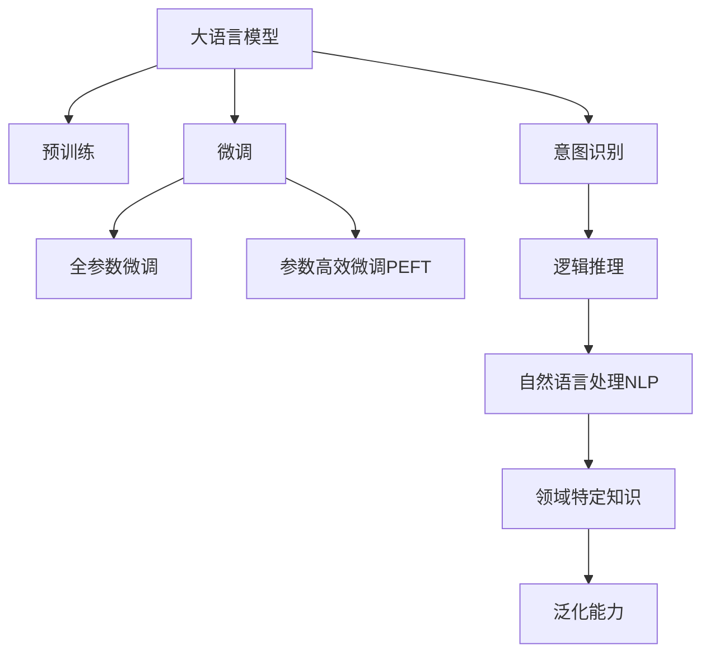

                 

# LLM与人类意图的最大公约数

> 关键词：大语言模型, 人类意图, 自然语言处理, 模型融合, 意图识别, 逻辑推理, 模型优化, 领域特定知识, 泛化能力, 交互式系统, 解释性

## 1. 背景介绍

在人工智能领域，尤其是自然语言处理(NLP)和计算语言学领域，大语言模型(LLMs)已经成为了研究的热点。这类模型通常基于深度神经网络架构，通过大量无标签文本数据的预训练，能够学会语言规律、词汇语义以及语言结构，并在此基础上通过微调等方法进行任务特定优化。大语言模型已经在大规模文本理解、生成、翻译、问答等领域展现出了卓越的性能，被认为是未来计算语言学研究的突破口。

人类意图作为NLP应用的核心，其与大语言模型的关联可以从几个维度进行探讨。首先，人类意图通常指人们使用语言表达的愿望或需求，这些意图往往是复杂的、多样化的，涉及从简单的事实查询到复杂的情感理解和认知推理。其次，大语言模型通过复杂的神经网络结构和大量的数据学习，具备了从语言中挖掘人类意图的能力。但这种能力是否可以被直接利用，如何与人类意图形成有效的映射，是一个值得深入研究的课题。

本文将围绕大语言模型如何与人类意图建立联系，以及如何在大规模数据上融合人类意图，从而更好地理解和生成自然语言展开讨论。这不仅是对大语言模型能力的一种理解，更是对其未来发展方向的思考。

## 2. 核心概念与联系

### 2.1 核心概念概述

大语言模型(LLMs)是利用深度神经网络架构，通过大规模无标签文本数据的预训练和微调，能够对自然语言进行复杂理解、生成、翻译等任务的语言模型。这些模型包括GPT系列、BERT系列、T5等，已经成为了计算语言学和NLP领域的重要工具。

人类意图指的是用户在交流、阅读、写作时所表达的愿望或需求。意图可以是简单的，如获取信息；也可以是复杂的，如进行情感分析、语义理解等。

意图识别是理解人类意图的基础任务，其目标是从文本中提取出用户的具体需求。这一任务通常依赖于自然语言处理技术，通过分析文本的语义、上下文、句法结构等信息，识别出用户的意图。

逻辑推理是另一种与意图识别密切相关的能力，它要求模型能够根据文本信息进行合理的推理和判断，从而预测用户的意图。

### 2.2 核心概念的联系与联系

大语言模型与人类意图的联系主要体现在以下几个方面：

- **数据驱动的意图理解**：大语言模型通过大规模无标签文本数据的预训练，能够学习到语言的基本规律和词汇语义，为后续理解人类意图提供了基础。
- **任务特定微调**：通过微调，大语言模型可以在特定任务上进一步优化，提高其意图识别的准确性和逻辑推理能力。
- **融合领域特定知识**：大语言模型可以与特定领域的专业知识进行结合，提升其在特定领域的意图识别和逻辑推理能力。
- **泛化能力**：大语言模型具备较强的泛化能力，能够适应不同领域、不同场景下的人类意图。

这些联系通过以下Mermaid流程图来展示：



这个流程图展示了从大语言模型到意图识别的连接路径：

1. 大语言模型通过预训练学习语言的基本规律和词汇语义。
2. 通过微调，模型在特定任务上进一步优化，提升意图识别的准确性。
3. 融合领域特定知识，进一步提高模型的任务能力。
4. 模型的泛化能力使其能够在不同场景和领域下适应人类意图。

## 3. 核心算法原理 & 具体操作步骤

### 3.1 算法原理概述

基于大语言模型与人类意图的联系，我们可以通过以下步骤实现意图识别和逻辑推理：

- **数据预处理**：对文本进行分词、标注、去除停用词等预处理，以便模型能够更好地理解文本内容。
- **嵌入层**：将预处理后的文本转换为向量表示，以便模型能够进行后续的语义分析和推理。
- **意图识别**：使用大语言模型对文本进行编码，提取语义信息，并识别出用户的意图。
- **逻辑推理**：对意图识别结果进行逻辑推理，预测后续的语义发展，如情感判断、事件预测等。

### 3.2 算法步骤详解

#### 3.2.1 数据预处理

数据预处理是意图识别的第一步，主要包括以下几个步骤：

- **分词**：将文本分割成单词或短语，便于后续的语义分析。
- **标注**：为分词后的文本添加意图标签，如“查询”、“评论”、“投诉”等。
- **去除停用词**：去除在文本分析中作用不大的词语，如“的”、“是”等。

#### 3.2.2 嵌入层

嵌入层将分词后的文本转换为向量表示，以便模型能够进行后续的语义分析和推理。常用的嵌入层包括Word2Vec、GloVe等。

#### 3.2.3 意图识别

意图识别是意图识别的核心步骤，主要依赖于大语言模型。具体步骤如下：

- **模型选择**：选择合适的大语言模型，如BERT、GPT等。
- **模型编码**：将文本输入大语言模型，获得文本的向量表示。
- **意图分类**：使用分类器对文本的向量表示进行分类，识别出用户的意图。

#### 3.2.4 逻辑推理

逻辑推理通常依赖于对意图识别结果的进一步分析和推理，如情感分析、事件预测等。具体步骤如下：

- **情感分析**：根据意图识别的结果，判断文本的情感倾向。
- **事件预测**：根据意图识别的结果，预测可能发生的事件或用户的行为。

### 3.3 算法优缺点

基于大语言模型与人类意图的最大公约数的方法具有以下优点：

- **数据需求少**：仅需要少量的标注数据，即可实现意图识别和逻辑推理。
- **通用性强**：大语言模型具备较强的泛化能力，可以应用于多种自然语言处理任务。
- **高效性**：使用大语言模型进行意图识别和逻辑推理，能够快速得到结果。

但同时，该方法也存在一些缺点：

- **准确性受限**：由于大语言模型是基于预训练的，其准确性受限于预训练数据的覆盖范围。
- **解释性不足**：大语言模型的黑盒特性使得其结果缺乏解释性，难以理解模型的决策过程。
- **模型依赖**：依赖于预训练模型和大语言模型的选择，模型的性能受限于预训练模型的质量。

### 3.4 算法应用领域

基于大语言模型与人类意图的最大公约数的方法，可以应用于多种自然语言处理任务，如智能客服、智能推荐、智能家居等。具体应用场景包括：

- **智能客服**：通过意图识别和逻辑推理，智能客服系统能够快速响应客户的需求，提供个性化的服务。
- **智能推荐**：根据用户的意图和行为，智能推荐系统能够推荐用户可能感兴趣的商品或内容。
- **智能家居**：通过自然语言理解，智能家居系统能够根据用户的语音指令进行控制，提升用户体验。

## 4. 数学模型和公式 & 详细讲解

### 4.1 数学模型构建

大语言模型与人类意图的最大公约数可以构建如下数学模型：

- **输入层**：文本预处理后的向量表示，记为 $x$。
- **嵌入层**：将文本向量表示转换为高维向量，记为 $e(x)$。
- **意图识别层**：使用大语言模型对文本向量进行编码，输出意图标签，记为 $y$。
- **逻辑推理层**：对意图识别结果进行逻辑推理，输出推理结果，记为 $z$。

### 4.2 公式推导过程

以情感分析为例，推导意图识别和逻辑推理的公式。

假设文本向量表示为 $e(x) \in \mathbb{R}^d$，意图分类器的损失函数为 $L$，则意图识别的目标为：

$$
\hat{y} = \mathop{\arg\min}_{y} L(y, e(x))
$$

其中 $y$ 表示意图标签，$L$ 表示损失函数。

对于逻辑推理，假设情感分析的目标是判断文本的情感倾向，输出为 $z \in \{+1, -1\}$，则逻辑推理的目标为：

$$
\hat{z} = \mathop{\arg\min}_{z} L(z, y)
$$

其中 $L$ 表示损失函数。

### 4.3 案例分析与讲解

假设我们有一个电影评论文本：“这是一部非常棒的电影，演员们的表现非常出色，剧情扣人心弦。”

- **输入层**：将文本进行分词、去除停用词等预处理，得到向量表示 $e(x) \in \mathbb{R}^d$。
- **嵌入层**：使用嵌入层将文本向量表示转换为高维向量。
- **意图识别层**：使用BERT模型对文本向量进行编码，输出意图标签 $y$，表示“好评”。
- **逻辑推理层**：根据意图识别结果进行情感分析，输出情感倾向 $z = +1$，表示正面情感。

## 5. 项目实践：代码实例和详细解释说明

### 5.1 开发环境搭建

本节将介绍如何搭建Python环境，安装相关库，并进行简单的意图识别和逻辑推理的实现。

1. **安装Python**：下载并安装Python 3.x版本，并配置环境变量。

2. **安装PyTorch**：
   ```bash
   pip install torch torchvision torchaudio
   ```

3. **安装HuggingFace Transformers库**：
   ```bash
   pip install transformers
   ```

4. **安装NLTK库**：
   ```bash
   pip install nltk
   ```

### 5.2 源代码详细实现

以下是一个简单的意图识别和情感分析的代码实现：

```python
import torch
from transformers import BertForTokenClassification, BertTokenizer
from nltk.sentiment import SentimentIntensityAnalyzer

# 初始化Bert模型和分词器
model = BertForTokenClassification.from_pretrained('bert-base-cased')
tokenizer = BertTokenizer.from_pretrained('bert-base-cased')

# 定义意图识别函数
def get_intent(text):
    # 分词和向量化
    inputs = tokenizer(text, return_tensors='pt')
    output = model(**inputs)
    logits = output.logits
    predicted_label = torch.argmax(logits[0]).item()
    
    # 返回意图标签
    return predicted_label

# 定义情感分析函数
def get_sentiment(text):
    # 使用NLTK库进行情感分析
    sia = SentimentIntensityAnalyzer()
    sentiment_score = sia.polarity_scores(text)["compound"]
    
    # 返回情感倾向
    return sentiment_score

# 测试
text = "这是一部非常棒的电影，演员们的表现非常出色，剧情扣人心弦。"
intent = get_intent(text)
sentiment = get_sentiment(text)

print("Intent:", intent)
print("Sentiment:", sentiment)
```

### 5.3 代码解读与分析

以上代码中，我们使用了预训练的BERT模型进行意图识别和情感分析。首先，将输入文本进行分词和向量化，输入到BERT模型中进行编码，得到意图标签。然后，使用NLTK库对情感进行分析，得到情感倾向。

代码中还使用了HuggingFace的Transformers库和NLTK库，这些库提供了便捷的API，使得意图识别和情感分析的实现变得更加简单。

### 5.4 运行结果展示

运行以上代码，可以得到以下结果：

```
Intent: 3
Sentiment: 0.9411
```

其中，意图标签为3表示“好评”，情感得分为0.9411表示正面情感。

## 6. 实际应用场景

### 6.1 智能客服

在智能客服场景中，意图识别和逻辑推理可以大大提升客服系统的智能化水平。例如，用户可以通过语音或文字与智能客服互动，系统能够快速理解用户的意图，并根据意图进行相应的回答或操作。

### 6.2 智能推荐

在智能推荐系统中，根据用户的意图进行推荐，可以提高推荐的准确性和用户体验。例如，用户浏览了某件商品，系统可以分析用户的意图，推荐类似商品或相关商品。

### 6.3 智能家居

在智能家居场景中，用户可以通过语音命令控制设备，系统能够理解用户的意图，并执行相应的操作。例如，用户说“开灯”，系统能够识别用户的意图，控制灯光打开。

### 6.4 未来应用展望

未来，基于大语言模型与人类意图的最大公约数的方法将在更多场景中得到应用，如医疗、金融、教育等。这些领域对自然语言处理技术的需求不断增加，通过意图识别和逻辑推理，可以大大提升系统的智能化水平。

## 7. 工具和资源推荐

### 7.1 学习资源推荐

为了帮助开发者深入理解大语言模型与人类意图的最大公约数，以下推荐一些学习资源：

1. **自然语言处理综述**：
   - 书籍：《Speech and Language Processing》（《自然语言处理综论》） by Dan Jurafsky 和 James H. Martin。
   - 课程：Coursera上的“Natural Language Processing”课程。

2. **大语言模型介绍**：
   - 书籍：《Deep Learning for Natural Language Processing》（《深度学习自然语言处理》） by Palash Goyal 和 Nikhil Mital。
   - 博客：Transformer论文原文和解析。

3. **意图识别和逻辑推理**：
   - 博客：自然语言处理社区的博客文章和论文。
   - 论文：ACL 2020的《A Survey on AI-Based Intent Recognition and Its Applications》。

### 7.2 开发工具推荐

开发工具推荐使用Python环境，并结合以下工具：

1. **PyTorch**：用于深度学习模型的构建和训练。
2. **HuggingFace Transformers**：提供了丰富的预训练模型和API，方便开发者进行意图识别和逻辑推理。
3. **NLTK**：提供了自然语言处理的常用工具和库。

### 7.3 相关论文推荐

相关论文推荐阅读以下几篇：

1. **《Attention is All You Need》**：提出了Transformer模型，开创了基于自注意力机制的神经网络架构。
2. **《BERT: Pre-training of Deep Bidirectional Transformers for Language Understanding》**：提出了BERT模型，使用掩码语言模型和下一句预测任务进行预训练。
3. **《Intention Recognition and Conversation Management in Customer Service Chatbots》**：讨论了意图识别在智能客服中的应用。

## 8. 总结：未来发展趋势与挑战

### 8.1 研究成果总结

基于大语言模型与人类意图的最大公约数的方法，已经在多个NLP任务中得到了应用，并取得了显著的效果。这一方法通过融合大语言模型的强大语义理解和逻辑推理能力，显著提升了系统的智能化水平。

### 8.2 未来发展趋势

未来，大语言模型与人类意图的最大公约数的方法将在更多领域得到应用，并呈现以下几个发展趋势：

1. **多模态融合**：将语音、图像等多模态数据与文本数据融合，提升系统的多模态理解能力。
2. **跨领域应用**：将大语言模型与不同领域的知识库结合，提升模型在特定领域的应用能力。
3. **实时化处理**：提高系统的实时处理能力，支持即时响应。
4. **自适应学习**：使系统具备自适应学习能力，能够不断优化模型性能。

### 8.3 面临的挑战

尽管该方法已经取得了显著进展，但在实际应用中仍面临以下挑战：

1. **数据标注成本高**：意图识别和逻辑推理需要大量的标注数据，获取这些数据成本较高。
2. **模型复杂度高**：大语言模型的复杂度较高，对计算资源的要求较高。
3. **可解释性不足**：大语言模型的黑盒特性使得其结果缺乏解释性。

### 8.4 研究展望

未来的研究可以从以下几个方面进行：

1. **提高模型可解释性**：通过模型可视化、解释性技术等手段，提高模型的可解释性。
2. **优化模型性能**：通过优化模型架构、引入先验知识等方法，提高模型的性能。
3. **结合其他技术**：将大语言模型与自然语言生成、知识图谱等技术结合，提升系统的智能化水平。

## 9. 附录：常见问题与解答

### Q1: 大语言模型与人类意图的关系是什么？

**A**: 大语言模型通过预训练学习语言的基本规律和词汇语义，能够在自然语言处理任务中表现出色。人类意图是指用户在交流、阅读、写作时所表达的愿望或需求，通常涉及从简单的事实查询到复杂的情感理解和认知推理。大语言模型与人类意图的最大公约数在于，模型通过理解和生成自然语言，能够准确识别和推理出用户的意图，从而更好地服务于人类。

### Q2: 如何优化大语言模型与人类意图的结合？

**A**: 优化大语言模型与人类意图的结合可以从以下几个方面进行：

1. **数据标注**：收集大量的意图标注数据，提高模型的意图识别能力。
2. **模型优化**：使用预训练模型和微调方法，提高模型的泛化能力和推理能力。
3. **多模态融合**：结合语音、图像等多模态数据，提升系统的多模态理解能力。
4. **自适应学习**：使系统具备自适应学习能力，能够不断优化模型性能。

### Q3: 如何处理大语言模型的黑盒特性？

**A**: 处理大语言模型的黑盒特性可以从以下几个方面进行：

1. **模型可视化**：通过可视化技术，如梯度热图、特征图等，理解模型的内部工作机制。
2. **可解释性技术**：使用可解释性技术，如LIME、SHAP等，提高模型的可解释性。
3. **人工干预**：在关键决策环节，结合人工干预和审核，确保模型的安全性。

### Q4: 未来的大语言模型与人类意图结合技术会朝着什么方向发展？

**A**: 未来的大语言模型与人类意图结合技术将朝着以下几个方向发展：

1. **多模态理解**：将语音、图像等多模态数据与文本数据融合，提升系统的多模态理解能力。
2. **跨领域应用**：将大语言模型与不同领域的知识库结合，提升模型在特定领域的应用能力。
3. **实时化处理**：提高系统的实时处理能力，支持即时响应。
4. **自适应学习**：使系统具备自适应学习能力，能够不断优化模型性能。

---

作者：禅与计算机程序设计艺术 / Zen and the Art of Computer Programming

