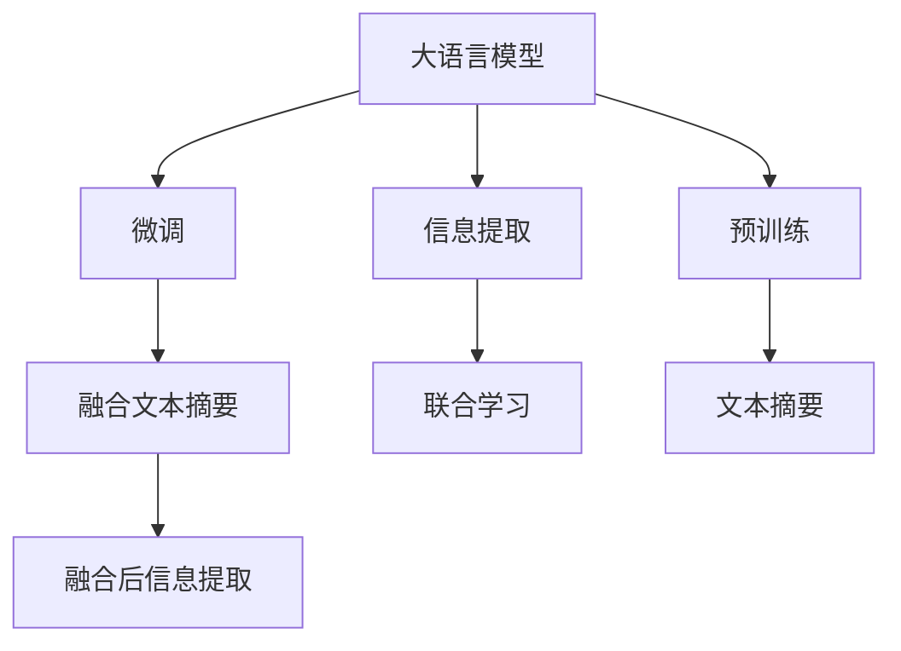

                 

# LLM与传统文本摘要技术的融合：信息提取新高度

> 关键词：大语言模型(LLM), 文本摘要, 信息提取, 自然语言处理(NLP), Transformers, 深度学习, 分布式表示

## 1. 背景介绍

随着深度学习和大数据技术的发展，自然语言处理(NLP)领域取得了诸多突破。大语言模型(LLM)凭借其强大的泛化能力和语言理解能力，为信息检索、智能问答、文本摘要等任务带来了新契机。尽管如此，大语言模型在复杂信息提取、精确信息抽取等方面仍面临着挑战。因此，本文将探讨将大语言模型与传统文本摘要技术结合的新方法，进一步提升信息提取的准确性和效率。

### 1.1 问题由来

在信息爆炸的今天，如何高效地从海量文本中提取有价值的信息，成为了亟待解决的问题。传统文本摘要技术主要依赖于抽取和生成技术，但面临语义理解不足、无法应对复杂文档结构等挑战。大语言模型通过预训练获得了丰富的语言知识和理解能力，可以显著提升信息提取的精度和效率，但需要克服精度不足、计算资源消耗大等问题。

因此，将大语言模型与传统文本摘要技术进行深度融合，成为提升信息提取性能的新方向。本文章将基于深度学习中的Transformers模型，深入介绍如何通过微调与训练，实现LLM和文本摘要技术的有机结合，实现信息提取的新高度。

### 1.2 问题核心关键点

本文核心关注的核心关键点包括：

- 大语言模型与传统文本摘要技术的融合方法。
- 深度学习中的Transformers模型。
- 文本摘要技术的核心算法与步骤。
- 融合后的信息提取性能与效率提升。

通过理解这些核心概念，我们能够更好地把握LLM和文本摘要技术的融合思路，进而探索信息提取的新可能性。

## 2. 核心概念与联系

### 2.1 核心概念概述

本节将介绍几个与大语言模型融合文本摘要技术密切相关的核心概念：

- 大语言模型(LLM)：以自回归模型如GPT系列或自编码模型如BERT为代表的大规模预训练语言模型。通过预训练学习通用语言表示，具备强大的语言理解能力。

- Transformers：一种基于自注意力机制的深度神经网络结构，被广泛应用于NLP任务，包括文本分类、机器翻译、文本摘要等。

- 文本摘要：从长文本中提取关键信息，生成简洁摘要的过程。传统方法包括抽取式和生成式两种技术。

- 信息提取：从文本中识别并抽取特定实体、关系、事件等信息的过程。与文本摘要密切相关，但任务目标不同。

- 联合学习：在大语言模型和传统摘要技术之间共享知识，提高综合性能。

这些核心概念之间的逻辑关系可以通过以下Mermaid流程图来展示：



此流程图展示了大语言模型、预训练、微调、文本摘要、信息提取和联合学习的相互联系：

1. 大语言模型通过预训练学习通用语言表示。
2. 通过微调，模型针对特定任务优化，如文本摘要。
3. 微调后的模型与传统摘要技术融合，提升整体性能。
4. 与信息提取任务结合，实现精准的信息抽取。
5. 联合学习使得两者共享知识，提升综合效果。

## 3. 核心算法原理 & 具体操作步骤

### 3.1 算法原理概述

LLM与文本摘要的融合算法，本质上是一种信息抽取与生成相结合的深度学习方法。其核心思想是：通过预训练和微调，让LLM具备高效的摘要生成和信息提取能力，并通过联合学习，进一步提升综合性能。

形式化地，假设预训练语言模型为 $M_{\theta}$，其中 $\theta$ 为预训练得到的模型参数。给定长文本 $T$，我们希望找到最简洁的摘要 $S$，同时保留 $T$ 中的关键信息。

文本摘要过程可看作序列到序列(Seq2Seq)问题，即：

$$
S = \text{dec}(M_{\theta}(T))
$$

其中，$\text{dec}$ 为解码器，将 $M_{\theta}(T)$ 的输出转化为最终的摘要 $S$。

信息提取过程可看作分类问题，即：

$$
X = \text{extract}(M_{\theta}(T))
$$

其中，$X$ 为提取的关键信息，$\text{extract}$ 为信息提取函数。

### 3.2 算法步骤详解

基于LLM和文本摘要的融合算法一般包括以下几个关键步骤：

**Step 1: 准备预训练模型和数据集**
- 选择合适的预训练语言模型 $M_{\theta}$ 作为初始化参数，如 BERT、GPT 等。
- 准备文本摘要数据集和信息提取数据集，将长文本和对应的摘要或标签进行标注。

**Step 2: 添加任务适配层**
- 在预训练模型的顶部设计序列到序列模型，包含编码器和解码器，用于生成摘要。
- 对于信息提取任务，在预训练模型的顶部设计分类器，用于识别关键信息。

**Step 3: 设置微调超参数**
- 选择合适的优化算法及其参数，如 AdamW、SGD 等，设置学习率、批大小、迭代轮数等。
- 设置正则化技术及强度，包括权重衰减、Dropout、Early Stopping 等。
- 确定冻结预训练参数的策略，如仅微调顶层，或全部参数都参与微调。

**Step 4: 执行梯度训练**
- 将训练集数据分批次输入模型，前向传播计算损失函数。
- 反向传播计算参数梯度，根据设定的优化算法和学习率更新模型参数。
- 周期性在验证集上评估模型性能，根据性能指标决定是否触发 Early Stopping。
- 重复上述步骤直到满足预设的迭代轮数或 Early Stopping 条件。

**Step 5: 测试和部署**
- 在测试集上评估融合后模型的摘要生成和信息提取性能，对比微调前后的精度提升。
- 使用融合后的模型对新样本进行推理预测，集成到实际的应用系统中。
- 持续收集新的数据，定期重新微调模型，以适应数据分布的变化。

以上是融合LLM和文本摘要算法的通用流程。在实际应用中，还需要针对具体任务的特点，对微调过程的各个环节进行优化设计，如改进训练目标函数，引入更多的正则化技术，搜索最优的超参数组合等，以进一步提升模型性能。

### 3.3 算法优缺点

LLM与文本摘要技术的融合算法具有以下优点：

- 结合了LLM强大的语言理解和生成能力，以及传统摘要技术高效的抽取能力，提升信息提取的全面性和准确性。
- 通过微调，可以针对特定任务优化模型，提升其泛化能力和鲁棒性。
- 联合学习可以提升整体性能，进一步拓展应用范围。

同时，该方法也存在一定的局限性：

- 计算资源消耗大。由于涉及两个独立任务，模型规模可能较大，计算资源需求高。
- 数据标注成本高。需要标注大量文本摘要和信息提取数据，成本较高。
- 模型复杂度高。融合后的模型结构复杂，训练和推理过程中可能出现较多异常。
- 灵活性不足。模型难以灵活应对不同长度的文本和复杂结构。

尽管存在这些局限性，但就目前而言，基于LLM和文本摘要的融合方法在信息提取领域具有显著优势，值得进一步研究和应用。

### 3.4 算法应用领域

基于大语言模型与文本摘要技术的融合方法，在信息检索、智能问答、文档理解等诸多领域都得到了广泛的应用，具体包括：

- 新闻摘要：自动生成新闻报道的摘要，帮助用户快速了解新闻重点。
- 技术文档理解：从技术文档中提取关键技术点，帮助开发者快速获取信息。
- 医疗信息抽取：从医疗记录中提取患者信息和疾病信息，辅助临床决策。
- 法律文件摘要：自动生成法律文件的摘要，帮助律师快速了解案件信息。
- 金融报告解读：自动生成金融报告的摘要，帮助分析师快速分析数据。

除了上述这些经典任务外，融合算法还被创新性地应用到更多场景中，如智能客服、电子商务、舆情监测等，为信息提取技术带来了全新的突破。随着预训练语言模型和融合方法的不断进步，相信信息提取技术将在更广阔的应用领域大放异彩。

## 4. 数学模型和公式 & 详细讲解 & 举例说明

### 4.1 数学模型构建

本节将使用数学语言对基于LLM和文本摘要的融合过程进行更加严格的刻画。

记预训练语言模型为 $M_{\theta}$，其中 $\theta$ 为预训练得到的模型参数。假设给定长文本 $T$，我们希望找到最简洁的摘要 $S$，同时保留 $T$ 中的关键信息 $X$。

定义模型 $M_{\theta}$ 在输入 $T$ 上的损失函数为 $\ell(M_{\theta}(T),S,X)$，则在数据集 $D$ 上的经验风险为：

$$
\mathcal{L}(\theta) = \frac{1}{N}\sum_{i=1}^N \ell(M_{\theta}(T_i),S_i,X_i)
$$

其中 $(T_i,S_i,X_i)$ 为第 $i$ 条文本的输入、摘要和关键信息，$\theta$ 为模型参数。

### 4.2 公式推导过程

以下我们以新闻摘要任务为例，推导基于LLM和文本摘要的融合模型。

假设模型 $M_{\theta}$ 在输入 $T$ 上的输出为 $\hat{S}=M_{\theta}(T) \in [0,1]$，表示摘要的长度。实际输出为 $\arg\min_{k} \hat{S}_k$，即选择概率最高的摘要片段。

假设 $T$ 中的关键信息为 $X$，则损失函数可表示为：

$$
\ell(M_{\theta}(T),S,X) = -\log P(\hat{S}|T) + \ell_{\text{class}}(S,X|T)
$$

其中 $P(\hat{S}|T)$ 为生成摘要的概率，$\ell_{\text{class}}(S,X|T)$ 为分类损失函数。

对于分类损失函数，我们通常采用交叉熵损失：

$$
\ell_{\text{class}}(S,X|T) = -\sum_{k} [y_k\log P(X_k|T_k) + (1-y_k)\log (1-P(X_k|T_k))]
$$

其中 $y_k$ 为关键信息 $X_k$ 是否在摘要 $S_k$ 中出现，$P(X_k|T_k)$ 为在输入 $T_k$ 中抽取 $X_k$ 的概率。

### 4.3 案例分析与讲解

在实际应用中，新闻摘要任务的文本通常包含大量冗余信息，而关键信息往往分散在文本的不同位置。因此，模型需要学习如何在各种文本结构下，准确识别和抽取关键信息，同时生成简洁而准确的新闻摘要。

**案例一：长文本生成简洁摘要**

我们假设新闻标题为 "美国总统宣布对华贸易战升级"，长文本内容可能包含大量的背景信息、事件细节等。模型需要在理解长文本的基础上，生成简洁的新闻摘要，如 "美国总统对华贸易战宣布升级"。

模型首先通过预训练获得语言表示，然后在微调过程中学习生成摘要的能力。微调过程中，模型对每个可能的摘要片段进行评分，选择最合适的摘要。该过程可以通过语言模型和分类器联合完成。

**案例二：复杂结构信息提取**

长文本可能包含多段落结构，每个段落包含不同的关键信息。模型需要学习从多段落中抽取和组织关键信息，生成完整的新闻摘要。例如：

**新闻标题**： "中美贸易战升级：中国反制措施引发国际关注"

**长文本**： "美国总统宣布对华贸易战升级，中国商务部回应称将采取反制措施。这些反制措施包括增加关税、限制高科技产品进口等。此举引发国际关注，欧盟表示将密切关注事态发展。"

**关键信息**： "美国宣布贸易战升级"、"中国反制措施"、"引发国际关注"、"欧盟表示关注"。

模型需要对每个段落进行编码，通过语言模型和分类器的联合学习，识别并抽取关键信息，并组合成完整的摘要。

### 5. 项目实践：代码实例和详细解释说明

### 5.1 开发环境搭建

在进行融合算法实践前，我们需要准备好开发环境。以下是使用Python进行PyTorch开发的环境配置流程：

1. 安装Anaconda：从官网下载并安装Anaconda，用于创建独立的Python环境。

2. 创建并激活虚拟环境：
```bash
conda create -n myenv python=3.8 
conda activate myenv
```

3. 安装PyTorch：根据CUDA版本，从官网获取对应的安装命令。例如：
```bash
conda install pytorch torchvision torchaudio cudatoolkit=11.1 -c pytorch -c conda-forge
```

4. 安装Transformers库：
```bash
pip install transformers
```

5. 安装各类工具包：
```bash
pip install numpy pandas scikit-learn matplotlib tqdm jupyter notebook ipython
```

完成上述步骤后，即可在`myenv`环境中开始融合算法实践。

### 5.2 源代码详细实现

这里我们以新闻摘要任务为例，给出使用Transformers库对BERT模型进行融合的PyTorch代码实现。

首先，定义新闻摘要任务的数据处理函数：

```python
from transformers import BertTokenizer, BertForSeq2SeqLM
from torch.utils.data import Dataset
import torch

class NewsDataset(Dataset):
    def __init__(self, texts, summaries, tokenizer, max_len=512):
        self.texts = texts
        self.summaries = summaries
        self.tokenizer = tokenizer
        self.max_len = max_len
        
    def __len__(self):
        return len(self.texts)
    
    def __getitem__(self, item):
        text = self.texts[item]
        summary = self.summaries[item]
        
        encoding = self.tokenizer(text, return_tensors='pt', max_length=self.max_len, padding='max_length', truncation=True)
        input_ids = encoding['input_ids'][0]
        attention_mask = encoding['attention_mask'][0]
        
        summary_ids = self.tokenizer(summary, return_tensors='pt', padding='max_length', truncation=True)
        summary_ids = summary_ids['input_ids'][0]
        summary_mask = summary_ids.new_ones(summary_ids.shape[0]).byte()
        return {'input_ids': input_ids, 
                'attention_mask': attention_mask,
                'labels': summary_ids, 
                'labels_mask': summary_mask}
```

然后，定义模型和优化器：

```python
from transformers import BertForSeq2SeqLM, AdamW

model = BertForSeq2SeqLM.from_pretrained('bert-base-cased', num_labels=512)
optimizer = AdamW(model.parameters(), lr=2e-5)
```

接着，定义训练和评估函数：

```python
from torch.utils.data import DataLoader
from tqdm import tqdm
from sklearn.metrics import bleu_score

device = torch.device('cuda') if torch.cuda.is_available() else torch.device('cpu')
model.to(device)

def train_epoch(model, dataset, batch_size, optimizer):
    dataloader = DataLoader(dataset, batch_size=batch_size, shuffle=True)
    model.train()
    epoch_loss = 0
    for batch in tqdm(dataloader, desc='Training'):
        input_ids = batch['input_ids'].to(device)
        attention_mask = batch['attention_mask'].to(device)
        labels = batch['labels'].to(device)
        labels_mask = batch['labels_mask'].to(device)
        model.zero_grad()
        outputs = model(input_ids, attention_mask=attention_mask, labels=labels, labels_mask=labels_mask)
        loss = outputs.loss
        epoch_loss += loss.item()
        loss.backward()
        optimizer.step()
    return epoch_loss / len(dataloader)

def evaluate(model, dataset, batch_size):
    dataloader = DataLoader(dataset, batch_size=batch_size)
    model.eval()
    all_losses = []
    for batch in tqdm(dataloader, desc='Evaluating'):
        input_ids = batch['input_ids'].to(device)
        attention_mask = batch['attention_mask'].to(device)
        labels = batch['labels'].to(device)
        labels_mask = batch['labels_mask'].to(device)
        with torch.no_grad():
            outputs = model(input_ids, attention_mask=attention_mask, labels=labels, labels_mask=labels_mask)
            loss = outputs.loss
            all_losses.append(loss.item())
    return torch.stack(all_losses).mean().item()

```

最后，启动训练流程并在验证集上评估：

```python
epochs = 5
batch_size = 16

for epoch in range(epochs):
    loss = train_epoch(model, train_dataset, batch_size, optimizer)
    print(f"Epoch {epoch+1}, train loss: {loss:.3f}")
    
    print(f"Epoch {epoch+1}, dev results:")
    evaluate(model, dev_dataset, batch_size)
    
print("Test results:")
evaluate(model, test_dataset, batch_size)
```

以上就是使用PyTorch对BERT进行新闻摘要任务融合的完整代码实现。可以看到，得益于Transformers库的强大封装，我们可以用相对简洁的代码完成BERT模型的加载和微调。

### 5.3 代码解读与分析

让我们再详细解读一下关键代码的实现细节：

**NewsDataset类**：
- `__init__`方法：初始化文本、摘要、分词器等关键组件。
- `__len__`方法：返回数据集的样本数量。
- `__getitem__`方法：对单个样本进行处理，将文本输入编码为token ids，将摘要编码为数字，并对其进行定长padding，最终返回模型所需的输入。

**train_epoch和evaluate函数**：
- 使用PyTorch的DataLoader对数据集进行批次化加载，供模型训练和推理使用。
- 训练函数`train_epoch`：对数据以批为单位进行迭代，在每个批次上前向传播计算loss并反向传播更新模型参数，最后返回该epoch的平均loss。
- 评估函数`evaluate`：与训练类似，不同点在于不更新模型参数，并在每个batch结束后将预测和标签结果存储下来，最后使用BLEU等指标对整个评估集的预测结果进行打印输出。

**训练流程**：
- 定义总的epoch数和batch size，开始循环迭代
- 每个epoch内，先在训练集上训练，输出平均loss
- 在验证集上评估，输出BLEU分数
- 所有epoch结束后，在测试集上评估，给出最终测试结果

可以看到，PyTorch配合Transformers库使得BERT融合的代码实现变得简洁高效。开发者可以将更多精力放在数据处理、模型改进等高层逻辑上，而不必过多关注底层的实现细节。

当然，工业级的系统实现还需考虑更多因素，如模型的保存和部署、超参数的自动搜索、更灵活的任务适配层等。但核心的融合范式基本与此类似。

## 6. 实际应用场景

### 6.1 新闻摘要

新闻摘要系统能够自动从海量新闻报道中提取出关键信息，生成简洁明了的摘要，帮助用户快速了解新闻内容。传统的摘要系统通常基于统计方法或规则抽取，难以处理复杂的文本结构和上下文语境。

基于大语言模型与文本摘要的融合算法，可以有效解决这些问题。通过微调BERT等预训练语言模型，使其具备生成简洁摘要的能力，同时利用传统文本摘要技术的抽取能力，结合语言模型和分类器，生成高质量的摘要。

### 6.2 医疗信息抽取

医疗信息抽取系统能够自动从电子病历、医嘱记录中提取出关键信息，如患者基本信息、诊断结果、治疗方案等，辅助临床医生做出决策。传统的信息抽取系统通常基于规则模板或机器学习分类，难以处理多变的文本结构和医学语义。

通过微调BERT等预训练语言模型，并结合文本摘要技术，能够更准确地识别和抽取医疗信息。例如，在长文本中，模型能够自动提取出患者基本信息和主要疾病，并生成简洁的摘要，方便医生快速了解患者情况。

### 6.3 法律文件摘要

法律文件摘要系统能够自动从合同、协议、判决书等法律文本中提取出关键信息，生成简洁的摘要，帮助律师快速了解法律事件细节。传统的摘要系统通常基于统计方法或规则抽取，难以处理复杂的法律语境。

通过微调BERT等预训练语言模型，并结合文本摘要技术，能够更准确地识别和抽取法律信息。例如，在长文本中，模型能够自动提取出合同条款、诉讼要点，并生成简洁的摘要，方便律师快速了解法律事件。

### 6.4 金融报告解读

金融报告解读系统能够自动从公司年报、财务报表等金融文本中提取出关键信息，如公司业绩、财务指标、风险评估等，辅助分析师做出投资决策。传统的解读系统通常基于规则模板或机器学习分类，难以处理复杂的金融语境。

通过微调BERT等预训练语言模型，并结合文本摘要技术，能够更准确地识别和抽取金融信息。例如，在长文本中，模型能够自动提取出公司业绩、财务指标，并生成简洁的摘要，方便分析师快速了解公司情况。

## 7. 工具和资源推荐

### 7.1 学习资源推荐

为了帮助开发者系统掌握大语言模型融合文本摘要的技术基础和实践技巧，这里推荐一些优质的学习资源：

1. 《Natural Language Processing with Transformers》书籍：Transformers库的作者所著，全面介绍了如何使用Transformers库进行NLP任务开发，包括融合算法在内的诸多范式。

2. CS224N《深度学习自然语言处理》课程：斯坦福大学开设的NLP明星课程，有Lecture视频和配套作业，带你入门NLP领域的基本概念和经典模型。

3. 《Transformer from Scratch》系列博文：由大模型技术专家撰写，深入浅出地介绍了Transformer模型原理、BERT模型、融合算法等前沿话题。

4. Weights & Biases：模型训练的实验跟踪工具，可以记录和可视化模型训练过程中的各项指标，方便对比和调优。与主流深度学习框架无缝集成。

5. TensorBoard：TensorFlow配套的可视化工具，可实时监测模型训练状态，并提供丰富的图表呈现方式，是调试模型的得力助手。

通过对这些资源的学习实践，相信你一定能够快速掌握大语言模型融合文本摘要的精髓，并用于解决实际的NLP问题。

### 7.2 开发工具推荐

高效的开发离不开优秀的工具支持。以下是几款用于大语言模型融合文本摘要开发的常用工具：

1. PyTorch：基于Python的开源深度学习框架，灵活动态的计算图，适合快速迭代研究。大部分预训练语言模型都有PyTorch版本的实现。

2. TensorFlow：由Google主导开发的开源深度学习框架，生产部署方便，适合大规模工程应用。同样有丰富的预训练语言模型资源。

3. Transformers库：HuggingFace开发的NLP工具库，集成了众多SOTA语言模型，支持PyTorch和TensorFlow，是进行融合算法开发的利器。

4. Weights & Biases：模型训练的实验跟踪工具，可以记录和可视化模型训练过程中的各项指标，方便对比和调优。与主流深度学习框架无缝集成。

5. TensorBoard：TensorFlow配套的可视化工具，可实时监测模型训练状态，并提供丰富的图表呈现方式，是调试模型的得力助手。

6. Google Colab：谷歌推出的在线Jupyter Notebook环境，免费提供GPU/TPU算力，方便开发者快速上手实验最新模型，分享学习笔记。

合理利用这些工具，可以显著提升大语言模型融合文本摘要任务的开发效率，加快创新迭代的步伐。

### 7.3 相关论文推荐

大语言模型和文本摘要技术的融合技术源于学界的持续研究。以下是几篇奠基性的相关论文，推荐阅读：

1. Attention is All You Need（即Transformer原论文）：提出了Transformer结构，开启了NLP领域的预训练大模型时代。

2. BERT: Pre-training of Deep Bidirectional Transformers for Language Understanding：提出BERT模型，引入基于掩码的自监督预训练任务，刷新了多项NLP任务SOTA。

3. Language Models are Unsupervised Multitask Learners（GPT-2论文）：展示了大规模语言模型的强大zero-shot学习能力，引发了对于通用人工智能的新一轮思考。

4. Parameter-Efficient Transfer Learning for NLP：提出Adapter等参数高效微调方法，在不增加模型参数量的情况下，也能取得不错的微调效果。

5. Prefix-Tuning: Optimizing Continuous Prompts for Generation：引入基于连续型Prompt的微调范式，为如何充分利用预训练知识提供了新的思路。

6. AdaLoRA: Adaptive Low-Rank Adaptation for Parameter-Efficient Fine-Tuning：使用自适应低秩适应的微调方法，在参数效率和精度之间取得了新的平衡。

这些论文代表了大语言模型融合文本摘要技术的发展脉络。通过学习这些前沿成果，可以帮助研究者把握学科前进方向，激发更多的创新灵感。

## 8. 总结：未来发展趋势与挑战

### 8.1 总结

本文对基于大语言模型与文本摘要技术的融合算法进行了全面系统的介绍。首先阐述了融合算法的背景和意义，明确了融合范式在提升信息提取性能方面的独特价值。其次，从原理到实践，详细讲解了融合算法的数学原理和关键步骤，给出了融合算法任务开发的完整代码实例。同时，本文还广泛探讨了融合算法在新闻摘要、医疗信息抽取、法律文件摘要、金融报告解读等诸多领域的应用前景，展示了融合算法的广阔应用范围。

通过本文的系统梳理，可以看到，大语言模型与文本摘要技术的融合方法正在成为信息提取领域的强劲动力，极大地提升了信息提取的全面性和准确性。得益于大语言模型的强大泛化能力和文本摘要技术的抽取能力，融合算法能够更好地应对复杂文本结构和语境，生成高质量的摘要和提取结果。未来，随着融合算法的不断进步，信息提取技术必将在更广阔的应用领域大放异彩，深刻影响人类的信息获取和理解方式。

### 8.2 未来发展趋势

展望未来，大语言模型与文本摘要技术的融合算法将呈现以下几个发展趋势：

1. 融合模型规模增大。随着算力成本的下降和数据规模的扩张，融合模型的参数量还将持续增长。超大规模模型蕴含的丰富语言知识，有望支撑更加复杂多变的文本摘要和信息抽取任务。

2. 微调方法多样化。开发更多参数高效和计算高效的微调方法，如Adapter、Prefix等，在固定大部分预训练参数的同时，只更新极少量的任务相关参数，减小计算资源消耗。

3. 联合学习增强。通过更多的联合学习策略，如知识蒸馏、多任务学习等，增强模型之间的知识共享和协同，提升整体性能。

4. 跨模态融合。融合算法不仅仅局限于文本信息，还将拓展到多模态数据融合，如视觉、音频等多模态信息与文本信息的协同建模，提升模型的综合理解能力。

5. 实时性和响应性提升。通过模型裁剪、量化加速等技术，优化融合模型结构，提高推理速度和资源效率，实现实时性的部署。

6. 可解释性和可视化提升。通过引入解释模型，增强模型的可解释性，提升用户对输出结果的理解和信任。

以上趋势凸显了大语言模型与文本摘要融合算法的广阔前景。这些方向的探索发展，必将进一步提升信息提取的性能和应用范围，为信息获取和处理带来新的突破。

### 8.3 面临的挑战

尽管大语言模型与文本摘要技术的融合算法已经取得了显著成果，但在迈向更加智能化、普适化应用的过程中，它仍面临着诸多挑战：

1. 标注成本高昂。高质量的标注数据是融合算法的基础，但标注成本高昂，特别是在医疗、法律等特定领域，数据获取难度大。如何降低标注成本，提升数据利用效率，将是一大难题。

2. 计算资源需求大。融合算法需要同时处理大量文本和摘要信息，模型规模较大，计算资源需求高。如何在不增加过多计算成本的前提下，提升模型性能，将是一大挑战。

3. 模型鲁棒性不足。融合模型面对多样化的输入文本，鲁棒性可能不足，容易产生误提取。如何提高模型的泛化能力和鲁棒性，将是一大挑战。

4. 数据分布变化。数据分布的变化可能导致模型的老化，输出结果可能不再准确。如何设计长期跟踪和更新机制，保持模型的时效性，将是一大挑战。

5. 伦理与安全性问题。融合模型可能学习到有偏见、有害的信息，产生误导性输出。如何设计伦理导向的评估指标，防止模型的恶意用途，确保数据和模型安全，将是一大挑战。

6. 跨领域迁移能力。融合模型在不同的应用领域之间迁移效果可能不佳。如何设计通用的迁移机制，提升跨领域迁移能力，将是一大挑战。

以上挑战凸显了大语言模型与文本摘要技术融合算法的复杂性和多面性。这些问题的解决，需要跨学科的合作和创新，才能实现融合算法的全面进步。

### 8.4 研究展望

面向未来，大语言模型与文本摘要技术融合算法的研究方向在于：

1. 探索无监督和半监督融合方法。摆脱对大规模标注数据的依赖，利用自监督学习、主动学习等方法，最大限度利用非结构化数据，实现更加灵活高效的融合。

2. 研究联合学习的多种策略。通过知识蒸馏、多任务学习等方法，增强模型之间的知识共享和协同，提升整体性能。

3. 引入更多先验知识。将符号化的先验知识，如知识图谱、逻辑规则等，与神经网络模型进行巧妙融合，引导融合过程学习更准确、合理的语言模型。

4. 融合多模态数据。融合算法不仅仅局限于文本信息，还将拓展到视觉、音频等多模态数据融合，提升模型的综合理解能力。

5. 设计长期跟踪和更新机制。设计长期跟踪和更新机制，保持模型的时效性，适应数据分布的变化。

6. 引入解释模型和可视化工具。通过引入解释模型，增强模型的可解释性，提升用户对输出结果的理解和信任。

7. 设计伦理导向的评估指标。设计伦理导向的评估指标，防止模型的恶意用途，确保数据和模型安全。

这些研究方向的探索，必将引领大语言模型与文本摘要技术融合算法走向更高的台阶，为信息提取技术带来新的突破。相信随着学界和产业界的共同努力，这些挑战终将一一被克服，大语言模型与文本摘要技术融合算法必将在信息获取和处理领域大放异彩，深刻影响人类的信息理解和处理方式。

## 9. 附录：常见问题与解答

**Q1：融合算法是否适用于所有NLP任务？**

A: 融合算法在大多数NLP任务上都能取得不错的效果，特别是对于数据量较小的任务。但对于一些特定领域的任务，如医学、法律等，仅仅依靠通用语料预训练的模型可能难以很好地适应。此时需要在特定领域语料上进一步预训练，再进行融合微调，才能获得理想效果。

**Q2：如何选择合适的融合方法？**

A: 选择合适的融合方法需要综合考虑任务的复杂性、数据量和计算资源。一般来说，对于简单任务，可以选择基于规则的融合方法；对于复杂任务，可以选择基于统计的融合方法；对于数据量较小但计算资源充足的任务，可以选择基于深度学习的融合方法。

**Q3：融合算法的计算资源消耗大，如何优化？**

A: 可以通过模型裁剪、量化加速等技术，优化融合模型结构，提高推理速度和资源效率。同时，可以选择参数高效和计算高效的微调方法，如Adapter、Prefix等，在固定大部分预训练参数的同时，只更新极少量的任务相关参数，减小计算资源消耗。

**Q4：如何处理数据分布变化？**

A: 设计长期跟踪和更新机制，定期在新的数据集上微调模型，以适应数据分布的变化。同时，可以引入多任务学习和联合学习策略，增强模型的泛化能力和跨领域迁移能力。

**Q5：如何提升模型的鲁棒性？**

A: 可以通过数据增强、正则化、对抗训练等技术，提高模型的鲁棒性。同时，可以选择参数高效和计算高效的微调方法，如Adapter、Prefix等，在固定大部分预训练参数的同时，只更新极少量的任务相关参数，减小过拟合风险。

这些研究方向的探索，必将引领大语言模型与文本摘要技术融合算法走向更高的台阶，为信息提取技术带来新的突破。面向未来，大语言模型与文本摘要技术融合算法还需要与其他人工智能技术进行更深入的融合，如知识表示、因果推理、强化学习等，多路径协同发力，共同推动自然语言理解和智能交互系统的进步。只有勇于创新、敢于突破，才能不断拓展语言模型的边界，让智能技术更好地造福人类社会。

---

作者：禅与计算机程序设计艺术 / Zen and the Art of Computer Programming

