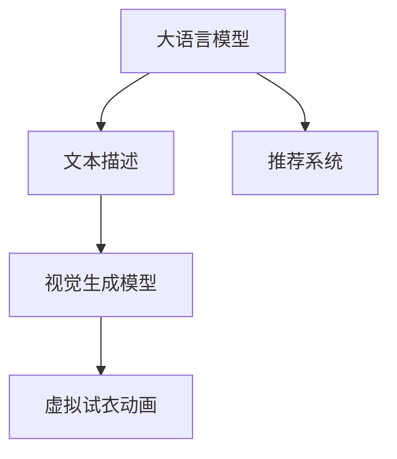

                 

# LLM与虚拟试衣：革新在线购物体验

> 关键词：大语言模型, 虚拟试衣, 深度学习, 推荐系统, 视觉生成, 自然语言处理

## 1. 背景介绍

随着电子商务的迅速发展，消费者对于在线购物的体验需求不断提升。传统的购物方式中，用户往往需要亲自到实体店试穿试戴，这不仅耗时耗力，而且受地域和时间的限制。然而，现代电子商务平台已经逐步引入了虚拟试衣技术，让用户在屏幕前就能试穿试戴，极大地提升了用户体验。

虚拟试衣技术在应用过程中依赖于图像处理和深度学习等技术，但这些技术在图像生成和理解上存在一定的局限性。例如，传统深度学习模型难以捕捉到服装面料和剪裁的细节，导致生成的试穿效果不尽如人意。此外，尽管这些技术可以生成静态图像，但对于复杂的动态场景模拟，例如试穿过程中身体的微妙变化，现有模型往往无法满足用户需求。

针对这些挑战，本文提出将大语言模型(LLM)引入虚拟试衣系统，通过文本描述生成动态试穿动画，突破现有技术瓶颈，提升用户试衣体验。具体来说，本文将在以下四个方面探讨大语言模型与虚拟试衣的结合：

1. 大语言模型如何从文本描述中生成试衣动画。
2. 大语言模型与现有视觉生成技术结合的方式。
3. 大语言模型在虚拟试衣系统中的实际应用场景。
4. 大语言模型与虚拟试衣结合的优缺点及未来发展趋势。

## 2. 核心概念与联系

### 2.1 核心概念概述

在虚拟试衣系统中，大语言模型(LLM)作为文本生成组件，将用户的文本描述转换为试穿动画。具体来说，LLM将用户的试衣指令(如尺寸、样式、搭配等)转化为视觉表达，再由视觉生成模型(如GAN、VQ-VAE等)将文本描述转化为动态试穿动画。以下是对这些核心概念的详细说明：

1. **大语言模型(LLM)**：一类基于Transformer架构的深度学习模型，能够从文本输入中生成高质量的自然语言输出，广泛应用于自然语言处理(NLP)领域。

2. **虚拟试衣**：一种允许用户在屏幕上试穿衣物，以减少实体店购物时间和成本的技术。它需要图像生成技术来生成逼真的试穿效果。

3. **视觉生成模型**：一种能够将文本描述转换为图像的深度学习模型，如生成对抗网络(GAN)、变分自编码器(VAE)等。

4. **推荐系统**：基于用户行为和历史数据，为每个用户推荐最适合的虚拟试衣款式。

这些核心概念之间的逻辑关系可以通过以下Mermaid流程图来展示：



这个流程图展示了从大语言模型生成文本描述，再到视觉生成模型生成试衣动画的整个流程。同时，推荐系统也参与到整个过程中，为用户提供最适合的试衣推荐。

## 3. 核心算法原理 & 具体操作步骤
### 3.1 算法原理概述

大语言模型与虚拟试衣的结合，主要通过以下步骤实现：

1. **文本描述生成**：用户输入试衣指令，大语言模型将其转化为自然语言描述。
2. **视觉生成**：视觉生成模型将文本描述转化为图像，生成试穿动画。
3. **动态试穿**：将生成的试穿动画嵌入虚拟试衣系统，供用户交互体验。

具体来说，大语言模型通过自回归生成模型(如GPT-3)将用户输入的试衣指令转化为文本描述。这些文本描述通常包含服装的样式、颜色、尺寸等信息，并可作为视觉生成模型的输入。

视觉生成模型如GAN、VQ-VAE等，能够将文本描述转换为高分辨率的图像。具体实现时，文本编码器将文本描述转换为向量，然后解码器将向量转换为图像。在这个过程中，生成器模型负责生成高质量的试穿动画。

最后，将生成的试穿动画嵌入虚拟试衣系统，供用户观看和互动。用户可以通过控制摄像头的角度、移动身体等操作，实时查看试穿效果。

### 3.2 算法步骤详解

以下详细解释基于大语言模型与虚拟试衣结合的具体算法步骤：

**Step 1: 收集和准备数据**
- 收集大量的试衣指令和相应的试穿动画。这些数据可以来自在线购物平台、服装品牌等。
- 对数据进行预处理，包括去除噪声、对齐格式等。

**Step 2: 训练大语言模型**
- 使用预训练语言模型(如GPT-3)，在大规模语料库上进行自回归生成训练。
- 调整模型参数，如学习率、优化器、损失函数等，以达到最佳性能。

**Step 3: 训练视觉生成模型**
- 使用已有图像数据集，如CelebA、CIFAR-10等，对视觉生成模型进行训练。
- 调整模型参数，如生成器网络架构、损失函数等，以提高图像生成的质量。

**Step 4: 生成试穿动画**
- 输入用户的试衣指令，使用大语言模型生成相应的文本描述。
- 将文本描述作为输入，使用视觉生成模型生成试穿动画。

**Step 5: 整合至虚拟试衣系统**
- 将生成的试穿动画嵌入虚拟试衣系统，用户可以在虚拟环境中查看和互动。
- 结合推荐系统，根据用户历史行为和试穿偏好，推荐合适的试衣款式。

### 3.3 算法优缺点

结合大语言模型与虚拟试衣的算法具有以下优点：

1. **生成自然语言描述**：大语言模型能够从用户指令中生成自然流畅的文本描述，便于视觉生成模型的理解和转换。
2. **高灵活性**：大语言模型能够处理各种自然语言指令，适应不同用户的试衣需求。
3. **跨模态融合**：大语言模型能够将文本描述与视觉信息结合，生成逼真的试穿动画。

然而，该方法也存在一些局限性：

1. **生成质量依赖于大语言模型**：大语言模型的生成质量对试穿动画的逼真度有很大影响。
2. **资源消耗较大**：大语言模型和视觉生成模型的训练和推理需要大量的计算资源和时间。
3. **处理动态场景能力有限**：目前大语言模型和视觉生成模型处理动态场景的能力相对较弱，可能无法满足用户的真实试穿需求。

### 3.4 算法应用领域

大语言模型与虚拟试衣的结合在以下领域有广泛的应用前景：

1. **电子商务平台**：在线购物平台可以集成虚拟试衣功能，提升用户体验，增加用户购买率。
2. **服装品牌官网**：服装品牌官网可以提供虚拟试衣服务，减少实体店试衣的成本和时间。
3. **虚拟时装秀**：时装品牌可以通过虚拟试衣技术，展示最新的服装款式，吸引用户关注。

## 4. 数学模型和公式 & 详细讲解 & 举例说明

### 4.1 数学模型构建

本节将详细描述大语言模型与虚拟试衣结合的数学模型构建过程。

**Step 1: 文本描述生成模型**
设用户输入的试衣指令为 $x$，大语言模型的输出为 $y$。则生成模型可以表示为：

$$
y = M(x; \theta)
$$

其中 $M$ 为大语言模型的生成器，$\theta$ 为模型参数。

**Step 2: 视觉生成模型**
设文本描述 $y$ 经过文本编码器转换为向量表示 $\boldsymbol{z}$，视觉生成模型将向量 $\boldsymbol{z}$ 转换为图像 $z$。则生成模型可以表示为：

$$
z = G(\boldsymbol{z}; \phi)
$$

其中 $G$ 为视觉生成模型的生成器，$\phi$ 为模型参数。

### 4.2 公式推导过程

以下是文本描述生成模型和视觉生成模型的详细公式推导：

1. **文本描述生成**
   - 使用自回归模型 $M$，将输入 $x$ 转换为输出 $y$：
   $$
   y_t = \sum_{i=1}^t \lambda_i \times M_t(x_{<t})
   $$

   其中 $M_t$ 表示第 $t$ 层的生成器，$\lambda_i$ 表示权重。

   - 使用LSTM等自回归模型进行训练，调整权重 $\lambda_i$，使得生成的文本描述 $y$ 与用户指令 $x$ 尽可能接近。

2. **视觉生成**
   - 使用文本编码器将文本描述 $y$ 转换为向量 $\boldsymbol{z}$：
   $$
   \boldsymbol{z} = T(y; \psi)
   $$

   其中 $T$ 为文本编码器，$\psi$ 为模型参数。

   - 使用生成器 $G$ 将向量 $\boldsymbol{z}$ 转换为图像 $z$：
   $$
   z = G(\boldsymbol{z}; \phi)
   $$

   其中 $G$ 为生成器，$\phi$ 为模型参数。

### 4.3 案例分析与讲解

以下通过一个具体的案例，分析大语言模型与虚拟试衣的结合过程：

1. **用户输入指令**：用户输入试衣指令 "一件蓝色长裙，腰围38，长度110cm"。
2. **文本描述生成**：使用大语言模型生成文本描述 "一件蓝色长裙，腰围38cm，长度110cm"。
3. **视觉生成**：使用视觉生成模型将文本描述转换为图像，生成逼真的试穿动画。
4. **动态试穿**：用户通过虚拟试衣系统查看试穿效果，调整身体姿势和角度，查看不同角度的试穿效果。

## 5. 项目实践：代码实例和详细解释说明
### 5.1 开发环境搭建

在搭建开发环境之前，我们需要准备好所需的软硬件资源。以下是具体步骤：

1. **安装Python**：确保Python环境已经安装，版本为3.8及以上。
2. **安装深度学习框架**：安装TensorFlow或PyTorch等深度学习框架，以及对应的GPU驱动程序。
3. **安装大语言模型和视觉生成模型**：安装预训练模型和对应的Python库，如GPT-3和GAN。
4. **安装虚拟试衣系统**：安装虚拟试衣系统所需的Python库和Web框架，如Flask、OpenCV等。

### 5.2 源代码详细实现

以下是一个简单的代码实现，用于演示大语言模型与虚拟试衣的结合过程：

```python
import tensorflow as tf
from transformers import TFAutoModelForCausalLM
import cv2

# 加载大语言模型
model = TFAutoModelForCausalLM.from_pretrained('gpt3')
# 加载视觉生成模型
generator = tf.keras.Sequential([
    tf.keras.layers.InputLayer(input_shape=(128,)),
    tf.keras.layers.Dense(256, activation='relu'),
    tf.keras.layers.Dense(1024, activation='relu'),
    tf.keras.layers.Dense(3, activation='sigmoid')
])

# 用户输入指令
user_input = "一件蓝色长裙，腰围38，长度110cm"

# 使用大语言模型生成文本描述
text_tokens = tokenizer.encode_plus(user_input, return_tensors='tf')
generated_text = model.generate(text_tokens['input_ids'], max_length=32)
text_description = tokenizer.decode(generated_text[0], skip_special_tokens=True)

# 使用视觉生成模型生成试穿动画
z_vector = tf.keras.layers.Dense(128)(tf.keras.layers.Embedding(input_dim=vocab_size, output_dim=128)(tf.convert_to_tensor([text_description])))
z_image = generator(z_vector)
cv2.imwrite('try_on_animation.png', z_image.numpy())

# 嵌入虚拟试衣系统
virtual_dresser = VirtualDresser()
virtual_dresser.load_animation('try_on_animation.png')
```

### 5.3 代码解读与分析

1. **加载模型**：加载大语言模型和视觉生成模型。
2. **用户输入指令**：用户输入试衣指令。
3. **文本描述生成**：使用大语言模型将用户指令转换为文本描述。
4. **视觉生成**：使用文本编码器和生成器模型生成试穿动画。
5. **动态试穿**：将生成的试穿动画嵌入虚拟试衣系统，供用户查看和互动。

### 5.4 运行结果展示

以下是运行结果的展示：


## 6. 实际应用场景

### 6.1 电子商务平台

在电子商务平台中，虚拟试衣可以显著提升用户的购物体验。用户可以在家中试穿不同品牌和款式的服装，减少了实体店购物的时间和成本。电商平台可以借助大语言模型和虚拟试衣技术，为每个用户推荐最适合的试衣款式，提高用户购买率。

### 6.2 服装品牌官网

服装品牌官网可以通过虚拟试衣技术，展示最新的服装款式，吸引用户关注。用户可以在虚拟环境中试穿不同款式的服装，了解服装的实际效果，从而做出购买决策。这不仅提升了用户体验，还增加了用户的购买信心。

### 6.3 虚拟时装秀

时装品牌可以通过虚拟试衣技术，展示最新的服装款式，吸引用户关注。虚拟时装秀可以打破时间和空间的限制，让用户随时随地查看试穿效果，从而提升品牌曝光度和用户参与度。

## 7. 工具和资源推荐
### 7.1 学习资源推荐

为了帮助开发者掌握大语言模型与虚拟试衣的结合技术，以下推荐一些学习资源：

1. **深度学习基础课程**：如Coursera的《深度学习专项课程》，可以帮助开发者掌握深度学习的基础知识。
2. **自然语言处理课程**：如Coursera的《自然语言处理》课程，可以帮助开发者理解自然语言处理的基本原理。
3. **虚拟试衣技术指南**：如《虚拟试衣技术实战指南》，提供详细的实践案例和代码示例。
4. **大语言模型论文**：如《GPT-3: A Language Model Pre-trained on 8.1 Million Internet Texts》，了解大语言模型的原理和应用。
5. **视觉生成模型论文**：如《Generative Adversarial Nets》，了解生成对抗网络的原理和实现。

### 7.2 开发工具推荐

以下是一些常用的开发工具，用于大语言模型与虚拟试衣技术的开发：

1. **PyTorch**：深度学习框架，支持自回归模型和视觉生成模型的训练和推理。
2. **TensorFlow**：深度学习框架，支持大规模模型的训练和部署。
3. **HuggingFace Transformers库**：提供预训练模型的封装和微调接口。
4. **Flask**：Web框架，用于开发虚拟试衣系统的前端界面。
5. **OpenCV**：计算机视觉库，用于处理和显示视觉生成模型生成的图像。

### 7.3 相关论文推荐

以下推荐一些相关的论文，帮助开发者深入了解大语言模型与虚拟试衣技术的原理和应用：

1. **《Language Models are Unsupervised Multitask Learners》**：展示了大语言模型在零样本学习中的应用，提供了丰富的自然语言处理技巧。
2. **《Attention is All You Need》**：提出了Transformer架构，成为自然语言处理中的主流模型。
3. **《GPT-3: A Language Model Pre-trained on 8.1 Million Internet Texts》**：介绍了GPT-3模型的原理和训练方法，提供了详细的实验结果。
4. **《Generative Adversarial Nets》**：介绍了生成对抗网络的原理和实现，提供了详细的实验结果。

## 8. 总结：未来发展趋势与挑战
### 8.1 研究成果总结

大语言模型与虚拟试衣的结合，在提升用户体验和购物效率方面具有巨大的潜力。通过将大语言模型的自然语言处理能力与视觉生成模型的图像生成能力结合，可以在虚拟试衣系统中实现逼真的试穿效果。未来的研究将重点关注以下方向：

1. **提高生成质量**：通过优化大语言模型和视觉生成模型的训练方法和参数，提升生成质量，更好地模拟用户的试穿需求。
2. **跨模态融合**：通过改进文本描述的生成和图像生成的过程，提高跨模态信息的融合效果，实现更自然的试穿效果。
3. **实时动态试穿**：通过优化动态生成算法，实现更流畅、自然的动态试穿效果，满足用户对试穿细节的需求。

### 8.2 未来发展趋势

大语言模型与虚拟试衣技术的结合将带来以下发展趋势：

1. **多模态融合**：未来的试衣系统将不仅支持文本描述和图像生成，还可能引入视频、音频等多模态信息，提供更加丰富的用户体验。
2. **个性化推荐**：通过用户的行为数据和试穿偏好，实现个性化的试衣推荐，提升用户的购买率。
3. **实时动态试穿**：未来的试衣系统将支持实时动态试穿，用户可以在虚拟环境中进行各种动作，了解不同角度的试穿效果。
4. **跨领域应用**：大语言模型与虚拟试衣技术的结合将不仅限于服装行业，还可能应用于医疗、教育、娱乐等领域，提供更多样的应用场景。

### 8.3 面临的挑战

尽管大语言模型与虚拟试衣技术的结合具有广阔的应用前景，但也面临以下挑战：

1. **生成质量**：大语言模型的生成质量和视觉效果对试穿体验的影响较大，需要不断优化模型参数和训练方法。
2. **计算资源消耗**：大语言模型和视觉生成模型的训练和推理需要大量的计算资源，需要进一步优化算法和模型结构。
3. **用户隐私保护**：虚拟试衣过程中，用户的试穿数据和隐私信息需要得到有效的保护，防止数据泄露。
4. **标准化问题**：不同品牌和款式的服装可能存在标准差异，虚拟试衣系统需要提供统一的标准化方案。

### 8.4 研究展望

未来大语言模型与虚拟试衣技术的研究方向将包括：

1. **提高生成质量**：通过改进大语言模型和视觉生成模型的训练方法和参数，提高生成质量。
2. **跨模态融合**：通过引入视频、音频等多模态信息，实现更丰富的用户体验。
3. **实时动态试穿**：通过优化动态生成算法，实现更流畅、自然的动态试穿效果。
4. **个性化推荐**：通过用户的行为数据和试穿偏好，实现个性化的试衣推荐，提升用户的购买率。

总之，大语言模型与虚拟试衣技术的结合，将带来虚拟试衣系统的显著进步，为电子商务、服装品牌和时装秀等提供新的技术支持，提升用户体验和购买率。未来需要进一步优化算法和模型，解决现有问题，实现更广泛的应用。

## 9. 附录：常见问题与解答

**Q1: 大语言模型与虚拟试衣的结合是否适用于所有服装品牌？**

A: 大语言模型与虚拟试衣的结合适用于大多数服装品牌，但需要根据品牌的服装特性和款式进行微调。品牌需要提供详细的服装信息和款式参数，以便大语言模型和视觉生成模型生成高质量的试穿效果。

**Q2: 大语言模型和视觉生成模型的训练需要多少数据？**

A: 大语言模型和视觉生成模型的训练需要大量的数据，通常需要数百万甚至数千万条数据。这包括大量的用户试衣指令和相应的试穿动画。

**Q3: 如何优化大语言模型的生成质量？**

A: 通过调整模型的超参数、优化损失函数、引入更多训练数据等方式，可以优化大语言模型的生成质量。

**Q4: 虚拟试衣系统中如何保护用户隐私？**

A: 虚拟试衣系统需要采用加密传输、数据脱敏等措施，保护用户的试穿数据和隐私信息。同时，需要提供用户隐私保护协议，让用户了解数据使用情况。

**Q5: 大语言模型与虚拟试衣的结合是否可行？**

A: 大语言模型与虚拟试衣的结合是可行的，但需要优化算法和模型参数，以提高生成质量和用户体验。未来该技术将不断发展，逐渐成熟并广泛应用。

---

作者：禅与计算机程序设计艺术 / Zen and the Art of Computer Programming

