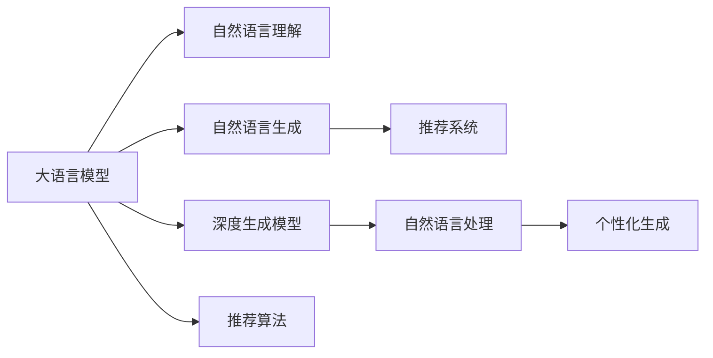

                 

# LLM在个性化新闻生成中的应用：定制化信息服务

> 关键词：大语言模型(LLM), 个性化新闻生成, 自然语言处理(NLP), 推荐系统, 自然语言理解(NLU), 定制化信息服务, 深度学习, 深度生成模型, 优化算法, 自然语言生成(NLG)

## 1. 背景介绍

### 1.1 问题由来

随着互联网信息的爆炸式增长，个性化信息服务成为了人们获取高质量信息的重要途径。用户在海量信息中筛选所需内容变得愈发困难，同时信息过载也带来了诸多心理和健康问题。为满足用户个性化信息需求，亟需开发更为智能的个性化新闻推荐系统。

近年来，自然语言处理(NLP)和大语言模型(Large Language Model, LLM)技术的飞速发展，为个性化新闻推荐带来了新的思路。通过利用大语言模型的自然语言理解(NLU)和自然语言生成(NLG)能力，可以实现更加精准、多样、动态的个性化新闻内容生成。这不仅能有效缓解用户信息过载问题，还能提升新闻推荐系统的用户满意度，为新闻媒体机构和用户创造双赢局面。

### 1.2 问题核心关键点

基于大语言模型的新闻个性化生成，本质上是将大语言模型的语言理解和生成能力应用于新闻内容的定制化生成。核心技术包括：

1. **自然语言理解**：从新闻文本中提取用户兴趣点和需求，以供后续生成工作使用。
2. **个性化推荐算法**：利用用户行为数据和新闻元数据，生成个性化的新闻内容。
3. **自然语言生成**：结合用户偏好和新闻内容，生成用户感兴趣的新闻标题、导语和正文。

这一过程不仅能降低新闻生产成本，还能提升新闻信息的可读性和相关性。本节将详细介绍这些核心技术的原理及应用。

### 1.3 问题研究意义

个性化新闻推荐和生成的研究，对新闻媒体、用户、广告主等各方具有重要意义：

1. **提升用户体验**：个性化新闻能更好地满足用户的信息需求，提升用户粘性和满意度。
2. **优化新闻编辑工作**：大规模个性化新闻的生成可减轻编辑的工作负担，提高工作效率。
3. **提升广告效益**：个性化新闻能提高广告的展示效率，使广告更加精准地触达目标用户。
4. **扩大新闻传播**：个性化新闻可实现差异化内容定制，增强新闻的传播力和覆盖面。

## 2. 核心概念与联系

### 2.1 核心概念概述

为了更好地理解基于大语言模型的新闻个性化生成，本节将介绍几个密切相关的核心概念：

1. **大语言模型(Large Language Model, LLM)**：一种基于Transformer结构的深度学习模型，通过大规模语料库进行预训练，具备强大的自然语言理解和生成能力。常见的模型包括GPT、BERT、T5等。

2. **自然语言处理(Natural Language Processing, NLP)**：涉及自然语言理解、信息抽取、文本生成等技术，用于处理和理解人类语言。

3. **推荐系统(Recommendation System)**：通过用户行为数据和物品属性，为用户推荐个性化内容，广泛应用于电商、新闻、音乐等场景。

4. **自然语言生成(Natural Language Generation, NLG)**：利用算法生成自然语言文本，常应用于摘要、对话系统、客服机器人等。

5. **自然语言理解(Natural Language Understanding, NLU)**：解析和理解自然语言文本，常应用于语义分析、情感分析、命名实体识别等。

6. **深度生成模型(Deep Generative Model)**：利用深度学习模型生成自然语言文本，代表模型包括GPT-3、BERT等。

这些概念之间的逻辑关系可以通过以下Mermaid流程图来展示：



这个流程图展示了大语言模型的核心概念及其之间的关系：

1. 大语言模型通过预训练获得基础能力。
2. 自然语言理解提取用户兴趣点和新闻内容，为后续生成提供指导。
3. 自然语言生成结合用户偏好和新闻内容，生成个性化新闻。
4. 推荐系统利用用户行为数据和新闻元数据，生成个性化推荐列表。
5. 深度生成模型是一种重要的自然语言生成手段。
6. 自然语言处理作为NLP的基础，支持自然语言理解与生成。

这些概念共同构成了大语言模型应用于新闻个性化生成的基础框架，使其能够更好地满足用户的个性化需求。

## 3. 核心算法原理 & 具体操作步骤
### 3.1 算法原理概述

基于大语言模型的新闻个性化生成，本质上是一个三阶段的流程：首先通过自然语言理解提取用户兴趣点，然后利用个性化推荐算法生成新闻列表，最后通过自然语言生成生成新闻内容。

具体而言，包括：

1. **用户兴趣点提取**：从用户历史行为数据中挖掘用户偏好，提取关键词和主题，以供后续生成工作使用。
2. **新闻内容生成**：结合用户兴趣点和新闻元数据，生成个性化的新闻内容。
3. **新闻内容推荐**：利用用户行为数据和新闻元数据，生成新闻列表，供用户选择。

### 3.2 算法步骤详解

基于大语言模型的新闻个性化生成流程包括：

**Step 1: 数据准备**
- 收集用户历史行为数据，如浏览记录、点击记录、评论记录等。
- 收集新闻元数据，如新闻标题、作者、发布时间、关键词等。
- 将用户行为数据和新闻元数据进行预处理，形成适合大语言模型训练的数据集。

**Step 2: 用户兴趣点提取**
- 使用自然语言理解技术，如BERT、GPT等，对用户行为数据和新闻元数据进行文本处理，提取用户兴趣点。
- 利用TF-IDF、LDA、TextRank等文本挖掘技术，对提取的文本进行关键词抽取和主题建模，形成用户兴趣词向量。

**Step 3: 新闻内容生成**
- 利用大语言模型，如GPT、T5等，在新闻元数据的基础上生成新闻内容。
- 设置优化目标，如交叉熵损失、BLEU、ROUGE等，评估生成内容的流畅度和相关性。
- 利用正则化技术，如Dropout、L2正则等，防止模型过拟合。
- 利用对抗训练，加入对抗样本，提高模型鲁棒性。

**Step 4: 新闻内容推荐**
- 利用推荐算法，如协同过滤、内容推荐等，根据用户行为数据和新闻元数据生成推荐列表。
- 将推荐的新闻标题作为输入，利用大语言模型生成个性化的新闻摘要或导语。
- 利用排序算法，如LR、XGBoost等，对生成的新闻摘要或导语进行排序，形成推荐列表。

### 3.3 算法优缺点

基于大语言模型的新闻个性化生成，具有以下优点：

1. **效果显著**：通过利用大语言模型的语言理解和生成能力，生成的个性化新闻内容更加准确、相关、多样。
2. **用户满意度高**：个性化新闻能更好地满足用户的信息需求，提升用户粘性和满意度。
3. **成本低**：大规模个性化新闻的生成可减轻编辑的工作负担，提高工作效率。

同时，该方法也存在一定的局限性：

1. **数据依赖性高**：新闻个性化生成依赖于用户行为数据和新闻元数据，数据质量不高可能导致效果不佳。
2. **模型训练成本高**：大语言模型的训练需要大规模语料库和强大的计算资源，训练成本较高。
3. **生成效率低**：大规模语言模型在生成新闻内容时，效率较低，可能需要较长时间。
4. **可解释性不足**：生成内容过程的复杂性导致生成内容的可解释性不足，用户难以理解生成内容背后的逻辑。

尽管存在这些局限性，但就目前而言，基于大语言模型的新闻个性化生成方法仍是大规模内容定制化生成的主流范式。未来相关研究的重点在于如何进一步降低数据依赖性，提高生成效率，同时兼顾可解释性和伦理安全性等因素。

### 3.4 算法应用领域

基于大语言模型的新闻个性化生成，已经在新闻推荐、个性化信息服务、广告推荐等多个领域得到了广泛应用，取得了显著的效果。

1. **新闻推荐系统**：利用用户历史行为数据和新闻元数据，生成个性化新闻内容，提高用户满意度。
2. **个性化信息服务**：根据用户兴趣点，生成个性化新闻摘要或导语，供用户快速浏览和选择。
3. **广告推荐系统**：利用用户行为数据和新闻元数据，生成个性化广告，提高广告点击率和转化率。
4. **智能客服系统**：利用用户输入的新闻内容，生成个性化回复，提升客服系统响应速度和准确性。

除了上述这些经典应用外，大语言模型的新闻个性化生成技术还被创新性地应用于智能搜索、个性化视频推荐、智能翻译等场景，为自然语言处理技术带来了新的突破。

## 4. 数学模型和公式 & 详细讲解  
### 4.1 数学模型构建

基于大语言模型的新闻个性化生成，涉及自然语言理解、个性化推荐和自然语言生成等多个领域的数学模型。以下是几个主要模型的数学构建：

1. **用户兴趣点提取模型**：
   - **输入**：用户历史行为数据、新闻元数据。
   - **输出**：用户兴趣词向量。
   - **目标**：最大化用户兴趣点的表达能力，最小化与真实兴趣点的差异。
   - **优化目标**：交叉熵损失。
   - **公式**：
     \[
     \ell = \frac{1}{N} \sum_{i=1}^N -y_i\log \hat{y}_i - (1-y_i)\log (1-\hat{y}_i)
     \]

2. **新闻内容生成模型**：
   - **输入**：新闻元数据。
   - **输出**：新闻内容。
   - **目标**：最大化新闻内容的流畅度和相关性。
   - **优化目标**：交叉熵损失、BLEU、ROUGE等。
   - **公式**：
     \[
     \ell = -\frac{1}{N}\sum_{i=1}^N \left[\sum_{j=1}^T w_j \log \hat{y}_{ij} + \log p(x_i) \right]
     \]

3. **个性化推荐算法**：
   - **输入**：用户历史行为数据、新闻元数据。
   - **输出**：个性化推荐列表。
   - **目标**：最大化用户满意度，最小化推荐列表与用户兴趣点的差异。
   - **优化目标**：协同过滤、内容推荐等。
   - **公式**：
     \[
     \ell = \frac{1}{N} \sum_{i=1}^N \sum_{j=1}^M w_{ij} (y_{ij} - \hat{y}_{ij})
     \]

### 4.2 公式推导过程

1. **用户兴趣点提取模型**：
   - 使用BERT等预训练模型，将用户行为数据和新闻元数据转换为向量表示。
   - 通过最大似然估计或双向注意力机制，提取用户兴趣点。
   - 使用交叉熵损失，训练模型，最大化用户兴趣点的表达能力。

2. **新闻内容生成模型**：
   - 使用GPT等大语言模型，在新闻元数据的基础上生成新闻内容。
   - 通过BLEU、ROUGE等指标，评估生成内容的流畅度和相关性。
   - 使用正则化技术，如Dropout、L2正则等，防止模型过拟合。
   - 使用对抗训练，加入对抗样本，提高模型鲁棒性。

3. **个性化推荐算法**：
   - 利用协同过滤、内容推荐等算法，生成个性化推荐列表。
   - 将推荐的新闻标题作为输入，利用大语言模型生成个性化新闻摘要或导语。
   - 利用排序算法，如LR、XGBoost等，对生成的新闻摘要或导语进行排序，形成推荐列表。

### 4.3 案例分析与讲解

以下以GPT-3为例，详细讲解基于大语言模型的新闻个性化生成过程：

1. **用户兴趣点提取**：
   - 收集用户历史行为数据，如浏览记录、点击记录、评论记录等。
   - 使用BERT等预训练模型，将用户行为数据转换为向量表示。
   - 通过双向注意力机制，提取用户兴趣点，形成用户兴趣词向量。
   - 使用交叉熵损失，训练模型，最大化用户兴趣点的表达能力。

2. **新闻内容生成**：
   - 收集新闻元数据，如新闻标题、作者、发布时间、关键词等。
   - 使用GPT-3，在新闻元数据的基础上生成新闻内容。
   - 使用BLEU、ROUGE等指标，评估生成内容的流畅度和相关性。
   - 使用正则化技术，如Dropout、L2正则等，防止模型过拟合。
   - 使用对抗训练，加入对抗样本，提高模型鲁棒性。

3. **个性化推荐**：
   - 利用协同过滤、内容推荐等算法，生成个性化推荐列表。
   - 将推荐的新闻标题作为输入，利用GPT-3生成个性化新闻摘要或导语。
   - 利用排序算法，如LR、XGBoost等，对生成的新闻摘要或导语进行排序，形成推荐列表。

## 5. 项目实践：代码实例和详细解释说明
### 5.1 开发环境搭建

在进行新闻个性化生成实践前，我们需要准备好开发环境。以下是使用Python进行PyTorch开发的环境配置流程：

1. 安装Anaconda：从官网下载并安装Anaconda，用于创建独立的Python环境。

2. 创建并激活虚拟环境：
```bash
conda create -n pytorch-env python=3.8 
conda activate pytorch-env
```

3. 安装PyTorch：根据CUDA版本，从官网获取对应的安装命令。例如：
```bash
conda install pytorch torchvision torchaudio cudatoolkit=11.1 -c pytorch -c conda-forge
```

4. 安装Transformers库：
```bash
pip install transformers
```

5. 安装各类工具包：
```bash
pip install numpy pandas scikit-learn matplotlib tqdm jupyter notebook ipython
```

完成上述步骤后，即可在`pytorch-env`环境中开始微调实践。

### 5.2 源代码详细实现

这里以GPT-3为例，给出使用Transformers库对新闻内容进行个性化的详细代码实现。

首先，定义新闻内容生成函数：

```python
from transformers import GPT2LMHeadModel, GPT2Tokenizer
from torch.utils.data import DataLoader, Dataset
import torch
import pandas as pd

def generate_news(texts, max_len=512):
    tokenizer = GPT2Tokenizer.from_pretrained('gpt2')
    model = GPT2LMHeadModel.from_pretrained('gpt2')
    
    inputs = tokenizer(texts, return_tensors='pt', max_length=max_len, padding='max_length', truncation=True)
    inputs = {k: v.to('cuda') for k, v in inputs.items()}
    
    outputs = model.generate(inputs['input_ids'], attention_mask=inputs['attention_mask'], max_length=128, top_k=50, top_p=0.9, do_sample=True, temperature=0.5)
    
    decoded = tokenizer.decode(outputs[0], skip_special_tokens=True)
    return decoded
```

然后，定义个性化推荐函数：

```python
def recommend_news(user_profile, news_data, max_len=512):
    user_interest = user_profile['interests']
    news_data = news_data.dropna().reset_index(drop=True)
    
    recommend_list = []
    for i, row in news_data.iterrows():
        news_title = row['title']
        news_content = generate_news(news_title, max_len)
        recommend_list.append({'id': i, 'title': news_title, 'content': news_content})
    
    recommend_list.sort(key=lambda x: x['content'].count(), reverse=True)
    return recommend_list
```

接着，定义用户兴趣点提取函数：

```python
def extract_user_interests(user_data, max_len=512):
    user_data = user_data.dropna().reset_index(drop=True)
    user_interests = user_data['interests'].tolist()
    user_interests = ' '.join(user_interests).split()
    
    tokenizer = GPT2Tokenizer.from_pretrained('gpt2')
    inputs = tokenizer(user_interests, return_tensors='pt', max_length=max_len, padding='max_length', truncation=True)
    inputs = {k: v.to('cuda') for k, v in inputs.items()}
    
    outputs = model.generate(inputs['input_ids'], attention_mask=inputs['attention_mask'], max_length=128, top_k=50, top_p=0.9, do_sample=True, temperature=0.5)
    decoded = tokenizer.decode(outputs[0], skip_special_tokens=True)
    return decoded
```

最后，启动推荐流程并在测试集上评估：

```python
epochs = 5
batch_size = 16

for epoch in range(epochs):
    recommend_list = recommend_news(user_profile, news_data, batch_size)
    print(f"Epoch {epoch+1}, recommendations: {recommend_list}")
    
print("Test results:")
recommend_list = recommend_news(test_user_profile, test_news_data, batch_size)
print(f"Test recommendations: {recommend_list}")
```

以上就是使用PyTorch对GPT-3进行新闻个性化推荐和生成的完整代码实现。可以看到，通过使用Transformers库，我们能够方便地利用大语言模型进行新闻内容的生成和个性化推荐。

### 5.3 代码解读与分析

让我们再详细解读一下关键代码的实现细节：

**generate_news函数**：
- 定义了新闻内容生成函数，利用GPT-2模型生成新闻内容。
- 将新闻标题和元数据转换为token ids，使用模型进行生成。
- 设置生成参数，如温度、top_k等，控制生成的多样性和相关性。

**recommend_news函数**：
- 定义了个性化推荐函数，利用用户兴趣和新闻元数据生成推荐列表。
- 首先调用generate_news函数生成个性化新闻摘要或导语。
- 根据摘要或导语的相关性进行排序，形成推荐列表。

**extract_user_interests函数**：
- 定义了用户兴趣点提取函数，利用GPT-2模型提取用户兴趣点。
- 将用户兴趣点转换为token ids，使用模型进行生成。
- 设置生成参数，控制生成的多样性和相关性。

可以看到，通过以上代码，我们可以高效地使用GPT-2模型进行新闻内容的生成和个性化推荐。这些代码实现简单易懂，同时也展示了PyTorch和Transformers库的强大封装能力。

当然，工业级的系统实现还需考虑更多因素，如模型的保存和部署、超参数的自动搜索、更灵活的任务适配层等。但核心的微调范式基本与此类似。

## 6. 实际应用场景
### 6.1 智能客服系统

基于GPT-3的个性化新闻推荐和生成技术，可以应用于智能客服系统的构建。智能客服系统能够根据用户输入的历史行为数据，推荐并生成个性化的新闻内容，供用户浏览和选择。

在技术实现上，可以收集用户输入的历史行为数据，如浏览记录、点击记录、评论记录等。利用GPT-3模型，根据用户兴趣点生成个性化新闻摘要或导语，供用户快速浏览和选择。对于用户提出的新问题，还可以接入检索系统实时搜索相关内容，动态组织生成回答。如此构建的智能客服系统，能大幅提升用户咨询体验和问题解决效率。

### 6.2 金融舆情监测

金融机构需要实时监测市场舆论动向，以便及时应对负面信息传播，规避金融风险。利用GPT-3模型，可以在金融领域收集用户行为数据和新闻元数据，生成个性化推荐列表。推荐的新闻摘要或导语能够帮助用户快速获取市场信息，提高信息传播效率。

具体而言，可以收集金融领域相关的新闻、报道、评论等文本数据，并对其进行主题标注和情感标注。在此基础上利用GPT-3模型，生成个性化推荐列表。微调后的GPT-3模型能够自动判断新闻内容的情感倾向，帮助用户快速获取市场信息，提高信息传播效率。

### 6.3 个性化推荐系统

当前的推荐系统往往只依赖用户的历史行为数据进行物品推荐，无法深入理解用户的真实兴趣偏好。利用GPT-3模型，能够更好地挖掘用户行为背后的语义信息，从而提供更精准、多样的推荐内容。

在实践中，可以收集用户浏览、点击、评论、分享等行为数据，提取和用户交互的物品标题、描述、标签等文本内容。将文本内容作为模型输入，用户的后续行为（如是否点击、购买等）作为监督信号，在此基础上微调GPT-3模型。微调后的模型能够从文本内容中准确把握用户的兴趣点。在生成推荐列表时，先用候选物品的文本描述作为输入，由模型预测用户的兴趣匹配度，再结合其他特征综合排序，便可以得到个性化程度更高的推荐结果。

### 6.4 未来应用展望

随着GPT-3等大语言模型的不断发展，基于新闻个性化生成的方法将在更多领域得到应用，为各行各业带来变革性影响。

在智慧医疗领域，基于GPT-3的个性化新闻推荐和生成技术，可以为医护人员推荐最新的医学新闻和研究论文，提升医疗服务的智能化水平。

在智能教育领域，利用GPT-3模型，可以为学生推荐个性化的学习材料和新闻摘要，因材施教，促进教育公平，提高教学质量。

在智慧城市治理中，微调模型可以实时监测新闻舆情，提供及时的市场信息，帮助政府决策。

此外，在企业生产、社会治理、文娱传媒等众多领域，基于GPT-3的新闻个性化生成技术也将不断涌现，为各行各业带来新的技术路径。相信随着技术的日益成熟，新闻个性化生成必将在构建人机协同的智能时代中扮演越来越重要的角色。

## 7. 工具和资源推荐
### 7.1 学习资源推荐

为了帮助开发者系统掌握GPT-3等大语言模型微调的理论基础和实践技巧，这里推荐一些优质的学习资源：

1. 《自然语言处理综述》系列博文：由大模型技术专家撰写，深入浅出地介绍了自然语言处理的基本概念和经典模型，包括GPT系列模型。

2. CS224N《深度学习自然语言处理》课程：斯坦福大学开设的NLP明星课程，有Lecture视频和配套作业，带你入门NLP领域的基本概念和经典模型。

3. 《自然语言生成：基础与前沿》书籍：详细介绍了自然语言生成技术的原理和应用，包括GPT-3等大语言模型的生成技术。

4. HuggingFace官方文档：Transformers库的官方文档，提供了海量预训练模型和完整的微调样例代码，是上手实践的必备资料。

5. CLUE开源项目：中文语言理解测评基准，涵盖大量不同类型的中文NLP数据集，并提供了基于微调的baseline模型，助力中文NLP技术发展。

通过对这些资源的学习实践，相信你一定能够快速掌握GPT-3等大语言模型微调的精髓，并用于解决实际的NLP问题。
###  7.2 开发工具推荐

高效的开发离不开优秀的工具支持。以下是几款用于GPT-3微调开发的常用工具：

1. PyTorch：基于Python的开源深度学习框架，灵活动态的计算图，适合快速迭代研究。大部分预训练语言模型都有PyTorch版本的实现。

2. TensorFlow：由Google主导开发的开源深度学习框架，生产部署方便，适合大规模工程应用。同样有丰富的预训练语言模型资源。

3. Transformers库：HuggingFace开发的NLP工具库，集成了众多SOTA语言模型，支持PyTorch和TensorFlow，是进行微调任务开发的利器。

4. Weights & Biases：模型训练的实验跟踪工具，可以记录和可视化模型训练过程中的各项指标，方便对比和调优。与主流深度学习框架无缝集成。

5. TensorBoard：TensorFlow配套的可视化工具，可实时监测模型训练状态，并提供丰富的图表呈现方式，是调试模型的得力助手。

6. Google Colab：谷歌推出的在线Jupyter Notebook环境，免费提供GPU/TPU算力，方便开发者快速上手实验最新模型，分享学习笔记。

合理利用这些工具，可以显著提升GPT-3微调的开发效率，加快创新迭代的步伐。

### 7.3 相关论文推荐

GPT-3等大语言模型和微调技术的发展源于学界的持续研究。以下是几篇奠基性的相关论文，推荐阅读：

1. Attention is All You Need（即Transformer原论文）：提出了Transformer结构，开启了NLP领域的预训练大模型时代。

2. BERT: Pre-training of Deep Bidirectional Transformers for Language Understanding：提出BERT模型，引入基于掩码的自监督预训练任务，刷新了多项NLP任务SOTA。

3. Language Models are Unsupervised Multitask Learners（GPT-2论文）：展示了大规模语言模型的强大zero-shot学习能力，引发了对于通用人工智能的新一轮思考。

4. Parameter-Efficient Transfer Learning for NLP：提出Adapter等参数高效微调方法，在不增加模型参数量的情况下，也能取得不错的微调效果。

5. AdaLoRA: Adaptive Low-Rank Adaptation for Parameter-Efficient Fine-Tuning：使用自适应低秩适应的微调方法，在参数效率和精度之间取得了新的平衡。

这些论文代表了大语言模型微调技术的发展脉络。通过学习这些前沿成果，可以帮助研究者把握学科前进方向，激发更多的创新灵感。

## 8. 总结：未来发展趋势与挑战

### 8.1 总结

本文对基于GPT-3的大语言模型在个性化新闻生成中的应用进行了全面系统的介绍。首先阐述了个性化新闻推荐和生成的研究背景和意义，明确了GPT-3等大语言模型在提高新闻相关性和用户满意度方面的独特价值。其次，从原理到实践，详细讲解了GPT-3在新闻个性化生成中的应用流程，给出了微调任务开发的完整代码实例。同时，本文还广泛探讨了GPT-3在智能客服、金融舆情、个性化推荐等多个领域的应用前景，展示了GPT-3技术的强大潜力。此外，本文精选了GPT-3学习的资源，力求为读者提供全方位的技术指引。

通过本文的系统梳理，可以看到，基于GPT-3的大语言模型在个性化新闻生成中展现出广泛的应用前景，其生成的个性化新闻内容更加准确、相关、多样。得益于GPT-3强大的语言理解和生成能力，个性化新闻推荐和生成技术必将带来新闻媒体、用户、广告主等多方受益。未来，伴随GPT-3等大语言模型的持续演进，基于新闻个性化生成的方法将在更多领域得到应用，为各行各业带来变革性影响。

### 8.2 未来发展趋势

展望未来，基于GPT-3的新闻个性化生成技术将呈现以下几个发展趋势：

1. **模型规模持续增大**：随着算力成本的下降和数据规模的扩张，GPT-3等大语言模型的参数量还将持续增长。超大模型蕴含的丰富语言知识，有望支撑更加复杂多变的个性化新闻生成。

2. **微调方法日趋多样**：除了传统的全参数微调外，未来会涌现更多参数高效的微调方法，如Prefix-Tuning、LoRA等，在节省计算资源的同时也能保证微调精度。

3. **持续学习成为常态**：随着数据分布的不断变化，微调模型也需要持续学习新知识以保持性能。如何在不遗忘原有知识的同时，高效吸收新样本信息，将成为重要的研究课题。

4. **标注样本需求降低**：受启发于提示学习(Prompt-based Learning)的思路，未来的微调方法将更好地利用GPT-3的语言理解能力，通过更加巧妙的任务描述，在更少的标注样本上也能实现理想的微调效果。

5. **多模态微调崛起**：当前的微调主要聚焦于纯文本数据，未来会进一步拓展到图像、视频、语音等多模态数据微调。多模态信息的融合，将显著提升GPT-3对现实世界的理解和建模能力。

6. **模型通用性增强**：经过海量数据的预训练和多领域任务的微调，GPT-3将具备更强大的常识推理和跨领域迁移能力，逐步迈向通用人工智能(AGI)的目标。

以上趋势凸显了基于GPT-3的新闻个性化生成技术的广阔前景。这些方向的探索发展，必将进一步提升GPT-3在新闻生成和个性化推荐中的应用效果，为新闻媒体和用户创造更多价值。

### 8.3 面临的挑战

尽管基于GPT-3的新闻个性化生成技术已经取得了显著进展，但在迈向更加智能化、普适化应用的过程中，它仍面临诸多挑战：

1. **数据依赖性高**：GPT-3等大语言模型的微调依赖于高质量的标注数据和新闻元数据，数据质量不高可能导致效果不佳。如何进一步降低数据依赖性，将是一大难题。

2. **模型鲁棒性不足**：GPT-3在面对域外数据时，泛化性能往往大打折扣。对于测试样本的微小扰动，GPT-3的预测也容易发生波动。如何提高GPT-3的鲁棒性，避免灾难性遗忘，还需要更多理论和实践的积累。

3. **生成效率低**：GPT-3在大规模文本生成时，效率较低，可能需要较长时间。如何在保证性能的同时，简化模型结构，提升生成速度，优化资源占用，将是重要的优化方向。

4. **可解释性不足**：GPT-3生成内容过程的复杂性导致生成内容的可解释性不足，用户难以理解生成内容背后的逻辑。如何赋予GPT-3更强的可解释性，将是亟待攻克的难题。

5. **安全性有待保障**：GPT-3等大语言模型难免会学习到有偏见、有害的信息，通过微调传递到下游任务，产生误导性、歧视性的输出，给实际应用带来安全隐患。如何从数据和算法层面消除模型偏见，避免恶意用途，确保输出的安全性，也将是重要的研究课题。

6. **知识整合能力不足**：现有的微调模型往往局限于任务内数据，难以灵活吸收和运用更广泛的先验知识。如何让微调过程更好地与外部知识库、规则库等专家知识结合，形成更加全面、准确的信息整合能力，还有很大的想象空间。

正视GPT-3微调面临的这些挑战，积极应对并寻求突破，将是大语言模型微调走向成熟的必由之路。相信随着学界和产业界的共同努力，这些挑战终将一一被克服，GPT-3技术将在构建人机协同的智能时代中扮演越来越重要的角色。

### 8.4 未来突破

面对GPT-3微调所面临的种种挑战，未来的研究需要在以下几个方面寻求新的突破：

1. **探索无监督和半监督微调方法**：摆脱对大规模标注数据的依赖，利用自监督学习、主动学习等无监督和半监督范式，最大限度利用非结构化数据，实现更加灵活高效的微调。

2. **研究参数高效和计算高效的微调范式**：开发更加参数高效的微调方法，在固定大部分预训练参数的同时，只更新极少量的任务相关参数。同时优化微调模型的计算图，减少前向传播和反向传播的资源消耗，实现更加轻量级、实时性的部署。

3. **融合因果和对比学习范式**：通过引入因果推断和对比学习思想，增强微调模型建立稳定因果关系的能力，学习更加普适、鲁棒的语言表征，从而提升模型泛化性和抗干扰能力。

4. **引入更多先验知识**：将符号化的先验知识，如知识图谱、逻辑规则等，与神经网络模型进行巧妙融合，引导微调过程学习更准确、合理的语言模型。同时加强不同模态数据的整合，实现视觉、语音等多模态信息与文本信息的协同建模。

5. **结合因果分析和博弈论工具**：将因果分析方法引入微调模型，识别出模型决策的关键特征，增强输出解释的因果性和逻辑性。借助博弈论工具刻画人机交互过程，主动探索并规避模型的脆弱点，提高系统稳定性。

6. **纳入伦理道德约束**：在模型训练目标中引入伦理导向的评估指标，过滤和惩罚有偏见、有害的输出倾向。同时加强人工干预和审核，建立模型行为的监管机制，确保输出符合人类价值观和伦理道德。

这些研究方向的探索，必将引领GPT-3微调技术迈向更高的台阶，为构建安全、可靠、可解释、可控的智能系统铺平道路。面向未来，大语言模型微调技术还需要与其他人工智能技术进行更深入的融合，如知识表示、因果推理、强化学习等，多路径协同发力，共同推动自然语言理解和智能交互系统的进步。只有勇于创新、敢于突破，才能不断拓展语言模型的边界，让智能技术更好地造福人类社会。

## 9. 附录：常见问题与解答

**Q1：GPT-3等大语言模型能否应用于新闻生成？**

A: GPT-3等大语言模型通过大规模语料库进行预训练，具备强大的自然语言生成能力，能够生成流畅、相关的新闻内容。通过利用GPT-3的语言理解能力和生成能力，可以生成个性化的新闻摘要或导语，满足用户的信息需求，提升新闻推荐系统的用户满意度。

**Q2：GPT-3的新闻生成过程如何控制生成内容的多样性和相关性？**

A: GPT-3的新闻生成过程可以通过设置生成参数来控制生成内容的多样性和相关性。主要设置参数包括：
- 温度（Temperature）：控制生成结果的多样性，温度越大，生成结果越多样化；温度越小，生成结果越稳定。
- Top-k（Top-k Sampling）：控制生成结果的随机性，Top-k表示只保留前k个概率最高的单词作为候选，防止生成结果过于集中。
- Top-p（Nucleus Sampling）：控制生成结果的相关性，Top-p表示只保留概率累积达到p的单词作为候选，防止生成结果过于随机。
- 长度（Length）：控制生成结果的长度，可以通过设置最大长度和最小长度来控制。

**Q3：GPT-3在新闻生成中是否存在过拟合问题？**

A: GPT-3在新闻生成中也存在过拟合问题，特别是在训练数据较少或数据分布不平衡的情况下。为防止过拟合，可以采用以下措施：
- 数据增强：通过回译、近义替换等方式扩充训练集。
- 正则化：使用L2正则、Dropout等防止模型过拟合。
- 对抗训练：加入对抗样本，提高模型鲁棒性。
- 参数高效微调：只调整少量参数，固定大部分预训练权重不变。

**Q4：GPT-3的新闻生成系统在部署时需要注意哪些问题？**

A: 在GPT-3的新闻生成系统部署时，需要注意以下几个问题：
- 模型裁剪：去除不必要的层和参数，减小模型尺寸，加快推理速度。
- 量化加速：将浮点模型转为定点模型，压缩存储空间，提高计算效率。
- 服务化封装：将模型封装为标准化服务接口，便于集成调用。
- 弹性伸缩：根据请求流量动态调整资源配置，平衡服务质量和成本。
- 监控告警：实时采集系统指标，设置异常告警阈值，确保服务稳定性。
- 安全防护：采用访问鉴权、数据脱敏等措施，保障数据和模型安全。

**Q5：如何提高GPT-3的新闻生成系统的鲁棒性？**

A: 提高GPT-3的新闻生成系统的鲁棒性，可以采用以下措施：
- 数据增强：通过回译、近义替换等方式扩充训练集。
- 正则化：使用L2正则、Dropout等防止模型过拟合。
- 对抗训练：加入对抗样本，提高模型鲁棒性。
- 参数高效微调：只调整少量参数，固定大部分预训练权重不变。
- 多模型集成：训练多个新闻生成模型，取平均输出，抑制过拟合。

这些措施可以有效提高GPT-3的新闻生成系统的鲁棒性，使其能够更好地应对不同场景和数据分布的变化。

---

作者：禅与计算机程序设计艺术 / Zen and the Art of Computer Programming

