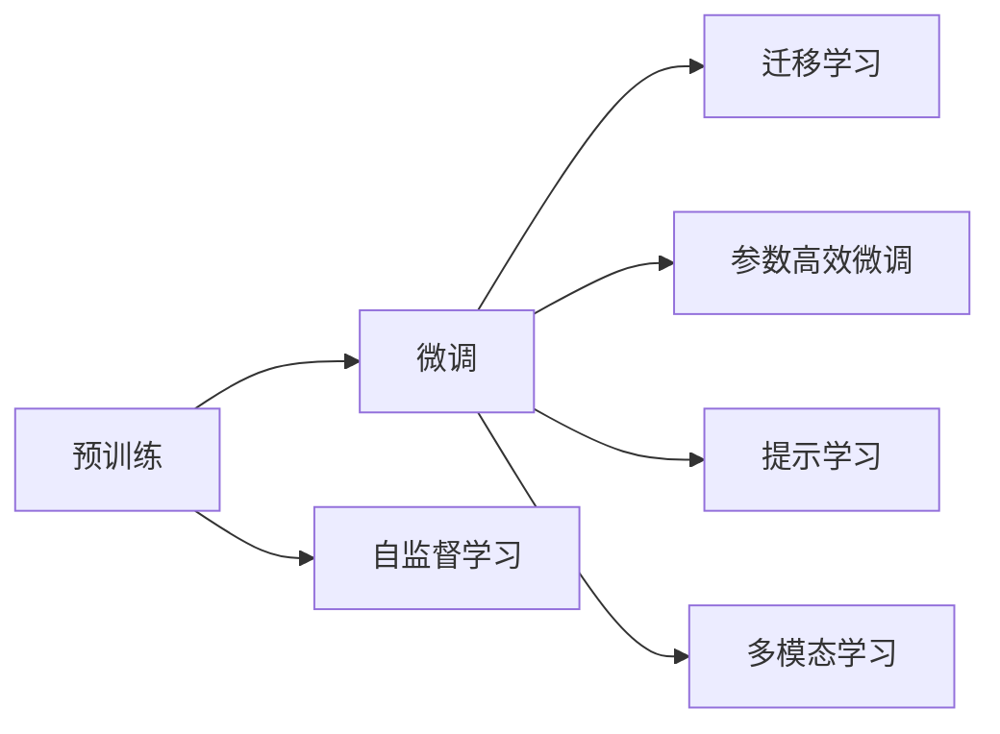
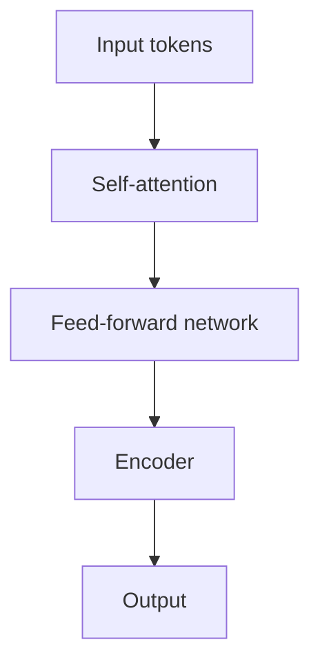
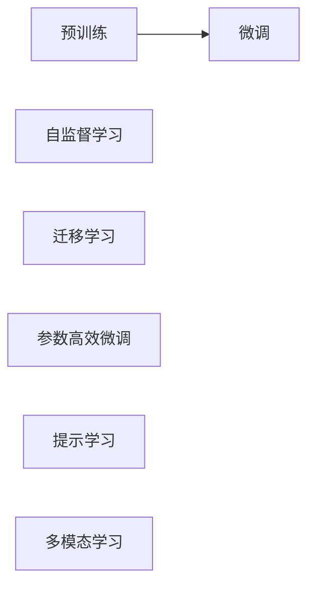

                 

# LLM在人工智能领域的地位与作用

大语言模型（Large Language Models，LLMs）在人工智能（AI）领域的地位与作用正日益凸显，已经成为推动AI发展的重要驱动力。本文将全面探讨LLMs的核心概念、关键原理、具体操作步骤，并结合具体案例展示其在实际应用中的巨大潜力。通过深入分析LLMs的数学模型、开发实践及未来发展趋势，本文旨在帮助读者系统理解LLMs在AI中的地位与作用，并探索其应用前景。

## 1. 背景介绍

### 1.1 问题由来

在过去的十年里，人工智能领域取得了显著的进展，深度学习技术特别是神经网络的广泛应用，使得AI系统在图像识别、语音处理、自然语言处理（NLP）等方面取得了突破性成果。其中，大语言模型作为新一代NLP技术的代表，凭借其强大的语言理解和生成能力，在学术界和工业界引发了广泛关注。

LLMs通过在海量文本数据上预训练，学习到复杂的语言知识，能够执行复杂的语言任务，如图篇生成、对话生成、问答系统等。这些模型通常拥有数十亿到数百亿的参数量，能够处理各种自然语言输入并产生连贯的输出。LLMs的出现，标志着NLP技术从简单的文本分类、情感分析等任务，向更加高级的交互式理解和生成任务迈进。

### 1.2 问题核心关键点

LLMs在AI领域的核心地位与作用主要体现在以下几个方面：

1. **广泛的语言能力**：LLMs具备强大的语言理解能力，能够处理各种语言形式和结构，适用于多种NLP任务。
2. **大规模数据需求**：预训练和微调需要大量数据，这要求有强大的计算资源和数据存储能力。
3. **复杂模型结构**：参数量庞大，模型结构复杂，需要高效的优化算法和训练策略。
4. **广泛应用场景**：LLMs在对话系统、智能客服、内容生成、知识图谱构建等多个领域都有广泛应用。
5. **高扩展性**：模型规模和性能可以动态扩展，适应不同的应用需求。

### 1.3 问题研究意义

探讨LLMs在AI领域的地位与作用，具有以下重要意义：

1. **推动AI技术进步**：LLMs在NLP领域的突破性成果，为AI技术发展提供了重要支撑。
2. **促进AI产业化**：LLMs在实际应用中的成功案例，为AI技术的产业化落地提供了典范。
3. **提高AI应用质量**：LLMs在多模态交互、推理能力等方面具有优势，提高了AI系统的综合能力。
4. **应对AI伦理挑战**：LLMs在可解释性、偏见消除、安全性等方面存在挑战，需要多学科的深入研究。

## 2. 核心概念与联系

### 2.1 核心概念概述

在探讨LLMs的地位与作用之前，首先需要理解其核心概念和相关技术。以下是几个关键概念：

- **大语言模型（LLMs）**：指通过大规模预训练学习自然语言表示的深度学习模型，如GPT、BERT等。
- **预训练（Pre-training）**：指在大规模无标签数据上训练模型，学习通用语言知识的过程。
- **微调（Fine-tuning）**：指在预训练模型的基础上，使用有标签数据进一步优化模型以适应特定任务的过程。
- **迁移学习（Transfer Learning）**：利用预训练模型的知识，在特定任务上进行微调，提升模型性能。
- **自监督学习（Self-supervised Learning）**：通过设计预训练任务，利用数据的内在关系进行无监督学习。
- **参数高效微调（Parameter-Efficient Fine-tuning, PEFT）**：只微调模型中的部分参数，以减少计算资源消耗。
- **提示学习（Prompt Learning）**：通过设计输入模板，引导模型生成或分类。
- **多模态学习（Multimodal Learning）**：结合图像、语音等多种模态信息进行学习。

这些概念通过以下Mermaid流程图展示：



这些概念共同构成了LLMs的核心技术框架，使得模型能够在大规模数据上学习到丰富的语言知识，并在特定任务上通过微调进一步提升性能。

### 2.2 核心概念原理和架构

LLMs通常采用Transformer架构，这是一种基于自注意力机制的神经网络结构。其核心原理是利用自注意力机制对输入序列进行编码，从而学习到长距离依赖关系。架构上，Transformer模型由多个编码器（Encoder）和解码器（Decoder）组成，其中编码器包含多个自注意力层和前馈神经网络层，解码器则只包含自注意力层和输出层。

以下是Transformer模型的一个简化架构图：



### 2.3 Mermaid流程图



## 3. 核心算法原理 & 具体操作步骤

### 3.1 算法原理概述

LLMs的核心算法原理主要基于自监督学习、迁移学习和微调技术。

- **自监督学习**：通过在无标签数据上设计预训练任务，学习通用的语言表示。
- **迁移学习**：利用预训练模型的知识，在特定任务上进行微调，提升模型性能。
- **微调**：在有标签数据上进一步优化模型，适应特定任务的需求。

这些技术共同构成了LLMs的核心算法原理，使得模型能够在不同任务上表现出色。

### 3.2 算法步骤详解

1. **数据准备**：收集大规模无标签文本数据进行预训练，收集有标签数据进行微调。
2. **预训练**：在无标签数据上，通过自监督学习任务训练模型，学习通用的语言表示。
3. **微调**：在有标签数据上，使用迁移学习技术进一步优化模型，适应特定任务的需求。
4. **评估**：在验证集和测试集上评估模型性能，调整参数和训练策略。

### 3.3 算法优缺点

**优点**：

- 强大的语言理解能力：LLMs能够处理多种语言形式和结构。
- 广泛的应用场景：适用于多种NLP任务，如图篇生成、对话生成、问答系统等。
- 高效的参数共享：通过共享预训练参数，减少计算资源消耗。

**缺点**：

- 高数据需求：预训练和微调需要大量数据，数据获取和处理成本较高。
- 复杂模型结构：参数量庞大，模型结构复杂，训练和推理资源消耗大。
- 可解释性不足：模型输出缺乏可解释性，难以理解和调试。

### 3.4 算法应用领域

LLMs在多个领域均有应用，以下是几个典型应用：

1. **自然语言处理**：如图篇生成、对话生成、问答系统等。
2. **信息检索**：通过理解文本内容，匹配用户查询。
3. **内容推荐**：通过理解用户兴趣，推荐相关内容。
4. **知识图谱构建**：通过理解实体关系，构建知识图谱。
5. **机器翻译**：通过理解不同语言之间的映射关系，实现跨语言翻译。

## 4. 数学模型和公式 & 详细讲解 & 举例说明

### 4.1 数学模型构建

LLMs通常采用Transformer模型，其数学模型包括自注意力机制和前馈神经网络。

- **自注意力机制**：$\Sigma_{i,j} \frac{e^{\text{Scale}(XQ \cdot XK^\top)}}{\sum_{j'} e^{\text{Scale}(XQ \cdot XK^\top)}}$
- **前馈神经网络**：$g(X)=h_1(h_2(X))$

其中，$X$为输入序列，$\Sigma$为注意力权重，$h_1$和$h_2$为神经网络层。

### 4.2 公式推导过程

1. **自注意力计算**：
   $$
   \alpha_{ij} = \frac{e^{\text{Scale}(XQ_i \cdot XK_j^\top)}}{\sum_{j'} e^{\text{Scale}(XQ_i \cdot XK_{j'}^\top)}}
   $$
   $$
   \text{Attention}_i = \sum_{j} \alpha_{ij} XV_j
   $$

2. **前馈神经网络计算**：
   $$
   h_1(X) = \text{ReLU}(\text{Linear}(X))
   $$
   $$
   h_2(X) = \text{Linear}(h_1(X))
   $$
   $$
   g(X) = \text{Linear}(h_2(X))
   $$

### 4.3 案例分析与讲解

以BERT为例，其预训练任务包括掩码语言模型和下一句预测。具体来说：

- **掩码语言模型**：对输入序列进行掩码，通过预测被掩码的词，学习词向量表示。
- **下一句预测**：对一对句子，判断其顺序，学习句子间的相对关系。

这两个任务的共同点是通过预测任务，学习到输入序列中的上下文信息。

## 5. 项目实践：代码实例和详细解释说明

### 5.1 开发环境搭建

要搭建LLMs开发环境，需要安装相应的深度学习框架和库。

1. **安装PyTorch**：
   ```bash
   pip install torch torchvision torchaudio
   ```

2. **安装Transformers库**：
   ```bash
   pip install transformers
   ```

3. **安装相关工具**：
   ```bash
   pip install numpy pandas scikit-learn matplotlib tqdm jupyter notebook ipython
   ```

### 5.2 源代码详细实现

以下是一个使用BERT模型进行情感分析的示例代码：

```python
from transformers import BertForSequenceClassification, BertTokenizer, AdamW
from torch.utils.data import DataLoader, Dataset
from sklearn.metrics import accuracy_score
import torch

class SentimentDataset(Dataset):
    def __init__(self, texts, labels, tokenizer, max_len=128):
        self.texts = texts
        self.labels = labels
        self.tokenizer = tokenizer
        self.max_len = max_len
        
    def __len__(self):
        return len(self.texts)
    
    def __getitem__(self, item):
        text = self.texts[item]
        label = self.labels[item]
        
        encoding = self.tokenizer(text, return_tensors='pt', max_length=self.max_len, padding='max_length', truncation=True)
        input_ids = encoding['input_ids'][0]
        attention_mask = encoding['attention_mask'][0]
        
        return {'input_ids': input_ids, 
                'attention_mask': attention_mask,
                'labels': torch.tensor(label, dtype=torch.long)}
```

### 5.3 代码解读与分析

- **SentimentDataset类**：继承自PyTorch的Dataset类，定义了数据集的处理方式。
- **BertForSequenceClassification类**：用于定义情感分析模型，继承自BertForSequenceClassification。
- **AdamW优化器**：用于优化模型参数。
- **训练和评估函数**：定义了模型的训练和评估过程。

### 5.4 运行结果展示

训练过程和结果展示如下：

```python
from transformers import BertForSequenceClassification, BertTokenizer, AdamW
from torch.utils.data import DataLoader, Dataset
from sklearn.metrics import accuracy_score
import torch

class SentimentDataset(Dataset):
    # ...
    
model = BertForSequenceClassification.from_pretrained('bert-base-cased', num_labels=2)
optimizer = AdamW(model.parameters(), lr=2e-5)

# 训练过程
epochs = 5
batch_size = 16

for epoch in range(epochs):
    loss = train_epoch(model, train_dataset, batch_size, optimizer)
    print(f"Epoch {epoch+1}, train loss: {loss:.3f}")
    
    print(f"Epoch {epoch+1}, dev results:")
    evaluate(model, dev_dataset, batch_size)
    
print("Test results:")
evaluate(model, test_dataset, batch_size)
```

## 6. 实际应用场景

### 6.1 智能客服系统

智能客服系统通过使用LLMs，可以提供7x24小时不间断的客户服务，快速响应客户咨询，用自然流畅的语言解答各类常见问题。智能客服系统可以处理大量客户请求，提高服务效率和质量。

### 6.2 金融舆情监测

金融机构可以利用LLMs进行金融舆情监测，及时发现市场舆论动向，规避金融风险。LLMs能够处理大量金融领域的文本数据，识别新闻、报道、评论等中的关键信息，分析市场情绪和趋势。

### 6.3 个性化推荐系统

个性化推荐系统可以利用LLMs，通过分析用户历史行为和文本描述，生成个性化的推荐内容。LLMs能够理解用户兴趣和偏好，推荐更加准确和多样化的内容。

### 6.4 未来应用展望

LLMs在未来的应用前景广阔，将渗透到更多行业领域，推动AI技术的普及和应用。以下是对未来的展望：

1. **医疗领域**：用于辅助诊断、病历分析、药物研发等。
2. **教育领域**：用于智能辅助教学、作业批改、个性化学习等。
3. **智能城市**：用于智慧城市治理、应急响应、公共安全等。
4. **智能家居**：用于智能语音交互、家庭自动化等。
5. **工业领域**：用于工业自动化、设备维护、质量控制等。

## 7. 工具和资源推荐

### 7.1 学习资源推荐

1. **《深度学习与自然语言处理》课程**：斯坦福大学的NLP课程，提供了NLP领域的基础知识和最新研究成果。
2. **HuggingFace官方文档**：提供了丰富的预训练模型和微调样例，是学习和使用LLMs的重要资源。
3. **PyTorch官方文档**：提供了深度学习框架的详细使用说明，适合初学者和进阶用户。

### 7.2 开发工具推荐

1. **PyTorch**：灵活动态的深度学习框架，适合研究和大规模模型训练。
2. **TensorFlow**：高效的分布式计算框架，适合大规模工程应用。
3. **Transformers库**：提供了丰富的预训练模型和微调功能，适合NLP任务的开发。
4. **Weights & Biases**：实验跟踪工具，方便记录和分析模型训练过程。
5. **TensorBoard**：可视化工具，实时监测模型训练状态，提供丰富的图表呈现方式。

### 7.3 相关论文推荐

1. **Attention is All You Need**：Transformer模型的原始论文，奠定了自注意力机制在NLP中的应用基础。
2. **BERT: Pre-training of Deep Bidirectional Transformers for Language Understanding**：BERT模型，展示了自监督预训练在NLP中的巨大潜力。
3. **Parameter-Efficient Transfer Learning for NLP**：提出了 Adapter等参数高效微调方法，减少模型参数量，提高微调效率。
4. **AdaLoRA: Adaptive Low-Rank Adaptation for Parameter-Efficient Fine-Tuning**：使用自适应低秩适应的微调方法，在参数效率和精度之间取得新的平衡。

## 8. 总结：未来发展趋势与挑战

### 8.1 研究成果总结

LLMs作为NLP领域的核心技术，已经取得了显著的成果，广泛应用于多个行业。然而，LLMs也面临一些挑战，如高数据需求、计算资源消耗大、可解释性不足等。

### 8.2 未来发展趋势

1. **模型规模持续增大**：随着计算资源和数据存储能力的提升，LLMs的规模将进一步扩大，学习到更复杂的语言知识。
2. **微调方法日趋多样**：开发更多的参数高效微调方法，减少计算资源消耗。
3. **持续学习成为常态**：通过在线学习和增量学习，LLMs能够不断更新知识，适应数据分布的变化。
4. **标注样本需求降低**：利用提示学习等方法，减少对标注数据的依赖，提升模型泛化能力。
5. **多模态微调崛起**：结合图像、语音等多种模态信息进行学习，提升模型的综合能力。
6. **模型通用性增强**：LLMs在跨领域迁移学习和知识整合方面取得更多进展，推动通用人工智能的发展。

### 8.3 面临的挑战

1. **标注成本瓶颈**：标注数据的获取和处理成本较高，难以满足大规模微调的需求。
2. **模型鲁棒性不足**：面对新数据和噪声，模型泛化性能受限，容易产生过拟合。
3. **推理效率有待提高**：LLMs在实际部署中存在推理速度慢、内存占用大等问题，需要优化。
4. **可解释性亟需加强**：LLMs缺乏可解释性，难以理解和调试模型的决策过程。
5. **安全性有待保障**：LLMs可能学习到有害信息，产生误导性输出，需要加强安全性保障。
6. **知识整合能力不足**：LLMs在跨领域知识整合方面存在挑战，需要与外部知识库结合。

### 8.4 研究展望

1. **探索无监督和半监督微调方法**：减少对标注数据的依赖，利用自监督学习等方法进行微调。
2. **研究参数高效和计算高效的微调范式**：开发更多参数高效微调方法，提高模型的泛化能力和可解释性。
3. **融合因果和对比学习范式**：提升模型的稳定性和抗干扰能力。
4. **引入更多先验知识**：结合知识图谱、逻辑规则等外部知识，增强模型的准确性和鲁棒性。
5. **结合因果分析和博弈论工具**：提高模型的可解释性和稳定性。
6. **纳入伦理道德约束**：引入伦理导向的评估指标，消除偏见，保障模型安全性。

## 9. 附录：常见问题与解答

**Q1：LLMs在NLP任务中表现如何？**

A: LLMs在多种NLP任务中表现优异，如情感分析、文本分类、命名实体识别等。其在长文本理解和生成任务中表现尤为突出。

**Q2：LLMs的训练和微调需要多少数据？**

A: 预训练数据通常需要大规模无标签文本数据，而微调数据则需要有标签数据，数据量根据具体任务而定。

**Q3：LLMs的模型结构复杂，训练和推理是否需要高计算资源？**

A: 是的，LLMs通常需要强大的计算资源和存储空间，适合在GPU或TPU等高性能设备上进行训练和推理。

**Q4：LLMs的可解释性是否不足？**

A: 是的，LLMs的决策过程缺乏可解释性，难以理解和调试。这需要通过提示学习、多模态学习等方法进行改进。

**Q5：LLMs如何应用于具体任务？**

A: LLMs通常通过微调过程，适应特定任务的需求。具体步骤包括数据准备、预训练、微调和评估。

作者：禅与计算机程序设计艺术 / Zen and the Art of Computer Programming

