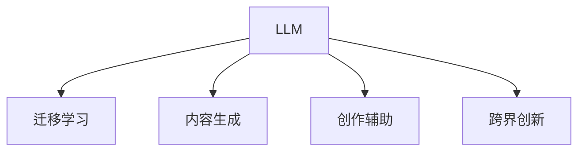

                 

## 1. 背景介绍

### 1.1 问题由来
在当前快速发展的数字时代，创意产业成为推动经济增长和文化创新的重要引擎。创意产业涵盖了广告、媒体、设计、音乐、影视等多个领域，其核心在于创意思维、美学表达和技术应用。随着人工智能（AI）技术的不断突破，特别是自然语言处理（NLP）技术的进步，语言模型（LM），特别是大型语言模型（LLM），正在逐渐展现出其对创意产业的巨大潜力。

### 1.2 问题核心关键点
LLM在创意产业中的应用前景主要体现在以下几个方面：
- **内容生成**：利用LLM进行文本、图像、音频等多媒体内容的自动生成，如自动写作、自动作曲、自动配图等。
- **数据分析**：通过LLM进行文本和多媒体数据的分析，如情感分析、主题建模、趋势预测等，帮助创意人员更好地理解用户需求和文化趋势。
- **创作辅助**：提供创作灵感、风格推荐、风格转换等服务，辅助创意人员提升创作效率和质量。
- **个性化推荐**：根据用户的历史行为和偏好，推荐个性化的内容，提高用户满意度和黏性。
- **跨界创新**：促进不同创意领域间的融合，如将AI艺术、虚拟现实（VR）、增强现实（AR）等技术融入创意作品，创造全新的创意体验。

### 1.3 问题研究意义
研究LLM在创意产业中的应用前景，对于提升创意产业的创新能力和竞争力，推动文化产业数字化转型，具有重要意义：
- **降低创意成本**：通过自动化和智能化的手段，降低创意生产的人力成本和时间成本。
- **提升创意质量**：利用LLM的高精度、高效率和创新能力，提升创意作品的质量和创意水平。
- **促进跨界合作**：LLM能够帮助不同领域的创意人员跨界合作，加速创意的碰撞和融合，创造出更多元、更创新的内容。
- **拓展市场空间**：通过个性化推荐和用户体验优化，扩大创意产品的影响力和市场份额。
- **推动技术融合**：LLM可以作为技术融合的桥梁，促进人工智能与创意产业的深度结合，推动新技术在创意产业的广泛应用。

## 2. 核心概念与联系

### 2.1 核心概念概述

为更好地理解LLM在创意产业中的应用前景，本节将介绍几个密切相关的核心概念：

- **大型语言模型（LLM）**：基于Transformer架构，通过自监督学习在大规模无标签文本数据上预训练得到的模型。LLM能够处理自然语言中的复杂结构，具备强大的语言理解能力和生成能力。
- **迁移学习（Transfer Learning）**：将一个领域学到的知识，迁移到另一个不同但相关的领域。LLM的预训练和微调过程即是一种典型的迁移学习方式。
- **内容生成（Content Generation）**：利用LLM进行文本、图像、音频等多媒体内容的自动生成。
- **创作辅助（Creative Assistance）**：通过LLM提供创作灵感、风格推荐、风格转换等服务，辅助创意人员提升创作效率和质量。
- **跨界创新（Cross-Domain Innovation）**：LLM能够促进不同创意领域间的融合，创造全新的创意体验。

这些核心概念之间的逻辑关系可以通过以下Mermaid流程图来展示：



这个流程图展示了大语言模型（LLM）的核心概念及其之间的关系：

1. LLM通过预训练获得基础能力。
2. 迁移学习使LLM更好地适应特定领域的创意任务。
3. 内容生成和创作辅助是LLM在创意产业中的主要应用方向。
4. 跨界创新使LLM能够跨越不同创意领域，创造出全新的创意体验。

## 3. 核心算法原理 & 具体操作步骤

### 3.1 算法原理概述

利用LLM在创意产业中进行应用的核心在于其强大的内容生成能力和创作辅助能力。具体来说，基于监督学习的大语言模型微调方法，能够将预训练的通用知识迁移到特定创意任务上，从而实现内容的自动生成和创作的辅助。

形式化地，假设预训练模型为 $M_{\theta}$，其中 $\theta$ 为预训练得到的模型参数。给定创意任务 $T$ 的训练集 $D=\{(x_i, y_i)\}_{i=1}^N$，微调的目标是找到新的模型参数 $\hat{\theta}$，使得模型输出能够匹配任务标签，从而适应特定的创意任务。

通过梯度下降等优化算法，微调过程不断更新模型参数 $\theta$，最小化损失函数 $\mathcal{L}$，使得模型输出逼近真实标签。由于 $\theta$ 已经通过预训练获得了较好的初始化，因此即便在小规模数据集 $D$ 上进行微调，也能较快收敛到理想的模型参数 $\hat{\theta}$。

### 3.2 算法步骤详解

利用LLM在创意产业中进行应用的主要步骤包括：

**Step 1: 准备预训练模型和数据集**
- 选择合适的预训练语言模型 $M_{\theta}$ 作为初始化参数，如 GPT-3、BERT 等。
- 准备创意任务 $T$ 的训练集 $D$，划分为训练集、验证集和测试集。一般要求标注数据与预训练数据的分布不要差异过大。

**Step 2: 添加任务适配层**
- 根据创意任务类型，在预训练模型顶层设计合适的输出层和损失函数。
- 对于内容生成任务，通常在顶层添加自回归解码器，以负对数似然为损失函数。
- 对于创作辅助任务，可能需要结合风格分析、情感分析等任务，设计多任务适配层。

**Step 3: 设置微调超参数**
- 选择合适的优化算法及其参数，如 AdamW、SGD 等，设置学习率、批大小、迭代轮数等。
- 设置正则化技术及强度，包括权重衰减、Dropout、Early Stopping 等。
- 确定冻结预训练参数的策略，如仅微调顶层，或全部参数都参与微调。

**Step 4: 执行梯度训练**
- 将训练集数据分批次输入模型，前向传播计算损失函数。
- 反向传播计算参数梯度，根据设定的优化算法和学习率更新模型参数。
- 周期性在验证集上评估模型性能，根据性能指标决定是否触发 Early Stopping。
- 重复上述步骤直到满足预设的迭代轮数或 Early Stopping 条件。

**Step 5: 测试和部署**
- 在测试集上评估微调后模型 $M_{\hat{\theta}}$ 的性能，对比微调前后的效果提升。
- 使用微调后的模型对新样本进行推理预测，集成到实际的应用系统中。
- 持续收集新的数据，定期重新微调模型，以适应数据分布的变化。

以上是基于监督学习微调LLM在创意产业中的主要步骤。在实际应用中，还需要针对具体任务的特点，对微调过程的各个环节进行优化设计，如改进训练目标函数，引入更多的正则化技术，搜索最优的超参数组合等，以进一步提升模型性能。

### 3.3 算法优缺点

利用LLM在创意产业中进行微调的监督学习方法具有以下优点：
1. 简单高效。只需准备少量标注数据，即可对预训练模型进行快速适配，获得较大的性能提升。
2. 通用适用。适用于各种创意任务，包括内容生成、创作辅助等，设计简单的任务适配层即可实现微调。
3. 参数高效。利用参数高效微调技术，在固定大部分预训练参数的情况下，仍可取得不错的微调效果。
4. 效果显著。在学术界和工业界的诸多创意任务上，基于微调的方法已经刷新了多项SOTA。

同时，该方法也存在一定的局限性：
1. 依赖标注数据。微调的效果很大程度上取决于标注数据的质量和数量，获取高质量标注数据的成本较高。
2. 迁移能力有限。当目标任务与预训练数据的分布差异较大时，微调的性能提升有限。
3. 负面效果传递。预训练模型的固有偏见、有害信息等，可能通过微调传递到下游任务，造成负面影响。
4. 可解释性不足。微调模型的决策过程通常缺乏可解释性，难以对其推理逻辑进行分析和调试。

尽管存在这些局限性，但就目前而言，基于监督学习的微调方法仍是大语言模型应用的主流范式。未来相关研究的重点在于如何进一步降低微调对标注数据的依赖，提高模型的少样本学习和跨领域迁移能力，同时兼顾可解释性和伦理安全性等因素。

### 3.4 算法应用领域

利用LLM在创意产业中的应用已经涵盖了多个领域，如广告、媒体、设计、音乐、影视等。以下是几个典型应用场景：

#### 3.4.1 广告创意

在广告创意领域，利用LLM自动生成广告文案和创意素材，可以极大地提升广告制作效率，降低人力成本。例如，可以设计多模态创意生成任务，通过图像、文本和音频等多种形式的输入，生成具有视觉吸引力的广告图像和文案。这不仅可以帮助广告公司快速制作多样化的广告内容，还能通过数据分析挖掘用户喜好，优化广告投放策略。

#### 3.4.2 媒体内容创作

在媒体内容创作领域，利用LLM自动生成新闻报道、评论文章、分析报告等内容，可以大幅提高内容生产的效率和质量。例如，可以设计多任务学习框架，将新闻摘要、情感分析、主题建模等多个任务结合在一起，提高内容创作的综合能力。此外，LLM还可以辅助记者进行事实核查、数据验证等工作，提升内容可信度。

#### 3.4.3 设计创意

在设计创意领域，利用LLM自动生成设计灵感、风格转换、作品推荐等内容，可以提升设计师的创作效率和作品质量。例如，可以设计基于用户偏好的风格推荐系统，根据用户历史浏览记录和反馈，推荐相应的设计风格和元素，帮助设计师快速找到创作灵感。

#### 3.4.4 音乐创作

在音乐创作领域，利用LLM自动生成歌词、旋律、编曲等内容，可以辅助作曲家进行创作，提升音乐作品的创新性和多样性。例如，可以设计音乐生成任务，通过歌词、旋律、节奏等多种输入，生成新的音乐作品。此外，LLM还可以用于分析音乐作品的情感倾向、风格特征，帮助音乐人进行创作风格的调整和优化。

#### 3.4.5 影视制作

在影视制作领域，利用LLM自动生成剧本、对话、场景描述等内容，可以提升影视作品的创作效率和叙事质量。例如，可以设计多任务学习框架，将剧本生成、对话生成、场景描述等多个任务结合在一起，提高影视创作的综合能力。此外，LLM还可以用于分析影视作品的用户反馈，优化剧本和表演效果。

## 4. 数学模型和公式 & 详细讲解 & 举例说明

### 4.1 数学模型构建

本节将使用数学语言对基于监督学习的大语言模型微调过程进行更加严格的刻画。

记预训练语言模型为 $M_{\theta}$，其中 $\theta$ 为预训练得到的模型参数。假设创意任务 $T$ 的训练集为 $D=\{(x_i,y_i)\}_{i=1}^N$，其中 $x_i$ 为输入数据，$y_i$ 为创意任务的目标标签。

定义模型 $M_{\theta}$ 在数据样本 $(x,y)$ 上的损失函数为 $\ell(M_{\theta}(x),y)$，则在数据集 $D$ 上的经验风险为：

$$
\mathcal{L}(\theta) = \frac{1}{N} \sum_{i=1}^N \ell(M_{\theta}(x_i),y_i)
$$

微调的优化目标是最小化经验风险，即找到最优参数：

$$
\theta^* = \mathop{\arg\min}_{\theta} \mathcal{L}(\theta)
$$

在实践中，我们通常使用基于梯度的优化算法（如SGD、Adam等）来近似求解上述最优化问题。设 $\eta$ 为学习率，$\lambda$ 为正则化系数，则参数的更新公式为：

$$
\theta \leftarrow \theta - \eta \nabla_{\theta}\mathcal{L}(\theta) - \eta\lambda\theta
$$

其中 $\nabla_{\theta}\mathcal{L}(\theta)$ 为损失函数对参数 $\theta$ 的梯度，可通过反向传播算法高效计算。

### 4.2 公式推导过程

以下我们以内容生成任务为例，推导基于监督学习的LLM微调过程的数学模型。

假设模型 $M_{\theta}$ 在输入 $x$ 上的输出为 $\hat{y}=M_{\theta}(x) \in \mathcal{Y}$，表示模型生成的创意内容。真实标签 $y \in \mathcal{Y}$。则创意生成任务的交叉熵损失函数定义为：

$$
\ell(M_{\theta}(x),y) = -[y\log \hat{y} + (1-y)\log (1-\hat{y})]
$$

将其代入经验风险公式，得：

$$
\mathcal{L}(\theta) = -\frac{1}{N}\sum_{i=1}^N [y_i\log M_{\theta}(x_i)+(1-y_i)\log(1-M_{\theta}(x_i))]
$$

根据链式法则，损失函数对参数 $\theta_k$ 的梯度为：

$$
\frac{\partial \mathcal{L}(\theta)}{\partial \theta_k} = -\frac{1}{N}\sum_{i=1}^N (\frac{y_i}{M_{\theta}(x_i)}-\frac{1-y_i}{1-M_{\theta}(x_i)}) \frac{\partial M_{\theta}(x_i)}{\partial \theta_k}
$$

其中 $\frac{\partial M_{\theta}(x_i)}{\partial \theta_k}$ 可进一步递归展开，利用自动微分技术完成计算。

在得到损失函数的梯度后，即可带入参数更新公式，完成模型的迭代优化。重复上述过程直至收敛，最终得到适应创意任务的最优模型参数 $\theta^*$。

### 4.3 案例分析与讲解

以音乐生成任务为例，具体讲解LLM在内容生成中的应用。

假设输入 $x$ 为一个简短的旋律片段，模型 $M_{\theta}$ 生成一个新的旋律片段 $\hat{y}$。真实标签 $y$ 表示是否生成一个符合用户喜好的新旋律。在微调过程中，利用交叉熵损失函数 $\ell(M_{\theta}(x),y)$ 对模型进行优化。具体来说：

1. **数据准备**：收集大量的用户喜好的旋律片段和对应的标签，作为训练集。
2. **模型初始化**：使用预训练的LLM模型，如GPT-3，作为初始化参数。
3. **损失函数设计**：设计交叉熵损失函数，计算模型生成的新旋律与用户喜好旋律的相似度。
4. **微调优化**：使用基于梯度的优化算法，如AdamW，最小化损失函数，更新模型参数。
5. **性能评估**：在测试集上评估模型的生成效果，对比微调前后的性能提升。
6. **部署应用**：将微调后的模型部署到实际的应用系统中，提供旋律生成服务。

## 5. 项目实践：代码实例和详细解释说明

### 5.1 开发环境搭建

在进行LLM微调实践前，我们需要准备好开发环境。以下是使用Python进行PyTorch开发的环境配置流程：

1. 安装Anaconda：从官网下载并安装Anaconda，用于创建独立的Python环境。

2. 创建并激活虚拟环境：
```bash
conda create -n pytorch-env python=3.8 
conda activate pytorch-env
```

3. 安装PyTorch：根据CUDA版本，从官网获取对应的安装命令。例如：
```bash
conda install pytorch torchvision torchaudio cudatoolkit=11.1 -c pytorch -c conda-forge
```

4. 安装Transformers库：
```bash
pip install transformers
```

5. 安装各类工具包：
```bash
pip install numpy pandas scikit-learn matplotlib tqdm jupyter notebook ipython
```

完成上述步骤后，即可在`pytorch-env`环境中开始微调实践。

### 5.2 源代码详细实现

下面我们以音乐生成任务为例，给出使用Transformers库对GPT模型进行微调的PyTorch代码实现。

首先，定义音乐生成任务的数据处理函数：

```python
from transformers import GPT2Tokenizer, GPT2LMHeadModel

class MusicDataset(Dataset):
    def __init__(self, melodies, labels, tokenizer, max_len=128):
        self.melodies = melodies
        self.labels = labels
        self.tokenizer = tokenizer
        self.max_len = max_len
        
    def __len__(self):
        return len(self.melodies)
    
    def __getitem__(self, item):
        melody = self.melodies[item]
        label = self.labels[item]
        
        encoding = self.tokenizer(melody, return_tensors='pt', max_length=self.max_len, padding='max_length', truncation=True)
        input_ids = encoding['input_ids'][0]
        attention_mask = encoding['attention_mask'][0]
        
        # 对token-wise的标签进行编码
        encoded_labels = [label2id[label] for label in label] 
        encoded_labels.extend([label2id['O']] * (self.max_len - len(encoded_labels)))
        labels = torch.tensor(encoded_labels, dtype=torch.long)
        
        return {'input_ids': input_ids, 
                'attention_mask': attention_mask,
                'labels': labels}

# 标签与id的映射
label2id = {'O': 0, 'HAPPY': 1, 'SAD': 2, 'ANGRY': 3}

# 创建dataset
tokenizer = GPT2Tokenizer.from_pretrained('gpt2')

train_dataset = MusicDataset(train_melodies, train_labels, tokenizer)
dev_dataset = MusicDataset(dev_melodies, dev_labels, tokenizer)
test_dataset = MusicDataset(test_melodies, test_labels, tokenizer)
```

然后，定义模型和优化器：

```python
from transformers import GPT2LMHeadModel, AdamW

model = GPT2LMHeadModel.from_pretrained('gpt2', num_labels=len(label2id))

optimizer = AdamW(model.parameters(), lr=2e-5)
```

接着，定义训练和评估函数：

```python
from torch.utils.data import DataLoader
from tqdm import tqdm
from sklearn.metrics import classification_report

device = torch.device('cuda') if torch.cuda.is_available() else torch.device('cpu')
model.to(device)

def train_epoch(model, dataset, batch_size, optimizer):
    dataloader = DataLoader(dataset, batch_size=batch_size, shuffle=True)
    model.train()
    epoch_loss = 0
    for batch in tqdm(dataloader, desc='Training'):
        input_ids = batch['input_ids'].to(device)
        attention_mask = batch['attention_mask'].to(device)
        labels = batch['labels'].to(device)
        model.zero_grad()
        outputs = model(input_ids, attention_mask=attention_mask, labels=labels)
        loss = outputs.loss
        epoch_loss += loss.item()
        loss.backward()
        optimizer.step()
    return epoch_loss / len(dataloader)

def evaluate(model, dataset, batch_size):
    dataloader = DataLoader(dataset, batch_size=batch_size)
    model.eval()
    preds, labels = [], []
    with torch.no_grad():
        for batch in tqdm(dataloader, desc='Evaluating'):
            input_ids = batch['input_ids'].to(device)
            attention_mask = batch['attention_mask'].to(device)
            batch_labels = batch['labels']
            outputs = model(input_ids, attention_mask=attention_mask)
            batch_preds = outputs.logits.argmax(dim=2).to('cpu').tolist()
            batch_labels = batch_labels.to('cpu').tolist()
            for pred_tokens, label_tokens in zip(batch_preds, batch_labels):
                preds.append(pred_tokens[:len(label_tokens)])
                labels.append(label_tokens)
                
    print(classification_report(labels, preds))
```

最后，启动训练流程并在测试集上评估：

```python
epochs = 5
batch_size = 16

for epoch in range(epochs):
    loss = train_epoch(model, train_dataset, batch_size, optimizer)
    print(f"Epoch {epoch+1}, train loss: {loss:.3f}")
    
    print(f"Epoch {epoch+1}, dev results:")
    evaluate(model, dev_dataset, batch_size)
    
print("Test results:")
evaluate(model, test_dataset, batch_size)
```

以上就是使用PyTorch对GPT模型进行音乐生成任务微调的完整代码实现。可以看到，得益于Transformers库的强大封装，我们可以用相对简洁的代码完成GPT模型的加载和微调。

### 5.3 代码解读与分析

让我们再详细解读一下关键代码的实现细节：

**MusicDataset类**：
- `__init__`方法：初始化音乐、标签、分词器等关键组件。
- `__len__`方法：返回数据集的样本数量。
- `__getitem__`方法：对单个样本进行处理，将音乐输入编码为token ids，将标签编码为数字，并对其进行定长padding，最终返回模型所需的输入。

**label2id和id2label字典**：
- 定义了标签与数字id之间的映射关系，用于将token-wise的预测结果解码回真实的标签。

**训练和评估函数**：
- 使用PyTorch的DataLoader对数据集进行批次化加载，供模型训练和推理使用。
- 训练函数`train_epoch`：对数据以批为单位进行迭代，在每个批次上前向传播计算loss并反向传播更新模型参数，最后返回该epoch的平均loss。
- 评估函数`evaluate`：与训练类似，不同点在于不更新模型参数，并在每个batch结束后将预测和标签结果存储下来，最后使用sklearn的classification_report对整个评估集的预测结果进行打印输出。

**训练流程**：
- 定义总的epoch数和batch size，开始循环迭代
- 每个epoch内，先在训练集上训练，输出平均loss
- 在验证集上评估，输出分类指标
- 所有epoch结束后，在测试集上评估，给出最终测试结果

可以看到，PyTorch配合Transformers库使得GPT模型微调的代码实现变得简洁高效。开发者可以将更多精力放在数据处理、模型改进等高层逻辑上，而不必过多关注底层的实现细节。

当然，工业级的系统实现还需考虑更多因素，如模型的保存和部署、超参数的自动搜索、更灵活的任务适配层等。但核心的微调范式基本与此类似。

## 6. 实际应用场景

### 6.1 广告创意

在广告创意领域，利用LLM自动生成广告文案和创意素材，可以极大地提升广告制作效率，降低人力成本。例如，可以设计多模态创意生成任务，通过图像、文本和音频等多种形式的输入，生成具有视觉吸引力的广告图像和文案。这不仅可以帮助广告公司快速制作多样化的广告内容，还能通过数据分析挖掘用户喜好，优化广告投放策略。

### 6.2 媒体内容创作

在媒体内容创作领域，利用LLM自动生成新闻报道、评论文章、分析报告等内容，可以大幅提高内容生产的效率和质量。例如，可以设计多任务学习框架，将新闻摘要、情感分析、主题建模等多个任务结合在一起，提高内容创作的综合能力。此外，LLM还可以辅助记者进行事实核查、数据验证等工作，提升内容可信度。

### 6.3 设计创意

在设计创意领域，利用LLM自动生成设计灵感、风格转换、作品推荐等内容，可以提升设计师的创作效率和作品质量。例如，可以设计基于用户偏好的风格推荐系统，根据用户历史浏览记录和反馈，推荐相应的设计风格和元素，帮助设计师快速找到创作灵感。

### 6.4 音乐创作

在音乐创作领域，利用LLM自动生成歌词、旋律、编曲等内容，可以辅助作曲家进行创作，提升音乐作品的创新性和多样性。例如，可以设计音乐生成任务，通过歌词、旋律、节奏等多种输入，生成新的音乐作品。此外，LLM还可以用于分析音乐作品的情感倾向、风格特征，帮助音乐人进行创作风格的调整和优化。

### 6.5 影视制作

在影视制作领域，利用LLM自动生成剧本、对话、场景描述等内容，可以提升影视作品的创作效率和叙事质量。例如，可以设计多任务学习框架，将剧本生成、对话生成、场景描述等多个任务结合在一起，提高影视创作的综合能力。此外，LLM还可以用于分析影视作品的用户反馈，优化剧本和表演效果。

## 7. 工具和资源推荐

### 7.1 学习资源推荐

为了帮助开发者系统掌握LLM在创意产业中的应用，这里推荐一些优质的学习资源：

1. 《Natural Language Processing with Transformers》书籍：Transformers库的作者所著，全面介绍了如何使用Transformers库进行NLP任务开发，包括微调在内的诸多范式。
2. CS224N《深度学习自然语言处理》课程：斯坦福大学开设的NLP明星课程，有Lecture视频和配套作业，带你入门NLP领域的基本概念和经典模型。
3. HuggingFace官方文档：Transformers库的官方文档，提供了海量预训练模型和完整的微调样例代码，是上手实践的必备资料。
4. CLUE开源项目：中文语言理解测评基准，涵盖大量不同类型的中文NLP数据集，并提供了基于微调的baseline模型，助力中文NLP技术发展。
5. PyTorch官方文档：PyTorch的官方文档，提供了详细的API和示例代码，帮助开发者快速上手。

通过对这些资源的学习实践，相信你一定能够快速掌握LLM在创意产业中的应用技巧，并用于解决实际的NLP问题。

### 7.2 开发工具推荐

高效的开发离不开优秀的工具支持。以下是几款用于LLM微调开发的常用工具：

1. PyTorch：基于Python的开源深度学习框架，灵活动态的计算图，适合快速迭代研究。大部分预训练语言模型都有PyTorch版本的实现。
2. TensorFlow：由Google主导开发的开源深度学习框架，生产部署方便，适合大规模工程应用。同样有丰富的预训练语言模型资源。
3. Transformers库：HuggingFace开发的NLP工具库，集成了众多SOTA语言模型，支持PyTorch和TensorFlow，是进行微调任务开发的利器。
4. Weights & Biases：模型训练的实验跟踪工具，可以记录和可视化模型训练过程中的各项指标，方便对比和调优。与主流深度学习框架无缝集成。
5. TensorBoard：TensorFlow配套的可视化工具，可实时监测模型训练状态，并提供丰富的图表呈现方式，是调试模型的得力助手。
6. Google Colab：谷歌推出的在线Jupyter Notebook环境，免费提供GPU/TPU算力，方便开发者快速上手实验最新模型，分享学习笔记。

合理利用这些工具，可以显著提升LLM微调任务的开发效率，加快创新迭代的步伐。

### 7.3 相关论文推荐

LLM在创意产业中的应用源于学界的持续研究。以下是几篇奠基性的相关论文，推荐阅读：

1. Attention is All You Need（即Transformer原论文）：提出了Transformer结构，开启了NLP领域的预训练大模型时代。
2. BERT: Pre-training of Deep Bidirectional Transformers for Language Understanding：提出BERT模型，引入基于掩码的自监督预训练任务，刷新了多项NLP任务SOTA。
3. Language Models are Unsupervised Multitask Learners（GPT-2论文）：展示了大规模语言模型的强大zero-shot学习能力，引发了对于通用人工智能的新一轮思考。
4. Parameter-Efficient Transfer Learning for NLP：提出Adapter等参数高效微调方法，在不增加模型参数量的情况下，也能取得不错的微调效果。
5. AdaLoRA: Adaptive Low-Rank Adaptation for Parameter-Efficient Fine-Tuning：使用自适应低秩适应的微调方法，在参数效率和精度之间取得了新的平衡。
6. Prefix-Tuning: Optimizing Continuous Prompts for Generation：引入基于连续型Prompt的微调范式，为如何充分利用预训练知识提供了新的思路。

这些论文代表了大语言模型微调技术的发展脉络。通过学习这些前沿成果，可以帮助研究者把握学科前进方向，激发更多的创新灵感。

## 8. 总结：未来发展趋势与挑战

### 8.1 总结

本文对基于监督学习的大语言模型微调方法在创意产业中的应用前景进行了全面系统的介绍。首先阐述了LLM在创意产业中的应用背景和意义，明确了LLM在内容生成、创作辅助、跨界创新等方面的潜力。其次，从原理到实践，详细讲解了LLM微调的理论基础和操作步骤，给出了音乐生成任务的完整代码实现。同时，本文还广泛探讨了LLM在广告创意、媒体内容创作、设计创意、音乐创作、影视制作等多个创意领域的应用前景，展示了LLM在创意产业中的巨大潜力。

通过本文的系统梳理，可以看到，基于大语言模型的微调方法正在成为创意产业的重要范式，极大地拓展了创意生产的内容类型和创作效率，为创意产业的数字化转型提供了强大的技术支持。未来，伴随LLM技术的不断进步，基于LLM的创意应用将进一步丰富和创新，为创意产业带来革命性的变革。

### 8.2 未来发展趋势

展望未来，LLM在创意产业中的应用前景将呈现以下几个趋势：

1. 内容生成能力不断增强。随着LLM技术的进步，内容生成的质量和多样性将进一步提升，能够生成更加自然、多样、高质量的创意作品。
2. 创作辅助功能日趋丰富。LLM将提供更加智能化、个性化的创作辅助服务，如风格推荐、情感分析、风格转换等，提升创意人员的创作体验。
3. 跨界融合创新加速。LLM将推动不同创意领域间的融合，创造出更多元、更创新的创意体验。例如，将音乐、影视、设计等多模态数据结合，创造全新的跨界创意作品。
4. 用户个性化定制加强。利用LLM的大数据处理能力，可以实现更加个性化的内容推荐和创作辅助，提高用户满意度和黏性。
5. 技术融合深化。LLM将与其他AI技术深度融合，如计算机视觉、自然语言处理、语音识别等，推动创意产业的全面智能化。

以上趋势凸显了LLM在创意产业中的广阔前景。这些方向的探索发展，必将进一步提升创意产业的创新能力和竞争力，推动文化产业数字化转型，为经济社会发展注入新的动力。

### 8.3 面临的挑战

尽管LLM在创意产业中的应用前景广阔，但在迈向更加智能化、普适化应用的过程中，它仍面临诸多挑战：

1. 标注成本瓶颈。虽然LLM通过迁移学习可以在小规模数据上取得不错的效果，但对于特定领域的创意任务，仍需大量标注数据进行微调。获取高质量标注数据的成本较高，成为制约微调性能的瓶颈。
2. 创作风格多样性。不同用户和创意人员的创作风格各异，如何通过LLM自动学习多样化的创作风格，仍是一个挑战。
3. 版权和伦理问题。利用LLM生成创意作品时，如何处理版权和伦理问题，避免侵权和不当使用，仍然是一个复杂的问题。
4. 数据安全和隐私保护。创意产业涉及大量个人隐私数据，如何在数据处理和使用过程中保护用户隐私，是一个亟待解决的问题。
5. 用户接受度。尽管LLM在技术上取得了突破，但如何提高用户对AI生成内容的接受度，仍是一个需要解决的问题。

正视LLM在创意产业应用中面临的这些挑战，积极应对并寻求突破，将是大语言模型微调技术迈向成熟的必由之路。相信随着学界和产业界的共同努力，这些挑战终将一一被克服，LLM将会在创意产业中发挥更大的作用。

### 8.4 研究展望

面对LLM在创意产业应用中面临的挑战，未来的研究需要在以下几个方面寻求新的突破：

1. 探索无监督和半监督微调方法。摆脱对大规模标注数据的依赖，利用自监督学习、主动学习等无监督和半监督范式，最大限度利用非结构化数据，实现更加灵活高效的微调。
2. 研究参数高效和计算高效的微调范式。开发更加参数高效的微调方法，在固定大部分预训练参数的同时，只更新极少量的任务相关参数。同时优化微调模型的计算图，减少前向传播和反向传播的资源消耗，实现更加轻量级、实时性的部署。
3. 融合因果和对比学习范式。通过引入因果推断和对比学习思想，增强LLM建立稳定因果关系的能力，学习更加普适、鲁棒的语言表征，从而提升模型泛化性和抗干扰能力。
4. 引入更多先验知识。将符号化的先验知识，如知识图谱、逻辑规则等，与神经网络模型进行巧妙融合，引导微调过程学习更准确、合理的语言模型。同时加强不同模态数据的整合，实现视觉、语音等多模态信息与文本信息的协同建模。
5. 结合因果分析和博弈论工具。将因果分析方法引入LLM，识别出模型决策的关键特征，增强输出解释的因果性和逻辑性。借助博弈论工具刻画人机交互过程，主动探索并规避模型的脆弱点，提高系统稳定性。
6. 纳入伦理道德约束。在模型训练目标中引入伦理导向的评估指标，过滤和惩罚有偏见、有害的输出倾向。同时加强人工干预和审核，建立模型行为的监管机制，确保输出符合人类价值观和伦理道德。

这些研究方向的探索，必将引领LLM在创意产业中的应用进入新的阶段，为创意产业带来更深刻的变化和创新。面向未来，LLM需要与其他AI技术进行更深入的融合，如知识表示、因果推理、强化学习等，多路径协同发力，共同推动创意产业的全面智能化。

## 9. 附录：常见问题与解答

**Q1：LLM在创意产业中是否存在版权和伦理问题？**

A: 利用LLM生成创意作品时，确实存在版权和伦理问题。主要体现在以下几个方面：
1. 版权问题：LLM生成的内容可能涉及到现有作品的抄袭和侵权问题。需要明确生成的内容是否使用了现有作品的一部分，并确保不侵犯原有版权。
2. 伦理问题：LLM生成的内容可能包含不当、有害的信息，如暴力、色情、歧视等，需要加强内容审核和风险控制。
3. 数据隐私问题：在数据收集和处理过程中，需要确保用户隐私数据的保护，避免泄露和滥用。

为了解决这些问题，需要制定相应的版权保护机制和内容审核策略，确保LLM的应用符合伦理和法律规范。

**Q2：LLM在广告创意中如何确保创意的多样性和创新性？**

A: 确保广告创意的多样性和创新性，需要从以下几个方面进行优化：
1. 数据多样性：收集多样化的广告数据和用户偏好数据，用于训练和微调LLM模型。
2. 模型多样性：设计多模态创意生成任务，结合图像、文本和音频等多种形式的输入，生成多样化的广告内容。
3. 风格多样性：在微调过程中引入风格迁移技术，通过调整模型参数，生成不同风格的广告创意。
4. 创新性激励：通过奖励机制，激励创意人员在生成过程中加入创新元素，如新词汇、新句式、新风格等。
5. 用户反馈：收集用户对生成的广告内容的反馈，不断优化模型，提升创意质量。

通过以上措施，可以确保LLM生成的广告创意既有创意性，又有多样性，满足不同用户的需求。

**Q3：LLM在媒体内容创作中如何确保内容的可信度？**

A: 确保媒体内容创作中的可信度，需要从以下几个方面进行优化：
1. 事实核查：利用LLM进行事实核查，自动验证生成内容中的事实和数据。
2. 多源验证：结合多个来源的数据，进行交叉验证，确保内容的准确性和可靠性。
3. 专家审核：引入领域专家的审核机制，对生成内容进行人工审核，确保内容的真实性和可信度。
4. 用户反馈：收集用户对内容的反馈，进行数据和模型的持续优化，提升内容的可信度。

通过以上措施，可以确保LLM生成的媒体内容具有高度的可信度和真实性，满足用户的需求和期望。

**Q4：LLM在音乐创作中如何确保创作风格的个性化？**

A: 确保音乐创作的个性化，需要从以下几个方面进行优化：
1. 用户数据：收集用户的历史听歌记录、偏好数据，用于训练和微调LLM模型。
2. 多任务学习：结合音乐风格分析、情感分析等多个任务，进行多任务学习，提升模型的综合能力。
3. 风格迁移：在微调过程中引入风格迁移技术，通过调整模型参数，生成个性化的音乐风格。
4. 用户反馈：收集用户对生成音乐的反馈，不断优化模型，提升创作风格的个性化。

通过以上措施，可以确保LLM生成的音乐具有高度的个性化和多样性，满足不同用户的需求和期望。

**Q5：LLM在影视制作中如何确保内容的创新性和多样化？**

A: 确保影视内容制作中的创新性和多样化，需要从以下几个方面进行优化：
1. 数据多样性：收集多样化的影视数据和用户偏好数据，用于训练和微调LLM模型。
2. 多模态融合：结合图像、音频、文本等多种形式的数据，进行多模态融合，生成多样化的影视内容。
3. 创新性激励：通过奖励机制，激励创意人员在制作过程中加入创新元素，如新剧情、新场景、新风格等。
4. 用户反馈：收集用户对影视内容的反馈，进行数据和模型的持续优化，提升内容的创新性和多样化。

通过以上措施，可以确保LLM生成的影视内容既有创新性，又有多样性，满足不同用户的需求和期望。

---

作者：禅与计算机程序设计艺术 / Zen and the Art of Computer Programming

