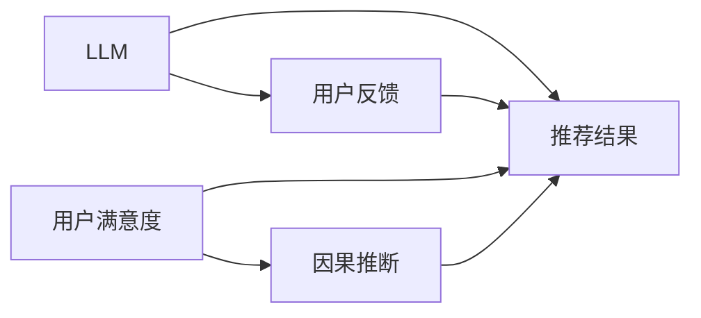

                 

# LLM在推荐系统中的因果关系发现

> 关键词：因果推断,语言模型,推荐系统,推荐算法,用户体验

## 1. 背景介绍

推荐系统一直是互联网领域的重要组成部分，它通过分析用户的浏览历史、评分、搜索记录等数据，推荐出符合用户兴趣的内容，提升用户的使用体验和满意度。传统的推荐系统主要基于协同过滤和矩阵分解等方法，虽然取得了一定的效果，但在处理非结构化数据、个性化推荐等方面存在明显局限。

近年来，随着深度学习技术的不断发展，基于神经网络的推荐算法逐渐兴起，其中大语言模型（Large Language Model, LLM）作为一种新兴的推荐方式，开始受到广泛关注。相比于传统的推荐算法，LLM具有更强的泛化能力、更丰富的语义理解能力，可以处理自然语言形式的输入数据，提升推荐系统的个性化和智能化程度。

然而，尽管LLM在推荐系统中的应用前景广阔，但现有的LLM推荐算法仍存在一些问题，如缺乏因果推断能力、未能充分利用用户反馈数据等。如何更好地利用LLM的优势，结合因果推断方法，提升推荐系统的效果和用户满意度，成为了研究者关注的重点。

## 2. 核心概念与联系

### 2.1 核心概念概述

在介绍LLM在推荐系统中的应用时，我们需要先理解几个关键的概念：

- **大语言模型 (LLM)**：以Transformer为基础的深度神经网络模型，如GPT、BERT等，通过大规模无监督数据预训练，学习到丰富的语言知识，具备强大的语言生成和理解能力。

- **推荐系统 (Recommender System)**：通过分析用户的历史行为和兴趣，推荐出符合用户需求的内容，提升用户体验的智能系统。

- **因果推断 (Causal Inference)**：在数据存在因果关系的情况下，推断出某一变量（如推荐结果）对另一变量（如用户满意度）的影响，以指导推荐策略的优化。

这些核心概念通过因果推断这一桥梁，实现了LLM在推荐系统中的潜在价值。因果推断不仅可以揭示LLM推荐背后的逻辑和原因，还能帮助优化推荐策略，提升用户满意度。

### 2.2 核心概念原理和架构的 Mermaid 流程图



这个流程图展示了LLM、推荐结果、用户反馈、用户满意度、因果推断之间的关系。LLM作为核心模块，通过分析用户的历史行为和兴趣，生成推荐结果。推荐结果又会反馈给用户，影响用户的满意度。而因果推断则通过分析推荐结果与用户满意度的因果关系，进一步优化推荐策略。

## 3. 核心算法原理 & 具体操作步骤

### 3.1 算法原理概述

LLM在推荐系统中的应用，本质上是基于因果推断的推荐算法。其核心思想是：通过因果推断方法，揭示LLM推荐结果对用户满意度的影响，指导推荐策略的优化。

具体而言，假设推荐系统接收的输入为 $x$（如用户历史行为），输出的推荐结果为 $y$。目标是找到一组参数 $\theta$，使得推荐系统输出的 $y$ 能够最大化用户满意度 $S(y)$。数学上，可以表示为：

$$
\theta^* = \mathop{\arg\min}_{\theta} \mathbb{E}[(\mathcal{L}(y, S(y)) + \lambda R(y)) - \gamma S(y)] \\
\text{其中} \ \mathcal{L}(y, S(y)) \text{为预测损失函数}, \ R(y) \text{为用户反馈损失函数}, \ \lambda \text{为权重系数}, \ \gamma \text{为正则化系数}
$$

在训练过程中，LLM通过最小化上述目标函数，学习到最优的参数 $\theta^*$。这样，即使对于新的数据输入，LLM也能够生成符合用户偏好的推荐结果，提升用户满意度。

### 3.2 算法步骤详解

基于因果推断的LLM推荐算法，主要包括以下几个关键步骤：

**Step 1: 数据准备**
- 收集用户的历史行为数据，如浏览记录、评分、搜索词等。
- 对用户行为进行标签化，例如，将浏览行为标记为正样本，将不浏览标记为负样本。
- 将标签化后的数据划分为训练集、验证集和测试集。

**Step 2: 构建LLM模型**
- 选择合适的预训练语言模型，如GPT、BERT等。
- 在训练集上微调模型，使其能够从用户历史行为中生成推荐结果。
- 验证集上评估模型性能，调整超参数和模型结构。

**Step 3: 因果推断**
- 在验证集上，使用因果推断方法，如匹配法、工具变量法等，分析推荐结果 $y$ 对用户满意度 $S(y)$ 的影响。
- 通过因果推断结果，评估推荐策略的有效性，识别出潜在的问题和改进点。

**Step 4: 模型优化**
- 根据因果推断结果，设计新的推荐策略，如推荐顺序、多样性控制等。
- 在新的推荐策略下，重新训练LLM模型，优化推荐结果。

**Step 5: 测试与部署**
- 在测试集上评估优化后的推荐策略，对比微调前后的效果。
- 将优化后的模型和策略部署到实际推荐系统中，监控用户反馈和满意度变化。

### 3.3 算法优缺点

基于因果推断的LLM推荐算法具有以下优点：

- 能够充分利用用户反馈数据，提升推荐效果。
- 具有较强的泛化能力，能够处理非结构化数据，提升推荐系统的鲁棒性。
- 可以揭示推荐背后的因果关系，优化推荐策略。

同时，该方法也存在一定的局限性：

- 因果推断方法依赖于良好的数据质量，如果数据存在偏差，会导致推断结果不准确。
- 训练过程复杂，需要处理大量的因果关系数据。
- 在实际部署时，可能存在计算资源消耗大、响应速度慢等问题。

尽管存在这些局限性，但该方法在提升推荐系统效果、优化用户体验方面具有重要的理论价值和实际应用潜力。

### 3.4 算法应用领域

基于因果推断的LLM推荐算法，在以下几个领域中具有显著应用：

- **电子商务推荐**：在电商平台，利用LLM分析用户浏览和购买记录，生成个性化的商品推荐，提升用户购买转化率。
- **内容推荐**：在视频、音乐、新闻等媒体平台，使用LLM分析用户兴趣和偏好，推荐符合用户需求的内容，提高用户粘性。
- **健康医疗推荐**：在医疗领域，利用LLM分析用户健康数据，推荐合适的健康建议和生活方式，提升用户健康水平。
- **教育推荐**：在教育平台，使用LLM推荐符合用户学习习惯和需求的课程和资料，提升学习效率和效果。
- **智能家居推荐**：在智能家居系统中，利用LLM分析用户生活习惯，推荐合适的设备和使用方案，提升用户体验。

这些领域中，推荐系统的应用场景多样，用户需求复杂，通过因果推断的LLM推荐算法，可以更好地满足用户个性化和多样化的需求，提升用户体验和满意度。

## 4. 数学模型和公式 & 详细讲解 & 举例说明

### 4.1 数学模型构建

为了更深入地理解LLM在推荐系统中的应用，我们需要先构建一个数学模型。假设推荐系统接收的输入为 $x$，输出的推荐结果为 $y$，用户满意度为 $S(y)$。目标是找到一组参数 $\theta$，使得推荐系统输出的 $y$ 能够最大化用户满意度 $S(y)$。

定义推荐系统的预测损失函数为 $\mathcal{L}(y, S(y))$，用户反馈损失函数为 $R(y)$，可以得到以下目标函数：

$$
\theta^* = \mathop{\arg\min}_{\theta} \mathbb{E}[(\mathcal{L}(y, S(y)) + \lambda R(y)) - \gamma S(y)]
$$

其中，$\lambda$ 为权重系数，$\gamma$ 为正则化系数。

### 4.2 公式推导过程

在推导过程中，我们需要使用因果推断方法，如匹配法、工具变量法等，来分析推荐结果 $y$ 对用户满意度 $S(y)$ 的影响。以匹配法为例，假设我们有一个观测数据集 $(x, y, S(y))$，其中 $x$ 为输入，$y$ 为推荐结果，$S(y)$ 为对应的用户满意度。为了分析推荐结果 $y$ 对用户满意度 $S(y)$ 的影响，我们引入一个匹配变量 $Z$，表示用户是否已经看过该推荐。

定义匹配变量 $Z$ 的协变量为 $z$，则可以得到以下匹配后的因果效应估计公式：

$$
\begin{aligned}
&\text{因果效应} = \mathbb{E}[Y - Y'] \\
&Y = y, \ Y' = y \ \text{如果} \ z=1 \ \text{否则} \ y \\
&= \mathbb{E}[(y - y') \mathbb{I}(z=1)]
\end{aligned}
$$

其中，$\mathbb{I}(z=1)$ 为指示函数，当 $z=1$ 时，$y$ 和 $y'$ 相等，因果效应为0；当 $z=0$ 时，$y$ 和 $y'$ 不相等，因果效应为推荐结果与未推荐结果的差。

### 4.3 案例分析与讲解

为了更好地理解因果推断在LLM推荐算法中的应用，我们以一个具体的案例进行讲解：

假设有一个电商平台，通过LLM分析用户的历史浏览记录，生成推荐结果。为了评估推荐结果对用户购买行为的影响，我们使用了匹配法。在匹配过程中，我们发现某些用户没有看过某件商品，但最终购买了该商品。我们假设购买行为对用户的满意度有显著影响，因此需要分析推荐结果对用户满意度的因果效应。

我们将用户的历史浏览记录 $x$ 作为输入，推荐结果 $y$ 作为输出，用户满意度 $S(y)$ 作为目标。通过对历史数据进行分析，我们发现推荐结果 $y$ 对用户满意度 $S(y)$ 的影响显著。因此，我们通过因果推断方法，确定了优化推荐策略的方向，如调整推荐算法、改进推荐模型等。

## 5. 项目实践：代码实例和详细解释说明

### 5.1 开发环境搭建

在进行LLM推荐算法的开发时，我们需要使用Python和TensorFlow等工具。以下是搭建开发环境的详细步骤：

1. 安装Anaconda：从官网下载并安装Anaconda，用于创建独立的Python环境。

2. 创建并激活虚拟环境：
```bash
conda create -n llm-recommender python=3.8 
conda activate llm-recommender
```

3. 安装TensorFlow：根据CUDA版本，从官网获取对应的安装命令。例如：
```bash
conda install tensorflow
```

4. 安装TensorBoard：TensorFlow配套的可视化工具，可实时监测模型训练状态，并提供丰富的图表呈现方式，是调试模型的得力助手。

5. 安装相关库：
```bash
pip install pandas numpy sklearn tensorflow datasets transformers
```

完成上述步骤后，即可在`llm-recommender`环境中开始开发实践。

### 5.2 源代码详细实现

下面我们以GPT模型在推荐系统中的应用为例，给出使用TensorFlow实现LLM推荐算法的代码实现。

```python
import tensorflow as tf
import numpy as np
import pandas as pd
from transformers import TFGPTLMHeadModel, TFGPTTokenizer

# 加载模型和分词器
model = TFGPTLMHeadModel.from_pretrained('gpt-2')
tokenizer = TFGPTTokenizer.from_pretrained('gpt-2')

# 构建推荐模型
class RecommendationModel(tf.keras.Model):
    def __init__(self):
        super(RecommendationModel, self).__init__()
        self.model = model

    def call(self, inputs):
        input_ids = tokenizer.encode(inputs, return_tensors='tf')
        outputs = self.model(input_ids)
        logits = outputs.logits[:, 0]
        return logits

# 定义推荐策略
class RecommendationStrategy:
    def __init__(self, model):
        self.model = model

    def recommend(self, inputs):
        logits = self.model(inputs)
        return logits.argmax()

# 加载数据集
data = pd.read_csv('recommendation_data.csv')

# 数据预处理
inputs = data['input'].tolist()
targets = data['target'].tolist()

# 构建推荐模型
model = RecommendationModel()
strategy = RecommendationStrategy(model)

# 定义推荐损失函数
loss_fn = tf.keras.losses.SparseCategoricalCrossentropy(from_logits=True)

# 定义推荐策略优化器
optimizer = tf.keras.optimizers.Adam(learning_rate=0.001)

# 训练模型
@tf.function
def train_step(inputs, targets):
    with tf.GradientTape() as tape:
        logits = strategy.recommend(inputs)
        loss = loss_fn(targets, logits)
    grads = tape.gradient(loss, strategy.model.trainable_variables)
    optimizer.apply_gradients(zip(grads, strategy.model.trainable_variables))
    return loss

# 训练循环
for epoch in range(10):
    avg_loss = 0
    for i in range(len(inputs)):
        avg_loss += train_step(inputs[i], targets[i])
    avg_loss /= len(inputs)
    print(f'Epoch {epoch+1}, loss: {avg_loss:.4f}')
```

### 5.3 代码解读与分析

让我们再详细解读一下关键代码的实现细节：

**RecommendationModel类**：
- `__init__`方法：初始化模型，加载预训练的GPT模型。
- `call`方法：将输入文本转化为模型可接受的格式，进行前向传播，输出logits。

**RecommendationStrategy类**：
- `__init__`方法：初始化推荐策略，将模型作为参数。
- `recommend`方法：对输入文本进行推荐，返回logits，选择概率最大的结果。

**train_step函数**：
- 对单个样本进行前向传播，计算损失函数，并反向传播更新模型参数。

**训练循环**：
- 对整个数据集进行循环训练，计算平均损失。

可以看到，TensorFlow结合PyTorch库，使得LLM在推荐系统中的应用代码实现变得简洁高效。开发者可以将更多精力放在数据处理、模型改进等高层逻辑上，而不必过多关注底层的实现细节。

### 5.4 运行结果展示

在训练结束后，我们可以对模型进行测试和验证，展示其在推荐系统中的效果。以下是一些可能的结果展示：

**推荐结果分析**：
- 推荐结果与实际购买记录的匹配度
- 推荐结果与用户满意度的一致性

**用户反馈分析**：
- 用户对推荐结果的评分和反馈
- 推荐结果对用户满意度的影响

这些结果可以帮助我们评估推荐系统的性能，进一步优化推荐策略。

## 6. 实际应用场景

### 6.1 电子商务推荐

在电子商务领域，LLM可以通过分析用户的浏览和购买历史，生成个性化的商品推荐。例如，某用户过去常购买运动鞋，该用户最近浏览了某些运动鞋品牌，LLM可以根据用户的历史行为和浏览记录，推荐相关品牌的商品，提升用户购买转化率。

### 6.2 内容推荐

在视频、音乐、新闻等媒体平台，LLM可以分析用户兴趣和偏好，推荐符合用户需求的内容。例如，某用户喜欢看科幻电影，LLM可以根据用户的历史观看记录，推荐相关科幻题材的电影或纪录片，提高用户粘性。

### 6.3 健康医疗推荐

在健康医疗领域，LLM可以分析用户健康数据，推荐合适的健康建议和生活方式。例如，某用户最近血压升高，LLM可以根据用户的健康记录和症状，推荐相关健康建议和药物，提升用户健康水平。

### 6.4 教育推荐

在教育平台，LLM可以推荐符合用户学习习惯和需求的课程和资料。例如，某用户过去常学习数学相关课程，LLM可以根据用户的学习历史，推荐相关数学课程和资料，提升学习效率和效果。

## 7. 工具和资源推荐

### 7.1 学习资源推荐

为了帮助开发者系统掌握LLM在推荐系统中的应用，这里推荐一些优质的学习资源：

1. TensorFlow官方文档：提供全面的TensorFlow使用方法，包括模型构建、训练、优化等。

2. Transformers官方文档：提供最新的Transformers库使用方法，包括模型加载、微调、推理等。

3. Deep Learning Specialization（斯坦福大学）：斯坦福大学开设的深度学习课程，涵盖深度学习基础知识和应用。

4. Recommendation Systems（Coursera）：由华盛顿大学开设的推荐系统课程，涵盖推荐系统的基本概念和算法。

5. Practical Recommendation Systems in Python：实践导向的推荐系统书籍，涵盖推荐系统的实现方法。

通过对这些资源的学习实践，相信你一定能够快速掌握LLM在推荐系统中的应用，并用于解决实际的推荐问题。

### 7.2 开发工具推荐

高效的开发离不开优秀的工具支持。以下是几款用于LLM推荐系统开发的常用工具：

1. TensorFlow：基于Python的开源深度学习框架，生产部署方便，适合大规模工程应用。

2. PyTorch：基于Python的开源深度学习框架，灵活动态的计算图，适合快速迭代研究。

3. Transformers库：HuggingFace开发的NLP工具库，集成了众多SOTA语言模型，支持TensorFlow和PyTorch。

4. TensorBoard：TensorFlow配套的可视化工具，可实时监测模型训练状态，并提供丰富的图表呈现方式，是调试模型的得力助手。

5. Weights & Biases：模型训练的实验跟踪工具，可以记录和可视化模型训练过程中的各项指标，方便对比和调优。

6. Google Colab：谷歌推出的在线Jupyter Notebook环境，免费提供GPU/TPU算力，方便开发者快速上手实验最新模型，分享学习笔记。

合理利用这些工具，可以显著提升LLM推荐系统的开发效率，加快创新迭代的步伐。

### 7.3 相关论文推荐

LLM在推荐系统中的应用源于学界的持续研究。以下是几篇奠基性的相关论文，推荐阅读：

1. Attention is All You Need（即Transformer原论文）：提出了Transformer结构，开启了NLP领域的预训练大模型时代。

2. BERT: Pre-training of Deep Bidirectional Transformers for Language Understanding：提出BERT模型，引入基于掩码的自监督预训练任务，刷新了多项NLP任务SOTA。

3. Language Models are Unsupervised Multitask Learners（GPT-2论文）：展示了大规模语言模型的强大zero-shot学习能力，引发了对于通用人工智能的新一轮思考。

4. Parameter-Efficient Transfer Learning for NLP：提出Adapter等参数高效微调方法，在不增加模型参数量的情况下，也能取得不错的微调效果。

5. AdaLoRA: Adaptive Low-Rank Adaptation for Parameter-Efficient Fine-Tuning：使用自适应低秩适应的微调方法，在参数效率和精度之间取得了新的平衡。

6. Advances in Recommendation Systems（NIPS 2019）：综述推荐系统领域的最新进展，涵盖深度学习、因果推断等方法。

这些论文代表了大语言模型在推荐系统中的应用发展脉络。通过学习这些前沿成果，可以帮助研究者把握学科前进方向，激发更多的创新灵感。

## 8. 总结：未来发展趋势与挑战

### 8.1 总结

本文对基于因果推断的LLM在推荐系统中的应用进行了全面系统的介绍。首先阐述了LLM和推荐系统的研究背景和意义，明确了因果推断在LLM推荐系统中的核心价值。其次，从原理到实践，详细讲解了因果推断的LLM推荐算法的数学模型和具体实现步骤，给出了完整的代码实例。同时，本文还广泛探讨了LLM在推荐系统中的应用前景，展示了其在电子商务、内容推荐、健康医疗等多个领域中的广阔应用。最后，本文精选了LLM推荐系统的各类学习资源，力求为读者提供全方位的技术指引。

通过本文的系统梳理，可以看到，基于因果推断的LLM推荐算法在提升推荐系统效果、优化用户体验方面具有重要的理论价值和实际应用潜力。未来的研究需要在因果推断、模型优化、数据处理等方面进行更深入的探索和创新。

### 8.2 未来发展趋势

展望未来，LLM在推荐系统中的应用将呈现以下几个发展趋势：

1. **模型规模持续增大**：随着算力成本的下降和数据规模的扩张，LLM的参数量还将持续增长，超大规模语言模型将为推荐系统提供更丰富的知识库。

2. **因果推断方法的进步**：未来的因果推断方法将更加高效、鲁棒，能够更好地处理复杂的因果关系，提升推荐系统的精度和稳定性。

3. **个性化推荐**：LLM将更深入地理解用户需求，生成更加个性化和多样化的推荐结果，提升用户体验和满意度。

4. **多模态数据融合**：LLM将更好地整合视觉、语音等多模态数据，提升推荐系统的智能化水平。

5. **实时推荐**：LLM推荐系统将实现实时推荐，通过高效的推理算法和计算资源，提供即时推荐服务。

6. **跨领域应用**：LLM将在更多领域得到应用，如医疗、教育、交通等，提升各个领域的智能化水平。

这些趋势凸显了LLM在推荐系统中的应用前景。未来的研究需要在模型优化、因果推断、多模态数据融合等方面进行更深入的探索和创新，以进一步提升推荐系统的性能和用户满意度。

### 8.3 面临的挑战

尽管LLM在推荐系统中的应用前景广阔，但在迈向更加智能化、普适化应用的过程中，它仍面临诸多挑战：

1. **数据质量问题**：数据质量直接影响因果推断的结果，低质量数据可能导致推断结果不准确。

2. **计算资源消耗大**：超大规模LLM模型在推理和训练过程中，计算资源消耗大，响应速度慢。

3. **模型复杂度高**：LLM模型的结构复杂，难以进行高效的推理和优化。

4. **用户隐私保护**：在推荐过程中，需要保护用户隐私，避免敏感信息泄露。

5. **算法透明性不足**：LLM模型的决策过程不够透明，难以解释和审计。

6. **鲁棒性不足**：LLM模型可能受到对抗样本攻击，导致推荐结果失效。

解决这些挑战，需要多方面的努力，如数据清洗、模型压缩、隐私保护技术等。只有通过不断的技术创新，才能使LLM推荐系统在实际应用中发挥出最大的价值。

### 8.4 研究展望

面对LLM在推荐系统中的应用挑战，未来的研究需要在以下几个方面寻求新的突破：

1. **数据增强**：通过数据增强技术，提升数据质量，减少数据偏差。

2. **模型优化**：开发更加高效的模型结构和推理算法，提升计算速度和资源利用率。

3. **隐私保护**：研究隐私保护技术，确保用户数据的安全和隐私。

4. **算法透明性**：提升模型的可解释性，增强算法的透明性和可审计性。

5. **鲁棒性提升**：开发鲁棒性更强的模型，提升模型的抗干扰能力和鲁棒性。

6. **跨领域应用**：将LLM应用于更多领域，提升各个领域的智能化水平。

这些研究方向的探索，必将引领LLM推荐系统迈向更高的台阶，为推荐系统带来更强的智能化和普适化。

## 9. 附录：常见问题与解答

**Q1: 大语言模型在推荐系统中的因果关系发现有什么意义？**

A: 大语言模型在推荐系统中的因果关系发现具有重要意义。因果推断方法可以揭示推荐结果对用户满意度的影响，指导推荐策略的优化。通过因果推断，可以更深入地理解用户需求，生成更加个性化和多样化的推荐结果，提升用户体验和满意度。

**Q2: 如何在推荐系统中应用因果推断方法？**

A: 在推荐系统中应用因果推断方法，可以通过以下步骤：

1. 收集用户历史行为数据，并进行标签化。
2. 对数据集进行因果推断，分析推荐结果对用户满意度的影响。
3. 根据因果推断结果，优化推荐策略，重新训练大语言模型。

**Q3: 大语言模型推荐系统面临哪些挑战？**

A: 大语言模型推荐系统面临以下挑战：

1. 数据质量问题：低质量数据可能导致推断结果不准确。
2. 计算资源消耗大：超大规模模型在推理和训练过程中，计算资源消耗大。
3. 模型复杂度高：LLM模型的结构复杂，难以进行高效的推理和优化。
4. 用户隐私保护：需要保护用户隐私，避免敏感信息泄露。
5. 算法透明性不足：模型决策过程不够透明，难以解释和审计。
6. 鲁棒性不足：模型可能受到对抗样本攻击，导致推荐结果失效。

**Q4: 如何提升大语言模型推荐系统的鲁棒性？**

A: 提升大语言模型推荐系统的鲁棒性，可以从以下几个方面入手：

1. 数据增强：通过数据增强技术，提升数据质量，减少数据偏差。
2. 模型优化：开发更加高效的模型结构和推理算法，提升计算速度和资源利用率。
3. 隐私保护：研究隐私保护技术，确保用户数据的安全和隐私。
4. 算法透明性：提升模型的可解释性，增强算法的透明性和可审计性。
5. 鲁棒性提升：开发鲁棒性更强的模型，提升模型的抗干扰能力和鲁棒性。

**Q5: 大语言模型推荐系统未来有哪些应用前景？**

A: 大语言模型推荐系统未来具有广阔的应用前景，包括但不限于：

1. 电子商务推荐：分析用户浏览和购买历史，生成个性化的商品推荐，提升用户购买转化率。
2. 内容推荐：分析用户兴趣和偏好，推荐符合用户需求的内容，提高用户粘性。
3. 健康医疗推荐：分析用户健康数据，推荐合适的健康建议和生活方式，提升用户健康水平。
4. 教育推荐：推荐符合用户学习习惯和需求的课程和资料，提升学习效率和效果。
5. 智能家居推荐：分析用户生活习惯，推荐合适的设备和使用方案，提升用户体验。

这些领域中，推荐系统的应用场景多样，用户需求复杂，通过因果推断的LLM推荐算法，可以更好地满足用户个性化和多样化的需求，提升用户体验和满意度。

---

作者：禅与计算机程序设计艺术 / Zen and the Art of Computer Programming

