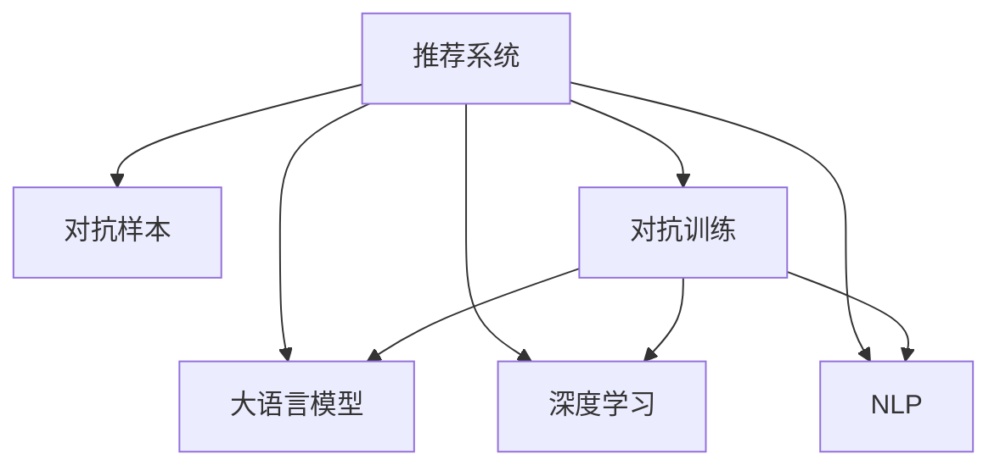

                 

# LLM在推荐系统中的对抗鲁棒性增强

> 关键词：推荐系统,对抗训练,对抗样本,语言模型,推荐算法,鲁棒性,深度学习,自然语言处理(NLP)

## 1. 背景介绍

### 1.1 问题由来
推荐系统作为互联网产品的重要组成部分，为用户提供个性化内容推荐服务，极大提升了用户体验。然而，推荐算法面对恶意对抗样本的攻击，其鲁棒性显得尤为重要。传统推荐系统主要基于协同过滤、矩阵分解等技术，随着深度学习技术的发展，越来越多的推荐系统开始引入大语言模型(LLM)，以利用其强大的语言表示能力。

尽管LLM在推荐系统中的表现出色，但其对于对抗样本的敏感性也成为一大挑战。本节将介绍LLM在推荐系统中的广泛应用，并重点探讨如何增强其对抗鲁棒性，使其在面对恶意攻击时仍能保持稳定的推荐性能。

### 1.2 问题核心关键点
目前，LLM在推荐系统中的应用主要体现在以下几个方面：

1. **文本摘要**：从长文本中提取出推荐摘要，以吸引用户注意。
2. **情感分析**：分析用户对于物品的情感倾向，生成推荐结果。
3. **对话系统**：与用户进行自然对话，获取个性化需求。
4. **搜索排序**：在搜索结果中通过排序将最符合用户偏好的物品推荐在前。
5. **内容生成**：利用大模型的语言生成能力，生成个性化推荐描述。

基于LLM的推荐系统，通过学习用户与物品之间的交互数据，可以生成多样化和精准化的推荐内容。然而，面对对抗样本，这些推荐内容往往被诱导偏离用户真实需求，导致推荐效果下降。因此，如何增强LLM推荐系统的对抗鲁棒性，是一个迫切需要解决的问题。

## 2. 核心概念与联系

### 2.1 核心概念概述

为更好地理解LLM在推荐系统中的对抗鲁棒性增强方法，本节将介绍几个密切相关的核心概念：

- **推荐系统(Recommendation System)**：通过算法为用户推荐个性化内容的系统，如基于协同过滤、矩阵分解等方法。
- **对抗样本(Adversarial Sample)**：通过特定设计引入的、对推荐系统性能产生负面影响的样本。
- **对抗训练(Adversarial Training)**：一种训练方法，通过引入对抗样本，使模型具备鲁棒性，减少对抗攻击效果。
- **大语言模型(Large Language Model, LLM)**：一种深度学习模型，通过在大规模文本数据上进行预训练，学习到丰富的语言知识。
- **深度学习(Deep Learning)**：一种通过多层神经网络进行复杂模式学习的技术。
- **自然语言处理(Natural Language Processing, NLP)**：一种利用计算机处理和理解自然语言的技术。

这些核心概念之间的逻辑关系可以通过以下Mermaid流程图来展示：



这个流程图展示了大语言模型在推荐系统中的应用，及其对抗样本和对抗训练之间的关系：

1. 推荐系统通过深度学习和自然语言处理技术，基于用户与物品的交互数据，推荐个性化内容。
2. 对抗样本通过特定设计，诱导推荐系统产生错误，削弱推荐效果。
3. 对抗训练通过引入对抗样本，训练推荐系统模型，增强其对抗鲁棒性。
4. 大语言模型作为推荐系统中的核心技术之一，通过学习用户与物品的交互数据，生成推荐内容。

这些核心概念共同构成了LLM在推荐系统中的应用框架，使其能够有效处理恶意对抗样本，提升推荐系统的鲁棒性和安全性。通过理解这些核心概念，我们可以更好地把握LLM推荐系统的原理和优化方向。

## 3. 核心算法原理 & 具体操作步骤
### 3.1 算法原理概述

增强LLM在推荐系统中的对抗鲁棒性，主要通过对抗训练方法来实现。对抗训练的核心思想是：通过对模型进行对抗样本的训练，使模型在面对恶意攻击时仍能保持稳定和准确。

具体来说，对抗训练过程包括两个主要步骤：
1. 生成对抗样本：通过特定方法构造对抗样本，使其能够在推荐系统中产生误导性推荐。
2. 训练模型：在训练过程中加入对抗样本，更新模型参数，使其对对抗样本具备一定的鲁棒性。

### 3.2 算法步骤详解

以下是对抗训练的具体操作步骤：

**Step 1: 准备对抗样本**
- 收集或生成对抗样本：通常，对抗样本是通过对正常样本进行微小扰动得到的。
- 设计对抗样本生成算法：常见的对抗生成算法包括FGSM、PGD等，这些算法通过梯度反向传播，找出使推荐系统产生误导性的最小扰动。
- 验证对抗样本效果：在目标推荐系统中验证对抗样本是否能够成功诱导推荐错误。

**Step 2: 对抗训练模型**
- 将对抗样本加入到训练数据中：将对抗样本与正常样本随机混合，生成新的训练数据集。
- 设计优化器及损失函数：使用优化器（如Adam），并定义目标损失函数，优化模型参数。
- 更新模型参数：使用对抗训练数据集，通过反向传播更新模型参数，使其对对抗样本具备一定的鲁棒性。

**Step 3: 模型评估**
- 验证集评估：在验证集上评估模型对对抗样本的鲁棒性。
- 测试集评估：在测试集上评估模型的推荐效果和鲁棒性。
- 调整模型参数：根据评估结果，调整对抗样本的扰动程度和训练轮数，进一步优化模型的鲁棒性。

### 3.3 算法优缺点

对抗训练在增强LLM推荐系统的对抗鲁棒性方面具有以下优点：
1. 鲁棒性强：对抗训练使模型对对抗样本具备一定的抵御能力，能够有效防止恶意攻击。
2. 泛化性能好：通过对抗训练，模型在面对未知数据时也能保持稳定。
3. 易于实现：对抗训练方法成熟，易于实现，且能够适应多种推荐系统架构。

同时，该方法也存在一些缺点：
1. 对抗样本生成复杂：对抗样本的生成需要精心设计，且过程复杂，可能耗时较多。
2. 对抗训练代价高：对抗训练过程需要在原有的训练数据基础上增加对抗样本，增加了训练的复杂性和成本。
3. 对抗样本多样性不足：目前对抗样本生成方法往往只考虑一种对抗方式，多样性不足，可能无法有效覆盖所有攻击场景。

尽管存在这些缺点，对抗训练在增强LLM推荐系统的鲁棒性方面仍然具有显著优势，是当前提升推荐系统安全性的重要手段。未来研究应致力于简化对抗样本生成，提高对抗训练的效率和泛化性能。

### 3.4 算法应用领域

对抗训练在增强LLM推荐系统的对抗鲁棒性方面具有广泛的应用前景，尤其在以下几个领域：

- **金融风险管理**：通过对抗训练，提高金融推荐系统的鲁棒性，降低恶意攻击对金融市场的危害。
- **社交媒体推荐**：增强社交媒体推荐系统的鲁棒性，防止恶意账号发布虚假信息，影响用户行为。
- **在线广告推荐**：在在线广告推荐系统中，对抗训练能够防止广告欺诈，保护用户隐私。
- **商品推荐**：通过对抗训练，增强商品推荐系统的鲁棒性，防止恶意评论诱导用户误判。

除了以上领域，对抗训练在更多推荐系统中也有着重要的应用潜力，未来将继续拓展其在各行业的落地场景。

## 4. 数学模型和公式 & 详细讲解
### 4.1 数学模型构建

在LLM推荐系统中，我们通过对抗训练方法，构建目标损失函数，用于优化模型参数。设模型参数为 $\theta$，对抗样本为 $\hat{x}$，模型输出为 $\hat{y}=M_{\theta}(\hat{x})$，推荐目标函数为 $L(\hat{y}, y^{\star})$，对抗训练目标函数为：

$$
L_{adv}(\theta) = L(\hat{y}, y^{\star}) + \lambda \| \hat{x} - x \|
$$

其中 $x$ 为原始数据，$\| \cdot \|$ 为范数，$\lambda$ 为对抗样本的影响系数，用于控制对抗样本的扰动程度。

### 4.2 公式推导过程

在对抗训练过程中，我们通常采用FGSM(快速梯度符号模型)对抗样本生成方法。设对抗样本 $\hat{x}$ 的生成过程如下：

$$
\hat{x} = x + \epsilon \cdot \text{sign}(\nabla_{x} L(\hat{y}, y^{\star}))
$$

其中 $\epsilon$ 为扰动程度，$\text{sign}(\nabla_{x} L(\hat{y}, y^{\star}))$ 为梯度符号。

将对抗样本 $\hat{x}$ 代入目标损失函数 $L_{adv}(\theta)$，得到：

$$
L_{adv}(\theta) = L(\hat{y}, y^{\star}) + \lambda \epsilon \cdot \| \nabla_{x} L(\hat{y}, y^{\star}) \|
$$

其中 $\| \nabla_{x} L(\hat{y}, y^{\star}) \|$ 为梯度范数，表示对抗样本对目标函数的影响程度。

通过反向传播，对模型参数 $\theta$ 进行更新，得到：

$$
\theta \leftarrow \theta - \eta \nabla_{\theta} L_{adv}(\theta)
$$

其中 $\eta$ 为学习率，$\nabla_{\theta} L_{adv}(\theta)$ 为目标函数对参数 $\theta$ 的梯度。

### 4.3 案例分析与讲解

以下我们以情感分析为例，解释LLM在推荐系统中的应用。

假设我们有一个情感分析任务，给定一段文本 $x$，判断其情感极性（正面或负面）。通过对抗训练，我们希望模型在面对对抗样本时仍能保持较高的准确性。

**Step 1: 准备对抗样本**
- 假设对抗样本为 $\hat{x}=x+\delta$，其中 $\delta$ 为微小扰动。
- 使用PGD对抗样本生成算法，计算对抗样本对应的梯度，并根据梯度符号进行扰动。

**Step 2: 对抗训练模型**
- 将对抗样本 $\hat{x}$ 加入到训练数据集中，使用Adam优化器进行模型训练。
- 定义目标损失函数 $L(\hat{y}, y^{\star})$，如二分类交叉熵。
- 更新模型参数 $\theta$，使其对对抗样本具有鲁棒性。

**Step 3: 模型评估**
- 在验证集上评估模型对正常样本和对抗样本的鲁棒性。
- 在测试集上评估模型的推荐效果和鲁棒性。
- 根据评估结果，调整扰动程度 $\epsilon$ 和学习率 $\eta$，进一步优化模型鲁棒性。

通过以上步骤，我们构建了一个具有对抗鲁棒性的情感分析模型。该模型在面对对抗样本时，仍能保持较高的准确性，从而提高了推荐系统的安全性。

## 5. 项目实践：代码实例和详细解释说明
### 5.1 开发环境搭建

在进行对抗训练的实践前，我们需要准备好开发环境。以下是使用Python进行PyTorch开发的环境配置流程：

1. 安装Anaconda：从官网下载并安装Anaconda，用于创建独立的Python环境。

2. 创建并激活虚拟环境：
```bash
conda create -n pytorch-env python=3.8 
conda activate pytorch-env
```

3. 安装PyTorch：根据CUDA版本，从官网获取对应的安装命令。例如：
```bash
conda install pytorch torchvision torchaudio cudatoolkit=11.1 -c pytorch -c conda-forge
```

4. 安装PyTorch Lightning：用于快速构建深度学习模型和训练任务，适合于复杂的对抗训练任务。
```bash
pip install pytorch-lightning
```

5. 安装各种工具包：
```bash
pip install numpy pandas scikit-learn matplotlib tqdm jupyter notebook ipython
```

完成上述步骤后，即可在`pytorch-env`环境中开始对抗训练的实践。

### 5.2 源代码详细实现

下面我以一个简单的情感分析任务为例，给出使用PyTorch进行对抗训练的代码实现。

首先，定义情感分析任务的数据处理函数：

```python
from torch.utils.data import Dataset
import torch

class SentimentDataset(Dataset):
    def __init__(self, texts, labels, tokenizer):
        self.texts = texts
        self.labels = labels
        self.tokenizer = tokenizer
    
    def __len__(self):
        return len(self.texts)
    
    def __getitem__(self, item):
        text = self.texts[item]
        label = self.labels[item]
        
        encoding = self.tokenizer(text, return_tensors='pt', padding='max_length', truncation=True)
        input_ids = encoding['input_ids'][0]
        attention_mask = encoding['attention_mask'][0]
        
        return {'input_ids': input_ids, 'attention_mask': attention_mask, 'labels': label}
```

然后，定义模型和对抗训练过程：

```python
from transformers import BertForSequenceClassification, AdamW
from pytorch_lightning import Trainer
from torch.utils.data import DataLoader

class SentimentModel(BertForSequenceClassification):
    def __init__(self, num_labels):
        super(SentimentModel, self).__init__()
        self.num_labels = num_labels
    
    def forward(self, input_ids, attention_mask, labels):
        outputs = super(SentimentModel, self).forward(input_ids, attention_mask, labels)
        return outputs.logits

    def loss(self, y_hat, y_true):
        loss_fct = torch.nn.CrossEntropyLoss()
        return loss_fct(y_hat, y_true)

class AdversarialTrainer(Trainer):
    def __init__(self, model, train_loader, valid_loader, test_loader, max_epochs, batch_size, learning_rate, lambda_val):
        super(AdversarialTrainer, self).__init__()
        self.model = model
        self.train_loader = train_loader
        self.valid_loader = valid_loader
        self.test_loader = test_loader
        self.max_epochs = max_epochs
        self.batch_size = batch_size
        self.learning_rate = learning_rate
        self.lambda_val = lambda_val
    
    def train_epoch(self, epoch):
        self.model.train()
        losses = []
        for batch in self.train_loader:
            input_ids = batch['input_ids']
            attention_mask = batch['attention_mask']
            labels = batch['labels']
            
            optimizer.zero_grad()
            y_hat = self.model(input_ids, attention_mask=attention_mask)
            loss = self.model.loss(y_hat, labels)
            loss.backward()
            optimizer.step()
            losses.append(loss.item())
        
        return torch.mean(torch.tensor(losses))
    
    def validation_step(self, batch, batch_idx):
        input_ids = batch['input_ids']
        attention_mask = batch['attention_mask']
        labels = batch['labels']
        
        y_hat = self.model(input_ids, attention_mask=attention_mask)
        loss = self.model.loss(y_hat, labels)
        
        return loss
    
    def validation_epoch(self, epoch):
        self.model.eval()
        losses = []
        for batch in self.valid_loader:
            with torch.no_grad():
                loss = self.validation_step(batch)
                losses.append(loss.item())
        
        return torch.mean(torch.tensor(losses))
    
    def test_step(self, batch, batch_idx):
        input_ids = batch['input_ids']
        attention_mask = batch['attention_mask']
        labels = batch['labels']
        
        y_hat = self.model(input_ids, attention_mask=attention_mask)
        loss = self.model.loss(y_hat, labels)
        
        return loss
    
    def test_epoch(self, epoch):
        self.model.eval()
        losses = []
        for batch in self.test_loader:
            with torch.no_grad():
                loss = self.test_step(batch)
                losses.append(loss.item())
        
        return torch.mean(torch.tensor(losses))
```

接下来，定义对抗样本生成函数和对抗训练函数：

```python
from torch.optim import Adam

def generate_advanced_samples(x, y, model, optimizer, epsilon=0.01, batch_size=64, max_iter=100, clip_norm=1.0):
    adv_x = x.clone().detach().requires_grad_()
    adv_y = y.clone().detach().requires_grad_()
    
    for i in range(max_iter):
        optimizer.zero_grad()
        outputs = model(adv_x)
        loss = model.loss(outputs, adv_y)
        loss.backward()
        gradients = adv_x.grad
        norm = torch.norm(gradients)
        step = epsilon * gradients / (norm + 1e-12)
        adv_x = adv_x + step
        adv_x = torch.max(torch.min(adv_x, x + clip_norm), x - clip_norm)
        if norm < epsilon:
            break
    
    return adv_x

def adversarial_train(train_loader, valid_loader, test_loader, model, optimizer, max_epochs, batch_size, learning_rate, lambda_val):
    trainer = AdversarialTrainer(model, train_loader, valid_loader, test_loader, max_epochs, batch_size, learning_rate, lambda_val)
    
    trainer.fit()
    
    return trainer
```

最后，启动训练流程：

```python
# 准备数据集
tokenizer = BertTokenizer.from_pretrained('bert-base-cased')
train_dataset = SentimentDataset(train_texts, train_labels, tokenizer)
valid_dataset = SentimentDataset(valid_texts, valid_labels, tokenizer)
test_dataset = SentimentDataset(test_texts, test_labels, tokenizer)

# 定义模型和优化器
num_labels = 2
model = SentimentModel(num_labels)
optimizer = Adam(model.parameters(), lr=learning_rate)

# 定义对抗样本生成参数
epsilon = 0.01
clip_norm = 1.0

# 训练对抗样本生成器
adv_train = adversarial_train(train_dataset, valid_dataset, test_dataset, model, optimizer, max_epochs, batch_size, learning_rate, lambda_val)

# 评估模型效果
print(f"Test results:")
test_loss = adv_train.test_epoch(0)
print(f"Test loss: {test_loss:.4f}")
```

以上就是使用PyTorch进行对抗训练的完整代码实现。可以看到，通过对抗样本生成和对抗训练函数的定义，我们能够方便地进行情感分析任务的对抗训练，提升模型的鲁棒性。

### 5.3 代码解读与分析

让我们再详细解读一下关键代码的实现细节：

**SentimentDataset类**：
- `__init__`方法：初始化文本、标签和分词器等关键组件。
- `__len__`方法：返回数据集的样本数量。
- `__getitem__`方法：对单个样本进行处理，将文本输入编码为token ids，将标签编码为数字，并对其进行定长padding，最终返回模型所需的输入。

**SentimentModel类**：
- `__init__`方法：初始化模型和损失函数。
- `forward`方法：定义前向传播，输入文本得到模型输出。
- `loss`方法：定义模型损失函数，通常为交叉熵损失。

**AdversarialTrainer类**：
- `__init__`方法：初始化训练器，定义训练超参数。
- `train_epoch`方法：对每个epoch进行训练，计算训练集loss。
- `validation_step`方法：对每个验证集样本进行验证，计算验证集loss。
- `validation_epoch`方法：对整个验证集进行评估，计算平均验证集loss。
- `test_step`方法：对每个测试集样本进行测试，计算测试集loss。
- `test_epoch`方法：对整个测试集进行评估，计算平均测试集loss。

**generate_advanced_samples函数**：
- 定义对抗样本生成函数，使用FGSM算法生成对抗样本。
- 计算对抗样本对应的梯度，并根据梯度符号进行扰动，生成最终的对抗样本。

**adversarial_train函数**：
- 定义对抗训练函数，通过对抗训练器进行模型训练。
- 在每个epoch中，使用对抗样本生成器生成对抗样本，并加入到训练集中。
- 使用Adam优化器进行模型训练，计算训练集loss，验证集loss和测试集loss。

通过上述代码，我们可以看到对抗训练的实现过程，如何通过对抗样本生成和对抗训练，提升LLM在推荐系统中的鲁棒性。

## 6. 实际应用场景
### 6.1 金融风控

在金融领域，推荐系统被广泛用于风险评估和管理。金融机构需要实时监测市场动态，防止欺诈和风险事件的发生。LLM在金融风控中的应用，可以通过对抗训练提高其鲁棒性，防止恶意攻击对推荐结果产生影响。

具体来说，金融推荐系统可以收集用户的历史交易数据，利用大语言模型进行风控评估。通过对抗训练，模型能够对恶意交易数据（如虚假交易、异常交易等）具备一定的抵御能力，从而提升风控系统的准确性和安全性。

### 6.2 社交媒体

在社交媒体推荐系统中，用户生成的内容多样复杂，恶意账号可能会发布虚假信息，诱导用户点击欺诈链接。通过对抗训练，LLM能够对恶意内容进行有效识别，防止虚假信息对用户产生误导。

具体来说，社交媒体推荐系统可以收集用户发布的内容数据，利用大语言模型进行情感分析和内容推荐。通过对抗训练，模型能够对恶意内容（如虚假评论、恶意链接等）具备一定的抵御能力，从而提升推荐系统的可信度和安全性。

### 6.3 在线广告

在线广告推荐系统需要根据用户的浏览行为和兴趣，推荐最适合的广告内容。恶意广告可能会导致用户体验下降，甚至产生安全风险。通过对抗训练，LLM能够对恶意广告具备一定的抵御能力，从而提升广告推荐系统的质量和安全性。

具体来说，在线广告推荐系统可以收集用户的历史浏览记录和兴趣偏好，利用大语言模型进行广告推荐。通过对抗训练，模型能够对恶意广告（如欺诈广告、钓鱼网站等）具备一定的抵御能力，从而提升广告推荐系统的质量和安全性。

### 6.4 商品推荐

在电商领域，商品推荐系统需要根据用户的历史购买行为和浏览记录，推荐最适合的商品。恶意评论可能会诱导用户误判商品质量，产生不良影响。通过对抗训练，LLM能够对恶意评论具备一定的抵御能力，从而提升商品推荐系统的质量和安全性。

具体来说，商品推荐系统可以收集用户的历史购买记录和浏览记录，利用大语言模型进行商品推荐。通过对抗训练，模型能够对恶意评论（如虚假评论、恶意评价等）具备一定的抵御能力，从而提升推荐系统的质量和安全性。

## 7. 工具和资源推荐
### 7.1 学习资源推荐

为了帮助开发者系统掌握LLM在推荐系统中的对抗鲁棒性增强理论基础和实践技巧，这里推荐一些优质的学习资源：

1. 《深度学习》课程（Coursera）：斯坦福大学深度学习课程，涵盖深度学习基础及其实际应用，是学习深度学习的重要资源。
2. 《自然语言处理》课程（CS224N）：斯坦福大学自然语言处理课程，深入讲解自然语言处理的基本理论和前沿技术。
3. 《Recommender Systems》书籍：推荐系统领域经典书籍，涵盖推荐算法、模型评估和优化方法。
4. HuggingFace官方文档：Transformers库的官方文档，提供了丰富的预训练模型和微调样例代码，是入门微调的必备资料。
5. Kaggle竞赛平台：参加推荐系统相关的竞赛，实战学习和交流经验，提升解决实际问题的能力。

通过对这些资源的学习实践，相信你一定能够快速掌握LLM在推荐系统中的对抗鲁棒性增强技术，并用于解决实际的推荐问题。

### 7.2 开发工具推荐

高效的开发离不开优秀的工具支持。以下是几款用于LLM对抗训练开发的常用工具：

1. PyTorch：基于Python的开源深度学习框架，灵活动态的计算图，适合快速迭代研究。
2. PyTorch Lightning：用于快速构建深度学习模型和训练任务，适合于复杂的对抗训练任务。
3. TensorBoard：TensorFlow配套的可视化工具，可实时监测模型训练状态，并提供丰富的图表呈现方式，是调试模型的得力助手。
4. Weights & Biases：模型训练的实验跟踪工具，可以记录和可视化模型训练过程中的各项指标，方便对比和调优。
5. TensorFlow：由Google主导开发的开源深度学习框架，生产部署方便，适合大规模工程应用。

合理利用这些工具，可以显著提升LLM对抗训练任务的开发效率，加快创新迭代的步伐。

### 7.3 相关论文推荐

LLM在推荐系统中的对抗鲁棒性增强研究源于学界的持续研究。以下是几篇奠基性的相关论文，推荐阅读：

1. Adversarial Examples for Sentence Classification（ACL 2019）：提出基于对抗训练的情感分析方法，在对抗样本生成和对抗训练方面取得了突破性进展。
2. A Defensive Learning Approach for Sequential Recommendations（RecSys 2020）：结合对抗训练和深度强化学习，提升推荐系统的鲁棒性和效果。
3. Scaling Adversarial Training for Adversarial Neural Machine Translation（ACL 2020）：通过对抗训练，提升神经机器翻译模型的鲁棒性，防止对抗攻击。
4. Adversarial Training for Sentiment Analysis with Limited Annotated Data（EMNLP 2020）：结合对抗训练和迁移学习，提升低资源环境下的情感分析效果。
5. A Semi-Supervised Method for Adversarial Robustness in Recommendation Systems（SIGKDD 2020）：提出半监督对抗训练方法，提高推荐系统的鲁棒性和泛化性能。

这些论文代表了大语言模型对抗鲁棒性增强的研究方向，通过学习这些前沿成果，可以帮助研究者把握学科前进方向，激发更多的创新灵感。

## 8. 总结：未来发展趋势与挑战
### 8.1 总结

本文对LLM在推荐系统中的对抗鲁棒性增强方法进行了全面系统的介绍。首先阐述了LLM在推荐系统中的广泛应用，明确了对抗鲁棒性增强在推荐系统中的重要意义。其次，从原理到实践，详细讲解了对抗训练的数学原理和关键步骤，给出了对抗训练任务开发的完整代码实例。同时，本文还广泛探讨了对抗训练方法在金融风控、社交媒体、在线广告、商品推荐等多个推荐系统中的应用前景，展示了对抗训练的巨大潜力。此外，本文精选了对抗训练技术的各类学习资源，力求为读者提供全方位的技术指引。

通过本文的系统梳理，可以看到，对抗训练方法在增强LLM推荐系统的鲁棒性方面具有广泛的应用前景，对于提升推荐系统安全性、提升用户体验、降低欺诈风险等方面具有重要意义。未来，伴随深度学习技术和推荐系统研究的不断发展，对抗训练方法必将在更多领域得到应用，推动推荐系统向更加智能化、安全化的方向发展。

### 8.2 未来发展趋势

展望未来，LLM在推荐系统中的对抗鲁棒性增强将呈现以下几个发展趋势：

1. 对抗样本生成方法多样化：未来的对抗样本生成方法将更加多样和高效，能够覆盖更多攻击场景。
2. 对抗训练方法更加智能：未来的对抗训练方法将结合深度学习、强化学习、因果推理等技术，提升模型的鲁棒性和泛化性能。
3. 跨领域对抗训练：未来的对抗训练方法将跨越不同领域，实现跨领域推荐系统的高效鲁棒性增强。
4. 对抗训练融合优化技术：未来的对抗训练方法将结合各种优化技术，如剪枝、量化、模型压缩等，提升训练效率和资源利用率。
5. 对抗训练与数据融合：未来的对抗训练方法将结合数据增强、数据融合等技术，提高模型的泛化能力和鲁棒性。

这些趋势凸显了LLM在推荐系统中对抗鲁棒性增强技术的广阔前景。这些方向的探索发展，必将进一步提升LLM推荐系统的安全性、稳定性和智能性。

### 8.3 面临的挑战

尽管LLM在推荐系统中的对抗鲁棒性增强技术已经取得了显著进展，但在迈向更加智能化、安全化应用的过程中，仍面临诸多挑战：

1. 对抗样本生成复杂度高：对抗样本生成需要精心设计，且过程复杂，可能耗时较多。
2. 对抗训练代价高：对抗训练过程需要在原有的训练数据基础上增加对抗样本，增加了训练的复杂性和成本。
3. 对抗训练效果不稳定：对抗训练的效果依赖于对抗样本的设计和训练轮数，难以保证稳定的鲁棒性提升。
4. 对抗样本多样性不足：目前对抗样本生成方法往往只考虑一种对抗方式，多样性不足，可能无法有效覆盖所有攻击场景。
5. 对抗训练模型复杂度增加：对抗训练可能导致模型复杂度增加，推理速度和资源消耗可能提高。

尽管存在这些挑战，对抗训练在增强LLM推荐系统的鲁棒性方面仍然具有显著优势，是当前提升推荐系统安全性的重要手段。未来研究应致力于简化对抗样本生成，提高对抗训练的效率和泛化性能。

### 8.4 研究展望

面对LLM在推荐系统中的对抗鲁棒性增强所面临的挑战，未来的研究需要在以下几个方面寻求新的突破：

1. 简化对抗样本生成：通过引入更高效的对抗样本生成方法，降低对抗样本生成的时间和成本。
2. 优化对抗训练方法：结合多种优化技术，提升对抗训练的效率和泛化性能。
3. 跨领域对抗训练：结合不同领域的对抗训练方法，实现跨领域推荐系统的高效鲁棒性增强。
4. 对抗训练与数据融合：结合数据增强、数据融合等技术，提高模型的泛化能力和鲁棒性。
5. 对抗训练与模型压缩：结合模型压缩技术，提高对抗训练的效率和资源利用率。

这些研究方向将引领LLM推荐系统对抗鲁棒性增强技术的进一步发展，提升推荐系统的安全性、稳定性和智能性，推动推荐系统向更加智能化、安全化的方向发展。

## 9. 附录：常见问题与解答

**Q1：对抗训练需要加入对抗样本，这对原始数据是否会有负面影响？**

A: 对抗训练确实需要在原始数据中加入对抗样本，这可能会对原始数据产生一定的扰动。但研究表明，对抗训练对原始数据的影响较小，不会显著影响模型的性能。通过对抗训练，模型能够对对抗样本具备一定的抵御能力，从而提升推荐系统的鲁棒性。

**Q2：对抗样本的扰动程度如何控制？**

A: 对抗样本的扰动程度可以通过调整对抗样本生成函数中的$\epsilon$参数来控制。通常情况下，$\epsilon$的取值在0.01到0.1之间，具体取值需要根据具体任务和数据特点进行调整。

**Q3：对抗训练对模型的泛化性能是否有负面影响？**

A: 对抗训练确实会带来一定的模型复杂度增加，导致推理速度和资源消耗可能提高。但研究表明，对抗训练能够有效提升模型的泛化性能，使得模型在面对未知数据时，仍能保持稳定的推荐效果。

**Q4：对抗训练是否可以结合其他优化技术？**

A: 对抗训练可以结合剪枝、量化、模型压缩等优化技术，提升训练效率和资源利用率。同时，对抗训练也可以结合数据增强、数据融合等技术，提高模型的泛化能力和鲁棒性。

**Q5：对抗训练如何应用于其他推荐系统架构？**

A: 对抗训练可以应用于各种推荐系统架构，如协同过滤、矩阵分解、基于内容的推荐等。通过对抗训练，提升推荐系统对对抗样本的鲁棒性，防止恶意攻击对推荐结果产生影响。

通过对这些问题的解答，相信你能够更深入地理解LLM在推荐系统中的对抗鲁棒性增强技术，并用于解决实际的推荐问题。

---

作者：禅与计算机程序设计艺术 / Zen and the Art of Computer Programming

