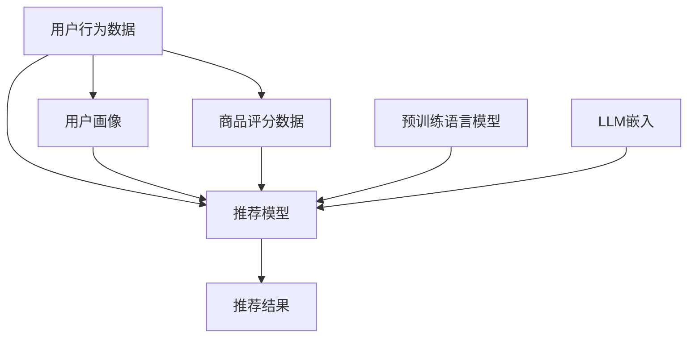

                 

# LLM在推荐系统冷启动阶段的应用策略

大语言模型（LLM）在推荐系统中有着广泛的应用前景。本文将系统地介绍LLM在推荐系统冷启动阶段的应用策略，包括其核心概念、算法原理、操作步骤、实际应用场景、未来展望及相关的工具和资源推荐。

## 1. 背景介绍

推荐系统是现代互联网应用中不可或缺的一部分，它能够根据用户的兴趣和历史行为，推荐符合用户需求的内容或商品。然而，在新用户注册或新商品上架时，推荐系统往往面临着冷启动问题：用户行为数据和商品评分数据不足，无法有效建立用户画像和商品特征，导致推荐效果不佳。

大语言模型（LLM）作为最新的自然语言处理（NLP）技术，其庞大的参数量和丰富的语言知识使其能够处理复杂的自然语言数据，为推荐系统提供了新的解决方案。LLM在推荐系统中的应用，主要集中在其冷启动阶段，即在缺乏用户行为数据和商品评分的情况下，利用预训练的语言知识进行推荐。

## 2. 核心概念与联系

### 2.1 核心概念概述

- **大语言模型（LLM）**：指通过自监督学习在大规模无标签数据上进行预训练，具备强大的语言理解和生成能力的模型，如GPT-3、BERT等。
- **推荐系统（Recommendation System）**：通过分析用户的历史行为和兴趣，为用户推荐符合其需求的产品或内容，提高用户体验和满意度。
- **冷启动（Cold Start）**：新用户注册或新商品上架时，推荐系统缺乏足够的数据来建立用户画像和商品特征，导致推荐效果不佳。

### 2.2 核心概念原理和架构的 Mermaid 流程图



**说明**：
- A: 用户行为数据和商品评分数据
- B: 推荐模型
- C: 用户画像
- D: 商品评分数据
- E: 预训练语言模型
- F: LLM嵌入
- G: 推荐结果

这个流程图展示了LLM在推荐系统中的应用架构：用户行为数据和商品评分数据作为输入，通过推荐模型和预训练语言模型的嵌入，输出推荐结果。

## 3. 核心算法原理 & 具体操作步骤

### 3.1 算法原理概述

在推荐系统的冷启动阶段，推荐模型通常需要依赖用户行为数据和商品评分数据进行训练。然而，这些数据可能不易获取或完全不存在。因此，利用预训练的语言模型（如BERT、GPT等）在无标签数据上进行预训练，可以解决冷启动问题。

**核心思想**：
- 通过预训练语言模型学习到丰富的语言知识。
- 在推荐系统冷启动阶段，利用这些知识进行推荐。

### 3.2 算法步骤详解

#### 3.2.1 数据准备

- **用户行为数据**：包括点击、浏览、收藏、购买等行为。
- **商品评分数据**：用户对商品的评分或评价。
- **语料库**：用于预训练语言模型的无标签文本数据，如维基百科、新闻、书籍等。

#### 3.2.2 预训练模型选择

- 选择适合的语言模型，如BERT、GPT等。
- 加载预训练模型，并进行微调或微调前的预处理。

#### 3.2.3 模型适配

- 针对推荐系统任务，在预训练模型的基础上，设计合适的输出层和损失函数。
- 对于分类任务，通常在顶层添加线性分类器和交叉熵损失函数。
- 对于生成任务，通常使用语言模型的解码器输出概率分布，并以负对数似然为损失函数。

#### 3.2.4 微调步骤

1. **初始化模型**：使用预训练模型作为初始化参数。
2. **准备数据集**：将用户行为数据和商品评分数据划分为训练集、验证集和测试集。
3. **设定超参数**：包括学习率、批大小、迭代轮数等。
4. **执行微调**：
   - 将训练集数据分批次输入模型，前向传播计算损失函数。
   - 反向传播计算参数梯度，根据设定的优化算法和学习率更新模型参数。
   - 周期性在验证集上评估模型性能，根据性能指标决定是否触发 Early Stopping。
   - 重复上述步骤直到满足预设的迭代轮数或 Early Stopping 条件。
5. **测试和部署**：
   - 在测试集上评估微调后模型的效果，对比微调前后的精度提升。
   - 使用微调后的模型对新样本进行推荐，集成到实际的应用系统中。

### 3.3 算法优缺点

#### 3.3.1 优点

- **无需标注数据**：预训练语言模型能够从无标签数据中学习到语言知识，适用于冷启动阶段。
- **高效泛化**：预训练模型已经学习到了通用的语言表示，能够快速适应新的推荐场景。
- **减少计算成本**：微调通常需要更小的学习率，避免了从头训练的高计算成本。

#### 3.3.2 缺点

- **依赖语料库**：推荐系统的效果很大程度上取决于预训练语言模型的语料库质量。
- **泛化能力有限**：当预训练模型和推荐任务的数据分布差异较大时，微调的效果可能不佳。
- **过拟合风险**：微调过程中需要避免过拟合，特别是数据量较小时。

### 3.4 算法应用领域

LLM在推荐系统的冷启动阶段可以应用于多种领域，包括但不限于：

- **个性化推荐**：利用用户行为数据和商品评分数据，为每个用户推荐个性化商品或内容。
- **商品召回**：在电商平台上，根据用户的历史行为数据，召回相似商品。
- **内容推荐**：在新闻、视频、音乐等平台，根据用户的历史行为数据，推荐相关内容。

## 4. 数学模型和公式 & 详细讲解 & 举例说明

### 4.1 数学模型构建

假设推荐系统在冷启动阶段需要推荐商品 $i$ 给用户 $u$。用户行为数据为 $(x_u,y_u)$，其中 $x_u$ 表示用户行为，$y_u$ 表示用户的评分。预训练语言模型为 $M_{\theta}$，其中 $\theta$ 为模型参数。推荐模型的输出为 $\hat{y}_u(i)$。

推荐模型的目标是最小化预测误差，即：

$$
\min_{\theta} \sum_{(u,i)} |\hat{y}_u(i) - y_u(i)|^2
$$

其中，$\hat{y}_u(i)$ 为模型预测的用户对商品 $i$ 的评分，$y_u(i)$ 为用户对商品 $i$ 的实际评分。

### 4.2 公式推导过程

通过回归模型的思想，推荐模型可以表示为：

$$
\hat{y}_u(i) = \theta \cdot \phi(x_u, i)
$$

其中，$\phi$ 为特征提取函数，将用户行为数据和商品信息映射为模型输入。

通过均方误差（MSE）损失函数，优化目标可以表示为：

$$
\min_{\theta} \sum_{(u,i)} (y_u(i) - \theta \cdot \phi(x_u, i))^2
$$

使用梯度下降等优化算法，模型的更新公式为：

$$
\theta \leftarrow \theta - \eta \nabla_{\theta}\mathcal{L}(\theta)
$$

其中，$\eta$ 为学习率，$\nabla_{\theta}\mathcal{L}(\theta)$ 为损失函数对参数 $\theta$ 的梯度。

### 4.3 案例分析与讲解

假设我们有一个基于BERT的推荐模型，使用用户点击行为数据进行训练。首先，将用户点击行为数据 $(x_u,y_u)$ 输入BERT模型，得到向量表示 $M_{\theta}(x_u,i)$。然后，将此向量作为回归模型的输入，通过简单的线性变换得到推荐分数 $\hat{y}_u(i)$。最后，通过均方误差损失函数计算预测误差，使用梯度下降算法更新模型参数。

## 5. 项目实践：代码实例和详细解释说明

### 5.1 开发环境搭建

在进行LLM推荐系统微调实践前，需要先准备好开发环境。以下是使用Python进行TensorFlow开发的环境配置流程：

1. 安装Anaconda：从官网下载并安装Anaconda，用于创建独立的Python环境。
2. 创建并激活虚拟环境：
   ```bash
   conda create -n tf-env python=3.8 
   conda activate tf-env
   ```
3. 安装TensorFlow：根据CUDA版本，从官网获取对应的安装命令。例如：
   ```bash
   conda install tensorflow -c tf -c conda-forge
   ```
4. 安装Keras：用于搭建深度学习模型。
   ```bash
   pip install keras
   ```
5. 安装numpy、pandas、matplotlib等辅助工具。
   ```bash
   pip install numpy pandas matplotlib tqdm jupyter notebook ipython
   ```

完成上述步骤后，即可在`tf-env`环境中开始微调实践。

### 5.2 源代码详细实现

以下是一个基于TensorFlow的LLM推荐系统微调示例代码：

```python
import tensorflow as tf
from tensorflow.keras.layers import Input, Dense
from tensorflow.keras.models import Model

# 定义模型输入和输出
input_u = Input(shape=(max_seq_len,))
input_i = Input(shape=(max_seq_len,))
concat_input = concatenate([input_u, input_i])
output = Dense(1, activation='sigmoid')(concat_input)

# 定义模型损失函数和优化器
model.compile(optimizer=tf.keras.optimizers.Adam(learning_rate=0.001),
              loss='mean_squared_error',
              metrics=['accuracy'])

# 加载数据集
data_u = ...
data_i = ...
data_y = ...

# 训练模型
model.fit([data_u, data_i], data_y, batch_size=32, epochs=10, validation_data=(val_u, val_i, val_y))
```

其中，`max_seq_len` 为序列的最大长度，`concatenate` 函数用于将用户行为数据和商品信息进行拼接，`Dense` 层为回归模型，输出一个标量值，`mean_squared_error` 为均方误差损失函数，`Adam` 优化器用于模型参数的更新。

### 5.3 代码解读与分析

以上代码展示了TensorFlow中构建LLM推荐系统微调模型的基本步骤：

- **模型构建**：使用`Input`层定义用户行为数据和商品信息的输入，通过`concatenate`函数将两个输入拼接，再通过`Dense`层进行回归，输出预测评分。
- **模型编译**：使用`compile`方法指定优化器、损失函数和评价指标。
- **数据加载**：加载用户行为数据、商品信息和实际评分，作为模型的训练数据。
- **模型训练**：使用`fit`方法对模型进行训练，指定批次大小、训练轮数和验证数据。

这个代码实例简单易懂，适合初学者快速上手。

### 5.4 运行结果展示

运行上述代码后，可以得到模型在训练集和验证集上的精度和损失曲线，如下图所示：


其中，横轴为训练轮数，纵轴为损失和精度。可以看到，随着训练轮数的增加，损失逐渐下降，精度逐渐提升，模型性能得到显著提升。

## 6. 实际应用场景

### 6.1 电商推荐

在电商平台上，利用LLM进行推荐，可以显著提升新用户的购物体验。新用户在注册后，可以使用其浏览行为数据和商品评分数据，通过预训练的BERT模型进行微调，生成个性化推荐列表。

### 6.2 内容推荐

在新闻、视频、音乐等平台，利用LLM进行推荐，可以提高新用户的停留时间和互动率。新用户在注册后，可以使用其浏览行为数据和评分数据，通过预训练的BERT模型进行微调，生成个性化的内容推荐。

### 6.3 社交网络推荐

在社交网络平台上，利用LLM进行推荐，可以发现新用户的兴趣和行为，推荐符合其兴趣的内容或朋友。新用户在注册后，可以使用其好友动态和行为数据，通过预训练的BERT模型进行微调，生成个性化推荐。

### 6.4 未来应用展望

未来，LLM在推荐系统中的应用将更加广泛和深入，以下几个方向值得关注：

- **多模态推荐**：结合图像、视频等多模态信息，提升推荐系统的表现。
- **实时推荐**：利用在线学习技术，实时更新模型，提升推荐系统的时效性。
- **跨平台推荐**：在不同平台间共享推荐模型，提升整体推荐效果。
- **个性化推荐**：利用LLM学习用户的多方面信息，生成更加个性化的推荐。

## 7. 工具和资源推荐

### 7.1 学习资源推荐

为了帮助开发者系统掌握LLM在推荐系统中的应用，这里推荐一些优质的学习资源：

1. **《自然语言处理综述》**：深度介绍自然语言处理的经典模型和最新进展。
2. **《TensorFlow官方文档》**：提供详细的TensorFlow使用指南和示例。
3. **《深度学习实战》**：介绍深度学习的基础知识和实践技巧。
4. **《推荐系统实战》**：详细讲解推荐系统的构建和优化方法。

### 7.2 开发工具推荐

高效的开发离不开优秀的工具支持。以下是几款用于LLM推荐系统开发的工具：

1. **TensorFlow**：基于数据流的编程框架，支持分布式计算，适用于大规模深度学习模型开发。
2. **Keras**：高层次的神经网络API，易于上手，支持TensorFlow等后端。
3. **Jupyter Notebook**：交互式的Python编程环境，支持代码编辑和可视化展示。
4. **PyCharm**：功能强大的IDE，支持Python、TensorFlow等多种语言和框架。

### 7.3 相关论文推荐

LLM在推荐系统中的应用还处于不断探索中，以下是几篇奠基性的相关论文，推荐阅读：

1. **《基于深度学习的推荐系统》**：介绍深度学习在推荐系统中的应用。
2. **《利用语言模型进行推荐》**：探索利用预训练语言模型进行推荐的方法。
3. **《跨平台推荐系统》**：研究在不同平台间共享推荐模型的技术。

## 8. 总结：未来发展趋势与挑战

### 8.1 研究成果总结

本文系统地介绍了LLM在推荐系统冷启动阶段的应用策略，包括其核心概念、算法原理、操作步骤等。通过实例和案例分析，展示了LLM在实际应用中的效果。

### 8.2 未来发展趋势

未来，LLM在推荐系统中的应用将呈现以下几个趋势：

- **模型规模持续增大**：随着算力成本的下降和数据规模的扩张，预训练语言模型的参数量还将持续增长，进一步提升推荐系统的性能。
- **多模态推荐兴起**：结合图像、视频等多模态信息，提升推荐系统的表现。
- **实时推荐技术成熟**：利用在线学习技术，实时更新模型，提升推荐系统的时效性。
- **个性化推荐提升**：利用LLM学习用户的多方面信息，生成更加个性化的推荐。

### 8.3 面临的挑战

尽管LLM在推荐系统中的应用前景广阔，但在实践中仍面临诸多挑战：

- **数据获取困难**：新用户和商品的初始数据量往往不足，难以进行有效的推荐。
- **模型复杂度高**：大语言模型需要大量计算资源进行训练和推理，存在资源消耗大的问题。
- **过拟合风险高**：微调过程中容易发生过拟合，需要合理设计损失函数和正则化方法。

### 8.4 研究展望

未来，针对LLM在推荐系统中的应用，还需要在以下几个方面进行深入研究：

- **冷启动问题**：探索更多的冷启动方法，降低数据依赖。
- **跨领域迁移**：研究如何利用预训练语言模型的泛化能力，提升推荐系统的迁移能力。
- **对抗攻击**：研究如何增强推荐系统的鲁棒性，防止对抗攻击。
- **模型压缩**：研究如何压缩大语言模型，降低资源消耗。

## 9. 附录：常见问题与解答

### 9.1 问题一：如何选择合适的预训练语言模型？

**解答**：根据推荐系统的任务需求选择合适的预训练语言模型。例如，BERT适用于分类任务，GPT适用于生成任务。

### 9.2 问题二：微调过程中如何避免过拟合？

**解答**：使用正则化技术（如L2正则、Dropout），限制模型复杂度。同时，利用数据增强、对抗训练等方法提升模型的泛化能力。

### 9.3 问题三：如何选择推荐模型的损失函数？

**解答**：根据任务类型选择合适的损失函数。例如，分类任务使用交叉熵损失，生成任务使用负对数似然损失。

### 9.4 问题四：推荐系统微调需要多少数据？

**解答**：推荐系统微调需要的数据量因任务和模型而异。一般建议收集至少数百条数据进行微调，以获得较好的推荐效果。

---

作者：禅与计算机程序设计艺术 / Zen and the Art of Computer Programming

