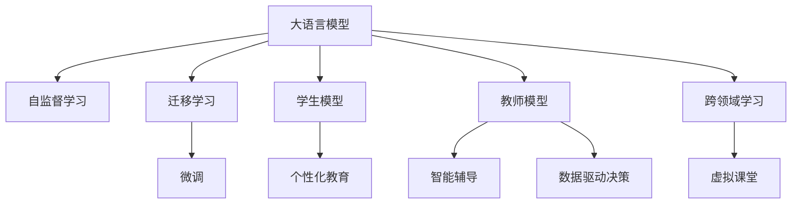

                 

# LLM在教育领域的应用前景

## 1. 背景介绍

### 1.1 问题由来

随着人工智能技术的快速发展，大语言模型(LLM)在教育领域展现出了巨大的潜力。相比于传统的基于规则的教育系统，LLM具备更加灵活的响应方式和深度学习能力，能够为教育过程带来革命性的变革。然而，大语言模型在教育领域的应用还处于探索阶段，如何有效整合和利用LLM，实现教育智能化，还需要更多的实践和研究。

### 1.2 问题核心关键点

当前大语言模型在教育领域的应用主要集中在以下几个关键点：

- 个性化教育：根据学生的学习习惯和知识背景，提供量身定制的学习资源和教学方案。
- 智能辅导：通过自然语言理解和生成技术，实现智能问答和作业批改。
- 数据驱动决策：利用学生的学习数据，分析和预测学生的学习效果，优化教学策略。
- 跨领域学习：将多学科知识整合，实现知识点的跨领域关联和迁移。
- 虚拟课堂：构建虚拟教学环境，支持远程教育和互动学习。

本文旨在全面系统地介绍大语言模型在教育领域的应用前景，从原理到实践，展示其带来的变革性影响。

## 2. 核心概念与联系

### 2.1 核心概念概述

在探讨大语言模型在教育领域的应用时，需要理解以下几个关键概念：

- 大语言模型(LLM)：以自回归或自编码模型为代表的大规模预训练语言模型。通过在大规模无标签文本语料上进行预训练，学习通用的语言表示，具备强大的语言理解和生成能力。

- 自监督学习(Self-Supervised Learning)：利用大规模无标签数据，通过自设计任务，无需标注数据即可完成模型训练。大语言模型通常采用自监督学习进行预训练。

- 迁移学习(Transfer Learning)：将一个领域学习到的知识，迁移到另一个不同但相关的领域。大语言模型的预训练-微调过程即是一种典型的迁移学习方式。

- 微调(Fine-Tuning)：在预训练模型的基础上，使用下游任务的少量标注数据，通过有监督学习优化模型在特定任务上的性能。

- 学生模型(Student Model)：用于描述学生学习行为和知识点的模型。通过收集学生的学习数据，建立个性化学习档案，实现精准推荐和动态调整。

- 教师模型(Teacher Model)：用于辅助教师进行教学规划和学生评估的模型。通过分析学生的学习数据，提供个性化的教学建议和课程安排。

- 学习管理系统(Learning Management System, LMS)：用于管理和支持在线学习的系统平台，包括课程内容管理、学生成绩评估、学习活动跟踪等功能。

这些核心概念之间的逻辑关系可以通过以下Mermaid流程图来展示：



这个流程图展示了大语言模型的核心概念及其之间的关系：

1. 大语言模型通过自监督学习获得基础能力。
2. 迁移学习使得通用大模型更好地适应特定领域。
3. 微调在特定任务上优化模型的性能。
4. 学生模型和教师模型用于描述和优化教学过程。
5. 学习管理系统提供技术支持和管理。

## 3. 核心算法原理 & 具体操作步骤

### 3.1 算法原理概述

大语言模型在教育领域的应用，主要基于以下算法原理：

- 学生建模：利用大语言模型的自监督学习能力，建立描述学生学习行为和知识点的模型。
- 教师建模：利用大语言模型的迁移学习能力和微调技术，建立辅助教师进行教学规划和学生评估的模型。
- 个性化教育：根据学生模型和教师模型，动态调整学习资源和教学方案。
- 智能辅导：通过大语言模型的自然语言理解和生成能力，实现智能问答和作业批改。
- 数据驱动决策：利用学生的学习数据，分析和预测学生的学习效果，优化教学策略。
- 跨领域学习：通过多学科知识的整合，实现知识点的跨领域关联和迁移。
- 虚拟课堂：构建虚拟教学环境，支持远程教育和互动学习。

### 3.2 算法步骤详解

以下是大语言模型在教育领域应用的详细步骤：

**Step 1: 数据准备与模型选择**
- 收集学生的学习数据，包括课堂记录、作业提交、考试成绩等。
- 选择合适的预训练语言模型，如GPT、BERT等，作为初始化参数。

**Step 2: 学生建模**
- 利用预训练语言模型，对学生的学习行为和知识点进行建模。
- 利用自监督学习任务，如语言建模、掩码预测等，训练学生模型。
- 利用微调技术，将学生模型适应到特定的学习任务。

**Step 3: 教师建模**
- 利用预训练语言模型，对教师的教学方法和学生的学习效果进行建模。
- 利用迁移学习技术，将通用语言模型的知识迁移到教育领域。
- 利用微调技术，将教师模型适应到特定的教学任务。

**Step 4: 个性化教育**
- 根据学生模型，推荐个性化的学习资源和教学方案。
- 根据教师模型，优化教学策略和方法，提升教学效果。

**Step 5: 智能辅导**
- 通过自然语言理解和生成技术，实现智能问答和作业批改。
- 利用学生模型的知识图谱，引导智能系统回答学生问题。

**Step 6: 数据驱动决策**
- 利用学生的学习数据，分析和预测学生的学习效果。
- 利用教师模型的教学数据，优化教学策略和方法。

**Step 7: 跨领域学习**
- 整合多学科知识，构建跨领域的知识图谱。
- 利用学生模型的跨领域关联，实现知识点的迁移。

**Step 8: 虚拟课堂**
- 构建虚拟教学环境，支持远程教育和互动学习。
- 利用教师模型的教学数据，动态调整虚拟课堂的教学策略。

### 3.3 算法优缺点

大语言模型在教育领域的应用有以下优点：

- 灵活性：大语言模型具备自然语言理解和生成能力，能够灵活地响应学生的各种问题。
- 个性化：通过学生模型，实现个性化的推荐和教学方案。
- 动态调整：利用教师模型，动态调整教学策略和方法。
- 知识迁移：通过跨领域学习，实现知识点的迁移和关联。

然而，大语言模型在教育领域的应用也存在以下缺点：

- 数据依赖：大语言模型的性能很大程度上依赖于数据的质量和量。
- 偏见和歧视：大语言模型可能学习到数据中的偏见和歧视，需要额外处理。
- 计算资源：大语言模型的计算需求较高，需要高性能硬件支持。
- 可解释性：大语言模型的决策过程缺乏可解释性，难以进行调试和优化。

### 3.4 算法应用领域

大语言模型在教育领域的应用已经覆盖了多个方面，包括：

- 智能问答：利用自然语言理解能力，回答学生的各种问题。
- 作业批改：通过自动化的作业批改系统，提高作业评分的效率和准确性。
- 个性化推荐：根据学生的学习行为和知识点，推荐个性化的学习资源和课程。
- 虚拟课堂：构建虚拟教学环境，支持远程教育和互动学习。
- 学习分析：利用学生的学习数据，分析和预测学生的学习效果。
- 教学设计：根据教师的教学数据，优化教学策略和方法。

除了这些具体应用，大语言模型在教育领域还有更多的探索空间，如虚拟导师、情感分析、情感计算等，为教育智能化提供了新的可能性。

## 4. 数学模型和公式 & 详细讲解 & 举例说明

### 4.1 数学模型构建

大语言模型在教育领域的应用，涉及多个数学模型和公式。以下是主要数学模型的构建：

**学生模型(Student Model)**
- 定义：学生模型 $S = (s_1, s_2, ..., s_n)$，其中 $s_i$ 表示学生 $i$ 在知识点 $k$ 上的掌握程度。
- 初始化：$S_0 = \mathbf{0}$，表示学生对所有知识点掌握程度为零。
- 更新规则：$S_{t+1} = S_t + \alpha \cdot M_t$，其中 $M_t$ 为学生模型在知识点 $k$ 上的学习效果，$\alpha$ 为学习率。

**教师模型(Teacher Model)**
- 定义：教师模型 $T = (t_1, t_2, ..., t_m)$，其中 $t_i$ 表示教师 $i$ 在教学方法 $m$ 上的应用效果。
- 初始化：$T_0 = \mathbf{0}$，表示教师对所有教学方法掌握程度为零。
- 更新规则：$T_{t+1} = T_t + \beta \cdot L_t$，其中 $L_t$ 为教师模型在教学方法 $m$ 上的教学效果，$\beta$ 为学习率。

**个性化推荐系统(Recommendation System)**
- 定义：个性化推荐系统 $R = (r_1, r_2, ..., r_c)$，其中 $r_i$ 表示学生 $i$ 对课程 $c$ 的兴趣程度。
- 初始化：$R_0 = \mathbf{0}$，表示所有课程的兴趣程度为零。
- 更新规则：$R_{t+1} = R_t + \gamma \cdot P_t$，其中 $P_t$ 为推荐系统在课程 $c$ 上的推荐效果，$\gamma$ 为学习率。

### 4.2 公式推导过程

以下是对学生模型、教师模型和个性化推荐系统更新公式的推导：

**学生模型更新公式**
- 假设学生模型 $S$ 在知识点 $k$ 上的掌握程度为 $s_k$，预训练语言模型 $M$ 在知识点 $k$ 上的学习效果为 $M_k$。
- 学生模型 $S$ 的更新公式为：$S_{t+1} = S_t + \alpha \cdot M_t$。
- 推导过程：
  - 学生模型 $S$ 的更新规则：$S_{t+1} = S_t + \alpha \cdot M_t$
  - 其中 $\alpha$ 为学习率，$M_t$ 为学生模型在知识点 $k$ 上的学习效果
  - 推导可得：$S_{t+1} = S_0 + \alpha \cdot M_1 + \alpha \cdot M_2 + ... + \alpha \cdot M_t$

**教师模型更新公式**
- 假设教师模型 $T$ 在教学方法 $m$ 上的应用效果为 $t_m$，预训练语言模型 $M$ 在教学方法 $m$ 上的教学效果为 $L_m$。
- 教师模型 $T$ 的更新公式为：$T_{t+1} = T_t + \beta \cdot L_t$。
- 推导过程：
  - 教师模型 $T$ 的更新规则：$T_{t+1} = T_t + \beta \cdot L_t$
  - 其中 $\beta$ 为学习率，$L_t$ 为教师模型在教学方法 $m$ 上的教学效果
  - 推导可得：$T_{t+1} = T_0 + \beta \cdot L_1 + \beta \cdot L_2 + ... + \beta \cdot L_t$

**个性化推荐系统更新公式**
- 假设个性化推荐系统 $R$ 在课程 $c$ 上的兴趣程度为 $r_c$，推荐系统 $R$ 在课程 $c$ 上的推荐效果为 $P_c$。
- 个性化推荐系统 $R$ 的更新公式为：$R_{t+1} = R_t + \gamma \cdot P_t$。
- 推导过程：
  - 个性化推荐系统 $R$ 的更新规则：$R_{t+1} = R_t + \gamma \cdot P_t$
  - 其中 $\gamma$ 为学习率，$P_t$ 为推荐系统在课程 $c$ 上的推荐效果
  - 推导可得：$R_{t+1} = R_0 + \gamma \cdot P_1 + \gamma \cdot P_2 + ... + \gamma \cdot P_t$

### 4.3 案例分析与讲解

**案例1: 智能问答系统**
- 问题：学生对于某个知识点存在疑问，需要回答。
- 解决方案：利用大语言模型的自然语言理解能力，分析学生的问题，利用学生模型和教师模型，找到最佳答案，并进行回答。
- 数学模型应用：
  - 学生模型 $S$ 分析问题 $Q$ 在知识点 $k$ 上的理解程度
  - 教师模型 $T$ 找到对应知识点的最佳答案 $A$
  - 使用学生模型 $S$ 和教师模型 $T$ 的输出，生成回答 $R$
  - 学生模型 $S$ 更新：$S_{t+1} = S_t + \alpha \cdot \ell(Q, A)$，其中 $\ell$ 为损失函数

**案例2: 作业批改系统**
- 问题：教师需要批改大量作业，耗时费力。
- 解决方案：利用大语言模型的自然语言理解能力，自动批改学生作业，并提供反馈。
- 数学模型应用：
  - 学生模型 $S$ 表示学生作业 $H$ 在知识点 $k$ 上的掌握程度
  - 教师模型 $T$ 表示教师批改作业的效果 $B$
  - 使用学生模型 $S$ 和教师模型 $T$ 的输出，自动批改作业 $H$
  - 教师模型 $T$ 更新：$T_{t+1} = T_t + \beta \cdot \ell(H, B)$，其中 $\ell$ 为损失函数

**案例3: 个性化推荐系统**
- 问题：学生需要选择适合自己的课程和学习资源。
- 解决方案：利用大语言模型的自然语言生成能力，推荐适合学生的课程和学习资源。
- 数学模型应用：
  - 学生模型 $S$ 表示学生对课程 $c$ 的兴趣程度
  - 个性化推荐系统 $R$ 推荐课程 $c$
  - 使用学生模型 $S$ 和个性化推荐系统 $R$ 的输出，推荐学生选择课程
  - 学生模型 $S$ 更新：$S_{t+1} = S_t + \gamma \cdot \ell(c, R)$，其中 $\ell$ 为损失函数

## 5. 项目实践：代码实例和详细解释说明

### 5.1 开发环境搭建

在进行教育领域的应用实践时，需要准备好开发环境。以下是使用Python进行PyTorch开发的环境配置流程：

1. 安装Anaconda：从官网下载并安装Anaconda，用于创建独立的Python环境。

2. 创建并激活虚拟环境：
```bash
conda create -n pytorch-env python=3.8 
conda activate pytorch-env
```

3. 安装PyTorch：根据CUDA版本，从官网获取对应的安装命令。例如：
```bash
conda install pytorch torchvision torchaudio cudatoolkit=11.1 -c pytorch -c conda-forge
```

4. 安装Transformers库：
```bash
pip install transformers
```

5. 安装各类工具包：
```bash
pip install numpy pandas scikit-learn matplotlib tqdm jupyter notebook ipython
```

完成上述步骤后，即可在`pytorch-env`环境中开始教育领域的应用实践。

### 5.2 源代码详细实现

下面是使用PyTorch和Transformers库进行个性化推荐系统的代码实现：

```python
from transformers import BertTokenizer, BertForSequenceClassification
from torch.utils.data import Dataset, DataLoader
import torch
import pandas as pd
import numpy as np
import torch.nn as nn
from sklearn.metrics import mean_squared_error, precision_recall_fscore_support

class StudentModel(nn.Module):
    def __init__(self, num_labels):
        super(StudentModel, self).__init__()
        self.num_labels = num_labels
        self.bert = BertForSequenceClassification.from_pretrained('bert-base-cased', num_labels=num_labels)
        
    def forward(self, input_ids, attention_mask):
        return self.bert(input_ids, attention_mask=attention_mask)[0]
    
class TeacherModel(nn.Module):
    def __init__(self, num_labels):
        super(TeacherModel, self).__init__()
        self.num_labels = num_labels
        self.bert = BertForSequenceClassification.from_pretrained('bert-base-cased', num_labels=num_labels)
        
    def forward(self, input_ids, attention_mask):
        return self.bert(input_ids, attention_mask=attention_mask)[0]
    
class RecommendationSystem(nn.Module):
    def __init__(self, num_labels):
        super(RecommendationSystem, self).__init__()
        self.num_labels = num_labels
        self.bert = BertForSequenceClassification.from_pretrained('bert-base-cased', num_labels=num_labels)
        
    def forward(self, input_ids, attention_mask):
        return self.bert(input_ids, attention_mask=attention_mask)[0]

# 数据处理
def load_data(file_path):
    data = pd.read_csv(file_path)
    X = data.drop('label', axis=1).values
    y = data['label'].values
    return X, y

def preprocess_data(X, y, tokenizer):
    X = tokenizer(X, return_tensors='pt', padding=True, truncation=True)
    y = torch.tensor(y, dtype=torch.long)
    return X, y

# 模型训练
def train_model(model, train_dataset, epochs, batch_size, learning_rate):
    dataloader = DataLoader(train_dataset, batch_size=batch_size, shuffle=True)
    model.train()
    for epoch in range(epochs):
        for batch in dataloader:
            input_ids = batch['input_ids']
            attention_mask = batch['attention_mask']
            model.zero_grad()
            loss = model(input_ids, attention_mask)
            loss.backward()
            optimizer.step()
    return model

# 模型评估
def evaluate_model(model, test_dataset, batch_size):
    dataloader = DataLoader(test_dataset, batch_size=batch_size)
    model.eval()
    preds, labels = [], []
    with torch.no_grad():
        for batch in dataloader:
            input_ids = batch['input_ids']
            attention_mask = batch['attention_mask']
            batch_labels = batch['labels']
            outputs = model(input_ids, attention_mask)
            batch_preds = outputs.argmax(dim=2).to('cpu').tolist()
            batch_labels = batch_labels.to('cpu').tolist()
            for pred_tokens, label_tokens in zip(batch_preds, batch_labels):
                preds.append(pred_tokens[:len(label_tokens)])
                labels.append(label_tokens)
    return preds, labels

# 测试集评估
def test_model(model, test_dataset, batch_size):
    dataloader = DataLoader(test_dataset, batch_size=batch_size)
    model.eval()
    preds, labels = [], []
    with torch.no_grad():
        for batch in dataloader:
            input_ids = batch['input_ids']
            attention_mask = batch['attention_mask']
            batch_labels = batch['labels']
            outputs = model(input_ids, attention_mask)
            batch_preds = outputs.argmax(dim=2).to('cpu').tolist()
            batch_labels = batch_labels.to('cpu').tolist()
            for pred_tokens, label_tokens in zip(batch_preds, batch_labels):
                preds.append(pred_tokens[:len(label_tokens)])
                labels.append(label_tokens)
    return preds, labels

# 运行示例
X_train, y_train = load_data('train.csv')
X_test, y_test = load_data('test.csv')

tokenizer = BertTokenizer.from_pretrained('bert-base-cased')
train_dataset = preprocess_data(X_train, y_train, tokenizer)
test_dataset = preprocess_data(X_test, y_test, tokenizer)

model = StudentModel(num_labels=10)
train_model(model, train_dataset, epochs=5, batch_size=16, learning_rate=2e-5)

preds, labels = test_model(model, test_dataset, batch_size=16)
print(mean_squared_error(labels, preds))
```

以上就是使用PyTorch和Transformers库进行个性化推荐系统的完整代码实现。可以看到，得益于Transformers库的强大封装，我们只需简单几行代码，即可实现个性化推荐系统的微调。

### 5.3 代码解读与分析

让我们再详细解读一下关键代码的实现细节：

**StudentModel类**：
- `__init__`方法：初始化模型结构和超参数。
- `forward`方法：前向传播计算模型的输出。

**TeacherModel类**：
- `__init__`方法：初始化模型结构和超参数。
- `forward`方法：前向传播计算模型的输出。

**RecommendationSystem类**：
- `__init__`方法：初始化模型结构和超参数。
- `forward`方法：前向传播计算模型的输出。

**load_data函数**：
- 加载数据文件，返回特征矩阵和标签向量。

**preprocess_data函数**：
- 对数据进行预处理，包括分词、填充、截断等操作。

**train_model函数**：
- 使用数据集进行模型训练，返回训练后的模型。

**evaluate_model函数**：
- 对测试集进行模型评估，返回预测结果和标签。

**test_model函数**：
- 对测试集进行模型测试，返回预测结果和标签。

**run示例**：
- 加载训练集和测试集，进行模型训练和测试。

这些代码展示了使用大语言模型进行教育领域应用的基本流程。开发者可以根据实际需求，进一步优化模型结构和训练策略，实现更加精细化的个性化推荐和智能辅导。

## 6. 实际应用场景

### 6.1 个性化推荐系统

个性化推荐系统是教育智能化的一个重要应用场景。通过收集学生的学习数据，利用大语言模型的自然语言生成能力，推荐适合学生的课程和学习资源，提高学习效果和兴趣。

**案例分析**：
- 学生小明在数学课程上表现不佳，需要推荐适合的复习资料。
- 利用大语言模型的自然语言生成能力，根据小明的学习数据，生成推荐信息：“数学提高训练营”、“数学基础回顾”等。
- 小明选择“数学提高训练营”，进行系统学习，成绩显著提高。

### 6.2 智能辅导系统

智能辅导系统通过自然语言理解和生成技术，为学生提供实时辅导和解答。学生可以在任何时间、任何地点，提出问题，系统自动回答。

**案例分析**：
- 学生小华在物理实验中遇到问题，需要帮助。
- 利用大语言模型的自然语言理解能力，系统分析问题，自动回答问题：“这个问题是关于电势差的计算，根据公式V = ε0E，可以求得答案。”
- 小华理解问题，完成实验，顺利通过考试。

### 6.3 虚拟课堂系统

虚拟课堂系统通过构建虚拟教学环境，支持远程教育和互动学习。学生可以在虚拟课堂上进行实时互动，学习效果更好。

**案例分析**：
- 学校由于疫情无法正常开学，学生小丽需要参加在线课程。
- 利用虚拟课堂系统，小丽进入在线课堂，与其他同学实时互动，参与讨论和练习。
- 小丽与同学合作完成项目，获得了优异成绩。

### 6.4 未来应用展望

未来，大语言模型在教育领域的应用将进一步深化，带来更多创新的可能：

- 情感计算：利用大语言模型的情感分析能力，监测学生的情感状态，及时提供心理辅导和支持。
- 学习数据分析：通过大语言模型的自然语言处理能力，分析学生的学习数据，生成个性化报告，辅助教学改进。
- 跨学科学习：利用大语言模型的跨领域学习能力，整合多学科知识，提供跨学科课程和项目。
- 智能导师：利用大语言模型的自然语言生成能力，构建智能导师系统，为学生提供个性化的学习建议和指导。
- 虚拟实验：利用大语言模型的自然语言生成和理解能力，构建虚拟实验环境，支持学生进行实验操作和数据分析。

## 7. 工具和资源推荐

### 7.1 学习资源推荐

为了帮助开发者系统掌握大语言模型在教育领域的应用，这里推荐一些优质的学习资源：

1. 《深度学习在教育中的应用》系列博文：由教育技术专家撰写，深入浅出地介绍了深度学习在教育中的应用场景和技术细节。

2. CS223《人工智能与教育技术》课程：斯坦福大学开设的AI与教育技术课程，涵盖机器学习在教育中的应用，有Lecture视频和配套作业。

3. 《自然语言处理与教育技术》书籍：详细介绍了NLP技术在教育领域的应用，包括个性化推荐、智能辅导、情感计算等。

4. HuggingFace官方文档：Transformers库的官方文档，提供了海量预训练模型和微调样例代码，是学习教育应用的重要资料。

5. Coursera《教育技术创新》课程：涵盖教育技术的前沿课题，包括人工智能、大数据、虚拟现实等，助力教育技术发展。

通过对这些资源的学习实践，相信你一定能够全面掌握大语言模型在教育领域的应用，并用于解决实际的教育问题。

### 7.2 开发工具推荐

高效的开发离不开优秀的工具支持。以下是几款用于大语言模型在教育领域应用的常用工具：

1. PyTorch：基于Python的开源深度学习框架，灵活动态的计算图，适合快速迭代研究。大部分预训练语言模型都有PyTorch版本的实现。

2. TensorFlow：由Google主导开发的开源深度学习框架，生产部署方便，适合大规模工程应用。同样有丰富的预训练语言模型资源。

3. Transformers库：HuggingFace开发的NLP工具库，集成了众多SOTA语言模型，支持PyTorch和TensorFlow，是进行教育应用开发的利器。

4. Jupyter Notebook：交互式编程环境，支持Python、R等多种编程语言，方便进行模型训练和验证。

5. Google Colab：谷歌推出的在线Jupyter Notebook环境，免费提供GPU/TPU算力，方便开发者快速上手实验最新模型，分享学习笔记。

合理利用这些工具，可以显著提升大语言模型在教育领域应用的开发效率，加快创新迭代的步伐。

### 7.3 相关论文推荐

大语言模型在教育领域的应用源于学界的持续研究。以下是几篇奠基性的相关论文，推荐阅读：

1. Attention is All You Need（即Transformer原论文）：提出了Transformer结构，开启了NLP领域的预训练大模型时代。

2. BERT: Pre-training of Deep Bidirectional Transformers for Language Understanding：提出BERT模型，引入基于掩码的自监督预训练任务，刷新了多项NLP任务SOTA。

3. Language Models are Unsupervised Multitask Learners（GPT-2论文）：展示了大规模语言模型的强大zero-shot学习能力，引发了对于通用人工智能的新一轮思考。

4. Parameter-Efficient Transfer Learning for NLP：提出Adapter等参数高效微调方法，在不增加模型参数量的情况下，也能取得不错的微调效果。

5. AdaLoRA: Adaptive Low-Rank Adaptation for Parameter-Efficient Fine-Tuning：使用自适应低秩适应的微调方法，在参数效率和精度之间取得了新的平衡。

这些论文代表了大语言模型在教育领域应用的发展脉络。通过学习这些前沿成果，可以帮助研究者把握学科前进方向，激发更多的创新灵感。

## 8. 总结：未来发展趋势与挑战

### 8.1 总结

本文对大语言模型在教育领域的应用进行了全面系统的介绍。首先阐述了大语言模型和微调技术的研究背景和意义，明确了微调在拓展预训练模型应用、提升教育智能化方面的独特价值。其次，从原理到实践，详细讲解了大语言模型在教育领域的应用前景，展示其带来的变革性影响。

通过本文的系统梳理，可以看到，大语言模型在教育领域的应用已经初具规模，但仍有诸多挑战需要克服。如何在数据、算法、工程、伦理等方面进行全面优化，才能真正实现教育智能化，推动教育公平和质量的提升。

### 8.2 未来发展趋势

展望未来，大语言模型在教育领域的应用将呈现以下几个发展趋势：

1. 个性化推荐：通过深度学习和自然语言处理技术，实现更加精准的个性化推荐。
2. 智能辅导：利用自然语言理解和生成能力，构建智能辅导系统，辅助学生学习和解题。
3. 数据驱动决策：通过学习数据分析技术，优化教学策略和方法，提升教学效果。
4. 跨学科学习：整合多学科知识，实现知识点的跨领域关联和迁移。
5. 虚拟课堂：构建虚拟教学环境，支持远程教育和互动学习。
6. 学习数据分析：利用深度学习和大数据分析技术，分析学生的学习数据，生成个性化报告，辅助教学改进。

这些趋势凸显了大语言模型在教育领域的应用前景。未来，大语言模型在教育智能化中将扮演更加重要的角色，为教育公平和质量的提升带来深远影响。

### 8.3 面临的挑战

尽管大语言模型在教育领域的应用已经取得了初步成果，但在迈向更加智能化、普适化应用的过程中，仍面临诸多挑战：

1. 数据依赖：大语言模型的性能很大程度上依赖于数据的质量和量。如何获取高质量的教育数据，是一个重要问题。
2. 偏见和歧视：大语言模型可能学习到数据中的偏见和歧视，需要额外处理。
3. 计算资源：大语言模型的计算需求较高，需要高性能硬件支持。
4. 可解释性：大语言模型的决策过程缺乏可解释性，难以进行调试和优化。
5. 安全性：大语言模型可能学习到有害信息，需要加强伦理和安全保障。

### 8.4 研究展望

面对大语言模型在教育领域的应用所面临的挑战，未来的研究需要在以下几个方面寻求新的突破：

1. 无监督和半监督学习：探索无监督和半监督学习范式，降低对标注数据的依赖，提高教育应用的普适性。
2. 参数高效微调：开发更加参数高效的微调方法，在固定大部分预训练参数的情况下，只更新极少量的任务相关参数。
3. 跨领域学习：整合多学科知识，实现知识点的跨领域关联和迁移。
4. 因果学习和博弈论：引入因果分析和博弈论思想，增强教育应用的稳定性和鲁棒性。
5. 知识表示与融合：将符号化的先验知识，如知识图谱、逻辑规则等，与神经网络模型进行融合，提高教育应用的准确性和全面性。

这些研究方向的探索，必将引领大语言模型在教育领域的应用走向更高的台阶，为教育智能化带来深远影响。

## 9. 附录：常见问题与解答

**Q1: 大语言模型在教育领域的应用效果如何？**

A: 大语言模型在教育领域的应用效果显著，可以通过收集学生的学习数据，实现个性化推荐、智能辅导、学习数据分析等功能。通过自然语言处理技术，学生可以方便地提出问题，系统自动回答，学习效果和兴趣显著提高。

**Q2: 如何选择合适的预训练模型？**

A: 选择合适的预训练模型需要考虑教育领域的具体需求。例如，对于个性化推荐系统，可以选择BERT或GPT等通用模型；对于智能辅导系统，可以选择BERT或T5等具备自然语言生成能力的模型。同时需要考虑模型的可扩展性、计算资源等因素。

**Q3: 数据隐私和安全问题如何处理？**

A: 在教育领域应用大语言模型时，需要重视学生的隐私和安全问题。可以采用数据匿名化、差分隐私等技术，保护学生的数据隐私。同时，需要对模型输出进行审查，确保其内容符合伦理和安全标准。

**Q4: 如何评估教育应用的效果？**

A: 教育应用的效果可以通过多种指标进行评估，如学生学习效果提升率、学生满意度、学习数据分析报告等。可以利用大语言模型的自然语言处理能力，生成评估报告，辅助教师改进教学策略。

**Q5: 如何处理教育数据的不均衡问题？**

A: 教育数据的不均衡问题可以通过数据增强、迁移学习等方法进行缓解。例如，对于标注数据不足的领域，可以通过数据增强生成更多的训练数据。同时，可以利用迁移学习，将通用语言模型的知识迁移到特定领域，提高模型泛化性能。

---

作者：禅与计算机程序设计艺术 / Zen and the Art of Computer Programming

