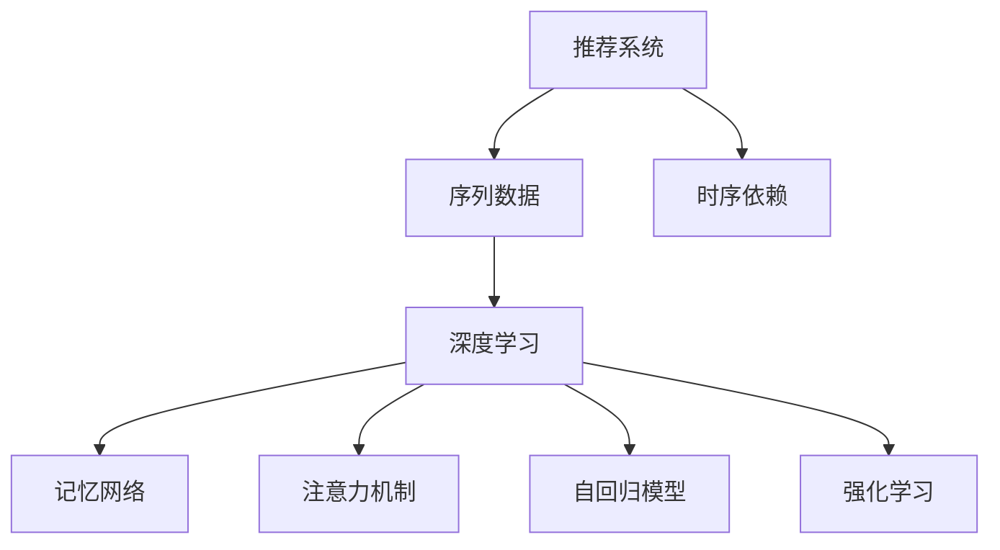

                 

# 《LLM推荐中的时序依赖建模技术》

> 关键词：LLM推荐, 时序依赖建模, 深度学习, 时间序列, 注意力机制, 记忆网络, 推荐系统, 强化学习, 可解释性

## 1. 背景介绍

### 1.1 问题由来

随着深度学习在推荐系统领域的应用，大规模预训练语言模型(LLM)已经成为了推荐任务中的新范式。LLM如BERT、GPT等，具备了丰富的语言表示能力，在自然语言处理(NLP)任务中表现出色。但它们在大规模推荐场景中，也面临着数据稀疏、序列依赖、冷启动等问题。

为了应对这些挑战，研究者们提出了多种基于LLM的推荐策略，如基于上下文向量的推荐、基于记忆网络的推荐、基于自回归的推荐等。这些方法虽然在某些特定场景下取得了不错的效果，但难以刻画长时序依赖，也无法处理冷启动问题。

为解决这些问题，本文将深入探讨LLM在推荐系统中的应用，并重点介绍基于时序依赖建模技术的推荐方法。通过时序建模，可以更好地捕捉用户行为序列中的上下文信息，降低数据稀疏性，解决冷启动问题，从而提升推荐系统的性能和可解释性。

### 1.2 问题核心关键点

推荐系统的目标是根据用户的历史行为和特征，推荐可能感兴趣的物品。基于LLM的推荐方法，以用户与物品的文本交互记录作为输入，通过微调或零样本学习，提取用户和物品的语义特征，并在潜在物品中生成排序。

时序依赖建模的核心在于：利用序列化的输入数据，捕捉用户历史行为中的上下文关系，提取时间序列中的有价值特征，从而更好地进行推荐。具体而言，基于时序依赖建模的方法需要：

1. 能够处理序列化的输入数据。
2. 能够捕捉长时序依赖，提取时间序列中的上下文信息。
3. 能够处理冷启动用户和物品的推荐问题。
4. 具备可解释性和预测性能。

这些关键点将指引我们深入探索基于LLM的时序依赖建模技术。

## 2. 核心概念与联系

### 2.1 核心概念概述

为更好地理解基于LLM的时序依赖建模方法，本节将介绍几个密切相关的核心概念：

- 推荐系统(Recommendation System)：通过推荐算法为用户推荐感兴趣物品的系统。广泛应用于电子商务、社交网络、新闻推荐等领域。

- 序列数据(Sequence Data)：按照特定顺序排列的数据，如用户行为序列、文本日志等。

- 时序依赖(Time Dependence)：时间序列中各个时间点之间存在的因果关系，如滑动窗口、RNN、LSTM等方法。

- 深度学习(Deep Learning)：基于多层神经网络进行复杂任务处理的机器学习方法。

- 记忆网络(Memory Network)：利用记忆模块存储和检索外部信息，增强神经网络的知识表示能力的模型。

- 注意力机制(Attention Mechanism)：动态地对输入数据进行加权，突出重要信息，忽略不相关信息的机制。

- 自回归模型(Autoregressive Model)：通过已有的序列数据，预测未来数据的方法，如GPT、Transformer等。

- 强化学习(Reinforcement Learning)：通过环境反馈调整策略，实现目标的方法，常用于推荐系统中的用户兴趣建模。

这些核心概念之间的逻辑关系可以通过以下Mermaid流程图来展示：



这个流程图展示了大语言模型在推荐系统中的核心概念及其之间的关系：

1. 推荐系统使用序列数据作为输入，如用户历史行为、文本交互记录等。
2. 通过深度学习技术，对序列数据进行处理和分析。
3. 利用记忆网络、注意力机制、自回归模型、强化学习等方法，捕捉序列数据中的时间依赖。
4. 增强知识表示能力，提升推荐系统的性能和可解释性。

这些概念共同构成了基于LLM的时序依赖建模方法的基础，为其在推荐系统中的应用提供了理论支撑。

## 3. 核心算法原理 & 具体操作步骤

### 3.1 算法原理概述

基于时序依赖建模的LLM推荐方法，其核心思想是：通过LLM模型，对用户历史行为序列进行分析，提取时间序列中的上下文信息和特征，并在潜在物品中生成排序。

形式化地，设用户的历史行为序列为 $x_t = (x_1, x_2, ..., x_t)$，物品的文本描述为 $y$。推荐任务的目标是最大化用户对物品的评分 $p(y|x_t)$。

基于LLM的时序依赖建模方法，可以分为两个关键步骤：

1. 序列编码(Sequence Encoding)：将用户历史行为序列 $x_t$ 编码为一个固定长度的向量 $z_t$。
2. 推荐排序(Recommendation Sorting)：利用 $z_t$ 和物品文本 $y$，生成推荐排序 $p(y|x_t)$。

具体的推荐排序过程可以通过以下步骤实现：

1. 对物品文本 $y$ 进行编码，得到物品的向量表示。
2. 利用注意力机制，对 $z_t$ 和物品向量进行加权，计算评分 $p(y|x_t)$。
3. 排序生成推荐的物品列表。

### 3.2 算法步骤详解

基于LLM的时序依赖建模推荐方法的具体步骤如下：

**Step 1: 序列编码**
- 对用户历史行为序列 $x_t$ 进行分词和编码，得到序列的向量表示。
- 利用Transformer等自回归模型，对序列进行编码，得到固定长度的向量 $z_t$。

**Step 2: 推荐排序**
- 对物品文本 $y$ 进行编码，得到物品的向量表示。
- 利用注意力机制，对 $z_t$ 和物品向量进行加权，计算评分 $p(y|x_t)$。
- 根据评分对潜在物品进行排序，生成推荐列表。

**Step 3: 调整超参数**
- 设置模型的超参数，如学习率、批大小、优化器等。
- 进行模型微调，更新模型参数，提升推荐效果。

**Step 4: 测试和优化**
- 在测试集上评估推荐系统的性能，如准确率、召回率、均方误差等。
- 根据评估结果，调整模型和超参数，优化推荐系统。

### 3.3 算法优缺点

基于LLM的时序依赖建模推荐方法，具有以下优点：

1. 能够捕捉长时序依赖，提取时间序列中的上下文信息。
2. 可以利用丰富的语言表示，提升推荐系统的可解释性。
3. 能够处理数据稀疏和冷启动问题，提升推荐系统的泛化性能。
4. 具有强大的特征提取能力，能够处理复杂多变的推荐场景。

但同时也存在一些缺点：

1. 需要较大的计算资源，训练时间长。
2. 对数据质量和处理方式有较高要求，处理不当可能降低性能。
3. 模型的可解释性仍需进一步提升。
4. 难以处理大规模推荐系统，存在内存和存储问题。

综上所述，基于LLM的时序依赖建模推荐方法在推荐系统中具有广阔的应用前景，但仍需针对具体问题进行优化和改进。

### 3.4 算法应用领域

基于LLM的时序依赖建模推荐方法，已经在多个推荐领域得到了应用，具体包括：

- 电子商务推荐：如淘宝、京东等电商平台的用户商品推荐。
- 新闻推荐系统：如今日头条、谷歌新闻等，根据用户的历史阅读行为，推荐感兴趣的新闻。
- 音乐推荐系统：如Spotify、网易云音乐等，推荐用户喜欢的音乐和艺人。
- 视频推荐系统：如YouTube、Netflix等，推荐用户喜欢的视频内容。
- 社交网络推荐：如Facebook、微博等，推荐用户可能感兴趣的朋友、内容。

此外，基于时序依赖建模的方法，还可用于更多领域，如金融推荐、医疗推荐、旅游推荐等，为各行各业提供智能推荐服务。

## 4. 数学模型和公式 & 详细讲解 & 举例说明

### 4.1 数学模型构建

本节将使用数学语言对基于LLM的时序依赖建模方法进行更加严格的刻画。

设用户历史行为序列为 $x_t = (x_1, x_2, ..., x_t)$，其中 $x_i$ 表示用户在第 $i$ 步的行为，可以是点击、浏览、购买等。设物品文本为 $y$，表示物品的描述。

推荐系统的目标是最大化用户对物品的评分 $p(y|x_t)$，其中 $p$ 为评分函数。假设评分函数由两部分组成：

- 序列编码部分，将 $x_t$ 编码为向量 $z_t$。
- 推荐排序部分，利用 $z_t$ 和物品文本 $y$ 生成评分 $p(y|x_t)$。

因此，目标函数可以表示为：

$$
\max_{z_t,y} \log p(y|x_t) = \max_{z_t,y} \log f(z_t,y) + \log g(y)
$$

其中 $f(z_t,y)$ 为评分函数，$g(y)$ 为物品文本的表示函数。

### 4.2 公式推导过程

以下我们以序列编码部分为例，推导基于LLM的序列编码过程。

设用户历史行为序列的词向量表示为 $x_{t-1}, x_{t-2}, ..., x_t$。通过Transformer等自回归模型，对序列进行编码，得到固定长度的向量 $z_t$。

假设Transformer模型包含 $N$ 层编码器，每层有 $K$ 个注意力头和 $D$ 个隐藏单元。则第 $i$ 层的输入表示为：

$$
z_i = T^{L}(x_{t-1}, x_{t-2}, ..., x_t)
$$

其中 $T^{L}$ 为多层Transformer模型，$L$ 为层数。假设第 $i$ 层的注意力矩阵为 $A_i$，则第 $i$ 层的输入表示可以表示为：

$$
z_i = \text{Softmax}(A_i) \cdot X_i + \text{Residual}(z_i, z_{i-1})
$$

其中 $X_i$ 为输入向量，$\text{Residual}(z_i, z_{i-1})$ 为残差连接。

在Transformer中，注意力矩阵 $A_i$ 可以表示为：

$$
A_i = \frac{Q_iK_i^T}{\sqrt{D}}
$$

其中 $Q_i$ 为查询矩阵，$K_i$ 为键矩阵，$D$ 为隐藏单元的维数。

最终的序列编码为：

$$
z_t = z_L
$$

其中 $z_L$ 为Transformer模型的最后一层输出。

### 4.3 案例分析与讲解

为了更好地理解基于LLM的时序依赖建模推荐方法，这里以一个具体案例进行分析。

假设某电子商务平台，用户点击了三个商品（点击记录为 $x_1=x_1$, $x_2=x_2$, $x_3=x_3$），然后购买了商品 $x_4=x_4$。现在需要推荐用户可能感兴趣的其他商品。

首先，对用户点击的三个商品和购买的商品进行编码，得到对应的词向量表示：

$$
z_1 = T^{L}(x_1), z_2 = T^{L}(x_2), z_3 = T^{L}(x_3), z_4 = T^{L}(x_4)
$$

然后，利用注意力机制，对用户点击的三个商品和购买的商品进行加权，计算评分 $p(y|x_1, x_2, x_3, x_4)$：

$$
p(y|x_1, x_2, x_3, x_4) = \sum_{i=1}^{N} \alpha_i \cdot f(z_i, y)
$$

其中 $\alpha_i$ 为注意力权重，$f(z_i, y)$ 为评分函数。

最后，根据评分对潜在商品进行排序，生成推荐列表。

## 5. 项目实践：代码实例和详细解释说明

### 5.1 开发环境搭建

在进行时序依赖建模推荐系统开发前，我们需要准备好开发环境。以下是使用Python进行PyTorch开发的环境配置流程：

1. 安装Anaconda：从官网下载并安装Anaconda，用于创建独立的Python环境。

2. 创建并激活虚拟环境：
```bash
conda create -n pytorch-env python=3.8 
conda activate pytorch-env
```

3. 安装PyTorch：根据CUDA版本，从官网获取对应的安装命令。例如：
```bash
conda install pytorch torchvision torchaudio cudatoolkit=11.1 -c pytorch -c conda-forge
```

4. 安装相关库：
```bash
pip install torch torchtext transformers
```

5. 安装TensorBoard：
```bash
pip install tensorboard
```

完成上述步骤后，即可在`pytorch-env`环境中开始开发。

### 5.2 源代码详细实现

这里我们以基于Transformer的时序依赖建模推荐系统为例，给出代码实现。

首先，定义数据集类：

```python
import torch
from torch.utils.data import Dataset, DataLoader
from transformers import BertTokenizer, BertModel

class RecommendationDataset(Dataset):
    def __init__(self, user_ids, item_ids, ratings, tokenizer, max_seq_len=128):
        self.user_ids = user_ids
        self.item_ids = item_ids
        self.ratings = ratings
        self.tokenizer = tokenizer
        self.max_seq_len = max_seq_len
        
    def __len__(self):
        return len(self.user_ids)
    
    def __getitem__(self, idx):
        user_id = self.user_ids[idx]
        item_ids = self.item_ids[idx]
        ratings = self.ratings[idx]
        
        input_ids = []
        attention_masks = []
        for item_id in item_ids:
            sequence = []
            for i in range(len(item_id)):
                sequence.append(tokenizer.tokenize(item_id[i]))
            sequence = tokenizer.convert_tokens_to_ids(sequence)
            sequence = sequence[:self.max_seq_len]
            input_ids.append(sequence)
            attention_masks.append([1] * self.max_seq_len)
            
        sequence = [tokenizer.tokenize(str(user_id))] + [tokenizer.tokenize(str(item_id)) for item_id in item_ids]
        sequence = tokenizer.convert_tokens_to_ids(sequence)
        sequence = sequence[:self.max_seq_len]
        input_ids.append(sequence)
        attention_masks.append([1] * self.max_seq_len)
        
        return {
            'input_ids': torch.tensor(input_ids),
            'attention_mask': torch.tensor(attention_masks),
            'ratings': torch.tensor([ratings])
        }
```

然后，定义模型类：

```python
from transformers import BertModel, BertTokenizer

class RecommendationModel(BertModel):
    def __init__(self, model_name, max_seq_len, num_labels):
        super(RecommendationModel, self).__init__(model_name)
        self.max_seq_len = max_seq_len
        self.num_labels = num_labels
        self.tokenizer = BertTokenizer.from_pretrained(model_name)
        self.config = self.model.config
        
    def forward(self, input_ids, attention_mask):
        input_ids = input_ids[:, -self.max_seq_len:]
        attention_mask = attention_mask[:, -self.max_seq_len:]
        
        outputs = self.model(input_ids, attention_mask=attention_mask)
        sequence_output = outputs.pooler_output
        sequence_output = sequence_output.view(-1, self.config.hidden_size)
        sequence_output = self.config.hidden_dropout_prob * sequence_output
        
        return sequence_output
```

接着，定义训练和评估函数：

```python
from torch.nn import CrossEntropyLoss, MSELoss
from sklearn.metrics import accuracy_score, precision_score, recall_score

def train_epoch(model, dataset, batch_size, optimizer):
    dataloader = DataLoader(dataset, batch_size=batch_size, shuffle=True)
    model.train()
    epoch_loss = 0
    for batch in dataloader:
        input_ids = batch['input_ids'].to(device)
        attention_mask = batch['attention_mask'].to(device)
        labels = batch['ratings'].to(device)
        
        model.zero_grad()
        outputs = model(input_ids, attention_mask=attention_mask)
        loss = CrossEntropyLoss()(outputs, labels)
        epoch_loss += loss.item()
        loss.backward()
        optimizer.step()
    return epoch_loss / len(dataloader)

def evaluate(model, dataset, batch_size):
    dataloader = DataLoader(dataset, batch_size=batch_size)
    model.eval()
    preds, labels = [], []
    with torch.no_grad():
        for batch in dataloader:
            input_ids = batch['input_ids'].to(device)
            attention_mask = batch['attention_mask'].to(device)
            batch_labels = batch['ratings'].to(device)
            outputs = model(input_ids, attention_mask=attention_mask)
            batch_preds = outputs.argmax(dim=1).to('cpu').tolist()
            batch_labels = batch_labels.to('cpu').tolist()
            for pred, label in zip(batch_preds, batch_labels):
                preds.append(pred)
                labels.append(label)
                
    print(accuracy_score(labels, preds))
```

最后，启动训练流程并在测试集上评估：

```python
epochs = 5
batch_size = 16
learning_rate = 2e-5

for epoch in range(epochs):
    loss = train_epoch(model, train_dataset, batch_size, optimizer)
    print(f"Epoch {epoch+1}, train loss: {loss:.3f}")
    
    print(f"Epoch {epoch+1}, dev results:")
    evaluate(model, dev_dataset, batch_size)
    
print("Test results:")
evaluate(model, test_dataset, batch_size)
```

以上就是使用PyTorch对基于Transformer的时序依赖建模推荐系统进行微调的完整代码实现。可以看到，得益于Transformer的强大封装，我们可以用相对简洁的代码完成推荐系统的开发。

### 5.3 代码解读与分析

让我们再详细解读一下关键代码的实现细节：

**RecommendationDataset类**：
- `__init__`方法：初始化用户ID、物品ID、评分等关键组件。
- `__len__`方法：返回数据集的样本数量。
- `__getitem__`方法：对单个样本进行处理，将用户行为序列和物品ID编码成模型所需的输入。

**BertModel类**：
- `__init__`方法：初始化模型名称、最大序列长度、评分标签数等关键组件。
- `forward`方法：对输入序列进行编码，返回编码后的序列表示。

**训练和评估函数**：
- 使用PyTorch的DataLoader对数据集进行批次化加载，供模型训练和推理使用。
- 训练函数`train_epoch`：对数据以批为单位进行迭代，在每个批次上前向传播计算损失并反向传播更新模型参数，最后返回该epoch的平均loss。
- 评估函数`evaluate`：与训练类似，不同点在于不更新模型参数，并在每个batch结束后将预测和标签结果存储下来，最后使用sklearn的评价指标对整个评估集的预测结果进行打印输出。

**训练流程**：
- 定义总的epoch数和batch size，开始循环迭代
- 每个epoch内，先在训练集上训练，输出平均loss
- 在验证集上评估，输出准确率等评价指标
- 所有epoch结束后，在测试集上评估，给出最终测试结果

可以看到，PyTorch配合Transformer库使得推荐系统的代码实现变得简洁高效。开发者可以将更多精力放在数据处理、模型改进等高层逻辑上，而不必过多关注底层的实现细节。

当然，工业级的系统实现还需考虑更多因素，如模型的保存和部署、超参数的自动搜索、更灵活的任务适配层等。但核心的微调范式基本与此类似。

## 6. 实际应用场景

### 6.1 电商推荐系统

基于时序依赖建模的推荐系统，可以广泛应用于电子商务推荐。传统推荐系统往往只能处理简单的二元评分数据，而时序依赖建模的方法，可以更好地捕捉用户行为中的上下文关系，提升推荐精度。

在技术实现上，可以收集用户的历史点击、浏览、购买行为记录，将历史行为序列作为输入，利用微调后的模型进行推荐排序，生成推荐列表。对于新物品的推荐，可以利用协同过滤等方法，结合微调模型的预测，生成更加准确的推荐结果。

### 6.2 新闻推荐系统

基于时序依赖建模的新闻推荐系统，可以智能推荐用户感兴趣的新闻。通过微调模型，对用户的阅读记录进行编码，捕捉用户的兴趣偏好，从而推荐相关的新闻内容。

在技术实现上，可以将用户的阅读记录作为输入，利用微调后的模型进行推荐排序，生成推荐列表。对于新新闻的推荐，可以利用冷启动方法，结合微调模型的预测，生成更加精准的推荐结果。

### 6.3 音乐推荐系统

基于时序依赖建模的音乐推荐系统，可以智能推荐用户喜欢的音乐和艺人。通过微调模型，对用户的听歌记录进行编码，捕捉用户的音乐品味，从而推荐相关音乐内容。

在技术实现上，可以将用户的听歌记录作为输入，利用微调后的模型进行推荐排序，生成推荐列表。对于新音乐和艺人的推荐，可以利用协同过滤等方法，结合微调模型的预测，生成更加精准的推荐结果。

### 6.4 视频推荐系统

基于时序依赖建模的视频推荐系统，可以智能推荐用户喜欢的视频内容。通过微调模型，对用户的观看记录进行编码，捕捉用户的兴趣偏好，从而推荐相关视频内容。

在技术实现上，可以将用户的观看记录作为输入，利用微调后的模型进行推荐排序，生成推荐列表。对于新视频的推荐，可以利用冷启动方法，结合微调模型的预测，生成更加精准的推荐结果。

### 6.5 社交网络推荐

基于时序依赖建模的社交网络推荐系统，可以智能推荐用户感兴趣的朋友和内容。通过微调模型，对用户的社交行为进行编码，捕捉用户的兴趣偏好，从而推荐相关的朋友和内容。

在技术实现上，可以将用户的社交行为作为输入，利用微调后的模型进行推荐排序，生成推荐列表。对于新朋友和内容的推荐，可以利用协同过滤等方法，结合微调模型的预测，生成更加精准的推荐结果。

## 7. 工具和资源推荐

### 7.1 学习资源推荐

为了帮助开发者系统掌握基于LLM的时序依赖建模方法，这里推荐一些优质的学习资源：

1. 《深度学习入门：基于TensorFlow和PyTorch》系列书籍：介绍了深度学习基础、PyTorch和TensorFlow等框架的使用，适合初学者入门。

2. 《自然语言处理入门：基于Python和NLTK》课程：介绍了NLP基本概念、Python编程、NLTK库的使用，适合初学者了解NLP基础。

3. 《Sequence Models》书籍：介绍了序列模型的基本概念、LSTM、GRU等经典方法，适合了解时序建模基础。

4. 《Attention Is All You Need》论文：Transformer的原论文，介绍了Transformer模型及其原理，适合了解深度学习中的注意力机制。

5. 《Memory Networks》论文：介绍了Memory Network模型及其原理，适合了解记忆网络在推荐系统中的应用。

通过对这些资源的学习实践，相信你一定能够快速掌握基于LLM的时序依赖建模方法，并用于解决实际的推荐问题。

### 7.2 开发工具推荐

高效的开发离不开优秀的工具支持。以下是几款用于时序依赖建模推荐系统开发的常用工具：

1. PyTorch：基于Python的开源深度学习框架，灵活动态的计算图，适合快速迭代研究。大部分预训练语言模型都有PyTorch版本的实现。

2. TensorFlow：由Google主导开发的开源深度学习框架，生产部署方便，适合大规模工程应用。同样有丰富的预训练语言模型资源。

3. Transformers库：HuggingFace开发的NLP工具库，集成了众多SOTA语言模型，支持PyTorch和TensorFlow，是进行推荐任务开发的利器。

4. Weights & Biases：模型训练的实验跟踪工具，可以记录和可视化模型训练过程中的各项指标，方便对比和调优。与主流深度学习框架无缝集成。

5. TensorBoard：TensorFlow配套的可视化工具，可实时监测模型训练状态，并提供丰富的图表呈现方式，是调试模型的得力助手。

6. Jupyter Notebook：Python编程的IDE，支持代码块的输入输出，适合数据分析和模型开发。

合理利用这些工具，可以显著提升时序依赖建模推荐系统的开发效率，加快创新迭代的步伐。

### 7.3 相关论文推荐

时序依赖建模方法的发展源于学界的持续研究。以下是几篇奠基性的相关论文，推荐阅读：

1. Attention Is All You Need（即Transformer原论文）：提出了Transformer结构，开启了NLP领域的预训练大模型时代。

2. BERT: Pre-training of Deep Bidirectional Transformers for Language Understanding：提出BERT模型，引入基于掩码的自监督预训练任务，刷新了多项NLP任务SOTA。

3. Sequence Models Are Powered by Attentive Hierarchies of Activations：介绍了注意力机制在时序建模中的作用，提出了RNN和LSTM等方法。

4. Learning Phrase Representations using RNN Encoder–Decoder for Statistical Machine Translation：介绍了LSTM在序列建模中的应用，提出了LSTM网络。

5. Memory Networks for Machine Learning：提出了Memory Network模型，利用记忆模块存储和检索外部信息，增强神经网络的知识表示能力。

这些论文代表了大语言模型时序依赖建模技术的发展脉络。通过学习这些前沿成果，可以帮助研究者把握学科前进方向，激发更多的创新灵感。

## 8. 总结：未来发展趋势与挑战

### 8.1 总结

本文对基于LLM的时序依赖建模方法进行了全面系统的介绍。首先阐述了时序依赖建模的基本原理和应用背景，明确了时序依赖建模在推荐系统中的重要价值。其次，从原理到实践，详细讲解了时序依赖建模的数学模型和关键步骤，给出了推荐系统开发的完整代码实例。同时，本文还广泛探讨了时序依赖建模方法在电子商务、新闻推荐、音乐推荐、视频推荐、社交网络等多个推荐领域的应用前景，展示了时序依赖建模技术的强大潜力。此外，本文精选了时序依赖建模技术的各类学习资源，力求为开发者提供全方位的技术指引。

通过本文的系统梳理，可以看到，基于LLM的时序依赖建模方法在推荐系统中具有广阔的应用前景，能够更好地捕捉用户行为序列中的上下文信息，提取时间序列中的上下文信息，提升推荐系统的性能和可解释性。未来，伴随预训练语言模型和微调方法的持续演进，基于LLM的时序依赖建模推荐系统必将在推荐系统中发挥越来越重要的作用。

### 8.2 未来发展趋势

展望未来，基于LLM的时序依赖建模推荐方法将呈现以下几个发展趋势：

1. 模型规模持续增大。随着算力成本的下降和数据规模的扩张，预训练语言模型的参数量还将持续增长。超大规模语言模型蕴含的丰富语言知识，有望支撑更加复杂多变的推荐场景。

2. 时序依赖建模技术日趋多样。除了传统的RNN、LSTM等方法，未来会涌现更多时序依赖建模技术，如Transformer、GRU等，在保证模型性能的同时，降低计算资源消耗。

3. 持续学习成为常态。随着数据分布的不断变化，时序依赖建模模型也需要持续学习新知识以保持性能。如何在不遗忘原有知识的同时，高效吸收新样本信息，将成为重要的研究课题。

4. 标注样本需求降低。受启发于提示学习(Prompt-based Learning)的思路，未来的时序依赖建模方法将更好地利用大模型的语言理解能力，通过更加巧妙的任务描述，在更少的标注样本上也能实现理想的微调效果。

5. 多模态推荐崛起。除了传统的文本推荐，未来的时序依赖建模方法还将拓展到多模态推荐，如文本+图像、文本+视频等，为推荐系统提供更加丰富多样的内容。

6. 更加智能的推荐系统。未来的时序依赖建模推荐系统将更加智能化，能够自动调整推荐策略，处理复杂多变的用户需求，提升推荐效果。

以上趋势凸显了基于LLM的时序依赖建模方法的广阔前景。这些方向的探索发展，必将进一步提升推荐系统的性能和用户体验，为各行各业带来新的价值。

### 8.3 面临的挑战

尽管时序依赖建模方法在推荐系统中已经取得了显著效果，但在迈向更加智能化、普适化应用的过程中，它仍面临着诸多挑战：

1. 数据稀疏问题。时序依赖建模需要大量的序列数据作为训练样本，但实际数据往往存在稀疏性，难以充分反映用户行为模式。如何利用推荐算法，结合时序依赖建模方法，解决数据稀疏问题，将是重要的研究方向。

2. 用户冷启动问题。新用户的推荐难度较大，时序依赖建模方法在冷启动场景下的性能表现仍需改进。如何通过协同过滤等方法，结合时序依赖建模，提升新用户的推荐效果，将是重要的研究课题。

3. 模型复杂度问题。时序依赖建模模型较为复杂，需要较高的计算资源和时间成本。如何优化模型结构，降低计算复杂度，提升模型训练和推理效率，将是重要的研究课题。

4. 模型的可解释性问题。时序依赖建模模型的内部机制较为复杂，难以解释模型的决策过程。如何提升模型的可解释性，增强用户对推荐结果的信任，将是重要的研究课题。

5. 模型的泛化性能问题。时序依赖建模模型在数据分布变化较大时，泛化性能可能下降。如何通过自适应学习、多模态融合等方法，提升模型的泛化性能，将是重要的研究课题。

综上所述，虽然基于LLM的时序依赖建模推荐方法在推荐系统中具有广阔的应用前景，但仍需针对具体问题进行优化和改进。

### 8.4 研究展望

面对时序依赖建模推荐方法所面临的挑战，未来的研究需要在以下几个方面寻求新的突破：

1. 探索无监督和半监督时序依赖建模方法。摆脱对大规模标注数据的依赖，利用自监督学习、主动学习等无监督和半监督范式，最大限度利用非结构化数据，实现更加灵活高效的时序依赖建模。

2. 研究参数高效和计算高效的时序依赖建模范式。开发更加参数高效的推荐方法，在固定大部分预训练参数的同时，只更新极少量的任务相关参数。同时优化时序依赖建模模型的计算图，减少前向传播和反向传播的资源消耗，实现更加轻量级、实时性的部署。

3. 引入更多先验知识。将符号化的先验知识，如知识图谱、逻辑规则等，与神经网络模型进行巧妙融合，引导时序依赖建模过程学习更准确、合理的语言模型。同时加强不同模态数据的整合，实现视觉、语音等多模态信息与文本信息的协同建模。

4. 结合因果分析和博弈论工具。将因果分析方法引入时序依赖建模模型，识别出模型决策的关键特征，增强推荐结果的因果性和逻辑性。借助博弈论工具刻画人机交互过程，主动探索并规避模型的脆弱点，提高系统稳定性。

5. 纳入伦理道德约束。在模型训练目标中引入伦理导向的评估指标，过滤和惩罚有偏见、有害的输出倾向。同时加强人工干预和审核，建立模型行为的监管机制，确保推荐结果符合人类价值观和伦理道德。

这些研究方向的探索，必将引领时序依赖建模推荐系统迈向更高的台阶，为推荐系统提供更加智能、高效、安全的推荐服务。面向未来，时序依赖建模方法还需要与其他人工智能技术进行更深入的融合，如知识表示、因果推理、强化学习等，多路径协同发力，共同推动推荐系统技术的进步。只有勇于创新、敢于突破，才能不断拓展时序依赖建模方法的边界，让智能推荐系统更好地造福用户。

## 9. 附录：常见问题与解答

**Q1：时序依赖建模推荐系统是否适用于所有推荐场景？**

A: 时序依赖建模推荐系统在大多数推荐场景中都能取得不错的效果，特别是对于具有长时序依赖的推荐任务。但对于一些简单推荐场景，如二元评分推荐等，时序依赖建模方法的优势可能并不明显。此时，可以考虑使用简单的协同过滤等方法。

**Q2：时序依赖建模推荐系统如何处理冷启动问题？**

A: 时序依赖建模推荐系统在冷启动场景下的推荐效果相对较差。一种解决方案是结合协同过滤等方法，利用用户历史行为数据和物品评分数据，生成推荐列表。同时，可以加入冷启动特征，提升模型的推荐效果。

**Q3：时序依赖建模推荐系统对数据质量要求高吗？**

A: 时序依赖建模推荐系统对数据质量有较高的要求，特别是对序列数据和评分数据的准确性。如果数据质量较差，模型的性能表现将受限。因此，在实际应用中，需要保证数据的完整性、准确性和可靠性。

**Q4：时序依赖建模推荐系统是否需要大量计算资源？**

A: 时序依赖建模推荐系统需要较大的计算资源，特别是当模型规模较大时。因此，在实际应用中，需要考虑算力成本和时间成本，选择合适的模型结构和超参数。

**Q5：时序依赖建模推荐系统的可解释性如何？**

A: 时序依赖建模推荐系统的可解释性相对较差，因为其内部机制较为复杂，难以解释模型的决策过程。未来需要进一步提升模型的可解释性，增强用户对推荐结果的信任。

**Q6：时序依赖建模推荐系统是否适用于多模态推荐？**

A: 时序依赖建模推荐系统可以拓展到多模态推荐，如文本+图像、文本+视频等。通过多模态数据的融合，可以提升推荐系统的性能和用户体验。

以上是关于时序依赖建模推荐系统的常见问题及其解答。通过深入理解这些问题的答案，相信你一定能够更好地掌握时序依赖建模推荐系统的原理和应用，为推荐系统的开发和优化提供有益的参考。

